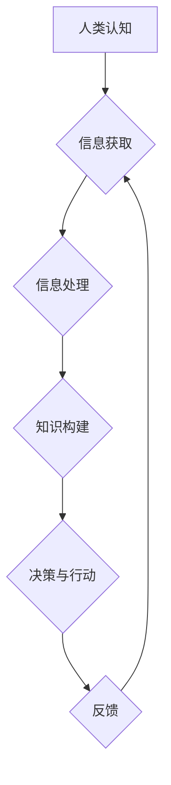

> 人类计算，认知科学，人工智能，神经网络，机器学习，计算模型，人类智能，未来趋势

## 1. 背景介绍

人类文明的进步离不开对自身认知的探索和理解。从古希腊哲学家对“灵魂”的思考，到现代认知科学的兴起，我们一直在试图揭开人类思维的奥秘。而随着人工智能技术的飞速发展，人类对自身认知的理解又迎来了新的契机。

人工智能的快速发展，特别是深度学习技术的突破，使得机器能够模拟人类的某些认知能力，例如图像识别、语言理解和决策制定。然而，人工智能仍然远远无法达到人类的认知水平。人类的认知能力是多方面的，包括语言理解、推理、创造力和情感智能等，这些能力是复杂的相互作用的结果，而人工智能目前还难以完全模拟。

人类计算的概念正是试图从新的角度来理解和探索人类认知。它将人类的认知能力视为一种计算过程，并试图构建数学模型和算法来模拟和解释人类的思维方式。

## 2. 核心概念与联系

**2.1 人类计算的概念**

人类计算是指将人类的认知能力视为一种计算过程，并试图用计算机科学的方法来理解和模拟人类的思维方式。它认为，人类的思维过程可以被分解成一系列的计算步骤，这些步骤可以被编码成算法，并用计算机进行模拟。

**2.2 人类计算与人工智能的关系**

人工智能和人类计算都是试图理解和模拟人类认知的领域，但它们侧重点有所不同。人工智能更侧重于构建能够执行特定任务的智能系统，而人类计算则更侧重于理解人类认知的本质，并构建更通用的认知模型。

**2.3 人类计算的应用领域**

人类计算的应用领域非常广泛，包括：

* **认知科学:** 帮助我们更好地理解人类的思维方式和认知机制。
* **人工智能:** 为人工智能的发展提供新的思路和方法，帮助构建更智能、更接近人类的 AI 系统。
* **教育:** 开发新的教育方法和工具，帮助人们更好地学习和理解知识。
* **医疗:** 帮助医生诊断疾病、制定治疗方案，并提高医疗服务的效率。

**2.4  核心概念原理和架构**



## 3. 核心算法原理 & 具体操作步骤

### 3.1  算法原理概述

人类计算的核心算法原理是将人类的认知过程分解成一系列的计算步骤，并用数学模型和算法来模拟这些步骤。这些算法通常基于神经网络的结构和功能，并借鉴了人类大脑的认知机制。

### 3.2  算法步骤详解

1. **数据获取:** 人类计算算法首先需要获取大量的数据，这些数据可以是文本、图像、音频等各种形式的信息。
2. **数据预处理:** 获取到的数据通常需要进行预处理，例如文本清洗、图像增强等，以提高算法的性能。
3. **特征提取:** 从数据中提取有用的特征，这些特征可以是文本中的关键词、图像中的物体、音频中的音调等。
4. **模型训练:** 使用训练数据训练神经网络模型，让模型能够学习到数据的规律和模式。
5. **模型评估:** 使用测试数据评估模型的性能，并根据评估结果进行模型调优。
6. **预测与推理:** 将训练好的模型应用于新的数据，进行预测和推理。

### 3.3  算法优缺点

**优点:**

* 可以模拟人类的某些认知能力，例如图像识别、语言理解和决策制定。
* 可以处理海量数据，并从中提取有用的信息。
* 可以不断学习和改进，提高其性能。

**缺点:**

* 仍然无法完全模拟人类的认知能力，例如创造力和情感智能。
* 需要大量的训练数据，并且训练过程耗时和耗能。
* 算法的解释性和可解释性较差，难以理解模型的决策过程。

### 3.4  算法应用领域

* **自然语言处理:** 机器翻译、文本摘要、情感分析等。
* **计算机视觉:** 图像识别、物体检测、图像分割等。
* **语音识别:** 语音转文本、语音助手等。
* **医疗诊断:** 疾病诊断、影像分析等。
* **金融分析:** 风险评估、欺诈检测等。

## 4. 数学模型和公式 & 详细讲解 & 举例说明

### 4.1  数学模型构建

人类计算的数学模型通常基于神经网络的结构和功能。神经网络是一种模仿人类大脑结构和功能的计算模型，由多个相互连接的神经元组成。每个神经元接收来自其他神经元的输入信号，并根据这些信号进行计算，输出新的信号。

### 4.2  公式推导过程

神经网络的计算过程可以用数学公式来描述。例如，一个神经元的输出可以表示为：

$$
y = f(w^T x + b)
$$

其中：

* $y$ 是神经元的输出值。
* $f$ 是激活函数，例如 sigmoid 函数或 ReLU 函数。
* $w$ 是神经元的权重向量。
* $x$ 是神经元的输入向量。
* $b$ 是神经元的偏置值。

### 4.3  案例分析与讲解

例如，在图像识别任务中，神经网络可以被训练来识别图像中的物体。训练过程 involves 使用大量的标记图像数据，让神经网络学习到图像特征和物体类别之间的关系。

当输入一张新的图像时，神经网络会将图像特征提取出来，并通过一系列的计算层进行处理，最终输出每个物体的概率。

## 5. 项目实践：代码实例和详细解释说明

### 5.1  开发环境搭建

为了进行人类计算的项目实践，需要搭建一个合适的开发环境。常用的开发环境包括：

* **Python:** Python 是一个流行的编程语言，拥有丰富的机器学习和深度学习库，例如 TensorFlow 和 PyTorch。
* **Jupyter Notebook:** Jupyter Notebook 是一个交互式编程环境，方便进行代码编写、调试和可视化。
* **GPU:** GPU (图形处理单元) 拥有强大的并行计算能力，可以加速深度学习模型的训练过程。

### 5.2  源代码详细实现

以下是一个简单的图像分类示例代码，使用 TensorFlow 库实现：

```python
import tensorflow as tf

# 定义模型结构
model = tf.keras.models.Sequential([
  tf.keras.layers.Conv2D(32, (3, 3), activation='relu', input_shape=(28, 28, 1)),
  tf.keras.layers.MaxPooling2D((2, 2)),
  tf.keras.layers.Conv2D(64, (3, 3), activation='relu'),
  tf.keras.layers.MaxPooling2D((2, 2)),
  tf.keras.layers.Flatten(),
  tf.keras.layers.Dense(10, activation='softmax')
])

# 编译模型
model.compile(optimizer='adam',
              loss='sparse_categorical_crossentropy',
              metrics=['accuracy'])

# 训练模型
model.fit(x_train, y_train, epochs=5)

# 评估模型
loss, accuracy = model.evaluate(x_test, y_test)
print('Test loss:', loss)
print('Test accuracy:', accuracy)
```

### 5.3  代码解读与分析

这段代码定义了一个简单的卷积神经网络模型，用于图像分类任务。

* `tf.keras.models.Sequential` 创建了一个顺序模型，将各个层依次连接起来。
* `tf.keras.layers.Conv2D` 是卷积层，用于提取图像特征。
* `tf.keras.layers.MaxPooling2D` 是最大池化层，用于降低特征图的大小，提高模型的鲁棒性。
* `tf.keras.layers.Flatten` 将多维特征图转换为一维向量。
* `tf.keras.layers.Dense` 是全连接层，用于分类。
* `model.compile` 编译模型，指定优化器、损失函数和评价指标。
* `model.fit` 训练模型，使用训练数据进行训练。
* `model.evaluate` 评估模型，使用测试数据评估模型的性能。

### 5.4  运行结果展示

训练完成后，可以将模型应用于新的图像数据进行预测。

## 6. 实际应用场景

### 6.1  医疗诊断

人类计算可以帮助医生更快、更准确地诊断疾病。例如，可以训练神经网络模型来识别医学影像中的异常，例如 X 光片中的肺结核或 CT 图像中的肿瘤。

### 6.2  金融风险评估

人类计算可以帮助金融机构评估风险，例如识别欺诈交易或预测股票价格走势。

### 6.3  个性化教育

人类计算可以帮助开发个性化的教育方案，根据学生的学习进度和能力提供定制化的学习内容和教学方法。

### 6.4  未来应用展望

随着人工智能技术的不断发展，人类计算将在更多领域得到应用，例如：

* **自动驾驶:** 人类计算可以帮助开发更安全、更智能的自动驾驶系统。
* **机器人技术:** 人类计算可以帮助开发更灵活、更智能的机器人。
* **虚拟现实和增强现实:** 人类计算可以帮助创建更逼真的虚拟现实和增强现实体验。

## 7. 工具和资源推荐

### 7.1  学习资源推荐

* **斯坦福大学 CS229 课程:** https://cs229.stanford.edu/
* **MIT 6.S191 课程:** https://introtodeeplearning.com/
* **Deep Learning Book:** https://www.deeplearningbook.org/

### 7.2  开发工具推荐

* **TensorFlow:** https://www.tensorflow.org/
* **PyTorch:** https://pytorch.org/
* **Keras:** https://keras.io/

### 7.3  相关论文推荐

* **AlexNet:** http://papers.nips.cc/paper/4824-imagenet-classification-with-deep-convolutional-neural-networks.pdf
* **VGGNet:** http://arxiv.org/abs/1409.1556
* **ResNet:** http://arxiv.org/abs/1512.03385

## 8. 总结：未来发展趋势与挑战

### 8.1  研究成果总结

人类计算的研究取得了显著的进展，在图像识别、语音识别、自然语言处理等领域取得了突破性的成果。

### 8.2  未来发展趋势

未来，人类计算的研究将朝着以下几个方向发展：

* **更强大的计算模型:** 开发更强大的计算模型，例如 Transformer 模型，以更好地模拟人类的认知能力。
* **更有效的训练方法:** 开发更有效的训练方法，例如迁移学习和联邦学习，以降低训练成本和提高模型的泛化能力。
* **更可解释的模型:** 开发更可解释的模型，以便更好地理解模型的决策过程。
* **更广泛的应用场景:** 将人类计算应用于更多领域，例如医疗、教育、金融等。

### 8.3  面临的挑战

人类计算仍然面临着一些挑战：

* **数据获取和隐私问题:** 人类计算需要大量的训练数据，而获取这些数据可能会涉及隐私问题。
* **模型解释性和可信度:** 人类计算模型的决策过程往往难以解释，这可能会影响模型的可信度。
* **伦理问题:** 人类计算的应用可能会带来一些伦理问题，例如算法偏见和人工智能的控制问题。

### 8.4  研究展望

尽管面临着挑战，但人类计算仍然是一个充满希望的领域。随着技术的不断发展，相信人类计算将在未来发挥越来越重要的作用，帮助我们更好地理解人类认知，并构建更智能、更美好的未来。

## 9. 附录：常见问题与解答

**Q1: 人类计算和人工智能有什么区别？**

**A1:** 人类计算和人工智能都是试图理解和