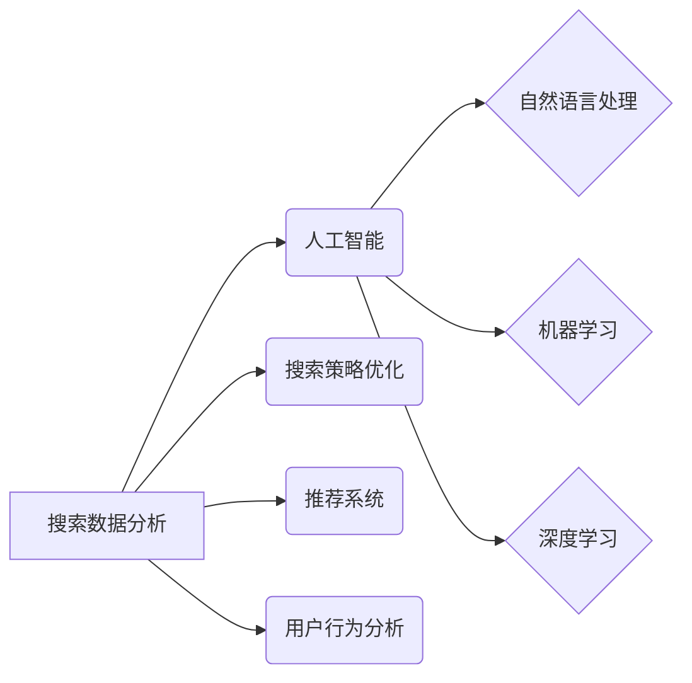

> 搜索数据分析,电商平台,搜索策略优化,人工智能,机器学习,推荐系统,自然语言处理,用户行为分析

## 1. 背景介绍

在当今数字经济时代，电商平台已成为人们购物的首选方式。然而，庞大的商品种类和海量用户数据给搜索策略的优化带来了巨大挑战。传统的搜索引擎依靠关键词匹配，难以满足用户多样化的搜索需求，导致用户体验下降，转化率降低。

人工智能（AI）技术的兴起为电商平台搜索策略优化提供了新的思路和方法。通过对海量搜索数据进行分析和挖掘，AI可以帮助电商平台：

* **理解用户搜索意图:**  AI可以分析用户搜索词、浏览历史、购买记录等数据，识别用户的真实需求，并提供更精准的搜索结果。
* **个性化推荐:**  AI可以根据用户的兴趣偏好、购买习惯等信息，推荐个性化的商品，提升用户购物体验。
* **优化搜索结果排序:**  AI可以根据用户点击、停留时间、转化率等数据，动态调整搜索结果的排序，提升用户搜索效率。
* **预测用户需求:**  AI可以分析历史数据和趋势，预测用户的未来需求，提前准备商品和促销活动。

## 2. 核心概念与联系

**2.1 搜索数据分析**

搜索数据分析是指对电商平台用户搜索行为数据进行收集、存储、分析和挖掘，以获取用户搜索意图、需求趋势等信息。

**2.2 人工智能 (AI)**

人工智能是指模拟人类智能行为的计算机系统。在搜索数据分析领域，AI主要应用于以下几个方面：

* **自然语言处理 (NLP):**  用于理解和处理用户自然语言输入，例如搜索词、评论等。
* **机器学习 (ML):**  用于从海量数据中学习模式和规律，例如用户搜索行为、商品属性等。
* **深度学习 (DL):**  一种更高级的机器学习方法，能够处理更复杂的数据，例如图像、视频等。

**2.3 搜索策略优化**

搜索策略优化是指通过分析用户搜索行为数据，调整搜索引擎算法和规则，以提升用户搜索体验和转化率。

**2.4 推荐系统**

推荐系统是指根据用户的兴趣偏好、购买习惯等信息，推荐个性化的商品或内容。

**2.5 用户行为分析**

用户行为分析是指对用户在电商平台上的行为进行分析，例如浏览历史、购买记录、评价等，以了解用户的需求和偏好。

**2.6  核心概念关系图**



## 3. 核心算法原理 & 具体操作步骤

### 3.1  算法原理概述

在电商平台搜索数据分析中，常用的算法包括：

* **关键词匹配:**  根据用户输入的关键词，匹配商品标题、描述等信息。
* **TF-IDF:**  一种统计方法，用于衡量关键词在文档中的重要性。
* **BM25:**  一种改进的关键词匹配算法，考虑了关键词在文档中的位置和频率。
* **协同过滤:**  根据用户的历史行为，推荐与之兴趣相似的用户或商品。
* **内容推荐:**  根据商品的属性和描述，推荐与用户兴趣相似的商品。

### 3.2  算法步骤详解

以关键词匹配算法为例，其具体操作步骤如下：

1. **数据预处理:**  对用户输入的关键词进行清洗、分词等处理，去除停用词、标点符号等。
2. **关键词匹配:**  将预处理后的关键词与商品标题、描述等信息进行匹配，计算匹配度。
3. **排序结果:**  根据匹配度排序结果，将最相关的商品显示在搜索结果页面顶部。

### 3.3  算法优缺点

**关键词匹配算法:**

* **优点:**  简单易实现，计算效率高。
* **缺点:**  难以理解用户模糊搜索意图，结果可能不精准。

**TF-IDF、BM25算法:**

* **优点:**  能够更好地衡量关键词在文档中的重要性，提高搜索结果的精准度。
* **缺点:**  计算复杂度较高，需要大量的训练数据。

**协同过滤、内容推荐算法:**

* **优点:**  能够提供个性化的推荐，提升用户体验。
* **缺点:**  需要大量的用户行为数据，容易出现冷启动问题。

### 3.4  算法应用领域

* **电商平台搜索:**  帮助用户快速找到所需商品。
* **信息检索:**  帮助用户从海量信息中找到所需内容。
* **推荐系统:**  根据用户的兴趣偏好，推荐个性化的商品或内容。
* **广告投放:**  根据用户的兴趣和行为，精准投放广告。

## 4. 数学模型和公式 & 详细讲解 & 举例说明

### 4.1  数学模型构建

**4.1.1 TF-IDF 模型**

TF-IDF 模型用于衡量关键词在文档中的重要性。

* **TF (Term Frequency):**  关键词在文档中出现的频率。
* **IDF (Inverse Document Frequency):**  关键词在整个语料库中出现的频率的倒数。

**公式:**

$$TF-IDF(t, d) = TF(t, d) \times IDF(t)$$

其中：

* $t$ 表示关键词
* $d$ 表示文档
* $TF(t, d)$ 表示关键词 $t$ 在文档 $d$ 中出现的频率
* $IDF(t)$ 表示关键词 $t$ 在整个语料库中出现的频率的倒数

**4.1.2 BM25 模型**

BM25 模型是一种改进的关键词匹配算法，考虑了关键词在文档中的位置和频率。

**公式:**

$$Score(d, q) = \sum_{t \in q} \frac{(k_1 + 1) * TF(t, d) * IDF(t)}{ (TF(t, d) + k_1 * (1 - b + b * (|d| / |avgdl|))) * IDF(t) + k_3}$$

其中：

* $d$ 表示文档
* $q$ 表示查询
* $t$ 表示关键词
* $TF(t, d)$ 表示关键词 $t$ 在文档 $d$ 中出现的频率
* $IDF(t)$ 表示关键词 $t$ 在整个语料库中出现的频率的倒数
* $k_1$, $k_3$, $b$ 为模型参数

### 4.2  公式推导过程

**4.2.1 TF-IDF 模型推导**

TF-IDF 模型的推导过程如下：

1. **TF:**  关键词在文档中出现的频率越高，其重要性越高。
2. **IDF:**  关键词在整个语料库中出现的频率越低，其重要性越高。
3. **TF-IDF:**  将 TF 和 IDF 相乘，得到关键词在文档中的重要性得分。

**4.2.2 BM25 模型推导**

BM25 模型的推导过程较为复杂，涉及到信息检索领域的多个概念和算法。

### 4.3  案例分析与讲解

**4.3.1 TF-IDF 应用案例**

假设我们有一个电商平台，用户搜索关键词 "手机壳"。

* TF-IDF 模型可以计算每个商品标题和描述中 "手机壳" 的 TF-IDF 值。
* TF-IDF 值高的商品，表示其与 "手机壳" 关键词相关性强，将会在搜索结果页面排名靠前。

**4.3.2 BM25 应用案例**

假设我们有一个信息检索系统，用户搜索关键词 "人工智能"。

* BM25 模型可以计算每个文档中 "人工智能" 的 BM25 值。
* BM25 值高的文档，表示其与 "人工智能" 关键词相关性强，将会在搜索结果页面排名靠前。

## 5. 项目实践：代码实例和详细解释说明

### 5.1  开发环境搭建

* **操作系统:**  Linux/macOS/Windows
* **编程语言:**  Python
* **库依赖:**  scikit-learn, NLTK, gensim

### 5.2  源代码详细实现

```python
# TF-IDF 模型实现
from sklearn.feature_extraction.text import TfidfVectorizer

# 数据准备
documents = [
    "This is the first document.",
    "This document is the second document.",
    "And this is the third one.",
    "Is this the first document?"
]

# 创建 TF-IDF 向量化器
vectorizer = TfidfVectorizer()

# 将文本数据转换为 TF-IDF 向量
tfidf_matrix = vectorizer.fit_transform(documents)

# 打印 TF-IDF 向量
print(tfidf_matrix.toarray())

# BM25 模型实现
from sklearn.feature_extraction.text import BM25

# 数据准备
documents = [
    "This is the first document.",
    "This document is the second document.",
    "And this is the third one.",
    "Is this the first document?"
]
query = "document"

# 创建 BM25 向量化器
bm25 = BM25(n_grams= (1, 2))

# 将文本数据转换为 BM25 向量
bm25_matrix = bm25.fit_transform(documents)
query_vector = bm25.transform([query])

# 计算 BM25 得分
scores = bm25_matrix.dot(query_vector.T)

# 打印 BM25 得分
print(scores)
```

### 5.3  代码解读与分析

* **TF-IDF 模型:**  代码首先使用 `TfidfVectorizer` 类将文本数据转换为 TF-IDF 向量。然后，使用 `toarray()` 方法将 TF-IDF 向量转换为 NumPy 数组，并打印出来。
* **BM25 模型:**  代码首先使用 `BM25` 类将文本数据转换为 BM25 向量。然后，使用 `transform()` 方法将查询语句转换为 BM25 向量。最后，使用 `dot()` 方法计算 BM25 得分，并打印出来。

### 5.4  运行结果展示

运行上述代码，将会输出 TF-IDF 向量和 BM25 得分。

## 6. 实际应用场景

### 6.1  电商平台搜索优化

* **个性化搜索:**  根据用户的历史搜索记录、购买记录、浏览记录等信息，为用户提供个性化的搜索结果。
* **智能推荐:**  根据用户的兴趣偏好、购买习惯等信息，推荐与之相关的商品。
* **搜索结果排序:**  根据用户的搜索行为数据，动态调整搜索结果的排序，提升用户搜索效率。

### 6.2  信息检索系统

* **精准检索:**  根据用户的搜索关键词，精准检索相关信息。
* **知识图谱构建:**  通过分析海量文本数据，构建知识图谱，提升信息检索的准确性和效率。
* **问答系统:**  根据用户的自然语言提问，自动生成准确的答案。

### 6.3  广告投放

* **精准广告投放:**  根据用户的兴趣偏好、行为数据等信息，精准投放广告。
* **广告效果优化:**  通过分析广告点击率、转化率等数据，优化广告投放策略。
* **用户画像构建:**  通过分析用户的广告行为数据，构建用户画像，为广告投放提供更精准的依据。

### 6.4  未来应用展望

随着人工智能技术的不断发展，搜索数据分析将在更多领域得到应用，例如：

* **医疗健康:**  帮助医生更快、更准确地诊断疾病，推荐个性化的治疗方案。
* **教育培训:**  根据学生的学习情况，提供个性化的学习内容和辅导。
* **金融投资:**  分析市场数据，预测股票价格走势，帮助投资者做出更明智的投资决策。

## 7. 工具和资源推荐

### 7.1  学习资源推荐

* **书籍:**
    *