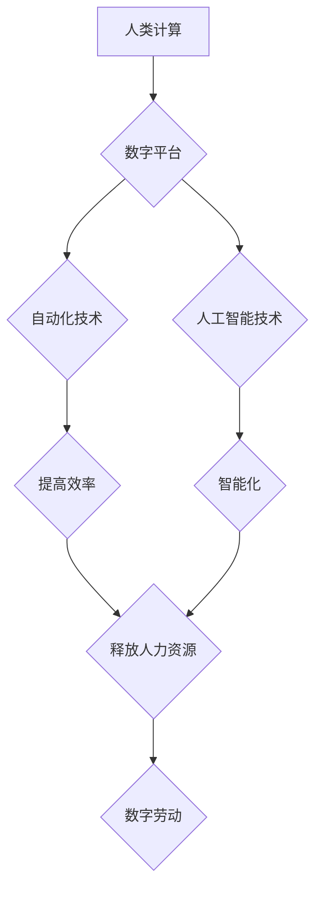

> 数字劳动，人类计算，自动化，人工智能，社会影响，经济影响，未来趋势

## 1. 背景介绍

随着科技的飞速发展，人工智能（AI）和自动化技术正在深刻地改变着人类社会。其中，数字劳动作为一种新的劳动形式，逐渐成为社会和经济发展的重要组成部分。数字劳动是指利用计算机和网络进行的各种工作，包括数据分析、编程、软件开发、网络营销、在线教育等。

数字劳动的兴起，一方面源于信息技术的进步，另一方面也与全球经济结构的转变密切相关。随着互联网的普及和移动设备的广泛应用，数字平台为数字劳动提供了新的空间和机会。同时，全球化和产业升级也推动了对数字技能的需求不断增长。

## 2. 核心概念与联系

**2.1 数字劳动与人类计算**

数字劳动本质上是一种人类计算的延伸。人类计算是指人类利用自己的认知能力和逻辑思维进行信息处理和决策的过程。在数字时代，人类计算不再局限于纸笔和脑力，而是借助计算机和网络工具，以更快速、更高效的方式进行信息处理和分析。

**2.2 数字劳动与自动化**

自动化技术在数字劳动中扮演着越来越重要的角色。自动化可以帮助人类完成重复性、规则性、高强度的工作，从而释放人类的创造力和智力资源。例如，机器学习算法可以自动识别图像、分析文本、预测趋势，而机器人可以自动完成生产线上的操作。

**2.3 数字劳动与人工智能**

人工智能技术正在深刻地改变着数字劳动的形态。人工智能可以模拟人类的认知能力，例如学习、推理、决策等，从而完成更复杂、更智能化的任务。例如，AI驱动的聊天机器人可以提供客户服务，AI辅助的写作工具可以帮助人们撰写文章，AI驱动的医疗诊断系统可以辅助医生进行诊断。

**Mermaid 流程图**



## 3. 核心算法原理 & 具体操作步骤

**3.1 算法原理概述**

数字劳动中常用的算法包括机器学习、深度学习、自然语言处理等。这些算法的核心原理是通过训练模型，让模型能够从数据中学习规律，并根据学习到的规律进行预测、分类、识别等操作。

**3.2 算法步骤详解**

1. **数据收集和预处理:** 首先需要收集大量的相关数据，并对数据进行清洗、转换、格式化等预处理操作，以确保数据质量和算法训练的有效性。
2. **模型选择和训练:** 根据具体任务需求选择合适的算法模型，并利用训练数据对模型进行训练，调整模型参数，使其能够准确地完成目标任务。
3. **模型评估和优化:** 对训练好的模型进行评估，使用测试数据评估模型的性能，并根据评估结果对模型进行优化，例如调整模型参数、增加训练数据等。
4. **模型部署和应用:** 将训练好的模型部署到实际应用场景中，例如将图像识别模型部署到手机应用中，将自然语言处理模型部署到聊天机器人中。

**3.3 算法优缺点**

**优点:**

* **自动化程度高:** 可以自动完成重复性、规则性工作，提高效率。
* **准确性高:** 通过训练模型，可以实现高准确率的预测、分类、识别等操作。
* **可扩展性强:** 可以根据需要扩展模型规模和训练数据，提高模型性能。

**缺点:**

* **数据依赖性强:** 算法性能依赖于训练数据的质量和数量。
* **解释性差:** 一些算法模型的决策过程难以解释，难以理解模型的内部机制。
* **伦理风险:** 算法可能存在偏见、歧视等伦理风险，需要谨慎使用。

**3.4 算法应用领域**

数字劳动算法广泛应用于各个领域，例如：

* **金融:** 风险评估、欺诈检测、投资决策
* **医疗:** 疾病诊断、药物研发、患者管理
* **教育:** 个性化学习、智能辅导、在线考试
* **零售:** 商品推荐、客户服务、库存管理
* **制造:** 自动化生产、质量控制、设备维护

## 4. 数学模型和公式 & 详细讲解 & 举例说明

**4.1 数学模型构建**

数字劳动中的许多算法都可以用数学模型来描述。例如，机器学习算法中的线性回归模型可以表示为：

$$y = w_0 + w_1x_1 + w_2x_2 + ... + w_nx_n + \epsilon$$

其中：

* $y$ 是预测值
* $w_0, w_1, w_2, ..., w_n$ 是模型参数
* $x_1, x_2, ..., x_n$ 是输入特征
* $\epsilon$ 是误差项

**4.2 公式推导过程**

线性回归模型的参数可以通过最小二乘法来估计。最小二乘法旨在找到一组参数，使得模型预测值与实际值之间的误差平方和最小。

**4.3 案例分析与讲解**

假设我们想要预测房屋价格，输入特征包括房屋面积、房间数量、地理位置等。我们可以使用线性回归模型来建立房屋价格预测模型。通过训练模型，我们可以得到模型参数，例如房屋面积每增加1平方米，房屋价格会增加多少元。

## 5. 项目实践：代码实例和详细解释说明

**5.1 开发环境搭建**

数字劳动项目开发通常需要使用Python语言和相关的库，例如NumPy、Pandas、Scikit-learn等。

**5.2 源代码详细实现**

```python
import pandas as pd
from sklearn.linear_model import LinearRegression

# 加载数据
data = pd.read_csv('house_price_data.csv')

# 选择特征和目标变量
X = data[['area', 'rooms', 'location']]
y = data['price']

# 创建线性回归模型
model = LinearRegression()

# 训练模型
model.fit(X, y)

# 预测新房子的价格
new_house = pd.DataFrame({'area': [120], 'rooms': [3], 'location': ['city center']})
predicted_price = model.predict(new_house)

# 打印预测结果
print(f'Predicted price: {predicted_price[0]}')
```

**5.3 代码解读与分析**

这段代码首先加载房屋价格数据，然后选择房屋面积、房间数量和地理位置作为特征，房屋价格作为目标变量。接着创建线性回归模型，并使用训练数据训练模型。最后，使用训练好的模型预测新房子的价格。

**5.4 运行结果展示**

运行代码后，会输出新房子的预测价格。

## 6. 实际应用场景

数字劳动在各个行业都有广泛的应用场景，例如：

**6.1 金融行业**

* **风险评估:** 利用机器学习算法分析客户数据，评估客户的信用风险和投资风险。
* **欺诈检测:** 利用人工智能算法识别异常交易行为，防止金融欺诈。
* **投资决策:** 利用数据分析和机器学习算法分析市场趋势，辅助投资决策。

**6.2 医疗行业**

* **疾病诊断:** 利用深度学习算法分析医学影像数据，辅助医生进行疾病诊断。
* **药物研发:** 利用机器学习算法分析药物分子结构和生物活性数据，加速药物研发。
* **患者管理:** 利用人工智能算法分析患者数据，提供个性化的医疗服务。

**6.3 教育行业**

* **个性化学习:** 利用机器学习算法分析学生的学习情况，提供个性化的学习内容和学习路径。
* **智能辅导:** 利用人工智能算法开发智能辅导系统，帮助学生解决学习难题。
* **在线考试:** 利用人工智能算法进行在线考试的评分和批改。

**6.4 未来应用展望**

数字劳动在未来将继续发展和壮大，并对社会和经济产生更深远的影响。例如：

* **自动化程度更高:** 更先进的自动化技术将进一步解放人类的生产力。
* **智能化程度更高:** 更智能的人工智能将能够完成更复杂、更创造性的任务。
* **个性化程度更高:** 数字劳动将更加注重个性化，提供更加定制化的服务和体验。

## 7. 工具和资源推荐

**7.1 学习资源推荐**

* **在线课程:** Coursera、edX、Udacity等平台提供丰富的机器学习、深度学习、自然语言处理等课程。
* **书籍:** 《深度学习》、《机器学习实战》、《自然语言处理入门》等书籍。
* **开源项目:** TensorFlow、PyTorch、Scikit-learn等开源项目提供丰富的代码示例和学习资源。

**7.2 开发工具推荐**

* **Python:** 作为数字劳动的主要编程语言，Python拥有丰富的库和工具，例如NumPy、Pandas、Scikit-learn等。
* **Jupyter Notebook:** 用于编写和运行Python代码的交互式笔记本环境。
* **Git:** 用于版本控制和代码协作的工具。

**7.3 相关论文推荐**

* **《ImageNet Classification with Deep Convolutional Neural Networks》**
* **《Attention Is All You Need》**
* **《BERT: Pre-training of Deep Bidirectional Transformers for Language Understanding》**

## 8. 总结：未来发展趋势与挑战

**8.1 研究成果总结**

数字劳动领域取得了显著的进展，人工智能技术在数字劳动中发挥着越来越重要的作用。

**8.2 未来发展趋势**

* **自动化程度更高:** 更先进的自动化技术将进一步解放人类的生产力。
* **智能化程度更高:** 更智能的人工智能将能够完成更复杂、更创造性的任务。
* **个性化程度更高:** 数字劳动将更加注重个性化，提供更加定制化的服务和体验。

**8.3 面临的挑战**

* **数据安全和隐私保护:** 数字劳动依赖于大量数据，如何保障数据安全和隐私保护是一个重要的挑战。
* **算法偏见和歧视:** 算法可能存在偏见和歧视，需要采取措施避免算法歧视。
* **就业市场变化:** 数字劳动可能会导致部分工作岗位消失，需要做好应对就业市场变化的准备。

**8.4 研究展望**

未来，数字劳动领域的研究将更加注重以下方面：

* **更安全、更可靠的人工智能算法**
* **更公平、更公正的数字劳动平台**
* **数字劳动与人类社会和谐共处的机制**

## 9. 附录：常见问题与解答

**9.1 数字劳动会取代人类工作吗？**

数字劳动会改变一些工作模式，但不会完全取代人类工作。数字劳动更像是人类工作的一种辅助工具，可以帮助人类完成更复杂、更高效的工作。

**9.2 如何学习数字劳动技能？**

可以通过在线课程、书籍、开源项目等方式学习数字劳动技能。

**9.3 数字劳动对社会有哪些影响？**

数字劳动会对社会产生积极和消极的影响。积极方面包括提高效率、创造新的就业机会；消极方面包括加剧社会不平等、导致部分工作岗位消失。


作者：禅与计算机程序设计艺术 / Zen and the Art of Computer Programming 
<end_of_turn>