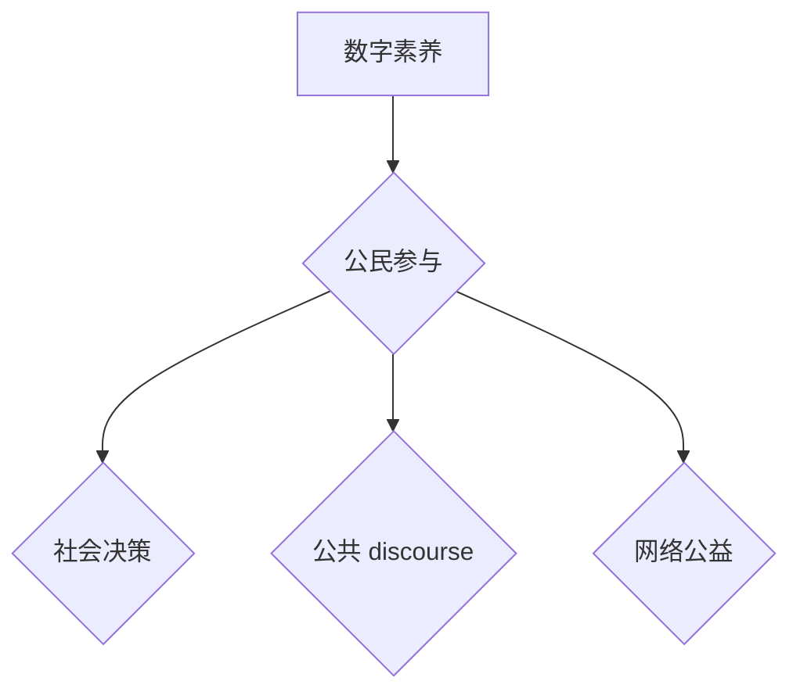

> 数字素养，公民参与，信息时代，科技伦理，数据隐私，网络安全，数字公民

## 1. 背景介绍

信息时代，数字技术已深刻地改变着人类生活方式，网络已成为人们获取信息、交流互动、参与社会的重要平台。在这个数字化的世界里，拥有数字素养已成为公民参与社会、维护自身权益、创造美好未来的关键。

数字素养是指在数字环境中获取、处理、创造和分享信息的能力，它涵盖了广泛的知识、技能和态度，包括：

* **信息获取与筛选:** 能够有效地利用搜索引擎、网络资源等获取所需信息，并能够辨别真伪、筛选可靠信息。
* **数字工具使用:** 能够熟练使用各种数字工具，例如电脑、手机、软件等，并能够进行基本的编程和数据分析。
* **网络安全意识:** 能够理解网络安全风险，并采取措施保护自身信息安全，例如设置强密码、防范网络钓鱼等。
* **数字公民责任:** 能够在网络环境中遵守法律法规，尊重他人，传播正能量，积极参与网络公益活动。

## 2. 核心概念与联系

数字素养是公民参与的基石，它为公民提供了参与数字社会、表达自身观点、影响社会决策的工具和能力。

**数字素养与公民参与的关系**



**数字素养与公民参与的联系**

* **信息获取与传播:** 数字素养使公民能够获取更多信息，并能够有效地传播自己的观点和想法，从而参与到公共讨论和决策中。
* **组织与协作:** 数字工具和平台为公民提供了组织和协作的平台，例如社交媒体、在线论坛等，使公民能够更容易地团结起来，共同参与社会活动。
* **监督与问责:** 数字素养使公民能够利用网络平台监督政府和企业行为，并对不当行为进行问责，从而促进社会透明度和问责机制的完善。

## 3. 核心算法原理 & 具体操作步骤

### 3.1  算法原理概述

数字素养的提升需要依靠多种算法和技术手段，例如：

* **信息检索算法:** 用于帮助用户快速找到所需信息，例如搜索引擎的PageRank算法。
* **内容推荐算法:** 用于根据用户的兴趣和行为推荐相关内容，例如社交媒体的推荐算法。
* **网络分析算法:** 用于分析网络结构和用户关系，例如社交网络分析算法。
* **机器学习算法:** 用于识别网络欺诈、预测用户行为等，例如反垃圾邮件算法。

### 3.2  算法步骤详解

以信息检索算法为例，其基本步骤如下：

1. **用户输入查询:** 用户输入关键词或短语作为查询。
2. **关键词提取:** 系统提取查询中的关键词。
3. **网页索引:** 系统对网页内容进行索引，建立关键词与网页的映射关系。
4. **匹配度计算:** 系统根据关键词的权重和网页的相关性计算网页的匹配度。
5. **排序结果:** 系统根据匹配度对网页进行排序，并将排序结果返回给用户。

### 3.3  算法优缺点

信息检索算法的优点是能够快速准确地找到相关信息，缺点是容易受到关键词选择和算法参数的影响，可能导致结果不全面或不准确。

### 3.4  算法应用领域

信息检索算法广泛应用于搜索引擎、电商平台、知识库等领域，为用户提供便捷的信息获取服务。

## 4. 数学模型和公式 & 详细讲解 & 举例说明

### 4.1  数学模型构建

信息检索算法中常用的数学模型是TF-IDF模型，它用于衡量关键词在网页中的重要性。

**TF-IDF模型公式:**

$$TF-IDF(t, d) = TF(t, d) \times IDF(t)$$

其中：

* $TF(t, d)$ 表示关键词 $t$ 在网页 $d$ 中的词频。
* $IDF(t)$ 表示关键词 $t$ 在整个语料库中的逆向文档频率。

**TF(t, d) 公式:**

$$TF(t, d) = \frac{f(t, d)}{\sum_{t' \in d} f(t', d)}$$

其中：

* $f(t, d)$ 表示关键词 $t$ 在网页 $d$ 中出现的次数。
* $\sum_{t' \in d} f(t', d)$ 表示网页 $d$ 中所有关键词出现的总次数。

**IDF(t) 公式:**

$$IDF(t) = log_e \frac{N}{df(t)}$$

其中：

* $N$ 表示语料库中所有网页的总数。
* $df(t)$ 表示关键词 $t$ 在语料库中出现的网页数。

### 4.2  公式推导过程

TF-IDF模型的公式推导过程基于信息论和统计学原理。

* **词频 (TF):** 词频衡量关键词在网页中出现的频率，频率越高，关键词在该网页中的重要性越高。
* **逆向文档频率 (IDF):** 逆向文档频率衡量关键词在整个语料库中的稀疏性，稀疏性越高，关键词的权重越高。

TF-IDF模型将词频和逆向文档频率相乘，得到关键词在网页中的权重，从而衡量关键词的重要性。

### 4.3  案例分析与讲解

假设我们有一个语料库包含1000个网页，其中关键词“人工智能”出现在100个网页中。

* $N = 1000$
* $df(t) = 100$

则关键词“人工智能”的IDF值为：

$$IDF(t) = log_e \frac{1000}{100} = log_e 10 = 2.303$$

如果一个网页包含5个关键词“人工智能”，则该网页中关键词“人工智能”的TF值为：

$$TF(t, d) = \frac{5}{100} = 0.05$$

因此，该网页中关键词“人工智能”的TF-IDF值为：

$$TF-IDF(t, d) = 0.05 \times 2.303 = 0.115$$

## 5. 项目实践：代码实例和详细解释说明

### 5.1  开发环境搭建

本项目使用Python语言进行开发，需要安装以下软件：

* Python 3.x
* Numpy
* Scikit-learn

### 5.2  源代码详细实现

```python
from sklearn.feature_extraction.text import TfidfVectorizer

# 文本数据
documents = [
    "This is the first document.",
    "This document is the second document.",
    "And this is the third one.",
    "Is this the first document?"
]

# 创建TF-IDF向量化器
vectorizer = TfidfVectorizer()

# 将文本数据转换为TF-IDF矩阵
tfidf_matrix = vectorizer.fit_transform(documents)

# 打印TF-IDF矩阵
print(tfidf_matrix.toarray())
```

### 5.3  代码解读与分析

* `TfidfVectorizer()` 创建TF-IDF向量化器对象。
* `fit_transform()` 方法将文本数据转换为TF-IDF矩阵。
* `toarray()` 方法将TF-IDF矩阵转换为NumPy数组，以便打印输出。

### 5.4  运行结果展示

运行代码后，将输出一个TF-IDF矩阵，其中每个行代表一个文档，每个列代表一个关键词，矩阵元素表示关键词在文档中的权重。

## 6. 实际应用场景

数字素养的提升在各个领域都有着重要的应用场景：

* **教育:** 帮助学生掌握数字技能，提高学习效率，促进个性化学习。
* **就业:** 帮助求职者掌握数字工具，提升职业竞争力，适应数字经济发展趋势。
* **政府:** 提升政府信息公开透明度，促进公民参与公共决策，提高政府服务效率。
* **企业:** 帮助企业利用数字技术提升运营效率，拓展市场空间，增强竞争力。

### 6.4  未来应用展望

随着数字技术的不断发展，数字素养将成为未来社会不可或缺的技能，其应用场景也将更加广泛。例如：

* **虚拟现实和增强现实:** 数字素养将帮助人们更好地理解和利用虚拟现实和增强现实技术。
* **人工智能和机器学习:** 数字素养将帮助人们理解和应用人工智能和机器学习技术，并应对其带来的挑战。
* **区块链技术:** 数字素养将帮助人们理解和应用区块链技术，并参与到去中心化网络的建设中。

## 7. 工具和资源推荐

### 7.1  学习资源推荐

* **在线课程:** Coursera、edX、Udacity等平台提供丰富的数字素养课程。
* **书籍:** 《数字素养》、《网络安全》、《数据分析》等书籍可以帮助人们深入了解数字素养相关知识。
* **网站:** 政府网站、教育机构网站、科技媒体网站等提供丰富的数字素养相关信息。

### 7.2  开发工具推荐

* **Python:** 广泛应用于数据分析、机器学习等领域，是数字素养学习和应用的常用工具。
* **R:** 专注于统计分析和数据可视化，也是数字素养学习和应用的常用工具。
* **Jupyter Notebook:** 用于编写和运行Python和R代码，方便进行数据分析和可视化。

### 7.3  相关论文推荐

* **"Digital Literacy: A Conceptual Framework for Research and Practice"**
* **"The Impact of Digital Literacy on Student Learning"**
* **"Digital Citizenship in the 21st Century"**

## 8. 总结：未来发展趋势与挑战

### 8.1  研究成果总结

数字素养研究取得了显著进展，形成了较为完善的理论体系和实践经验。

### 8.2  未来发展趋势

数字素养研究将朝着以下方向发展：

* **更加个性化和定制化:** 根据不同用户的需求和背景，提供个性化的数字素养培训和服务。
* **更加注重跨学科融合:** 将数字素养与教育、心理学、社会学等学科融合，形成更加全面的研究视角。
* **更加关注数字伦理和社会影响:** 研究数字素养对社会发展的影响，并探讨如何促进数字素养的健康发展。

### 8.3  面临的挑战

数字素养研究还面临着一些挑战：

* **定义和测量:** 数字素养的概念和测量方法尚无统一标准，需要进一步研究和完善。
* **跨文化差异:** 数字素养的理解和实践存在跨文化差异，需要进行跨文化研究和比较。
* **数字鸿沟:** 数字素养水平存在地域、年龄、收入等方面的差异，需要采取措施缩小数字鸿沟。

### 8.4  研究展望

未来，数字素养研究将继续发挥重要作用，为促进数字社会发展、提升公民素质、构建和谐社会做出贡献。

## 9. 附录：常见问题与解答

**常见问题:**

* 什么是数字素养？
* 数字素养对个人和社会有什么意义？
* 如何提升数字素养？
* 数字素养与网络安全有什么关系？

**解答:**

* 数字素养是指在数字环境中获取、处理、创造和分享信息的能力。
* 数字素养对个人和社会都有着重要的意义，它可以帮助人们更好地参与数字社会、获取信息、解决问题、创造价值。
* 可以通过学习相关课程、阅读书籍、参加培训等方式提升数字素养。
* 数字素养与网络安全密切相关，拥有良好的数字素养可以帮助人们识别网络风险，保护自身信息安全。


作者：禅与计算机程序设计艺术 / Zen and the Art of Computer Programming 
<end_of_turn>