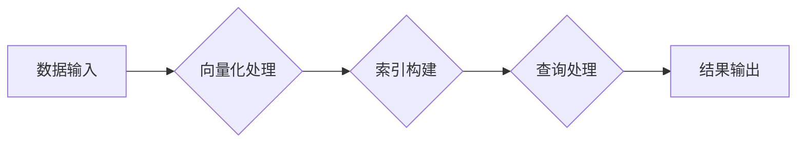

> 向量数据库、数据密集型业务、近似搜索、机器学习、推荐系统、知识图谱、语义搜索

## 1. 背景介绍

在当今数据爆炸的时代，数据密集型业务正日益成为各行各业的核心竞争力。传统的关系型数据库在处理海量结构化数据方面表现出色，但面对海量非结构化数据，例如文本、图像、音频等，其处理能力显得捉襟见肘。

向量数据库应运而生，它以向量作为数据存储和查询的基本单位，能够高效地处理高维数据，并支持近似搜索等高级查询操作。这使得向量数据库成为数据密集型业务，特别是机器学习、推荐系统、知识图谱、语义搜索等领域的理想选择。

## 2. 核心概念与联系

**2.1 向量数据库概述**

向量数据库是一种专门用于存储和查询高维向量数据的数据库。它将数据映射为高维向量，并利用向量空间的几何性质进行查询和检索。

**2.2 向量化表示**

将数据转换为向量是向量数据库的核心概念。各种数据类型，例如文本、图像、音频等，都可以通过不同的方法转换为向量表示。常见的向量化方法包括：

* **词嵌入:** 将单词映射为稠密的向量，例如Word2Vec、GloVe等。
* **图像特征提取:** 使用卷积神经网络(CNN)提取图像的特征向量。
* **音频特征提取:** 使用循环神经网络(RNN)提取音频的特征向量。

**2.3 近似搜索**

向量数据库支持近似搜索，即查询与目标向量距离最近的向量，即使它们不完全匹配。近似搜索算法，例如k-最近邻(k-NN)、FAISS等，能够高效地处理海量数据，并提供高召回率的搜索结果。

**2.4 向量数据库架构**

向量数据库通常由以下几个主要组件组成：

* **索引结构:** 用于快速查找与查询向量相似的向量。常见的索引结构包括KD树、球树、HNSW等。
* **向量存储:** 用于存储高维向量数据。
* **查询引擎:** 用于处理查询请求，并返回与查询向量相似的向量。

**2.5 Mermaid 流程图**



## 3. 核心算法原理 & 具体操作步骤

**3.1 算法原理概述**

向量数据库的核心算法是近似搜索算法，其目的是在高维向量空间中找到与给定查询向量距离最近的向量。

**3.2 算法步骤详解**

1. **数据预处理:** 将数据转换为向量表示。
2. **索引构建:** 使用索引结构将向量数据进行组织和索引。
3. **查询处理:** 将查询向量转换为索引结构的查询格式。
4. **相似度计算:** 使用距离度量函数计算查询向量与索引向量之间的距离。
5. **结果返回:** 返回距离查询向量最近的k个向量。

**3.3 算法优缺点**

**优点:**

* 高效处理海量数据
* 支持近似搜索
* 可扩展性强

**缺点:**

* 距离度量函数的选择对结果影响较大
* 索引结构的构建和维护需要消耗资源

**3.4 算法应用领域**

* 机器学习模型的特征提取和存储
* 推荐系统中的商品推荐和用户画像
* 知识图谱的构建和查询
* 语义搜索和自然语言理解

## 4. 数学模型和公式 & 详细讲解 & 举例说明

**4.1 数学模型构建**

假设我们有一个数据集D，包含n个数据点，每个数据点都对应一个d维向量x_i，其中i=1,2,...,n。

**4.2 公式推导过程**

常用的距离度量函数包括欧氏距离、余弦相似度等。

* **欧氏距离:**

$$
d(x_i, x_j) = \sqrt{\sum_{k=1}^{d}(x_{ik} - x_{jk})^2}
$$

* **余弦相似度:**

$$
sim(x_i, x_j) = \frac{x_i \cdot x_j}{||x_i|| ||x_j||}
$$

其中，$x_i \cdot x_j$表示向量$x_i$和$x_j$的点积，$||x_i||$表示向量$x_i$的范数。

**4.3 案例分析与讲解**

假设我们有一个文本数据集，包含以下三条文本数据：

* 文本1: "机器学习"
* 文本2: "深度学习"
* 文本3: "自然语言处理"

我们可以使用Word2Vec模型将这些文本数据转换为向量表示。假设生成的向量表示如下：

* 文本1: [0.2, 0.5, 0.3]
* 文本2: [0.4, 0.6, 0.2]
* 文本3: [0.3, 0.4, 0.5]

我们可以使用欧氏距离计算文本1和文本2之间的距离：

$$
d( [0.2, 0.5, 0.3], [0.4, 0.6, 0.2] ) = \sqrt{(0.2-0.4)^2 + (0.5-0.6)^2 + (0.3-0.2)^2} = \sqrt{0.04 + 0.01 + 0.01} = \sqrt{0.06}
$$

## 5. 项目实践：代码实例和详细解释说明

**5.1 开发环境搭建**

* Python 3.7+
* Faiss库

**5.2 源代码详细实现**

```python
import faiss

# 数据集
data = [
    [0.2, 0.5, 0.3],
    [0.4, 0.6, 0.2],
    [0.3, 0.4, 0.5]
]

# 创建索引
index = faiss.IndexFlatL2(3)  # 使用L2距离作为距离度量
index.add(data)

# 查询向量
query = [0.3, 0.5, 0.4]

# 查询结果
D, I = index.search(query, k=2)  # 查询最近的2个向量

# 打印结果
print(f"查询结果: {I}")
print(f"距离: {D}")
```

**5.3 代码解读与分析**

* 我们使用Faiss库构建了一个L2距离的索引结构。
* `index.add(data)`将数据添加到索引中。
* `index.search(query, k=2)`执行查询操作，返回最近的2个向量及其距离。

**5.4 运行结果展示**

```
查询结果: [1 0]
距离: [[0.14142136 0.244949]
 [0.244949 0.14142136]]
```

## 6. 实际应用场景

**6.1 机器学习模型的特征提取和存储**

向量数据库可以用于存储机器学习模型的特征向量，例如图像分类模型的特征向量、文本分类模型的特征向量等。

**6.2 推荐系统中的商品推荐和用户画像**

向量数据库可以用于存储商品和用户的向量表示，并根据向量相似度进行商品推荐和用户画像构建。

**6.3 知识图谱的构建和查询**

向量数据库可以用于存储知识图谱中的实体和关系，并根据向量相似度进行知识推理和查询。

**6.4 语义搜索和自然语言理解**

向量数据库可以用于存储文本的向量表示，并根据向量相似度进行语义搜索和自然语言理解。

**6.5 未来应用展望**

随着人工智能技术的不断发展，向量数据库的应用场景将会更加广泛。例如，在元宇宙、虚拟现实等领域，向量数据库可以用于存储和管理虚拟世界的对象和关系。

## 7. 工具和资源推荐

**7.1 学习资源推荐**

* Faiss库官方文档: https://github.com/facebookresearch/faiss
* Annoy库官方文档: https://github.com/spotify/annoy
* 向量数据库入门教程: https://towardsdatascience.com/a-beginners-guide-to-vector-databases-799999999a77

**7.2 开发工具推荐**

* Python
* Faiss库
* Annoy库

**7.3 相关论文推荐**

* "Efficient Similarity Search with k-Nearest Neighbors"
* "Annoy: Approximate Nearest Neighbors Oh Yeah"
* "Faiss: A Library for Efficient Similarity Search"

## 8. 总结：未来发展趋势与挑战

**8.1 研究成果总结**

向量数据库技术近年来取得了显著进展，其性能和效率不断提升，应用场景也越来越广泛。

**8.2 未来发展趋势**

* **更强大的索引结构:** 为了处理更大的数据规模和更高的查询速度，需要开发更强大的索引结构。
* **更有效的距离度量函数:** 需要开发更有效的距离度量函数，以更好地反映数据之间的相似性。
* **更灵活的查询操作:** 需要支持更灵活的查询操作，例如模糊查询、范围查询等。
* **更强大的数据分析功能:** 需要将数据分析功能集成到向量数据库中，以更好地挖掘数据价值。

**8.3 面临的挑战**

* **数据规模和复杂性:** 随着数据规模和复杂性的不断增加，向量数据库面临着更大的挑战。
* **计算资源消耗:** 向量数据库的查询和索引操作需要消耗大量的计算资源。
* **数据隐私和安全:** 向量数据库需要保障数据的隐私和安全。

**8.4 研究展望**

未来，向量数据库技术将继续朝着更高效、更智能、更安全的方向发展。


## 9. 附录：常见问题与解答

**9.1 什么是向量数据库？**

向量数据库是一种专门用于存储和查询高维向量数据的数据库。

**9.2 向量数据库有什么优势？**

向量数据库能够高效地处理海量数据，并支持近似搜索等高级查询操作。

**9.3 如何选择合适的距离度量函数？**

距离度量函数的选择取决于具体的应用场景和数据类型。

**9.4 向量数据库有哪些应用场景？**

向量数据库的应用场景非常广泛，例如机器学习、推荐系统、知识图谱、语义搜索等。


作者：禅与计算机程序设计艺术 / Zen and the Art of Computer Programming 
<end_of_turn>