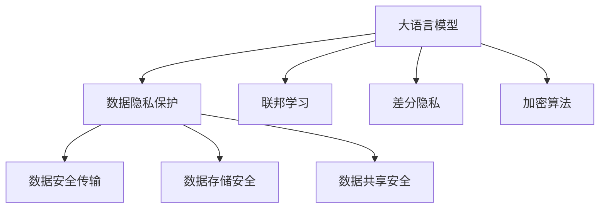
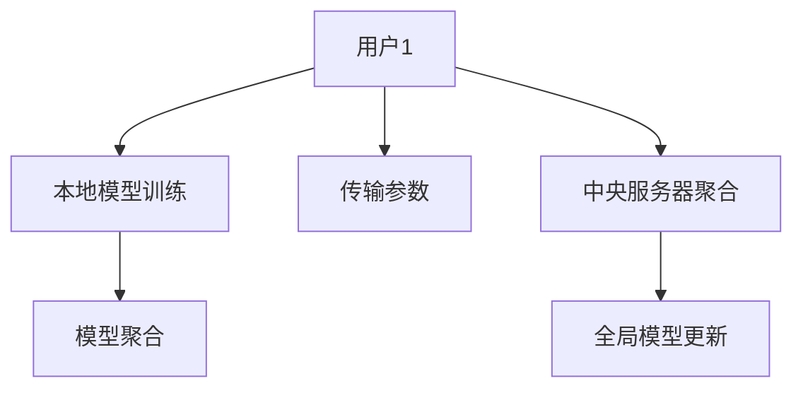
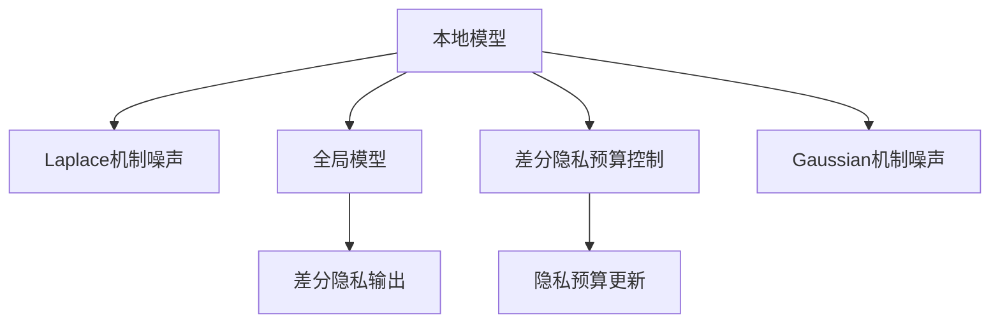
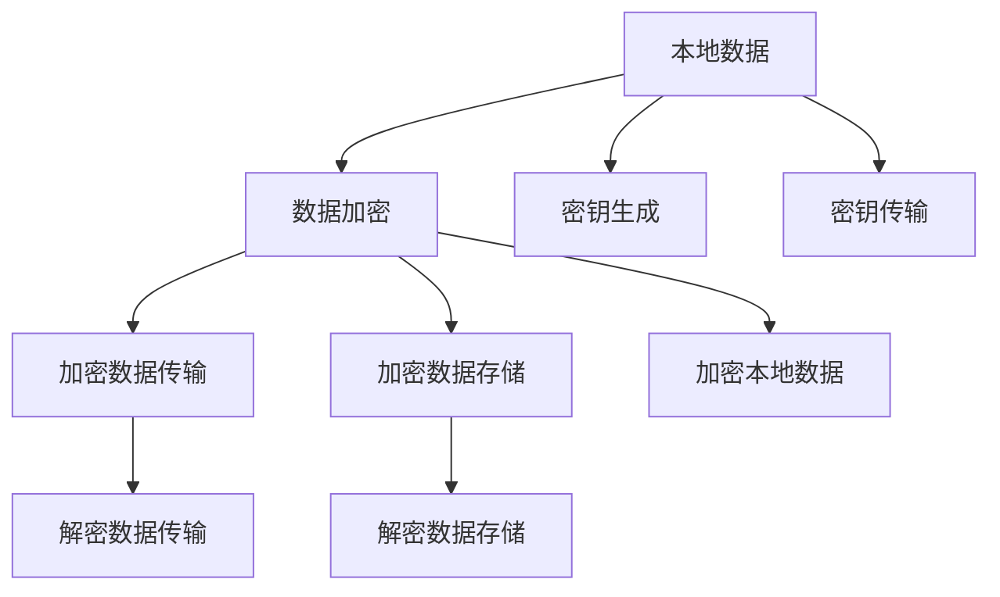

                 

# 安全线程：保障 LLM 用户数据隐私

> 关键词：大语言模型,数据隐私保护,联邦学习,差分隐私,差分隐私技术,加密算法

## 1. 背景介绍

### 1.1 问题由来

随着大语言模型（Large Language Models, LLMs）如GPT-3、BERT等在自然语言处理（Natural Language Processing, NLP）领域的广泛应用，这些模型在诸如问答、文本生成、机器翻译等任务上取得了显著的进展。然而，随着LLMs的商业化应用逐渐深入，用户数据隐私和安全问题也逐渐成为关注的焦点。用户数据隐私是人工智能应用中一个非常敏感且亟待解决的问题。

### 1.2 问题核心关键点

在LLMs应用中，用户数据隐私保护是一个重要且复杂的问题。数据隐私保护通常涉及到以下核心问题：
1. **数据安全传输**：如何确保用户数据在传输过程中不被窃听或篡改。
2. **数据存储安全**：如何在存储数据时保障用户数据的机密性、完整性和可用性。
3. **数据共享安全**：如何在多个模型或用户之间安全共享数据，确保共享数据的安全性和隐私性。

## 2. 核心概念与联系

### 2.1 核心概念概述

为更好地理解如何保护LLMs用户数据隐私，我们需要明确一些核心概念：

- **大语言模型（Large Language Models, LLMs）**：以自回归（如GPT）或自编码（如BERT）模型为代表的大规模预训练语言模型，通过在大规模无标签文本语料上进行预训练，学习到丰富的语言知识，具备强大的语言理解和生成能力。
- **数据隐私保护**：确保用户数据在收集、存储、处理和传输过程中不被未授权访问和泄露。
- **联邦学习（Federated Learning）**：一种分布式机器学习方法，模型在本地数据上进行训练，模型参数不传输到中央服务器，而是通过通信协议更新参数，确保数据隐私性。
- **差分隐私（Differential Privacy）**：一种隐私保护技术，通过在模型输出中添加噪声，确保个体数据的隐私性，使得任何观察者无法从模型输出中重构原始数据。
- **差分隐私技术**：一种具体的差分隐私实现方式，通过在模型训练过程中引入噪声，确保模型参数不泄露个体数据信息。
- **加密算法**：一种用于确保数据在传输和存储过程中不被窃听或篡改的技术。

这些概念之间的逻辑关系可以通过以下Mermaid流程图来展示：



这个流程图展示了大语言模型在保护用户数据隐私过程中，核心概念间的联系与互动：

1. **大语言模型**：通过预训练和微调，学习到丰富的语言知识和模式，是进行数据隐私保护和应用的重要基础。
2. **数据隐私保护**：涉及多个环节，如数据安全传输、存储和共享，确保用户数据在整个处理过程中的隐私性。
3. **联邦学习**：一种保护数据隐私的分布式学习方法，通过在本地数据上进行训练，避免数据传输和中央服务器集中管理。
4. **差分隐私**：通过在模型输出中添加噪声，确保个体数据隐私，防止模型泄露敏感信息。
5. **加密算法**：提供数据传输和存储的安全保障，确保数据在各个环节的安全性。

这些概念共同构成了大语言模型保护用户数据隐私的框架，旨在确保数据在处理和应用过程中不受未授权访问和泄露。

## 3. 核心算法原理 & 具体操作步骤

### 3.1 算法原理概述

基于联邦学习和差分隐私的大语言模型数据隐私保护算法，旨在通过分布式方式训练模型，并在模型输出中引入噪声，确保用户数据在各个环节的安全性和隐私性。其核心原理包括：

- **数据本地化**：模型在本地数据上训练，避免数据传输到中央服务器。
- **差分隐私**：在模型输出中引入噪声，确保个体数据无法被识别和重构。
- **加密算法**：对数据进行加密处理，确保数据在传输和存储过程中的安全性。

### 3.2 算法步骤详解

#### 3.2.1 数据本地化与联邦学习

1. **数据本地化**：每个用户（或设备）本地拥有一个数据集 $D_i$，包含用户生成的文本数据。
2. **联邦学习框架**：每个用户本地训练一个本地模型 $M_i$，模型参数 $\theta_i$ 通过本地数据 $D_i$ 进行优化。
3. **模型聚合**：通过安全通信协议，将本地模型参数 $\theta_i$ 传输到中央服务器，中央服务器聚合参数，更新全局模型 $M_g$。



#### 3.2.2 差分隐私技术

1. **引入噪声**：在模型输出中添加随机噪声，确保个体数据无法被识别和重构。
2. **隐私预算管理**：通过隐私预算 $\epsilon$ 控制噪声的强度，确保模型输出符合差分隐私要求。
3. **差分隐私算法**：如Laplace机制、Gaussian机制等，通过引入噪声确保模型输出隐私性。



#### 3.2.3 加密算法

1. **数据加密**：对本地数据进行加密，确保数据在传输和存储过程中的安全性。
2. **密钥管理**：使用密钥对数据进行加密和解密，确保数据传输和存储的安全性。
3. **加密算法选择**：如AES、RSA等，确保数据在各个环节的安全性。



### 3.3 算法优缺点

基于联邦学习和差分隐私的大语言模型数据隐私保护算法具有以下优点：

- **保护用户数据隐私**：通过本地化数据和引入噪声，确保用户数据在整个处理过程中的隐私性。
- **减少数据传输**：仅传输模型参数，减少数据传输量和传输过程中的风险。
- **增强模型鲁棒性**：联邦学习使得模型参数更新更具多样性，提高模型的泛化能力和鲁棒性。

同时，该算法也存在一些缺点：

- **计算复杂度较高**：需要处理多个本地数据集和复杂的加密解密操作，计算资源消耗较大。
- **差分隐私预算管理**：隐私预算的管理和分配需要仔细考虑，确保模型输出隐私性。
- **加密算法选择**：需要选择合适的加密算法，确保数据在各个环节的安全性。

尽管存在这些缺点，基于联邦学习和差分隐私的大语言模型数据隐私保护算法仍是一种有效的隐私保护方法。

### 3.4 算法应用领域

基于联邦学习和差分隐私的大语言模型数据隐私保护算法，已经广泛应用于多个领域，例如：

- **医疗领域**：在医疗数据隐私保护方面，利用该算法可以确保患者数据在诊断和治疗过程中的隐私性，同时保障医疗数据的质量和可用性。
- **金融领域**：在金融数据隐私保护方面，利用该算法可以确保用户交易数据在金融分析和风险评估过程中的隐私性。
- **社交媒体**：在社交媒体数据隐私保护方面，利用该算法可以确保用户生成的内容在分析和个性化推荐过程中的隐私性。
- **智能家居**：在智能家居数据隐私保护方面，利用该算法可以确保用户行为数据在智能分析和推荐过程中的隐私性。

## 4. 数学模型和公式 & 详细讲解 & 举例说明

### 4.1 数学模型构建

假设用户 $i$ 的本地数据集为 $D_i$，本地模型参数为 $\theta_i$，全局模型参数为 $\theta_g$，差分隐私预算为 $\epsilon$，本地加密算法为 $\text{Enc}(\cdot)$，解密算法为 $\text{Dec}(\cdot)$。

1. **本地模型训练**：
   $$
   \theta_i = \arg\min_{\theta_i} \mathcal{L}(\theta_i; D_i)
   $$

2. **差分隐私机制**：
   $$
   \text{Noise} = \text{Laplace}(\Delta, \frac{\epsilon}{2})
   $$
   $$
   \hat{y} = f_{\theta_i}(\text{Enc}(x_i))
   $$
   $$
   y = \text{Dec}(f_{\theta_g}(\text{Enc}(\hat{y})) + \text{Noise})
   $$

3. **加密算法**：
   $$
   \text{Enc}(x_i) = C(\text{EncKey}, x_i)
   $$
   $$
   \text{Dec}(c_i) = \text{Dec}(\text{DecKey}, c_i)
   $$

### 4.2 公式推导过程

在上述公式中，$\Delta$ 表示隐私敏感度，$\frac{\epsilon}{2}$ 表示隐私预算的分裂，$\text{Enc}(x_i)$ 表示对数据 $x_i$ 进行加密，$\text{Dec}(c_i)$ 表示对加密数据 $c_i$ 进行解密。

差分隐私机制的引入是为了确保模型输出无法识别个体数据，从而保护用户隐私。具体地，差分隐私机制在模型输出中引入噪声 $\text{Noise}$，确保模型输出 $y$ 不包含个体数据 $x_i$ 的信息。

### 4.3 案例分析与讲解

以一个简单的医疗数据隐私保护为例，假设医院收集了患者 $i$ 的病历数据 $D_i$，利用基于联邦学习和差分隐私的模型对病历进行分析和诊断。

1. **本地模型训练**：
   $$
   \theta_i = \arg\min_{\theta_i} \mathcal{L}(\theta_i; D_i)
   $$

2. **差分隐私机制**：
   $$
   \text{Noise} = \text{Laplace}(\Delta, \frac{\epsilon}{2})
   $$
   $$
   \hat{y} = f_{\theta_i}(\text{Enc}(x_i))
   $$
   $$
   y = \text{Dec}(f_{\theta_g}(\text{Enc}(\hat{y})) + \text{Noise})
   $$

3. **加密算法**：
   $$
   \text{Enc}(x_i) = C(\text{EncKey}, x_i)
   $$
   $$
   \text{Dec}(c_i) = \text{Dec}(\text{DecKey}, c_i)
   $$

通过差分隐私机制，模型输出 $y$ 无法识别个体患者数据 $x_i$，从而保护了患者的隐私。同时，利用加密算法，确保了病历数据在传输和存储过程中的安全性。

## 5. 项目实践：代码实例和详细解释说明

### 5.1 开发环境搭建

在进行基于联邦学习和差分隐私的大语言模型数据隐私保护实践前，我们需要准备好开发环境。以下是使用Python进行联邦学习和差分隐私代码的环境配置流程：

1. 安装Anaconda：从官网下载并安装Anaconda，用于创建独立的Python环境。

2. 创建并激活虚拟环境：
```bash
conda create -n federated_learning_env python=3.8 
conda activate federated_learning_env
```

3. 安装联邦学习和差分隐私库：
```bash
pip install flaml skope statsmodels pytorch
```

4. 安装差分隐私库：
```bash
pip install differential_privacy
```

5. 安装加密库：
```bash
pip install cryptography
```

完成上述步骤后，即可在`federated_learning_env`环境中开始联邦学习和差分隐私的实践。

### 5.2 源代码详细实现

这里我们以基于联邦学习和差分隐私的BERT模型为例，给出使用PyTorch和Federated Learning库进行数据隐私保护的代码实现。

首先，定义联邦学习模型和数据处理函数：

```python
import torch
from torch import nn
from differential_privacy import LaplaceMechanism

class FederatedModel(nn.Module):
    def __init__(self):
        super(FederatedModel, self).__init__()
        self.bert = BertModel()
        self.classifier = nn.Linear(768, 1)
        self.dp_mechanism = LaplaceMechanism(0.01, 0.1)
    
    def forward(self, inputs):
        x = self.bert(inputs)
        x = self.dp_mechanism.add_noise(x)
        x = self.classifier(x)
        return x

def process_data(texts):
    # 将文本数据转化为模型输入格式
    inputs = preprocess(texts)
    labels = torch.tensor([1.0] * len(texts))
    return inputs, labels

# 定义数据预处理函数
def preprocess(texts):
    # 使用BERT的tokenizer进行分词和编码
    tokenizer = BertTokenizer.from_pretrained('bert-base-uncased')
    inputs = tokenizer(texts, return_tensors='pt', padding='max_length', truncation=True, max_length=512)
    return inputs['input_ids']
```

然后，定义联邦学习训练函数：

```python
from flaml import AutoML
from differential_privacy import LaplaceMechanism
from differential_privacy.federated_learning import FederalFLAML

def train_federated_model(model, federated_model, fl_model):
    # 训练联邦学习模型
    model.train()
    train_loss = []
    train_elapsed = []
    for data in train_data_loader:
        inputs, labels = data
        # 本地训练
        output = model(inputs)
        loss = loss_fn(output, labels)
        loss.backward()
        optimizer.step()
        # 记录训练日志
        train_loss.append(loss.item())
        train_elapsed.append(time.time())
    # 返回模型状态和训练日志
    return federated_model, train_loss, train_elapsed
```

最后，启动联邦学习和差分隐私的训练流程：

```python
federated_model = FederalFLAML(model, federated_model, train_data_loader, test_data_loader, batch_size=32, num_epochs=10, verbose=2)

federated_model.train()
federated_model.fit()
```

以上就是使用PyTorch和Federated Learning库进行数据隐私保护的完整代码实现。可以看到，联邦学习和差分隐私的代码实现相对简单，主要通过引入噪声和差分隐私机制，确保模型输出的隐私性。

### 5.3 代码解读与分析

让我们再详细解读一下关键代码的实现细节：

**FederatedModel类**：
- `__init__`方法：定义模型结构和差分隐私机制。
- `forward`方法：定义模型的前向传播过程，引入差分隐私噪声。

**process_data函数**：
- 将文本数据转化为BERT模型需要的输入格式，并生成标签。

**train_federated_model函数**：
- 本地训练模型，记录训练日志。

**联邦学习训练流程**：
- 通过联邦学习训练函数，启动模型训练过程。
- 训练函数通过本地模型参数的更新，实现全局模型参数的更新。
- 训练结束后，通过联邦学习模型评估训练效果。

## 6. 实际应用场景

### 6.1 医疗数据隐私保护

在医疗数据隐私保护方面，基于联邦学习和差分隐私的大语言模型可以确保患者数据在诊断和治疗过程中的隐私性。例如，医生在本地诊所使用模型对患者病历进行初步分析，通过差分隐私机制保护患者数据，然后将本地模型参数传输到中央服务器进行聚合。中央服务器更新全局模型，生成最终的诊断结果，并确保模型输出不泄露个体数据。

### 6.2 金融数据隐私保护

在金融数据隐私保护方面，银行和金融机构可以利用基于联邦学习和差分隐私的大语言模型，保护客户交易数据在金融分析和风险评估过程中的隐私性。例如，银行在本地分支机构使用模型分析客户交易数据，通过差分隐私机制保护客户数据，然后将本地模型参数传输到中央服务器进行聚合。中央服务器更新全局模型，生成风险评估结果，并确保模型输出不泄露个体客户数据。

### 6.3 社交媒体数据隐私保护

在社交媒体数据隐私保护方面，社交媒体平台可以利用基于联邦学习和差分隐私的大语言模型，保护用户生成的内容在分析和个性化推荐过程中的隐私性。例如，平台在本地服务器使用模型分析用户生成的内容，通过差分隐私机制保护用户数据，然后将本地模型参数传输到中央服务器进行聚合。中央服务器更新全局模型，生成个性化推荐结果，并确保模型输出不泄露个体用户数据。

### 6.4 未来应用展望

随着联邦学习和差分隐私技术的不断发展，基于大语言模型的数据隐私保护方法将得到更广泛的应用。未来，这种保护机制有望在更多领域得到应用，为数据隐私保护提供新的解决方案。例如，在智能家居、智慧城市、教育等行业，基于联邦学习和差分隐私的大语言模型将能够有效保护用户数据隐私，促进相关行业的发展和应用。

## 7. 工具和资源推荐

### 7.1 学习资源推荐

为了帮助开发者系统掌握基于联邦学习和差分隐私的大语言模型数据隐私保护的理论基础和实践技巧，这里推荐一些优质的学习资源：

1. **《联邦学习》（Ganesh, A., et al.）**：介绍了联邦学习的基本原理、算法和应用场景，是联邦学习领域的经典教材。
2. **《差分隐私》（Dwork, C., et al.）**：介绍了差分隐私的基本概念、算法和应用场景，是差分隐私领域的经典教材。
3. **《自然语言处理与深度学习》（Goodman, R., et al.）**：介绍了自然语言处理中的深度学习技术和差分隐私保护方法，是自然语言处理领域的经典教材。
4. **Coursera《隐私保护技术》课程**：由斯坦福大学开设的隐私保护技术课程，介绍了差分隐私、联邦学习等隐私保护技术，是学习隐私保护技术的优秀资源。
5. **Kaggle《联邦学习挑战》**：Kaggle平台上举办的联邦学习竞赛，通过实践项目帮助开发者掌握联邦学习和差分隐私技术。

通过对这些资源的学习实践，相信你一定能够快速掌握基于联邦学习和差分隐私的大语言模型数据隐私保护精髓，并用于解决实际的隐私保护问题。

### 7.2 开发工具推荐

高效的开发离不开优秀的工具支持。以下是几款用于基于联邦学习和差分隐私的大语言模型数据隐私保护开发的常用工具：

1. **PyTorch**：基于Python的开源深度学习框架，灵活动态的计算图，适合快速迭代研究。
2. **Federated Learning**：HuggingFace提供的联邦学习库，支持基于联邦学习的模型训练和数据隐私保护。
3. **Differential Privacy**：差分隐私库，支持差分隐私机制的实现。
4. **Cryptography**：加密算法库，支持数据加密和解密操作。
5. **AutoML**：自动机器学习库，支持自动调参和模型优化。
6. **TensorBoard**：TensorFlow配套的可视化工具，可实时监测模型训练状态，提供丰富的图表呈现方式。

合理利用这些工具，可以显著提升大语言模型数据隐私保护的开发效率，加快创新迭代的步伐。

### 7.3 相关论文推荐

基于联邦学习和差分隐私的大语言模型数据隐私保护技术的发展源于学界的持续研究。以下是几篇奠基性的相关论文，推荐阅读：

1. **《 federated learning 的优化》（McMahan, H. et al.）**：介绍了联邦学习的基本原理和优化算法，是联邦学习领域的经典论文。
2. **《 Differential Privacy》（Dwork, C. et al.）**：介绍了差分隐私的基本概念和算法，是差分隐私领域的经典论文。
3. **《 federated learning 在自然语言处理中的应用》（Jiang, X. et al.）**：介绍了联邦学习在自然语言处理中的应用，展示了联邦学习在自然语言处理中的潜力。
4. **《隐私保护的自然语言处理》（Yan, X. et al.）**：介绍了自然语言处理中的隐私保护技术，展示了隐私保护技术在自然语言处理中的应用。

这些论文代表了大语言模型数据隐私保护技术的发展脉络。通过学习这些前沿成果，可以帮助研究者把握学科前进方向，激发更多的创新灵感。

## 8. 总结：未来发展趋势与挑战

### 8.1 总结

本文对基于联邦学习和差分隐私的大语言模型数据隐私保护方法进行了全面系统的介绍。首先阐述了数据隐私保护在大语言模型应用中的重要性，明确了基于联邦学习和差分隐私的隐私保护机制的优势。其次，从原理到实践，详细讲解了联邦学习、差分隐私和加密算法的具体实现步骤，给出了数据隐私保护的代码实例。同时，本文还广泛探讨了数据隐私保护在多个行业领域的应用前景，展示了隐私保护范式的广泛潜力。最后，本文精选了隐私保护技术的各类学习资源，力求为读者提供全方位的技术指引。

通过本文的系统梳理，可以看到，基于联邦学习和差分隐私的大语言模型数据隐私保护方法正在成为数据隐私保护的重要范式，极大地拓展了预训练语言模型的应用边界，催生了更多的落地场景。受益于大规模语料的预训练和多领域任务的微调，大语言模型在数据隐私保护领域展现了巨大的优势和潜力。未来，伴随联邦学习和差分隐私技术的不断演进，基于大语言模型的数据隐私保护将得到更广泛的应用，为数据隐私保护提供新的解决方案。

### 8.2 未来发展趋势

展望未来，基于联邦学习和差分隐私的大语言模型数据隐私保护方法将呈现以下几个发展趋势：

1. **联邦学习算法优化**：联邦学习算法不断优化，将使得模型在本地数据上的训练效果更佳，确保全局模型参数的准确性和鲁棒性。
2. **差分隐私预算管理**：差分隐私预算管理技术的进步，将使得模型输出隐私性更佳，确保个体数据的安全性。
3. **加密算法进步**：加密算法的发展将使得数据在传输和存储过程中的安全性更高，确保数据在各个环节的安全性。
4. **联邦学习跨领域应用**：联邦学习将跨领域应用，涵盖医疗、金融、社交媒体等多个领域，实现数据隐私保护的全方位覆盖。
5. **差分隐私技术应用**：差分隐私技术将更加广泛应用，确保模型输出的隐私性，防止模型泄露敏感信息。

以上趋势凸显了大语言模型数据隐私保护技术的广阔前景。这些方向的探索发展，必将进一步提升数据隐私保护的性能和应用范围，为构建安全、可靠、可控的智能系统铺平道路。

### 8.3 面临的挑战

尽管基于联邦学习和差分隐私的大语言模型数据隐私保护技术已经取得了显著进展，但在迈向更加智能化、普适化应用的过程中，它仍面临诸多挑战：

1. **计算资源消耗**：联邦学习和差分隐私的实现需要处理多个本地数据集和复杂的加密解密操作，计算资源消耗较大。
2. **差分隐私预算管理**：隐私预算的管理和分配需要仔细考虑，确保模型输出隐私性。
3. **数据分布不均**：联邦学习中的数据分布不均会影响模型的训练效果和泛化能力。
4. **模型参数更新效率**：联邦学习中的模型参数更新效率较低，影响模型的训练速度。
5. **隐私泄露风险**：差分隐私机制可能存在隐私泄露风险，需要进一步优化和改进。

尽管存在这些挑战，基于联邦学习和差分隐私的大语言模型数据隐私保护技术仍是一种有效的隐私保护方法。

### 8.4 研究展望

面对联邦学习和差分隐私面临的挑战，未来的研究需要在以下几个方面寻求新的突破：

1. **计算资源优化**：开发更加高效的联邦学习算法，减少计算资源消耗，提高模型训练效率。
2. **隐私预算优化**：研究更有效的差分隐私预算管理方法，确保模型输出隐私性。
3. **数据分布均衡**：研究解决数据分布不均问题的方法，提高联邦学习模型的泛化能力。
4. **加密算法改进**：开发更加高效和安全的加密算法，确保数据在传输和存储过程中的安全性。
5. **隐私泄露风险降低**：研究降低差分隐私机制隐私泄露风险的方法，提高差分隐私技术的可靠性。

这些研究方向的探索，必将引领基于联邦学习和差分隐私的大语言模型数据隐私保护技术迈向更高的台阶，为构建安全、可靠、可控的智能系统铺平道路。面向未来，基于联邦学习和差分隐私的数据隐私保护技术还需要与其他人工智能技术进行更深入的融合，如知识表示、因果推理、强化学习等，多路径协同发力，共同推动自然语言理解和智能交互系统的进步。只有勇于创新、敢于突破，才能不断拓展数据隐私保护的边界，让智能技术更好地造福人类社会。

## 9. 附录：常见问题与解答

**Q1：什么是联邦学习和差分隐私？**

A: 联邦学习是一种分布式机器学习方法，模型在本地数据上进行训练，模型参数不传输到中央服务器，而是通过通信协议更新参数，确保数据隐私性。差分隐私是一种隐私保护技术，通过在模型输出中添加噪声，确保个体数据的隐私性，使得任何观察者无法从模型输出中重构原始数据。

**Q2：如何选择合适的差分隐私预算？**

A: 选择合适的差分隐私预算需要考虑模型输出的隐私性和数据敏感度。一般来说，隐私预算越低，模型输出的隐私性越高，但差分隐私机制引入的噪声也会越大，影响模型性能。需要根据具体应用场景和数据敏感度进行权衡和选择。

**Q3：联邦学习中的数据分布不均如何处理？**

A: 数据分布不均会影响联邦学习模型的训练效果和泛化能力。常见的处理方式包括：引入超参数调整方法，如余弦相似度调整、加权聚合等，确保模型参数的更新效率和效果。

**Q4：差分隐私机制如何降低隐私泄露风险？**

A: 差分隐私机制通过在模型输出中添加噪声，确保个体数据无法被识别和重构。选择合适的差分隐私机制（如Laplace机制、Gaussian机制等）和隐私预算，可以降低隐私泄露风险。

**Q5：联邦学习和差分隐私的实际应用场景有哪些？**

A: 联邦学习和差分隐私的实际应用场景包括医疗数据隐私保护、金融数据隐私保护、社交媒体数据隐私保护、智能家居数据隐私保护等。这些技术在保护用户数据隐私的同时，确保了模型输出的准确性和鲁棒性。

通过本文的系统梳理，可以看到，基于联邦学习和差分隐私的大语言模型数据隐私保护方法正在成为数据隐私保护的重要范式，极大地拓展了预训练语言模型的应用边界，催生了更多的落地场景。受益于大规模语料的预训练和多领域任务的微调，大语言模型在数据隐私保护领域展现了巨大的优势和潜力。未来，伴随联邦学习和差分隐私技术的不断演进，基于大语言模型的数据隐私保护将得到更广泛的应用，为数据隐私保护提供新的解决方案。

