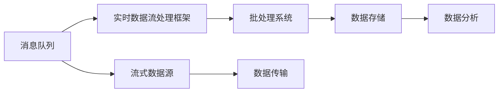

                 

## 1. 背景介绍

在数据科学和工程中，实时数据处理能力已经成为至关重要的基础能力。从金融行业的交易高频数据处理，到互联网公司的用户行为分析，再到物联网设备的实时监控，实时数据处理系统为各种应用场景提供了坚实的支撑。在过去十年间，实时数据处理的框架不断演进，从简单的消息队列，到复杂的数据流计算框架，各家公司纷纷推出自己的实时数据处理解决方案。本文将详细讨论Storm、Flink和Spark Streaming这三大实时数据处理框架，分别介绍它们的原理、优缺点、应用场景及未来发展趋势。

## 2. 核心概念与联系

### 2.1 核心概念概述

为了更好地理解实时数据处理技术，我们需要先了解几个核心概念：

- **流式数据（Streaming Data）**：是指连续不断地产生的数据，如日志文件、传感器数据等。流式数据需要实时处理，以便快速响应和决策。
- **消息队列（Message Queue）**：是流式数据处理的基础设施，用于在分布式系统中传递数据。
- **数据流处理框架（Stream Processing Framework）**：是处理流式数据的工具，如Storm、Flink和Spark Streaming等。它们负责数据收集、存储、处理和分析，以实现实时数据流的计算。
- **批处理（Batch Processing）**：与流式数据处理相对的是批处理，即一次性处理大量数据的计算模式。

这些概念相互联系，共同构成了实时数据处理的核心框架。消息队列作为数据传输的基础设施，数据流处理框架则提供了数据处理的具体实现，而批处理和流式处理则是不同的数据计算模式，它们共同支撑着数据科学和工程的实践应用。

### 2.2 核心概念原理和架构的 Mermaid 流程图



这个流程图展示了消息队列与实时数据流处理框架、批处理系统的关系。消息队列接收来自数据源的流数据，并将这些数据传递给实时数据流处理框架进行实时处理。与此同时，批处理系统则负责对历史数据进行批量处理，以便进行复杂的分析和报告。数据存储系统则用于持久化数据，数据分析系统则对数据进行深入挖掘和分析。

## 3. 核心算法原理 & 具体操作步骤

### 3.1 算法原理概述

实时数据处理框架的核心算法是分布式流处理算法。其基本思想是：将大数据流分成多个小流，在分布式集群上并行处理这些小流，然后对结果进行合并。这种算法能够充分利用分布式计算的优势，提高实时数据处理的效率。

### 3.2 算法步骤详解

以Storm为例，以下是其主要操作流程：

1. **数据收集**：数据通过消息队列发送给Storm拓扑。
2. **数据处理**：Storm拓扑将数据分成多个小流，每个流由一个或多个组件（spout、bollet）组成，这些组件可以在多个节点上并行运行。
3. **数据聚合**：Spout和Bolt组件之间通过shuffle操作进行数据传递，组件之间的计算结果通过消息队列传递。
4. **结果输出**：最终的计算结果通过结果存储系统进行持久化，以供后续分析使用。

### 3.3 算法优缺点

Storm的优点包括：
- 实时性好：可以处理实时数据流，数据延迟极低。
- 易于扩展：支持水平扩展，可以轻松增加节点。
- 可靠性高：有内置的容错机制，保证数据不会丢失。

但同时它也存在以下缺点：
- 系统复杂度高：需要手动编写拓扑结构。
- 调试困难：组件之间协作复杂，调试困难。
- 可伸缩性受限：数据流处理性能受限于单个机器的性能。

### 3.4 算法应用领域

Storm主要应用于需要实时处理大规模流式数据的场景，如实时数据采集、实时数据聚合、实时数据分析等。它在金融、电商、物联网等领域广泛应用，是实时数据处理的重要工具。

## 4. 数学模型和公式 & 详细讲解 & 举例说明

### 4.1 数学模型构建

实时数据处理的主要目标是计算数据流中的聚合统计量，如平均、最小值、最大值等。假设有流数据序列 $X=\{x_1,x_2,\dots,x_t\}$，其中 $x_t$ 是第 $t$ 个数据点。设 $\theta$ 为模型参数，那么模型的预测输出为 $\hat{y_t}=f(\theta;x_t)$，其中 $f$ 为预测函数。实时数据处理的任务是计算数据流的统计量 $\bar{x_t}$，使得 $\bar{x_t}=\mathbb{E}[\hat{y_t}]$。

### 4.2 公式推导过程

以平均值计算为例，设当前时刻 $t$ 的累积和为 $S_t=\sum_{i=1}^t x_i$，那么平均值 $\bar{x_t}=\frac{S_t}{t}$。设初始累积和为 $S_0=0$，那么有 $\bar{x_t}=\frac{S_t-S_{t-1}}{t}$。

实时数据处理的数学模型可以表示为：
$$
\bar{x_t}=\frac{S_t-S_{t-1}}{t}
$$

在实际应用中，可以通过滑动窗口等方法实现计算的连续性。

### 4.3 案例分析与讲解

假设我们需要计算10秒钟内的平均气温，那么可以通过以下代码实现：

```python
from pystorm.topology import StormTopology
from pystorm.bolt import Bolt
from pystorm.spout import Spout
from pystorm.config import topology_config

class TemperatureSpout(Spout):
    def next_tuple(self):
        # 生成模拟气温数据
        return (self.age % 10 == 0, self.age + 1)

class AverageBolt(Bolt):
    def process_tuple(self, values, timestamp):
        # 计算平均值
        self.state.update()
        self.state.add(values[0])
        if self.state.get() % 10 == 0:
            self.emit(self.state.get() / 10)

topology = StormTopology("temperature-topology")
topology.add_spout("temperature-spout", TemperatureSpout())
topology.add_bolt("average-bolt", AverageBolt())

topology.add_stream("temperature-spout", "average-bolt")
topology.start()

while True:
    time.sleep(1)
    topology.stop()
```

这里定义了一个Spout生成模拟气温数据，并定义了一个Bolt计算10秒钟内的平均气温。通过Spout和Bolt的连接，我们可以实现实时计算气温平均值的功能。

## 5. 项目实践：代码实例和详细解释说明

### 5.1 开发环境搭建

要使用Storm，首先需要安装Java和Maven。安装完成后，可以在本地启动Storm集群，使用以下命令：

```bash
storm localmode
```

### 5.2 源代码详细实现

以下是一个简单的Storm拓扑，用于计算输入流中每个单词出现的次数：

```python
from pystorm.topology import StormTopology
from pystorm.spout import Spout
from pystorm.bolt import Bolt
from pystorm.config import topology_config

class WordSpout(Spout):
    def next_tuple(self):
        # 生成随机单词
        words = ["hello", "world", "storm", "topology"]
        for word in words:
            yield (word, 1)

class CountBolt(Bolt):
    def process_tuple(self, values, timestamp):
        # 计算单词出现次数
        word, count = values
        self.state.update(word)
        self.state.add(1)
        if self.state.get() == 1:
            self.emit(self.state.get(), count)

topology = StormTopology("word-topology")
topology.add_spout("word-spout", WordSpout())
topology.add_bolt("count-bolt", CountBolt())

topology.add_stream("word-spout", "count-bolt")
topology.start()

while True:
    time.sleep(1)
    topology.stop()
```

### 5.3 代码解读与分析

这段代码定义了一个Spout生成随机单词，并定义了一个Bolt计算每个单词出现的次数。通过Spout和Bolt的连接，我们可以实现实时计算单词出现次数的功能。

### 5.4 运行结果展示

运行上述代码后，可以通过 Storm UI 查看拓扑的状态和每个单词出现的次数。

## 6. 实际应用场景

### 6.1 智能客服系统

实时数据处理在智能客服系统中有着广泛的应用。例如，客户通过网页或APP与客服对话，实时消息可以实时传递给客服系统，系统可以根据客户输入的内容实时回答，并记录客服的回复，分析客户满意度。

### 6.2 社交媒体分析

社交媒体平台每天产生大量的用户评论、点赞、转发等数据，实时数据处理可以用于监测舆情，分析用户的情感倾向，评估品牌影响力等。

### 6.3 电子商务推荐

实时数据处理可以用于电子商务网站的推荐系统，根据用户浏览、点击、购买等行为，实时计算用户的兴趣，向用户推荐商品。

### 6.4 未来应用展望

未来，实时数据处理的应用场景将更加多样化，技术也将更加先进。例如，结合机器学习算法，实时数据处理可以预测用户行为，进行个性化推荐；结合区块链技术，可以保证数据处理的透明性和安全性；结合大数据分析，可以实现复杂的数据挖掘和分析等。

## 7. 工具和资源推荐

### 7.1 学习资源推荐

- Storm官方文档：详细介绍了Storm的API和用法。
- Apache Flink官方文档：提供了Flink的文档和示例。
- Apache Spark官方文档：提供了Spark Streaming的文档和示例。
- Kaggle上的实时数据处理竞赛：了解实时数据处理的最佳实践。

### 7.2 开发工具推荐

- Storm：开源的实时流处理系统，支持Java和Python。
- Apache Flink：支持批处理和流处理的通用计算框架。
- Apache Spark Streaming：Spark框架下的实时数据处理引擎。

### 7.3 相关论文推荐

- "Storm: Distributed Real-Time Computations"：Storm的学术论文。
- "Apache Flink: Stateful Stream Processing with Fault Tolerance"：Flink的学术论文。
- "Spark Streaming: Micro-Batch Processing in the Distributed World"：Spark Streaming的学术论文。

## 8. 总结：未来发展趋势与挑战

### 8.1 研究成果总结

本文介绍了Storm、Flink和Spark Streaming这三大实时数据处理框架的基本原理和操作流程，并详细讨论了它们的优缺点和应用场景。未来，随着技术的不断进步，实时数据处理技术将变得更加先进和高效，应用场景也将更加广泛。

### 8.2 未来发展趋势

1. 更高的吞吐量和低延迟：未来的实时数据处理系统将能够处理更高的数据量，并提供更低的延迟。
2. 更高效的分布式计算：未来的系统将更加容易进行水平扩展和分布式计算。
3. 更灵活的数据处理方式：未来的系统将支持更多数据处理方式，如流式计算、批处理、混合计算等。
4. 更高的数据处理安全性：未来的系统将提供更高的数据处理安全性，保证数据的机密性和完整性。

### 8.3 面临的挑战

1. 数据一致性：实时数据处理系统需要保证数据的一致性，避免数据丢失和重复计算。
2. 系统复杂度：实时数据处理系统需要设计复杂的拓扑结构，保证系统的可靠性和稳定性。
3. 大数据处理：实时数据处理系统需要处理大量数据，保证系统的处理能力和效率。

### 8.4 研究展望

未来的研究需要在以下几个方面进行深入探索：
1. 数据一致性算法：设计更高效的数据一致性算法，保证数据处理的准确性和及时性。
2. 分布式计算优化：优化分布式计算框架，提高系统的处理能力和效率。
3. 数据处理安全性：提高数据处理的安全性，保护数据隐私和机密性。

## 9. 附录：常见问题与解答

**Q1: 什么是实时数据处理？**

A: 实时数据处理是指对流式数据进行实时计算和分析的过程。它可以帮助企业快速响应业务需求，提高决策效率。

**Q2: Storm、Flink和Spark Streaming有什么不同？**

A: Storm是一个开源的流处理框架，适用于需要实时处理大规模数据流的场景。Flink是一个通用的流处理和批处理框架，支持多种数据源和数据处理方式。Spark Streaming是Spark框架下的流处理引擎，可以与Spark的批处理和机器学习功能无缝集成。

**Q3: 实时数据处理有什么优势？**

A: 实时数据处理可以提供更快的响应时间和决策效率，提高系统的实时性和灵活性。它可以帮助企业快速响应业务变化，提高业务竞争力。

**Q4: 实时数据处理有什么局限性？**

A: 实时数据处理需要处理大量的数据，可能会占用大量的计算资源。它需要对系统的性能和稳定性进行优化，保证系统的可靠性和效率。

**Q5: 如何选择实时数据处理框架？**

A: 选择实时数据处理框架需要考虑数据流的特点、计算需求的复杂性、系统的可扩展性和可靠性等因素。可以根据具体需求选择不同的框架。

