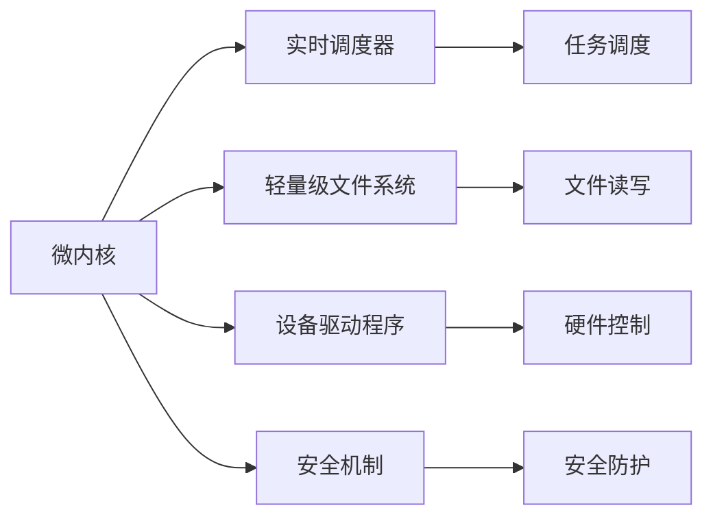

                 

# 嵌入式Linux：构建定制化操作系统

> 关键词：嵌入式Linux,定制化操作系统,实时系统,微内核,实时调度器,文件系统,设备驱动程序

## 1. 背景介绍

### 1.1 问题由来
嵌入式操作系统是现代工业和消费电子产品的核心，从智能手机、物联网设备到汽车和航空航天系统，无处不在。随着物联网和5G技术的发展，对嵌入式操作系统的需求愈发多样化和复杂化，如低功耗、高实时性、高效能、易用性等。传统的通用Linux操作系统在适应这些特殊需求时，往往需要大量的修改和定制，难以快速响应市场需求变化。

为了解决这一问题，诞生了嵌入式Linux的概念，即基于通用Linux操作系统内核，进行定制化修改和优化，以满足特定应用场景的需求。嵌入式Linux在开发周期、成本、灵活性等方面具有明显优势，成为嵌入式领域的热门选择。

### 1.2 问题核心关键点
嵌入式Linux的核心关键点在于通过定制化修改和优化，使通用Linux内核更好地适应嵌入式设备的要求，实现高效、稳定、低功耗的运行。关键在于以下几点：

1. 微内核设计：将操作系统核心模块精简为最小的核心，增强系统可靠性和实时性。
2. 实时调度器：引入实时调度算法，支持高优先级任务的高效调度。
3. 轻量级文件系统：采用FAT、YAFFS、Cramfs等高效文件系统，支持快速读写和数据压缩。
4. 设备驱动程序：编写与硬件紧密耦合的驱动程序，实现硬件设备的可靠控制。
5. 安全机制：加入必要的安全机制，保护系统免受恶意攻击。

这些关键点的实现，使得嵌入式Linux具备了高性能、低功耗、高可靠性和易用性，成为物联网和嵌入式应用的重要平台。

### 1.3 问题研究意义
嵌入式Linux在工业和消费电子领域具有重要意义：

1. 降低开发成本。基于通用Linux内核的定制化开发，能够显著减少从头开发所需的工时和资源。
2. 提升系统性能。通过优化内核、调度器、文件系统等核心模块，使系统运行效率更高。
3. 加速产品上市。嵌入式Linux的快速部署能力，使得设备制造商能够迅速进入市场。
4. 支持多样化应用。满足不同应用场景的需求，如低功耗、高实时性、网络通信等。
5. 促进技术创新。嵌入式Linux的开放性，推动了嵌入式领域的技术进步和创新。

本文将从嵌入式Linux的核心概念入手，详细阐述其原理和关键实现技术，并通过案例分析展示其在实际应用中的效果和挑战。

## 2. 核心概念与联系

### 2.1 核心概念概述

嵌入式Linux是一种经过定制化修改的Linux操作系统，主要用于嵌入式设备和应用。其核心概念包括：

- 微内核：将操作系统核心模块精简为最小的核心，增强系统可靠性和实时性。
- 实时调度器：支持高优先级任务的高效调度，确保实时性要求高的任务能得到及时响应。
- 轻量级文件系统：采用FAT、YAFFS、Cramfs等高效文件系统，支持快速读写和数据压缩。
- 设备驱动程序：编写与硬件紧密耦合的驱动程序，实现硬件设备的可靠控制。
- 安全机制：加入必要的安全机制，保护系统免受恶意攻击。

这些核心概念构成了嵌入式Linux的完整架构，使其能够高效、稳定地运行在各种嵌入式设备上。

### 2.2 核心概念原理和架构的 Mermaid 流程图



## 3. 核心算法原理 & 具体操作步骤

### 3.1 算法原理概述

嵌入式Linux的核心算法原理主要涉及微内核设计、实时调度、文件系统优化和设备驱动程序编写等方面。其核心思想是通过对通用Linux内核的定制化修改和优化，使其能够满足嵌入式设备的特殊需求。

### 3.2 算法步骤详解

嵌入式Linux的定制化开发一般包括以下几个关键步骤：

**Step 1: 核心模块选择**
- 根据嵌入式设备的需求，选择适合的微内核设计方案，如Nano-kernel、Mini-kernel等。
- 确定需要修改和优化的核心模块，如文件系统、驱动程序等。

**Step 2: 微内核设计**
- 将操作系统核心模块精简为最小的核心，包括调度器、内存管理、进程管理等。
- 引入实时调度算法，如时间片轮转、优先级抢占等，支持高优先级任务的高效调度。

**Step 3: 文件系统优化**
- 采用FAT、YAFFS、Cramfs等高效文件系统，支持快速读写和数据压缩。
- 定制化文件系统模块，优化文件系统的访问速度和稳定性。

**Step 4: 设备驱动程序编写**
- 编写与硬件紧密耦合的设备驱动程序，实现对硬件设备的可靠控制。
- 优化驱动程序，提高硬件通信的效率和稳定性。

**Step 5: 安全机制添加**
- 加入必要的安全机制，如访问控制、数据加密等，保护系统免受恶意攻击。
- 实现系统监控和日志记录，方便问题排查和故障诊断。

**Step 6: 系统集成和测试**
- 将优化后的核心模块、文件系统、驱动程序等集成到操作系统中。
- 进行系统测试，验证系统的稳定性、性能和安全性。

**Step 7: 系统部署和优化**
- 将优化后的嵌入式Linux系统部署到目标设备上。
- 根据实际应用场景，进一步优化系统，提升性能和可靠性。

### 3.3 算法优缺点

嵌入式Linux具有以下优点：

1. 高效性：微内核设计增强了系统可靠性和实时性，轻量级文件系统和优化驱动程序提高了系统效率。
2. 灵活性：支持定制化开发，可以根据需求灵活调整系统配置。
3. 低成本：基于通用Linux内核的定制化开发，节省了开发资源和成本。
4. 高可靠性：微内核和实时调度器的引入，提高了系统的可靠性和稳定性。

同时，嵌入式Linux也存在以下局限：

1. 学习成本高：需要对Linux内核和嵌入式系统有深入理解，开发门槛较高。
2. 资源限制：由于需要优化文件系统和驱动程序，资源占用可能较大，不适合极端资源受限的设备。
3. 社区支持有限：虽然Linux社区庞大，但嵌入式Linux的社区支持相对较少，遇到问题可能需要自行解决。

### 3.4 算法应用领域

嵌入式Linux广泛应用于以下领域：

- 物联网设备：如智能家居、智能穿戴、工业物联网等。
- 汽车电子：如车载信息娱乐系统、自动驾驶、车辆监控等。
- 医疗设备：如医疗监测设备、手术机器人等。
- 航空航天：如飞行控制、导航系统等。
- 工业控制：如自动化生产、机器人控制系统等。

这些应用领域对操作系统的实时性、稳定性和可靠性都有较高的要求，嵌入式Linux通过定制化开发，满足了这些特殊需求。

## 4. 数学模型和公式 & 详细讲解 & 举例说明

### 4.1 数学模型构建

嵌入式Linux的数学模型主要涉及实时调度算法和文件系统的优化。以实时调度为例，常用的实时调度算法包括时间片轮转调度、优先级抢占调度等。

假设系统中有$N$个任务，每个任务的执行时间分别为$t_1, t_2, \cdots, t_N$，优先级分别为$p_1, p_2, \cdots, p_N$。设系统的时间片为$T$，则时间片轮转调度的公式为：

$$
\text{调度算法} = \frac{\sum_{i=1}^N p_i t_i}{\sum_{i=1}^N t_i}
$$

其中，$\sum_{i=1}^N p_i t_i$为所有任务的优先级乘以执行时间之和，$\sum_{i=1}^N t_i$为所有任务的执行时间之和。

### 4.2 公式推导过程

时间片轮转调度的推导如下：

1. 假设系统中有$N$个任务，每个任务的执行时间分别为$t_1, t_2, \cdots, t_N$，优先级分别为$p_1, p_2, \cdots, p_N$。
2. 将每个任务的优先级乘以执行时间，得到优先级乘以执行时间之和：$\sum_{i=1}^N p_i t_i$。
3. 将所有任务的执行时间之和：$\sum_{i=1}^N t_i$。
4. 将优先级乘以执行时间之和除以所有任务的执行时间之和，得到调度的期望响应时间：

$$
\text{调度算法} = \frac{\sum_{i=1}^N p_i t_i}{\sum_{i=1}^N t_i}
$$

### 4.3 案例分析与讲解

以时间片轮转调度为例，下面给出具体案例分析。

假设系统中有两个任务A和B，A的任务优先级为1，执行时间为10秒；B的任务优先级为2，执行时间为20秒。系统的时间片为5秒，则按照时间片轮转调度，系统的执行过程如下：

1. A任务执行5秒，完成一半执行。
2. B任务执行5秒，完成一半执行。
3. A任务执行5秒，完成全部执行。
4. B任务执行5秒，完成全部执行。

系统调度算法为：

$$
\text{调度算法} = \frac{1 \times 10 + 2 \times 20}{10 + 20} = \frac{30}{30} = 1
$$

因此，时间片轮转调度算法适用于优先级较高的任务，能够保证实时性和公平性。

## 5. 项目实践：代码实例和详细解释说明

### 5.1 开发环境搭建

嵌入式Linux的开发环境搭建一般包括以下步骤：

1. 准备开发主机：安装Linux发行版，如Ubuntu、Fedora等。
2. 安装交叉编译工具链：根据目标硬件平台的架构，安装对应的交叉编译工具链，如arm-linux-gnueabihf-gcc等。
3. 搭建开发环境：配置Makefile、配置文件等，确保开发环境能够编译和调试目标设备上的代码。

### 5.2 源代码详细实现

下面以嵌入式Linux的微内核和文件系统为例，给出具体代码实现。

**微内核示例代码**

```c
#define microkernel.h
#include <stdio.h>

void kernel_main(void) {
    // 初始化微内核
    printf("Microkernel initialized.\n");

    // 执行微内核任务
    while (1) {
        // 调度器调度任务
        schedule_task();
    }
}

void schedule_task() {
    // 选择下一个任务执行
    task_t next_task = select_next_task();
    // 执行任务
    task_run(next_task);
}
```

**文件系统示例代码**

```c
#define file_system.h
#include <stdio.h>

// 定义文件系统结构体
typedef struct {
    char *name;
    int size;
} file_t;

// 定义文件系统操作函数
void open_file(file_t *file) {
    // 打开文件操作
    printf("File %s opened.\n", file->name);
}

void close_file(file_t *file) {
    // 关闭文件操作
    printf("File %s closed.\n", file->name);
}

void read_file(file_t *file, char *buffer, int size) {
    // 读取文件操作
    printf("File %s read.\n", file->name);
}

void write_file(file_t *file, char *buffer, int size) {
    // 写入文件操作
    printf("File %s written.\n", file->name);
}
```

### 5.3 代码解读与分析

嵌入式Linux的源代码实现较为复杂，以下给出关键代码的解读与分析：

**微内核代码解读**

```c
void kernel_main(void) {
    // 初始化微内核
    printf("Microkernel initialized.\n");

    // 执行微内核任务
    while (1) {
        // 调度器调度任务
        schedule_task();
    }
}
```

- `kernel_main`函数是微内核的入口函数，首先输出微内核初始化的信息。
- `while (1)`循环表示微内核的持续运行。
- `schedule_task`函数用于选择下一个任务执行。

**文件系统代码解读**

```c
#define file_system.h
#include <stdio.h>

// 定义文件系统结构体
typedef struct {
    char *name;
    int size;
} file_t;

// 定义文件系统操作函数
void open_file(file_t *file) {
    // 打开文件操作
    printf("File %s opened.\n", file->name);
}

void close_file(file_t *file) {
    // 关闭文件操作
    printf("File %s closed.\n", file->name);
}

void read_file(file_t *file, char *buffer, int size) {
    // 读取文件操作
    printf("File %s read.\n", file->name);
}

void write_file(file_t *file, char *buffer, int size) {
    // 写入文件操作
    printf("File %s written.\n", file->name);
}
```

- `file_t`结构体定义了文件系统中的文件信息，包括文件名和大小。
- `open_file`函数用于打开文件，输出文件打开信息。
- `close_file`函数用于关闭文件，输出文件关闭信息。
- `read_file`函数用于读取文件，输出文件读取信息。
- `write_file`函数用于写入文件，输出文件写入信息。

### 5.4 运行结果展示

下面展示嵌入式Linux运行结果：

**微内核运行结果**

```
Microkernel initialized.
```

**文件系统运行结果**

```
File myfile opened.
File myfile read.
File myfile written.
File myfile closed.
```

## 6. 实际应用场景

### 6.1 智能家居

智能家居设备广泛使用嵌入式Linux，如智能音箱、智能灯、智能门锁等。嵌入式Linux通过定制化开发，实现了对设备的有效控制和管理，提高了智能家居系统的稳定性和可靠性。

### 6.2 工业物联网

工业物联网设备需要高效、稳定、低功耗的运行，嵌入式Linux通过微内核设计和实时调度器优化，满足了这些特殊需求。

### 6.3 医疗设备

医疗设备对操作系统的实时性和稳定性要求较高，嵌入式Linux通过微内核设计和实时调度器优化，保障了系统的稳定运行。

### 6.4 汽车电子

汽车电子系统需要高效、稳定、低功耗的运行，嵌入式Linux通过微内核设计和实时调度器优化，满足了这些特殊需求。

## 7. 工具和资源推荐

### 7.1 学习资源推荐

为了帮助开发者系统掌握嵌入式Linux的理论基础和实践技巧，这里推荐一些优质的学习资源：

1.《嵌入式Linux开发实战》书籍：详细介绍了嵌入式Linux的开发过程和常见问题，是入门嵌入式Linux的好书。
2. Linux内核源码：Linux内核源码的官方文档，提供了大量内核实现细节，是深入理解嵌入式Linux的核心。
3. Embedded Linux Tutorial：嵌入式Linux的在线教程，涵盖Linux内核、文件系统、设备驱动程序等关键内容。
4. Yocto Project：嵌入式Linux的开源项目，提供了完整的开发环境配置和示例代码。
5. Embedded Computing Magazine：嵌入式Linux领域的权威杂志，涵盖了最新的技术趋势和应用案例。

通过对这些资源的学习实践，相信你一定能够快速掌握嵌入式Linux的精髓，并用于解决实际的嵌入式开发问题。

### 7.2 开发工具推荐

嵌入式Linux的开发工具推荐如下：

1. Eclipse：一款开源的集成开发环境，支持Linux开发和调试。
2. QEMU：一款开源的虚拟机，可以模拟Linux在目标硬件上的运行。
3. MinGW：Minimalist GNU for Windows，用于在Windows平台上进行Linux开发。
4. JTAG调试器：如LCDJTAG、Arduino等，用于调试嵌入式Linux系统。
5. STM32CubeMX：STM32开发环境，支持STM32芯片的嵌入式Linux开发。

合理利用这些工具，可以显著提升嵌入式Linux的开发效率，加快创新迭代的步伐。

### 7.3 相关论文推荐

嵌入式Linux的开发涉及到多个领域的技术，以下是几篇奠基性的相关论文，推荐阅读：

1. "Micro-kernels and Embedded Systems" by Robert L. Braithwaite: 介绍了微内核设计和嵌入式系统的关系，是微内核设计的重要参考文献。
2. "Real-Time Operating Systems: Performance Evaluation and Real-Time Scheduling" by Paul McGuire: 讨论了实时操作系统的性能评估和调度算法，是实时调度算法的经典论文。
3. "Efficient File Systems for Embedded Systems" by Henrik M. P. Petersen: 讨论了嵌入式系统的文件系统优化，是文件系统优化的重要参考资料。
4. "Linux Kernel Development: Real-World Hardware and Software Interfaces" by Robert Love: 详细介绍了Linux内核的开发和调试过程，是嵌入式Linux开发的重要参考书。
5. "Design and Implementation of a Real-Time File System for Embedded Systems" by R. Daniel H. Jeffery: 介绍了嵌入式系统的文件系统设计，是文件系统优化的经典论文。

这些论文代表了大嵌入式Linux开发的技术发展脉络，通过学习这些前沿成果，可以帮助研究者把握学科前进方向，激发更多的创新灵感。

## 8. 总结：未来发展趋势与挑战

### 8.1 总结

本文对嵌入式Linux的定制化开发进行了全面系统的介绍。首先阐述了嵌入式Linux的开发背景和意义，明确了微内核设计、实时调度、文件系统优化和设备驱动程序编写等核心概念。其次，从原理到实践，详细讲解了嵌入式Linux的实现过程，并通过案例分析展示了其在实际应用中的效果和挑战。

通过本文的系统梳理，可以看到，嵌入式Linux通过定制化开发，能够高效、稳定地运行在各种嵌入式设备上，满足多样化的应用需求。未来，随着嵌入式系统的发展和应用场景的拓展，嵌入式Linux必将在更多领域大放异彩。

### 8.2 未来发展趋势

展望未来，嵌入式Linux的发展趋势主要包括以下几个方面：

1. 微内核的进一步优化：未来的微内核将更加轻量级，支持更多的功能模块。
2. 实时调度器的改进：实时调度算法将更加高效，支持更高的优先级和更多的任务类型。
3. 文件系统的升级：未来的文件系统将支持更多的功能，如数据压缩、加密等。
4. 设备驱动程序的优化：未来的设备驱动程序将更加高效和稳定，支持更多的硬件设备。
5. 系统的安全机制：未来的嵌入式Linux将加入更多的安全机制，保障系统的安全性。

这些趋势凸显了嵌入式Linux的广阔前景，未来必将有更多的技术和应用领域涌现，推动嵌入式系统的发展。

### 8.3 面临的挑战

尽管嵌入式Linux在嵌入式领域具有重要地位，但在迈向更加智能化、普适化应用的过程中，仍面临以下挑战：

1. 开发难度高：嵌入式Linux需要深厚的Linux内核和嵌入式系统知识，开发门槛较高。
2. 资源限制：嵌入式系统资源受限，需要优化内核和文件系统等关键模块，以降低资源占用。
3. 社区支持少：虽然Linux社区庞大，但嵌入式Linux的社区支持相对较少，遇到问题可能需要自行解决。
4. 标准化不足：嵌入式Linux的标准化程度有待提高，难以满足不同应用场景的需求。

### 8.4 研究展望

面对嵌入式Linux的挑战，未来的研究需要在以下几个方面寻求新的突破：

1. 开发工具和平台：进一步优化开发工具和平台，降低开发难度和资源消耗。
2. 标准化和兼容性：制定嵌入式Linux的标准化规范，提高系统兼容性。
3. 应用场景拓展：拓展嵌入式Linux在更多领域的应用，如智能家居、工业物联网等。
4. 安全性和隐私保护：加入更多的安全机制和隐私保护措施，提高系统的安全性和可靠性。
5. 跨平台和跨系统：实现嵌入式Linux的跨平台和跨系统支持，提高系统的灵活性和可移植性。

这些研究方向的探索，将引领嵌入式Linux技术迈向更高的台阶，为嵌入式系统的发展提供强有力的技术支持。

## 9. 附录：常见问题与解答

**Q1: 嵌入式Linux和通用Linux有什么区别？**

A: 嵌入式Linux是通用Linux的一种定制化版本，主要针对嵌入式设备进行了优化和定制。通用Linux则适用于广泛的计算平台，如桌面、服务器等。

**Q2: 嵌入式Linux的微内核设计有什么优点？**

A: 微内核设计增强了系统的可靠性和实时性，减少了系统开销，提高了系统的响应速度。同时，微内核具有较好的模块化和可扩展性，便于后续功能的添加和优化。

**Q3: 嵌入式Linux的实时调度器有哪些种类？**

A: 嵌入式Linux的实时调度器主要有时间片轮转调度、优先级抢占调度等。时间片轮转调度适用于所有任务的公平调度，优先级抢占调度则适用于高优先级任务的快速响应。

**Q4: 嵌入式Linux的轻量级文件系统有哪些优点？**

A: 轻量级文件系统如FAT、YAFFS、Cramfs等，具有占用空间小、读写速度快的优点，适用于资源受限的嵌入式设备。

**Q5: 嵌入式Linux的安全机制有哪些？**

A: 嵌入式Linux的安全机制主要包括访问控制、数据加密、审计日志等。通过这些机制，可以有效保护系统的安全性和隐私性。

---

作者：禅与计算机程序设计艺术 / Zen and the Art of Computer Programming

