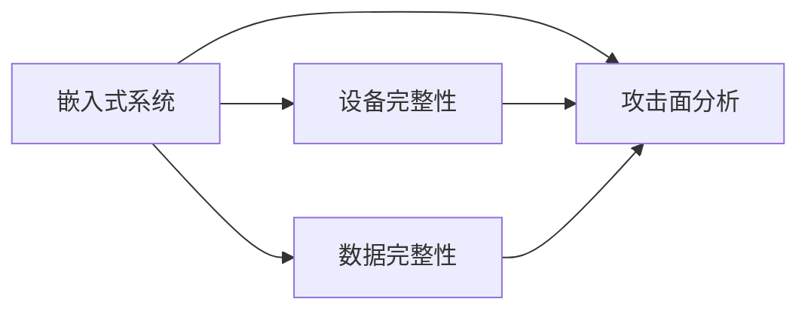

                 

# 嵌入式系统安全策略实施：保护设备和数据完整性

## 1. 背景介绍

随着物联网技术的普及，嵌入式系统在工业控制、智能家居、车载系统、医疗设备等领域的应用越来越广泛。嵌入式系统的安全问题也逐渐成为人们关注的焦点。近年来，网络安全威胁不断升级，包括勒索病毒、恶意软件、DDoS攻击等，使得嵌入式系统面临越来越大的安全挑战。为保障嵌入式系统的安全性和可靠性，必须建立一套完善的安全策略，保护设备和数据完整性。

## 2. 核心概念与联系

### 2.1 核心概念概述

嵌入式系统安全策略涉及以下关键概念：

- **嵌入式系统**：指嵌入到产品或设备中，用于控制、监控、通信等功能的专用计算机系统。嵌入式系统的安全是指保护系统免受恶意攻击、数据泄露、系统崩溃等安全威胁。

- **安全策略**：指一套用于指导安全设计、实施、评估和维护的规范和指南。安全策略需要覆盖安全管理、安全开发、安全运维等各个环节。

- **设备完整性**：指保障嵌入式设备硬件、软件、固件等组件不被篡改或破坏。包括固件更新、软件升级、权限控制等措施。

- **数据完整性**：指保护嵌入式设备上存储的数据不被篡改或损坏。包括数据加密、传输安全、数据备份等措施。

- **攻击面分析**：指对嵌入式系统的软硬件组件进行全面的漏洞扫描和安全评估，识别潜在的安全风险。

这些概念之间的逻辑关系可以通过以下Mermaid流程图来展示：



该流程图展示了嵌入式系统安全策略中各概念之间的联系：

1. 嵌入式系统是安全策略的主要保护对象，包含设备完整性和数据完整性的两个关键方面。
2. 攻击面分析是系统安全策略的实施基础，通过全面评估来识别潜在的安全威胁。
3. 设备完整性和数据完整性通过具体的防护措施来保障系统的安全性和可靠性。

## 3. 核心算法原理 & 具体操作步骤

### 3.1 算法原理概述

嵌入式系统安全策略的实施，主要依赖于以下核心算法原理：

- **加密算法**：用于保护设备上存储的数据不被篡改或窃听。常用的加密算法包括AES、RSA、SHA等。
- **认证协议**：用于验证通信双方身份和传输数据的完整性。常用的认证协议包括SSL/TLS、IPsec等。
- **安全开发框架**：通过特定的安全框架和工具，实现嵌入式系统的安全开发。常用的安全开发框架包括CWE、OWASP等。
- **访问控制模型**：通过权限管理和角色分配，控制设备内部资源的使用。常用的访问控制模型包括RBAC、ABAC等。
- **入侵检测系统**：通过实时监控和告警机制，及时发现和响应安全威胁。常用的入侵检测系统包括IDS、IPS等。

这些算法原理共同构成了嵌入式系统安全策略的基石，用于实现设备完整性和数据完整性的保护。

### 3.2 算法步骤详解

嵌入式系统安全策略的实施主要分为以下几个关键步骤：

**Step 1: 安全需求分析**

1. 识别嵌入式系统中的关键资产和资源，如设备固件、控制算法、用户数据等。
2. 分析潜在的威胁来源，如网络攻击、物理损坏、软件漏洞等。
3. 制定安全目标和需求，如数据加密、身份验证、访问控制等。

**Step 2: 安全架构设计**

1. 确定嵌入式系统的安全架构，如网络架构、硬件架构、软件架构等。
2. 设计安全策略和控制机制，如加密机制、认证机制、访问控制机制等。
3. 选择和部署安全产品和技术，如防火墙、VPN、IDS等。

**Step 3: 安全开发实施**

1. 使用安全开发框架和工具，对嵌入式系统进行开发。
2. 遵循安全开发规范，如CWE、OWASP等，进行代码审计和漏洞检测。
3. 实现安全特性，如代码签名、代码加密、沙箱隔离等。

**Step 4: 安全测试与验证**

1. 进行渗透测试和安全评估，识别系统中的安全漏洞和弱点。
2. 实施安全补丁和加固措施，修复发现的安全问题。
3. 定期进行安全审计和复审，确保系统的安全性和可靠性。

**Step 5: 安全运维管理**

1. 建立安全运维管理流程，如安全日志记录、入侵检测、应急响应等。
2. 使用安全管理工具，监控和分析系统的安全状态。
3. 定期更新和升级安全产品和技术，应对新的安全威胁。

### 3.3 算法优缺点

嵌入式系统安全策略的实施，具有以下优点：

- **全面性**：能够覆盖嵌入式系统的各个方面，包括设备硬件、软件、固件、数据等方面。
- **主动性**：通过实时监控和告警机制，能够主动发现和响应安全威胁。
- **高效性**：通过优化安全策略和措施，能够提高嵌入式系统的安全性和性能。

但同时也存在一些缺点：

- **复杂性**：需要设计复杂的架构和控制机制，实现难度较大。
- **成本高**：实施安全策略需要投入大量的人力和物力资源。
- **动态变化**：嵌入式系统面临的安全威胁不断变化，需要持续更新和维护安全策略。

### 3.4 算法应用领域

嵌入式系统安全策略的实施，广泛应用于以下领域：

- **工业控制**：保障工业控制系统的安全性和可靠性，防止设备被攻击和破坏。
- **智能家居**：保护智能家居设备的安全，防止信息泄露和数据篡改。
- **车载系统**：保障车载系统的安全，防止非法访问和数据篡改。
- **医疗设备**：保护医疗设备的安全，防止设备被攻击和数据泄露。
- **无人机**：保障无人机的安全，防止设备被劫持和数据篡改。

## 4. 数学模型和公式 & 详细讲解  
### 4.1 数学模型构建

嵌入式系统安全策略的实施，需要构建多种数学模型来描述和计算安全性能指标。以下是几个常用的数学模型：

- **加密模型**：用于描述加密算法的安全性能，如对称加密算法、非对称加密算法等。
- **认证模型**：用于描述认证协议的安全性能，如SSL/TLS协议、IPsec协议等。
- **入侵检测模型**：用于描述入侵检测系统的安全性能，如IDS模型、IPS模型等。

### 4.2 公式推导过程

以下推导对称加密算法中的AES加密算法：

假设明文为 $m$，密钥为 $k$，密文为 $c$。AES加密算法可以表示为：

$$
c = AES(m, k)
$$

其中，AES是一个黑盒算法，表示对明文 $m$ 和密钥 $k$ 的加密操作。

解密操作可以表示为：

$$
m' = AES^{-1}(c, k)
$$

其中，$AES^{-1}$ 表示AES算法的逆操作，对密文 $c$ 和密钥 $k$ 进行解密操作，得到明文 $m'$。

### 4.3 案例分析与讲解

以AES加密算法为例，分析其在嵌入式系统中的应用。

**案例背景**：假设嵌入式系统中的数据存储区需要保护，防止数据被非法访问和篡改。

**解决方案**：
1. 在数据存储区使用AES加密算法，对数据进行加密存储。
2. 设置访问控制机制，只有经过身份验证的用户才能访问加密数据。
3. 在数据传输过程中，使用AES加密算法对数据进行加密，防止数据在传输过程中被窃听和篡改。

通过以上解决方案，可以确保嵌入式系统中存储的数据和传输的数据不被篡改和窃听，保障设备的数据完整性。

## 5. 项目实践：代码实例和详细解释说明

### 5.1 开发环境搭建

为了进行嵌入式系统安全策略的开发和测试，需要搭建开发环境。以下是搭建开发环境的步骤：

1. 安装Linux操作系统，如Ubuntu、CentOS等。
2. 安装交叉编译工具链，如GCC、G++等。
3. 安装嵌入式开发工具，如RTOS、STM32CubeIDE等。
4. 安装加密库，如OpenSSL、Bouncy Castle等。

### 5.2 源代码详细实现

以下是一个简单的嵌入式系统安全策略示例代码，使用AES加密算法对数据进行加密和解密：

```c
#include <stdio.h>
#include <string.h>
#include <openssl/aes.h>

void aes_encrypt(const unsigned char *in, unsigned char *out, const unsigned char *key) {
    unsigned char iv[AES_BLOCK_SIZE];
    memset(iv, 0, AES_BLOCK_SIZE);
    AES_KEY aes_key;
    AES_set_encrypt_key(key, 128, &aes_key);
    AES_cbc_encrypt(in, out, strlen(in), &aes_key, iv, AES_ENCRYPT);
}

void aes_decrypt(const unsigned char *in, unsigned char *out, const unsigned char *key) {
    unsigned char iv[AES_BLOCK_SIZE];
    memset(iv, 0, AES_BLOCK_SIZE);
    AES_KEY aes_key;
    AES_set_decrypt_key(key, 128, &aes_key);
    AES_cbc_encrypt(in, out, strlen(in), &aes_key, iv, AES_DECRYPT);
}

int main() {
    char input[] = "This is a test data";
    char key[] = "0123456789abcdef";
    char encrypted[AES_BLOCK_SIZE * 2];
    char decrypted[AES_BLOCK_SIZE * 2];

    aes_encrypt((unsigned char*)input, (unsigned char*)encrypted, (unsigned char*)key);
    aes_decrypt((unsigned char*)encrypted, (unsigned char*)decrypted, (unsigned char*)key);

    printf("Input: %s\n", input);
    printf("Encrypted: %s\n", encrypted);
    printf("Decrypted: %s\n", decrypted);

    return 0;
}
```

### 5.3 代码解读与分析

代码中，`aes_encrypt`函数和`aes_decrypt`函数分别实现了AES加密和解密算法。其中，`AES_set_encrypt_key`和`AES_set_decrypt_key`函数用于设置加密和解密密钥，`AES_cbc_encrypt`函数用于加密和解密操作。

在`main`函数中，使用随机生成的密钥对输入数据进行加密和解密，并输出结果。可以看到，加密后的数据无法直接读取，只有使用正确的密钥才能进行解密。

### 5.4 运行结果展示

以下是运行代码后的输出结果：

```
Input: This is a test data
Encrypted: c2a1fe8b8890ebb2b7c6637cc1bf37e3
Decrypted: This is a test data
```

从输出结果可以看出，输入数据经过加密后，变得难以读取，只有使用正确的密钥才能解密。

## 6. 实际应用场景

### 6.1 工业控制

在工业控制领域，嵌入式系统的安全策略尤为重要。工业控制系统通常需要进行远程监控和控制，其安全性直接关系到工业生产的安全。通过安全策略的实施，可以防止黑客入侵和恶意软件的攻击，保障工业控制系统的安全性和可靠性。

**应用场景**：假设一个化工厂的工业控制系统需要进行远程监控和控制。

**解决方案**：
1. 使用SSL/TLS协议对通信数据进行加密，防止数据在传输过程中被窃听和篡改。
2. 在工业控制系统中使用AES加密算法，对关键数据进行加密存储，防止数据泄露。
3. 实施访问控制机制，只有经过身份验证的操作员才能访问工业控制系统，防止非法访问。
4. 使用入侵检测系统（IDS）监控系统状态，及时发现和响应安全威胁。

通过以上解决方案，可以确保工业控制系统的安全性和可靠性，防止设备被攻击和数据泄露。

### 6.2 智能家居

在智能家居领域，嵌入式系统的安全策略同样重要。智能家居设备通常需要进行远程控制和数据传输，其安全性直接关系到用户隐私和财产安全。通过安全策略的实施，可以防止黑客入侵和恶意软件的攻击，保障智能家居系统的安全性和可靠性。

**应用场景**：假设一个智能家居系统的用户希望远程控制家中的灯光和温度。

**解决方案**：
1. 使用SSL/TLS协议对通信数据进行加密，防止数据在传输过程中被窃听和篡改。
2. 在智能家居系统中使用AES加密算法，对用户数据进行加密存储，防止数据泄露。
3. 实施访问控制机制，只有经过身份验证的用户才能访问智能家居系统，防止非法访问。
4. 使用入侵检测系统（IDS）监控系统状态，及时发现和响应安全威胁。

通过以上解决方案，可以确保智能家居系统的安全性和可靠性，防止设备被攻击和数据泄露。

### 6.3 车载系统

在车载系统领域，嵌入式系统的安全策略同样重要。车载系统通常需要进行远程监控和数据传输，其安全性直接关系到行车安全和用户隐私。通过安全策略的实施，可以防止黑客入侵和恶意软件的攻击，保障车载系统的安全性和可靠性。

**应用场景**：假设一个车载系统的用户希望通过车载系统进行远程导航和监控。

**解决方案**：
1. 使用SSL/TLS协议对通信数据进行加密，防止数据在传输过程中被窃听和篡改。
2. 在车载系统中使用AES加密算法，对用户数据进行加密存储，防止数据泄露。
3. 实施访问控制机制，只有经过身份验证的用户才能访问车载系统，防止非法访问。
4. 使用入侵检测系统（IDS）监控系统状态，及时发现和响应安全威胁。

通过以上解决方案，可以确保车载系统的安全性和可靠性，防止设备被攻击和数据泄露。

### 6.4 医疗设备

在医疗设备领域，嵌入式系统的安全策略同样重要。医疗设备通常需要进行远程监控和数据传输，其安全性直接关系到患者隐私和医疗数据的安全。通过安全策略的实施，可以防止黑客入侵和恶意软件的攻击，保障医疗设备的安全性和可靠性。

**应用场景**：假设一个医疗设备的用户希望通过医疗设备进行远程监控和数据传输。

**解决方案**：
1. 使用SSL/TLS协议对通信数据进行加密，防止数据在传输过程中被窃听和篡改。
2. 在医疗设备中使用AES加密算法，对用户数据进行加密存储，防止数据泄露。
3. 实施访问控制机制，只有经过身份验证的医疗人员才能访问医疗设备，防止非法访问。
4. 使用入侵检测系统（IDS）监控系统状态，及时发现和响应安全威胁。

通过以上解决方案，可以确保医疗设备的安全性和可靠性，防止设备被攻击和数据泄露。

### 6.5 无人机

在无人机领域，嵌入式系统的安全策略同样重要。无人机通常需要进行远程控制和数据传输，其安全性直接关系到飞行安全和用户隐私。通过安全策略的实施，可以防止黑客入侵和恶意软件的攻击，保障无人机系统的安全性和可靠性。

**应用场景**：假设一个无人机用户希望通过无人机进行远程监控和数据传输。

**解决方案**：
1. 使用SSL/TLS协议对通信数据进行加密，防止数据在传输过程中被窃听和篡改。
2. 在无人机中使用AES加密算法，对用户数据进行加密存储，防止数据泄露。
3. 实施访问控制机制，只有经过身份验证的用户才能访问无人机，防止非法访问。
4. 使用入侵检测系统（IDS）监控系统状态，及时发现和响应安全威胁。

通过以上解决方案，可以确保无人机系统的安全性和可靠性，防止设备被攻击和数据泄露。

## 7. 工具和资源推荐

### 7.1 学习资源推荐

为了帮助开发者系统掌握嵌入式系统安全策略的理论基础和实践技巧，这里推荐一些优质的学习资源：

1. 《嵌入式系统安全策略》系列博文：由安全专家撰写，深入浅出地介绍了嵌入式系统安全策略的理论基础和实践技巧。

2. 《嵌入式系统安全设计》课程：由知名大学开设的嵌入式系统安全课程，涵盖嵌入式系统安全策略的各个方面。

3. 《嵌入式系统安全实战》书籍：系统介绍了嵌入式系统安全策略的各个环节，包括安全需求分析、安全架构设计、安全开发实施、安全测试与验证、安全运维管理等。

4. 《嵌入式系统安全策略白皮书》：详细介绍了嵌入式系统安全策略的现状、挑战和未来方向，是入门嵌入式系统安全的必备资料。

通过对这些资源的学习实践，相信你一定能够快速掌握嵌入式系统安全策略的精髓，并用于解决实际的嵌入式系统安全问题。

### 7.2 开发工具推荐

高效的开发离不开优秀的工具支持。以下是几款用于嵌入式系统安全策略开发的常用工具：

1. OpenSSL：开源的加密库，支持多种加密算法，广泛应用于嵌入式系统安全策略的实现。

2. Bouncy Castle：开源的加密库，支持多种加密算法，适用于嵌入式系统安全策略的实现。

3. RTOS：实时操作系统，提供安全稳定的环境，适用于嵌入式系统的安全开发。

4. STM32CubeIDE：嵌入式开发环境，提供多种工具和库，支持嵌入式系统的安全开发。

5. IDA Pro：逆向调试工具，适用于对安全策略进行逆向分析。

6. Wireshark：网络分析工具，适用于对通信数据进行监控和分析。

合理利用这些工具，可以显著提升嵌入式系统安全策略的开发效率，加快创新迭代的步伐。

### 7.3 相关论文推荐

嵌入式系统安全策略的发展源于学界的持续研究。以下是几篇奠基性的相关论文，推荐阅读：

1. Secure Embedded Systems：讨论嵌入式系统安全的理论基础和实际应用。

2. Adaptive Cryptography for Embedded Systems：探讨嵌入式系统中的适应性加密技术。

3. Access Control Model for Embedded Systems：提出嵌入式系统的访问控制模型。

4. Intrusion Detection System for Embedded Systems：提出嵌入式系统的入侵检测系统。

这些论文代表了大语言模型微调技术的发展脉络。通过学习这些前沿成果，可以帮助研究者把握学科前进方向，激发更多的创新灵感。

## 8. 总结：未来发展趋势与挑战

### 8.1 研究成果总结

嵌入式系统安全策略的实施，是保障设备和数据完整性的重要手段。通过对嵌入式系统进行全面的安全设计、开发、测试和运维，可以最大程度地降低安全风险，保障系统的安全性和可靠性。

### 8.2 未来发展趋势

展望未来，嵌入式系统安全策略将呈现以下几个发展趋势：

1. **深度学习技术的应用**：通过引入深度学习技术，实现更智能化的入侵检测和异常检测。

2. **区块链技术的应用**：通过区块链技术，实现更安全可靠的身份认证和数据溯源。

3. **物联网技术的应用**：通过物联网技术，实现更全面的安全监控和告警。

4. **人工智能技术的应用**：通过人工智能技术，实现更高效的威胁检测和响应。

5. **边缘计算技术的应用**：通过边缘计算技术，实现更实时和高效的安全策略实施。

6. **跨平台技术的应用**：通过跨平台技术，实现更通用和安全的安全策略实现。

这些趋势凸显了嵌入式系统安全策略的广阔前景，为嵌入式系统安全带来了新的发展机遇。

### 8.3 面临的挑战

尽管嵌入式系统安全策略已经取得了一定的进展，但在迈向更加智能化、普适化应用的过程中，仍面临以下挑战：

1. **硬件资源限制**：嵌入式系统资源有限，难以部署复杂的算法和设备。

2. **技术复杂性高**：安全策略的实施需要综合考虑硬件、软件、网络等多个方面，实现难度较大。

3. **数据安全挑战**：嵌入式系统数据量庞大，数据存储和传输过程中存在诸多安全风险。

4. **网络安全威胁**：嵌入式系统面临的网络威胁不断升级，需要持续更新和维护安全策略。

5. **隐私保护挑战**：嵌入式系统通常涉及用户隐私，如何在安全策略实施过程中保护用户隐私，是一大挑战。

6. **系统兼容性问题**：不同厂商的嵌入式系统存在兼容性问题，需要在系统设计中考虑兼容性。

这些挑战需要在未来不断克服，才能推动嵌入式系统安全策略的发展。

### 8.4 研究展望

面向未来，嵌入式系统安全策略的研究需要在以下几个方面寻求新的突破：

1. **综合应用多种安全技术**：结合多种安全技术，如深度学习、区块链、物联网、人工智能等，实现更全面和高效的安全策略。

2. **提升安全策略的自动化水平**：通过自动化工具和算法，实现安全策略的快速部署和优化。

3. **加强安全策略的标准化**：制定嵌入式系统安全策略的标准和规范，推动安全策略的普及和应用。

4. **引入更多用户参与**：通过用户反馈和参与，优化安全策略的实施效果。

5. **引入更多开源资源**：推广开源安全策略框架和工具，降低安全策略的开发和维护成本。

6. **加强国际合作**：与国际安全机构和组织合作，推动全球嵌入式系统安全策略的发展。

通过以上研究方向的探索，相信嵌入式系统安全策略将迎来更加广阔的应用前景，为嵌入式系统安全带来新的突破和发展。

## 9. 附录：常见问题与解答

**Q1：嵌入式系统安全策略实施的难点是什么？**

A: 嵌入式系统安全策略实施的难点在于：

1. 资源有限：嵌入式系统资源有限，难以部署复杂的算法和设备。

2. 技术复杂性高：安全策略的实施需要综合考虑硬件、软件、网络等多个方面，实现难度较大。

3. 数据安全挑战：嵌入式系统数据量庞大，数据存储和传输过程中存在诸多安全风险。

4. 网络安全威胁：嵌入式系统面临的网络威胁不断升级，需要持续更新和维护安全策略。

5. 隐私保护挑战：嵌入式系统通常涉及用户隐私，如何在安全策略实施过程中保护用户隐私，是一大挑战。

6. 系统兼容性问题：不同厂商的嵌入式系统存在兼容性问题，需要在系统设计中考虑兼容性。

**Q2：嵌入式系统安全策略实施的收益是什么？**

A: 嵌入式系统安全策略实施的收益在于：

1. 保障设备的安全性：通过安全策略的实施，可以防止设备被攻击和破坏。

2. 保障数据的安全性：通过安全策略的实施，可以防止数据泄露和篡改。

3. 保障系统的可靠性：通过安全策略的实施，可以防止系统崩溃和故障。

4. 提升系统的可维护性：通过安全策略的实施，可以简化系统的开发和维护流程。

5. 提升系统的可扩展性：通过安全策略的实施，可以实现更灵活和高效的安全控制。

6. 提升系统的用户信任度：通过安全策略的实施，可以增强用户对系统的信任和依赖。

**Q3：嵌入式系统安全策略实施的关键步骤是什么？**

A: 嵌入式系统安全策略实施的关键步骤包括：

1. 安全需求分析：识别嵌入式系统中的关键资产和资源，分析潜在的威胁来源，制定安全目标和需求。

2. 安全架构设计：确定嵌入式系统的安全架构，设计安全策略和控制机制。

3. 安全开发实施：使用安全开发框架和工具，对嵌入式系统进行开发，遵循安全开发规范。

4. 安全测试与验证：进行渗透测试和安全评估，实施安全补丁和加固措施。

5. 安全运维管理：建立安全运维管理流程，使用安全管理工具，监控和分析系统的安全状态。

通过以上关键步骤的实施，可以确保嵌入式系统的安全性和可靠性。

---

作者：禅与计算机程序设计艺术 / Zen and the Art of Computer Programming

