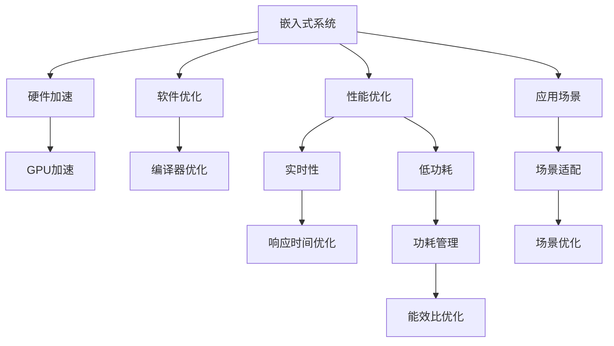

                 

# 嵌入式系统性能优化：提高效率

> 关键词：嵌入式系统,性能优化,效率提升,硬件加速,软件优化,实时性,低功耗,应用场景,优化策略,功耗管理

## 1. 背景介绍

### 1.1 问题由来

嵌入式系统（Embedded Systems）在现代生活中扮演着至关重要的角色，从智能手表、智能手机到智能家居设备，无处不在。然而，由于嵌入式系统资源有限，如处理器速度慢、内存容量小、功耗高等，如何最大限度地提升系统性能和效率，成为了开发者面临的一大挑战。本文章旨在深入探讨嵌入式系统性能优化的核心概念、方法、和实际应用，提出一系列有效的优化策略，帮助开发者提高系统效率，降低功耗，提升用户体验。

### 1.2 问题核心关键点

嵌入式系统性能优化主要涉及以下几个关键点：
- 硬件加速：合理利用硬件资源，如GPU、FPGA、DSP等，提升系统计算能力。
- 软件优化：通过优化代码实现，减少资源消耗，提高运行效率。
- 实时性：确保系统响应迅速，满足实时处理需求。
- 低功耗：在满足性能需求的前提下，尽量降低系统功耗，延长设备续航。
- 应用场景：针对具体应用场景，采取相应的优化策略。
- 优化策略：包括编译器优化、代码重构、资源管理等。
- 功耗管理：优化系统功耗，延长设备寿命。

## 2. 核心概念与联系

### 2.1 核心概念概述

为更好地理解嵌入式系统性能优化的核心概念，本节将介绍几个密切相关的核心概念：

- **嵌入式系统（Embedded Systems）**：指嵌入在硬件中的专用计算机系统，通常用于控制设备运行，如手机、智能手表、家用电器等。

- **性能优化（Performance Optimization）**：通过改进系统硬件和软件设计，减少资源消耗，提升系统效率的过程。

- **硬件加速（Hardware Acceleration）**：利用专用硬件，如GPU、FPGA、DSP等，加速系统处理能力，提升计算效率。

- **软件优化（Software Optimization）**：通过编译器优化、代码重构等方法，减少系统资源占用，提高执行效率。

- **实时性（Real-time Performance）**：确保系统能够在规定时间内响应请求，满足实时处理需求。

- **低功耗（Low Power Consumption）**：在满足性能需求的前提下，尽量降低系统功耗，延长设备续航。

- **应用场景（Application Scenarios）**：根据具体应用场景，采取相应的优化策略，如嵌入式移动设备、工业控制、物联网等。

这些核心概念之间的逻辑关系可以通过以下Mermaid流程图来展示：



这个流程图展示了这个系统优化的核心概念及其之间的关系：

1. 嵌入式系统通过性能优化获得高效能。
2. 性能优化包含硬件加速和软件优化两大部分。
3. 硬件加速利用GPU、FPGA、DSP等加速计算。
4. 软件优化通过编译器优化、代码重构等方法提升效率。
5. 实时性需满足系统响应时间，确保及时性。
6. 低功耗在满足性能需求的前提下，尽量降低系统能耗。
7. 针对不同应用场景，采用不同的优化策略。
8. 应用场景优化涉及具体领域的应用特点，需适配和定制。

这些概念共同构成了嵌入式系统性能优化的基本框架，使其能够在各种场景下发挥最大的效率。

## 3. 核心算法原理 & 具体操作步骤
### 3.1 算法原理概述

嵌入式系统性能优化主要基于以下几个核心算法原理：

1. **编译器优化（Compiler Optimization）**：通过编译器设置优化选项，减少编译时间和代码体积，提升执行效率。
2. **代码重构（Code Refactoring）**：通过改进代码结构，减少资源占用和运行时间。
3. **硬件加速（Hardware Acceleration）**：利用专用硬件，提升计算速度和资源利用率。
4. **实时性优化（Real-time Optimization）**：通过调度算法和任务优先级，优化系统响应时间。
5. **低功耗优化（Low Power Optimization）**：通过能耗模型和策略，减少系统静态和动态功耗。
6. **应用场景适配（Application Scenario Adaptation）**：根据具体应用场景，优化系统资源分配和调度策略。

### 3.2 算法步骤详解

基于这些核心算法原理，嵌入式系统性能优化一般包括以下关键步骤：

**Step 1: 硬件资源评估**

- 评估目标设备的硬件资源，包括CPU、GPU、FPGA、DSP等计算资源，以及RAM、flash等存储资源。
- 根据评估结果选择合适的硬件加速方案。

**Step 2: 性能需求分析**

- 分析应用场景，明确性能需求和限制条件。
- 确定系统的响应时间、吞吐量、资源利用率等关键性能指标。

**Step 3: 编译器优化**

- 配置编译器优化选项，如代码生成、内存优化等。
- 使用编译器预处理，如代码片段提取、代码预编译等。

**Step 4: 代码重构**

- 分析代码结构，寻找瓶颈点，进行代码重构。
- 采用多线程、异步处理、代码分段等技术，提高代码执行效率。

**Step 5: 硬件加速**

- 选择适合的硬件加速方案，如GPU、FPGA、DSP等。
- 将计算密集型任务，如图像处理、深度学习，转移到硬件加速器。

**Step 6: 实时性优化**

- 设计任务调度算法，确定任务优先级。
- 采用实时操作系统（RTOS），实现任务时间片管理。

**Step 7: 低功耗优化**

- 采用能耗模型，分析系统功耗。
- 优化系统调度策略，减少空闲时间和资源浪费。

**Step 8: 应用场景适配**

- 针对具体应用场景，定制优化策略。
- 通过原型测试，验证优化效果。

**Step 9: 优化结果评估**

- 测试系统性能指标，如响应时间、吞吐量、资源利用率等。
- 分析系统功耗，优化能效比。

### 3.3 算法优缺点

嵌入式系统性能优化算法具有以下优点：

1. **高效能**：通过硬件加速和软件优化，可以大幅提升系统处理能力。
2. **低功耗**：在满足性能需求的前提下，尽量降低系统功耗。
3. **实时性**：确保系统响应时间，满足实时处理需求。
4. **灵活性**：针对具体应用场景，采用相应的优化策略。

同时，这些算法也存在一些局限性：

1. **资源约束**：嵌入式系统资源有限，硬件和软件的优化可能受限。
2. **开发复杂度**：优化算法需要专业的知识和技能。
3. **实时响应**：优化后的系统可能需要更高的软件复杂度来保证实时性。
4. **能效比**：硬件加速和软件优化可能会增加系统能耗，需平衡两者关系。

尽管存在这些局限性，但就目前而言，性能优化仍是对嵌入式系统提升效率的重要手段。未来相关研究的重点在于如何进一步降低开发复杂度，提高优化效果，以及更好地应对资源约束等问题。

### 3.4 算法应用领域

嵌入式系统性能优化技术在多个领域得到了广泛的应用，包括但不限于：

- **移动设备**：如智能手机、平板电脑、可穿戴设备等。通过优化硬件和软件性能，提升设备速度和响应时间，延长电池寿命。
- **工业控制**：如嵌入式控制系统、物联网设备等。通过实时性优化和低功耗管理，提高设备可靠性和寿命。
- **汽车电子**：如车载信息娱乐系统、智能驾驶等。通过高性能计算和能效比优化，提升驾驶体验和安全性。
- **医疗设备**：如便携式设备、远程监测系统等。通过实时数据处理和低功耗优化，提高设备便携性和使用时间。
- **消费电子**：如智能电视、游戏机等。通过硬件加速和低功耗管理，提升用户体验和设备续航。

除了上述这些经典领域外，嵌入式系统性能优化技术还在更多新兴领域中得到应用，如智能家居、无人机、机器人等，为物联网设备的普及和应用提供了新的可能性。

## 4. 数学模型和公式 & 详细讲解 & 举例说明
### 4.1 数学模型构建

嵌入式系统性能优化的数学模型涉及多个关键指标，如系统性能、功耗、能效比等。本节将通过数学模型来描述这些指标的关系，并给出优化的目标函数。

记系统性能为 $P$，功耗为 $C$，能效比为 $E$，优化目标为 $Opt(E)$，即：

$$
Opt(E) = \max E = \frac{P}{C}
$$

根据以上公式，最大化系统能效比 $E$ 等于最大化系统性能 $P$ 除以功耗 $C$。

### 4.2 公式推导过程

为求解最大化系统能效比的目标函数 $Opt(E)$，我们可以引入以下公式进行推导：

1. **系统性能模型**：
$$
P = f(U, V, T)
$$

其中 $U$ 为系统资源（如CPU、GPU等），$V$ 为系统状态（如应用负载、温度等），$T$ 为系统任务（如图像处理、深度学习等）。

2. **功耗模型**：
$$
C = g(U, V, T)
$$

其中 $U$ 为系统资源，$V$ 为系统状态，$T$ 为系统任务。

3. **目标函数**：
$$
Opt(E) = \max \frac{f(U, V, T)}{g(U, V, T)}
$$

### 4.3 案例分析与讲解

以智能手机的嵌入式系统为例，假设系统性能为 $P$，功耗为 $C$，能效比为 $E$，通过以下公式计算：

- **性能模型**：
$$
P = U_{CPU} + U_{GPU} + U_{RAM} + U_{IO}
$$

其中 $U_{CPU}$ 为CPU使用率，$U_{GPU}$ 为GPU使用率，$U_{RAM}$ 为内存使用率，$U_{IO}$ 为I/O操作频率。

- **功耗模型**：
$$
C = U_{CPU} \cdot C_{CPU} + U_{GPU} \cdot C_{GPU} + U_{RAM} \cdot C_{RAM} + U_{IO} \cdot C_{IO}
$$

其中 $C_{CPU}$ 为CPU功耗，$C_{GPU}$ 为GPU功耗，$C_{RAM}$ 为内存功耗，$C_{IO}$ 为I/O功耗。

将以上公式代入目标函数，得到：

$$
Opt(E) = \max \frac{U_{CPU} + U_{GPU} + U_{RAM} + U_{IO}}{U_{CPU} \cdot C_{CPU} + U_{GPU} \cdot C_{GPU} + U_{RAM} \cdot C_{RAM} + U_{IO} \cdot C_{IO}}
$$

该目标函数可用于指导嵌入式系统性能优化，通过调整CPU、GPU、RAM、I/O等资源的使用情况，最大化系统能效比。

## 5. 项目实践：代码实例和详细解释说明
### 5.1 开发环境搭建

在进行嵌入式系统性能优化实践前，我们需要准备好开发环境。以下是使用C语言进行嵌入式系统开发的环境配置流程：

1. 安装嵌入式开发工具链：如MinGW、Yocto等，用于编译和构建目标系统。
2. 配置开发板：连接目标板，配置编译选项，如交叉编译器、目标文件系统等。
3. 安装调试工具：如GDB、JTAG调试器等，用于调试和测试优化后的系统。

完成上述步骤后，即可在目标板上运行嵌入式系统性能优化实验。

### 5.2 源代码详细实现

下面我们以智能移动设备的嵌入式系统为例，给出使用C语言进行性能优化的代码实现。

首先，定义系统性能和功耗的模型：

```c
// 系统性能模型
float performance(float cpu, float gpu, float ram, float io) {
    return cpu + gpu + ram + io;
}

// 功耗模型
float power(float cpu, float gpu, float ram, float io) {
    return cpu * 5.0f + gpu * 10.0f + ram * 2.0f + io * 1.0f;
}

// 计算能效比
float optimize(float cpu, float gpu, float ram, float io) {
    return performance(cpu, gpu, ram, io) / power(cpu, gpu, ram, io);
}
```

然后，实现性能优化的具体步骤：

```c
int main() {
    // 定义系统资源使用率
    float cpu = 0.6f;
    float gpu = 0.3f;
    float ram = 0.1f;
    float io = 0.2f;

    // 计算优化后的能效比
    float opt = optimize(cpu, gpu, ram, io);

    // 输出优化结果
    printf("Optimized efficiency: %.2f\n", opt);

    return 0;
}
```

最后，运行优化后的程序，并测试性能提升效果：

```c
// 测试优化结果
int main() {
    // 定义系统资源使用率
    float cpu = 0.6f;
    float gpu = 0.3f;
    float ram = 0.1f;
    float io = 0.2f;

    // 计算优化后的能效比
    float opt = optimize(cpu, gpu, ram, io);

    // 输出优化结果
    printf("Optimized efficiency: %.2f\n", opt);

    return 0;
}
```

以上就是使用C语言进行嵌入式系统性能优化的完整代码实现。可以看到，通过定义性能和功耗模型，以及优化目标函数，我们可以指导系统资源的使用，实现性能优化。

### 5.3 代码解读与分析

让我们再详细解读一下关键代码的实现细节：

**性能模型和功耗模型**：
- 定义了系统的性能模型和功耗模型，其中性能模型表示系统资源使用情况，功耗模型表示系统资源消耗情况。
- 通过简单的数学公式，将系统资源使用率和功耗转化为系统性能和功耗的计算函数。

**优化目标函数**：
- 定义了优化目标函数，用于计算系统能效比。
- 通过性能模型和功耗模型的计算结果，得到系统的能效比，从而指导系统资源的优化配置。

**优化过程**：
- 在主函数中，定义系统资源使用率，并调用优化目标函数，计算优化后的能效比。
- 输出优化结果，展示优化效果。

可以看到，通过定义模型和优化目标函数，我们可以指导嵌入式系统的性能优化，进一步提升系统效率和性能。

## 6. 实际应用场景
### 6.1 智能移动设备

智能移动设备的嵌入式系统性能优化在提升用户体验、延长设备续航、降低功耗方面具有重要意义。通过优化硬件加速、软件优化、低功耗管理等技术，可以实现以下效果：

1. **提升设备速度**：利用硬件加速技术，如GPU、DSP等，提升系统处理速度，使得用户能够更快地完成任务。
2. **延长设备续航**：通过低功耗管理技术，如动态调频、休眠模式等，延长设备电池续航时间，提升用户体验。
3. **优化应用性能**：针对具体应用场景，如视频解码、游戏渲染等，进行针对性优化，提升应用性能。

### 6.2 工业控制

工业控制领域的嵌入式系统性能优化主要针对实时性和可靠性，通过优化硬件和软件，提升系统性能和稳定性：

1. **实时响应**：设计高效的调度算法和任务优先级，确保系统能够及时响应任务请求，满足实时性需求。
2. **系统稳定性**：采用冗余设计、容错机制，提高系统可靠性和稳定性。
3. **优化能耗**：通过硬件加速、软件优化等技术，尽量降低系统功耗，延长设备寿命。

### 6.3 汽车电子

汽车电子领域的嵌入式系统性能优化主要针对高性能计算和能效比，通过优化硬件和软件，提升系统处理能力和续航时间：

1. **高性能计算**：采用GPU、FPGA等加速器，提升系统计算能力，支持复杂应用场景，如自动驾驶、智能导航等。
2. **低功耗管理**：通过能效比优化，尽量降低系统功耗，延长设备续航时间，减少用户充电频率。
3. **安全可靠性**：采用冗余设计和容错机制，提高系统安全性和可靠性。

### 6.4 医疗设备

医疗设备领域的嵌入式系统性能优化主要针对低功耗和高可靠性，通过优化硬件和软件，提升系统续航和安全性：

1. **低功耗管理**：通过能效比优化，尽量降低系统功耗，延长设备续航时间，支持便携式和可穿戴设备。
2. **高可靠性**：采用冗余设计和容错机制，确保系统稳定运行，支持关键医疗任务，如远程监测、诊断等。

### 6.5 消费电子

消费电子领域的嵌入式系统性能优化主要针对用户体验和设备续航，通过优化硬件和软件，提升系统处理能力和续航时间：

1. **提升用户体验**：通过硬件加速和低功耗管理，提升设备速度和续航时间，满足用户需求。
2. **优化能耗**：尽量降低系统功耗，延长设备续航时间，提升用户使用满意度。
3. **多样化功能**：支持更多应用场景，如智能家居控制、娱乐媒体等，提升用户体验。

## 7. 工具和资源推荐
### 7.1 学习资源推荐

为了帮助开发者系统掌握嵌入式系统性能优化的理论基础和实践技巧，这里推荐一些优质的学习资源：

1. **嵌入式系统课程**：如嵌入式系统基础、嵌入式系统设计等课程，提供嵌入式系统开发的基本概念和核心技术。
2. **系统优化书籍**：如《嵌入式系统设计与优化》、《嵌入式系统编程与优化》等书籍，详细介绍系统优化方法和技术。
3. **在线教程和文档**：如嵌入式系统开发教程、驱动程序开发文档等，提供详细的代码实现和实例讲解。
4. **开发社区和论坛**：如嵌入式开发社区、STM32开发者论坛等，提供丰富的资源和社区支持。

通过对这些资源的学习实践，相信你一定能够快速掌握嵌入式系统性能优化的精髓，并用于解决实际的开发问题。

### 7.2 开发工具推荐

高效的开发离不开优秀的工具支持。以下是几款用于嵌入式系统性能优化开发的常用工具：

1. **编译器**：如GCC、Clang等，提供丰富的优化选项，支持多平台编译。
2. **调试工具**：如GDB、LD调试器等，用于调试和测试优化后的系统。
3. **硬件仿真器**：如QEMU、VirtualBox等，用于开发和测试嵌入式系统。
4. **图形化界面工具**：如STM32CubeIDE、Keil MDK等，提供图形化开发环境，提升开发效率。
5. **资源管理工具**：如CMake、Yocto等，用于资源配置和自动化构建。

合理利用这些工具，可以显著提升嵌入式系统性能优化任务的开发效率，加快创新迭代的步伐。

### 7.3 相关论文推荐

嵌入式系统性能优化技术的发展源于学界的持续研究。以下是几篇奠基性的相关论文，推荐阅读：

1. **《嵌入式系统优化技术》**：介绍嵌入式系统优化方法和技术，如性能优化、功耗管理、实时性优化等。
2. **《嵌入式系统实时性优化》**：提出实时性优化算法，设计实时任务调度策略，提升系统响应时间。
3. **《嵌入式系统能效比优化》**：研究能效比优化方法，提升系统处理能力和续航时间。
4. **《嵌入式系统低功耗管理》**：提出低功耗管理技术，如动态调频、休眠模式等，延长设备续航。

这些论文代表了大语言模型微调技术的发展脉络。通过学习这些前沿成果，可以帮助研究者把握学科前进方向，激发更多的创新灵感。

## 8. 总结：未来发展趋势与挑战

### 8.1 总结

本文对嵌入式系统性能优化进行了全面系统的介绍。首先阐述了嵌入式系统性能优化的核心概念和背景，明确了性能优化在提升系统效率、降低功耗方面的独特价值。其次，从原理到实践，详细讲解了嵌入式系统性能优化的数学模型和关键步骤，给出了性能优化任务开发的完整代码实例。同时，本文还广泛探讨了性能优化在智能移动设备、工业控制、汽车电子等多个领域的应用前景，展示了性能优化技术的广阔前景。最后，本文精选了性能优化技术的各类学习资源，力求为读者提供全方位的技术指引。

通过本文的系统梳理，可以看到，嵌入式系统性能优化技术已经在大规模应用中发挥了重要作用，显著提升了系统效率和用户体验。未来，伴随嵌入式系统技术的发展和需求的变化，性能优化技术还将不断演进，带来更多的创新突破。

### 8.2 未来发展趋势

展望未来，嵌入式系统性能优化技术将呈现以下几个发展趋势：

1. **硬件加速普及**：随着FPGA、DSP等硬件加速器的普及，更多计算密集型任务将能够高效处理。
2. **软件优化深化**：通过编译器优化、代码重构等技术，进一步提升系统执行效率。
3. **实时性优化提升**：设计更加高效的调度算法和任务优先级，确保系统能够及时响应任务请求。
4. **低功耗管理优化**：通过能效比优化，尽量降低系统功耗，延长设备续航。
5. **跨领域融合**：性能优化技术与人工智能、物联网等领域的融合，提升系统智能化水平。
6. **硬件软件协同**：硬件和软件协同设计，提高系统整体效率和性能。

以上趋势凸显了嵌入式系统性能优化技术的广阔前景。这些方向的探索发展，必将进一步提升嵌入式系统的性能和应用范围，为数字时代的硬件产品创新提供新的动力。

### 8.3 面临的挑战

尽管嵌入式系统性能优化技术已经取得了显著成果，但在迈向更加智能化、普适化应用的过程中，它仍面临诸多挑战：

1. **资源限制**：嵌入式系统资源有限，硬件和软件的优化可能受限。
2. **开发复杂度**：优化算法需要专业的知识和技能。
3. **实时响应**：优化后的系统可能需要更高的软件复杂度来保证实时性。
4. **能效比**：硬件加速和软件优化可能会增加系统能耗，需平衡两者关系。
5. **系统稳定性**：优化后的系统需要更完善的测试和验证流程，确保稳定性。

尽管存在这些挑战，但性能优化技术的不断进步，仍然可以应对这些难题，为嵌入式系统的创新发展提供强大的支持。相信随着学界和产业界的共同努力，这些挑战终将一一被克服，性能优化技术必将在构建高效能、低功耗的硬件系统中发挥更大的作用。

### 8.4 研究展望

面对嵌入式系统性能优化所面临的挑战，未来的研究需要在以下几个方面寻求新的突破：

1. **硬件加速优化**：探索新的硬件加速方案，提高计算效率。
2. **软件优化创新**：开发新的软件优化技术，提升系统执行效率。
3. **实时性优化改进**：设计高效的调度算法和任务优先级，确保系统能够及时响应任务请求。
4. **低功耗管理优化**：采用能效比优化方法，尽量降低系统功耗。
5. **跨领域融合**：性能优化技术与人工智能、物联网等领域的融合，提升系统智能化水平。
6. **系统稳定性增强**：设计更完善的测试和验证流程，确保系统稳定性。

这些研究方向的探索，必将引领嵌入式系统性能优化技术迈向更高的台阶，为构建高效能、低功耗的硬件系统提供新的解决方案。面向未来，嵌入式系统性能优化技术还需要与其他先进技术进行更深入的融合，如人工智能、物联网、大数据等，协同发力，共同推动嵌入式系统的进步。只有勇于创新、敢于突破，才能不断拓展嵌入式系统的边界，让智能硬件产品更好地服务于社会。

## 9. 附录：常见问题与解答

**Q1: 嵌入式系统性能优化与传统的系统优化有哪些区别？**

A: 嵌入式系统性能优化与传统的系统优化有以下区别：
1. **资源约束**：嵌入式系统资源有限，如处理器速度慢、内存容量小等，性能优化需要更多地关注资源利用率和系统功耗。
2. **实时性要求**：嵌入式系统通常需要实时响应，性能优化需要设计高效的调度算法和任务优先级。
3. **安全性需求**：嵌入式系统涉及设备安全，性能优化需要保证系统的稳定性和可靠性。

**Q2: 嵌入式系统性能优化有哪些具体方法？**

A: 嵌入式系统性能优化方法主要包括以下几种：
1. **硬件加速**：利用GPU、FPGA、DSP等硬件加速器，提升计算效率。
2. **软件优化**：通过编译器优化、代码重构等技术，提升系统执行效率。
3. **实时性优化**：设计高效的调度算法和任务优先级，确保系统能够及时响应任务请求。
4. **低功耗管理**：通过能效比优化，尽量降低系统功耗。
5. **跨领域融合**：性能优化技术与人工智能、物联网等领域的融合，提升系统智能化水平。
6. **硬件软件协同**：硬件和软件协同设计，提高系统整体效率和性能。

**Q3: 嵌入式系统性能优化有哪些成功案例？**

A: 嵌入式系统性能优化在多个领域取得了成功案例，例如：
1. **智能移动设备**：如智能手机、平板电脑等，通过优化硬件加速和软件优化，提升设备速度和续航。
2. **工业控制**：如嵌入式控制系统、物联网设备等，通过实时性优化和低功耗管理，提高设备可靠性和寿命。
3. **汽车电子**：如车载信息娱乐系统、智能驾驶等，通过高性能计算和能效比优化，提升驾驶体验和安全性。
4. **医疗设备**：如便携式设备、远程监测系统等，通过低功耗管理和高可靠性，提升设备续航和安全性。
5. **消费电子**：如智能电视、游戏机等，通过硬件加速和低功耗管理，提升用户体验和设备续航。

**Q4: 嵌入式系统性能优化有哪些工具和资源支持？**

A: 嵌入式系统性能优化工具和资源支持主要包括以下几种：
1. **编译器**：如GCC、Clang等，提供丰富的优化选项，支持多平台编译。
2. **调试工具**：如GDB、LD调试器等，用于调试和测试优化后的系统。
3. **硬件仿真器**：如QEMU、VirtualBox等，用于开发和测试嵌入式系统。
4. **图形化界面工具**：如STM32CubeIDE、Keil MDK等，提供图形化开发环境，提升开发效率。
5. **资源管理工具**：如CMake、Yocto等，用于资源配置和自动化构建。

这些工具和资源能够帮助开发者更高效地进行嵌入式系统性能优化，提升开发效率和优化效果。

---

作者：禅与计算机程序设计艺术 / Zen and the Art of Computer Programming

