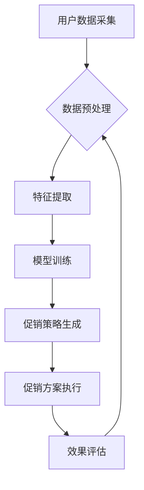

> 智能促销、机器学习、推荐系统、数据分析、个性化营销、A/B测试、优化算法

## 1. 背景介绍

在当今数据爆炸的时代，企业拥有海量用户数据，但如何有效利用这些数据提升营销效果，实现精准营销，成为一个亟待解决的问题。传统的促销策略往往依赖于经验和直觉，缺乏数据支撑，难以精准触达目标用户，导致资源浪费和营销效果不佳。智能促销策略的出现，为企业提供了全新的营销思路和解决方案。

智能促销策略是指利用机器学习、数据分析等先进技术，对用户行为、偏好等进行分析，并根据分析结果制定个性化、精准的促销方案，以提高营销效率和转化率。

## 2. 核心概念与联系

**2.1 核心概念**

* **机器学习 (Machine Learning):**  一种人工智能技术，通过算法学习数据中的模式和规律，从而实现预测、分类、聚类等功能。
* **推荐系统 (Recommendation System):**  根据用户的历史行为、偏好等信息，推荐用户可能感兴趣的商品或服务。
* **数据分析 (Data Analysis):**  通过收集、整理、分析数据，发现数据背后的规律和趋势，为决策提供支持。
* **个性化营销 (Personalized Marketing):**  根据用户的不同需求和特征，提供个性化的产品和服务，以提高用户体验和营销效果。

**2.2 核心架构**



**2.3 联系**

智能促销策略的核心是将机器学习、推荐系统、数据分析等技术有机结合，实现对用户行为的精准分析和预测，从而制定个性化、精准的促销方案。

## 3. 核心算法原理 & 具体操作步骤

**3.1 算法原理概述**

智能促销策略中常用的算法包括：

* **协同过滤 (Collaborative Filtering):**  根据用户的历史行为和相似用户的信息，推荐用户可能感兴趣的商品或服务。
* **内容过滤 (Content-Based Filtering):**  根据用户的历史行为和商品的特征信息，推荐用户可能感兴趣的商品或服务。
* **深度学习 (Deep Learning):**  利用深度神经网络，对用户行为和商品特征进行更深入的学习和分析，实现更精准的推荐。

**3.2 算法步骤详解**

以协同过滤算法为例，其具体步骤如下：

1. **数据收集:** 收集用户对商品的评分、购买记录等数据。
2. **数据预处理:** 对数据进行清洗、转换、归一化等处理，以提高算法的精度。
3. **用户相似度计算:**  根据用户的评分或购买记录，计算用户之间的相似度。
4. **推荐商品:**  对于某个用户，根据与该用户相似度高的用户的评分或购买记录，推荐该用户可能感兴趣的商品。

**3.3 算法优缺点**

* **协同过滤:**
    * **优点:**  能够发现用户之间的隐性关系，推荐个性化商品。
    * **缺点:**  需要大量的用户数据，容易出现冷启动问题（对于新用户或新商品的推荐效果较差）。
* **内容过滤:**
    * **优点:**  不需要大量的用户数据，可以推荐与用户兴趣相符的商品。
    * **缺点:**  容易陷入“同质化推荐”问题，推荐的商品过于相似。
* **深度学习:**
    * **优点:**  能够学习更复杂的特征，实现更精准的推荐。
    * **缺点:**  需要大量的计算资源和数据，模型训练复杂。

**3.4 算法应用领域**

智能促销策略的算法广泛应用于电商、金融、旅游、教育等各个领域，例如：

* **电商平台:**  推荐商品、个性化促销、精准广告投放。
* **金融机构:**  推荐理财产品、个性化金融服务。
* **旅游平台:**  推荐旅游目的地、个性化旅游行程。
* **教育机构:**  推荐学习资源、个性化学习方案。

## 4. 数学模型和公式 & 详细讲解 & 举例说明

**4.1 数学模型构建**

协同过滤算法的数学模型可以表示为用户-商品评分矩阵，其中每个元素代表用户对商品的评分。

**4.2 公式推导过程**

用户相似度计算可以使用余弦相似度公式：

$$
\text{相似度} = \frac{\mathbf{u} \cdot \mathbf{v}}{\|\mathbf{u}\| \|\mathbf{v}\|}
$$

其中：

* $\mathbf{u}$ 和 $\mathbf{v}$ 是两个用户的评分向量。
* $\cdot$ 表示向量点积。
* $\|\mathbf{u}\|$ 和 $\|\mathbf{v}\|$ 分别表示向量 $\mathbf{u}$ 和 $\mathbf{v}$ 的长度。

**4.3 案例分析与讲解**

假设有两个用户 A 和 B，他们的评分向量分别为：

* $\mathbf{u}_A = [1, 2, 3, 4]$
* $\mathbf{u}_B = [2, 3, 4, 5]$

则它们的余弦相似度为：

$$
\text{相似度} = \frac{(1 \times 2) + (2 \times 3) + (3 \times 4) + (4 \times 5)}{\sqrt{1^2 + 2^2 + 3^2 + 4^2} \sqrt{2^2 + 3^2 + 4^2 + 5^2}} = \frac{30}{\sqrt{30} \sqrt{54}} = \frac{30}{\sqrt{1620}}
$$

## 5. 项目实践：代码实例和详细解释说明

**5.1 开发环境搭建**

* Python 3.x
* Jupyter Notebook
* scikit-learn
* pandas
* numpy

**5.2 源代码详细实现**

```python
import pandas as pd
from sklearn.metrics.pairwise import cosine_similarity

# 加载用户评分数据
ratings_data = pd.read_csv('ratings.csv')

# 构建用户-商品评分矩阵
user_item_matrix = ratings_data.pivot_table(index='user_id', columns='item_id', values='rating')

# 计算用户相似度
user_similarity = cosine_similarity(user_item_matrix)

# 获取用户 A 的相似用户
user_A_id = 1
similar_users = user_similarity[user_A_id].argsort()[:-6:-1]  # 获取前 5 个相似用户

# 推荐商品
recommended_items = []
for similar_user in similar_users:
    # 获取相似用户对商品的评分
    similar_user_ratings = user_item_matrix.loc[similar_user]
    # 获取用户 A 没有评分的商品
    unrated_items = similar_user_ratings[user_item_matrix.loc[user_A_id].isnull()].index
    # 推荐用户 A 可能感兴趣的商品
    recommended_items.extend(unrated_items)

# 去重并输出推荐商品
recommended_items = list(set(recommended_items))
print(f'推荐给用户 {user_A_id} 的商品：{recommended_items}')
```

**5.3 代码解读与分析**

* 代码首先加载用户评分数据，并构建用户-商品评分矩阵。
* 然后使用余弦相似度计算用户之间的相似度。
* 获取用户 A 的相似用户，并根据相似用户的评分推荐用户 A 可能感兴趣的商品。

**5.4 运行结果展示**

运行代码后，将输出用户 A 可能感兴趣的商品列表。

## 6. 实际应用场景

**6.1 电商平台**

* **商品推荐:**  根据用户的浏览历史、购买记录等信息，推荐用户可能感兴趣的商品。
* **个性化促销:**  根据用户的消费习惯和偏好，制定个性化的促销方案，例如优惠券、折扣等。
* **精准广告投放:**  根据用户的兴趣爱好和行为特征，精准投放广告，提高广告转化率。

**6.2 金融机构**

* **理财产品推荐:**  根据用户的风险偏好、投资目标等信息，推荐合适的理财产品。
* **个性化金融服务:**  根据用户的金融需求和行为特征，提供个性化的金融服务，例如贷款、保险等。

**6.3 旅游平台**

* **旅游目的地推荐:**  根据用户的旅行偏好、预算等信息，推荐合适的旅游目的地。
* **个性化旅游行程:**  根据用户的旅行时间、兴趣爱好等信息，定制个性化的旅游行程。

**6.4 教育机构**

* **学习资源推荐:**  根据学生的学习进度、兴趣爱好等信息，推荐合适的学习资源，例如课程、书籍、视频等。
* **个性化学习方案:**  根据学生的学习能力、学习风格等信息，制定个性化的学习方案。

**6.5 未来应用展望**

随着人工智能技术的不断发展，智能促销策略将应用于更多领域，例如医疗、娱乐、文化等。未来，智能促销策略将更加精准、个性化，能够更好地满足用户的需求，提升营销效果。

## 7. 工具和资源推荐

**7.1 学习资源推荐**

* **书籍:**
    * 《推荐系统实践》
    * 《机器学习》
    * 《深度学习》
* **在线课程:**
    * Coursera: 机器学习
    * edX: 深度学习
    * Udemy: 推荐系统

**7.2 开发工具推荐**

* **Python:**  机器学习和数据分析的常用语言。
* **scikit-learn:**  机器学习库。
* **pandas:**  数据分析库。
* **numpy:**  数值计算库。
* **TensorFlow/PyTorch:**  深度学习框架。

**7.3 相关论文推荐**

* 《Collaborative Filtering for Implicit Feedback Datasets》
* 《Matrix Factorization Techniques for Recommender Systems》
* 《Deep Learning for Recommender Systems》

## 8. 总结：未来发展趋势与挑战

**8.1 研究成果总结**

智能促销策略的研究取得了显著成果，例如协同过滤、内容过滤、深度学习等算法的不断发展，使得推荐系统更加精准、个性化。

**8.2 未来发展趋势**

* **更精准的推荐:**  利用更先进的机器学习算法和数据分析技术，实现更精准的商品推荐。
* **更个性化的营销:**  根据用户的细粒度特征，制定更个性化的促销方案，例如个性化优惠券、定制化产品等。
* **更智能的交互:**  利用自然语言处理、语音识别等技术，实现更智能的营销交互，例如聊天机器人、语音助手等。

**8.3 面临的挑战**

* **数据隐私保护:**  智能促销策略需要大量用户数据，如何保护用户隐私是一个重要的挑战。
* **算法公平性:**  算法可能存在偏见，导致推荐结果不公平，需要研究如何保证算法的公平性。
* **解释性问题:**  深度学习模型的决策过程难以解释，需要研究如何提高模型的解释性。

**8.4 研究展望**

未来，智能促销策略的研究将更加注重数据隐私保护、算法公平性、模型解释性等方面，以实现更安全、更公平、更透明的营销体验。

## 9. 附录：常见问题与解答

**9.1 如何解决冷启动问题？**

冷启动问题是指对于新用户或新商品的推荐效果较差。可以采用以下方法解决：

* **利用用户画像:**  根据用户的基本信息、兴趣爱好等进行用户画像，为新用户提供一些初始推荐。
* **利用商品属性:**  根据商品的类别、价格、品牌等属性进行商品分类，为新商品提供一些初始推荐。
* **利用协同过滤的扩展算法:**  例如基于内容过滤的协同过滤算法，可以利用商品的属性信息进行推荐。

**9.2 如何保证算法的公平性？**

算法可能存在偏见，导致推荐结果不公平。可以采用以下方法