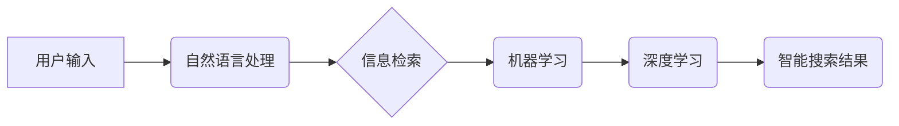

> 智能搜索, 用户体验, 自然语言处理, 信息检索, 机器学习, 深度学习, 算法优化, 搜索引擎

## 1. 背景介绍

在信息爆炸的时代，海量数据无处不在，人们对信息的获取速度和效率提出了更高的要求。智能搜索作为信息检索领域的重要发展方向，旨在通过人工智能技术，提供更精准、更智能、更人性化的搜索体验。传统的基于关键词匹配的搜索引擎，往往难以理解用户真实意图，搜索结果也可能存在偏差和冗余。而智能搜索则通过自然语言处理、机器学习等技术，能够更深入地理解用户需求，提供更相关、更精准的搜索结果。

## 2. 核心概念与联系

智能搜索的核心概念包括：

* **自然语言处理 (NLP):**  智能搜索需要理解用户使用自然语言输入的查询，将其转换为机器可理解的格式。NLP技术包括词法分析、语法分析、语义分析等，用于解析和理解文本的结构和含义。
* **信息检索 (IR):**  信息检索是智能搜索的基础，它涉及如何从海量数据中找到与用户查询相关的文档。传统的IR模型主要基于关键词匹配，而智能搜索则会结合用户历史行为、上下文信息等，进行更智能的检索。
* **机器学习 (ML):**  机器学习算法可以从海量数据中学习用户行为模式和搜索意图，从而提高搜索结果的准确性和相关性。常见的机器学习算法包括支持向量机 (SVM)、决策树、神经网络等。
* **深度学习 (DL):**  深度学习是机器学习的一个分支，它利用多层神经网络，能够学习更复杂的特征和模式。深度学习在智能搜索领域应用广泛，例如用于文本分类、实体识别、语义理解等。

**核心概念架构图:**



## 3. 核心算法原理 & 具体操作步骤

### 3.1  算法原理概述

智能搜索算法的核心是利用机器学习和深度学习技术，从海量数据中学习用户行为模式和搜索意图，从而提高搜索结果的准确性和相关性。常见的智能搜索算法包括：

* **基于词嵌入的搜索算法:**  将关键词映射到低维向量空间，通过向量相似度计算，找到与用户查询最相似的文档。
* **基于深度学习的搜索算法:**  利用深度神经网络，学习用户查询和文档之间的语义关系，从而进行更精准的搜索。
* **基于强化学习的搜索算法:**  通过奖励机制，训练智能代理，使其能够学习到最优的搜索策略。

### 3.2  算法步骤详解

以基于词嵌入的搜索算法为例，其具体操作步骤如下：

1. **词嵌入:** 将关键词映射到低维向量空间，例如使用Word2Vec或GloVe等模型。
2. **查询向量化:** 将用户查询的关键词组合成一个向量，例如使用平均值或TF-IDF加权等方法。
3. **文档向量化:** 将文档中的关键词组合成一个向量，例如使用TF-IDF或Word2Vec等方法。
4. **相似度计算:** 使用余弦相似度等方法，计算查询向量和文档向量的相似度。
5. **排序结果:** 根据相似度排序，返回与用户查询最相关的文档。

### 3.3  算法优缺点

**优点:**

* 能够理解关键词之间的语义关系，提高搜索结果的准确性。
* 能够处理用户使用自然语言输入的查询。
* 能够根据用户历史行为和上下文信息，提供个性化的搜索结果。

**缺点:**

* 需要大量的训练数据，才能训练出准确的词嵌入模型。
* 计算复杂度较高，需要强大的计算资源。
* 难以处理用户查询中的歧义和模糊性。

### 3.4  算法应用领域

基于词嵌入的搜索算法广泛应用于：

* 搜索引擎
* 问答系统
* 信息推荐系统
* 文本分类
* 实体识别

## 4. 数学模型和公式 & 详细讲解 & 举例说明

### 4.1  数学模型构建

**词嵌入模型:**

假设我们有一个词典V，包含N个单词。每个单词可以表示为一个D维的向量，记为v_i，其中i表示单词在词典中的索引。

**目标函数:**

目标函数是用来衡量词嵌入模型的性能的，常用的目标函数包括：

* **负对数似然函数:**  用于训练Word2Vec模型，其目标是最大化词上下文之间的相似度。
* **交叉熵损失函数:**  用于训练GloVe模型，其目标是最小化词嵌入向量之间的差异。

### 4.2  公式推导过程

**Word2Vec模型的负对数似然函数:**

$$
L = -\sum_{i=1}^{N} \sum_{j \in C(i)} \log \sigma(v_i^T v_j) - \sum_{i=1}^{N} \sum_{j \notin C(i)} \log (1 - \sigma(v_i^T v_j))
$$

其中:

* $v_i$ 是单词i的词嵌入向量。
* $C(i)$ 是单词i的上下文词集合。
* $\sigma$ 是sigmoid函数。

### 4.3  案例分析与讲解

**Word2Vec模型的应用:**

Word2Vec模型可以用来学习词语之间的语义关系。例如，我们可以使用Word2Vec模型学习到“国王”和“女王”之间的关系，并将其应用于其他任务，例如文本分类和问答系统。

## 5. 项目实践：代码实例和详细解释说明

### 5.1  开发环境搭建

* Python 3.x
* TensorFlow 或 PyTorch
* NLTK 或 spaCy

### 5.2  源代码详细实现

```python
# 使用Word2Vec模型训练词嵌入
from gensim.models import Word2Vec

# 准备训练数据
sentences = [
    ["the", "quick", "brown", "fox"],
    ["jumps", "over", "the", "lazy", "dog"],
]

# 训练Word2Vec模型
model = Word2Vec(sentences, vector_size=100, window=5, min_count=5)

# 保存模型
model.save("word2vec.model")

# 加载模型
model = Word2Vec.load("word2vec.model")

# 获取词嵌入向量
king_vector = model.wv["king"]
queen_vector = model.wv["queen"]

# 计算词向量之间的余弦相似度
similarity = np.dot(king_vector, queen_vector) / (np.linalg.norm(king_vector) * np.linalg.norm(queen_vector))

# 打印相似度
print(similarity)
```

### 5.3  代码解读与分析

* 使用Gensim库训练Word2Vec模型。
* 准备训练数据，每个句子是一个单词列表。
* 设置模型参数，例如词嵌入维度、窗口大小、最小词频等。
* 训练模型并保存模型文件。
* 加载模型并获取词嵌入向量。
* 计算词向量之间的余弦相似度，衡量词语之间的语义关系。

### 5.4  运行结果展示

运行代码后，会输出词向量之间的余弦相似度，例如0.85，表示“国王”和“女王”之间的语义关系很相似。

## 6. 实际应用场景

智能搜索技术已广泛应用于各种场景，例如：

* **搜索引擎:**  例如Google、百度等搜索引擎，利用智能搜索技术，提供更精准、更相关的搜索结果。
* **电商平台:**  例如淘宝、京东等电商平台，利用智能搜索技术，帮助用户快速找到心仪商品。
* **社交媒体:**  例如微博、微信等社交媒体，利用智能搜索技术，帮助用户查找好友、话题和内容。
* **医疗保健:**  利用智能搜索技术，帮助医生快速查找相关病例和医学文献。

### 6.4  未来应用展望

智能搜索技术未来将朝着以下方向发展：

* **更精准的搜索结果:**  利用更先进的机器学习和深度学习算法，进一步提高搜索结果的准确性和相关性。
* **更个性化的搜索体验:**  根据用户的历史行为、偏好和上下文信息，提供更个性化的搜索结果。
* **更自然的交互方式:**  支持语音、图像、视频等多模态输入，提供更自然的搜索交互方式。
* **更智能的搜索策略:**  利用强化学习等技术，训练智能代理，使其能够学习到最优的搜索策略。

## 7. 工具和资源推荐

### 7.1  学习资源推荐

* **书籍:**
    * 《深度学习》
    * 《自然语言处理》
    * 《信息检索》
* **在线课程:**
    * Coursera: 自然语言处理
    * edX: 深度学习
    * Udacity: 机器学习工程师

### 7.2  开发工具推荐

* **Python:**  Python是机器学习和深度学习的常用编程语言。
* **TensorFlow:**  TensorFlow是一个开源的机器学习框架。
* **PyTorch:**  PyTorch是一个开源的深度学习框架。
* **Gensim:**  Gensim是一个用于主题建模和词嵌入的Python库。

### 7.3  相关论文推荐

* **Word2Vec: A Simple and Efficient Model for Learning Word Representations**
* **GloVe: Global Vectors for Word Representation**
* **BERT: Pre-training of Deep Bidirectional Transformers for Language Understanding**

## 8. 总结：未来发展趋势与挑战

### 8.1  研究成果总结

智能搜索技术取得了显著的进展，能够提供更精准、更智能、更人性化的搜索体验。

### 8.2  未来发展趋势

智能搜索技术未来将朝着更精准、更个性化、更自然的交互方式发展。

### 8.3  面临的挑战

智能搜索技术还面临着一些挑战，例如：

* 如何处理用户查询中的歧义和模糊性。
* 如何保证搜索结果的公平性和客观性。
* 如何保护用户隐私和数据安全。

### 8.4  研究展望

未来研究将重点关注以下几个方面：

* 开发更先进的机器学习和深度学习算法，提高搜索结果的准确性和相关性。
* 研究更个性化和人性化的搜索交互方式。
* 探索智能搜索技术在更多领域的应用。

## 9. 附录：常见问题与解答

* **什么是智能搜索？**

智能搜索是指利用人工智能技术，提供更精准、更智能、更人性化的搜索体验。

* **智能搜索与传统搜索引擎有什么区别？**

传统搜索引擎主要基于关键词匹配，而智能搜索则会结合用户历史行为、上下文信息等，进行更智能的检索。

* **智能搜索技术有哪些？**

常见的智能搜索技术包括词嵌入、深度学习、强化学习等。

* **智能搜索技术有哪些应用场景？**

智能搜索技术已广泛应用于搜索引擎、电商平台、社交媒体、医疗保健等领域。


作者：禅与计算机程序设计艺术 / Zen and the Art of Computer Programming 
<end_of_turn>