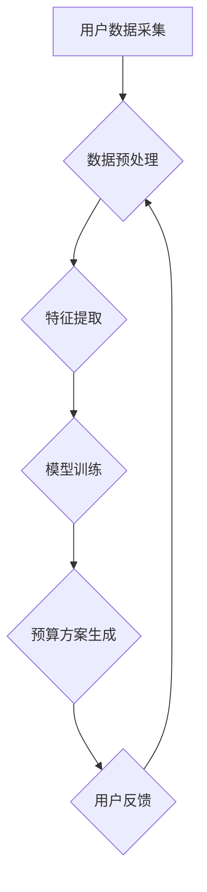

> 智能预算管理，财务规划，机器学习，深度学习，自然语言处理，预测分析，风险管理

## 1. 背景介绍

在当今数字化的时代，个人和企业都面临着越来越复杂的财务管理挑战。传统的预算管理方法往往过于繁琐、缺乏灵活性，难以适应不断变化的经济环境和个人需求。智能预算管理作为一种新兴的财务管理模式，利用人工智能技术，为个人和企业提供更加智能、高效、个性化的预算管理解决方案。

智能预算管理的核心是利用机器学习、深度学习、自然语言处理等人工智能技术，对用户的财务数据进行分析和预测，并根据用户的财务目标和风险偏好，自动生成个性化的预算方案，并提供实时监控和调整建议。

## 2. 核心概念与联系

**2.1 智能预算管理的核心概念**

* **智能化：** 利用人工智能技术，自动分析数据、生成预算方案、提供个性化建议，提高预算管理的效率和准确性。
* **预算方案：** 根据用户的财务目标、收入、支出、风险偏好等因素，制定详细的支出计划和储蓄目标。
* **实时监控：** 通过连接用户的银行账户、信用卡等金融账户，实时监控用户的收入和支出情况，及时发现异常情况。
* **个性化：** 根据用户的财务状况、生活习惯、目标等因素，定制个性化的预算方案和建议。

**2.2 智能预算管理与财务规划的关系**

智能预算管理是财务规划的重要组成部分。财务规划是指根据个人的财务目标，制定并实施一系列的财务决策，以实现财务目标。智能预算管理可以帮助用户更好地实现财务规划目标，例如：

* **储蓄目标：** 智能预算管理可以帮助用户设定储蓄目标，并制定相应的储蓄计划，例如每月固定储蓄、定期投资等。
* **债务管理：** 智能预算管理可以帮助用户分析债务情况，制定还款计划，并提供降低债务成本的建议。
* **投资规划：** 智能预算管理可以根据用户的风险偏好和投资目标，提供个性化的投资建议。

**2.3 智能预算管理的架构**



## 3. 核心算法原理 & 具体操作步骤

**3.1 算法原理概述**

智能预算管理的核心算法主要包括：

* **机器学习算法：** 用于分析用户的财务数据，识别消费模式，预测未来支出。常见的机器学习算法包括线性回归、逻辑回归、决策树、支持向量机、神经网络等。
* **深度学习算法：** 用于处理复杂的数据结构，例如文本数据、图像数据，可以更准确地识别用户的消费习惯和风险偏好。常见的深度学习算法包括卷积神经网络、循环神经网络等。
* **自然语言处理算法：** 用于理解用户的自然语言指令，例如“帮我制定一个每月5000元的预算”，“帮我分析一下我的消费情况”。

**3.2 算法步骤详解**

1. **数据采集：** 收集用户的财务数据，例如收入、支出、资产、负债等。
2. **数据预处理：** 对收集到的数据进行清洗、转换、归一化等处理，使其适合机器学习算法的训练。
3. **特征提取：** 从原始数据中提取有用的特征，例如消费类别、消费频率、消费金额等。
4. **模型训练：** 使用机器学习算法对提取的特征进行训练，建立预算预测模型。
5. **预算方案生成：** 根据用户的财务目标、风险偏好等因素，利用训练好的模型生成个性化的预算方案。
6. **用户反馈：** 用户可以对生成的预算方案进行反馈，例如修改预算金额、调整消费类别等。
7. **模型更新：** 根据用户的反馈，对模型进行更新和优化，提高模型的准确性和个性化程度。

**3.3 算法优缺点**

**优点：**

* **智能化：** 自动分析数据、生成预算方案，提高效率和准确性。
* **个性化：** 根据用户的财务状况和需求，定制个性化的预算方案。
* **实时监控：** 实时监控用户的收入和支出情况，及时发现异常情况。

**缺点：**

* **数据依赖：** 算法的准确性依赖于数据的质量和数量。
* **模型偏差：** 模型可能存在偏差，导致预算方案不准确。
* **隐私安全：** 用户的财务数据需要得到妥善保护。

**3.4 算法应用领域**

智能预算管理的应用领域广泛，包括：

* **个人财务管理：** 帮助个人制定预算、管理支出、实现财务目标。
* **企业财务管理：** 帮助企业预测收入、控制成本、优化资源配置。
* **金融机构：** 提供个性化的理财建议、风险管理服务。

## 4. 数学模型和公式 & 详细讲解 & 举例说明

**4.1 数学模型构建**

智能预算管理的数学模型通常基于预测分析，目标是预测用户的未来支出，并根据预测结果生成预算方案。常用的预测模型包括线性回归模型、ARIMA模型、神经网络模型等。

**4.2 公式推导过程**

以线性回归模型为例，其目标是找到一条直线，使得预测值与实际值之间的误差最小。

线性回归模型的公式如下：

$$y = mx + c$$

其中：

* $y$ 是预测值
* $x$ 是输入特征，例如用户的收入、消费历史等
* $m$ 是斜率
* $c$ 是截距

模型参数 $m$ 和 $c$ 可以通过最小二乘法求解。

**4.3 案例分析与讲解**

假设我们想要预测用户的每月餐饮支出，并根据预测结果生成预算方案。我们可以收集用户的过去几年的餐饮支出数据，并将其作为训练数据。

通过训练线性回归模型，我们可以得到模型参数 $m$ 和 $c$。然后，我们可以根据用户的收入和消费历史等特征，预测用户的未来餐饮支出。

例如，如果用户的收入为 $10000$ 元，并且模型参数为 $m = 0.2$，$c = 500$，那么预测的未来餐饮支出为：

$$y = 0.2 * 10000 + 500 = 2500$$

## 5. 项目实践：代码实例和详细解释说明

**5.1 开发环境搭建**

* 操作系统：Windows/macOS/Linux
* Python 版本：3.6+
* 必要的库：pandas, numpy, scikit-learn, matplotlib

**5.2 源代码详细实现**

```python
import pandas as pd
from sklearn.linear_model import LinearRegression

# 1. 数据加载
data = pd.read_csv('spending_data.csv')

# 2. 数据预处理
# ...

# 3. 特征选择
X = data[['income']]  # 选择收入作为特征
y = data['food_spending']  # 选择餐饮支出作为目标变量

# 4. 模型训练
model = LinearRegression()
model.fit(X, y)

# 5. 模型评估
# ...

# 6. 预测
new_income = 10000
predicted_spending = model.predict([[new_income]])
print(f'预测的餐饮支出为：{predicted_spending[0]}')
```

**5.3 代码解读与分析**

* 代码首先加载数据，然后进行数据预处理，例如缺失值处理、数据归一化等。
* 然后选择合适的特征和目标变量，并训练线性回归模型。
* 模型训练完成后，可以使用测试数据评估模型的性能。
* 最后，可以使用训练好的模型预测新的数据。

**5.4 运行结果展示**

运行代码后，会输出预测的餐饮支出值。

## 6. 实际应用场景

**6.1 个人财务管理**

智能预算管理可以帮助个人更好地管理自己的财务状况，例如：

* **设定储蓄目标：** 根据用户的收入和支出情况，智能预算管理可以帮助用户设定合理的储蓄目标，并制定相应的储蓄计划。
* **控制消费支出：** 智能预算管理可以帮助用户识别消费习惯，并提供控制消费支出的建议，例如提醒用户避免过度消费、提醒用户使用优惠活动等。
* **债务管理：** 智能预算管理可以帮助用户分析债务情况，制定还款计划，并提供降低债务成本的建议。

**6.2 企业财务管理**

智能预算管理可以帮助企业更好地管理自己的财务状况，例如：

* **预测收入和支出：** 智能预算管理可以根据历史数据和市场趋势，预测企业的未来收入和支出，帮助企业制定更准确的财务计划。
* **控制成本：** 智能预算管理可以帮助企业识别成本浪费，并提供控制成本的建议，例如优化采购流程、降低能源消耗等。
* **优化资源配置：** 智能预算管理可以帮助企业根据财务目标和资源状况，优化资源配置，提高资源利用效率。

**6.3 金融机构**

智能预算管理可以帮助金融机构提供更个性化的服务，例如：

* **个性化理财建议：** 根据用户的财务状况和风险偏好，智能预算管理可以提供个性化的理财建议，例如投资组合配置、风险控制等。
* **风险管理服务：** 智能预算管理可以帮助金融机构识别用户的风险偏好，并提供相应的风险管理服务，例如风险评估、风险控制等。

**6.4 未来应用展望**

随着人工智能技术的不断发展，智能预算管理的应用场景将会更加广泛，例如：

* **智能家庭预算管理：** 智能家居设备可以收集家庭的能源消耗、水费、电费等数据，并根据这些数据生成家庭的预算方案。
* **智能城市预算管理：** 城市政府可以利用智能预算管理系统，优化城市资源配置，提高城市管理效率。
* **智能教育预算管理：** 学校可以利用智能预算管理系统，优化教育资源配置，提高教育质量。

## 7. 工具和资源推荐

**7.1 学习资源推荐**

* **书籍：**
    * 《Python机器学习》
    * 《深度学习》
    * 《自然语言处理》
* **在线课程：**
    * Coursera
    * edX
    * Udacity

**7.2 开发工具推荐**

* **Python：** 
    * Jupyter Notebook
    * PyCharm
* **数据可视化工具：**
    * Matplotlib
    * Seaborn

**7.3 相关论文推荐**

* **智能预算管理的文献综述**
* **基于机器学习的智能预算管理系统**
* **深度学习在智能预算管理中的应用**

## 8. 总结：未来发展趋势与挑战

**8.1 研究成果总结**

智能预算管理作为一种新兴的财务管理模式，在近年来取得了显著的进展。

* **算法模型不断完善：** 传统的机器学习算法逐渐被更先进的深度学习算法所取代，模型的预测精度和准确性不断提高。
* **应用场景不断拓展：** 智能预算管理的应用场景从个人财务管理扩展到企业财务管理、金融机构等领域。
* **技术融合更加紧密：** 智能预算管理与大数据、云计算、区块链等技术的融合，为其发展提供了新的机遇。

**8.2 未来发展趋势**

* **更精准的预测：** 利用更先进的机器学习算法和数据分析技术，实现更精准的财务预测。
* **更个性化的服务：** 根据用户的个性化需求，提供更个性化的预算方案和财务建议。
* **更智能的交互：** 利用自然语言处理技术，实现更智能的交互，例如用户可以通过语音或文字与智能预算管理系统进行对话。

**8.3 面临的挑战**

* **数据安全和隐私保护：** 智能预算管理需要处理用户的敏感财务数据，因此数据安全和隐私保护是一个重要的挑战。
* **模型解释性和可信度：** 深度学习模型的内部机制复杂，难以解释模型的决策过程，这可能会影响用户的信任度。
* **技术标准和规范：** 智能预算管理