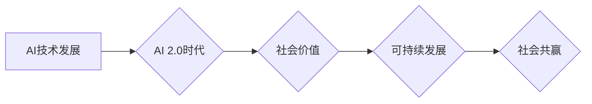

> 人工智能，AI 2.0，社会价值，伦理，可持续发展，未来趋势

## 1. 背景介绍

人工智能（AI）技术近年来发展迅速，从语音识别、图像识别到自然语言处理等领域取得了突破性进展。李开复，作为一位享誉全球的人工智能专家，在《AI 2.0 时代的社会价值》一书中，深入探讨了AI技术发展对社会产生的深远影响，并提出了AI 2.0时代的伦理、可持续发展等重要议题。

本书的出版，标志着AI技术发展进入了一个新的阶段，不再仅仅局限于技术本身的进步，而是更加注重AI技术与社会价值的融合。

## 2. 核心概念与联系

**AI 2.0** 时代指的是人工智能技术从单纯的模仿人类智能向更高级的智能进化阶段。它不再仅仅局限于狭义的AI应用，而是将AI技术融入到各个领域，赋予事物新的智能和价值。

**社会价值** 是指AI技术发展对人类社会产生的积极影响，包括但不限于：

* **提高生产效率:** AI可以自动化完成许多重复性工作，释放人力资源，提高生产效率。
* **改善生活质量:** AI可以提供个性化服务，例如医疗诊断、教育辅导等，提升人们的生活质量。
* **解决社会问题:** AI可以用于环境监测、灾害预警等领域，帮助解决社会问题。

**AI 2.0时代** 的核心概念是将AI技术与社会价值相结合，实现AI技术的可持续发展和社会共赢。

**Mermaid 流程图:**



## 3. 核心算法原理 & 具体操作步骤

### 3.1  算法原理概述

AI 2.0时代的核心算法包括深度学习、强化学习、迁移学习等。

* **深度学习:** 通过多层神经网络模拟人类大脑的学习过程，能够处理复杂的数据模式，例如图像识别、语音识别等。
* **强化学习:** 通过奖励机制训练智能体，使其在特定环境中学习最佳策略，例如游戏AI、机器人控制等。
* **迁移学习:** 将已学习到的知识应用到新的任务中，提高学习效率，例如自然语言处理、图像分类等。

### 3.2  算法步骤详解

以深度学习为例，其基本步骤包括：

1. **数据收集和预处理:** 收集大量相关数据，并进行清洗、格式化等预处理工作。
2. **模型构建:** 根据任务需求选择合适的深度学习模型架构，例如卷积神经网络、循环神经网络等。
3. **模型训练:** 使用训练数据训练模型，调整模型参数，使其能够准确地完成任务。
4. **模型评估:** 使用测试数据评估模型的性能，例如准确率、召回率等。
5. **模型部署:** 将训练好的模型部署到实际应用场景中。

### 3.3  算法优缺点

**优点:**

* 能够处理复杂的数据模式，取得较高的准确率。
* 学习能力强，能够不断改进和优化。

**缺点:**

* 需要大量的训练数据，训练成本高。
* 模型解释性差，难以理解模型的决策过程。

### 3.4  算法应用领域

深度学习、强化学习、迁移学习等算法广泛应用于各个领域，例如：

* **计算机视觉:** 图像识别、物体检测、图像分割等。
* **自然语言处理:** 文本分类、机器翻译、对话系统等。
* **语音识别:** 语音转文本、语音助手等。
* **医疗诊断:** 病情预测、疾病诊断等。
* **金融分析:** 风险评估、欺诈检测等。

## 4. 数学模型和公式 & 详细讲解 & 举例说明

### 4.1  数学模型构建

深度学习模型的核心是神经网络，其结构由多个层组成，每层包含多个神经元。每个神经元接收来自上一层的输入信号，经过激活函数处理后，输出到下一层。

**神经网络模型** 可以用以下数学公式表示：

$$
y = f(W^L x^L + b^L)
$$

其中：

* $y$ 是输出值
* $x^L$ 是上一层的输出值
* $W^L$ 是当前层的权重矩阵
* $b^L$ 是当前层的偏置向量
* $f$ 是激活函数

### 4.2  公式推导过程

神经网络的训练过程是通过调整权重和偏置，使模型输出与真实值之间的误差最小化。常用的优化算法包括梯度下降法、Adam算法等。

**梯度下降法** 的核心思想是沿着梯度方向更新权重和偏置，使得误差函数不断减小。

**梯度下降公式:**

$$
\theta = \theta - \alpha \nabla J(\theta)
$$

其中：

* $\theta$ 是权重和偏置的集合
* $\alpha$ 是学习率
* $\nabla J(\theta)$ 是误差函数 $J(\theta)$ 的梯度

### 4.3  案例分析与讲解

以图像分类为例，我们可以使用卷积神经网络（CNN）模型进行训练。CNN模型能够自动学习图像特征，并将其用于分类任务。

训练过程中，我们使用大量的图像数据，并通过梯度下降法调整模型参数，使得模型能够准确地识别不同类别图像。

## 5. 项目实践：代码实例和详细解释说明

### 5.1  开发环境搭建

使用Python语言开发AI项目，需要安装以下软件：

* Python 3.x
* TensorFlow 或 PyTorch 等深度学习框架
* NumPy、Pandas 等数据处理库

### 5.2  源代码详细实现

以下是一个简单的图像分类代码示例，使用TensorFlow框架实现：

```python
import tensorflow as tf

# 定义模型结构
model = tf.keras.models.Sequential([
    tf.keras.layers.Conv2D(32, (3, 3), activation='relu', input_shape=(28, 28, 1)),
    tf.keras.layers.MaxPooling2D((2, 2)),
    tf.keras.layers.Conv2D(64, (3, 3), activation='relu'),
    tf.keras.layers.MaxPooling2D((2, 2)),
    tf.keras.layers.Flatten(),
    tf.keras.layers.Dense(10, activation='softmax')
])

# 编译模型
model.compile(optimizer='adam',
              loss='sparse_categorical_crossentropy',
              metrics=['accuracy'])

# 训练模型
model.fit(x_train, y_train, epochs=5)

# 评估模型
loss, accuracy = model.evaluate(x_test, y_test)
print('Test loss:', loss)
print('Test accuracy:', accuracy)
```

### 5.3  代码解读与分析

这段代码定义了一个简单的卷积神经网络模型，用于图像分类任务。

* `tf.keras.models.Sequential` 创建了一个顺序模型，将各个层依次连接。
* `tf.keras.layers.Conv2D` 定义了一个卷积层，用于提取图像特征。
* `tf.keras.layers.MaxPooling2D` 定义了一个最大池化层，用于降低特征图尺寸。
* `tf.keras.layers.Flatten` 将多维特征图转换为一维向量。
* `tf.keras.layers.Dense` 定义了一个全连接层，用于分类。
* `model.compile` 编译模型，指定优化器、损失函数和评价指标。
* `model.fit` 训练模型，使用训练数据进行训练。
* `model.evaluate` 评估模型，使用测试数据评估模型性能。

### 5.4  运行结果展示

训练完成后，我们可以使用测试数据评估模型的性能，例如准确率。

## 6. 实际应用场景

### 6.1  医疗诊断

AI技术可以辅助医生进行疾病诊断，例如通过分析医学影像数据识别肿瘤、肺炎等疾病。

### 6.2  金融风险评估

AI技术可以分析金融数据，识别潜在的风险，例如欺诈交易、信用风险等。

### 6.3  个性化教育

AI技术可以根据学生的学习情况提供个性化的学习方案，提高学习效率。

### 6.4  未来应用展望

AI技术在未来将应用于更多领域，例如自动驾驶、机器人、智能家居等，为人类社会带来更多便利和福祉。

## 7. 工具和资源推荐

### 7.1  学习资源推荐

* **在线课程:** Coursera、edX、Udacity 等平台提供丰富的AI课程。
* **书籍:** 《深度学习》、《人工智能：一种现代方法》等书籍。
* **博客:** TensorFlow博客、PyTorch博客等。

### 7.2  开发工具推荐

* **深度学习框架:** TensorFlow、PyTorch、Keras 等。
* **数据处理库:** NumPy、Pandas 等。
* **云计算平台:** AWS、Azure、GCP 等。

### 7.3  相关论文推荐

* **《ImageNet Classification with Deep Convolutional Neural Networks》**
* **《Attention Is All You Need》**
* **《Generative Adversarial Networks》**

## 8. 总结：未来发展趋势与挑战

### 8.1  研究成果总结

AI技术取得了显著的进展，在各个领域都展现出巨大的潜力。

### 8.2  未来发展趋势

* **模型规模和能力的提升:** 未来AI模型将更加强大，能够处理更复杂的任务。
* **算法的创新:** 新的AI算法将不断涌现，例如联邦学习、自监督学习等。
* **跨领域融合:** AI技术将与其他领域融合，例如生物学、物理学等，产生新的应用。

### 8.3  面临的挑战

* **数据安全和隐私保护:** AI模型训练需要大量数据，如何保证数据安全和隐私保护是一个重要挑战。
* **算法可解释性和公平性:** AI模型的决策过程难以理解，如何保证算法的公平性和可解释性是一个重要问题。
* **伦理和社会影响:** AI技术的发展可能带来一些伦理和社会问题，需要进行深入的思考和讨论。

### 8.4  研究展望

未来AI研究需要更加注重伦理、可持续发展和社会价值，推动AI技术朝着更加安全、可靠、可解释的方向发展。

## 9. 附录：常见问题与解答

### 9.1  什么是AI 2.0？

AI 2.0指的是人工智能技术从单纯的模仿人类智能向更高级的智能进化阶段。它不再仅仅局限于狭义的AI应用，而是将AI技术融入到各个领域，赋予事物新的智能和价值。

### 9.2  AI技术有哪些应用场景？

AI技术广泛应用于各个领域，例如：

* 计算机视觉: 图像识别、物体检测、图像分割等。
* 自然语言处理: 文本分类、机器翻译、对话系统等。
* 语音识别: 语音转文本、语音助手等。
* 医疗诊断: 病情预测、疾病诊断等。
* 金融分析: 风险评估、欺诈检测等。

### 9.3  如何学习AI技术？

可以通过以下方式学习AI技术：

* 在线课程: Coursera、edX、Udacity 等平台提供丰富的AI课程。
* 书籍: 《深度学习》、《人工智能：一种现代方法》等书籍。
* 博客: TensorFlow博客、PyTorch博客等。


作者：禅与计算机程序设计艺术 / Zen and the Art of Computer Programming 
<end_of_turn>