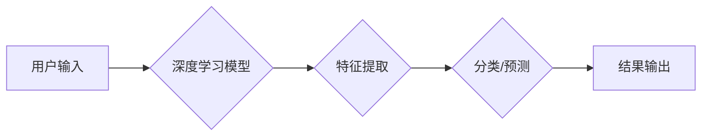

> 苹果, AI应用, 市场前景, 深度学习, 自然语言处理, 计算机视觉, 人工智能, 伦理

## 1. 背景介绍

近年来，人工智能（AI）技术取得了飞速发展，并开始渗透到各个领域，改变着人们的生活方式。苹果公司作为科技巨头，也积极布局AI领域，并将其融入到其产品和服务中。2023年，苹果发布了一系列AI应用，引发了市场和公众的广泛关注。

李开复，作为一位享誉全球的人工智能专家，对苹果发布AI应用的市场前景进行了深入分析。他认为，苹果的AI应用具有以下几个特点：

* **注重用户体验:** 苹果一直以来都注重用户体验，其AI应用也不例外。苹果的AI应用设计简洁易用，并能够提供个性化的服务。
* **注重隐私保护:** 苹果非常重视用户隐私，其AI应用也采用了严格的隐私保护措施，确保用户数据安全。
* **注重生态系统:** 苹果拥有庞大的生态系统，其AI应用能够与其他苹果产品和服务无缝衔接，提供更丰富的体验。

## 2. 核心概念与联系

### 2.1 深度学习

深度学习是人工智能领域的一个重要分支，它利用多层神经网络来模拟人类大脑的学习过程。深度学习算法能够从海量数据中学习到复杂的模式和特征，从而实现图像识别、语音识别、自然语言处理等各种任务。

### 2.2 自然语言处理

自然语言处理（NLP）是人工智能领域的一个重要方向，它致力于使计算机能够理解和处理人类语言。NLP技术能够用于机器翻译、文本摘要、情感分析等各种应用场景。

### 2.3 计算机视觉

计算机视觉是人工智能领域的一个重要分支，它致力于使计算机能够“看”和理解图像和视频。计算机视觉技术能够用于图像识别、物体检测、场景理解等各种应用场景。

**Mermaid 流程图**



## 3. 核心算法原理 & 具体操作步骤

### 3.1 算法原理概述

深度学习算法的核心原理是利用多层神经网络来模拟人类大脑的学习过程。神经网络由多个层组成，每一层都包含多个神经元。神经元之间通过连接进行信息传递，每个连接都有一个权重。通过训练，神经网络可以学习到最优的权重，从而实现对数据的学习和预测。

### 3.2 算法步骤详解

1. **数据预处理:** 将原始数据进行清洗、转换和格式化，使其能够被深度学习模型所接受。
2. **模型构建:** 根据具体的应用场景，选择合适的深度学习模型架构，例如卷积神经网络（CNN）、循环神经网络（RNN）等。
3. **模型训练:** 使用训练数据对深度学习模型进行训练，通过调整模型参数，使模型能够准确地预测目标变量。
4. **模型评估:** 使用测试数据对训练好的模型进行评估，评估模型的准确率、召回率、F1-score等指标。
5. **模型部署:** 将训练好的模型部署到实际应用场景中，用于进行预测或其他任务。

### 3.3 算法优缺点

**优点:**

* 能够学习到复杂的模式和特征。
* 性能优于传统机器学习算法。
* 能够处理海量数据。

**缺点:**

* 训练时间长，需要大量的计算资源。
* 对训练数据的质量要求高。
* 模型解释性差，难以理解模型的决策过程。

### 3.4 算法应用领域

深度学习算法广泛应用于各个领域，例如：

* **图像识别:** 人脸识别、物体检测、图像分类等。
* **语音识别:** 语音转文本、语音助手等。
* **自然语言处理:** 机器翻译、文本摘要、情感分析等。
* **推荐系统:** 商品推荐、内容推荐等。
* **医疗诊断:** 疾病诊断、影像分析等。

## 4. 数学模型和公式 & 详细讲解 & 举例说明

### 4.1 数学模型构建

深度学习模型通常由多个层组成，每一层都包含多个神经元。每个神经元接收来自上一层的输入信号，并对其进行处理，然后将处理后的信号传递到下一层。

**神经元模型:**

$$
y = f(w^T x + b)
$$

其中：

* $y$ 是神经元的输出值。
* $x$ 是神经元的输入向量。
* $w$ 是神经元的权重向量。
* $b$ 是神经元的偏置值。
* $f$ 是激活函数。

### 4.2 公式推导过程

深度学习模型的训练过程是通过调整模型参数（权重和偏置）来最小化模型的损失函数。损失函数衡量模型预测结果与真实结果之间的差异。常用的损失函数包括均方误差（MSE）和交叉熵损失（Cross-Entropy Loss）。

**均方误差损失函数:**

$$
L = \frac{1}{n} \sum_{i=1}^{n} (y_i - \hat{y}_i)^2
$$

其中：

* $L$ 是损失函数的值。
* $n$ 是样本数量。
* $y_i$ 是真实值。
* $\hat{y}_i$ 是模型预测值。

**交叉熵损失函数:**

$$
L = -\frac{1}{n} \sum_{i=1}^{n} y_i \log(\hat{y}_i) + (1-y_i) \log(1-\hat{y}_i)
$$

其中：

* $L$ 是损失函数的值。
* $n$ 是样本数量。
* $y_i$ 是真实值（0或1）。
* $\hat{y}_i$ 是模型预测值（0到1之间的概率）。

### 4.3 案例分析与讲解

**图像分类案例:**

假设我们有一个图像分类任务，目标是将图像分类为猫、狗或鸟。我们可以使用卷积神经网络（CNN）来解决这个问题。CNN能够学习到图像的特征，并将其用于分类。

训练过程中，我们使用大量的猫、狗和鸟的图像数据来训练CNN模型。模型会根据图像特征调整其权重和偏置，从而能够准确地预测图像类别。

## 5. 项目实践：代码实例和详细解释说明

### 5.1 开发环境搭建

* 操作系统：Windows/macOS/Linux
* Python 版本：3.6+
* 深度学习框架：TensorFlow/PyTorch

### 5.2 源代码详细实现

```python
# 使用 TensorFlow 构建一个简单的图像分类模型

import tensorflow as tf

# 定义模型结构
model = tf.keras.models.Sequential([
    tf.keras.layers.Conv2D(32, (3, 3), activation='relu', input_shape=(28, 28, 1)),
    tf.keras.layers.MaxPooling2D((2, 2)),
    tf.keras.layers.Conv2D(64, (3, 3), activation='relu'),
    tf.keras.layers.MaxPooling2D((2, 2)),
    tf.keras.layers.Flatten(),
    tf.keras.layers.Dense(10, activation='softmax')
])

# 编译模型
model.compile(optimizer='adam',
              loss='sparse_categorical_crossentropy',
              metrics=['accuracy'])

# 训练模型
model.fit(x_train, y_train, epochs=5)

# 评估模型
loss, accuracy = model.evaluate(x_test, y_test)
print('Test loss:', loss)
print('Test accuracy:', accuracy)
```

### 5.3 代码解读与分析

* **模型结构:** 代码中定义了一个简单的卷积神经网络模型，包含两个卷积层、两个最大池化层、一个全连接层和一个输出层。
* **模型编译:** 使用Adam优化器、稀疏类别交叉熵损失函数和准确率作为评估指标来编译模型。
* **模型训练:** 使用训练数据训练模型，训练5个 epochs。
* **模型评估:** 使用测试数据评估模型的性能，输出测试损失和准确率。

### 5.4 运行结果展示

运行代码后，会输出模型的训练过程和测试结果，包括训练损失、训练准确率、测试损失和测试准确率。

## 6. 实际应用场景

### 6.1 智能客服

AI驱动的智能客服能够自动回答用户常见问题，提供24/7的客户服务，提高客户满意度。

### 6.2 个性化推荐

AI算法能够分析用户的行为数据，提供个性化的商品、内容或服务推荐，提升用户体验。

### 6.3 医疗诊断辅助

AI辅助医生进行疾病诊断，提高诊断准确率，并帮助医生更快地做出治疗决策。

### 6.4 自动驾驶

AI技术是自动驾驶的核心，能够帮助车辆感知周围环境、做出决策并控制车辆行驶。

### 6.5 语音助手

AI驱动的语音助手能够理解用户的语音指令，并执行相应的操作，例如播放音乐、设置闹钟、发送短信等。

## 7. 工具和资源推荐

### 7.1 学习资源推荐

* **在线课程:** Coursera、edX、Udacity等平台提供丰富的AI课程。
* **书籍:** 《深度学习》、《机器学习》、《人工智能》等书籍。
* **博客和论坛:** TensorFlow博客、PyTorch论坛等。

### 7.2 开发工具推荐

* **深度学习框架:** TensorFlow、PyTorch、Keras等。
* **数据处理工具:** Pandas、NumPy等。
* **可视化工具:** Matplotlib、Seaborn等。

### 7.3 相关论文推荐

* **《ImageNet Classification with Deep Convolutional Neural Networks》**
* **《Attention Is All You Need》**
* **《BERT: Pre-training of Deep Bidirectional Transformers for Language Understanding》**

## 8. 总结：未来发展趋势与挑战

### 8.1 研究成果总结

近年来，AI技术取得了飞速发展，在各个领域都取得了显著的成果。深度学习算法成为AI领域的主流技术，并取得了突破性的进展。

### 8.2 未来发展趋势

* **模型规模和能力的提升:** 未来，AI模型的规模和能力将会进一步提升，能够处理更复杂的任务。
* **模型解释性和可解释性的增强:** 研究者将致力于提高AI模型的解释性和可解释性，使其能够更好地被理解和信任。
* **AI技术的广泛应用:** AI技术将会被应用到更多领域，例如医疗、教育、金融等。

### 8.3 面临的挑战

* **数据安全和隐私保护:** AI模型的训练需要大量数据，如何保证数据安全和隐私保护是一个重要的挑战。
* **算法偏见和公平性:** AI算法可能会存在偏见，导致不公平的结果。如何解决算法偏见和确保公平性是一个重要的研究方向。
* **AI伦理问题:** AI技术的快速发展引发了伦理问题，例如AI的责任、透明度和可控性等。

### 8.4 研究展望

未来，AI研究将继续朝着更智能、更安全、更可解释的方向发展。研究者将致力于解决AI技术面临的挑战，并将其应用于更多领域，造福人类社会。

## 9. 附录：常见问题与解答

**Q1: 深度学习算法需要多少数据才能训练？**

**A1:** 深度学习算法对数据的需求量很大，通常需要海量数据才能达到良好的性能。

**Q2: 如何评估深度学习模型的性能？**

**A2:** 深度学习模型的性能可以通过准确率、召回率、F1-score等指标进行评估。

**Q3: 如何解决深度学习模型的过拟合问题？**

**A3:** 可以通过正则化、数据增强、Dropout等方法来解决深度学习模型的过拟合问题。


作者：禅与计算机程序设计艺术 / Zen and the Art of Computer Programming 
<end_of_turn>