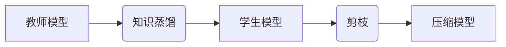

> 模型压缩, 知识蒸馏, 剪枝, 深度学习, 模型效率, 硬件加速

## 1. 背景介绍

深度学习模型在图像识别、自然语言处理等领域取得了显著成就，但也面临着巨大的计算资源和存储空间需求。随着移动设备和嵌入式系统的普及，高效的模型部署成为一个关键挑战。模型压缩技术旨在减小模型大小和计算复杂度，同时保持模型性能，从而实现模型在资源受限环境下的高效部署。

## 2. 核心概念与联系

模型压缩技术主要分为两大类：**知识蒸馏**和**剪枝**。

**2.1 知识蒸馏**

知识蒸馏是一种通过将知识从一个大型模型（教师模型）迁移到一个小型模型（学生模型）的方法。教师模型通常是一个经过充分训练的、性能优异的模型，而学生模型则是一个更小的模型，具有更低的计算复杂度。通过训练学生模型来模仿教师模型的输出，可以将教师模型的知识有效地传递到学生模型中。

**2.2 剪枝**

剪枝是一种通过移除模型中不重要的权重或连接来减小模型大小的方法。剪枝算法通常分为两种：

* **结构剪枝:** 移除模型中的整个层或单元。
* **权重剪枝:** 移除模型中权重值较小的连接。

**2.3 知识蒸馏与剪枝的联系**

知识蒸馏和剪枝可以相互配合，以实现更有效的模型压缩。例如，可以先使用知识蒸馏将教师模型的知识迁移到一个小型模型中，然后使用剪枝算法进一步减小模型大小。



## 3. 核心算法原理 & 具体操作步骤

### 3.1 算法原理概述

**3.1.1 知识蒸馏原理**

知识蒸馏的核心思想是将教师模型的知识通过输出的概率分布传递给学生模型。教师模型的输出不仅包含预测结果，还包含对不同类别的置信度信息。学生模型通过学习教师模型的输出概率分布，可以获得更丰富的知识，从而提高模型性能。

**3.1.2 剪枝原理**

剪枝算法的基本原理是移除模型中不重要的权重或连接。剪枝算法通常使用一些指标来评估权重或连接的重要性，例如权重值的大小、连接的梯度值等。

### 3.2 算法步骤详解

**3.2.1 知识蒸馏步骤**

1. 训练一个大型教师模型。
2. 使用教师模型对训练数据进行预测，并获得教师模型的输出概率分布。
3. 训练一个小型学生模型，并使用教师模型的输出概率分布作为监督信号。
4. 调整学生模型的学习率和温度参数，以优化模型性能。

**3.2.2 剪枝步骤**

1. 训练一个深度学习模型。
2. 使用一些指标评估模型中每个权重的重要性。
3. 根据重要性指标，移除一些权重或连接。
4. 重新训练模型，以恢复移除权重或连接后模型的性能。

### 3.3 算法优缺点

**3.3.1 知识蒸馏优缺点**

* **优点:** 可以有效地将教师模型的知识传递给学生模型，提高学生模型的性能。
* **缺点:** 需要一个大型的教师模型，训练时间较长。

**3.3.2 剪枝优缺点**

* **优点:** 可以有效地减小模型大小，降低计算复杂度。
* **缺点:** 可能导致模型性能下降。

### 3.4 算法应用领域

**3.4.1 知识蒸馏应用领域**

* **移动设备:** 将大型模型压缩到移动设备上，实现高效的深度学习应用。
* **嵌入式系统:** 将深度学习模型部署到资源受限的嵌入式系统中。
* **边缘计算:** 将深度学习模型部署到边缘设备上，实现实时推理。

**3.4.2 剪枝应用领域**

* **图像识别:** 压缩图像识别模型，降低推理时间和内存占用。
* **自然语言处理:** 压缩自然语言处理模型，例如机器翻译和文本分类模型。
* **语音识别:** 压缩语音识别模型，降低计算复杂度和存储空间需求。

## 4. 数学模型和公式 & 详细讲解 & 举例说明

### 4.1 数学模型构建

**4.1.1 知识蒸馏损失函数**

知识蒸馏损失函数通常由两个部分组成：

* **分类损失:** 衡量学生模型预测结果与真实标签之间的差异。
* **知识损失:** 衡量学生模型的输出概率分布与教师模型的输出概率分布之间的差异。

知识损失函数通常使用KL散度来衡量两个概率分布之间的差异。

**4.1.2 剪枝损失函数**

剪枝损失函数通常与模型的训练损失函数相结合，以鼓励模型移除不重要的权重或连接。

### 4.2 公式推导过程

**4.2.1 KL散度公式**

KL散度公式用于衡量两个概率分布之间的差异。

$$
D_{KL}(P||Q) = \sum_{x} P(x) \log \frac{P(x)}{Q(x)}
$$

其中：

* $P(x)$ 是真实概率分布。
* $Q(x)$ 是估计概率分布。

**4.2.2 剪枝损失函数示例**

一种常见的剪枝损失函数是L1正则化损失函数，它惩罚模型中权重值的大小。

$$
L = Loss + \lambda ||W||_1
$$

其中：

* $Loss$ 是模型的训练损失函数。
* $\lambda$ 是正则化参数。
* $W$ 是模型的权重向量。

### 4.3 案例分析与讲解

**4.3.1 知识蒸馏案例分析**

在图像分类任务中，可以使用知识蒸馏将一个大型ResNet模型的知识迁移到一个小型MobileNet模型中。通过训练MobileNet模型来模仿ResNet模型的输出概率分布，可以提高MobileNet模型的性能，同时减小模型大小。

**4.3.2 剪枝案例分析**

在语音识别任务中，可以使用剪枝算法移除一些权重值较小的连接，从而减小模型大小。通过重新训练模型，可以恢复移除权重或连接后模型的性能。

## 5. 项目实践：代码实例和详细解释说明

### 5.1 开发环境搭建

* Python 3.6+
* TensorFlow 2.0+
* PyTorch 1.0+

### 5.2 源代码详细实现

```python
# 知识蒸馏示例代码
import tensorflow as tf

# 定义教师模型和学生模型
teacher_model = tf.keras.models.load_model('teacher_model.h5')
student_model = tf.keras.models.Sequential([
    # 学生模型结构
])

# 定义知识蒸馏损失函数
def distillation_loss(y_true, y_pred, teacher_output):
    # 计算KL散度
    kl_loss = tf.keras.losses.KLDivergence()(y_true, teacher_output)
    # 计算分类损失
    categorical_loss = tf.keras.losses.CategoricalCrossentropy()(y_true, y_pred)
    # 结合损失函数
    return kl_loss + categorical_loss

# 训练学生模型
student_model.compile(optimizer='adam', loss=distillation_loss, metrics=['accuracy'])
student_model.fit(x_train, y_train, epochs=10, validation_data=(x_val, y_val))

# 剪枝示例代码
import tensorflow as tf

# 定义模型
model = tf.keras.models.Sequential([
    # 模型结构
])

# 训练模型
model.compile(optimizer='adam', loss='categorical_crossentropy', metrics=['accuracy'])
model.fit(x_train, y_train, epochs=10)

# 剪枝
pruning_schedule = tf.keras.callbacks.LearningRateScheduler(lambda epoch: 0.95 ** epoch)
model.fit(x_train, y_train, epochs=10, callbacks=[pruning_schedule])
```

### 5.3 代码解读与分析

* 知识蒸馏代码示例：
    * 加载教师模型和定义学生模型结构。
    * 定义知识蒸馏损失函数，结合KL散度和分类损失。
    * 使用知识蒸馏损失函数训练学生模型。
* 剪枝代码示例：
    * 定义模型结构。
    * 训练模型。
    * 使用学习率衰减策略进行剪枝。

### 5.4 运行结果展示

运行上述代码示例，可以观察到学生模型的性能随着训练的进行而提高，并且模型大小也减小。

## 6. 实际应用场景

### 6.1 知识蒸馏应用场景

* **移动设备图像识别:** 将大型ResNet模型压缩到移动设备上，实现高效的图像识别应用。
* **嵌入式系统语音识别:** 将语音识别模型压缩到嵌入式系统上，实现实时语音识别。
* **边缘计算物体检测:** 将物体检测模型部署到边缘设备上，实现实时物体检测。

### 6.2 剪枝应用场景

* **工业自动化图像缺陷检测:** 压缩图像缺陷检测模型，降低计算复杂度和存储空间需求。
* **医疗影像分析:** 压缩医学影像分析模型，实现高效的病灶检测和诊断。
* **智能家居设备语音控制:** 压缩语音识别模型，实现智能家居设备的语音控制。

### 6.4 未来应用展望

随着深度学习模型的不断发展，模型压缩技术将发挥越来越重要的作用。未来，模型压缩技术将应用于更多领域，例如：

* **自动驾驶:** 压缩自动驾驶模型，实现实时决策和控制。
* **机器人控制:** 压缩机器人控制模型，实现高效的运动规划和控制。
* **个性化推荐:** 压缩个性化推荐模型，实现更精准的推荐服务。

## 7. 工具和资源推荐

### 7.1 学习资源推荐

* **书籍:**
    * 《深度学习》
    * 《深度学习模型压缩》
* **在线课程:**
    * Coursera: 深度学习
    * Udacity: 深度学习工程师
* **博客:**
    * TensorFlow Blog
    * PyTorch Blog

### 7.2 开发工具推荐

* **TensorFlow:** 开源深度学习框架
* **PyTorch:** 开源深度学习框架
* **Keras:** 高级深度学习API

### 7.3 相关论文推荐

* **论文:**
    * 《Distilling the Knowledge in a Neural Network》
    * 《Learning Efficient Convolutional Networks through Network Slimming》

## 8. 总结：未来发展趋势与挑战

### 8.1 研究成果总结

模型压缩技术取得了显著的进展，例如知识蒸馏和剪枝算法的提出，以及各种模型压缩工具和框架的开发。这些成果使得深度学习模型能够在资源受限的环境下高效部署，推动了深度学习技术的广泛应用。

### 8.2 未来发展趋势

* **更有效的模型压缩算法:** 研究更有效的模型压缩算法，例如基于神经网络的剪枝算法和量化技术。
* **模型压缩与硬件加速的结合:** 将模型压缩技术与硬件加速技术结合，实现更高效的深度学习推理。
* **可解释性模型压缩:** 研究可解释性模型压缩技术，使得模型压缩后的模型更容易理解和解释。

### 8.3 面临的挑战

* **模型性能与压缩率之间的平衡:** 如何在保证模型性能的同时，实现更高的压缩率仍然是一个挑战。
* **不同模型类型和任务的压缩方法:** 不同模型类型和任务对压缩方法的要求不同，需要针对不同的场景开发相应的压缩方法。
* **模型压缩的通用性和可移植性:** 如何开发更通用和可移植的模型压缩方法，使其能够应用于不同的深度学习框架和硬件平台。

### 8.