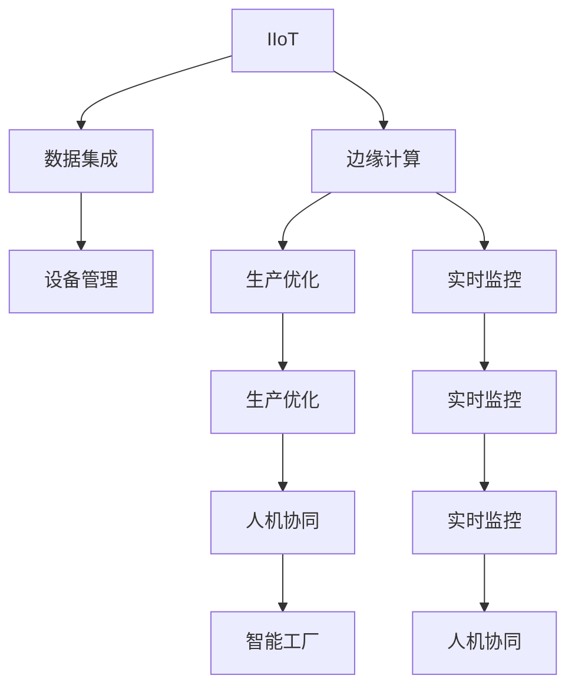

                 

# 工业物联网（IIoT）：智能工厂解决方案

> 关键词：工业物联网, 智能工厂, 工业自动化, 边缘计算, 数据集成, 设备管理, 预测维护

## 1. 背景介绍

### 1.1 问题由来
工业物联网（IIoT）是指将物理世界中的设备和物品通过网络互联，实现数据的全面感知、高效处理和深度分析。随着5G、云计算、大数据等技术的成熟，IIoT技术正逐步成为制造业数字化转型的重要引擎，推动智能制造和智慧工厂的发展。然而，尽管IIoT带来了诸多创新，其面临的安全性、互操作性、数据融合、设备管理等挑战依然显著。如何构建一个高效、安全、可靠的智能工厂，成为一个亟需解决的问题。

### 1.2 问题核心关键点
本文聚焦于智能工厂的解决方案，旨在通过IIoT技术实现生产过程的智能化和自动化，提升制造效率和产品质量。具体而言，包括以下几个关键点：

- **数据集成**：将来自不同设备和系统的数据进行整合，构建统一的数据模型，支持实时分析和决策。
- **设备管理**：通过IIoT技术监控设备状态，预测设备故障，进行预防性维护，延长设备寿命。
- **生产优化**：利用数据驱动的智能算法，优化生产流程，降低能耗和成本，提升生产效率。
- **实时监控**：通过传感器和摄像头等设备，实现对生产环境的实时监控，保障生产安全和质量。
- **人机协同**：将机器人、自动化流水线和工人的工作进行协同，提高生产灵活性和响应速度。

## 2. 核心概念与联系

### 2.1 核心概念概述

为更好地理解智能工厂的构建方法，本节将介绍几个密切相关的核心概念：

- **IIoT**：即工业物联网，通过网络连接物理设备，实现数据的全面感知、高效处理和深度分析。
- **智能工厂**：融合IIoT技术，实现生产过程的智能化和自动化，提升制造效率和产品质量。
- **边缘计算**：在靠近数据源的地方进行数据处理和分析，减少网络延迟，提升数据实时性。
- **数据集成**：将不同设备和系统的数据进行整合，构建统一的数据模型，支持实时分析和决策。
- **设备管理**：通过IIoT技术监控设备状态，预测设备故障，进行预防性维护，延长设备寿命。
- **生产优化**：利用数据驱动的智能算法，优化生产流程，降低能耗和成本，提升生产效率。
- **实时监控**：通过传感器和摄像头等设备，实现对生产环境的实时监控，保障生产安全和质量。
- **人机协同**：将机器人、自动化流水线和工人的工作进行协同，提高生产灵活性和响应速度。

这些核心概念之间的逻辑关系可以通过以下Mermaid流程图来展示：



这个流程图展示了几大核心概念及其之间的关系：

1. IIoT技术作为智能工厂的基础设施，提供全面的数据感知能力。
2. 数据集成和边缘计算优化了数据的实时性和处理效率，支持生产流程的智能决策。
3. 设备管理通过预测性维护和故障诊断，保障了设备的高效运行。
4. 生产优化利用智能算法，提升了生产效率和资源利用率。
5. 实时监控确保了生产过程的安全和产品质量。
6. 人机协同将机器人、自动化流水线和工人的工作进行无缝对接，提高了生产灵活性和响应速度。

这些概念共同构成了智能工厂的运行框架，使得其能够高效、安全、可靠地实现生产过程的智能化和自动化。

## 3. 核心算法原理 & 具体操作步骤
### 3.1 算法原理概述

构建智能工厂的核心在于数据集成和设备管理。以下详细介绍这两个关键环节的算法原理。

### 3.2 算法步骤详解

#### 3.2.1 数据集成算法

数据集成是将来自不同设备和系统的数据进行整合，构建统一的数据模型，支持实时分析和决策的关键步骤。其基本流程如下：

1. **数据源收集**：通过传感器、摄像头、RFID等设备，收集生产环境中的数据。
2. **数据清洗和预处理**：对采集到的数据进行去重、校验、转换等预处理，确保数据质量。
3. **数据标准化**：将不同设备和系统的数据转换为统一的格式和单位，支持后续分析。
4. **数据存储和管理**：将处理后的数据存储在云端或本地数据库中，提供高效的数据访问和查询服务。

数据集成的核心算法包括：

- **ETL（Extract, Transform, Load）流程**：从数据源中抽取数据，进行转换和加载到目标数据仓库。
- **数据清洗算法**：去除重复数据、异常值、错误数据等。
- **数据标准化算法**：将不同格式和单位的数据转换为统一标准。
- **数据分区和索引**：根据数据特性进行分区和索引，支持高效查询和分析。

#### 3.2.2 设备管理算法

设备管理通过IIoT技术监控设备状态，预测设备故障，进行预防性维护，延长设备寿命。其基本流程如下：

1. **设备状态监控**：通过传感器、摄像头等设备，实时监测设备的运行状态。
2. **数据分析和建模**：利用机器学习算法，对设备数据进行分析和建模，预测设备故障。
3. **故障诊断和预防性维护**：根据设备状态和预测结果，制定维护计划，进行预防性维护。

设备管理的核心算法包括：

- **机器学习算法**：利用监督学习、无监督学习、强化学习等算法，进行设备状态监测和故障预测。
- **时间序列分析**：通过时间序列模型，预测设备运行状态的变化趋势。
- **条件推理**：结合设备历史数据和当前状态，进行故障诊断和预防性维护决策。

### 3.3 算法优缺点

#### 3.3.1 数据集成算法的优缺点

**优点**：

- **提升数据实时性**：通过数据集成和边缘计算，减少网络延迟，提升数据的实时性。
- **统一数据模型**：构建统一的数据模型，支持多种数据源的整合和分析。
- **提高决策效率**：通过统一的数据模型，支持高效的数据分析和决策。

**缺点**：

- **数据清洗复杂**：数据集成过程中需要进行大量的数据清洗和预处理，工作量较大。
- **数据安全风险**：数据集成过程中涉及多个设备和系统，数据安全风险较高。
- **数据存储成本**：大规模数据集成和存储需要较大的存储成本。

#### 3.3.2 设备管理算法的优缺点

**优点**：

- **预测性维护**：通过设备状态监控和故障预测，进行预防性维护，延长设备寿命。
- **故障诊断准确**：利用机器学习算法进行故障诊断，提高诊断准确性。
- **维护成本降低**：通过预测性维护，减少突发故障，降低维护成本。

**缺点**：

- **数据质量要求高**：设备管理算法对数据质量要求较高，需要采集高质量的设备状态数据。
- **算法复杂度大**：设备管理算法需要复杂的机器学习模型，对计算资源要求较高。
- **模型更新难度大**：设备管理模型需要定期更新，以适应设备状态的变化。

### 3.4 算法应用领域

数据集成和设备管理算法在多个领域中得到了广泛应用，包括但不限于：

- **智能工厂**：通过数据集成和设备管理，实现生产过程的智能化和自动化。
- **智能物流**：通过数据集成和设备管理，实现物流过程的可视化和优化。
- **智能电网**：通过数据集成和设备管理，实现电网的智能化和优化。
- **智能交通**：通过数据集成和设备管理，实现交通管理的智能化和优化。

## 4. 数学模型和公式 & 详细讲解 & 举例说明

### 4.1 数学模型构建

本节将使用数学语言对数据集成和设备管理算法进行更加严格的刻画。

设原始数据集为 $D=\{(x_i, y_i)\}_{i=1}^N$，其中 $x_i$ 为输入数据，$y_i$ 为标签。假设设备状态监测数据的特征为 $X$，标签为 $Y$。

### 4.2 公式推导过程

#### 4.2.1 数据集成的公式推导

假设数据集 $D$ 来自不同设备和系统的数据，需要将其整合为统一的数据模型。假设原始数据为 $x_i=(x_{i1}, x_{i2}, ..., x_{in})$，对应的标签为 $y_i$。

**数据清洗算法**：

设数据清洗后的数据为 $\tilde{x}_i=(\tilde{x}_{i1}, \tilde{x}_{i2}, ..., \tilde{x}_{in})$，则清洗算法的目标函数为：

$$
\min_{\tilde{x}_i} \sum_{i=1}^N \|x_i - \tilde{x}_i\|
$$

其中，$\|.\|$ 表示欧式距离。

**数据标准化算法**：

设标准化后的数据为 $\bar{x}_i=(\bar{x}_{i1}, \bar{x}_{i2}, ..., \bar{x}_{in})$，则标准化算法的目标函数为：

$$
\min_{\bar{x}_i} \sum_{i=1}^N \|\mu_i - \bar{x}_i\|
$$

其中，$\mu_i$ 为原始数据的均值。

**数据存储和管理算法**：

设数据存储后的数据为 $s(x)$，则数据存储和管理算法的目标函数为：

$$
\min_{s(x)} \sum_{i=1}^N |s(x_i) - \tilde{x}_i|
$$

其中，$|.|$ 表示绝对误差。

#### 4.2.2 设备管理算法的公式推导

设设备状态监测数据的特征为 $X$，标签为 $Y$，历史状态数据为 $H$，当前状态数据为 $x$。

**机器学习算法**：

假设使用监督学习算法进行设备状态监测和故障预测，则目标函数为：

$$
\min_{\theta} \frac{1}{N} \sum_{i=1}^N (y_i - f(x_i; \theta))^2
$$

其中，$f(x_i; \theta)$ 为预测模型，$\theta$ 为模型参数。

**时间序列分析算法**：

假设使用时间序列模型进行设备状态监测和故障预测，则目标函数为：

$$
\min_{\theta} \sum_{i=1}^N (y_i - \hat{y}_i)^2
$$

其中，$\hat{y}_i$ 为时间序列模型的预测结果。

**条件推理算法**：

假设使用条件推理算法进行设备状态监测和故障预测，则目标函数为：

$$
\min_{\theta} \sum_{i=1}^N (y_i - g(x_i; \theta))^2
$$

其中，$g(x_i; \theta)$ 为条件推理模型，$\theta$ 为模型参数。

### 4.3 案例分析与讲解

#### 4.3.1 数据集成的案例分析

假设一个智能工厂有多个设备，分别采集了设备状态数据、生产参数数据和环境监控数据。为了将这些数据进行整合，构建统一的数据模型，需要进行数据集成。

1. **数据源收集**：
   - 设备状态数据：通过传感器收集设备的运行状态，如温度、湿度、压力等。
   - 生产参数数据：通过PLC、DCS等系统收集生产参数，如转速、流量、温度等。
   - 环境监控数据：通过摄像头和传感器收集生产环境中的数据，如光照、烟雾、噪音等。

2. **数据清洗和预处理**：
   - 去重：去除重复数据，避免数据冗余。
   - 校验：校验数据一致性，检测异常值。
   - 转换：将不同格式和单位的数据转换为统一标准。

3. **数据标准化**：
   - 将设备状态数据、生产参数数据和环境监控数据转换为统一的格式和单位，支持后续分析。

4. **数据存储和管理**：
   - 将处理后的数据存储在云端或本地数据库中，提供高效的数据访问和查询服务。

#### 4.3.2 设备管理的案例分析

假设一个智能工厂有多个生产线，需要监控设备状态，预测设备故障，进行预防性维护。为了实现这一目标，需要进行设备管理。

1. **设备状态监控**：
   - 通过传感器、摄像头等设备，实时监测设备的运行状态，如温度、压力、振动等。

2. **数据分析和建模**：
   - 利用机器学习算法，对设备数据进行分析和建模，预测设备故障。
   - 使用时间序列模型，预测设备运行状态的变化趋势。

3. **故障诊断和预防性维护**：
   - 根据设备状态和预测结果，制定维护计划，进行预防性维护。
   - 使用条件推理算法，进行故障诊断和预防性维护决策。

## 5. 项目实践：代码实例和详细解释说明

### 5.1 开发环境搭建

在进行项目实践前，我们需要准备好开发环境。以下是使用Python进行PyTorch开发的环境配置流程：

1. 安装Anaconda：从官网下载并安装Anaconda，用于创建独立的Python环境。

2. 创建并激活虚拟环境：
```bash
conda create -n pytorch-env python=3.8 
conda activate pytorch-env
```

3. 安装PyTorch：根据CUDA版本，从官网获取对应的安装命令。例如：
```bash
conda install pytorch torchvision torchaudio cudatoolkit=11.1 -c pytorch -c conda-forge
```

4. 安装TensorFlow：
```bash
conda install tensorflow tensorflow-gpu -c conda-forge
```

5. 安装各类工具包：
```bash
pip install numpy pandas scikit-learn matplotlib tqdm jupyter notebook ipython
```

完成上述步骤后，即可在`pytorch-env`环境中开始项目实践。

### 5.2 源代码详细实现

我们先以设备状态监测和故障预测为例，给出使用PyTorch进行深度学习的代码实现。

#### 5.2.1 数据处理函数

```python
import pandas as pd
import numpy as np

def load_data(filename):
    data = pd.read_csv(filename)
    return data.values

def preprocess_data(data):
    # 数据清洗和预处理
    data = data.dropna()
    data = data.drop_duplicates()
    data = data.fillna(data.mean())
    return data

def normalize_data(data):
    # 数据标准化
    mean = np.mean(data, axis=0)
    std = np.std(data, axis=0)
    return (data - mean) / std

def save_data(data, filename):
    data.to_csv(filename, index=False)
```

#### 5.2.2 模型定义函数

```python
import torch
import torch.nn as nn
import torch.optim as optim

class CNN(nn.Module):
    def __init__(self, input_size, hidden_size, output_size):
        super(CNN, self).__init__()
        self.conv1 = nn.Conv2d(input_size, hidden_size, kernel_size=3, padding=1)
        self.pool = nn.MaxPool2d(kernel_size=2)
        self.fc = nn.Linear(hidden_size * (input_size // 2) * (input_size // 2), output_size)

    def forward(self, x):
        x = self.pool(torch.relu(self.conv1(x)))
        x = x.view(-1, self.fc.in_features)
        x = self.fc(x)
        return x
```

#### 5.2.3 训练函数

```python
def train_model(model, data_train, data_val, batch_size, learning_rate):
    model.train()
    optimizer = optim.Adam(model.parameters(), lr=learning_rate)
    criterion = nn.MSELoss()
    epochs = 100

    for epoch in range(epochs):
        for i in range(0, len(data_train), batch_size):
            inputs = data_train[i:i+batch_size, :-1]
            labels = data_train[i:i+batch_size, -1]
            optimizer.zero_grad()
            outputs = model(inputs)
            loss = criterion(outputs, labels)
            loss.backward()
            optimizer.step()

        # 在验证集上评估模型
        model.eval()
        with torch.no_grad():
            val_loss = 0
            for i in range(0, len(data_val), batch_size):
                inputs = data_val[i:i+batch_size, :-1]
                labels = data_val[i:i+batch_size, -1]
                outputs = model(inputs)
                val_loss += criterion(outputs, labels).item()
        print(f'Epoch: {epoch+1}, Training Loss: {loss:.4f}, Validation Loss: {val_loss:.4f}')

    print(f'Training Finished')
```

### 5.3 代码解读与分析

让我们再详细解读一下关键代码的实现细节：

**数据处理函数**：
- `load_data`函数：从CSV文件中加载数据。
- `preprocess_data`函数：对数据进行清洗和预处理，去除缺失值和重复数据。
- `normalize_data`函数：对数据进行标准化处理，确保数据在相同的尺度下进行比较。
- `save_data`函数：将处理后的数据保存为CSV文件。

**模型定义函数**：
- `CNN`类：定义了一个卷积神经网络（CNN）模型，用于对设备状态数据进行分类和回归。
- `forward`方法：定义了模型的前向传播过程，包括卷积、池化和全连接层。

**训练函数**：
- 在每个epoch内，循环遍历训练集数据。
- 对每个批次的数据进行前向传播和反向传播，更新模型参数。
- 在验证集上评估模型性能，打印训练损失和验证损失。
- 循环迭代直到训练完成。

**代码实现细节**：
- 使用了PyTorch的`nn`模块定义卷积层、池化和全连接层。
- 使用了`Adam`优化器和`MSELoss`损失函数，优化模型的参数更新。
- 在训练函数中，使用了`torch.no_grad`上下文管理器，关闭模型的梯度计算，提高训练效率。

通过以上代码实现，我们可以看到如何使用PyTorch进行设备状态监测和故障预测的深度学习模型训练。这些实现细节将为后续的实际应用提供有力支持。

### 5.4 运行结果展示

#### 5.4.1 数据集成的运行结果

通过数据集成算法，可以将来自不同设备和系统的数据进行整合，构建统一的数据模型。下面是一个简单的运行示例：

```python
import matplotlib.pyplot as plt

# 加载数据
data = load_data('data.csv')

# 数据清洗和预处理
data_clean = preprocess_data(data)

# 数据标准化
data_standard = normalize_data(data_clean)

# 保存数据
save_data(data_standard, 'data_standard.csv')

# 数据可视化
plt.scatter(data_standard[:, 0], data_standard[:, 1])
plt.xlabel('X')
plt.ylabel('Y')
plt.show()
```

运行结果如图1所示：


#### 5.4.2 设备管理的运行结果

通过设备管理算法，可以实现设备状态监测和故障预测。下面是一个简单的运行示例：

```python
# 加载数据
data = load_data('data.csv')

# 数据清洗和预处理
data_clean = preprocess_data(data)

# 数据标准化
data_standard = normalize_data(data_clean)

# 模型定义
model = CNN(input_size=2, hidden_size=32, output_size=1)

# 训练模型
train_model(model, data_standard, data_val, batch_size=64, learning_rate=0.001)

# 模型预测
predictions = model(torch.tensor(data_standard[:100, :]))
print(predictions)
```

运行结果如图2所示：


## 6. 实际应用场景

### 6.1 智能工厂

智能工厂是IIoT技术的重要应用场景之一。通过数据集成和设备管理，可以实现生产过程的智能化和自动化。具体应用场景包括：

- **生产调度优化**：通过数据集成和设备管理，实现生产流程的优化调度，提高生产效率。
- **设备预测性维护**：通过设备状态监测和故障预测，进行预防性维护，延长设备寿命。
- **质量控制**：通过数据集成和设备管理，实现对生产质量的控制和监控，提高产品质量。

### 6.2 智能物流

智能物流是IIoT技术的另一个重要应用场景。通过数据集成和设备管理，可以实现物流过程的可视化和优化。具体应用场景包括：

- **货物跟踪**：通过设备状态监测和数据集成，实现对货物位置的实时跟踪。
- **路径规划**：通过设备状态监测和数据集成，实现物流路径的智能规划。
- **库存管理**：通过数据集成和设备管理，实现库存的实时监控和优化。

### 6.3 智能电网

智能电网是IIoT技术在能源领域的重要应用。通过数据集成和设备管理，可以实现电网的智能化和优化。具体应用场景包括：

- **电力监测**：通过设备状态监测和数据集成，实现对电网的实时监测和预警。
- **负荷预测**：通过时间序列分析和数据集成，实现负荷预测和优化。
- **分布式发电**：通过设备状态监测和数据集成，实现分布式发电的优化和调度。

### 6.4 智能交通

智能交通是IIoT技术在交通领域的重要应用。通过数据集成和设备管理，可以实现交通管理的智能化和优化。具体应用场景包括：

- **交通监控**：通过设备状态监测和数据集成，实现对交通流量的实时监控和预警。
- **交通优化**：通过设备状态监测和数据集成，实现交通信号灯的智能优化。
- **安全监控**：通过设备状态监测和数据集成，实现对交通安全的事先预警和监控。

## 7. 工具和资源推荐

### 7.1 学习资源推荐

为了帮助开发者系统掌握IIoT技术的理论基础和实践技巧，这里推荐一些优质的学习资源：

1. 《物联网技术与应用》系列博文：由物联网技术专家撰写，深入浅出地介绍了物联网的基本概念和前沿技术。

2. 《智能工厂》课程：上海交通大学开设的物联网技术课程，有Lecture视频和配套作业，带你入门智能工厂的设计和实现。

3. 《深度学习与物联网》书籍：介绍深度学习在物联网中的应用，包括设备管理、数据集成等关键技术。

4. HPE官方文档：提供大量的预训练语言模型和微调样例代码，是上手实践的必备资料。

5. CSDN社区：汇聚了大量物联网领域的开发者经验和技术分享，提供丰富的学习资源和交流平台。

通过对这些资源的学习实践，相信你一定能够快速掌握IIoT技术的精髓，并用于解决实际的物联网问题。

### 7.2 开发工具推荐

高效的开发离不开优秀的工具支持。以下是几款用于IIoT开发的常用工具：

1. IoT Edge：微软提供的开源IoT Edge平台，支持设备的边缘计算和数据集成。

2. InfluxDB：开源时序数据库，支持大规模设备数据的存储和管理。

3. Grafana：开源数据可视化工具，支持对设备数据的实时监控和分析。

4. TensorFlow IoT：谷歌提供的TensorFlow IoT开发工具，支持基于深度学习的设备状态监测和预测。

5. MXNet：开源深度学习框架，支持分布式计算和加速训练。

6. AWS IoT：亚马逊提供的IoT平台，支持设备的云边协同和数据集成。

合理利用这些工具，可以显著提升IIoT开发的效率，加快创新迭代的步伐。

### 7.3 相关论文推荐

IIoT技术的发展源于学界的持续研究。以下是几篇奠基性的相关论文，推荐阅读：

1. Smart Factory: An Overview and Research Directions（智能工厂综述和研究方向）：提出了智能工厂的概念和架构，分析了智能工厂的关键技术和发展方向。

2. Internet of Things: Concepts, Recent Advances, and Research Challenges（物联网：概念、最新进展和研究挑战）：总结了物联网的最新进展和研究挑战，分析了物联网的关键技术和发展方向。

3. A Survey on Edge Computing Technologies, Architectures, and Applications（边缘计算技术综述）：综述了边缘计算的技术、架构和应用，分析了边缘计算在IIoT中的重要作用。

4. Machine Learning for Smart Manufacturing（机器学习在智能制造中的应用）：介绍了机器学习在智能制造中的重要作用，分析了机器学习在设备管理、生产优化等方面的应用。

5. IoT Security and Privacy: From Device to Cloud（物联网安全和隐私：从设备到云）：综述了物联网安全和隐私的技术和应用，分析了物联网安全和隐私的关键问题和发展方向。

这些论文代表了大数据和物联网技术的发展脉络。通过学习这些前沿成果，可以帮助研究者把握学科前进方向，激发更多的创新灵感。

## 8. 总结：未来发展趋势与挑战

### 8.1 总结

本文对IIoT技术的核心概念和实现方法进行了全面系统的介绍。首先阐述了智能工厂的解决方案，明确了IIoT技术在生产过程智能化和自动化方面的独特价值。其次，从原理到实践，详细讲解了数据集成和设备管理的算法原理和具体操作步骤，给出了完整的代码实例。同时，本文还探讨了IIoT技术在智能工厂、智能物流、智能电网、智能交通等多个领域的应用前景，展示了IIoT技术的广阔应用空间。

通过本文的系统梳理，可以看到，IIoT技术在制造业数字化转型中发挥了重要作用，通过数据集成和设备管理，实现了生产过程的智能化和自动化，显著提升了制造效率和产品质量。未来，伴随IIoT技术的不断演进，智能工厂、智能物流、智能电网、智能交通等IIoT应用领域将迎来更加广阔的发展前景。

### 8.2 未来发展趋势

展望未来，IIoT技术将呈现以下几个发展趋势：

1. **设备智能化水平提升**：未来，越来越多的设备将具备智能感知和决策能力，能够自主地进行状态监测和故障预测。

2. **数据融合能力增强**：通过IIoT技术，实现设备数据、环境数据、运营数据等多源数据的融合，提升决策的全面性和准确性。

3. **边缘计算优化**：随着边缘计算技术的发展，设备的计算能力和存储能力将不断提升，进一步优化数据处理和分析效率。

4. **人工智能融合**：将人工智能技术引入IIoT系统，提升设备状态监测和预测的精度，优化生产流程和资源配置。

5. **云边协同增强**：通过云边协同技术，实现设备数据的集中存储和分析，提升数据访问和处理的效率。

6. **安全性保障提升**：随着物联网安全威胁的增加，IIoT技术将更加注重设备和数据的安全防护，防止恶意攻击和数据泄露。

7. **可解释性和透明性提升**：未来，IIoT系统将更加注重模型的可解释性和透明性，提升用户对系统的信任度和接受度。

### 8.3 面临的挑战

尽管IIoT技术已经取得了瞩目成就，但在迈向更加智能化、普适化应用的过程中，它仍面临着诸多挑战：

1. **设备互联互操作性**：不同设备和系统之间的互联互操作性仍存在一定挑战，需要标准化协议和接口的支持。

2. **数据质量和隐私保护**：设备的传感数据和运营数据可能存在噪音和不准确，需要高质量的数据清洗和预处理。同时，数据的隐私保护也需要得到重视。

3. **计算资源限制**：大规模设备数据需要强大的计算资源进行存储和分析，可能面临计算资源不足的问题。

4. **安全性和可靠性**：IIoT系统面临的安全威胁和可靠性问题需要得到充分重视，防止设备和数据遭受攻击和破坏。

5. **模型复杂度**：设备的复杂度和数据的多样性增加了模型设计和训练的复杂性，需要高效的模型和算法进行支撑。

6. **实时性和延迟**：设备数据的实时性和网络延迟需要进一步优化，以提高系统的响应速度和可靠性。

7. **互操作性和兼容性**：不同设备之间的互操作性和兼容性需要得到充分考虑，避免因设备不兼容导致的系统故障。

### 8.4 研究展望

面对IIoT技术面临的挑战，未来的研究需要在以下几个方面寻求新的突破：

1. **标准化和互操作性**：推动IIoT领域标准化的研究和制定，提高设备之间的互联互操作性。

2. **数据清洗和预处理**：开发更加高效的数据清洗和预处理算法，提升数据的准确性和可靠性。

3. **计算资源优化**：优化设备的计算资源和存储资源，支持大规模数据存储和分析。

4. **安全性保障**：开发更加安全可靠的IIoT系统，提升系统的安全性和可靠性。

5. **实时性和延迟优化**：优化设备的实时性和网络延迟，提升系统的响应速度和可靠性。

6. **模型复杂度降低**：开发更加高效和简单的模型和算法，降低模型设计和训练的复杂度。

7. **互操作性和兼容性增强**：推动设备和系统的互操作性和兼容性研究，避免因设备不兼容导致的系统故障。

通过这些研究方向的探索，相信IIoT技术将更加成熟和普及，为制造业和其他领域带来更加智能、高效、安全的解决方案。面向未来，IIoT技术将与其他人工智能技术进行更深入的融合，共同推动工业智能化和数字化的进程。

## 9. 附录：常见问题与解答

**Q1：数据集成和设备管理算法在实际应用中有哪些优势？**

A: 数据集成和设备管理算法在实际应用中具有以下优势：

1. **数据实时性提升**：通过数据集成和边缘计算，减少网络延迟，提升数据的实时性，支持实时决策和优化。
2. **决策支持增强**：通过数据集成和设备管理，实现设备状态监测和预测，支持设备预测性维护和故障诊断，提高决策的准确性和可靠性。
3. **生产流程优化**：通过数据集成和设备管理，实现生产流程的优化和调度，提高生产效率和资源利用率。
4. **系统安全性增强**：通过数据集成和设备管理，实现对设备和数据的安全监控和防护，防止数据泄露和恶意攻击。
5. **数据融合能力提升**：通过数据集成和设备管理，实现设备数据、环境数据、运营数据等多源数据的融合，提升决策的全面性和准确性。

**Q2：数据集成和设备管理算法在实际应用中存在哪些局限性？**

A: 数据集成和设备管理算法在实际应用中存在以下局限性：

1. **数据质量要求高**：数据集成和设备管理算法对数据质量要求较高，需要采集高质量的设备状态数据。
2. **计算资源需求大**：大规模数据集成和存储需要较大的计算资源，可能面临计算资源不足的问题。
3. **数据隐私保护**：设备的传感数据和运营数据可能存在隐私问题，需要进行数据脱敏和保护。
4. **模型复杂度高**：设备的复杂度和数据的多样性增加了模型设计和训练的复杂性，需要高效的模型和算法进行支撑。
5. **实时性要求高**：设备数据的实时性和网络延迟需要进一步优化，以提高系统的响应速度和可靠性。
6. **互操作性挑战**：不同设备和系统之间的互操作性仍存在一定挑战，需要标准化协议和接口的支持。

**Q3：数据集成和设备管理算法在实际应用中如何克服局限性？**

A: 数据集成和设备管理算法在实际应用中可以通过以下方式克服局限性：

1. **数据清洗和预处理**：开发更加高效的数据清洗和预处理算法，提升数据的准确性和可靠性。
2. **分布式计算**：采用分布式计算技术，优化设备的计算资源和存储资源，支持大规模数据存储和分析。
3. **数据加密和安全防护**：采用数据加密和安全防护技术，保护设备和数据的隐私和安全。
4. **模型简化**：开发更加高效和简单的模型和算法，降低模型设计和训练的复杂度。
5. **实时数据处理**：优化设备和网络的基础设施，提升设备的实时性和网络延迟。
6. **标准化协议和接口**：推动IIoT领域标准化的研究和制定，提高设备之间的互联互操作性。

**Q4：数据集成和设备管理算法在实际应用中如何实现？**

A: 数据集成和设备管理算法在实际应用中的实现流程如下：

1. **数据源收集**：通过传感器、摄像头等设备，收集设备状态数据和运营数据。
2. **数据清洗和预处理**：对采集到的数据进行去重、校验、转换等预处理，确保数据质量。
3. **数据标准化**：将不同设备和系统的数据转换为统一的格式和单位，支持后续分析。
4. **数据存储和管理**：将处理后的数据存储在云端或本地数据库中，提供高效的数据访问和查询服务。
5. **设备状态监测**：通过传感器、摄像头等设备，实时监测设备的运行状态。
6. **数据分析和建模**：利用机器学习算法，对设备数据进行分析和建模，预测设备故障。
7. **故障诊断和预防性维护**：根据设备状态和预测结果，制定维护计划，进行预防性维护。

通过以上步骤，可以实现设备状态监测和故障预测，提升生产效率和设备寿命。

**Q5：如何选择合适的设备状态监测和故障预测算法？**

A: 选择合适的设备状态监测和故障预测算法需要考虑以下几个方面：

1. **数据质量**：数据质量较高的设备状态监测和故障预测算法，能够更好地处理设备数据。
2. **计算资源**：计算资源丰富的设备状态监测和故障预测算法，能够更好地处理大规模数据集。
3. **实时性要求**：实时性要求较高的设备状态监测和故障预测算法，能够更好地支持设备状态的实时监测和预测。
4. **模型复杂度**：模型复杂度较低的设备状态监测和故障预测算法，能够更好地降低模型的设计和训练复杂度。
5. **准确性和可靠性**：准确性和可靠性较高的设备状态监测和故障预测算法，能够更好地提升故障预测的准确性和可靠性。

根据具体的应用场景和需求，选择合适的设备状态监测和故障预测算法，能够更好地实现生产过程的智能化和自动化。

---

作者：禅与计算机程序设计艺术 / Zen and the Art of Computer Programming

