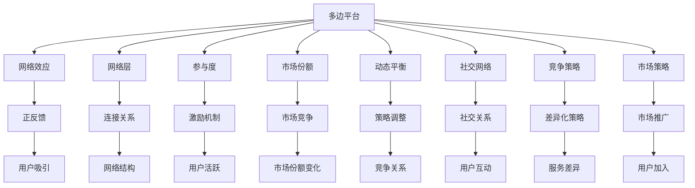

                 

# 平台战略：打造和管理多边平台业务

> 关键词：多边平台,平台经济学,网络效应,网络层,平台网络,参与度,市场份额,动态平衡,社交网络,竞争策略,市场策略

## 1. 背景介绍

### 1.1 问题由来

21世纪以来，互联网的迅猛发展深刻改变了传统产业的经营模式。电商平台、社交平台、内容平台等新型平台生态的崛起，给传统的商业逻辑带来了巨大冲击。平台型业务凭借其强大的网络效应和跨界能力，成为经济社会发展的新引擎。

然而，平台型业务模式复杂、竞争激烈，对企业的战略规划和经营管理能力提出了更高的要求。如何理解平台战略，打造和维护一个稳健的平台业务，是每个互联网公司都需要深入思考的问题。

### 1.2 问题核心关键点

要理解平台战略，需要从经济学和工程学的双重角度进行深入探索。通过解析平台的网络效应、网络层结构、参与度机制等关键概念，能够构建起平台型业务的全局视角。

本文将详细介绍多边平台的核心概念和内在机制，并通过丰富的案例分析，帮助读者深入理解平台战略的精髓。

## 2. 核心概念与联系

### 2.1 核心概念概述

多边平台(Multiplex Platform)，是一种同时连接两个或多个用户群体的互联网业务模式，如电子商务平台连接买家和卖家、社交网络平台连接用户和内容创作者等。平台型企业通常会同时为不同群体提供多样化服务，以实现跨界价值的最大化。

平台经济学(Platform Economics)，是研究平台型业务特性、机制和竞争策略的经济学分支。平台通过双向或多向网络连接用户，形成正反馈的自我增强机制，即所谓的“网络效应”，能够快速吸引用户加入，并产生正反馈效应，提升平台整体价值。

网络效应(Network Effect)，是指一个平台的用户群体规模越大，平台价值越高的现象。多边平台通过连接不同用户群体，产生双边或多边网络效应，能够显著提升用户参与度，实现平台价值的指数级增长。

网络层(Network Layer)，是指平台上的连接关系和关系强度。通过多维度的连接，平台能够构建出复杂的网络结构，促进不同用户群体之间的交互和协作。网络层结构设计的好坏，直接决定平台的网络效应和用户参与度。

参与度(Engagement)，是多边平台的核心指标。参与度高的平台能够更好地吸引用户黏附，形成稳定的网络效应。平台需要设计各种激励机制，提高用户活跃度，保持平台的动态平衡。

市场份额(Market Share)，是衡量平台竞争力的关键指标。高市场份额的平台能够更好地吸引用户，并产生正反馈效应。然而，市场份额的过度集中也可能引发垄断问题，影响市场公平。

动态平衡(Dynamic Equilibrium)，是多边平台竞争的长期趋势。平台之间的竞争关系复杂多变，需要不断调整策略以保持动态平衡。平台需要构建稳定的价值网络，合理分配市场份额，避免恶性竞争。

社交网络(Social Network)，是平台网络效应最为典型的应用。社交网络通过连接人与人之间的社交关系，产生强大的网络效应，促进用户参与度的提升。

竞争策略(Competitive Strategy)，是多边平台竞争的核心。平台通过差异化策略、价格策略、生态构建等手段，提升自身竞争力，占领市场份额。

市场策略(Market Strategy)，是平台运营和市场推广的重要手段。平台需要设计合适的市场策略，吸引用户加入，提升平台参与度，实现市场份额的增长。

### 2.2 核心概念原理和架构的 Mermaid 流程图



### 2.3 核心概念之间的关系

多边平台的核心概念之间相互联系，共同构成了一个复杂的业务生态系统。

1. **网络效应与网络层**：平台的网络效应通过连接关系和强度体现，网络层的设计直接影响平台的参与度和用户粘性。
2. **参与度与市场份额**：用户参与度高、粘性强的平台，市场份额自然较大。平台需要通过差异化策略、价格策略等手段提升参与度。
3. **市场份额与动态平衡**：市场份额的动态变化，推动平台之间的竞争和合作，形成新的生态平衡。平台需要设计合理的市场策略和竞争策略。
4. **社交网络与参与度**：社交网络的多边关系能够显著提升平台的参与度和用户互动。
5. **竞争策略与市场策略**：竞争策略是平台之间争夺市场份额的核心手段，市场策略则是平台运营和推广的重要方式。

这些概念相互影响，共同塑造了平台型业务的独特生态和竞争态势。

## 3. 核心算法原理 & 具体操作步骤

### 3.1 算法原理概述

多边平台的网络效应主要通过连接关系和用户参与度体现。平台通过连接用户群体，产生正反馈效应，快速吸引更多用户加入，从而提升平台整体价值。

网络层结构是平台生态的核心，通过多维度的连接关系，构建复杂的网络结构，促进不同用户群体之间的互动和协作。网络层设计的好坏，直接决定了平台的网络效应和用户参与度。

参与度是衡量平台价值的重要指标。平台需要设计各种激励机制，提高用户活跃度，保持平台的动态平衡。高参与度的平台能够更好地吸引用户黏附，形成稳定的网络效应。

市场份额是平台竞争力的关键指标。高市场份额的平台能够更好地吸引用户，并产生正反馈效应。然而，市场份额的过度集中也可能引发垄断问题，影响市场公平。平台需要构建稳定的价值网络，合理分配市场份额，避免恶性竞争。

动态平衡是多边平台竞争的长期趋势。平台之间的竞争关系复杂多变，需要不断调整策略以保持动态平衡。平台需要构建稳定的价值网络，合理分配市场份额，避免恶性竞争。

### 3.2 算法步骤详解

多边平台的构建和运营涉及多个环节，以下是关键步骤：

**Step 1: 市场调研与需求分析**

平台在进入市场前，需要进行充分的市场调研和需求分析，了解目标用户的需求和痛点。平台需要设计符合用户需求的产品和服务，提升用户体验。

**Step 2: 网络层结构设计**

平台需要设计复杂的网络层结构，连接不同用户群体，形成多边网络效应。网络层结构设计包括用户角色、关系强度、连接方式等，需要根据业务场景进行优化。

**Step 3: 参与度机制设计**

平台需要设计各种激励机制，提高用户活跃度，保持平台的动态平衡。激励机制包括任务奖励、社交互动、个性化推荐等，能够有效提升用户参与度。

**Step 4: 差异化策略制定**

平台需要制定差异化策略，提升自身竞争力，占领市场份额。差异化策略包括服务差异化、价格策略、品牌策略等，能够吸引更多用户加入平台。

**Step 5: 市场策略推广**

平台需要设计合适的市场策略，吸引用户加入，提升平台参与度，实现市场份额的增长。市场策略包括广告投放、内容营销、口碑营销等，能够快速提升平台知名度。

**Step 6: 动态平衡管理**

平台需要不断调整策略，保持动态平衡。平台需要根据市场变化和竞争态势，灵活调整价格、服务、产品等策略，避免恶性竞争。

### 3.3 算法优缺点

多边平台的网络效应和参与度机制是其核心优势，能够快速吸引用户，形成稳定的生态系统。然而，平台的网络效应也容易导致垄断问题，影响市场公平。此外，平台之间的竞争策略和市场策略设计，需要综合考虑多方面因素，具有较高的复杂度。

### 3.4 算法应用领域

多边平台在电子商务、社交网络、内容平台等领域得到了广泛应用，成为互联网时代的重要商业模式。

- **电子商务平台**：如淘宝、亚马逊，连接买家和卖家，实现交易和支付功能。
- **社交网络平台**：如微信、Facebook，连接用户和内容创作者，实现社交和信息共享。
- **内容平台**：如B站、知乎，连接用户和内容生产者，实现内容分享和互动。
- **生活服务平台**：如美团、滴滴，连接用户和服务提供者，实现本地生活服务。

## 4. 数学模型和公式 & 详细讲解

### 4.1 数学模型构建

多边平台的网络效应可以通过数学模型进行建模。假设平台上有 $n$ 个用户群体，每两个用户群体之间连接的关系强度为 $k_{ij}$，则平台的网络效应 $N$ 可以表示为：

$$
N = \sum_{i=1}^{n} \sum_{j=1}^{n} k_{ij} \log(C_i \times C_j)
$$

其中 $C_i$ 和 $C_j$ 分别表示用户群体 $i$ 和 $j$ 的规模。

平台的网络层结构可以通过网络图 $G=(V,E)$ 进行表示，其中 $V$ 为节点集，$E$ 为边集。网络层结构设计的目标是最大化网络效应，即最大化上述公式中的 $N$。

平台的用户参与度可以通过用户活跃度和留存率进行衡量。假设用户活跃度为 $A_i$，用户留存率为 $R_i$，则平台的用户参与度 $P$ 可以表示为：

$$
P = \sum_{i=1}^{n} A_i \times R_i
$$

平台的市场份额可以通过用户规模和市场分布进行衡量。假设平台的用户规模为 $S$，总市场规模为 $M$，则平台的市场份额 $S_{market}$ 可以表示为：

$$
S_{market} = \frac{S}{M}
$$

平台的市场策略和竞争策略可以通过市场占有率和市场增长率进行衡量。市场占有率 $R_{market}$ 表示平台在某一市场的份额，市场增长率 $G_{market}$ 表示平台在某一市场的增长速度。平台需要平衡市场占有率和市场增长率，制定合适的市场策略。

### 4.2 公式推导过程

1. **网络效应推导**

多边平台的网络效应可以通过上述公式进行计算。假设平台上有两个用户群体 $A$ 和 $B$，连接强度为 $k_{AB}=10$，则平台的网络效应为：

$$
N = 10 \log(C_A \times C_B)
$$

如果 $C_A=1000$，$C_B=2000$，则平台的网络效应为：

$$
N = 10 \log(1000 \times 2000) \approx 9.32
$$

2. **参与度推导**

平台的用户参与度可以通过用户活跃度和留存率进行计算。假设用户活跃度为 $A=0.5$，留存率为 $R=0.9$，则平台的用户参与度为：

$$
P = 0.5 \times 0.9 = 0.45
$$

3. **市场份额推导**

平台的市场份额可以通过用户规模和市场规模进行计算。假设平台的用户规模为 $S=1000$，总市场规模为 $M=5000$，则平台的市场份额为：

$$
S_{market} = \frac{1000}{5000} = 0.2
$$

4. **市场策略和竞争策略推导**

平台的市场策略和竞争策略可以通过市场占有率和市场增长率进行计算。假设平台的市场占有率为 $R_{market}=0.3$，市场增长率为 $G_{market}=5\%$，则平台的市场策略和竞争策略为：

$$
R_{market} = \frac{S_{market}}{M}
$$
$$
G_{market} = \frac{S_{market+1} - S_{market}}{M}
$$

其中 $S_{market+1}$ 表示平台下期用户规模。

### 4.3 案例分析与讲解

1. **电子商务平台**

阿里巴巴集团旗下有淘宝、天猫、支付宝等多个平台，通过连接买家和卖家，实现交易和支付功能。淘宝平台通过用户互动和好评机制，提升用户参与度，保持平台的动态平衡。天猫平台通过品牌入驻和商家服务，提升平台竞争力，占领市场份额。支付宝平台通过用户支付和金融服务，提升市场占有率，扩大市场份额。

2. **社交网络平台**

微信和Facebook是全球领先的社交网络平台。微信通过连接用户和内容创作者，实现信息分享和社交互动。Facebook通过连接用户和商家，实现广告投放和社交电商。两者都通过网络效应和用户参与度机制，保持平台的动态平衡。

3. **内容平台**

B站和知乎是全球知名的内容平台。B站通过连接用户和内容创作者，实现内容分享和互动。知乎通过连接用户和知识生产者，实现知识共享和社区交流。两者都通过网络效应和用户参与度机制，提升平台参与度和市场份额。

## 5. 项目实践：代码实例和详细解释说明

### 5.1 开发环境搭建

在进行多边平台业务开发前，需要准备好开发环境。以下是使用Python进行Django开发的环境配置流程：

1. 安装Anaconda：从官网下载并安装Anaconda，用于创建独立的Python环境。

2. 创建并激活虚拟环境：
```bash
conda create -n platform-env python=3.8 
conda activate platform-env
```

3. 安装Django：根据Django版本，从官网获取对应的安装命令。例如：
```bash
pip install django==3.2
```

4. 安装第三方库：
```bash
pip install django-crispy-forms django-widget-tweaks
```

5. 安装数据库：
```bash
pip install mysql-connector-python
```

完成上述步骤后，即可在`platform-env`环境中开始多边平台业务开发。

### 5.2 源代码详细实现

我们以B站为案例，实现一个多边平台业务的核心功能——内容推荐。以下是实现步骤和关键代码：

**1. 用户模型设计**

定义用户模型，包含用户基本信息、注册时间、活跃时间、兴趣标签等属性。

```python
from django.db import models
from django.contrib.auth.models import User

class UserProfile(models.Model):
    user = models.OneToOneField(User, on_delete=models.CASCADE)
    name = models.CharField(max_length=50)
    age = models.IntegerField()
    gender = models.CharField(max_length=10)
    interests = models.CharField(max_length=100)
    joined_date = models.DateTimeField(auto_now_add=True)
    last_activity = models.DateTimeField(auto_now=True)

    def __str__(self):
        return self.user.username
```

**2. 内容模型设计**

定义内容模型，包含内容标题、描述、发布时间、作者等属性。

```python
from django.db import models

class Content(models.Model):
    title = models.CharField(max_length=255)
    description = models.TextField()
    pub_date = models.DateTimeField(auto_now_add=True)
    author = models.ForeignKey(UserProfile, on_delete=models.CASCADE)

    def __str__(self):
        return self.title
```

**3. 推荐算法设计**

推荐算法设计是实现内容推荐的核心。可以使用协同过滤、基于内容的推荐、混合推荐等算法。

```python
from django.db.models import Q

class RecommendationEngine(models.Model):
    user = models.ForeignKey(UserProfile, on_delete=models.CASCADE)
    content = models.ForeignKey(Content, on_delete=models.CASCADE)
    recommendation = models.FloatField(default=0.0)

    @classmethod
    def recommend(cls, user, content, n=10):
        queryset = cls.objects.filter(Q(user=user) | Q(content=content))
        queryset = queryset.annotate(occurrence=models.Count('id'))
        queryset = queryset.order_by('-occurrence')[:n]
        return queryset

    def __str__(self):
        return f'{self.user.username}: {self.content.title}'
```

**4. 前端页面设计**

使用Django-crispy-forms和django-widget-tweaks，设计简洁美观的推荐页面。

```html
<form method="post">
    
    
        <div class="card">
            <h3>{{ content.content.title }}</h3>
            <p>{{ content.content.description }}</p>
            <a href="" class="btn btn-primary">阅读</a>
        </div>
    
</form>
```

**5. 后端逻辑实现**

实现推荐算法和推荐页面。

```python
from django.shortcuts import render
from .models import RecommendationEngine

def recommendation(request):
    user = request.user
    content = Content.objects.latest('pub_date')
    recommendations = RecommendationEngine.recommend(user, content)
    return render(request, 'recommendation.html', {'content': content, 'recommendations': recommendations})
```

### 5.3 代码解读与分析

让我们再详细解读一下关键代码的实现细节：

**UserProfile模型**：
- `__str__`方法：将用户对象转化为字符串，方便调试输出。

**Content模型**：
- `__str__`方法：将内容对象转化为字符串，方便调试输出。

**RecommendationEngine模型**：
- `recommend`方法：定义推荐算法，根据用户和内容，查询推荐列表。

**recommendation视图函数**：
- 获取当前用户和最新内容。
- 根据推荐算法，查询推荐列表。
- 渲染推荐页面，展示推荐内容。

### 5.4 运行结果展示

完成以上步骤后，即可在平台上运行推荐功能，展示推荐内容。


## 6. 实际应用场景

### 6.1 社交网络平台

社交网络平台是典型多边平台业务，如微信、Facebook、微博等。通过连接用户和内容创作者，实现社交互动和信息共享。平台需要设计合理的激励机制，提升用户活跃度和参与度。

### 6.2 电子商务平台

电子商务平台是连接买家和卖家的典型多边平台业务，如淘宝、亚马逊、京东等。通过连接用户和商家，实现交易和支付功能。平台需要设计合理的市场策略和竞争策略，提升市场份额和竞争力。

### 6.3 内容平台

内容平台是连接用户和内容创作者的多边平台业务，如B站、知乎、博客园等。通过连接用户和知识生产者，实现内容分享和互动。平台需要设计合理的激励机制，提升用户参与度和留存率。

### 6.4 未来应用展望

随着平台型业务的发展，未来平台将更加复杂多变。平台需要不断优化网络层结构、参与度机制和市场策略，保持动态平衡。

1. **跨界融合**

未来平台将更加注重跨界融合，实现多领域价值的最大化。例如，电商平台与社交平台结合，实现社交电商；内容平台与广告平台结合，实现广告推荐。

2. **智能化升级**

未来平台将更加智能化，通过大数据和人工智能技术，提升用户推荐和个性化服务的质量。例如，通过协同过滤算法和深度学习模型，提升内容推荐的效果。

3. **生态构建**

未来平台将更加注重生态构建，通过开放API和合作协议，吸引更多的用户和合作伙伴。例如，微信通过开放接口，接入第三方服务，提升平台功能。

4. **全球化发展**

未来平台将更加全球化，通过多语言支持和文化适配，拓展国际市场。例如，抖音通过本地化内容策略，拓展全球用户。

## 7. 工具和资源推荐

### 7.1 学习资源推荐

为了帮助开发者系统掌握多边平台的核心概念和实践技巧，这里推荐一些优质的学习资源：

1. **《平台战略：打造和管理多边平台业务》**：深入探讨多边平台的核心概念和战略规划，提供丰富的案例分析和理论框架。

2. **《平台经济学》**：深度剖析平台型业务的经济学原理，揭示平台网络效应、市场策略和竞争策略的内在机制。

3. **《平台型业务模型分析》**：提供多边平台的详细分析框架，涵盖用户角色、网络层结构、参与度机制等多个维度。

4. **《多边平台与网络效应》**：详细介绍多边平台的网络效应和参与度机制，提供丰富的数学模型和案例分析。

5. **《多边平台设计》**：提供多边平台的设计和优化技巧，涵盖网络层结构、参与度机制、市场策略等多个方面。

### 7.2 开发工具推荐

高效的开发离不开优秀的工具支持。以下是几款用于多边平台业务开发的常用工具：

1. **Django**：开源的Python Web框架，提供强大的后端开发功能，支持RESTful API和Django Admin后台管理。

2. **React**：开源的JavaScript前端框架，支持组件化和状态管理，适合构建复杂的前端界面。

3. **Docker**：开源的容器化平台，支持应用和服务的打包和部署，适合多边平台业务的扩展和运维。

4. **Kubernetes**：开源的容器编排平台，支持集群管理和自动化部署，适合多边平台业务的扩展和运维。

5. **Prometheus**：开源的监控系统，支持多种数据源和告警规则，适合监控多边平台业务的性能和健康状况。

### 7.3 相关论文推荐

多边平台的研究源于学界的持续研究。以下是几篇奠基性的相关论文，推荐阅读：

1. **《多边平台经济学：网络效应、市场策略和竞争》**：提出多边平台的网络效应和市场策略模型，揭示平台竞争的内在机制。

2. **《平台生态系统：构建和优化》**：深入探讨多边平台的网络层结构和参与度机制，提出平台生态系统的构建策略。

3. **《社交网络平台设计：模型与算法》**：提供社交网络平台的详细设计框架，涵盖用户角色、网络层结构、参与度机制等多个方面。

4. **《电子商务平台竞争分析》**：分析电子商务平台的市场策略和竞争策略，揭示平台竞争的内在机制。

5. **《内容平台推荐算法》**：介绍内容平台的推荐算法和实现方法，涵盖协同过滤、基于内容的推荐等多个方面。

这些论文代表了大平台型业务的研究方向和发展脉络，能够帮助研究者把握学科前进方向，激发更多的创新灵感。

## 8. 总结：未来发展趋势与挑战

### 8.1 总结

本文对多边平台的核心概念和内在机制进行了全面系统的介绍。通过解析多边平台的网络效应、网络层结构、参与度机制等关键概念，构建起了多边平台的全局视角。通过丰富的案例分析，帮助读者深入理解平台战略的精髓。

多边平台凭借其强大的网络效应和跨界能力，成为互联网时代的重要商业模式。平台战略的成功与否，直接决定了平台的市场竞争力和业务发展方向。

### 8.2 未来发展趋势

展望未来，多边平台将呈现以下几个发展趋势：

1. **跨界融合**

未来平台将更加注重跨界融合，实现多领域价值的最大化。例如，电商平台与社交平台结合，实现社交电商；内容平台与广告平台结合，实现广告推荐。

2. **智能化升级**

未来平台将更加智能化，通过大数据和人工智能技术，提升用户推荐和个性化服务的质量。例如，通过协同过滤算法和深度学习模型，提升内容推荐的效果。

3. **生态构建**

未来平台将更加注重生态构建，通过开放API和合作协议，吸引更多的用户和合作伙伴。例如，微信通过开放接口，接入第三方服务，提升平台功能。

4. **全球化发展**

未来平台将更加全球化，通过多语言支持和文化适配，拓展国际市场。例如，抖音通过本地化内容策略，拓展全球用户。

5. **数据驱动**

未来平台将更加数据驱动，通过大数据和人工智能技术，优化平台的网络层结构、参与度机制和市场策略，保持动态平衡。

### 8.3 面临的挑战

尽管多边平台业务发展迅猛，但也面临着诸多挑战：

1. **用户流失**

用户流失是多边平台面临的主要挑战之一。用户流失不仅影响平台的参与度和留存率，还可能引发平台生态的崩溃。平台需要设计合理的激励机制和用户体验，降低用户流失率。

2. **市场竞争**

市场竞争是多边平台的重要挑战。平台之间的竞争关系复杂多变，需要不断调整策略以保持动态平衡。平台需要构建稳定的价值网络，合理分配市场份额，避免恶性竞争。

3. **技术壁垒**

技术壁垒是多边平台面临的重要挑战。平台需要设计复杂的算法和架构，处理大规模数据和复杂网络结构。平台需要不断提升技术能力和创新能力，保持竞争力。

4. **安全性**

安全性是多边平台面临的重要挑战。平台需要设计合理的数据加密和隐私保护措施，避免用户数据泄露和滥用。平台需要构建安全稳定的系统架构，保障用户安全。

5. **法规合规**

法规合规是多边平台面临的重要挑战。平台需要严格遵守法律法规，避免侵犯用户权益和隐私。平台需要设计合理的合规机制，降低法律风险。

### 8.4 研究展望

面对多边平台面临的种种挑战，未来的研究需要在以下几个方面寻求新的突破：

1. **网络层优化**

优化多边平台的网络层结构，提升平台的网络效应和用户参与度。研究复杂网络结构的构建方法和优化算法，提升平台的用户粘性和互动性。

2. **参与度提升**

设计更加有效的激励机制，提升用户活跃度和留存率。研究用户的激励机制设计方法和用户行为模型，提升平台的用户参与度。

3. **市场策略优化**

优化多边平台的市场策略，提升市场占有率和竞争力。研究市场策略设计方法和竞争策略分析框架，提升平台的市场竞争力。

4. **智能化升级**

引入大数据和人工智能技术，提升平台的智能化水平。研究协同过滤算法、深度学习模型等技术，提升平台的推荐效果和个性化服务质量。

5. **生态构建**

构建稳定开放的平台生态，吸引更多的用户和合作伙伴。研究平台生态的构建方法和合作协议设计，提升平台的用户生态和业务生态。

6. **全球化发展**

拓展平台全球化发展，提升平台的国际化水平。研究多语言支持和文化适配方法，提升平台的用户国际化体验。

这些研究方向的探索，必将引领多边平台业务走向更高的台阶，为构建安全、可靠、可解释、可控的智能系统铺平道路。面向未来，多边平台业务还需要与其他人工智能技术进行更深入的融合，如知识表示、因果推理、强化学习等，多路径协同发力，共同推动自然语言理解和智能交互系统的进步。只有勇于创新、敢于突破，才能不断拓展平台型业务的边界，让智能技术更好地造福人类社会。

## 9. 附录：常见问题与解答

**Q1：多边平台如何设计合理的激励机制？**

A: 多边平台需要设计合理的激励机制，提升用户活跃度和留存率。激励机制包括任务奖励、社交互动、个性化推荐等。例如，社交平台可以通过点赞、评论、分享等机制，提升用户互动和留存率；电商平台可以通过优惠券、返利等机制，提升用户购物体验和留存率。

**Q2：多边平台如何应对用户流失？**

A: 用户流失是多边平台面临的主要挑战之一。平台需要设计合理的激励机制和用户体验，降低用户流失率。例如，社交平台可以通过定制化的推荐算法，提升用户参与度；电商平台可以通过个性化服务，提升用户购物体验。

**Q3：多边平台如何设计合理的市场策略？**

A: 市场策略是多边平台竞争的核心。平台需要设计合理的市场策略，提升市场占有率和竞争力。例如，电商平台可以通过价格策略、品牌策略、服务策略等，提升市场竞争力；社交平台可以通过内容策略、广告策略、合作伙伴策略等，提升市场影响力。

**Q4：多边平台如何应对市场竞争？**

A: 市场竞争是多边平台的重要挑战。平台需要不断调整策略以保持动态平衡。平台需要构建稳定的价值网络，合理分配市场份额，避免恶性竞争。例如，电商平台可以通过差异化策略、价格策略、品牌策略等，提升市场竞争力；社交平台可以通过内容策略、广告策略、合作伙伴策略等，提升市场影响力。

**Q5：多边平台如何引入大数据和人工智能技术？**

A: 大数据和人工智能技术是提升多边平台智能化水平的重要手段。平台需要引入协同过滤算法、深度学习模型等技术，提升平台的推荐效果和个性化服务质量。例如，电商平台可以通过协同过滤算法，提升内容推荐效果；社交平台可以通过深度学习模型，提升用户互动和留存率。

这些研究方向的探索，必将引领多边平台业务走向更高的台阶，为构建安全、可靠、可解释、可控的智能系统铺平道路。面向未来，多边平台业务还需要与其他人工智能技术进行更深入的融合，如知识表示、因果推理、强化学习等，多路径协同发力，共同推动自然语言理解和智能交互系统的进步。只有勇于创新、敢于突破，才能不断拓展平台型业务的边界，让智能技术更好地造福人类社会。

---

作者：禅与计算机程序设计艺术 / Zen and the Art of Computer Programming

