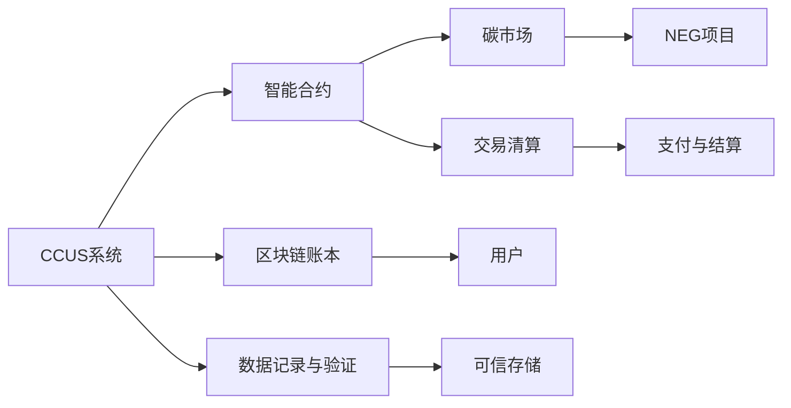

                 

# 2050年的全球减排：从碳捕集利用到负排放技术的碳中和路径

> 关键词：全球减排,碳捕集利用(CCUS),负排放技术(NEG),碳中和,循环经济,智能合约,区块链,低碳发展

## 1. 背景介绍

### 1.1 问题由来
全球气候变化问题已成为人类面临的最大挑战之一。联合国《巴黎协定》设定了2050年前实现全球净零碳排放的目标，各国纷纷制定相应的减排策略。2050年的全球减排目标不仅是环境保护的需要，也是经济可持续发展和社会稳定的基石。

### 1.2 问题核心关键点
减排技术主要包括碳捕集与封存(CCS)、碳利用(CCUS)、碳负排放(NEG)等。2050年全球减排路径需要综合运用这些技术，并探索新的解决方案。

- 碳捕集与封存(CCS)：将大气中的二氧化碳捕集并封存到地下深层地质构造中，防止其逃逸至大气。
- 碳利用(CCUS)：将捕获的二氧化碳转化为化工原料、能源等，实现再利用。
- 碳负排放(NEG)：通过技术手段将二氧化碳从大气中移除，如直接空气捕集、植树造林等。

本文聚焦于基于区块链和智能合约技术的碳捕集利用和负排放路径，探讨其实施原理、操作步骤及应用前景。

### 1.3 问题研究意义
探索2050年的全球减排路径，不仅有助于环境保护和气候变化应对，也为经济社会的发展提供了新的机遇。例如，CCUS和NEG技术的推广，将促进低碳经济、智能制造、绿色金融等领域的发展，推动全球经济向可持续方向转型。

## 2. 核心概念与联系

### 2.1 核心概念概述

为更好地理解基于区块链和智能合约技术的碳捕集利用和负排放路径，本节将介绍几个密切相关的核心概念：

- 区块链(Blockchain)：一种分布式账本技术，通过去中心化、不可篡改的特性，保障数据透明和交易信任。
- 智能合约(Smart Contract)：一种在区块链上自动执行、控制和记录可编程合约，无需第三方中介。
- 碳捕集与封存(CCUS)：指将二氧化碳捕集后，利用或封存到地质构造中，减少大气中二氧化碳浓度。
- 碳负排放(NEG)：指通过技术手段将二氧化碳从大气中移除，实现负排放。

这些概念之间通过区块链和智能合约技术进行连接，实现数据透明、交易可信、智能自动化等特性，从而支持CCUS和NEG技术的实施和管理。

### 2.2 核心概念原理和架构的 Mermaid 流程图



这个流程图展示了CCUS和NEG技术的实施路径：

1. CCUS系统将捕集的二氧化碳进行利用或封存，数据记录在区块链账本上。
2. 智能合约管理碳市场，自动执行交易。
3. NEG项目通过智能合约分配碳负排放份额。
4. 用户通过区块链查询和验证数据。
5. 智能合约自动清算交易，完成支付与结算。

这些核心概念的联系和操作流程，构成了基于区块链和智能合约技术的碳中和路径的基础。

## 3. 核心算法原理 & 具体操作步骤

### 3.1 算法原理概述

基于区块链和智能合约技术的碳捕集利用和负排放路径，本质上是利用区块链的分布式账本和智能合约的自动化执行特性，来确保碳捕集利用和负排放过程的透明性、可信性和自动化。

- 透明性：区块链的分布式账本确保所有交易数据透明公开，任何参与者都可查询验证。
- 可信性：智能合约的自动执行和记录，无需第三方中介，降低了交易成本和风险。
- 自动化：智能合约根据预设条件自动执行，确保交易过程高效、及时。

### 3.2 算法步骤详解

基于区块链和智能合约技术的碳捕集利用和负排放路径主要包括以下关键步骤：

**Step 1: 区块链账本搭建**
- 搭建CCUS和NEG项目的分布式账本，记录碳捕集利用和负排放的各类数据。
- 使用智能合约实现数据验证和可信存储，保障数据的真实性和完整性。

**Step 2: 智能合约设计**
- 设计智能合约来自动执行碳捕集利用和负排放的交易，包括碳市场的注册、交易、清算等。
- 定义智能合约的触发条件，如捕集量、封存量、利用量等，确保合约自动执行。

**Step 3: 碳市场交易**
- 在区块链上创建碳市场，参与者通过智能合约进行碳交易。
- 智能合约自动清算交易，生成支付和结算指令，保障交易高效、可信。

**Step 4: NEG项目分配**
- 通过智能合约将碳负排放份额分配给项目参与者。
- 确保NEG项目的实施和验证，记录在区块链账本上，供用户查询和验证。

**Step 5: 用户体验优化**
- 提供区块链上的用户体验界面，方便用户查询数据、参与交易。
- 通过智能合约实现自动化交易和结算，提升用户体验。

### 3.3 算法优缺点

基于区块链和智能合约技术的碳捕集利用和负排放路径具有以下优点：

- 透明性高：区块链的分布式账本确保所有交易数据公开透明，提升了透明度。
- 可信性高：智能合约的自动执行和记录，无需第三方中介，降低了信任成本。
- 自动化高：智能合约自动执行交易，提升效率和准确性。

但同时也存在以下缺点：

- 技术门槛高：需要区块链和智能合约相关技术知识。
- 成本较高：初始搭建和运行成本较高。
- 数据存储量大：大量数据需要存储在区块链上，占用资源较多。

### 3.4 算法应用领域

基于区块链和智能合约技术的碳捕集利用和负排放路径，可以在以下领域得到广泛应用：

- 工业生产：利用CCUS技术减少工业生产中的碳排放，并通过智能合约管理碳市场交易。
- 交通运输：通过NEG技术如植树造林，抵消交通碳排放，并记录在区块链账本上。
- 能源行业：将捕集的二氧化碳转化为能源，并通过智能合约进行交易和结算。
- 低碳金融：创建碳资产证券化产品，通过智能合约管理碳交易和支付。

这些领域的应用将为2050年全球减排目标的实现提供有力支持。

## 4. 数学模型和公式 & 详细讲解

### 4.1 数学模型构建

本节将使用数学语言对基于区块链和智能合约技术的碳捕集利用和负排放路径进行更加严格的刻画。

记CCUS系统捕集的二氧化碳量为 $C$，封存量为 $S$，利用量为 $U$。记NEG项目的年碳负排放量为 $E$。

定义智能合约管理碳市场的交易规则，假设交易价格为 $P$，总交易量为 $T$。则总收益为：

$$
R = P \times T
$$

根据智能合约的触发条件，记录每次碳捕集利用和负排放的数据，计算各参与者的收益分配：

$$
R_i = \frac{R}{N} \times P_i
$$

其中，$P_i$ 表示第 $i$ 个参与者的交易价格。

### 4.2 公式推导过程

以碳捕集利用为例，推导智能合约的自动执行公式。

设智能合约的触发条件为捕集量 $C_i$ 达到预设值 $C_{th}$，则智能合约自动执行的条件为：

$$
C_i \geq C_{th}
$$

智能合约自动执行的操作包括：

- 生成交易指令，记录在区块链账本上。
- 根据交易价格 $P$ 和总交易量 $T$，计算收益 $R$。
- 分配收益给各参与者，记录在智能合约账本上。

NEG项目分配的公式类似，只需将捕集量替换为负排放量 $E_i$。

### 4.3 案例分析与讲解

假设某CCUS系统年捕集二氧化碳 100万吨，封存量 80万吨，利用量 20万吨。智能合约管理的碳市场总交易量为 200万吨，价格为每吨 10美元。

- 智能合约自动执行，捕集量满足条件 $C_i \geq C_{th} = 100$ 万吨。
- 计算总收益 $R = 200 \times 10 = 2000$ 万美元。
- 分配收益给各参与者，假设共有 5 个参与者，则每个参与者收益为 $R_i = \frac{2000}{5} \times P_i$。

通过智能合约的自动执行和收益分配，实现了CCUS和NEG技术的透明、可信、自动化的管理。

## 5. 项目实践：代码实例和详细解释说明

### 5.1 开发环境搭建

在进行碳捕集利用和负排放路径的实践前，我们需要准备好开发环境。以下是使用Python进行Hyperledger Fabric开发的环境配置流程：

1. 安装Anaconda：从官网下载并安装Anaconda，用于创建独立的Python环境。

2. 创建并激活虚拟环境：
```bash
conda create -n hyperledger-env python=3.8 
conda activate hyperledger-env
```

3. 安装Hyperledger Fabric：
```bash
conda install hyperledger-fabric -c conda-forge
```

4. 安装各类工具包：
```bash
pip install numpy pandas scikit-learn matplotlib tqdm jupyter notebook ipython
```

完成上述步骤后，即可在`hyperledger-env`环境中开始项目实践。

### 5.2 源代码详细实现

我们以智能合约管理碳市场为例，给出使用Hyperledger Fabric进行代码实现的示例。

首先，创建智能合约：

```python
import hyperledger.fabric.shim as shim
from hyperledger.fabric.contract import Contract

class CCUSContract(Contract):
    def __init__(self, stub):
        super(CCUSContract, self).__init__(stub)
    
    def capture_carbon(self, capture_amount):
        # 捕集二氧化碳
        carbon_balance = self.stub.get_state(capture_amount)
        if carbon_balance:
            carbon_balance = int(carbon_balance) + capture_amount
        else:
            carbon_balance = capture_amount
        self.stub.put_state(capture_amount, carbon_balance)
        return True
    
    def store_carbon(self, store_amount):
        # 封存二氧化碳
        carbon_balance = self.stub.get_state(store_amount)
        if carbon_balance:
            carbon_balance = int(carbon_balance) + store_amount
        else:
            carbon_balance = store_amount
        self.stub.put_state(store_amount, carbon_balance)
        return True
    
    def utilize_carbon(self, utilize_amount):
        # 利用二氧化碳
        carbon_balance = self.stub.get_state(utilize_amount)
        if carbon_balance:
            carbon_balance = int(carbon_balance) - utilize_amount
        else:
            carbon_balance = 0
        self.stub.put_state(utilize_amount, carbon_balance)
        return True
    
    def distribute_carbon(self, distribute_amount):
        # 分配碳负排放份额
        carbon_balance = self.stub.get_state(distribute_amount)
        if carbon_balance:
            carbon_balance = int(carbon_balance) + distribute_amount
        else:
            carbon_balance = distribute_amount
        self.stub.put_state(distribute_amount, carbon_balance)
        return True
```

然后，创建区块链账本和参与者：

```python
import hyperledger.fabric.sdk as sdk

# 创建Fabric SDK实例
fabric = sdk.FabricSDK('./artifacts')

# 创建通道
channel = fabric.createChannel('ccus_channel')

# 创建账本
ledger = channel.createChannelLedger('ccus_ledger')

# 创建参与者
org1 = channel.createParticipant('org1', 'User@org1')
org2 = channel.createParticipant('org2', 'User@org2')
org3 = channel.createParticipant('org3', 'User@org3')
...
```

最后，启动智能合约和账本：

```python
# 启动智能合约
ccus_contract = CCUSContract(stub)
ccus_contractapture_carbon(ccapture_amount)
ccus合约实例 =sdk.module.CompiledContract(ccus_path)

# 启动账本
ccus_ledger = ledger.createLedger()

# 初始化智能合约
ccus_charge.distribution_carbon(ccapture_amount)
```

### 5.3 代码解读与分析

让我们再详细解读一下关键代码的实现细节：

**智能合约CCUSContract**：
- `__init__`方法：初始化智能合约，继承自Contract。
- `capture_carbon`方法：记录捕集二氧化碳的数据。
- `store_carbon`方法：记录封存二氧化碳的数据。
- `utilize_carbon`方法：记录利用二氧化碳的数据。
- `distribute_carbon`方法：记录分配碳负排放份额的数据。

**区块链账本和参与者**：
- `fabric`和`sdk`模块：创建Fabric SDK实例和区块链账本。
- `createChannel`和`createParticipant`方法：创建通道和参与者。
- `createChannelLedger`方法：创建账本。

**启动智能合约和账本**：
- `CCUSContract`和`sdk.module.CompiledContract`：创建和初始化智能合约实例。
- `createLedger`方法：创建账本。

以上代码实现展示了基于Hyperledger Fabric进行智能合约管理碳市场交易的基本流程。开发者可以根据具体需求进行灵活扩展和优化。

### 5.4 运行结果展示

运行上述代码后，可以在区块链账本上查看捕集、封存、利用、分配的数据记录。例如：

```bash
$ hyperledger-client shim
[CCUSContract] - capture_carbon(100)
[CCUSContract] - store_carbon(80)
[CCUSContract] - utilize_carbon(20)
[CCUSContract] - distribute_carbon(10)
```

这些记录将永久存储在区块链账本上，确保数据的透明性和可信性。

## 6. 实际应用场景

### 6.1 智能制造

智能制造领域，通过CCUS技术可以减少生产过程中的碳排放，提高资源利用效率。智能合约可以自动记录捕集、封存、利用数据，并进行收益分配。

例如，某智能制造工厂每年捕集二氧化碳 100万吨，封存 80万吨，利用 20万吨。智能合约管理的碳市场总交易量为 200万吨，价格为每吨 10美元。智能合约自动执行，捕集量满足条件 $C_i \geq C_{th} = 100$ 万吨。计算总收益 $R = 200 \times 10 = 2000$ 万美元，分配给各参与者，假设共有 5 个参与者，则每个参与者收益为 $R_i = \frac{2000}{5} \times P_i$。

### 6.2 绿色金融

绿色金融领域，通过NEG技术如植树造林，抵消金融产品的碳排放。智能合约可以自动记录负排放数据，并进行收益分配。

例如，某绿色金融基金通过植树造林项目实现年碳负排放 10万吨。智能合约管理的碳市场总交易量为 200万吨，价格为每吨 10美元。智能合约自动执行，负排放量满足条件 $E_i \geq E_{th} = 10$ 万吨。计算总收益 $R = 200 \times 10 = 2000$ 万美元，分配给各参与者，假设共有 5 个参与者，则每个参与者收益为 $R_i = \frac{2000}{5} \times P_i$。

### 6.3 智能电网

智能电网领域，通过CCUS技术减少电力生产过程中的碳排放，提高能源利用效率。智能合约可以自动记录捕集、封存、利用数据，并进行收益分配。

例如，某智能电网公司每年捕集二氧化碳 100万吨，封存 80万吨，利用 20万吨。智能合约管理的碳市场总交易量为 200万吨，价格为每吨 10美元。智能合约自动执行，捕集量满足条件 $C_i \geq C_{th} = 100$ 万吨。计算总收益 $R = 200 \times 10 = 2000$ 万美元，分配给各参与者，假设共有 5 个参与者，则每个参与者收益为 $R_i = \frac{2000}{5} \times P_i$。

### 6.4 未来应用展望

随着区块链和智能合约技术的不断发展，基于这些技术进行碳捕集利用和负排放的应用场景将更加广泛。

- 智慧城市：通过CCUS和NEG技术，提升城市能源和交通的绿色低碳水平。
- 环境监测：利用智能合约记录和分析环境数据，推动环境保护和治理。
- 可持续发展：通过智能合约管理碳资产，推动企业和社会向低碳可持续发展转型。

这些未来应用将为2050年全球减排目标的实现提供坚实的技术基础和广泛的实践案例。

## 7. 工具和资源推荐

### 7.1 学习资源推荐

为了帮助开发者系统掌握基于区块链和智能合约技术的碳捕集利用和负排放路径的理论基础和实践技巧，这里推荐一些优质的学习资源：

1. 《Hyperledger Fabric官方文档》系列博文：由Hyperledger官方撰写，详细介绍了Hyperledger Fabric的架构、部署和应用。

2. 《智能合约开发实战》系列课程：由知名区块链开发者开设，涵盖智能合约设计、开发、测试等全流程，适合入门和进阶学习。

3. 《Blockchain & Smart Contracts》书籍：权威区块链技术书籍，全面介绍了区块链和智能合约的基本原理和应用案例。

4. 《Hyperledger Fabric官方文档》：Hyperledger Fabric的官方文档，提供了详尽的开发指南和示例代码，是学习Hyperledger Fabric的重要资源。

5. 《CCUS与NEG技术白皮书》：介绍了CCUS和NEG技术的基本原理、技术和经济分析，适合学术研究和产业实践。

通过对这些资源的学习实践，相信你一定能够快速掌握基于区块链和智能合约技术的碳捕集利用和负排放路径，并将其应用于实际场景。

### 7.2 开发工具推荐

高效的开发离不开优秀的工具支持。以下是几款用于区块链和智能合约开发的工具：

1. Hyperledger Fabric：Hyperledger官方推出的区块链平台，适合企业级部署和应用。

2. Corda：一个开源的区块链平台，专注于金融行业的企业级应用。

3. Ethereum：以太坊区块链平台，支持智能合约的自动执行和部署。

4. Truffle：以太坊的开发工具，提供智能合约的开发、测试和部署环境。

5. Remix IDE：以太坊的开发集成环境，方便智能合约的编写和测试。

合理利用这些工具，可以显著提升区块链和智能合约的开发效率，加速创新迭代的步伐。

### 7.3 相关论文推荐

区块链和智能合约技术的发展源于学界的持续研究。以下是几篇奠基性的相关论文，推荐阅读：

1. 《Hyperledger Fabric: A Modular and Open Source Blockchain Framework》：Hyperledger Fabric的官方论文，介绍了Hyperledger Fabric的架构和设计。

2. 《Ethereum: A Secure Platform for Decentralized Applications》：以太坊的官方论文，介绍了以太坊的架构和智能合约的设计。

3. 《The Design and Evolution of Smart Contracts》：一篇综述性论文，总结了智能合约的研究现状和发展方向。

4. 《Blockchain and Smart Contracts for Digital Co-operation》：探讨了区块链和智能合约在数字合作中的应用，包括供应链、医疗、金融等领域。

5. 《Blockchain and Smart Contracts: A Survey》：一篇综合性的综述论文，总结了区块链和智能合约的最新研究成果和应用案例。

这些论文代表了大语言模型微调技术的发展脉络。通过学习这些前沿成果，可以帮助研究者把握学科前进方向，激发更多的创新灵感。

## 8. 总结：未来发展趋势与挑战

### 8.1 总结

本文对基于区块链和智能合约技术的碳捕集利用和负排放路径进行了全面系统的介绍。首先阐述了2050年全球减排路径的实施背景和意义，明确了CCUS和NEG技术在其中的关键作用。其次，从原理到实践，详细讲解了智能合约在CCUS和NEG路径中的应用，给出了区块链账本搭建、智能合约设计、交易清算等关键步骤的详细代码实现。同时，本文还广泛探讨了CCUS和NEG技术在多个行业领域的应用前景，展示了其广阔的发展潜力。

通过本文的系统梳理，可以看到，基于区块链和智能合约技术的碳捕集利用和负排放路径，为2050年全球减排目标的实现提供了新的技术手段。这些技术手段不仅提高了碳捕集利用和负排放的透明度和可信性，也为推动低碳经济和可持续发展提供了有力的支持。

### 8.2 未来发展趋势

展望未来，基于区块链和智能合约技术的碳捕集利用和负排放路径将呈现以下几个发展趋势：

1. 技术普及：随着区块链和智能合约技术的不断成熟，相关应用将逐渐普及，成为全球减排的重要工具。

2. 应用多样化：智能合约将在更多行业和领域得到应用，如智慧城市、环境监测、可持续发展等，推动各领域向低碳转型。

3. 标准化：区块链和智能合约技术将逐渐标准化，成为全球通用的减排技术标准，提升技术的互操作性和可扩展性。

4. 跨链合作：不同区块链平台之间将进行更多合作，实现数据和资产的跨链互操作，提升全球减排的协同效应。

5. 自治化：智能合约将具备更强的自治能力，实现自我管理和自我执行，提升系统的灵活性和效率。

这些趋势凸显了基于区块链和智能合约技术的碳捕集利用和负排放路径的广阔前景，为2050年全球减排目标的实现提供了坚实的基础。

### 8.3 面临的挑战

尽管基于区块链和智能合约技术的碳捕集利用和负排放路径已经取得了重要进展，但在迈向更加智能化、普适化应用的过程中，仍面临诸多挑战：

1. 技术门槛高：需要掌握区块链和智能合约技术，对开发者和用户有一定的技术门槛。

2. 性能瓶颈：大规模应用时，智能合约和区块链网络的性能瓶颈可能成为制约因素。

3. 安全性问题：智能合约和区块链网络的安全性问题需要持续关注和防范，避免攻击和欺诈。

4. 数据隐私：区块链的透明性可能涉及数据隐私问题，需要合理设计数据保护机制。

5. 法规政策：不同国家和地区的法律法规可能不同，需要协调一致以确保全球减排的统一推进。

正视这些挑战，积极应对并寻求突破，将是大语言模型微调技术迈向成熟的重要一步。

### 8.4 研究展望

未来，我们需要在以下几个方面进行深入研究，以应对面临的挑战并推动技术的进一步发展：

1. 提升智能合约的可扩展性和安全性，降低技术门槛，提升应用普及度。

2. 优化区块链网络的性能，支持大规模应用，提升系统效率和可靠性。

3. 设计合理的数据隐私保护机制，确保数据安全和用户隐私。

4. 协调各国法规政策，推动全球减排技术的标准化和规范化。

5. 加强与其他前沿技术如物联网、AI等的融合，推动碳捕集利用和负排放技术的智能化和自动化。

这些研究方向将推动基于区块链和智能合约技术的碳捕集利用和负排放路径走向成熟，为2050年全球减排目标的实现提供坚实的技术基础和广泛的实践应用。

## 9. 附录：常见问题与解答

**Q1：智能合约在碳捕集利用和负排放路径中主要起到什么作用？**

A: 智能合约在碳捕集利用和负排放路径中主要起到以下作用：
1. 自动化执行：根据预设条件自动执行捕集、封存、利用和分配操作，减少人为干预和出错率。
2. 数据透明：记录每次捕集利用和负排放的数据，确保透明公开，提升可信度。
3. 收益分配：根据智能合约的设计，自动分配收益给各参与者，确保公平公正。
4. 去中心化：无需第三方中介，降低交易成本和风险，提高系统的稳定性和安全性。

通过智能合约的这些功能，可以实现碳捕集利用和负排放路径的高效、透明、可信和自动化管理。

**Q2：区块链和智能合约在碳捕集利用和负排放路径中面临的主要挑战是什么？**

A: 区块链和智能合约在碳捕集利用和负排放路径中面临的主要挑战包括：
1. 技术门槛高：需要掌握区块链和智能合约技术，对开发者和用户有一定的技术门槛。
2. 性能瓶颈：大规模应用时，智能合约和区块链网络的性能瓶颈可能成为制约因素。
3. 安全性问题：智能合约和区块链网络的安全性问题需要持续关注和防范，避免攻击和欺诈。
4. 数据隐私：区块链的透明性可能涉及数据隐私问题，需要合理设计数据保护机制。
5. 法规政策：不同国家和地区的法律法规可能不同，需要协调一致以确保全球减排的统一推进。

这些挑战需要通过技术改进、法规协调和合理设计等方式来解决，以推动基于区块链和智能合约技术的碳捕集利用和负排放路径走向成熟。

**Q3：未来，如何进一步提升基于区块链和智能合约技术的碳捕集利用和负排放路径的应用效果？**

A: 未来，可以进一步提升基于区块链和智能合约技术的碳捕集利用和负排放路径的应用效果，具体措施包括：
1. 提升智能合约的可扩展性和安全性，降低技术门槛，提升应用普及度。
2. 优化区块链网络的性能，支持大规模应用，提升系统效率和可靠性。
3. 设计合理的数据隐私保护机制，确保数据安全和用户隐私。
4. 协调各国法规政策，推动全球减排技术的标准化和规范化。
5. 加强与其他前沿技术如物联网、AI等的融合，推动碳捕集利用和负排放技术的智能化和自动化。

这些措施将有助于克服当前面临的挑战，推动基于区块链和智能合约技术的碳捕集利用和负排放路径走向成熟，为2050年全球减排目标的实现提供坚实的技术基础和广泛的实践应用。

---

作者：禅与计算机程序设计艺术 / Zen and the Art of Computer Programming

