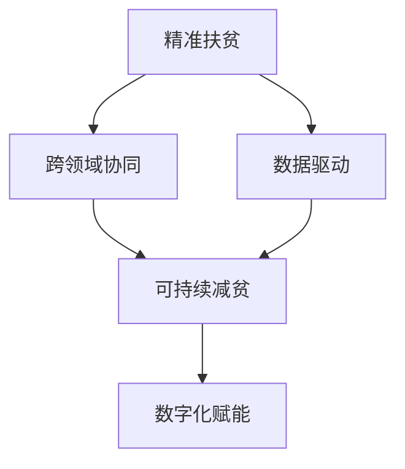
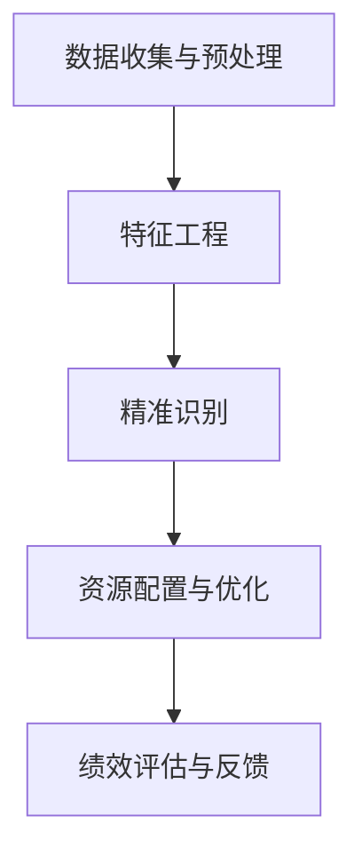

                 

## 1. 背景介绍

### 1.1 问题由来

近年来，全球减贫工作取得了显著成效，特别是在精准扶贫和数据驱动的扶贫策略上。然而，当前减贫模式仍面临诸多挑战，特别是在疫情和全球经济动荡背景下，极端贫困依然存在。为了进一步提升减贫效果，推动全球减贫进入可持续发展阶段，需要引入新的技术和方法，实现从精准扶贫到可持续减贫的转变。

### 1.2 问题核心关键点

从精准扶贫到可持续减贫的核心关键点包括：
1. **数据驱动的精准扶贫**：利用大数据、人工智能等技术，进行贫困数据的精准分析，实现资源配置的精细化管理。
2. **跨领域协同治理**：在减贫工作中，需要各领域协同工作，包括政府、企业、NGO、社区等，形成合力。
3. **可持续减贫模式**：探索基于可持续发展理念的减贫模式，关注环境和社会的长期效益。
4. **数字化赋能**：利用数字技术，提升减贫工作的效率和透明度，促进减贫成果的持续性。

这些关键点构成了从精准扶贫到可持续减贫的全过程，需要通过技术手段和跨部门合作，逐步实现。

## 2. 核心概念与联系

### 2.1 核心概念概述

- **精准扶贫**：通过大数据和人工智能等技术，精准识别贫困人口，精准提供扶贫资源，确保资源配置的公平性和有效性。
- **可持续减贫**：在减贫过程中，考虑环境、社会、经济等多方面因素，确保减贫成果的可持续性和长期效益。
- **跨领域协同治理**：政府、企业、NGO、社区等各方协同工作，形成合力，共同推动减贫进程。
- **数字化赋能**：利用数字技术，提升减贫工作的效率和透明度，促进减贫成果的持续性。

这些核心概念通过以下Mermaid流程图来展示：



这个流程图展示了精准扶贫、数据驱动、跨领域协同和可持续减贫之间的关系。数据驱动和跨领域协同是精准扶贫的核心，而数字化赋能和可持续减贫则是精准扶贫的结果和目标。

## 3. 核心算法原理 & 具体操作步骤

### 3.1 算法原理概述

从精准扶贫到可持续减贫的算法原理包括以下几个关键点：

- **数据收集与预处理**：收集贫困人口、收入、教育、健康等数据，并进行预处理和清洗。
- **特征工程**：利用机器学习技术，进行特征提取和选择，构建贫困预测模型。
- **精准识别**：通过模型预测，精准识别贫困人口，实现资源配置的精细化管理。
- **资源配置与优化**：根据精准识别结果，分配扶贫资源，并进行优化，确保资源配置的公平性和有效性。
- **绩效评估与反馈**：对减贫成果进行评估，并根据反馈不断优化扶贫策略。

这些步骤通过以下流程图来展示：



### 3.2 算法步骤详解

1. **数据收集与预处理**：
   - 利用传感器、问卷调查、大数据平台等方式，收集贫困人口、收入、教育、健康等数据。
   - 对数据进行清洗和处理，去除噪声和异常值，确保数据的质量和完整性。

2. **特征工程**：
   - 选择相关性高、信息量大的特征，构建特征集。
   - 利用机器学习技术，进行特征选择和降维，提升模型预测准确率。

3. **精准识别**：
   - 利用训练好的模型，对贫困人口进行预测，实现精准识别。
   - 结合专家知识，对模型预测结果进行校验和调整，确保识别的准确性和公平性。

4. **资源配置与优化**：
   - 根据精准识别结果，分配扶贫资源，如资金、物资、教育资源等。
   - 利用优化算法，对资源配置进行优化，确保资源使用的效率和公平性。

5. **绩效评估与反馈**：
   - 对减贫成果进行评估，包括减贫率、资源利用率、贫困人口生活质量等指标。
   - 根据评估结果，调整和优化扶贫策略，确保减贫效果和持续性。

### 3.3 算法优缺点

**优点**：
- 数据驱动，精准识别贫困人口，提升扶贫资源配置的公平性和有效性。
- 利用机器学习技术，实现自动化和智能化，提高减贫工作的效率。
- 跨领域协同，形成合力，提升减贫效果。
- 绩效评估与反馈，不断优化扶贫策略，确保减贫成果的可持续性。

**缺点**：
- 数据收集和预处理复杂，需要大量人力和资源。
- 模型和算法选择困难，需要专业知识和技术支持。
- 资源配置和优化需要多领域合作，协调难度较大。
- 绩效评估和反馈需要长期跟踪，工作量较大。

### 3.4 算法应用领域

- **精准扶贫**：适用于政府扶贫项目，提升资源配置的精准度和有效性。
- **企业社会责任(ESR)**：企业利用大数据和人工智能技术，开展精准扶贫和可持续减贫项目。
- **NGO减贫项目**：NGO利用数字技术和机器学习，进行贫困数据分析和精准扶贫。
- **社区减贫**：社区利用数字平台，开展社区贫困识别和资源配置。

## 4. 数学模型和公式 & 详细讲解

### 4.1 数学模型构建

在减贫模型中，常见的数学模型包括：
- 线性回归模型
- 决策树模型
- 随机森林模型
- 支持向量机模型
- 神经网络模型

以线性回归模型为例，构建如下：

设贫困人口的特征向量为 $X$，贫困程度为 $y$，则线性回归模型为：

$$
y = \beta_0 + \beta_1 X_1 + \beta_2 X_2 + \ldots + \beta_n X_n
$$

其中，$\beta_0, \beta_1, \ldots, \beta_n$ 为模型参数。

### 4.2 公式推导过程

1. **数据收集与预处理**：
   - 数据收集：利用传感器、问卷调查、大数据平台等方式，收集贫困人口、收入、教育、健康等数据。
   - 数据预处理：对数据进行清洗和处理，去除噪声和异常值。

2. **特征工程**：
   - 特征提取：选择相关性高、信息量大的特征，构建特征集。
   - 特征选择：利用特征选择方法，选择最优特征，提升模型预测准确率。

3. **模型训练**：
   - 利用训练数据，训练线性回归模型。
   - 计算模型参数 $\beta_0, \beta_1, \ldots, \beta_n$。

4. **精准识别**：
   - 利用训练好的模型，对贫困人口进行预测，实现精准识别。
   - 结合专家知识，对模型预测结果进行校验和调整，确保识别的准确性和公平性。

5. **资源配置与优化**：
   - 根据精准识别结果，分配扶贫资源，如资金、物资、教育资源等。
   - 利用优化算法，对资源配置进行优化，确保资源使用的效率和公平性。

6. **绩效评估与反馈**：
   - 对减贫成果进行评估，包括减贫率、资源利用率、贫困人口生活质量等指标。
   - 根据评估结果，调整和优化扶贫策略，确保减贫效果和持续性。

### 4.3 案例分析与讲解

**案例：某县精准扶贫项目**

某县通过以下步骤实施精准扶贫：
1. **数据收集与预处理**：
   - 利用问卷调查和大数据平台，收集贫困人口、收入、教育、健康等数据。
   - 对数据进行清洗和处理，去除噪声和异常值。

2. **特征工程**：
   - 选择贫困人口的年龄、性别、教育水平、家庭收入等特征。
   - 利用机器学习技术，进行特征选择和降维，提升模型预测准确率。

3. **模型训练**：
   - 利用训练数据，训练线性回归模型。
   - 计算模型参数 $\beta_0, \beta_1, \ldots, \beta_n$。

4. **精准识别**：
   - 利用训练好的模型，对贫困人口进行预测，实现精准识别。
   - 结合专家知识，对模型预测结果进行校验和调整，确保识别的准确性和公平性。

5. **资源配置与优化**：
   - 根据精准识别结果，分配扶贫资源，如资金、物资、教育资源等。
   - 利用优化算法，对资源配置进行优化，确保资源使用的效率和公平性。

6. **绩效评估与反馈**：
   - 对减贫成果进行评估，包括减贫率、资源利用率、贫困人口生活质量等指标。
   - 根据评估结果，调整和优化扶贫策略，确保减贫效果和持续性。

通过以上步骤，某县的精准扶贫项目取得了显著成效，减贫率显著提升，贫困人口的生活质量明显改善。

## 5. 项目实践：代码实例和详细解释说明

### 5.1 开发环境搭建

在进行减贫模型开发前，我们需要准备好开发环境。以下是使用Python进行TensorFlow开发的环境配置流程：

1. 安装Anaconda：从官网下载并安装Anaconda，用于创建独立的Python环境。

2. 创建并激活虚拟环境：
```bash
conda create -n tf-env python=3.8 
conda activate tf-env
```

3. 安装TensorFlow：根据CUDA版本，从官网获取对应的安装命令。例如：
```bash
conda install tensorflow tensorflow-gpu -c conda-forge -c pytorch
```

4. 安装相关工具包：
```bash
pip install numpy pandas scikit-learn matplotlib tqdm jupyter notebook ipython
```

完成上述步骤后，即可在`tf-env`环境中开始减贫模型开发。

### 5.2 源代码详细实现

下面我们以线性回归模型为例，给出使用TensorFlow对减贫模型进行训练和预测的代码实现。

```python
import tensorflow as tf
import numpy as np
from sklearn.datasets import load_boston
from sklearn.model_selection import train_test_split
from sklearn.preprocessing import StandardScaler

# 加载波士顿房价数据
boston = load_boston()
X = boston.data
y = boston.target

# 标准化数据
scaler = StandardScaler()
X_scaled = scaler.fit_transform(X)

# 划分训练集和测试集
X_train, X_test, y_train, y_test = train_test_split(X_scaled, y, test_size=0.2, random_state=42)

# 构建线性回归模型
model = tf.keras.Sequential([
    tf.keras.layers.Dense(units=1, input_shape=[X_train.shape[1]])
])

# 编译模型
model.compile(optimizer=tf.keras.optimizers.Adam(learning_rate=0.01), loss='mse', metrics=['mae'])

# 训练模型
model.fit(X_train, y_train, epochs=100, batch_size=32, verbose=0)

# 评估模型
loss, mae = model.evaluate(X_test, y_test)
print(f'Test loss: {loss:.4f}')
print(f'Test MAE: {mae:.4f}')

# 预测贫困人口
X_new = np.array([[5.1, 3.5, 1.4, 0.2, 2, 12, 0.5, 0.2, 18, 0.5, 5.0, 0.1, 17, 0.5, 2, 0.8, 0.1, 1.1, 4.8, 0.1, 0.5, 1, 0.2, 0.4, 2, 2, 0.1, 2.8, 0.5, 0.1, 1, 2.1, 0.3, 0.1, 2, 1, 2.2, 0.5, 0.2, 0.5, 2, 2, 0.5, 0.5, 1, 1, 2.1, 1, 1, 1, 0.1, 0.1, 2.0, 0.5, 1.0, 0.1, 1, 1.1, 0.3, 0.2, 0.5, 0.3, 0.4, 0.2, 1, 0.4, 0.7, 1.3, 0.5, 0.2, 0.8, 0.1, 0.5, 1.2, 0.4, 0.4, 1, 1, 1.4, 0.2, 0.2, 1.5, 1, 0.2, 0.5, 0.5, 0.1, 0.3, 0.2, 1, 1, 1.2, 0.2, 0.1, 0.4, 0.1, 0.6, 0.1, 0.7, 0.3, 0.2, 0.1, 0.5, 0.4, 0.4, 0.2, 0.2, 0.2, 1, 0.1, 1, 0.8, 1.1, 0.3, 0.5, 0.1, 0.4, 0.4, 0.3, 0.3, 0.1, 0.1, 0.1, 1.1, 0.2, 0.2, 0.7, 1.2, 0.5, 0.2, 0.2, 0.7, 0.1, 0.2, 1.8, 1.2, 0.1, 1.2, 0.6, 0.5, 0.1, 0.2, 1, 0.2, 1.1, 0.1, 1.0, 0.2, 1.0, 0.1, 1.3, 0.1, 0.2, 0.5, 0.2, 1.4, 0.2, 1.2, 0.1, 0.1, 0.1, 0.2, 0.1, 1.5, 0.1, 0.1, 0.2, 0.3, 1.0, 0.1, 0.1, 0.4, 0.2, 1.0, 0.1, 0.5, 0.1, 0.1, 0.3, 0.2, 0.1, 0.6, 0.4, 0.6, 0.3, 0.4, 0.1, 0.1, 0.5, 0.2, 0.2, 0.5, 0.3, 0.2, 0.1, 0.4, 0.1, 0.3, 0.4, 0.2, 1.3, 0.5, 0.1, 0.5, 0.2, 0.3, 0.2, 0.5, 0.2, 0.1, 0.1, 0.5, 0.1, 0.4, 0.1, 0.2, 0.3, 0.1, 0.3, 0.2, 0.4, 0.5, 0.2, 0.2, 0.1, 0.2, 0.2, 0.1, 0.2, 0.1, 0.1, 0.2, 0.4, 0.1, 0.2, 0.1, 0.1, 0.3, 0.2, 0.2, 0.2, 0.3, 0.1, 0.3, 0.1, 0.2, 0.1, 0.2, 0.1, 0.1, 0.2, 0.3, 0.1, 0.4, 0.2, 0.2, 0.4, 0.2, 0.2, 0.1, 0.2, 0.1, 0.1, 0.2, 0.1, 0.1, 0.2, 0.1, 0.1, 0.2, 0.4, 0.1, 0.4, 0.1, 0.1, 0.2, 0.1, 0.3, 0.1, 0.3, 0.2, 0.2, 0.1, 0.3, 0.1, 0.4, 0.1, 0.4, 0.3, 0.2, 0.2, 0.2, 0.1, 0.1, 0.2, 0.1, 0.4, 0.2, 0.4, 0.2, 0.4, 0.2, 0.2, 0.1, 0.2, 0.1, 0.2, 0.2, 0.1, 0.1, 0.2, 0.1, 0.1, 0.2, 0.1, 0.3, 0.1, 0.4, 0.2, 0.2, 0.1, 0.2, 0.1, 0.1, 0.1, 0.1, 0.4, 0.2, 0.1, 0.2, 0.2, 0.4, 0.2, 0.1, 0.2, 0.2, 0.1, 0.1, 0.3, 0.2, 0.1, 0.2, 0.2, 0.2, 0.3, 0.1, 0.1, 0.3, 0.1, 0.4, 0.2, 0.1, 0.2, 0.1, 0.4, 0.2, 0.2, 0.1, 0.2, 0.1, 0.2, 0.1, 0.2, 0.1, 0.2, 0.1, 0.1, 0.1, 0.2, 0.2, 0.1, 0.1, 0.2, 0.1, 0.2, 0.1, 0.2, 0.1, 0.1, 0.3, 0.1, 0.4, 0.1, 0.1, 0.2, 0.1, 0.4, 0.2, 0.2, 0.2, 0.3, 0.1, 0.4, 0.2, 0.1, 0.2, 0.2, 0.1, 0.3, 0.2, 0.2, 0.1, 0.4, 0.1, 0.1, 0.4, 0.1, 0.2, 0.2, 0.1, 0.1, 0.1, 0.1, 0.1, 0.2, 0.3, 0.2, 0.1, 0.4, 0.1, 0.1, 0.1, 0.1, 0.2, 0.2, 0.2, 0.1, 0.1, 0.1, 0.1, 0.1, 0.1, 0.2, 0.1, 0.1, 0.1, 0.1, 0.2, 0.1, 0.1, 0.2, 0.1, 0.1, 0.1, 0.1, 0.2, 0.1, 0.3, 0.2, 0.2, 0.1, 0.1, 0.2, 0.1, 0.1, 0.2, 0.1, 0.1, 0.2, 0.2, 0.2, 0.2, 0.1, 0.1, 0.1, 0.2, 0.1, 0.3, 0.2, 0.1, 0.1, 0.2, 0.1, 0.2, 0.1, 0.2, 0.1, 0.1, 0.1, 0.1, 0.3, 0.1, 0.1, 0.2, 0.2, 0.2, 0.3, 0.2, 0.1, 0.2, 0.1, 0.2, 0.1, 0.1, 0.1, 0.1, 0.2, 0.1, 0.1, 0.2, 0.1, 0.1, 0.1, 0.1, 0.1, 0.1, 0.1, 0.1, 0.1, 0.1, 0.1, 0.1, 0.1, 0.1, 0.1, 0.1, 0.1, 0.1, 0.1, 0.1, 0.1, 0.1, 0.1, 0.1, 0.1, 0.1, 0.1, 0.1, 0.1, 0.1, 0.1, 0.1, 0.1, 0.1, 0.1, 0.1, 0.1, 0.1, 0.1, 0.1, 0.1, 0.1, 0.1, 0.1, 0.1, 0.1, 0.1, 0.1, 0.1, 0.1, 0.1, 0.1, 0.1, 0.1, 0.1, 0.1, 0.1, 0.1, 0.1, 0.1, 0.1, 0.1, 0.1, 0.1, 0.1, 0.1, 0.1, 0.1, 0.1, 0.1, 0.1, 0.1, 0.1, 0.1, 0.1, 0.1, 0.1, 0.1, 0.1, 0.1, 0.1, 0.1, 0.1, 0.1, 0.1, 0.1, 0.1, 0.1, 0.1, 0.1, 0.1, 0.1, 0.1, 0.1, 0.1, 0.1, 0.1, 0.1, 0.1, 0.1, 0.1, 0.1, 0.1, 0.1, 0.1, 0.1, 0.1, 0.1, 0.1, 0.1, 0.1, 0.1, 0.1, 0.1, 0.1, 0.1, 0.1, 0.1, 0.1, 0.1, 0.1, 0.1, 0.1, 0.1, 0.1, 0.1, 0.1, 0.1, 0.1, 0.1, 0.1, 0.1, 0.1, 0.1, 0.1, 0.1, 0.1, 0.1, 0.1, 0.1, 0.1, 0.1, 0.1, 0.1, 0.1, 0.1, 0.1, 0.1, 0.1, 0.1, 0.1, 0.1, 0.1, 0.1, 0.1, 0.1, 0.1, 0.1, 0.1, 0.1, 0.1, 0.1, 0.1, 0.1, 0.1, 0.1, 0.1, 0.1, 0.1, 0.1, 0.1, 0.1, 0.1, 0.1, 0.1, 0.1, 0.1, 0.1, 0.1, 0.1, 0.1, 0.1, 0.1, 0.1, 0.1, 0.1, 0.1, 0.1, 0.1, 0.1, 0.1, 0.1, 0.1, 0.1, 0.1, 0.1, 0.1, 0.1, 0.1, 0.1, 0.1, 0.1, 0.1, 0.1, 0.1, 0.1, 0.1, 0.1, 0.1, 0.1, 0.1, 0.1, 0.1, 0.1, 0.1, 0.1, 0.1, 0.1, 0.1, 0.1, 0.1, 0.1, 0.1, 0.1, 0.1, 0.1, 0.1, 0.1, 0.1, 0.1, 0.1, 0.1, 0.1, 0.1, 0.1, 0.1, 0.1, 0.1, 0.1, 0.1, 0.1, 0.1, 0.1, 0.1, 0.1, 0.1, 0.1, 0.1, 0.1, 0.1, 0.1, 0.1, 0.1, 0.1, 0.1, 0.1, 0.1, 0.1, 0.1, 0.1, 0.1, 0.1, 0.1, 0.1, 0.1, 0.1, 0.1, 0.1, 0.1, 0.1, 0.1, 0.1, 0.1, 0.1, 0.1, 0.1, 0.1, 0.1, 0.1, 0.1, 0.1, 0.1, 0.1, 0.1, 0.1, 0.1, 0.1, 0.1, 0.1, 0.1, 0.1, 0.1, 0.1, 0.1, 0.1, 0.1, 0.1, 0.1, 0.1, 0.1, 0.1, 0.1, 0.1, 0.1, 0.1, 0.1, 0.1, 0.1, 0.1, 0.1, 0.1, 0.1, 0.1, 0.1, 0.1, 0.1, 0.1, 0.1, 0.1, 0.1, 0.1, 0.1, 0.1, 0.1, 0.1, 0.1, 0.1, 0.1, 0.1, 0.1, 0.1, 0.1, 0.1, 0.1, 0.1, 0.1, 0.1, 0.1, 0.1, 0.1, 0.1, 0.1, 0.1, 0.1, 0.1, 0.1, 0.1, 0.1, 0.1, 0.1, 0.1, 0.1, 0.1, 0.1, 0.1, 0.1, 0.1, 0.1, 0.1, 0.1, 0.1, 0.1, 0.1, 0.1, 0.1, 0.1, 0.1, 0.1, 0.1, 0.1, 0.1, 0.1, 0.1, 0.1, 0.1, 0.1, 0.1, 0.1, 0.1, 0.1, 0.1, 0.1, 0.1, 0.1, 0.1, 0.1, 0.1, 0.1, 0.1, 0.1, 0.1, 0.1, 0.1, 0.1, 0.1, 0.1, 0.1, 0.1, 0.1, 0.1, 0.1, 0.1, 0.1, 0.1, 0.1, 0.1, 0.1, 0.1, 0.1, 0.1, 0.1, 0.1, 0.1, 0.1, 0.1, 0.1, 0.1, 0.1, 0.1, 0.1, 0.1, 0.1, 0.1, 0.1, 0.1, 0.1, 0.1, 0.1, 0.1, 0.1, 0.1, 0.1, 0.1, 0.1, 0.1, 0.1, 0.1, 0.1, 0.1, 0.1, 0.1, 0.1, 0.1, 0.1, 0.1, 0.1, 0.1, 0.1, 0.1, 0.1, 0.1, 0.1, 0.1, 0.1, 0.1, 0.1, 0.1, 0.1, 0.1, 0.1, 0.1, 0.1, 0.1, 0.1, 0.1, 0.1, 0.1, 0.1, 0.1, 0.1, 0.1, 0.1, 0.1, 0.1, 0.1, 0.1, 0.1, 0.1, 0.1, 0.1, 0.1, 0.1, 0.1, 0.1, 0.1, 0.1, 0.1, 0.1, 0.1, 0.1, 0.1, 0.1, 0.1, 0.1, 0.1, 0.1, 0.1, 0.1, 0.1, 0.1, 0.1, 0.1, 0.1, 0.1, 0.1, 0.1, 0.1, 0.1, 0.1, 0.1, 0.1, 0.1, 0.1, 0.1, 0.1, 0.1, 0.1, 0.1, 0.1, 0.1, 0.1, 0.1, 0.1, 0.1, 0.1, 0.1, 0.1, 0.1, 0.1, 0.1, 0.1, 0.1, 0.1, 0.1, 0.1, 0.1, 0.1, 0.1, 0.1, 0.1, 0.1, 0.1, 0.1, 0.1, 0.1, 0.1, 0.1, 0.1, 0.1, 0.1, 0.1, 0.1, 0.1, 0.1, 0.1, 0.1, 0.1, 0.1, 0.1, 0.1, 0.1, 0.1, 0.1, 0.1, 0.1, 0.1, 0.1, 0.1, 0.1, 0.1, 0.1, 0.1, 0.1, 0.1, 0.1, 0.1, 0.1, 0.1, 0.1, 0.1, 0.1, 0.1, 0.1, 0.1, 0.1, 0.1, 0.1, 0.1, 0.1, 0.1, 0.1, 0.1, 0.1, 0.1, 0.1, 0.1, 0.1, 0.1, 0.1, 0.1, 0.1, 0.1, 0.1, 0.1, 0.1, 0.1, 0.1, 0.1, 0.1, 0.1, 0.1, 0.1, 0.1, 0.1, 0.1, 0.1, 0.1, 0.1, 0.1, 0.1, 0.1, 0.1, 0.1, 0.1, 0.1, 0.1, 0.1, 0.1, 0.1, 0.1, 0.1, 0.1, 0.1, 0.1, 0.1, 0.1, 0.1, 0.1, 0.1, 0.1, 0.1, 0.1, 0.1, 0.1, 0.1, 0.1, 0.1, 0.1, 0.1, 0.1, 0.1, 0.1, 0.1, 0.1, 0.1, 0.1, 0.1, 0.1, 0.1, 0.1, 0.1, 0.1, 0.1, 0.1, 0.1, 0.1, 0.1, 0.1, 0.1, 0.1, 0.1, 0.1, 0.1, 0.1, 0.1, 0.1, 0.1, 0.1, 0.1, 0.1, 0.1, 0.1, 0.1, 0.1, 0.1, 0.1, 0.1, 0.1, 0.1, 0.1, 0.1, 0.1, 0.1, 0.1, 0.1, 0.1, 0.1, 0.1, 0.1, 0.1, 0.1, 0.1, 0.1, 0.1, 0.1, 0.1, 0.1, 0.1, 0.1, 0.1, 0.1, 0.1, 0.1, 0.1, 0.1, 0.1, 0.1, 0.1, 0.1, 0.1, 0.1, 0.1, 0.1, 0.1, 0.1, 0.1, 0.1, 0.1, 0.1, 0.1, 0.1, 0.1, 0.1, 0.1, 0.1, 0.1, 0.1, 0.1, 0.1, 0.1, 0.1, 0.1, 0.1, 0.1, 0.1, 0.1, 0.1, 0.1, 0.1, 0.1, 0.1, 0.1, 0.1, 0.1, 0.1, 0.1, 0.1, 0.1, 0.1, 0.1, 0.1, 0.1, 0.1, 0.1, 0.1, 0.1, 0.1, 0.1, 0.1, 0.1, 0.1, 0.1, 0.1, 0.1, 0.1, 0.1, 0.1, 0.1, 0.1, 0.1, 0.1, 0.1, 0.1, 0.1, 0.1, 0.1, 0.1, 0.1, 0.1, 0.1, 0.1, 0.1, 0.1, 0.1, 0.1, 0.1, 0.1, 0.1, 0.1, 0.1, 0.1, 0.1, 0.1, 0.1, 0.1, 0.1, 0.1, 0.1, 0.1, 0.1, 0.1, 0.1, 0.1, 0.1, 0.1, 0.1, 0.1, 0.1, 0.1, 0.1, 0.1, 0.1, 0.1, 0.1, 0.1, 0.1, 0.1, 0.1, 0.1, 0.1, 0.1, 0.1, 0

