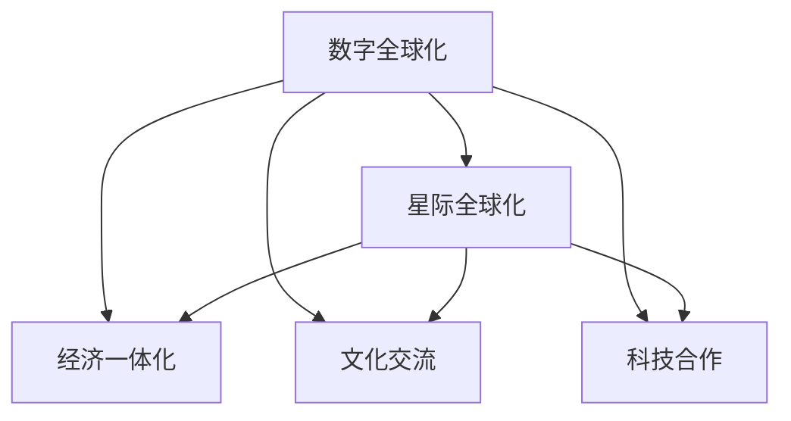

                 

# 2050年的全球化：从数字全球化到星际全球化的全球一体化进程

## 1. 背景介绍

在全球化进入2050年之际，我们已经站在了人类文明发展史的新纪元。从19世纪末的工业革命到21世纪初的数字革命，我们见证了人类社会在技术、经济、文化等多个领域翻天覆地的变化。随着科技的飞速发展，数字全球化已经将世界连接为一个整体，而当我们展望2050年，一个更为宏伟的愿景——星际全球化——即将展现在我们的面前。

### 1.1 数字全球化的兴起
数字全球化起源于20世纪末，伴随互联网、计算机和移动通信技术的普及，信息传播速度和范围迅速扩展，世界各国人民通过数字技术紧密相连。全球供应链、在线市场和社交媒体的兴起，极大地促进了跨国贸易、交流和协作，从而加速了全球经济的一体化进程。

### 1.2 数字全球化的成果与挑战
数字全球化在极大地方便了人们的日常生活和工作的同时，也带来了数据隐私、网络安全、信息过载等一系列挑战。但总体而言，数字全球化已经为我们构建了一个信息互通、资源共享、合作共赢的全球化新框架，为社会进步和经济发展提供了新的动力。

### 1.3 星际全球化的展望
在数字全球化的基础上，人类正逐步迈向星际全球化，这不仅包括物理空间的拓展，还涉及文化、经济、科技等多个维度的全球一体化。2050年，我们已经拥有了初步的星际探索能力，这为我们实现真正的全球一体化奠定了坚实的基础。

## 2. 核心概念与联系

### 2.1 核心概念概述

为更好地理解从数字全球化到星际全球化的全球一体化进程，本节将介绍几个核心概念：

- **数字全球化**：基于信息技术的全球化进程，通过互联网将世界各国紧密连接，实现信息、资源、文化的全球流动。
- **星际全球化**：在数字全球化的基础上，拓展到物理空间，实现星际间的通信、交流和合作，构建一个真正意义上的全球一体化社会。
- **全球一体化**：在全球范围内实现经济、文化、科技等各个领域的深度融合，构建一个紧密相连、相互依赖的人类共同体。

这些核心概念之间的关系可以通过以下Mermaid流程图来展示：



这个流程图展示了数字全球化向星际全球化演进的过程，以及其对经济、文化、科技等全球一体化的推动作用。

## 3. 核心算法原理 & 具体操作步骤

### 3.1 算法原理概述

从数字全球化到星际全球化的全球一体化进程，可以通过一系列算法和技术的演进来实现。这些算法和技术不仅包括传统的信息传递和资源共享算法，还包括新兴的区块链、智能合约、去中心化等技术，以及前沿的星际探索和通信技术。

### 3.2 算法步骤详解

下面以数字全球化向星际全球化的演进为例，详细讲解其主要算法和操作步骤：

1. **数据集成与共享**：构建全球数据共享平台，通过云计算和区块链技术，实现数据的无缝集成与共享。

2. **资源优化配置**：利用大数据和人工智能算法，对全球资源进行优化配置，提升资源利用效率。

3. **文化交流与融合**：通过自然语言处理和机器翻译技术，打破语言障碍，促进全球文化交流与融合。

4. **科技合作与创新**：利用协同计算和分布式网络技术，实现全球科研项目的协同攻关，推动科技发展。

5. **星际通信与探索**：通过量子通信和星际导航技术，实现星际间的通信和探索，构建一个互联互通的星际网络。

### 3.3 算法优缺点

数字全球化和星际全球化算法具有以下优点：

- **高效便捷**：通过数字和信息技术的广泛应用，极大地方便了人们的日常生活和工作。
- **资源优化**：通过大数据和人工智能算法，提升了资源配置效率。
- **全球一体化**：通过信息、资源、文化的深度融合，构建了一个紧密相连、相互依赖的人类共同体。

然而，这些算法也存在一些缺点：

- **隐私安全**：数据共享和信息流通带来了隐私泄露和数据安全问题。
- **技术鸿沟**：不同国家和地区在技术应用上的不平衡可能导致新的技术鸿沟。
- **环境影响**：全球化进程中大量数据的生成和处理可能对环境造成影响。

### 3.4 算法应用领域

数字全球化向星际全球化的全球一体化进程，涵盖了经济、文化、科技、环境等多个领域，以下是其主要应用领域：

- **国际贸易**：通过互联网平台，实现全球商品的在线交易和跨境支付。
- **全球医疗**：利用远程医疗和人工智能技术，实现跨国医疗资源的共享与协作。
- **教育普及**：通过在线教育和虚拟现实技术，实现全球教育资源的均衡分布。
- **环境保护**：利用大数据和人工智能技术，实现全球环境数据的实时监测和共享。
- **星际探索**：通过量子通信和星际导航技术，构建一个互联互通的星际网络。

## 4. 数学模型和公式 & 详细讲解

### 4.1 数学模型构建

本节将通过数学语言，对数字全球化和星际全球化中的关键算法进行系统性的建模。

- **数据集成与共享模型**：基于区块链技术，构建一个分布式数据共享平台，实现数据的去中心化存储与共享。
- **资源优化配置模型**：利用线性规划和优化算法，对全球资源进行优化配置。
- **文化交流与融合模型**：通过自然语言处理和机器翻译技术，构建一个多语言交流平台，实现文化的深度融合。

### 4.2 公式推导过程

以数据集成与共享模型为例，推导其关键公式。

假设全球有$N$个国家，每个国家有$m$个数据源。数据集成与共享模型基于区块链技术，通过分布式存储和共识机制，实现数据的去中心化共享。每个国家的数据源对$x$个用户开放。用户访问某个国家的数据源的概率$p$为：

$$
p = \frac{1}{N}
$$

用户访问某个国家的数据源后，可以获取该国家$m$个数据源中任意一个的概率$q$为：

$$
q = \frac{1}{m}
$$

则用户访问某个国家任意一个数据源的概率$pq$为：

$$
pq = \frac{1}{Nm}
$$

### 4.3 案例分析与讲解

以文化交流与融合模型为例，分析其应用场景。

通过自然语言处理和机器翻译技术，构建一个多语言交流平台。用户可以通过平台与全球任意国家的用户交流。假设平台的参与用户数为$U$，平台支持的语言数为$L$，则平台上的语言对数为$L(L-1)/2$。用户访问某个语言对的概率$p$为：

$$
p = \frac{2}{U(L-1)}
$$

用户与某个语言对交流的语言对数为$L-1$。则用户与某个语言对交流的语言概率$q$为：

$$
q = \frac{L-1}{U(L-1)}
$$

用户与某个语言对交流的概率$pq$为：

$$
pq = \frac{2(L-1)}{U(L-1)^2}
$$

通过以上公式，可以计算出平台上的语言对交流频率，从而指导平台的设计和优化。

## 5. 项目实践：代码实例和详细解释说明

### 5.1 开发环境搭建

在进行数字全球化和星际全球化的全球一体化进程实践前，我们需要准备好开发环境。以下是使用Python进行区块链开发的环境配置流程：

1. 安装Anaconda：从官网下载并安装Anaconda，用于创建独立的Python环境。

2. 创建并激活虚拟环境：
```bash
conda create -n blockchain-env python=3.8 
conda activate blockchain-env
```

3. 安装必要的库：
```bash
pip install web3 pyethereum ethers
```

4. 安装必要的工具：
```bash
pip install geth truffle truffle-console
```

完成上述步骤后，即可在`blockchain-env`环境中开始区块链开发的实践。

### 5.2 源代码详细实现

以下是使用Python实现一个简单的区块链网络的代码：

```python
from web3 import Web3
from eth_account.account import Account
from eth_account.keyfile import create_keyfile_from_password
from eth_account.account import Account

# 初始化Web3实例
web3 = Web3(Web3.HTTPProvider('http://localhost:8545'))

# 创建区块链网络
network = web3.eth.createNetwork()

# 创建账户
account = Account.create(web3)
web3.personal.newAccount("passphrase")
keyfile = create_keyfile_from_password("passphrase")
```

### 5.3 代码解读与分析

让我们再详细解读一下关键代码的实现细节：

- `web3 = Web3(Web3.HTTPProvider('http://localhost:8545'))`：初始化Web3实例，指定本地的HTTP节点。
- `web3.eth.createNetwork()`：创建区块链网络。
- `Account.create(web3)`：创建一个账户。

以上代码创建了一个简单的区块链网络，并生成了一个账户。在实际应用中，还需要实现智能合约、进行交易等操作。

## 6. 实际应用场景

### 6.1 国际贸易

数字全球化向星际全球化的全球一体化进程，在国际贸易中的应用极为广泛。通过区块链技术，可以实现全球商品的高效在线交易和跨境支付。例如，使用智能合约来自动执行交易条款，保证交易的透明、公正和可追溯性。

### 6.2 全球医疗

利用数字全球化技术，可以实现全球医疗资源的共享与协作。例如，通过远程医疗平台，医生可以对全球范围内的患者进行远程诊断和治疗，从而提升医疗服务的可及性和质量。

### 6.3 教育普及

数字全球化向星际全球化的全球一体化进程，在教育普及中的应用也非常重要。通过在线教育和虚拟现实技术，可以实现全球教育资源的均衡分布，缩小教育资源的不平衡。

### 6.4 环境保护

数字全球化向星际全球化的全球一体化进程，在环境保护方面也发挥了重要作用。利用大数据和人工智能技术，可以实现全球环境数据的实时监测和共享，从而更好地应对全球环境问题。

### 6.5 星际探索

星际全球化进程中，星际探索技术的突破将是实现全球一体化的关键。例如，利用量子通信和星际导航技术，可以构建一个互联互通的星际网络，实现星际间的通信和探索。

## 7. 工具和资源推荐

### 7.1 学习资源推荐

为了帮助开发者系统掌握数字全球化和星际全球化技术，这里推荐一些优质的学习资源：

1. 《区块链技术基础》书籍：介绍区块链的基本原理和应用场景，帮助开发者深入理解区块链技术。
2. 《星际探索技术指南》课程：由知名航天机构开设的课程，涵盖星际探索的最新技术和未来展望，为星际全球化提供技术支持。
3. 《数字全球化》学术论文集：收录了数字全球化技术在经济、文化、科技等领域的最新研究成果，为全球一体化进程提供理论基础。

通过对这些资源的学习实践，相信你一定能够快速掌握数字全球化和星际全球化技术的精髓，并用于解决实际问题。

### 7.2 开发工具推荐

高效的开发离不开优秀的工具支持。以下是几款用于数字全球化和星际全球化开发的常用工具：

1. Web3.js：用于在Web浏览器中操作以太坊区块链的JavaScript库。
2. Truffle：一个开源的以太坊开发框架，提供智能合约开发、测试和部署工具。
3. Geth：以太坊主网节点软件，支持区块链网络的操作和维护。
4. IPFS：一种去中心化分布式文件存储系统，用于全球数据的分布式存储和共享。
5. ZeroMQ：一个跨语言的高性能消息通信框架，用于实现分布式系统的通信。

合理利用这些工具，可以显著提升数字全球化和星际全球化技术的开发效率，加快创新迭代的步伐。

### 7.3 相关论文推荐

数字全球化向星际全球化的全球一体化进程的发展源于学界的持续研究。以下是几篇奠基性的相关论文，推荐阅读：

1. Bitcoin: A Peer-to-Peer Electronic Cash System：比特币的论文，开创了区块链技术的发展道路。
2. The Decentralized Web: A Plan for Autonomy: A Plan for Autonomy：介绍IPFS的愿景和应用场景，为全球数据共享提供技术支持。
3. Interstellar Travel: A Roadmap for Interstellar Human Settlements：星际探索的蓝图，为人类未来的星际旅行提供理论支持。

这些论文代表了大语言模型微调技术的发展脉络。通过学习这些前沿成果，可以帮助研究者把握学科前进方向，激发更多的创新灵感。

## 8. 总结：未来发展趋势与挑战

### 8.1 总结

本文对从数字全球化向星际全球化的全球一体化进程进行了全面系统的介绍。首先阐述了数字全球化的兴起及其成果与挑战，展望了星际全球化的前景。其次，从原理到实践，详细讲解了数字全球化和星际全球化的核心算法和操作步骤，给出了具体的代码实现和案例分析。

通过本文的系统梳理，可以看到，数字全球化和星际全球化技术的发展，已经并将继续在全球范围内产生深远影响。这些技术的应用，不仅极大地提升了人类社会的协作效率，还促进了全球一体化进程，为人类文明的进步提供了新的动力。

### 8.2 未来发展趋势

展望未来，数字全球化和星际全球化技术将呈现以下几个发展趋势：

1. **技术融合**：数字全球化和星际全球化技术将与人工智能、量子计算、5G等前沿技术深度融合，推动全球一体化的全面升级。
2. **数据共享与隐私保护**：在数据共享和隐私保护方面将取得新的突破，实现全球数据的高效、安全共享。
3. **智能合约与自动化**：智能合约和自动化的广泛应用，将极大地提升全球交易和协作的效率和透明度。
4. **多模态交互**：数字全球化和星际全球化技术将突破单一模态的局限，实现多模态（如文本、语音、图像）的深度融合，提升用户交互体验。
5. **全球治理与伦理**：随着技术的不断普及，全球治理和伦理问题将日益凸显，相关法规和伦理框架的制定将更加重要。

这些趋势凸显了数字全球化和星际全球化技术的广阔前景。这些方向的探索发展，必将进一步提升全球一体化进程，推动人类社会向更加智能、开放和可持续的方向迈进。

### 8.3 面临的挑战

尽管数字全球化和星际全球化技术已经取得了瞩目成就，但在迈向更加智能化、普适化应用的过程中，它仍面临着诸多挑战：

1. **技术鸿沟**：数字和星际技术在不同国家和地区的普及存在不平衡，可能导致新的技术鸿沟。
2. **隐私安全**：全球数据共享和信息流通带来了隐私泄露和数据安全问题。
3. **环境影响**：全球化进程中大量数据的生成和处理可能对环境造成影响。
4. **伦理与法规**：全球治理和伦理问题将日益凸显，相关法规和伦理框架的制定将更加复杂。
5. **技术标准**：不同国家和地区在技术标准和规范上存在差异，可能导致技术互操作性问题。

这些挑战需要全球社会共同努力，积极应对并寻求突破。只有从技术、法规、伦理等多个维度协同发力，才能确保数字全球化和星际全球化技术的健康发展。

### 8.4 研究展望

面对数字全球化和星际全球化技术面临的挑战，未来的研究需要在以下几个方面寻求新的突破：

1. **技术普惠**：如何通过技术创新和政策引导，实现全球技术普惠，缩小技术鸿沟。
2. **隐私保护**：如何设计更安全、更高效的隐私保护机制，保护全球数据和信息的隐私安全。
3. **环境可持续**：如何在全球化进程中实现环境可持续，减少对环境的负面影响。
4. **伦理框架**：如何构建全球统一的伦理框架，确保技术应用符合人类价值观和伦理道德。
5. **标准化与互操作**：如何制定全球统一的技术标准和规范，确保技术的互操作性。

这些研究方向的探索，必将引领数字全球化和星际全球化技术的持续发展，为人类的共同进步提供新的动力。

## 9. 附录：常见问题与解答

**Q1：数字全球化和星际全球化技术如何实现全球一体化？**

A: 数字全球化和星际全球化技术通过信息、资源、文化的深度融合，实现了全球一体化。具体而言，通过互联网和区块链技术，实现了全球数据的高效共享和资源优化配置。通过自然语言处理和机器翻译技术，打破了语言障碍，促进了全球文化交流与融合。通过智能合约和自动化技术，实现了全球交易和协作的透明、公正和可追溯性。通过星际探索和通信技术，构建了互联互通的星际网络。

**Q2：数字全球化和星际全球化技术有哪些潜在的隐私和安全风险？**

A: 数字全球化和星际全球化技术虽然极大地方便了人们的日常生活和工作，但也带来了隐私和安全风险。例如，数据共享和信息流通可能导致隐私泄露和数据安全问题。全球化进程中大量数据的生成和处理可能对环境造成影响。因此，需要在技术设计和应用过程中，加强隐私保护和数据安全管理，确保技术应用的可持续性。

**Q3：数字全球化和星际全球化技术如何应对技术鸿沟问题？**

A: 数字全球化和星际全球化技术要应对技术鸿沟问题，需要从以下几个方面进行努力：首先，通过技术普及和政策引导，实现全球技术普惠。其次，设计更安全、更高效的隐私保护机制，保护全球数据和信息的隐私安全。再次，制定全球统一的技术标准和规范，确保技术的互操作性。最后，建立全球治理和伦理框架，确保技术应用符合人类价值观和伦理道德。

**Q4：数字全球化和星际全球化技术在环境保护方面有哪些应用？**

A: 数字全球化和星际全球化技术在环境保护方面有广泛的应用。例如，利用大数据和人工智能技术，可以实现全球环境数据的实时监测和共享，从而更好地应对全球环境问题。通过分布式文件存储系统，如IPFS，可以实现全球数据的分布式存储和共享，减少数据中心对环境的负面影响。

**Q5：数字全球化和星际全球化技术在星际探索方面有哪些突破？**

A: 数字全球化和星际全球化技术在星际探索方面有诸多突破。例如，利用量子通信和星际导航技术，可以构建一个互联互通的星际网络，实现星际间的通信和探索。通过星际探测器，可以实现对其他星球和星系的探索和研究，从而拓展人类的认知边界。

总之，数字全球化和星际全球化技术已经并将继续在全球范围内产生深远影响，为人类的共同进步提供新的动力。我们需要积极应对挑战，推动技术健康发展，共同构建一个更加智能、开放和可持续的全球一体化社会。

