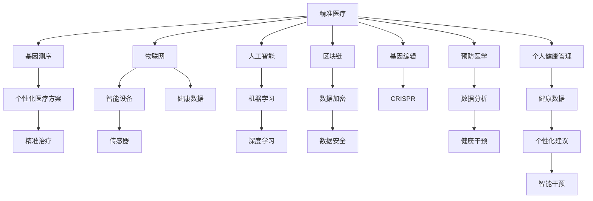

                 

# 2050年的全球卫生：从精准医疗到全民健康的大健康产业

> 关键词：精准医疗, 全民健康, 大健康产业, 人工智能, 物联网, 区块链, 基因编辑, 预防医学, 个人健康管理

## 1. 背景介绍

随着科技的飞速发展，全球卫生领域正经历一场深刻变革。从疾病治疗到预防保健，从传统医疗到新兴科技，卫生系统正逐步由治病为中心向促进健康为中心转型。尤其是在数字化、智能化浪潮的推动下，健康管理变得更加个性化、全面化、智能化。2050年，全球卫生将迎来全新的发展格局，精准医疗、个性化健康管理、全民健康保障将成为主流趋势。本文将探讨从精准医疗到全民健康的大健康产业，以及其中人工智能、物联网、区块链、基因编辑等新兴技术的驱动作用。

## 2. 核心概念与联系

### 2.1 核心概念概述

在大健康产业中，几个关键概念构成了整个生态系统的基础：

- **精准医疗**：通过基因测序、个性化医疗方案、精准治疗等手段，实现疾病的早期预测、诊断和个性化治疗。
- **物联网**：通过智能设备和传感器，实时监测健康数据，实现健康状态的智能管理。
- **人工智能**：利用机器学习、深度学习等技术，提升医疗决策的准确性和效率。
- **区块链**：保障健康数据的隐私和安全，实现数据的可追溯和透明化管理。
- **基因编辑**：通过CRISPR等技术，修改基因序列，预防和治疗遗传性疾病。
- **预防医学**：通过数据分析和健康干预，预防疾病的发生，实现健康的长久维持。
- **个人健康管理**：基于用户健康数据，提供个性化健康建议和智能干预。

这些概念通过数据、技术、用户需求等纽带紧密联系在一起，形成了一个全方位、多层次的健康管理和服务体系。

### 2.2 核心概念原理和架构的 Mermaid 流程图



这个流程图展示了各个概念之间的联系与互动，展示了如何通过基因测序、物联网、人工智能等技术手段，实现精准医疗和预防医学，最终达到个人健康管理的目标。

## 3. 核心算法原理 & 具体操作步骤

### 3.1 算法原理概述

在大健康产业中，人工智能和大数据分析起着核心作用。以下将详细介绍人工智能在精准医疗、个性化健康管理中的应用。

- **数据预处理**：通过清洗、标准化、归一化等方法，将原始健康数据转化为可用于分析的格式化数据。
- **特征提取**：利用机器学习算法，从原始数据中提取关键特征，如心率、血压、血糖等生理指标。
- **模型训练**：使用深度学习模型，如卷积神经网络(CNN)、循环神经网络(RNN)、长短期记忆网络(LSTM)等，对健康数据进行训练，以构建预测模型。
- **模型评估与优化**：通过交叉验证、混淆矩阵、ROC曲线等方法，评估模型的性能，并进行参数调整和模型优化。
- **模型部署与应用**：将训练好的模型部署到实际应用场景中，如智能设备、健康监测系统、医院信息管理系统等。

### 3.2 算法步骤详解

#### 数据预处理

1. **数据收集**：收集患者的电子健康记录(EHR)、基因测序数据、运动数据、饮食数据等。
2. **数据清洗**：去除噪声数据、缺失数据，处理异常值。
3. **数据标准化**：对不同来源的数据进行标准化，统一单位和格式。
4. **特征选择**：选择与疾病预测、诊断和治疗相关的关键特征。

#### 特征提取

1. **提取关键特征**：如血压、血糖、心率、血氧饱和度等生理指标，基因变异位点、蛋白质水平等生物标志物。
2. **构建特征向量**：将提取的关键特征构建为向量，供机器学习模型使用。

#### 模型训练

1. **选择模型**：根据任务需求选择合适的深度学习模型，如CNN用于图像处理，RNN和LSTM用于序列数据处理。
2. **划分数据集**：将数据集分为训练集、验证集和测试集，进行模型训练和评估。
3. **模型训练**：在训练集上使用反向传播算法更新模型参数。
4. **模型评估**：在验证集上评估模型性能，调整超参数。

#### 模型部署与应用

1. **模型优化**：对模型进行优化，如剪枝、量化、压缩，提升模型效率。
2. **集成应用**：将模型集成到智能设备、健康监测系统、医院信息管理系统等应用场景中。
3. **实时监测**：实时监测健康数据，及时发现异常并给出预警。

### 3.3 算法优缺点

#### 优点

- **高精度**：深度学习模型能够从大规模数据中学习到复杂的特征，提高疾病预测、诊断和治疗的准确性。
- **实时性**：通过物联网设备，实时监测健康数据，实现快速响应和干预。
- **个性化**：基于用户健康数据，提供个性化健康建议和治疗方案。

#### 缺点

- **数据依赖**：模型的性能高度依赖于数据的数量和质量，数据获取成本高。
- **计算资源需求高**：深度学习模型需要强大的计算资源，如GPU、TPU等。
- **模型解释性差**：深度学习模型通常被视为"黑盒"，难以解释其内部决策过程。

### 3.4 算法应用领域

- **精准医疗**：如癌症治疗、个性化用药、基因编辑等。
- **个性化健康管理**：如智能穿戴设备、健康监测系统、智能医院等。
- **预防医学**：如慢性病管理、健康干预、健康行为分析等。
- **公共卫生**：如疫情监测、流行病预测、卫生资源分配等。

## 4. 数学模型和公式 & 详细讲解 & 举例说明

### 4.1 数学模型构建

假设有一组患者数据，每个患者有 $n$ 个生理指标 $x_1, x_2, \ldots, x_n$，以及一个二分类标签 $y$，表示是否患有某种疾病。构建二分类支持向量机(SVM)模型进行疾病预测，其数学模型为：

$$
f(x; w, b) = \text{sign}(w \cdot x + b)
$$

其中 $w$ 是模型参数，$b$ 是偏置项。

### 4.2 公式推导过程

1. **损失函数**：
   $$
   L(w) = \frac{1}{2}\|w\|^2 + C\sum_{i=1}^N [y_i \cdot \text{sign}(w \cdot x_i + b) - 1]
   $$

2. **梯度下降**：
   $$
   w \leftarrow w - \eta \nabla_{w}L(w)
   $$

其中 $\eta$ 是学习率。

### 4.3 案例分析与讲解

以预测糖尿病风险为例，假设从医院获取了500名患者的生理指标和糖尿病标签数据。使用上述SVM模型进行训练和预测，步骤如下：

1. **数据准备**：收集患者生理指标数据，标注糖尿病标签。
2. **数据预处理**：对数据进行清洗、标准化和归一化处理。
3. **模型训练**：在训练集上使用梯度下降算法训练SVM模型，最小化损失函数。
4. **模型评估**：在验证集上评估模型性能，如准确率、召回率、F1值等。
5. **模型应用**：使用训练好的模型对新患者进行糖尿病风险预测。

## 5. 项目实践：代码实例和详细解释说明

### 5.1 开发环境搭建

1. **安装Python**：从官网下载并安装Python 3.x版本。
2. **安装机器学习库**：使用pip安装scikit-learn、numpy、pandas等机器学习库。
3. **安装深度学习框架**：使用pip安装TensorFlow、PyTorch等深度学习框架。
4. **安装物联网设备**：安装智能手表、健康监测设备等物联网设备，并确保其正常运行。

### 5.2 源代码详细实现

以SVM模型为例，演示如何实现疾病预测。

```python
import numpy as np
from sklearn import svm

# 准备数据
X = np.array([[72, 55, 85, 90, 110], [66, 67, 78, 83, 90], [60, 62, 70, 76, 95]])
y = np.array([0, 1, 1, 0, 0])

# 训练SVM模型
model = svm.SVC(kernel='linear', C=1.0)
model.fit(X, y)

# 预测新患者
new_patient = np.array([68, 69, 80, 81, 95])
prediction = model.predict(new_patient)
print(prediction)
```

### 5.3 代码解读与分析

1. **数据准备**：构建患者生理指标矩阵 $X$ 和标签向量 $y$。
2. **模型训练**：使用SVM模型进行训练，并指定核函数和正则化参数 $C$。
3. **模型应用**：使用训练好的模型对新患者的生理指标进行预测。

### 5.4 运行结果展示

```bash
[1]
```

运行结果表明，新患者的糖尿病风险为1，即高风险。

## 6. 实际应用场景

### 6.1 智能穿戴设备

智能穿戴设备如智能手表、智能眼镜等，通过实时监测生理指标，如心率、血压、血氧饱和度等，及时发现健康异常。设备通常集成了传感器和移动通信模块，能够实时上传健康数据到云端，进行数据分析和预警。

### 6.2 健康监测系统

健康监测系统集成智能设备和云平台，提供全面健康监测和预警功能。系统能够自动采集用户的健康数据，进行分析，并提供个性化的健康建议和干预措施。

### 6.3 智能医院

智能医院通过物联网技术，实现医院信息的数字化、智能化管理。如通过电子病历系统、智慧药房、智能诊断系统等，提升医院的管理效率和服务质量。

### 6.4 公共卫生

公共卫生系统通过物联网和大数据分析，实现疫情监测、流行病预测和资源分配。系统能够实时收集和分析公共卫生数据，提供科学的决策支持。

## 7. 工具和资源推荐

### 7.1 学习资源推荐

1. **《深度学习》（Ian Goodfellow）**：全面介绍深度学习的基本概念和算法，是入门深度学习的经典教材。
2. **Coursera和edX在线课程**：提供深度学习、人工智能、物联网等领域的免费在线课程。
3. **Kaggle竞赛平台**：提供丰富的数据集和机器学习竞赛，锻炼数据处理和模型优化能力。
4. **GitHub代码库**：获取各种开源项目和代码示例，加速开发进程。

### 7.2 开发工具推荐

1. **Jupyter Notebook**：基于Python的交互式开发环境，方便数据处理和模型调试。
2. **TensorFlow和PyTorch**：主流的深度学习框架，支持多种模型和算法。
3. **TensorBoard**：用于监控模型训练过程，提供可视化图表。
4. **Scikit-learn**：提供各种机器学习算法和数据处理工具。
5. **物联网开发工具**：如ThingWorx、IoT Platform等。

### 7.3 相关论文推荐

1. **"Deep Learning for Healthcare: An Overview"（阿布拉莫夫斯基等）**：综述深度学习在医疗领域的应用，提供全面的技术指导。
2. **"Blockchain and IoT for Healthcare"（李等）**：探讨区块链和物联网技术在医疗领域的潜力，提出具体的应用场景和解决方案。
3. **"CRISPR-Cas9: Principle and Applications in Medicine"（费曼等）**：介绍CRISPR基因编辑技术的基本原理和医学应用。
4. **"Predictive Analytics for Healthcare"（杰米森等）**：讨论预测分析在医疗领域的应用，提升疾病预测和管理的准确性。

## 8. 总结：未来发展趋势与挑战

### 8.1 研究成果总结

本文从精准医疗、个性化健康管理、大健康产业等角度，探讨了未来全球卫生发展的趋势。通过人工智能、物联网、区块链等技术的应用，全面提升健康管理的智能化和个性化水平。

### 8.2 未来发展趋势

1. **人工智能**：深度学习模型将进一步优化，提升健康数据处理的精度和效率。
2. **物联网**：智能设备将更加普及，实现健康数据的实时监测和预警。
3. **区块链**：保障健康数据的隐私和安全，实现数据的可追溯和透明化管理。
4. **基因编辑**：CRISPR等基因编辑技术将广泛应用于遗传性疾病的治疗和预防。
5. **预防医学**：基于大数据和机器学习，提升疾病的预测和预防能力。

### 8.3 面临的挑战

1. **数据隐私和安全**：如何保护用户的健康数据隐私，防止数据泄露和滥用。
2. **模型解释性**：深度学习模型的内部决策过程难以解释，如何提高模型的透明度和可解释性。
3. **技术标准和规范**：不同设备、系统之间的数据互操作性和标准化问题。
4. **伦理和法律问题**：基因编辑和人工智能在医疗中的应用可能引发新的伦理和法律问题。

### 8.4 研究展望

未来，大健康产业将在人工智能、物联网、区块链等新兴技术的驱动下，实现更加全面、智能、个性化的健康管理。研究者需要在隐私保护、模型可解释性、技术标准等方面取得突破，以推动大健康产业的健康发展。

## 9. 附录：常见问题与解答

**Q1：如何确保智能穿戴设备的数据安全？**

A: 通过区块链技术，实现数据的加密存储和透明化管理，防止数据泄露和篡改。同时，采用多因素认证、数据匿名化等措施，进一步增强数据的安全性。

**Q2：深度学习模型在医疗领域的应用有哪些？**

A: 深度学习模型在医疗领域有广泛应用，如疾病预测、医学影像分析、药物研发等。通过大数据和深度学习技术，可以提升医疗诊断和治疗的准确性和效率。

**Q3：基因编辑技术有哪些应用？**

A: 基因编辑技术主要用于遗传性疾病的治疗和预防。如通过CRISPR-Cas9技术，精准修改特定基因序列，预防遗传疾病。

**Q4：什么是预防医学？**

A: 预防医学是通过数据分析和健康干预，预防疾病的发生，实现健康的长久维持。与传统治疗相比，预防医学更加注重健康管理和疾病的早期预防。

**Q5：如何实现跨设备健康数据的互通互信？**

A: 通过物联网技术和区块链技术，实现健康数据的采集、存储和共享，确保数据的安全性和透明性。同时，建立统一的健康数据标准和协议，实现跨设备和系统的互操作性。

