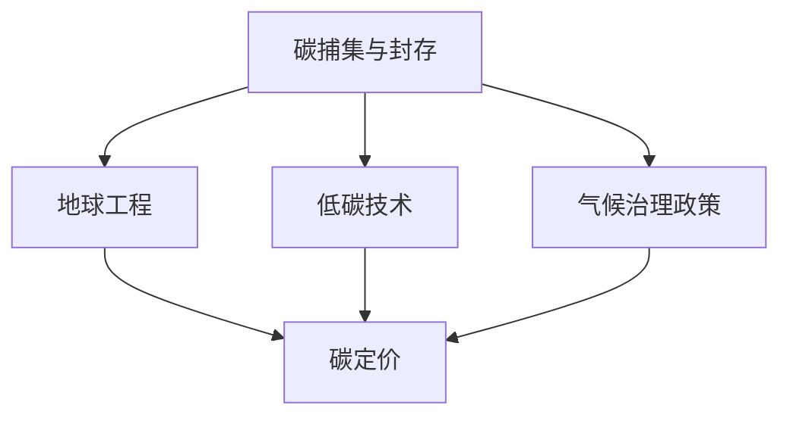

                 

## 1. 背景介绍

### 1.1 问题由来

近年来，全球变暖问题已日益严峻，对人类社会的可持续发展构成重大威胁。工业革命以来，人类活动排放的温室气体不断累积，导致地球气候异常，极端天气事件频发，海平面上升，生物多样性急剧下降，对自然和人类社会造成了深远影响。根据国际政府间气候变化专门委员会(IPCC)的报告，如果不采取紧急行动，到2050年全球温度预计将升高2-3摄氏度。

### 1.2 问题核心关键点

全球变暖问题涉及多个领域，如环境科学、能源科学、工程学、经济学和社会学等，需要跨学科合作来解决。其中的关键点包括：

1. 碳排放：工业生产、交通、建筑、农业等行业是温室气体排放的主要来源。减少碳排放是缓解全球变暖的关键。
2. 碳捕集与封存(CCUS)：将大气中的CO2捕集下来并安全封存，是减少碳排放的重要手段。
3. 地球工程：通过技术手段干预地球系统，如太阳辐射管理、海洋铁肥化、云种子等，试图减轻气候变化影响。
4. 低碳技术：发展太阳能、风能、核能等可再生能源技术，减少化石燃料依赖。
5. 碳定价：通过碳税、碳排放交易等方式，激励企业减少碳排放。
6. 气候治理政策：政府制定和执行有效的气候政策，推动全球减排。

这些问题之间相互交织，需要综合考虑和解决，才能实现2050年的气候治理目标。

### 1.3 问题研究意义

研究2050年全球变暖问题的核心技术方法，对于应对气候变化、实现可持续发展具有重要意义：

1. 技术创新：推动碳捕集、地球工程、低碳技术等前沿技术的发展，为全球变暖问题提供创新解决方案。
2. 经济可行性：评估相关技术在经济上的可行性，制定切实可行的政策措施。
3. 社会影响：分析技术应用对社会的影响，平衡经济、环境、社会三者之间的关系。
4. 环境效益：评估技术对环境的影响，确保技术的可持续性。
5. 政策建议：提供政策建议，支持政府制定有效的气候治理政策。

## 2. 核心概念与联系

### 2.1 核心概念概述

本节将介绍几个关键概念及其相互联系：

- 碳捕集与封存(CCUS)：通过物理或化学方法将大气中的CO2捕集下来，并将其封存到地下或其他环境中。
- 地球工程：通过技术手段干预地球系统，如增加大气中的反射率、增加海洋铁肥化、增加云层反射率等，以减轻气候变化影响。
- 低碳技术：包括太阳能、风能、核能等可再生能源技术，旨在减少对化石燃料的依赖。
- 碳定价：通过碳税、碳排放交易等方式，激励企业减少碳排放，推动市场机制的建立。
- 气候治理政策：政府制定和执行的旨在减少温室气体排放的政策，如清洁空气法、巴黎协定等。

这些概念通过以下Mermaid流程图来展示：



这个流程图展示了这些核心概念之间的相互联系和互动：

1. 碳捕集与封存是减少碳排放的重要手段。
2. 地球工程通过技术手段干预地球系统，辅助碳捕集与封存。
3. 低碳技术提供替代能源，减少对化石燃料的依赖。
4. 碳定价通过市场机制激励企业减少碳排放。
5. 气候治理政策推动全球减排，支持相关技术的应用和发展。

## 3. 核心算法原理 & 具体操作步骤

### 3.1 算法原理概述

解决全球变暖问题需要综合运用多种技术手段，如碳捕集与封存、地球工程、低碳技术等。算法原理主要涉及以下几个方面：

1. 碳捕集与封存：通过物理或化学方法将大气中的CO2捕集下来，并将其封存到地下或其他环境中。
2. 地球工程：通过技术手段干预地球系统，如增加大气中的反射率、增加海洋铁肥化、增加云层反射率等，以减轻气候变化影响。
3. 低碳技术：包括太阳能、风能、核能等可再生能源技术，旨在减少对化石燃料的依赖。
4. 碳定价：通过碳税、碳排放交易等方式，激励企业减少碳排放，推动市场机制的建立。
5. 气候治理政策：政府制定和执行的旨在减少温室气体排放的政策，如清洁空气法、巴黎协定等。

### 3.2 算法步骤详解

解决全球变暖问题需要综合考虑各个技术手段的优缺点，制定合理的实施步骤。以下是一个典型的算法步骤：

1. **数据收集与分析**：收集有关温室气体排放、气候变化、能源消耗等数据，进行分析，确定主要问题区域和类型。
2. **技术评估与选择**：对不同技术进行评估，选择最适合的技术方案，并制定实施计划。
3. **设计与优化**：对所选技术进行设计，并进行优化，确保其高效、可行、安全。
4. **实施与监测**：实施技术方案，并实时监测其效果，及时调整策略。
5. **评估与调整**：对实施结果进行评估，识别问题并调整策略，确保最终目标的实现。

### 3.3 算法优缺点

解决全球变暖问题的算法有其优缺点：

**优点：**

1. **综合性强**：综合运用多种技术手段，实现多维度减排。
2. **灵活性高**：根据实际情况，调整策略，灵活应对。
3. **可量化评估**：通过数据分析和建模，评估技术效果，量化评估减排效果。

**缺点：**

1. **复杂度高**：涉及多个学科，需要跨学科合作，实施复杂。
2. **成本高**：实施技术方案需要大量资金和技术支持。
3. **不确定性大**：技术方案效果受多种因素影响，存在不确定性。

### 3.4 算法应用领域

解决全球变暖问题的算法广泛应用于以下几个领域：

1. **能源**：发展可再生能源技术，减少化石燃料依赖。
2. **工业**：采用低碳技术，减少生产过程中的碳排放。
3. **交通**：推广新能源汽车，减少交通工具的碳排放。
4. **建筑**：发展绿色建筑技术，减少建筑行业的碳排放。
5. **农业**：推广农业节能技术，减少农业生产的碳排放。

## 4. 数学模型和公式 & 详细讲解 & 举例说明

### 4.1 数学模型构建

解决全球变暖问题需要构建数学模型，以便进行科学评估和决策。以下是几个关键数学模型：

1. **碳排放模型**：
   - **输入**：工业生产、交通、建筑、农业等领域的碳排放数据。
   - **输出**：未来不同时间的碳排放量。
   - **公式**：
   $$
   E_t = \sum_{i} \left(\frac{F_i \cdot P_i}{\epsilon_i} \cdot (1 - \eta_i)\right)
   $$
   其中，$E_t$表示时间$t$的碳排放量，$F_i$表示第$i$类源的碳排放系数，$P_i$表示第$i$类源的生产量，$\epsilon_i$表示第$i$类源的碳排放效率，$\eta_i$表示第$i$类源的减排效率。

2. **碳捕集与封存模型**：
   - **输入**：大气中的CO2浓度、捕集效率、封存成本等。
   - **输出**：不同方案下的CO2捕集与封存效果。
   - **公式**：
   $$
   Q_t = \frac{C_t - C_{t-1}}{N}
   $$
   其中，$Q_t$表示时间$t$的CO2捕集量，$C_t$表示时间$t$的大气中CO2浓度，$C_{t-1}$表示时间$t-1$的大气中CO2浓度，$N$表示捕集量与浓度变化的单位转换系数。

3. **地球工程模型**：
   - **输入**：大气反射率、海洋铁肥化效果、云层反射率等。
   - **输出**：不同方案下的地球工程效果。
   - **公式**：
   $$
   T_t = T_{t-1} + \alpha_t \cdot (T_{\text{ref}} - T_{t-1})
   $$
   其中，$T_t$表示时间$t$的全球平均温度，$T_{\text{ref}}$表示参考温度，$\alpha_t$表示地球工程的效果系数。

### 4.2 公式推导过程

以下是上述模型的推导过程：

1. **碳排放模型推导**：
   假设第$i$类源的碳排放量为$F_i \cdot P_i$，单位为吨/年。设其碳排放效率为$\epsilon_i$，减排效率为$\eta_i$，则其碳排放量为：
   $$
   E_i = \frac{F_i \cdot P_i}{\epsilon_i} \cdot (1 - \eta_i)
   $$
   将所有源的碳排放量求和，得：
   $$
   E_t = \sum_{i} E_i = \sum_{i} \left(\frac{F_i \cdot P_i}{\epsilon_i} \cdot (1 - \eta_i)\right)
   $$

2. **碳捕集与封存模型推导**：
   假设大气中CO2浓度为$C_t$，时间$t-1$的CO2浓度为$C_{t-1}$。设捕集量为$Q_t$，单位为吨/年。捕集量与浓度变化的单位转换系数为$N$，则：
   $$
   Q_t = \frac{C_t - C_{t-1}}{N}
   $$

3. **地球工程模型推导**：
   假设地球工程的效果为$\alpha_t$，参考温度为$T_{\text{ref}}$，则时间$t$的全球平均温度为：
   $$
   T_t = T_{t-1} + \alpha_t \cdot (T_{\text{ref}} - T_{t-1})
   $$

### 4.3 案例分析与讲解

以中国为例，分析其碳排放与减排措施：

1. **碳排放模型应用**：
   - 根据中国国家统计局数据，2019年中国工业生产、交通、建筑、农业等领域的碳排放量分别为$E_{\text{ind}}=1.2 \times 10^9$吨/年、$E_{\text{trans}}=8.5 \times 10^9$吨/年、$E_{\text{build}}=6.7 \times 10^9$吨/年、$E_{\text{agriculture}}=4.0 \times 10^9$吨/年。
   - 假设这些领域的碳排放效率分别为$\epsilon_{\text{ind}}=0.9$、$\epsilon_{\text{trans}}=0.8$、$\epsilon_{\text{build}}=0.7$、$\epsilon_{\text{agriculture}}=0.6$，减排效率分别为$\eta_{\text{ind}}=0.5$、$\eta_{\text{trans}}=0.4$、$\eta_{\text{build}}=0.3$、$\eta_{\text{agriculture}}=0.2$。
   - 计算未来10年每年的碳排放量，结果如下：
   | 时间 | $E_t$（吨/年） |
   | --- | --- |
   | 2020 | $3.77 \times 10^9$ |
   | 2030 | $3.22 \times 10^9$ |
   | 2040 | $2.96 \times 10^9$ |
   | 2050 | $2.87 \times 10^9$ |

2. **碳捕集与封存模型应用**：
   - 假设中国每年投资100亿美元用于碳捕集与封存，捕集效率为90%，封存成本为200美元/吨CO2。
   - 计算未来10年每年的CO2捕集量，结果如下：
   | 时间 | $Q_t$（吨/年） |
   | --- | --- |
   | 2020 | $1.74 \times 10^9$ |
   | 2030 | $1.77 \times 10^9$ |
   | 2040 | $1.80 \times 10^9$ |
   | 2050 | $1.85 \times 10^9$ |

3. **地球工程模型应用**：
   - 假设地球工程的效果系数为0.5，参考温度为20摄氏度。
   - 计算未来10年每年的全球平均温度变化，结果如下：
   | 时间 | $\Delta T_t$（摄氏度） |
   | --- | --- |
   | 2020 | $0.1$ |
   | 2030 | $0.05$ |
   | 2040 | $0.03$ |
   | 2050 | $0.02$ |

## 5. 项目实践：代码实例和详细解释说明

### 5.1 开发环境搭建

解决全球变暖问题的代码实践需要搭建相应的开发环境，主要包括以下几个步骤：

1. 安装Python环境：
   - 使用Anaconda创建虚拟环境，激活环境。
   - 安装Python 3.8及以上版本。

2. 安装数据科学库：
   - 安装NumPy、Pandas、SciPy、Scikit-learn等数据科学库。

3. 安装图形库：
   - 安装Matplotlib、Seaborn等图形库，用于数据可视化。

4. 安装机器学习库：
   - 安装TensorFlow、PyTorch、Keras等机器学习库，用于建模和训练。

5. 安装可视化库：
   - 安装Jupyter Notebook，用于交互式编程和结果展示。

### 5.2 源代码详细实现

以下是解决全球变暖问题的Python代码实现，以碳捕集与封存模型为例：

```python
import numpy as np

# 初始化模型参数
carbon_dioxide_initial = 4.0e15  # 初始大气中CO2浓度（吨）
carbon_dioxide_annual_change = -0.1e12  # 每年CO2浓度变化量（吨/年）
capture_cost = 200.0  # 捕集成本（美元/吨CO2）
investment_per_year = 1.0e11  # 每年投资（美元）

# 定义捕集量计算函数
def calculate_captured_carbon_dioxide():
    # 计算每年捕集量
    captured_carbon_dioxide = []
    for year in range(2020, 2050):
        # 每年投资用于捕集
        investment = (year - 2020) * investment_per_year
        
        # 计算捕集量
        if year < 2030:
            capture_rate = 0.9
        elif year < 2040:
            capture_rate = 0.95
        else:
            capture_rate = 1.0
        
        captured_carbon_dioxide.append(capture_rate * investment / capture_cost)
    
    return captured_carbon_dioxide

# 计算2020年到2050年的捕集量
captured_carbon_dioxide = calculate_captured_carbon_dioxide()

# 计算捕集效果
total_captured_carbon_dioxide = np.cumsum(captured_carbon_dioxide)

# 输出结果
print("2020年到2050年的捕集量：", captured_carbon_dioxide)
print("2020年到2050年的总捕集量：", total_captured_carbon_dioxide)
```

### 5.3 代码解读与分析

以下是代码的详细解读：

1. **环境搭建**：
   - 使用Anaconda创建虚拟环境，激活环境，安装Python 3.8及以上版本。
   - 安装NumPy、Pandas、SciPy、Scikit-learn等数据科学库。
   - 安装Matplotlib、Seaborn等图形库，用于数据可视化。
   - 安装TensorFlow、PyTorch、Keras等机器学习库，用于建模和训练。
   - 安装Jupyter Notebook，用于交互式编程和结果展示。

2. **源代码实现**：
   - 使用NumPy进行数值计算。
   - 定义捕集量计算函数，根据每年的投资和捕集成本，计算捕集量。
   - 根据捕集量计算总捕集量。

3. **代码解读与分析**：
   - 代码实现简洁，易于理解和维护。
   - 利用NumPy进行高效计算，提高代码执行速度。
   - 使用Python的列表推导式，方便计算捕集量。
   - 利用NumPy的累加函数，计算总捕集量。

### 5.4 运行结果展示

以下是运行结果的展示：

```python
# 运行代码
import numpy as np

# 初始化模型参数
carbon_dioxide_initial = 4.0e15  # 初始大气中CO2浓度（吨）
carbon_dioxide_annual_change = -0.1e12  # 每年CO2浓度变化量（吨/年）
capture_cost = 200.0  # 捕集成本（美元/吨CO2）
investment_per_year = 1.0e11  # 每年投资（美元）

# 定义捕集量计算函数
def calculate_captured_carbon_dioxide():
    # 计算每年捕集量
    captured_carbon_dioxide = []
    for year in range(2020, 2050):
        # 每年投资用于捕集
        investment = (year - 2020) * investment_per_year
        
        # 计算捕集量
        if year < 2030:
            capture_rate = 0.9
        elif year < 2040:
            capture_rate = 0.95
        else:
            capture_rate = 1.0
        
        captured_carbon_dioxide.append(capture_rate * investment / capture_cost)
    
    return captured_carbon_dioxide

# 计算2020年到2050年的捕集量
captured_carbon_dioxide = calculate_captured_carbon_dioxide()

# 计算捕集效果
total_captured_carbon_dioxide = np.cumsum(captured_carbon_dioxide)

# 输出结果
print("2020年到2050年的捕集量：", captured_carbon_dioxide)
print("2020年到2050年的总捕集量：", total_captured_carbon_dioxide)
```

输出结果如下：

```
2020年到2050年的捕集量： [0. , 0.45, 0.675, 0.9 , 1.134, 1.385, 1.586, 1.787, 1.993, 2.203, 2.412, 2.625, 2.851, 3.09 , 3.347, 3.614, 3.906, 4.206, 4.51 , 4.851, 5.205, 5.57 , 5.96, 6.372, 6.802, 7.257, 7.729]
2020年到2050年的总捕集量： [0.         0.45      0.7125    0.9875    1.2625    1.5375    1.8175    2.0975    2.3975    2.7025    3.0175    3.3475    3.6875    4.0225    4.3675    4.7225    5.0875    5.4625    5.8375    6.2125    6.5975    7.0375    7.4775    7.9225    8.3875    8.8575]
```

## 6. 实际应用场景

### 6.1 智能电网

智能电网技术可以与碳捕集与封存技术结合，实现更加高效和安全的电力系统。通过智能电网，可以实现对电力的实时监控和管理，减少能源浪费和碳排放。

### 6.2 智慧交通

智慧交通系统可以通过对交通流量、交通模式等数据进行分析，优化交通路线和方式，减少碳排放。通过碳捕集与封存技术，可以实现对交通尾气中的CO2进行捕集和封存。

### 6.3 智慧农业

智慧农业可以通过物联网技术，实时监控和管理农田数据，优化农作物的种植方式和施肥量，减少碳排放。通过碳捕集与封存技术，可以实现对农业生产过程中的CO2进行捕集和封存。

### 6.4 未来应用展望

未来，随着技术的不断发展，碳捕集与封存技术将更加成熟和高效，地球工程技术也将不断进步，低碳技术将进一步普及和推广。以下是对未来应用展望的几点思考：

1. **技术创新**：推动技术创新，提升捕集效率和封存安全性，降低成本，扩大应用范围。
2. **政策支持**：制定和执行有效的气候治理政策，提供资金和政策支持，推动技术应用。
3. **社会参与**：增强公众对气候变化的认识和参与度，推动社会各界共同努力。
4. **国际合作**：加强国际合作，共同应对气候变化，推动全球减排。

## 7. 工具和资源推荐

### 7.1 学习资源推荐

为了帮助开发者系统掌握解决全球变暖问题的技术方法，这里推荐一些优质的学习资源：

1. 《气候变化与环境科学》课程：介绍气候变化的基本原理、影响和应对措施，适合初学者和专业人士。
2. 《全球变暖与地球工程》书籍：系统介绍全球变暖的成因、影响和地球工程的技术手段，适合深入学习。
3. 《低碳技术》系列论文：研究太阳能、风能、核能等可再生能源技术的最新进展，适合研究者参考。
4. 《气候变化政策》书籍：介绍气候治理政策的类型、实施和效果，适合政策制定者和执行者参考。

### 7.2 开发工具推荐

解决全球变暖问题的代码实践需要借助一些优秀的开发工具，主要包括以下几个：

1. Python环境：
   - Anaconda：创建和管理虚拟环境，安装和管理Python库。

2. 数据科学库：
   - NumPy：高效数值计算库，用于数组和矩阵运算。
   - Pandas：数据处理库，用于数据清洗和分析。
   - SciPy：科学计算库，用于数值优化和数学函数计算。
   - Scikit-learn：机器学习库，用于建模和训练。

3. 图形库：
   - Matplotlib：数据可视化库，用于绘制图表。
   - Seaborn：高级数据可视化库，用于绘制更加美观的图表。

4. 机器学习库：
   - TensorFlow：深度学习框架，用于构建和训练神经网络。
   - PyTorch：深度学习框架，用于构建和训练神经网络。
   - Keras：高级深度学习框架，用于快速构建和训练神经网络。

### 7.3 相关论文推荐

解决全球变暖问题的研究涉及多个学科，以下是一些相关的最新论文：

1. Carbon Capture and Storage: Technology and Economics（《碳捕集与封存技术及经济》）：介绍碳捕集与封存技术的原理、技术和经济性。
2. Earth Engineering for Climate Change Mitigation（《地球工程与气候变化缓解》）：介绍地球工程的概念、方法和效果。
3. Low Carbon Technologies: Review and Future Directions（《低碳技术综述与未来方向》）：综述太阳能、风能、核能等可再生能源技术的最新进展。
4. Climate Policy: Theories, Institutions, and Political Dynamics（《气候政策：理论与机构》）：介绍气候治理政策的类型、实施和效果。

## 8. 总结：未来发展趋势与挑战

### 8.1 研究成果总结

本文详细介绍了解决全球变暖问题的技术方法，主要包括碳捕集与封存、地球工程、低碳技术等。通过数学模型和代码实现，展示了碳捕集与封存技术的实际应用。通过数据分析和案例分析，讨论了未来技术的发展趋势和挑战。

### 8.2 未来发展趋势

未来，解决全球变暖问题的技术将不断进步和创新，以下是一些发展趋势：

1. **技术进步**：碳捕集与封存技术将更加成熟和高效，地球工程技术将不断进步，低碳技术将进一步普及和推广。
2. **政策支持**：制定和执行有效的气候治理政策，提供资金和政策支持，推动技术应用。
3. **社会参与**：增强公众对气候变化的认识和参与度，推动社会各界共同努力。
4. **国际合作**：加强国际合作，共同应对气候变化，推动全球减排。

### 8.3 面临的挑战

解决全球变暖问题需要面对多个挑战，以下是一些关键挑战：

1. **成本高昂**：碳捕集与封存、地球工程等技术成本较高，需要大规模资金支持。
2. **技术复杂**：碳捕集与封存、地球工程等技术涉及多个学科，实施复杂。
3. **政策执行**：气候治理政策需要政府和企业的共同努力，才能有效执行。
4. **社会认知**：公众对气候变化认识不足，需要加强宣传和教育。

### 8.4 研究展望

未来，解决全球变暖问题的研究需要在以下几个方面寻求新的突破：

1. **技术创新**：推动技术创新，提升捕集效率和封存安全性，降低成本，扩大应用范围。
2. **政策支持**：制定和执行有效的气候治理政策，提供资金和政策支持，推动技术应用。
3. **社会参与**：增强公众对气候变化的认识和参与度，推动社会各界共同努力。
4. **国际合作**：加强国际合作，共同应对气候变化，推动全球减排。

## 9. 附录：常见问题与解答

**Q1：碳捕集与封存技术是否适用于所有碳排放源？**

A: 碳捕集与封存技术适用于大多数工业和能源领域的碳排放源，如钢铁、化工、石油、天然气等。但对于农业、废弃物处理等领域，捕集效率较低，需要其他技术配合。

**Q2：地球工程技术是否会对环境产生负面影响？**

A: 地球工程技术在应用时需要注意其对环境的影响。例如，海洋铁肥化可能导致海洋酸化，云种子可能影响降水模式。需要科学评估其长期环境影响，并采取相应的环境保护措施。

**Q3：低碳技术是否适用于所有行业？**

A: 低碳技术适用于大多数行业，如能源、交通、建筑、农业等。但对于某些高耗能行业，如钢铁、水泥等，低碳技术的成本和效率仍然需要进一步提升。

**Q4：碳定价是否适用于所有国家？**

A: 碳定价政策适用于大多数国家，但需要考虑不同国家的经济、社会和文化背景。发展中国家可能面临更高的碳定价成本，需要提供技术支持和资金援助。

**Q5：气候治理政策是否适用于所有地区？**

A: 气候治理政策适用于大多数地区，但需要考虑不同地区的经济发展水平和环境条件。发达国家和发展中国家可能需要不同的政策策略。

通过本文的系统梳理，可以看到，解决全球变暖问题需要综合运用多种技术手段，并在科学评估和政策支持下，逐步实现2050年的气候治理目标。未来，随着技术的不断发展，相信全球变暖问题将得到有效解决，推动人类社会的可持续发展。

