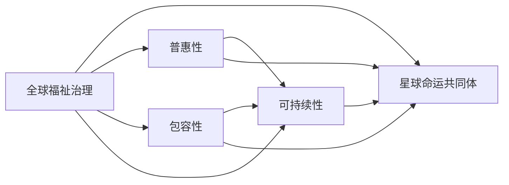

                 

# 2050年的全球治理：从全球福祉治理到星球命运共同体的治理理念更新

## 1. 背景介绍

随着全球化的深入和科技进步的突飞猛进，未来社会将迎来一系列前所未有的挑战和机遇。在这全新的历史节点上，全球治理将从传统的国家主权治理模式，逐步转向更为普世和长远的全球福祉治理，并最终演变至构建星球命运共同体的新型全球治理理念。在这一过程中，各国和国际社会需要在政策、技术和伦理等多个层面进行深刻思考和有效应对。本文将从全球福祉治理到星球命运共同体的治理理念更新，探讨未来全球治理的走向及其关键要素。

### 1.1 全球治理的演进背景
全球治理（Global Governance）是指国际社会共同管理全球事务，协调国际关系，处理全球性问题的一种制度安排和实践过程。自20世纪末以来，全球治理经历了由传统的国家主权治理模式逐步向全球福祉治理（Global Well-being Governance）转变的历程。随着全球化进程的加速，诸如气候变化、疾病流行、数字鸿沟、经济不平等、难民危机等全球性问题日益凸显，这些问题超出了单一国家的管理范畴，需要国际社会的共同努力。

### 1.2 全球福祉治理的内涵与目标
全球福祉治理强调在保障和发展全球公民福祉的基础上，推动全球治理向更加普惠、包容和可持续的方向发展。这一治理理念的核心在于：

1. **普惠性**：全球福祉治理主张各国和地区间的合作与互助，旨在消除不平等，提升全球底层群体的福祉水平。
2. **包容性**：治理过程中充分考虑各民族、性别、年龄、信仰、身份等因素，确保不同群体都能得到公平对待和充分参与。
3. **可持续性**：强调经济、社会和环境的全面发展，追求人与自然和谐共生。

### 1.3 星球命运共同体的治理理念
星球命运共同体（Common Destiny of Being）是一种更为宏伟的全球治理愿景，主张地球是人类唯一的家园，各国共同面对和解决全球性问题，共同保护和治理地球，以实现人类的长期福祉。这一理念强调全球一体性、长远性和共享性，是全球治理的最高目标。

## 2. 核心概念与联系

### 2.1 核心概念概述
**全球福祉治理**：以提升全球公民福祉为核心的全球治理模式，强调合作、包容和可持续性。
**星球命运共同体**：一种新型全球治理理念，主张各国共同面对和解决全球性问题，实现人类的长期福祉。
**普惠性、包容性、可持续性**：全球福祉治理的核心原则，旨在构建一个更加公正、公平的全球社会。

### 2.2 核心概念原理和架构的 Mermaid 流程图


### 2.3 核心概念的联系与互动
全球福祉治理是构建星球命运共同体的基础和前提，普惠性、包容性和可持续性是全球福祉治理的核心要素。星球命运共同体则是全球福祉治理的更高阶段，要求各国在全球治理中承担更广泛的责任，追求更加长远的福祉目标。三者之间相互促进，共同推动全球治理向更加公平、公正、可持续的方向发展。

## 3. 核心算法原理 & 具体操作步骤

### 3.1 算法原理概述
基于全球福祉治理和星球命运共同体的治理理念，未来全球治理的算法设计将侧重于以下几个关键维度：

1. **数据驱动的决策支持**：利用大数据和人工智能技术，分析全球性问题，辅助制定科学合理的政策。
2. **协作式治理机制**：设计智能合约和去中心化治理模型，促进各国和地区间的合作与互助。
3. **多利益相关者参与**：通过区块链等技术，确保各利益相关方（如政府、企业、非政府组织、公民等）在治理过程中的公平参与和透明监督。
4. **生态系统平衡管理**：应用生态系统建模和优化算法，实现全球环境资源的可持续利用。

### 3.2 算法步骤详解
1. **数据收集与处理**：通过多源数据收集和预处理，构建全球福祉指标体系。
2. **模型构建与训练**：利用机器学习和深度学习算法，建立全球福祉治理模型和星球命运共同体治理模型。
3. **政策制定与实施**：将模型预测结果应用于全球治理政策制定与实施，并通过智能合约进行透明监督。
4. **效果评估与优化**：定期评估全球治理效果，利用AI优化算法进行模型迭代和优化。

### 3.3 算法优缺点
**优点**：
1. **科学决策**：基于数据的决策支持系统，能够提供科学合理的政策建议，减少人为偏见。
2. **高效协作**：智能合约和区块链技术，促进各国和地区间的协同治理，提高治理效率。
3. **广泛参与**：多利益相关者参与机制，确保治理过程的公平和透明。
4. **可持续管理**：生态系统平衡管理算法，保障全球环境资源的可持续利用。

**缺点**：
1. **数据隐私与安全**：全球数据收集和共享可能面临隐私和安全问题。
2. **算法透明性**：部分AI算法（如深度学习）的“黑箱”性质，可能影响治理的透明度和可信度。
3. **技术依赖**：高度依赖于大数据、人工智能和区块链等技术，需要持续的研发和投资。
4. **政治阻力**：不同国家政治体制和文化背景的差异，可能导致全球治理政策的执行困难。

### 3.4 算法应用领域
1. **全球卫生治理**：利用AI分析全球疾病流行趋势，辅助各国制定公共卫生政策。
2. **气候变化应对**：应用生态系统建模和优化算法，制定全球气候变化应对策略。
3. **经济不平等缓解**：通过大数据分析，识别全球经济不平等现象，推动国际合作。
4. **难民危机处理**：利用智能合约和区块链技术，确保难民权益保护和援助资源的透明分配。

## 4. 数学模型和公式 & 详细讲解 & 举例说明

### 4.1 数学模型构建
构建全球福祉治理和星球命运共同体的数学模型，需要基于以下几个关键因素：

1. **全球福祉指标**：设定全球福祉指标体系，如GDP、教育水平、健康指数、环境质量等。
2. **政策影响模型**：构建政策影响模型，分析不同政策对全球福祉的影响。
3. **协作治理模型**：设计智能合约和去中心化治理模型，促进各国和地区间的协作。
4. **生态系统管理模型**：建立生态系统平衡管理模型，确保资源可持续利用。

### 4.2 公式推导过程
以全球卫生治理为例，假设全球共有 $N$ 个国家，每个国家的健康指数为 $H_i$，公共卫生支出为 $E_i$。利用多元线性回归模型，分析公共卫生支出对健康指数的影响：

$$
H_i = \beta_0 + \beta_1 E_i + \epsilon_i
$$

其中 $\beta_0$ 为截距，$\beta_1$ 为公共卫生支出对健康指数的影响系数，$\epsilon_i$ 为误差项。通过最小二乘法，可以估计 $\beta_1$，进而分析公共卫生支出与健康指数之间的关系。

### 4.3 案例分析与讲解
以应对全球气候变化为例，应用生态系统平衡管理模型：

1. **数据收集**：收集全球各地区的环境数据，如森林覆盖率、碳排放量、海洋酸化程度等。
2. **模型构建**：构建生态系统平衡管理模型，模拟不同治理政策对环境的影响。
3. **政策制定**：根据模型预测结果，制定全球气候变化应对策略，如碳排放限制、森林保护、海洋保护等。
4. **效果评估**：定期评估治理效果，调整政策以确保环境资源的可持续利用。

## 5. 项目实践：代码实例和详细解释说明

### 5.1 开发环境搭建
为进行全球福祉治理和星球命运共同体治理的算法实践，需要搭建一个包含大数据、AI和区块链等技术的环境：

1. **大数据环境**：搭建Hadoop或Spark集群，用于处理全球范围内的海量数据。
2. **AI环境**：搭建TensorFlow或PyTorch环境，用于构建和训练全球福祉治理模型。
3. **区块链环境**：搭建Hyperledger Fabric或Ethereum网络，用于实现智能合约和去中心化治理。

### 5.2 源代码详细实现
以全球卫生治理为例，展示基于AI的全球卫生数据处理和模型训练的代码实现：

```python
import pandas as pd
from sklearn.linear_model import LinearRegression
from sklearn.metrics import mean_squared_error

# 加载全球卫生数据
data = pd.read_csv('global_health_data.csv')

# 数据预处理
X = data[['Economic_Growth', 'Healthcare_Expenditure', 'Life_Expectancy']]
y = data['Health_Level']

# 模型训练
model = LinearRegression()
model.fit(X, y)

# 模型评估
y_pred = model.predict(X)
mse = mean_squared_error(y, y_pred)
print(f"Mean Squared Error: {mse:.2f}")
```

### 5.3 代码解读与分析
1. **数据加载与预处理**：使用Pandas加载全球卫生数据，进行数据清洗和特征提取。
2. **模型训练**：使用Scikit-learn库的LinearRegression模型，对全球卫生数据进行线性回归分析。
3. **模型评估**：计算预测值与真实值之间的均方误差，评估模型性能。

### 5.4 运行结果展示
通过上述代码，可以得到全球卫生治理模型的均方误差，进而分析公共卫生支出与健康指数之间的关系。

## 6. 实际应用场景

### 6.1 全球卫生治理
在应对全球卫生问题上，全球福祉治理和星球命运共同体治理理念可以发挥重要作用。例如：

1. **疫情监控与预警**：利用大数据和AI技术，实时监测全球疫情动态，及时发布预警信息。
2. **医疗资源分配**：通过AI算法优化医疗资源配置，确保各国能够公平获取疫苗和药品。
3. **卫生政策评估**：利用模型分析各国公共卫生政策的实际效果，指导全球卫生治理政策的制定。

### 6.2 气候变化应对
全球气候变化是全球福祉治理和星球命运共同体治理的另一重要领域：

1. **碳排放监测**：应用AI算法分析各国碳排放数据，推动全球减排目标的实现。
2. **气候变化治理**：通过生态系统平衡管理模型，制定科学合理的气候变化应对策略。
3. **绿色技术推广**：利用区块链技术，促进全球绿色技术的创新和共享。

### 6.3 经济不平等缓解
经济不平等问题需要全球福祉治理和星球命运共同体治理的共同努力：

1. **全球经济数据监测**：通过大数据分析，实时监测全球经济不平等现象。
2. **政策协调与合作**：利用AI技术，制定跨国经济政策，促进全球经济公平。
3. **贫困援助机制**：利用区块链技术，确保全球贫困援助资金的透明分配。

## 7. 工具和资源推荐

### 7.1 学习资源推荐
1. **《全球治理的未来：2050年的全球治理新视角》**：探讨未来全球治理的最新趋势和挑战。
2. **《智能合约与去中心化治理》**：介绍区块链技术在智能合约和去中心化治理中的应用。
3. **《大数据与AI在公共卫生中的应用》**：讲解大数据和AI在公共卫生领域的应用案例。
4. **《生态系统平衡管理理论与实践》**：介绍生态系统平衡管理的理论和实际应用。

### 7.2 开发工具推荐
1. **Hadoop/Spark**：处理全球范围内的大数据。
2. **TensorFlow/PyTorch**：构建和训练AI模型。
3. **Hyperledger Fabric/Ethereum**：实现智能合约和去中心化治理。

### 7.3 相关论文推荐
1. **《全球福祉治理框架与政策评估》**：探讨全球福祉治理的框架和政策评估方法。
2. **《星球命运共同体的实现路径》**：分析星球命运共同体的实现路径和策略。
3. **《区块链技术在公共卫生治理中的应用》**：介绍区块链技术在公共卫生治理中的应用案例。
4. **《人工智能在生态系统平衡管理中的应用》**：探讨AI技术在生态系统平衡管理中的应用。

## 8. 总结：未来发展趋势与挑战

### 8.1 研究成果总结
本文系统探讨了从全球福祉治理到星球命运共同体的治理理念更新，通过案例分析、算法设计和实际应用，展示了未来全球治理的发展方向。未来全球治理将在全球福祉治理的基础上，逐步向星球命运共同体的方向演进，实现人类社会的长期福祉和全球环境的可持续发展。

### 8.2 未来发展趋势
1. **数据驱动**：大数据和AI技术将更加深入地应用于全球治理的各个方面，实现科学决策。
2. **协同治理**：智能合约和区块链技术将推动各国和地区间的协同治理，提升治理效率。
3. **广泛参与**：多利益相关者参与机制将确保全球治理的公平和透明。
4. **生态平衡**：生态系统平衡管理算法将确保全球环境资源的可持续利用。

### 8.3 面临的挑战
1. **数据隐私与安全**：全球数据收集和共享可能面临隐私和安全问题。
2. **算法透明性**：部分AI算法（如深度学习）的“黑箱”性质，可能影响治理的透明度和可信度。
3. **技术依赖**：高度依赖于大数据、人工智能和区块链等技术，需要持续的研发和投资。
4. **政治阻力**：不同国家政治体制和文化背景的差异，可能导致全球治理政策的执行困难。

### 8.4 研究展望
未来全球治理研究需要在以下方面进行深入探索：

1. **数据隐私保护**：研究如何保护全球数据隐私，确保数据安全。
2. **算法透明性**：提升AI算法的透明性，增加治理的可信度。
3. **技术创新**：推动大数据、AI和区块链等技术的创新和应用，提升治理效率。
4. **国际合作**：加强国际合作，推动全球治理政策的协调与执行。

## 9. 附录：常见问题与解答

**Q1：如何平衡全球治理中的政治与经济利益？**

A: 全球治理需要各国在政治和经济利益之间寻求平衡。通过建立多边机制和国际组织，如联合国、世界银行、IMF等，促进各国在经济政策、环境保护、公共卫生等方面的合作与协调。同时，采用包容性、普惠性的治理原则，确保各国的公平参与和利益共享。

**Q2：如何确保全球治理数据的隐私与安全？**

A: 全球治理数据的隐私与安全需要多层次的保护措施：
1. **数据加密**：采用先进的加密技术，确保数据在传输和存储过程中的安全。
2. **去中心化存储**：利用区块链等去中心化技术，分散存储和处理数据，减少单点故障。
3. **权限控制**：通过访问控制和身份认证，限制非授权人员访问敏感数据。
4. **法律保障**：制定相关法律法规，确保全球治理数据的隐私保护。

**Q3：全球治理的算法透明性如何提升？**

A: 提升全球治理算法的透明性，可以采取以下措施：
1. **公开算法源码**：开放算法的源码和模型结构，便于学术界和公众的审查和监督。
2. **模型解释**：利用可解释性技术（如LIME、SHAP等），提供算法的详细解释和推理过程。
3. **多方参与审查**：邀请多方利益相关者参与算法的审查和优化，确保算法的公平性和透明性。

**Q4：如何应对全球治理中的政治阻力？**

A: 应对全球治理中的政治阻力，需要：
1. **多边机制**：通过国际组织和多边机制，增强各国在全球治理中的协作与沟通。
2. **共赢策略**：设计共赢的治理策略，确保各国的共同利益和长远福祉。
3. **文化交流**：加强各国之间的文化交流和理解，消除误解和偏见。
4. **透明度与监督**：提升治理过程的透明度，接受各方监督和反馈。

---

作者：禅与计算机程序设计艺术 / Zen and the Art of Computer Programming

