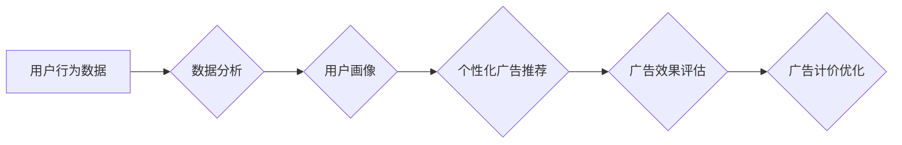

>  注意力经济, 广告计价,  用户行为,  数据分析,  机器学习,  个性化推荐,  价值评估

## 1. 背景介绍

在数字时代，信息爆炸式增长，用户面临着海量信息的选择和处理难题。注意力，作为稀缺资源，成为至关重要的竞争要素。注意力经济的概念应运而生，强调用户注意力是企业获取价值的关键。传统广告计价模式，主要基于展示量和点击量，却无法有效衡量广告对用户注意力的吸引力。随着注意力经济的兴起，传统广告计价模式面临着前所未有的冲击。

## 2. 核心概念与联系

### 2.1 注意力经济

注意力经济是指在信息过载的时代，用户注意力成为稀缺资源，而企业通过获取和利用用户注意力来创造价值的经济模式。

### 2.2 传统广告计价模式

传统广告计价模式主要基于以下指标：

* **展示量 (Impressions):** 广告被展示的次数。
* **点击量 (Clicks):** 用户点击广告的次数。
* **点击率 (CTR):** 点击量与展示量的比率。

### 2.3 用户行为数据

用户行为数据是注意力经济的核心驱动力。通过分析用户浏览、点击、停留时间等行为数据，可以洞察用户兴趣、偏好和注意力模式。

**Mermaid 流程图**



## 3. 核心算法原理 & 具体操作步骤

### 3.1 算法原理概述

注意力经济下的广告计价模式，需要基于用户行为数据，对广告的价值进行精准评估。常用的算法包括：

* **机器学习算法:** 利用机器学习算法，从用户行为数据中学习用户注意力模式，预测用户对特定广告的兴趣和点击概率。
* **深度学习算法:** 深度学习算法可以学习更复杂的特征，提高广告价值评估的准确性。

### 3.2 算法步骤详解

1. **数据收集:** 收集用户行为数据，包括浏览历史、点击记录、停留时间等。
2. **数据预处理:** 对数据进行清洗、转换和特征提取，以便于算法训练。
3. **模型训练:** 利用机器学习或深度学习算法，训练广告价值评估模型。
4. **模型评估:** 使用测试数据评估模型的性能，并进行调参优化。
5. **在线预测:** 将训练好的模型部署到线上环境，实时预测用户对广告的注意力和点击概率。
6. **计价优化:** 根据预测结果，动态调整广告价格，以最大化广告主收益和用户体验。

### 3.3 算法优缺点

**优点:**

* **精准评估:** 基于用户行为数据，可以更精准地评估广告价值。
* **个性化推荐:** 可以根据用户兴趣和偏好，推荐更相关的广告。
* **提高效率:** 动态调整广告价格，可以提高广告投放效率。

**缺点:**

* **数据依赖:** 算法性能依赖于数据质量和数量。
* **隐私问题:** 用户行为数据涉及隐私问题，需要妥善处理。
* **算法复杂:** 训练和部署机器学习模型需要一定的技术门槛。

### 3.4 算法应用领域

注意力经济下的广告计价模式，广泛应用于以下领域:

* **搜索引擎广告:** 根据用户搜索关键词和浏览历史，精准推荐相关广告。
* **社交媒体广告:** 根据用户兴趣和社交关系，推荐个性化广告。
* **视频广告:** 根据用户观看视频内容和行为，精准投放视频广告。

## 4. 数学模型和公式 & 详细讲解 & 举例说明

### 4.1 数学模型构建

假设用户对广告的注意力可以表示为一个概率值，该概率值取决于用户的兴趣、偏好和广告内容等因素。我们可以构建一个数学模型来预测用户对广告的注意力：

$$P(Attention) = f(UserFeatures, AdFeatures)$$

其中：

* $P(Attention)$: 用户对广告的注意力概率。
* $UserFeatures$: 用户特征向量，包括用户兴趣、偏好、浏览历史等。
* $AdFeatures$: 广告特征向量，包括广告标题、内容、图片等。
* $f$: 注意力预测函数，可以是线性回归、逻辑回归、神经网络等模型。

### 4.2 公式推导过程

注意力预测函数 $f$ 的具体形式取决于选择的模型类型。例如，对于线性回归模型，注意力预测函数可以表示为：

$$P(Attention) = \beta_0 + \beta_1 * UserFeatures_1 + \beta_2 * AdFeatures_1 + ... + \beta_n * UserFeatures_n + \beta_{n+1} * AdFeatures_n$$

其中：

* $\beta_0$: 截距项。
* $\beta_1, \beta_2, ..., \beta_n, \beta_{n+1}$: 模型参数，需要通过训练数据进行估计。
* $UserFeatures_1, UserFeatures_2, ..., UserFeatures_n$: 用户特征向量中的各个特征。
* $AdFeatures_1, AdFeatures_2, ..., AdFeatures_n$: 广告特征向量中的各个特征。

### 4.3 案例分析与讲解

假设我们想要预测用户对某个新闻广告的注意力。我们可以收集用户的浏览历史、兴趣标签和新闻广告的内容特征，并将其作为输入到注意力预测模型中。模型会根据这些特征，预测用户对该新闻广告的注意力概率。

## 5. 项目实践：代码实例和详细解释说明

### 5.1 开发环境搭建

* 操作系统: Ubuntu 20.04
* Python 版本: 3.8
* 必要的库: pandas, numpy, scikit-learn, tensorflow

### 5.2 源代码详细实现

```python
import pandas as pd
from sklearn.linear_model import LogisticRegression

# 加载用户行为数据
data = pd.read_csv('user_behavior_data.csv')

# 特征工程
user_features = data[['age', 'gender', 'interests']]
ad_features = data[['title', 'content', 'category']]

# 训练模型
model = LogisticRegression()
model.fit(user_features, data['attention'])

# 预测注意力
new_user_features = pd.DataFrame({'age': [25], 'gender': ['male'], 'interests': ['technology']})
new_ad_features = pd.DataFrame({'title': ['New AI Technology'], 'content': ['...', '...', '...'], 'category': ['technology']})
predicted_attention = model.predict_proba(new_user_features)[:, 1]

print(predicted_attention)
```

### 5.3 代码解读与分析

* 代码首先加载用户行为数据，并进行特征工程，提取用户特征和广告特征。
* 然后，使用逻辑回归模型训练注意力预测模型。
* 最后，使用训练好的模型预测新用户的注意力概率。

### 5.4 运行结果展示

运行结果将显示新用户的注意力概率，例如0.75表示用户对该广告的注意力概率为75%。

## 6. 实际应用场景

### 6.1 搜索引擎广告

搜索引擎广告平台可以利用用户搜索关键词和浏览历史，预测用户对特定广告的兴趣，并根据预测结果动态调整广告价格。

### 6.2 社交媒体广告

社交媒体广告平台可以根据用户的兴趣、偏好和社交关系，推荐个性化广告，并根据用户对广告的互动行为，动态调整广告价格。

### 6.3 视频广告

视频广告平台可以根据用户的观看视频内容和行为，精准投放视频广告，并根据用户对广告的观看时长和点击率，动态调整广告价格。

### 6.4 未来应用展望

注意力经济下的广告计价模式，未来将更加精准、个性化和智能化。

## 7. 工具和资源推荐

### 7.1 学习资源推荐

* **书籍:**
    * 《注意力经济》
    * 《数字营销》
* **在线课程:**
    * Coursera: 数据分析与机器学习
    * Udacity: 深度学习

### 7.2 开发工具推荐

* **数据分析工具:**
    * pandas
    * numpy
* **机器学习库:**
    * scikit-learn
    * tensorflow

### 7.3 相关论文推荐

* **Attention Is All You Need**
* **BERT: Pre-training of Deep Bidirectional Transformers for Language Understanding**

## 8. 总结：未来发展趋势与挑战

### 8.1 研究成果总结

注意力经济下的广告计价模式，为广告投放带来了新的思路和方法，提高了广告效率和用户体验。

### 8.2 未来发展趋势

* **更精准的注意力预测:** 利用更先进的机器学习算法和深度学习模型，提高注意力预测的准确性。
* **更个性化的广告推荐:** 基于用户的兴趣、偏好和行为，提供更个性化的广告推荐。
* **更智能的广告计价:** 利用人工智能技术，动态调整广告价格，以最大化广告主收益和用户体验。

### 8.3 面临的挑战

* **数据隐私问题:** 用户行为数据涉及隐私问题，需要妥善处理。
* **算法可解释性:** 复杂的机器学习模型难以解释，需要提高算法的可解释性。
* **监管政策:** 政府监管政策对注意力经济和广告计价模式的影响需要关注。

### 8.4 研究展望

未来，注意力经济和广告计价模式将继续发展，带来更多创新和挑战。需要加强对用户隐私保护、算法可解释性和监管政策的关注，推动注意力经济的健康发展。

## 9. 附录：常见问题与解答

### 9.1 如何收集用户行为数据？

可以通过以下方式收集用户行为数据：

* 网站分析工具: Google Analytics, Baidu Analytics
* 社交媒体平台 API
* 用户行为跟踪工具

### 9.2 如何处理用户行为数据？

需要对用户行为数据进行清洗、转换和特征提取，以便于算法训练。

### 9.3 如何选择合适的注意力预测模型？

选择合适的注意力预测模型需要根据具体应用场景和数据特点进行选择。

### 9.4 如何评估注意力预测模型的性能？

可以使用准确率、召回率、F1-score等指标评估注意力预测模型的性能。


作者：禅与计算机程序设计艺术 / Zen and the Art of Computer Programming 
<end_of_turn>