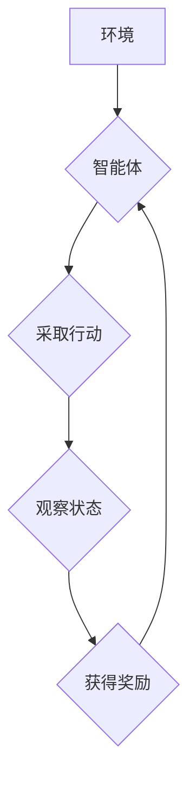

> 深度学习，Q-learning，强化学习，自然语言处理，文本生成，机器翻译

## 1. 背景介绍

自然语言处理 (NLP) 领域近年来取得了显著进展，深度学习方法在许多 NLP 任务中展现出强大的能力，例如机器翻译、文本摘要、情感分析等。然而，传统的监督学习方法依赖于大量标注数据，而标注数据往往昂贵且难以获取。强化学习 (RL) 作为一种无需大量标注数据的学习方法，逐渐成为 NLP 领域的研究热点。

Q-learning 是一种经典的强化学习算法，它通过学习状态-动作价值函数 (Q-value) 来选择最优动作。深度 Q-learning (DQN) 将深度神经网络引入 Q-learning 算法，能够学习更复杂的 Q-value 函数，从而在更复杂的环境中表现出色。

## 2. 核心概念与联系

**2.1 强化学习 (Reinforcement Learning)**

强化学习是一种基于交互学习的机器学习方法，其核心在于智能体与环境的交互过程。智能体在环境中采取行动，环境会根据行动给予智能体奖励或惩罚。智能体的目标是通过不断学习，找到能够最大化长期奖励的策略。

**2.2 Q-learning**

Q-learning 是一种基于价值函数的强化学习算法，其目标是学习一个状态-动作价值函数 Q(s, a)，该函数表示在状态 s 下采取动作 a 的期望长期奖励。Q-learning 通过迭代更新 Q-value 函数，最终找到最优策略。

**2.3 深度 Q-learning (DQN)**

深度 Q-learning 将深度神经网络引入 Q-learning 算法，用于学习更复杂的 Q-value 函数。深度神经网络能够学习到环境中隐藏的复杂关系，从而在更复杂的环境中表现出色。

**2.4 Mermaid 流程图**



## 3. 核心算法原理 & 具体操作步骤

### 3.1 算法原理概述

深度 Q-learning 算法的核心思想是利用深度神经网络学习状态-动作价值函数 Q(s, a)。该函数表示在状态 s 下采取动作 a 的期望长期奖励。算法通过迭代更新 Q-value 函数，最终找到最优策略。

### 3.2 算法步骤详解

1. **初始化:** 初始化 Q-网络参数，并设置学习率、折扣因子等超参数。
2. **环境交互:** 智能体与环境交互，观察当前状态 s。
3. **动作选择:** 根据 Q-网络输出的 Q-value，选择一个动作 a。
4. **执行动作:** 智能体执行动作 a，观察下一个状态 s' 和获得奖励 r。
5. **更新 Q-网络:** 使用 Bellman 方程更新 Q-网络的参数，以最小化 Q-value 函数与实际奖励的误差。
6. **重复步骤 2-5:** 重复上述步骤，直到达到预设的训练目标。

### 3.3 算法优缺点

**优点:**

* 能够学习复杂环境中的最优策略。
* 不需要大量标注数据。
* 可以应用于各种强化学习任务。

**缺点:**

* 训练过程可能比较慢。
* 需要设置合适的超参数。
* 容易陷入局部最优解。

### 3.4 算法应用领域

深度 Q-learning 算法在许多领域都有应用，例如：

* **游戏 AI:** 训练游戏 AI 策略，例如 AlphaGo。
* **机器人控制:** 训练机器人控制策略，例如自主导航。
* **推荐系统:** 训练个性化推荐系统。
* **自然语言处理:** 训练文本生成、机器翻译等 NLP 任务。

## 4. 数学模型和公式 & 详细讲解 & 举例说明

### 4.1 数学模型构建

深度 Q-learning 的核心是学习状态-动作价值函数 Q(s, a)。该函数表示在状态 s 下采取动作 a 的期望长期奖励。

### 4.2 公式推导过程

Bellman 方程是深度 Q-learning 算法的核心公式，它描述了 Q-value 函数的更新规则：

$$
Q(s, a) = Q(s, a) + \alpha [r + \gamma \max_{a'} Q(s', a') - Q(s, a)]
$$

其中：

* $Q(s, a)$ 是状态 s 下采取动作 a 的 Q-value。
* $\alpha$ 是学习率，控制着 Q-value 更新的幅度。
* $r$ 是从状态 s 到状态 s' 的奖励。
* $\gamma$ 是折扣因子，控制着未来奖励的权重。
* $\max_{a'} Q(s', a')$ 是下一个状态 s' 下所有动作的 Q-value 中的最大值。

### 4.3 案例分析与讲解

假设一个智能体在玩一个简单的游戏，游戏状态 s 可以表示为当前位置，动作 a 可以是向上、向下、向左、向右四个方向移动。当智能体到达游戏目标位置时，获得奖励 r = 1，否则奖励 r = 0。

使用 Bellman 方程更新 Q-value 函数，智能体可以学习到在不同状态下采取不同动作的最佳策略，最终找到通往游戏目标位置的最优路径。

## 5. 项目实践：代码实例和详细解释说明

### 5.1 开发环境搭建

* Python 3.6+
* TensorFlow 或 PyTorch 深度学习框架
* OpenAI Gym 游戏环境

### 5.2 源代码详细实现

```python
import tensorflow as tf

# 定义 Q-网络
class QNetwork(tf.keras.Model):
    def __init__(self, state_size, action_size):
        super(QNetwork, self).__init__()
        self.dense1 = tf.keras.layers.Dense(64, activation='relu')
        self.dense2 = tf.keras.layers.Dense(32, activation='relu')
        self.output = tf.keras.layers.Dense(action_size)

    def call(self, state):
        x = self.dense1(state)
        x = self.dense2(x)
        return self.output(x)

# 定义深度 Q-learning 算法
def dqn(env, state_size, action_size, learning_rate, gamma, epsilon, batch_size, epochs):
    # 初始化 Q-网络
    q_network = QNetwork(state_size, action_size)
    optimizer = tf.keras.optimizers.Adam(learning_rate=learning_rate)

    # 训练循环
    for epoch in range(epochs):
        # 采集经验
        states, actions, rewards, next_states, dones = collect_experience(env, q_network, epsilon)

        # 更新 Q-网络
        with tf.GradientTape() as tape:
            q_values = q_network(states)
            target_q_values = rewards + gamma * tf.reduce_max(q_network(next_states), axis=1) * (1 - dones)
            loss = tf.keras.losses.MeanSquaredError()(target_q_values, q_values)
        gradients = tape.gradient(loss, q_network.trainable_variables)
        optimizer.apply_gradients(zip(gradients, q_network.trainable_variables))

    # 返回训练后的 Q-网络
    return q_network

# 采集经验函数
def collect_experience(env, q_network, epsilon):
    states = []
    actions = []
    rewards = []
    next_states = []
    dones = []

    state = env.reset()
    done = False
    while not done:
        # 选择动作
        if np.random.rand() < epsilon:
            action = env.action_space.sample()
        else:
            q_values = q_network(tf.expand_dims(state, axis=0))
            action = tf.argmax(q_values, axis=1).numpy()[0]

        # 执行动作
        next_state, reward, done, _ = env.step(action)

        # 存储经验
        states.append(state)
        actions.append(action)
        rewards.append(reward)
        next_states.append(next_state)
        dones.append(done)

        state = next_state

    return np.array(states), np.array(actions), np.array(rewards), np.array(next_states), np.array(dones)

```

### 5.3 代码解读与分析

* **QNetwork:** 定义了深度 Q-网络的结构，包含两层全连接层和输出层。
* **dqn:** 定义了深度 Q-learning 算法的训练过程，包括初始化 Q-网络、采集经验、更新 Q-网络等步骤。
* **collect_experience:** 定义了采集经验的函数，通过与环境交互，收集状态、动作、奖励、下一个状态和是否结束等信息。

### 5.4 运行结果展示

训练完成后，可以将训练好的 Q-网络应用于游戏环境中，观察智能体的行为。

## 6. 实际应用场景

### 6.1 文本生成

深度 Q-learning 可以用于训练文本生成模型，例如生成小说、诗歌、对话等。

### 6.2 机器翻译

深度 Q-learning 可以用于训练机器翻译模型，例如将英文翻译成中文。

### 6.3 其他应用场景

* **问答系统:** 训练问答系统，能够根据用户的问题给出准确的答案。
* **聊天机器人:** 训练聊天机器人，能够与用户进行自然流畅的对话。

### 6.4 未来应用展望

随着深度学习技术的不断发展，深度 Q-learning 在 NLP 领域的应用前景十分广阔。未来，深度 Q-learning 可能会应用于更多更复杂的 NLP 任务，例如文本摘要、情感分析、代码生成等。

## 7. 工具和资源推荐

### 7.1 学习资源推荐

* **书籍:**
    * Reinforcement Learning: An Introduction by Sutton and Barto
    * Deep Reinforcement Learning Hands-On by Maxim Lapan
* **在线课程:**
    * Deep Reinforcement Learning Specialization by DeepLearning.AI
    * Reinforcement Learning by David Silver

### 7.2 开发工具推荐

* **TensorFlow:** https://www.tensorflow.org/
* **PyTorch:** https://pytorch.org/
* **OpenAI Gym:** https://gym.openai.com/

### 7.3 相关论文推荐

* Deep Reinforcement Learning with Double Q-learning
* Dueling Network Architectures for Deep Reinforcement Learning
* Prioritized Experience Replay

## 8. 总结：未来发展趋势与挑战

### 8.1 研究成果总结

深度 Q-learning 算法在 NLP 领域取得了显著进展，能够学习复杂环境中的最优策略，并应用于文本生成、机器翻译等任务。

### 8.2 未来发展趋势

* **模型效率:** 研究更轻量级、更高效的深度 Q-learning 模型，降低训练成本和时间。
* **样本效率:** 研究更有效的样本利用策略，减少对标注数据的依赖。
* **鲁棒性:** 研究更鲁棒的深度 Q-learning 算法，能够应对环境变化和噪声干扰。

### 8.3 面临的挑战

* **探索与利用的平衡:** 在探索新策略和利用已知策略之间找到平衡点。
* **局部最优解:** 避免陷入局部最优解，找到全局最优策略。
* **可解释性:** 提高深度 Q-learning 模型的可解释性，理解模型决策过程。

### 8.4 研究展望

未来，深度 Q-learning 算法将继续发展，在 NLP 领域发挥更大的作用，为我们带来更智能、更便捷的自然语言交互体验。

## 9. 附录：常见问题与解答

* **Q: 深度 Q-learning 和 Q-learning 的区别是什么？**

A: 深度 Q-learning 使用深度神经网络来学习 Q-value 函数，而