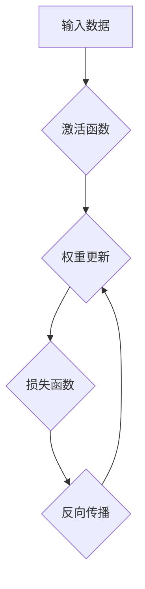

> 深度学习、神经网络、卷积神经网络、循环神经网络、梯度下降、反向传播、TensorFlow、PyTorch

## 1. 背景介绍

深度学习作为机器学习领域的一个重要分支，近年来取得了令人瞩目的成就，在图像识别、自然语言处理、语音识别等领域展现出强大的应用潜力。深度学习的核心在于利用多层神经网络来模拟人类大脑的学习过程，通过对大量数据进行训练，能够自动学习特征并进行复杂的任务处理。

随着深度学习技术的不断发展，其应用场景也越来越广泛，例如：

* **图像识别:**  自动识别图像中的物体、场景和人物。
* **自然语言处理:**  理解和生成人类语言，例如机器翻译、文本摘要、情感分析等。
* **语音识别:**  将语音转换为文本，例如语音助手、语音搜索等。
* **推荐系统:**  根据用户的历史行为和偏好，推荐相关的商品、服务或内容。
* **医疗诊断:**  辅助医生进行疾病诊断，例如图像分析、病理报告分析等。

## 2. 核心概念与联系

深度学习的核心概念包括神经网络、激活函数、损失函数、梯度下降等。

**2.1 神经网络**

神经网络由多个相互连接的神经元组成，每个神经元接收来自其他神经元的输入信号，并通过激活函数进行处理，输出到下一个神经元。神经网络可以分为不同的层，例如输入层、隐藏层和输出层。

**2.2 激活函数**

激活函数用于将神经元的输入信号转换为输出信号，并引入非线性特性，使神经网络能够学习更复杂的模式。常见的激活函数包括 sigmoid 函数、ReLU 函数、tanh 函数等。

**2.3 损失函数**

损失函数用于衡量模型的预测结果与真实值的差异，其目标是找到最优的模型参数，使损失函数最小化。常见的损失函数包括均方误差、交叉熵等。

**2.4 梯度下降**

梯度下降是一种优化算法，用于更新模型参数，使其朝着损失函数最小化的方向进行调整。

**2.5 反向传播**

反向传播算法用于计算梯度，并根据梯度更新模型参数。

**2.6  Mermaid 流程图**



## 3. 核心算法原理 & 具体操作步骤

### 3.1  算法原理概述

深度学习算法的核心是利用多层神经网络进行特征学习和模式识别。通过训练大量的样本数据，神经网络能够自动学习到数据的特征表示，并根据这些特征进行预测或分类。

### 3.2  算法步骤详解

1. **数据预处理:** 将原始数据进行清洗、转换和归一化，使其适合深度学习模型的训练。
2. **模型构建:** 根据具体的应用场景，选择合适的深度学习模型架构，例如卷积神经网络、循环神经网络等。
3. **模型训练:** 使用训练数据对模型进行训练，通过反向传播算法更新模型参数，使其能够准确地预测或分类数据。
4. **模型评估:** 使用测试数据评估模型的性能，例如准确率、召回率、F1-score等。
5. **模型调优:** 根据评估结果，调整模型参数或架构，以提高模型的性能。
6. **模型部署:** 将训练好的模型部署到实际应用场景中，用于进行预测或分类任务。

### 3.3  算法优缺点

**优点:**

* **自动特征学习:** 深度学习模型能够自动学习数据的特征表示，无需人工特征工程。
* **高精度:** 深度学习模型在许多任务中能够达到很高的精度。
* **泛化能力强:** 深度学习模型能够泛化到新的数据，即使是未见过的数据。

**缺点:**

* **数据依赖:** 深度学习模型需要大量的训练数据才能达到良好的性能。
* **计算资源消耗大:** 深度学习模型的训练需要大量的计算资源。
* **可解释性差:** 深度学习模型的决策过程难以解释。

### 3.4  算法应用领域

深度学习算法广泛应用于以下领域:

* **计算机视觉:** 图像识别、物体检测、图像分割、人脸识别等。
* **自然语言处理:** 机器翻译、文本摘要、情感分析、问答系统等。
* **语音识别:** 语音转文本、语音助手、语音搜索等。
* **推荐系统:** 商品推荐、内容推荐、用户画像等。
* **医疗诊断:** 疾病诊断、图像分析、病理报告分析等。

## 4. 数学模型和公式 & 详细讲解 & 举例说明

### 4.1  数学模型构建

深度学习模型的数学基础是神经网络，其核心是通过一系列的矩阵运算和激活函数来实现数据的变换和学习。

**4.1.1  神经元模型:**

单个神经元的数学模型可以表示为：

$$
y = f(w^T x + b)
$$

其中：

* $x$ 是输入向量
* $w$ 是权重向量
* $b$ 是偏置项
* $f$ 是激活函数
* $y$ 是输出值

**4.1.2  多层神经网络:**

多层神经网络由多个神经元层组成，每一层的神经元接收上一层的输出作为输入，并进行计算。

### 4.2  公式推导过程

深度学习模型的训练过程是通过最小化损失函数来实现的。损失函数衡量模型的预测结果与真实值的差异。常用的损失函数包括均方误差和交叉熵。

**4.2.1  均方误差:**

$$
L = \frac{1}{N} \sum_{i=1}^{N} (y_i - \hat{y}_i)^2
$$

其中：

* $N$ 是样本数量
* $y_i$ 是真实值
* $\hat{y}_i$ 是模型预测值

**4.2.2  交叉熵:**

$$
L = -\frac{1}{N} \sum_{i=1}^{N} y_i \log(\hat{y}_i) + (1-y_i) \log(1-\hat{y}_i)
$$

其中：

* $y_i$ 是真实值（0或1）
* $\hat{y}_i$ 是模型预测值

### 4.3  案例分析与讲解

**4.3.1  图像分类:**

假设我们有一个图像分类任务，目标是将图像分类为不同的类别，例如猫、狗、鸟等。我们可以使用卷积神经网络（CNN）来解决这个问题。CNN能够自动学习图像的特征，并将其用于分类。

**4.3.2  文本生成:**

假设我们有一个文本生成任务，目标是根据给定的文本生成新的文本。我们可以使用循环神经网络（RNN）来解决这个问题。RNN能够处理序列数据，并学习文本的语法和语义结构。

## 5. 项目实践：代码实例和详细解释说明

### 5.1  开发环境搭建

为了进行深度学习项目实践，我们需要搭建一个开发环境。常用的开发环境包括：

* **Python:** 深度学习的编程语言
* **TensorFlow/PyTorch:** 深度学习框架
* **GPU:** 加速深度学习训练

### 5.2  源代码详细实现

以下是一个使用 TensorFlow 实现图像分类的简单代码示例：

```python
import tensorflow as tf

# 定义模型架构
model = tf.keras.models.Sequential([
    tf.keras.layers.Conv2D(32, (3, 3), activation='relu', input_shape=(28, 28, 1)),
    tf.keras.layers.MaxPooling2D((2, 2)),
    tf.keras.layers.Conv2D(64, (3, 3), activation='relu'),
    tf.keras.layers.MaxPooling2D((2, 2)),
    tf.keras.layers.Flatten(),
    tf.keras.layers.Dense(10, activation='softmax')
])

# 编译模型
model.compile(optimizer='adam',
              loss='sparse_categorical_crossentropy',
              metrics=['accuracy'])

# 训练模型
model.fit(x_train, y_train, epochs=5)

# 评估模型
loss, accuracy = model.evaluate(x_test, y_test)
print('Test loss:', loss)
print('Test accuracy:', accuracy)
```

### 5.3  代码解读与分析

这段代码定义了一个简单的卷积神经网络模型，用于图像分类任务。

* **模型架构:** 模型由两层卷积层、两层最大池化层、一层全连接层和一层输出层组成。
* **激活函数:** 使用ReLU激活函数，可以提高模型的表达能力。
* **损失函数:** 使用稀疏类别交叉熵损失函数，适合多分类任务。
* **优化器:** 使用Adam优化器，可以加速模型训练。

### 5.4  运行结果展示

训练完成后，我们可以使用测试数据评估模型的性能。

## 6. 实际应用场景

### 6.1  图像识别

深度学习在图像识别领域取得了突破性的进展，例如：

* **人脸识别:** 用于身份验证、人脸搜索等应用。
* **物体检测:** 用于自动驾驶、安防监控等应用。
* **图像分类:** 用于医疗诊断、产品分类等应用。

### 6.2  自然语言处理

深度学习在自然语言处理领域也取得了显著的成果，例如：

* **机器翻译:** 将一种语言翻译成另一种语言。
* **文本摘要:** 自动生成文本的摘要。
* **情感分析:** 分析文本的情感倾向。

### 6.3  语音识别

深度学习在语音识别领域也取得了长足的进步，例如：

* **语音转文本:** 将语音转换为文本。
* **语音助手:** 例如 Siri、Alexa 等。
* **语音搜索:** 例如语音搜索引擎。

### 6.4  未来应用展望

深度学习技术的未来应用前景广阔，例如：

* **个性化推荐:** 根据用户的兴趣和偏好，提供个性化的商品、服务或内容推荐。
* **自动驾驶:** 深度学习可以用于自动驾驶汽车的感知、决策和控制。
* **医疗诊断:** 深度学习可以辅助医生进行疾病诊断，提高诊断准确率。

## 7. 工具和资源推荐

### 7.1  学习资源推荐

* **书籍:**
    * 深度学习 (Deep Learning) - Ian Goodfellow, Yoshua Bengio, Aaron Courville
    * 深度学习实战 (Deep Learning with Python) - Francois Chollet
* **在线课程:**
    * Coursera: 深度学习 Specialization
    * Udacity: 深度学习 Nanodegree
    * fast.ai: 深度学习课程

### 7.2  开发工具推荐

* **TensorFlow:** Google 开发的开源深度学习框架。
* **PyTorch:** Facebook 开发的开源深度学习框架。
* **Keras:** TensorFlow 上的深度学习 API，易于使用。

### 7.3  相关论文推荐

* **ImageNet Classification with Deep Convolutional Neural Networks** - Alex Krizhevsky, Ilya Sutskever, Geoffrey E. Hinton
* **Sequence to Sequence Learning with Neural Networks** - Ilya Sutskever, Oriol Vinyals, Quoc V. Le
* **Attention Is All You Need** - Ashish Vaswani, Noam Shazeer, Niki Parmar, Jakob Uszkoreit, Llion Jones, Aidan N. Gomez, Łukasz Kaiser, Illia Polosukhin

## 8. 总结：未来发展趋势与挑战

### 8.1  研究成果总结

深度学习在过去几年取得了令人瞩目的进展，在图像识别、自然语言处理、语音识别等领域取得了突破性的成果。

### 8.2  未来发展趋势

* **模型规模和复杂度:** 深度学习模型的规模和复杂度将继续增加，例如 Transformer 模型的出现。
* **数据效率:** 研究更有效的深度学习算法，能够利用