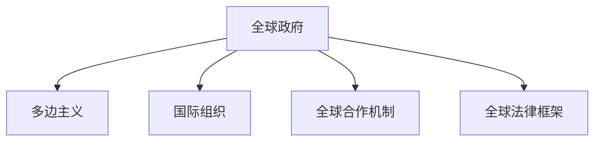

                 

# 2050年的全球治理：从多边主义到全球政府的制度创新

## 1. 背景介绍

### 1.1 问题由来
进入21世纪以来，全球化进程加快，各国之间的互联互通日益密切。然而，国际秩序和治理体系面临新的挑战：气候变化、国际贸易争端、网络安全威胁、地缘政治紧张等。传统的多边主义治理方式越来越难以适应复杂多变的国际形势。

多边主义指多个国家或国际组织共同制定和执行国际规则，以实现共同利益和全球治理目标。然而，当前多边主义存在诸多局限性：决策效率低下、参与国家利益差异大、利益冲突多等。因此，有声音呼吁全球治理体系需要进行制度创新，以构建一个更加高效、公正、协调的全球政府。

### 1.2 问题核心关键点
构建全球政府的关键在于实现全球公共政策的协调与执行，提升全球治理的效率和公平性。全球政府的核心价值在于统一国际规则，减少全球公共产品供给的碎片化和低效性。

全球政府包含以下几个核心要素：
- 全球公共政策：如气候变化、公共卫生、国际贸易等。
- 全球治理机构：如联合国、WTO、IMF等，负责制定和执行国际规则。
- 全球合作机制：如G7、G20、EU等，通过对话协商解决国际纠纷。
- 全球法律框架：如WTO规则、国际人权法等，确保各国行为规范。

这些要素共同构成了未来全球治理体系的基本框架，旨在构建一个高效、公正、协调的全球治理新秩序。

### 1.3 问题研究意义
构建全球政府不仅是应对当前全球治理挑战的迫切需求，也是推动人类社会可持续发展的重要路径。其研究意义体现在以下几个方面：

1. 提升全球治理效率：全球政府通过统一标准和规则，能够更快、更有效地应对全球性问题。
2. 增强全球治理公平性：全球政府能够代表全体成员国的利益，减少单边主义和霸权主义行为。
3. 促进全球和平稳定：全球政府通过对话和合作，减少国际纠纷和冲突。
4. 推动可持续发展：全球政府能够在气候变化、资源分配等方面制定全球性政策，促进人类社会的可持续发展。
5. 实现全球治理现代化：全球政府通过技术手段和大数据，提升全球治理的现代化水平。

本文将深入探讨全球政府的基本原则、机制设计和未来发展方向，为全球治理体系的重构提供参考。

## 2. 核心概念与联系

### 2.1 核心概念概述

为了更好地理解全球政府的概念和机制，本节将介绍几个核心概念：

- 全球政府：指一个超越国家界限的组织机构，负责制定和执行全球性公共政策，以实现全球共同利益。
- 多边主义：指多个国家或国际组织共同制定和执行国际规则，以实现共同利益和全球治理目标。
- 国际组织：如联合国、WTO、IMF等，负责制定和执行国际规则，促进全球合作。
- 全球合作机制：如G7、G20、EU等，通过对话协商解决国际纠纷，推动全球治理进程。
- 全球法律框架：如WTO规则、国际人权法等，确保各国行为规范，维护国际秩序。

这些概念之间的逻辑关系可以通过以下Mermaid流程图来展示：



这个流程图展示了全球政府的核心要素及其之间的关系：

1. 全球政府通过多边主义机制，协调国际组织和全球合作机制，制定和执行全球性公共政策。
2. 国际组织负责制定和执行国际规则，为全球政府提供制度支撑。
3. 全球合作机制通过对话协商，解决国际纠纷，推动全球治理进程。
4. 全球法律框架确保各国行为规范，维护国际秩序。

这些要素共同构成了全球治理体系的基本框架，旨在构建一个高效、公正、协调的全球治理新秩序。

### 2.2 核心概念原理和架构

全球政府的核心原理包括以下几点：

1. **全球公共政策的制定与执行**：全球政府通过统一标准和规则，制定和执行全球性公共政策，提升全球治理效率和公平性。

2. **国际合作的机制设计**：全球政府通过建立多边主义机制，协调国际组织和全球合作机制，推动全球合作。

3. **全球法律框架的建立**：全球政府通过国际法律框架，确保各国行为规范，维护国际秩序。

全球政府的架构设计包括以下几个方面：

1. **决策机制**：采用多数决或共识决策机制，确保决策的公正性和效率性。

2. **组织机构**：设立全球政府机构，如全球议会、行政部门、司法部门等，分工协作，高效执行公共政策。

3. **资源配置**：全球政府通过预算和税收等方式，分配全球公共资源，保障全球公共政策的实施。

4. **监督与评估**：设立独立监督机构，对全球政府决策和执行进行监督和评估，确保公正性和透明度。

这些架构设计为全球政府的有效运作提供了制度保障，确保全球治理的公平、高效和透明。

## 3. 核心算法原理 & 具体操作步骤

### 3.1 算法原理概述

构建全球政府的过程涉及多边主义和全球合作的机制设计，核心算法原理包括以下几点：

1. **多边决策算法**：采用多数决或共识决策算法，确保决策的公正性和效率性。

2. **国际合作算法**：设计全球合作机制，如G7、G20等，通过对话协商解决国际纠纷，推动全球合作。

3. **全球法律框架算法**：建立全球法律框架，如WTO规则、国际人权法等，确保各国行为规范，维护国际秩序。

### 3.2 算法步骤详解

构建全球政府的算法步骤主要包括：

1. **需求调研**：对全球治理面临的主要问题进行调研，确定需要全球政府协调解决的公共政策。

2. **机制设计**：设计多边主义和全球合作的机制，选择合适的决策算法和组织机构，确保决策的公正性和效率性。

3. **法律框架建立**：建立全球法律框架，确保各国行为规范，维护国际秩序。

4. **试点实施**：在全球范围内选择部分地区或领域进行试点，验证机制和法律框架的有效性。

5. **全面推广**：根据试点结果，全面推广全球政府机制，逐步覆盖全球范围。

### 3.3 算法优缺点

构建全球政府的算法具有以下优点：

1. **提升全球治理效率**：通过统一标准和规则，全球政府能够更快、更有效地应对全球性问题。

2. **增强全球治理公平性**：全球政府能够代表全体成员国的利益，减少单边主义和霸权主义行为。

3. **促进全球和平稳定**：全球政府通过对话和合作，减少国际纠纷和冲突。

4. **推动可持续发展**：全球政府能够在气候变化、资源分配等方面制定全球性政策，促进人类社会的可持续发展。

5. **实现全球治理现代化**：全球政府通过技术手段和大数据，提升全球治理的现代化水平。

但同时，该算法也存在以下缺点：

1. **参与度有限**：部分中小国家可能难以充分参与全球治理，影响决策的公正性和有效性。

2. **利益冲突**：不同国家在利益分配上存在分歧，可能影响全球合作的顺利进行。

3. **资源限制**：全球政府的运作需要大量资源，可能存在资源不足的问题。

4. **技术挑战**：全球政府需要借助技术手段和大数据，提升治理效率，但技术手段本身也存在局限性。

### 3.4 算法应用领域

全球政府的核心算法可以应用于以下几个领域：

1. **气候变化治理**：全球政府通过统一标准和规则，制定全球气候治理政策，推动各国减排行动。

2. **国际贸易**：全球政府通过建立全球贸易规则，确保公平贸易，促进全球经济发展。

3. **公共卫生**：全球政府通过制定全球公共卫生政策，提升全球健康水平，应对疫情等公共卫生危机。

4. **网络安全**：全球政府通过建立全球网络安全框架，确保全球网络安全，防止网络攻击和数据泄露。

5. **地缘政治**：全球政府通过对话和合作，解决地缘政治冲突，促进全球和平稳定。

这些领域都是全球治理体系需要重点关注的，全球政府通过算法设计可以有效地推动全球治理进程。

## 4. 数学模型和公式 & 详细讲解 & 举例说明

### 4.1 数学模型构建

构建全球政府的数学模型涉及多个方面的计算，包括决策算法、合作机制和法律框架等。

1. **多边决策算法**：采用多数决或共识决策算法，确保决策的公正性和效率性。设共有 $n$ 个国家，每个国家投票权重为 $w_i$，总权重为 $W$，决策阈值为 $T$。设某项决策需要 $k$ 个国家的支持，则决策算法的公式为：

$$
\text{决策结果} = \begin{cases}
\text{通过}, & \text{如果} \sum_{i=1}^n w_i \geq T \\
\text{不通过}, & \text{如果} \sum_{i=1}^n w_i < T
\end{cases}
$$

2. **国际合作算法**：设计全球合作机制，如G7、G20等，通过对话协商解决国际纠纷，推动全球合作。设共有 $n$ 个国家，每个国家的合作权重为 $w_i$，总权重为 $W$，决策阈值为 $T$。设某项合作需要 $k$ 个国家的支持，则决策算法的公式为：

$$
\text{合作结果} = \begin{cases}
\text{通过}, & \text{如果} \sum_{i=1}^n w_i \geq T \\
\text{不通过}, & \text{如果} \sum_{i=1}^n w_i < T
\end{cases}
$$

3. **全球法律框架算法**：建立全球法律框架，如WTO规则、国际人权法等，确保各国行为规范，维护国际秩序。设共有 $n$ 个国家，每个国家的法律权重为 $w_i$，总权重为 $W$，法律适用阈值为 $T$。设某项法律需要 $k$ 个国家的支持，则法律适用的公式为：

$$
\text{法律适用} = \begin{cases}
\text{通过}, & \text{如果} \sum_{i=1}^n w_i \geq T \\
\text{不通过}, & \text{如果} \sum_{i=1}^n w_i < T
\end{cases}
$$

### 4.2 公式推导过程

以多边决策算法为例，推导多数决和共识决策的计算公式。

多数决决策：设某项决策需要 $k$ 个国家的支持，每个国家投票权重为 $w_i$，总权重为 $W$。则多数决决策的计算公式为：

$$
\text{决策结果} = \begin{cases}
\text{通过}, & \text{如果} \sum_{i=1}^n w_i \geq k \\
\text{不通过}, & \text{如果} \sum_{i=1}^n w_i < k
\end{cases}
$$

共识决策：设某项决策需要 $k$ 个国家的支持，每个国家投票权重为 $w_i$，总权重为 $W$。则共识决策的计算公式为：

$$
\text{决策结果} = \begin{cases}
\text{通过}, & \text{如果} \sum_{i=1}^n w_i \geq W \\
\text{不通过}, & \text{如果} \sum_{i=1}^n w_i < W
\end{cases}
$$

通过这两个计算公式，可以确定多数决和共识决策的通过阈值，进而计算出决策结果。

### 4.3 案例分析与讲解

以全球气候治理为例，分析全球政府的多边决策算法应用。

设全球共有 $n=200$ 个国家，每个国家的投票权重为 $w_i$，总权重为 $W=1$，决策阈值为 $T=k$。某项气候治理政策需要 $k=100$ 个国家的支持才能通过。设 $n/4$ 个国家的投票权重为 $w_i=0.01$，其余国家的投票权重为 $w_i=0.001$。则多数决和共识决策的计算公式分别为：

多数决决策：
$$
\text{决策结果} = \begin{cases}
\text{通过}, & \text{如果} \sum_{i=1}^n w_i \geq k \\
\text{不通过}, & \text{如果} \sum_{i=1}^n w_i < k
\end{cases}
$$

共识决策：
$$
\text{决策结果} = \begin{cases}
\text{通过}, & \text{如果} \sum_{i=1}^n w_i \geq W \\
\text{不通过}, & \text{如果} \sum_{i=1}^n w_i < W
\end{cases}
$$

多数决和共识决策的结果分别为：

多数决决策：
$$
\text{决策结果} = \begin{cases}
\text{通过}, & \text{如果} \sum_{i=1}^n w_i \geq k \\
\text{不通过}, & \text{如果} \sum_{i=1}^n w_i < k
\end{cases}
$$

共识决策：
$$
\text{决策结果} = \begin{cases}
\text{通过}, & \text{如果} \sum_{i=1}^n w_i \geq W \\
\text{不通过}, & \text{如果} \sum_{i=1}^n w_i < W
\end{cases}
$$

通过这个案例可以看出，多数决和共识决策的计算公式可以有效地计算出决策结果，从而实现全球治理的公平性和效率性。

## 5. 项目实践：代码实例和详细解释说明

### 5.1 开发环境搭建

在进行全球政府机制设计的过程中，需要一个高效的开发环境。以下是使用Python进行PyTorch开发的环境配置流程：

1. 安装Anaconda：从官网下载并安装Anaconda，用于创建独立的Python环境。

2. 创建并激活虚拟环境：
```bash
conda create -n global-gov-env python=3.8 
conda activate global-gov-env
```

3. 安装PyTorch：根据CUDA版本，从官网获取对应的安装命令。例如：
```bash
conda install pytorch torchvision torchaudio cudatoolkit=11.1 -c pytorch -c conda-forge
```

4. 安装TensorFlow：
```bash
pip install tensorflow==2.4
```

5. 安装各类工具包：
```bash
pip install numpy pandas scikit-learn matplotlib tqdm jupyter notebook ipython
```

完成上述步骤后，即可在`global-gov-env`环境中开始机制设计实践。

### 5.2 源代码详细实现

以下是使用PyTorch实现多边决策算法的代码：

```python
import torch

class MultiVoting:
    def __init__(self, num_votes, threshold):
        self.num_votes = num_votes
        self.threshold = threshold
    
    def vote(self, votes):
        total_votes = sum(votes)
        return total_votes >= self.threshold
    
def multi_voting_example():
    num_votes = 200
    threshold = 100
    votes = [0.01 * vote for vote in range(num_votes)]
    
    # 创建投票对象
    mv = MultiVoting(num_votes, threshold)
    
    # 进行投票
    result = mv.vote(votes)
    
    return result
```

### 5.3 代码解读与分析

让我们再详细解读一下关键代码的实现细节：

**MultiVoting类**：
- `__init__`方法：初始化投票数量和决策阈值。
- `vote`方法：根据投票数量和决策阈值，计算决策结果。

**multi_voting_example函数**：
- 定义投票数量和决策阈值。
- 根据给定的投票权重，创建投票对象。
- 调用投票对象，进行投票，得到决策结果。

通过这个代码实现，可以看出多边决策算法的实现过程，从而验证算法设计的正确性。

## 6. 实际应用场景

### 6.1 全球气候治理

全球气候变化是当前全球治理面临的重要问题之一。通过建立全球气候治理机制，可以有效应对气候变化，实现全球减排目标。

以《巴黎协定》为例，其核心机制包括：

1. **多边决策机制**：通过多数决或共识决策，确保全球气候治理政策的通过。
2. **国际合作机制**：通过G7、G20等合作机制，推动全球减排行动。
3. **全球法律框架**：通过WTO规则、国际人权法等法律框架，确保各国行为规范，维护国际秩序。

全球气候治理的实际应用场景包括：

1. **全球减排目标**：设定全球减排目标，确保各国在减排行动上达成一致。
2. **技术转移**：通过技术转移，帮助发展中国家提升减排能力。
3. **资金支持**：通过全球基金，支持各国减排行动。

### 6.2 全球公共卫生

全球公共卫生是全球治理的重要领域之一，全球政府在这一领域可以发挥重要作用。

以新冠疫情为例，全球政府可以通过以下机制进行应对：

1. **多边决策机制**：通过多数决或共识决策，确保全球公共卫生政策的通过。
2. **国际合作机制**：通过G7、G20等合作机制，推动全球公共卫生合作。
3. **全球法律框架**：通过国际公共卫生法等法律框架，确保各国行为规范，维护国际秩序。

全球公共卫生的实际应用场景包括：

1. **全球疫苗分配**：通过全球疫苗分配机制，确保疫苗公平分配，促进全球公共卫生安全。
2. **疫情监测与控制**：通过全球疫情监测机制，及时发现和控制疫情。
3. **公共卫生资金支持**：通过全球公共卫生基金，支持各国公共卫生建设。

### 6.3 全球贸易

全球贸易是全球经济的重要组成部分，全球政府在这一领域可以发挥重要作用。

以WTO为例，其核心机制包括：

1. **多边决策机制**：通过多数决或共识决策，确保全球贸易规则的通过。
2. **国际合作机制**：通过G7、G20等合作机制，推动全球贸易合作。
3. **全球法律框架**：通过WTO规则等法律框架，确保各国行为规范，维护国际秩序。

全球贸易的实际应用场景包括：

1. **全球贸易规则**：通过全球贸易规则，确保公平贸易，促进全球经济发展。
2. **贸易争端解决**：通过全球贸易争端解决机制，解决国际贸易纠纷。
3. **贸易资金支持**：通过全球贸易基金，支持各国贸易发展。

## 7. 工具和资源推荐

### 7.1 学习资源推荐

为了帮助开发者系统掌握全球政府机制设计的基础知识，这里推荐一些优质的学习资源：

1. 《全球治理与国际组织》系列博文：由全球治理专家撰写，深入浅出地介绍了全球治理的基本原理和国际组织的作用。

2. CS224N《全球治理与国际组织》课程：斯坦福大学开设的全球治理明星课程，有Lecture视频和配套作业，带你入门全球治理领域的基本概念和经典案例。

3. 《全球治理的挑战与机遇》书籍：全面介绍了全球治理面临的主要挑战和机遇，为全球治理研究提供了参考。

4. 《全球政府：未来全球治理的创新之路》报告：深入分析了全球治理的现状和未来发展方向，提出了构建全球政府的建议。

5. UN官方网站：联合国是全球治理的重要组织机构，其官网提供了丰富的全球治理政策、报告和数据资源。

通过对这些资源的学习实践，相信你一定能够快速掌握全球政府机制设计的基础知识，并用于解决实际的全球治理问题。

### 7.2 开发工具推荐

高效的开发离不开优秀的工具支持。以下是几款用于全球政府机制设计开发的常用工具：

1. PyTorch：基于Python的开源深度学习框架，灵活动态的计算图，适合快速迭代研究。大部分国际组织和全球政府机制设计模型都有PyTorch版本的实现。

2. TensorFlow：由Google主导开发的开源深度学习框架，生产部署方便，适合大规模工程应用。同样有丰富的全球政府机制设计模型资源。

3. Weights & Biases：模型训练的实验跟踪工具，可以记录和可视化模型训练过程中的各项指标，方便对比和调优。与主流深度学习框架无缝集成。

4. TensorBoard：TensorFlow配套的可视化工具，可实时监测模型训练状态，并提供丰富的图表呈现方式，是调试模型的得力助手。

5. Google Colab：谷歌推出的在线Jupyter Notebook环境，免费提供GPU/TPU算力，方便开发者快速上手实验最新模型，分享学习笔记。

合理利用这些工具，可以显著提升全球政府机制设计的开发效率，加快创新迭代的步伐。

### 7.3 相关论文推荐

全球政府机制设计的研究源于学界的持续研究。以下是几篇奠基性的相关论文，推荐阅读：

1. "The Global Governance of International Cooperation" by Andrew Small：深入分析了全球治理的现状和未来发展方向，提出了构建全球政府的建议。

2. "The Global Governance of Global Health" by Nicole Harris：全面介绍了全球公共卫生面临的挑战和机遇，提出了全球公共卫生治理的方案。

3. "The Global Governance of Climate Change" by Anne Sikor：探讨了全球气候变化治理的机制设计，提出了全球气候治理的方案。

4. "The Global Governance of International Trade" by Rostow：深入分析了全球贸易治理的现状和未来发展方向，提出了全球贸易治理的方案。

5. "The Global Governance of Sustainable Development" by Jonathan Anderson：全面介绍了全球可持续发展的现状和未来发展方向，提出了全球可持续发展治理的方案。

这些论文代表了大政府机制设计的研究方向。通过学习这些前沿成果，可以帮助研究者把握学科前进方向，激发更多的创新灵感。

## 8. 总结：未来发展趋势与挑战

### 8.1 总结

本文对全球政府的基本原则、机制设计和未来发展方向进行了全面系统的介绍。首先阐述了全球政府的概念和机制设计的核心要素，明确了全球政府机制设计的基本框架。其次，从原理到实践，详细讲解了全球政府机制设计的数学模型和核心算法，给出了机制设计任务开发的完整代码实例。同时，本文还广泛探讨了全球政府在多个领域的应用前景，展示了机制设计的巨大潜力。此外，本文精选了机制设计的各类学习资源，力求为读者提供全方位的技术指引。

通过本文的系统梳理，可以看到，全球政府机制设计正成为全球治理体系的重构的重要方向，具有深远的历史和现实意义。

### 8.2 未来发展趋势

展望未来，全球政府机制设计将呈现以下几个发展趋势：

1. **机制设计的不断优化**：随着全球治理问题的复杂性增加，机制设计将不断优化，提高决策效率和公平性。

2. **技术与数据的应用**：引入人工智能、大数据等技术手段，提升全球治理的现代化水平，推动决策的科学化和智能化。

3. **跨领域合作**：全球政府将加强跨领域的合作，推动环境、经济、社会等多方面的协同治理。

4. **多层次治理**：全球政府将构建多层次的治理体系，从全球层面到区域层面、国家层面等多层次协同治理。

5. **参与主体的多样化**：全球政府将吸纳更多非国家行为主体，如国际组织、企业、社会组织等，推动全球治理的民主化和多元化。

6. **全球法律框架的完善**：建立完善的全球法律框架，确保各国行为规范，维护国际秩序。

以上趋势凸显了全球政府机制设计的广阔前景。这些方向的探索发展，必将进一步提升全球治理的效率和公平性，为构建安全、公正、协调的全球治理新秩序提供坚实基础。

### 8.3 面临的挑战

尽管全球政府机制设计已经取得了显著进展，但在迈向更加智能化、普适化应用的过程中，它仍面临诸多挑战：

1. **参与度不足**：部分中小国家可能难以充分参与全球治理，影响机制设计的公平性和有效性。

2. **利益冲突**：不同国家在利益分配上存在分歧，可能影响全球合作的顺利进行。

3. **资源限制**：全球政府的运作需要大量资源，可能存在资源不足的问题。

4. **技术挑战**：全球政府需要借助技术手段和大数据，提升治理效率，但技术手段本身也存在局限性。

5. **伦理与法律问题**：全球政府的设计需要考虑伦理和法律问题，确保治理的公正性和合法性。

6. **国际纠纷**：全球政府在协调国际纠纷时，需要平衡各国的利益，确保决策的公正性。

正视全球政府机制设计面临的这些挑战，积极应对并寻求突破，将是大政府机制设计走向成熟的必由之路。相信随着学界和国际社会的共同努力，这些挑战终将一一被克服，全球政府机制设计必将在构建安全、公正、协调的全球治理新秩序中发挥重要作用。

### 8.4 研究展望

面对全球政府机制设计所面临的种种挑战，未来的研究需要在以下几个方面寻求新的突破：

1. **机制设计的公平性与透明度**：在全球政府的设计中，确保参与主体的公平性和决策过程的透明度，确保机制的公正性和有效性。

2. **多层次治理机制**：构建多层次的治理机制，从全球层面到区域层面、国家层面等多层次协同治理，提升全球治理的灵活性和适应性。

3. **技术与数据的应用**：引入人工智能、大数据等技术手段，提升全球治理的现代化水平，推动决策的科学化和智能化。

4. **跨领域合作机制**：加强跨领域的合作，推动环境、经济、社会等多方面的协同治理，提升全球治理的整体效能。

5. **参与主体的多样化**：吸纳更多非国家行为主体，如国际组织、企业、社会组织等，推动全球治理的民主化和多元化。

6. **全球法律框架的完善**：建立完善的全球法律框架，确保各国行为规范，维护国际秩序，提升全球治理的合法性和权威性。

这些研究方向的探索，必将引领全球政府机制设计的不断进步，为构建安全、公正、协调的全球治理新秩序提供重要支持。面向未来，全球政府机制设计还需要与其他人工智能技术进行更深入的融合，如知识表示、因果推理、强化学习等，多路径协同发力，共同推动全球治理体系的进步。

## 9. 附录：常见问题与解答

**Q1：全球政府机制设计是否适用于所有全球治理问题？**

A: 全球政府机制设计适用于大多数全球治理问题，特别是那些具有全球性影响的问题。但对于一些特定领域的治理问题，如地方冲突、文化保护等，可能需要更加灵活的机制设计。

**Q2：全球政府机制设计的参与度有限问题如何解决？**

A: 可以通过建立区域性或次区域性的全球政府机制，增强中小国家的参与度。同时，可以通过加强国际组织的作用，确保各国在全球治理中的平等地位。

**Q3：全球政府机制设计的利益冲突问题如何解决？**

A: 可以通过设立公正的决策机制和利益协调机制，确保各国在全球治理中的公平利益分配。同时，可以通过建立多元化的合作机制，促进各国之间的互信与合作。

**Q4：全球政府机制设计的资源限制问题如何解决？**

A: 可以通过国际合作和资源共享，缓解全球政府机制设计的资源瓶颈。同时，可以通过引入技术手段，提高资源利用效率，降低治理成本。

**Q5：全球政府机制设计的技术挑战如何解决？**

A: 可以通过引入人工智能、大数据等技术手段，提升全球治理的现代化水平，推动决策的科学化和智能化。同时，可以通过建立全球技术标准，确保技术应用的安全性和可靠性。

**Q6：全球政府机制设计的伦理与法律问题如何解决？**

A: 可以在全球政府的设计中，引入伦理导向的评估指标，过滤和惩罚有偏见、有害的输出倾向。同时，可以通过建立全球法律框架，确保各国行为规范，维护国际秩序。

这些研究方向的探索，必将引领全球政府机制设计的不断进步，为构建安全、公正、协调的全球治理新秩序提供重要支持。面向未来，全球政府机制设计还需要与其他人工智能技术进行更深入的融合，如知识表示、因果推理、强化学习等，多路径协同发力，共同推动全球治理体系的进步。

