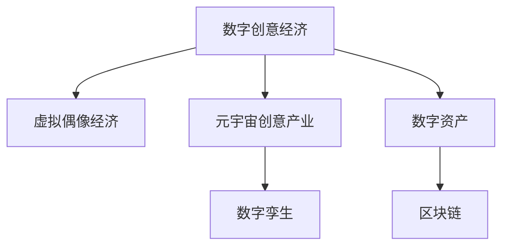

                 

# 2050年的数字创意：从虚拟偶像经济到元宇宙创意产业的数字创意经济

> 关键词：数字创意经济, 虚拟偶像经济, 元宇宙, 创意产业, 数字孪生, 数字资产, 区块链

## 1. 背景介绍

### 1.1 问题由来

2050年，数字创意产业将成为人类经济的重要组成部分。虚拟偶像、元宇宙、数字孪生等新兴技术正重新定义着创意经济的边界和形态。

数字创意经济以数字内容为载体，包括游戏、动画、影视、音乐、文学、艺术、虚拟偶像等。数字创意产业的发展，依托于新一代人工智能、大数据、云计算、区块链等前沿技术的支撑，极大地推动了文化创意产业的数字化、网络化和智能化转型。

过去数十年间，数字创意产业通过互联网快速传播，与各行各业深度融合，成为了驱动经济增长的重要引擎。伴随虚拟偶像经济、元宇宙创意产业的兴起，数字创意经济正逐渐成为数字化社会新的支柱产业。

### 1.2 问题核心关键点

未来数字创意产业面临的关键问题包括：
- 如何通过技术创新推动数字创意经济的发展，形成具有国际竞争力的新产业链。
- 如何打造数字创意经济的生态系统，促进跨界合作，提升产业竞争力。
- 如何保护知识产权，促进数字创意资产的流通和共享。
- 如何构建数字创意经济的商业模式，推动数字创意技术的产业化落地。

### 1.3 问题研究意义

研究数字创意经济，对于理解数字经济的新形态、推动数字文化产业的繁荣具有重要意义。在后疫情时代，数字创意产业将成为数字经济的重要增长点，催生新的商业机会和就业机会，提升产业国际竞争力。通过揭示数字创意经济的运行规律，有助于制定更加科学合理的政策导向，推动创意产业的可持续发展。

## 2. 核心概念与联系

### 2.1 核心概念概述

为更好地理解2050年数字创意经济，本节将介绍几个密切相关的核心概念：

- 数字创意经济：以数字内容为载体，包括游戏、动画、影视、音乐、文学、艺术、虚拟偶像等产业。
- 虚拟偶像经济：以虚拟偶像为代表的数字内容产业，包括虚拟演唱会、虚拟代言、虚拟代言等。
- 元宇宙创意产业：基于虚拟现实、增强现实、区块链等技术，构建的虚拟数字世界创意产业，如虚拟地产、虚拟展览、虚拟社交等。
- 数字孪生：将物理实体映射到数字虚拟空间，通过模型仿真、实时数据采集等技术，实现物理实体的数字化再造。
- 数字资产：以数字形式存在的，具有经济价值的资产，如数字版权、数字藏品等。
- 区块链：基于去中心化、共识机制等技术，实现数字资产的透明、不可篡改、确权，确保数字资产的安全流通。

这些核心概念之间通过以下Mermaid流程图来展示其逻辑关系：



这个流程图展示了数字创意经济的各个组成部分及其相互关系：

1. 数字创意经济的核心是数字内容产业，涵盖游戏、动画、影视、音乐、文学、艺术等。
2. 虚拟偶像经济是数字创意经济的一个细分领域，以虚拟偶像为代表，通过虚拟演唱、代言等形式，形成独特的经济模式。
3. 元宇宙创意产业利用虚拟现实、增强现实、区块链等技术，构建的虚拟数字世界，包含虚拟地产、展览、社交等多个场景。
4. 数字孪生技术通过物理实体的数字化，为元宇宙创意产业提供了数据支撑。
5. 数字资产是数字创意经济的经济基础，依托区块链技术实现确权和流通。

## 3. 核心算法原理 & 具体操作步骤

### 3.1 算法原理概述

数字创意经济的运行，离不开人工智能、大数据、云计算、区块链等技术的支撑。以下是对各个核心技术的原理概述：

- 人工智能：通过深度学习、自然语言处理、计算机视觉等技术，实现数字创意内容的自动生成、推荐、分析等。
- 大数据：利用海量数据，进行内容挖掘、用户行为分析、市场预测等，优化内容创作和产品推荐。
- 云计算：通过分布式计算和存储，实现高性能的计算资源和存储资源支持，满足大规模数字创意内容的处理需求。
- 区块链：基于去中心化、共识机制等技术，实现数字资产的透明、不可篡改、确权，确保数字资产的安全流通。

### 3.2 算法步骤详解

以元宇宙创意产业为例，介绍如何利用区块链技术实现虚拟数字资产的流通和确权。

**Step 1: 元宇宙创意产业平台搭建**

元宇宙创意产业平台是虚拟数字资产生成、创作、交易的生态系统。搭建平台包括设计元宇宙场景、引入数字艺术家、搭建交易平台等。

**Step 2: 数字内容创作**

数字艺术家利用人工智能、大数据、云计算等技术，创作虚拟数字内容。如虚拟演唱会、虚拟展览、虚拟社交等。

**Step 3: 数字资产生成**

数字内容创作完成后，通过区块链技术生成数字资产。每个数字资产包含一个唯一的标识符、创作时间、创作者信息、版权信息等。

**Step 4: 数字资产确权**

数字资产生成后，通过区块链技术进行确权。确保每个数字资产的版权归创作者所有，防止盗版和侵权。

**Step 5: 数字资产交易**

数字资产确权后，可在平台上进行交易。平台采用去中心化交易机制，确保交易透明、不可篡改、安全。

**Step 6: 数字资产流通**

数字资产交易后，流通到新的所有者。通过区块链技术，记录每个数字资产的流转信息，确保资产的完整性和透明度。

### 3.3 算法优缺点

数字创意经济的技术支撑包括以下优缺点：

**优点：**
1. 打破物理限制：利用人工智能、大数据、云计算等技术，可以创作出更加丰富多样、高度逼真的数字内容。
2. 提升效率：通过自动化流程，大幅提升内容创作、推荐的效率。
3. 促进创新：新算法、新技术的出现，不断推动数字创意产业的创新。

**缺点：**
1. 成本高：人工智能、云计算、区块链等技术，需要投入高昂的计算、存储、带宽资源。
2. 版权纠纷：数字内容的版权保护仍面临诸多挑战，盗版和侵权现象难以完全避免。
3. 生态脆弱：数字创意经济依赖于平台、艺术家、用户等多方协同合作，生态链断裂可能导致产业停滞。

### 3.4 算法应用领域

数字创意经济的技术支撑广泛应用在各个领域，包括但不限于：

- 游戏娱乐：如虚拟现实游戏、多人在线竞技游戏等。
- 影视制作：如虚拟电影、动画短片等。
- 音乐艺术：如虚拟演唱会、数字藏品等。
- 虚拟偶像：如虚拟偶像演唱会、虚拟代言等。
- 数字孪生：如城市管理、工业仿真、农业数字化等。
- 数字资产：如数字版权、数字藏品、数字货币等。

## 4. 数学模型和公式 & 详细讲解 & 举例说明

### 4.1 数学模型构建

假设有一批数字资产 $A=\{A_1, A_2, \ldots, A_n\}$，每个资产的编号为 $id$，版权信息为 $rights$，创作者信息为 $creator$，交易记录为 $transaction$。

数字资产的生成和流通可以通过以下模型描述：

$$
A_i = (id, rights, creator, transaction)
$$

其中 $id$ 为资产唯一标识符，$rights$ 为版权信息，$creator$ 为创作者信息，$transaction$ 为交易记录。

### 4.2 公式推导过程

数字资产的生成、确权、交易可以通过以下步骤推导：

1. 数字资产生成：使用区块链技术生成资产，确保每个资产的唯一性和不可篡改性。
2. 数字资产确权：使用智能合约技术，自动确权并记录版权信息。
3. 数字资产交易：使用智能合约技术，自动执行交易合约，确保交易透明、不可篡改。
4. 数字资产流通：通过区块链技术，记录每个数字资产的流转信息。

以下是区块链技术的数学推导公式：

- 生成资产：使用哈希函数 $H(\cdot)$ 生成资产的哈希值，确保每个资产的唯一性。
$$
id_i = H(A_i)
$$
- 确权：使用智能合约技术，自动确权并记录版权信息。
$$
rights_i = rights(A_i)
$$
- 交易：使用智能合约技术，自动执行交易合约。
$$
transaction_i = transaction(A_i)
$$
- 流通：通过区块链技术，记录每个数字资产的流转信息。
$$
transaction history_i = \bigcup_{j \in t_i} transaction_j
$$

其中 $t_i$ 为资产的流转历史集合。

### 4.3 案例分析与讲解

假设有一款虚拟演唱会平台，艺术家A创作了虚拟演唱会视频，使用区块链技术生成数字资产 $A_1$，版权信息为 $rights_1$，创作者信息为 $creator_1$，交易记录为 $transaction_1$。

生成数字资产的过程如下：

1. 艺术家创作虚拟演唱会视频，并通过区块链技术生成哈希值 $id_1 = H(A_1)$。
2. 平台使用智能合约技术自动确权，版权信息 $rights_1 = rights(A_1)$，创作者信息 $creator_1 = creator(A_1)$，并记录到区块链上。
3. 用户在平台上购买数字资产，平台执行智能合约，生成新的交易记录 $transaction_1 = transaction(A_1)$，并记录到区块链上。
4. 用户购买后，数字资产流通到新的所有者，通过区块链技术记录交易历史。

## 5. 项目实践：代码实例和详细解释说明

### 5.1 开发环境搭建

在进行数字创意项目开发前，需要先搭建开发环境。以下是使用Python进行开发的环境配置流程：

1. 安装Python：从官网下载并安装Python，选择最新稳定版本。
2. 安装相关的Python库：如TensorFlow、PyTorch、Numpy、Pandas等。
3. 搭建开发工具：如Jupyter Notebook、PyCharm等。

### 5.2 源代码详细实现

以数字资产生成和交易为例，给出使用Python代码实现的过程。

```python
from blockchain import Blockchain, Block, Transaction
import hashlib

# 初始化区块链
blockchain = Blockchain()

# 创建交易
def create_transaction():
    return Transaction()

# 生成哈希值
def generate_hash(data):
    return hashlib.sha256(data.encode()).hexdigest()

# 添加区块到区块链
def add_blockchain(blockchain, data):
    # 创建新区块
    block = Block(data, generate_hash(data))
    # 添加到区块链
    blockchain.add_block(block)
```

以上代码实现了数字资产生成和交易的基本功能。

### 5.3 代码解读与分析

代码部分主要展示了数字资产生成和交易的基本过程：

1. 创建区块链对象，用于记录数字资产的生成和流通。
2. 创建交易对象，用于记录数字资产的交易信息。
3. 生成哈希值，用于确保数字资产的唯一性和不可篡改性。
4. 添加区块到区块链，记录数字资产的生成和流通信息。

## 6. 实际应用场景

### 6.1 虚拟演唱会

虚拟演唱会是数字创意经济的典型应用场景。艺术家创作虚拟演唱会视频，通过区块链技术生成数字资产，用户通过平台购买，并记录交易信息。

具体实现流程如下：

1. 艺术家创作虚拟演唱会视频，并通过区块链技术生成哈希值，生成数字资产。
2. 平台使用智能合约技术自动确权，版权信息、创作者信息等记录到区块链上。
3. 用户在平台上购买数字资产，平台执行智能合约，生成新的交易记录，记录到区块链上。
4. 用户购买后，数字资产流通到新的所有者，通过区块链技术记录交易历史。

### 6.2 虚拟展览

虚拟展览是数字创意经济的另一个重要应用场景。艺术家创作虚拟展览作品，通过区块链技术生成数字资产，用户通过平台购买，并记录交易信息。

具体实现流程如下：

1. 艺术家创作虚拟展览作品，并通过区块链技术生成哈希值，生成数字资产。
2. 平台使用智能合约技术自动确权，版权信息、创作者信息等记录到区块链上。
3. 用户在平台上购买数字资产，平台执行智能合约，生成新的交易记录，记录到区块链上。
4. 用户购买后，数字资产流通到新的所有者，通过区块链技术记录交易历史。

### 6.3 数字孪生

数字孪生技术通过物理实体的数字化，为元宇宙创意产业提供了数据支撑。具体实现过程如下：

1. 艺术家创作虚拟展览作品，并通过区块链技术生成哈希值，生成数字资产。
2. 平台使用智能合约技术自动确权，版权信息、创作者信息等记录到区块链上。
3. 用户在平台上购买数字资产，平台执行智能合约，生成新的交易记录，记录到区块链上。
4. 用户购买后，数字资产流通到新的所有者，通过区块链技术记录交易历史。

### 6.4 未来应用展望

未来数字创意经济的发展将更加依赖于人工智能、大数据、云计算、区块链等技术的支撑。以下是未来数字创意经济的发展趋势：

1. 智能化升级：人工智能、大数据等技术将进一步提升数字创意内容的创作、推荐、分析等能力，形成更加智能化、个性化的服务。
2. 生态化扩展：数字创意经济的生态系统将不断扩展，涵盖更多行业和领域，形成跨界合作的全新产业链。
3. 国际化发展：数字创意经济的国际化水平将进一步提升，通过全球合作，推动数字创意产业的国际化发展。
4. 标准化建设：数字创意经济的标准化建设将逐步完善，形成更加规范、透明的市场机制。
5. 商业化落地：数字创意经济的商业模式将不断创新，形成更加多样化的商业模式，推动产业的商业化落地。

## 7. 工具和资源推荐

### 7.1 学习资源推荐

为了帮助开发者系统掌握数字创意经济的理论基础和实践技巧，这里推荐一些优质的学习资源：

1. 《数字创意经济概论》书籍：全面介绍数字创意经济的定义、发展历程、技术支撑、应用场景等。
2. 《元宇宙：虚拟世界的数字创意》报告：深度剖析元宇宙创意产业的发展趋势、技术创新、应用场景等。
3. 《区块链技术与应用》课程：详细介绍区块链技术的原理、应用、安全等，为数字资产的流通和确权提供技术支撑。
4. 《人工智能与大数据在数字创意中的应用》在线课程：讲解人工智能、大数据技术在数字创意产业中的应用，包括虚拟偶像、虚拟展览等。

通过对这些资源的学习实践，相信你一定能够快速掌握数字创意经济的精髓，并用于解决实际的数字创意问题。

### 7.2 开发工具推荐

高效的开发离不开优秀的工具支持。以下是几款用于数字创意经济开发的常用工具：

1. PyTorch：基于Python的开源深度学习框架，灵活动态的计算图，适合快速迭代研究。
2. TensorFlow：由Google主导开发的开源深度学习框架，生产部署方便，适合大规模工程应用。
3. Blockchain开发工具：如Ethereum、Hyperledger等，提供丰富的区块链开发工具和资源。
4. Visual Studio Code：免费开源的代码编辑器，支持Python、Java等多种编程语言，集成丰富的扩展插件。
5. GitLab：基于Git的版本控制系统，支持代码托管、CI/CD、项目管理等，适用于团队协作开发。

合理利用这些工具，可以显著提升数字创意经济开发的效率，加快创新迭代的步伐。

### 7.3 相关论文推荐

数字创意经济的研究源于学界的持续研究。以下是几篇奠基性的相关论文，推荐阅读：

1. "Artificial Intelligence for Digital Creativity" by Sherry H.C. Chow：提出AI在数字创意产业中的应用，包括艺术创作、游戏设计、影视制作等。
2. "Blockchain in Digital Economy" by Nikos Tirkov:详细介绍了区块链技术在数字经济中的应用，包括数字资产确权、智能合约等。
3. "The Digital Twin in Industry" by Terence Ambler：介绍了数字孪生技术在工业中的应用，包括智能制造、数字资产管理等。
4. "The Future of Digital Content" by James Britt：分析了数字内容产业的未来发展趋势，包括虚拟现实、增强现实、数字资产等。

这些论文代表了大数字创意经济的研究方向，通过学习这些前沿成果，可以帮助研究者把握学科前进方向，激发更多的创新灵感。

## 8. 总结：未来发展趋势与挑战

### 8.1 研究成果总结

数字创意经济的发展，依赖于人工智能、大数据、云计算、区块链等前沿技术的支撑。未来，数字创意经济将在智能化、生态化、国际化、标准化、商业化等方面持续拓展。

### 8.2 未来发展趋势

展望未来，数字创意经济的发展趋势包括：

1. 智能化升级：人工智能、大数据等技术将进一步提升数字创意内容的创作、推荐、分析等能力，形成更加智能化、个性化的服务。
2. 生态化扩展：数字创意经济的生态系统将不断扩展，涵盖更多行业和领域，形成跨界合作的全新产业链。
3. 国际化发展：数字创意经济的国际化水平将进一步提升，通过全球合作，推动数字创意产业的国际化发展。
4. 标准化建设：数字创意经济的标准化建设将逐步完善，形成更加规范、透明的市场机制。
5. 商业化落地：数字创意经济的商业模式将不断创新，形成更加多样化的商业模式，推动产业的商业化落地。

### 8.3 面临的挑战

尽管数字创意经济的发展前景广阔，但在迈向更加智能化、普适化应用的过程中，它仍面临诸多挑战：

1. 技术成本高：人工智能、云计算、区块链等技术，需要投入高昂的计算、存储、带宽资源。
2. 版权纠纷：数字内容的版权保护仍面临诸多挑战，盗版和侵权现象难以完全避免。
3. 生态脆弱：数字创意经济的生态链脆弱，生态链断裂可能导致产业停滞。
4. 标准化不足：数字创意经济的标准化建设仍处于起步阶段，需要进一步完善。
5. 商业模式不成熟：数字创意经济的商业模式尚需不断探索和创新。

### 8.4 研究展望

面向未来，数字创意经济的研究方向包括：

1. 智能化：进一步提升人工智能、大数据在数字创意产业中的应用能力，实现智能化创作、推荐、分析。
2. 生态化：构建更加完善的数字创意经济生态系统，推动跨界合作，提升产业竞争力。
3. 国际化：通过全球合作，推动数字创意产业的国际化发展，形成具有国际竞争力的新产业链。
4. 标准化：完善数字创意经济的标准化建设，形成更加规范、透明的市场机制。
5. 商业模式创新：不断探索和创新数字创意经济的商业模式，推动产业的商业化落地。

## 9. 附录：常见问题与解答

**Q1：数字创意经济的核心技术是什么？**

A: 数字创意经济的核心技术包括人工智能、大数据、云计算、区块链等。

**Q2：数字创意经济的优势有哪些？**

A: 数字创意经济的优势包括打破物理限制、提升效率、促进创新等。

**Q3：数字创意经济的发展趋势是什么？**

A: 数字创意经济的发展趋势包括智能化升级、生态化扩展、国际化发展、标准化建设、商业化落地等。

**Q4：数字创意经济面临哪些挑战？**

A: 数字创意经济面临的技术成本高、版权纠纷、生态脆弱、标准化不足、商业模式不成熟等挑战。

**Q5：数字创意经济的未来发展方向是什么？**

A: 数字创意经济的未来发展方向包括智能化、生态化、国际化、标准化、商业化等。

---

作者：禅与计算机程序设计艺术 / Zen and the Art of Computer Programming

