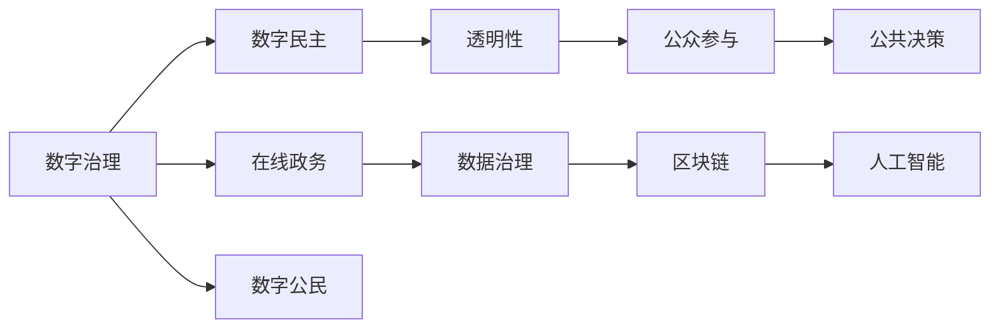

                 

# 2050年的数字治理：从在线政务到数字公民参与的数字民主实践

## 1. 背景介绍

随着数字化浪潮的推进，信息通信技术（ICT）已经成为现代社会的基础设施，极大地改变了人们的生产生活方式。在未来2050年，数字治理将成为全球各国共同面对的重要议题，它不仅关乎国家治理能力现代化，更是推动社会公平正义、保障公民权益的关键。

### 1.1 数字化浪潮的兴起
数字化浪潮的兴起，主要得益于互联网、移动互联网、物联网、云计算、大数据、人工智能等技术的迅猛发展。这些技术的融合，推动了信息通信基础设施的建设，催生了诸多新业态，重塑了社会运作的方方面面。数字化技术的普及，使得数据成为新的生产要素，也为数字治理提供了可能。

### 1.2 数字治理的必要性
在数字化浪潮的推动下，信息技术的广泛应用带来了诸多挑战和机遇。一方面，数字化技术提升了公共服务效率，提高了决策的透明度和公众参与度；另一方面，数据泄露、隐私保护、数字鸿沟等问题也随之凸显。数字治理的提出，旨在通过技术手段和政策措施，有效解决这些挑战，提升公共服务质量，推动数字民主的实现。

## 2. 核心概念与联系

### 2.1 核心概念概述

在数字治理的实践中，涉及多个核心概念，它们相互联系、互为支撑：

- **数字治理**：指通过信息技术手段，优化公共资源配置，提升政府治理能力，促进社会公平正义，保障公民权益的过程。
- **数字民主**：指在数字化环境下，公民通过互联网等手段参与政府决策、公共服务的过程，实现民主权利的数字化表达。
- **在线政务**：指通过互联网平台提供政府服务的模式，包括政务信息公开、在线办事、电子支付、数字身份认证等。
- **数字公民**：指能够充分利用信息技术手段，获取、使用和分享信息的公民，具备数字素养和技能。
- **数据治理**：指对数据的收集、处理、存储、传输、使用等全生命周期的管理，确保数据安全、隐私保护和高效利用。
- **区块链**：一种分布式账本技术，通过去中心化的方式，实现数据透明、不可篡改、可追溯，为数字治理提供了信任基础。
- **人工智能**：通过算法和模型，模拟人脑的逻辑判断和决策过程，提升决策的精准性和效率。

这些概念共同构成了数字治理的基石，为构建数字民主提供了技术支持和政策保障。

### 2.2 核心概念原理和架构的 Mermaid 流程图



这个流程图展示了数字治理的多个核心概念及其之间的联系。数字治理通过在线政务提供公共服务，利用数据治理和区块链确保数据的透明性和不可篡改性，再通过人工智能优化决策过程。数字公民通过数字民主参与公共决策，共同推动数字治理的实现。

## 3. 核心算法原理 & 具体操作步骤

### 3.1 算法原理概述

数字治理的实现，离不开核心算法的支撑。以下是对几个关键算法的原理概述：

- **自然语言处理**：用于解析和理解用户输入的自然语言，提取关键信息和意图，支持智能客服、聊天机器人等应用。
- **机器学习**：通过算法模型，对大量数据进行学习和分析，实现自动化的预测和决策，如智能推荐、风险评估等。
- **强化学习**：通过不断试错和反馈，优化模型的行为策略，提升系统的自适应能力，如自动驾驶、智能控制等。
- **区块链算法**：保障数据的透明性和不可篡改性，支持去中心化的共识机制，如以太坊、比特币等。
- **图算法**：用于构建网络结构，分析网络关系，支持社交网络、推荐系统等应用。

这些算法相互配合，共同推动了数字治理的实现。

### 3.2 算法步骤详解

数字治理的具体操作，包括以下几个关键步骤：

**Step 1: 数据收集与清洗**
- 收集公共数据、社交媒体数据、企业数据等，建立统一的数据平台。
- 对数据进行清洗和预处理，确保数据质量。

**Step 2: 数据整合与融合**
- 通过数据仓库、大数据技术，整合来自不同来源的数据，构建统一的数据视图。
- 采用数据融合技术，结合不同类型的数据，提高数据的全面性和准确性。

**Step 3: 数据治理**
- 采用数据治理框架，如元数据管理、数据质量监控、数据访问控制等，确保数据的安全性和隐私保护。
- 使用区块链技术，记录数据访问和使用的全生命周期，确保数据的透明性和不可篡改性。

**Step 4: 数据分析与建模**
- 利用机器学习、深度学习等算法，对数据进行分析和建模，提取关键信息。
- 使用自然语言处理技术，解析和理解用户输入的自然语言，提取关键信息和意图。

**Step 5: 智能决策与优化**
- 基于数据分析和建模的结果，使用人工智能算法，进行智能决策和优化。
- 利用强化学习算法，提升系统的自适应能力和决策效率。

**Step 6: 结果反馈与迭代**
- 对决策结果进行评估和反馈，优化算法模型和数据治理策略。
- 持续收集和分析用户反馈，进行迭代优化，提升数字治理的效果。

### 3.3 算法优缺点

数字治理的算法具有以下优点：

- **高效性**：通过自动化和智能化手段，大幅提升公共服务效率和决策速度。
- **透明性**：通过数据透明和区块链技术，提升决策过程的公开性和可信度。
- **可扩展性**：大数据和云计算技术，支持大规模数据的处理和分析，实现数据的有效利用。

但同时，这些算法也存在以下缺点：

- **数据隐私**：大量数据的收集和分析，可能侵犯公民隐私，引发伦理问题。
- **算法偏见**：算法模型可能存在偏见，导致决策结果的不公平和不公正。
- **安全风险**：数据泄露、黑客攻击等安全风险，需要技术手段和政策措施防范。
- **技术壁垒**：对技术资源和人才的需求，可能对某些地区和机构形成技术壁垒。

### 3.4 算法应用领域

数字治理的算法已经在多个领域得到了广泛应用，以下是几个典型的应用场景：

- **智慧城市**：通过物联网、大数据、人工智能等技术，提升城市管理水平，如智能交通、智能安防、智慧能源等。
- **数字医疗**：通过电子健康档案、在线诊疗、远程监控等技术，提升医疗服务质量和效率。
- **在线教育**：通过在线课堂、智能推荐、虚拟现实等技术，推动教育公平和创新。
- **金融科技**：通过区块链、人工智能等技术，提升金融服务的普惠性和安全性，如数字身份认证、智能投顾等。
- **政府服务**：通过在线政务平台、电子证照、数据共享等技术，提升政府服务效率和透明度。

## 4. 数学模型和公式 & 详细讲解 & 举例说明

### 4.1 数学模型构建

数字治理涉及多个数学模型，以下是对几个关键模型的构建：

- **线性回归模型**：用于预测和分析数据之间的关系，如智能推荐系统中的用户行为预测。
- **决策树模型**：用于分类和回归任务，支持在线政务中的风险评估和决策。
- **神经网络模型**：用于复杂非线性问题的建模和优化，如智能客服中的自然语言处理。
- **图神经网络模型**：用于网络关系分析和预测，支持社交网络中的用户行为分析。

### 4.2 公式推导过程

以线性回归模型为例，推导其基本公式。

设样本数据集为 $(x_i, y_i)$，其中 $x_i$ 为自变量，$y_i$ 为因变量，$n$ 为样本数量。线性回归模型的目标是最小化误差平方和，即：

$$
\min_{\theta} \sum_{i=1}^n (y_i - \hat{y_i})^2
$$

其中 $\hat{y_i} = \theta_0 + \sum_{j=1}^p \theta_j x_{ij}$，$\theta = (\theta_0, \theta_1, ..., \theta_p)$。

利用梯度下降法求解上述最小化问题，得到：

$$
\theta_j = \frac{1}{N} \sum_{i=1}^n (y_i - \hat{y_i}) x_{ij}
$$

通过上述公式，可以求得线性回归模型的系数 $\theta$。

### 4.3 案例分析与讲解

以智慧城市中的智能交通系统为例，分析线性回归模型在实际应用中的具体实现。

设城市交通流量数据为 $(x_i, y_i)$，其中 $x_i$ 为时间、天气等特征，$y_i$ 为交通流量。使用线性回归模型预测未来交通流量，支持智能交通系统中的流量预测、路况分析和交通优化。通过机器学习算法，训练线性回归模型，得到系数 $\theta$，即可实现对未来交通流量的预测。

## 5. 项目实践：代码实例和详细解释说明

### 5.1 开发环境搭建

在进行数字治理项目实践时，需要准备以下开发环境：

- **编程语言**：Python
- **深度学习框架**：TensorFlow、PyTorch
- **数据处理库**：Pandas、NumPy
- **在线服务框架**：Flask、FastAPI
- **云计算平台**：AWS、Google Cloud、阿里云
- **数据治理平台**：Alation、Informatica
- **区块链平台**：Hyperledger Fabric、Ethereum

### 5.2 源代码详细实现

以下是一个简单的智慧城市交通流量预测的Python代码实现，用于展示线性回归模型的应用。

```python
import numpy as np
from sklearn.linear_model import LinearRegression

# 准备数据
x = np.array([[1, 0.5, 0.3], [2, 0.7, 0.2], [3, 0.9, 0.5], [4, 1.1, 0.8]])
y = np.array([1.5, 2.0, 3.0, 4.5])

# 构建线性回归模型
model = LinearRegression()
model.fit(x, y)

# 预测未来交通流量
future_x = np.array([[5, 1.0, 0.9]])
future_y = model.predict(future_x)
print(future_y)
```

### 5.3 代码解读与分析

这段代码中，我们首先准备了数据集 $(x, y)$，其中 $x$ 为特征向量，$y$ 为交通流量。然后，我们使用scikit-learn库中的LinearRegression模型，对数据进行线性回归训练，得到系数 $\theta$。最后，我们输入未来的特征向量 $x_{new}$，使用模型进行预测，得到未来交通流量 $y_{new}$。

## 6. 实际应用场景

### 6.1 智慧城市

智慧城市是数字治理的重要应用场景之一，通过物联网、大数据、人工智能等技术，实现城市管理的智能化和高效化。

- **智能交通**：通过交通摄像头、传感器等设备，收集交通流量、车速、拥堵情况等数据，实时分析和优化交通信号灯，缓解交通拥堵。
- **智能安防**：通过视频监控、人脸识别等技术，提升城市安防水平，快速应对突发事件。
- **智慧能源**：通过智能电网、太阳能电池板等设备，优化能源分配和利用，提升能源效率和可持续性。

### 6.2 数字医疗

数字治理在数字医疗领域的应用，通过电子健康档案、在线诊疗、远程监控等技术，提升医疗服务质量和效率。

- **电子健康档案**：建立患者电子健康档案，实现数据共享和跨机构协作。
- **在线诊疗**：通过在线医疗平台，提供在线问诊、远程诊断等服务，提升医疗服务的可及性和便捷性。
- **智能监测**：通过智能穿戴设备，实时监测患者健康状况，及时预警和干预。

### 6.3 在线教育

在线教育是数字治理在教育领域的重要应用，通过在线课堂、智能推荐、虚拟现实等技术，推动教育公平和创新。

- **在线课堂**：通过在线教育平台，提供高质量的课程资源，打破地域限制，实现教育资源的公平分配。
- **智能推荐**：根据学生的学习行为和兴趣，推荐个性化的学习内容，提升学习效果。
- **虚拟现实**：利用虚拟现实技术，提供沉浸式学习体验，提升学习兴趣和效果。

### 6.4 金融科技

金融科技是数字治理在金融领域的重要应用，通过区块链、人工智能等技术，提升金融服务的普惠性和安全性。

- **数字身份认证**：通过区块链技术，建立数字身份认证体系，提升金融服务的可信度和安全性。
- **智能投顾**：通过人工智能算法，提供智能化的投资建议和风险评估，提升金融服务的精准性和效率。
- **在线支付**：通过在线支付平台，提供便捷的金融服务，提升金融服务的普及性和便捷性。

## 7. 工具和资源推荐

### 7.1 学习资源推荐

为了帮助开发者系统掌握数字治理的理论基础和实践技巧，这里推荐一些优质的学习资源：

1. **《数字治理与数字民主》**：由数字治理专家撰写，全面介绍了数字治理的基本概念、关键技术和应用案例。
2. **《智慧城市建设与运营》**：由智慧城市领域专家撰写，详细介绍了智慧城市的关键技术和实践经验。
3. **《区块链技术与应用》**：由区块链技术专家撰写，介绍了区块链的基本原理和应用场景，如数字货币、智能合约等。
4. **《人工智能与大数据》**：由人工智能与大数据领域专家撰写，全面介绍了人工智能和大数据的基本原理和应用案例。
5. **《在线教育平台设计与开发》**：由在线教育领域专家撰写，详细介绍了在线教育平台的设计与开发技术，如学习管理系统、智能推荐系统等。

### 7.2 开发工具推荐

高效的开发离不开优秀的工具支持。以下是几款用于数字治理开发的常用工具：

1. **TensorFlow**：由Google主导开发的深度学习框架，支持分布式计算和模型部署，适合大规模深度学习项目。
2. **PyTorch**：由Facebook主导开发的深度学习框架，灵活易用，支持动态计算图，适合快速迭代研究。
3. **Flask**：轻量级在线服务框架，简单易用，支持RESTful API开发，适合快速搭建在线服务。
4. **FastAPI**：基于PyTorch和FastAPI的在线服务框架，提供了高效的在线服务开发能力，支持多种数据处理库。
5. **Jupyter Notebook**：交互式编程工具，支持多种编程语言，适合快速实验和开发。

### 7.3 相关论文推荐

数字治理的研究源于学界的持续研究。以下是几篇奠基性的相关论文，推荐阅读：

1. **《数字治理：一种新范式》**：探讨了数字治理的基本概念和关键技术，提出了数字治理的框架和模型。
2. **《智慧城市中的区块链技术》**：介绍了区块链技术在智慧城市中的应用，如智能合约、去中心化数据管理等。
3. **《人工智能在智慧医疗中的应用》**：介绍了人工智能技术在智慧医疗中的具体应用，如智能诊断、智能治疗等。
4. **《数字民主与数字治理的融合》**：探讨了数字民主与数字治理的相互关系，提出了融合的策略和实现路径。
5. **《区块链技术在金融科技中的应用》**：介绍了区块链技术在金融科技中的应用，如数字身份认证、智能合约等。

## 8. 总结：未来发展趋势与挑战

### 8.1 总结

本文对数字治理进行了全面系统的介绍。首先阐述了数字化浪潮的兴起和数字治理的必要性，明确了数字治理在推动社会公平正义、保障公民权益方面的重要价值。其次，从原理到实践，详细讲解了数字治理的多个核心概念及其相互联系，展示了数字治理在智慧城市、数字医疗、在线教育、金融科技等多个领域的应用前景。最后，推荐了相关学习资源、开发工具和研究论文，为读者提供了全面的技术指引。

通过本文的系统梳理，可以看到，数字治理已经成为全球各国共同面对的重要议题，它在提升公共服务效率、推动数字民主、实现社会公平正义等方面具有重要意义。未来，随着数字治理技术的不断进步，必将为全球各国的治理能力现代化和数字民主的实现提供有力支持。

### 8.2 未来发展趋势

展望未来，数字治理技术将呈现以下几个发展趋势：

1. **技术融合**：数字治理将与其他前沿技术（如区块链、人工智能、物联网等）深度融合，推动技术创新和应用创新。
2. **数据共享**：通过数据共享平台和数据治理技术，实现跨部门、跨机构的数据共享和协同治理，提升数据资源的利用效率。
3. **用户参与**：数字治理将更加注重公众参与，利用在线平台和社交媒体，收集公众意见和反馈，提升治理的透明度和公信力。
4. **隐私保护**：在数据治理中，将更加注重隐私保护，通过数据匿名化和加密技术，确保数据的安全性和隐私性。
5. **去中心化**：利用区块链等去中心化技术，提升数字治理的透明性和不可篡改性，减少中间环节，提高治理效率。
6. **智能决策**：通过人工智能和大数据分析技术，实现智能决策和优化，提升决策的精准性和效率。

这些趋势凸显了数字治理技术的广阔前景，预示着数字治理将迎来更加智能化、普适化和高效化的发展方向。

### 8.3 面临的挑战

尽管数字治理技术已经取得了瞩目成就，但在迈向更加智能化、普适化应用的过程中，仍面临诸多挑战：

1. **技术壁垒**：数字治理涉及多种先进技术，对技术资源和人才的需求较高，可能对某些地区和机构形成技术壁垒。
2. **数据隐私**：大量数据的收集和分析，可能侵犯公民隐私，引发伦理问题。
3. **算法偏见**：算法模型可能存在偏见，导致决策结果的不公平和不公正。
4. **安全风险**：数据泄露、黑客攻击等安全风险，需要技术手段和政策措施防范。
5. **技术融合**：不同技术之间的融合和互操作性问题，需要协同设计和标准化。

### 8.4 研究展望

面对数字治理面临的挑战，未来的研究需要在以下几个方面寻求新的突破：

1. **技术标准化**：制定数字治理的技术标准和规范，促进技术的互操作性和跨地域应用。
2. **隐私保护技术**：开发高效的数据隐私保护技术，如差分隐私、联邦学习等，保障数据安全和隐私。
3. **算法公平性**：研究算法公平性问题，开发无偏见的算法模型，提升决策的公正性。
4. **区块链技术**：进一步探索区块链技术在数字治理中的应用，提升治理的透明性和不可篡改性。
5. **智能决策系统**：开发智能决策系统，利用大数据和人工智能技术，实现高效、精准的决策支持。

这些研究方向将为数字治理技术的未来发展提供有力支持，推动数字治理技术的全面应用和推广。

## 9. 附录：常见问题与解答

**Q1: 数字治理的核心技术有哪些？**

A: 数字治理的核心技术主要包括自然语言处理、机器学习、强化学习、区块链、图算法等。这些技术相互配合，共同推动数字治理的实现。

**Q2: 数字治理对公民隐私有哪些保障措施？**

A: 数字治理在保障公民隐私方面，主要采取以下措施：
1. 数据匿名化：在数据收集和处理过程中，采用数据匿名化技术，去除或模糊化个人身份信息。
2. 加密技术：使用加密技术，保护数据的传输和存储安全。
3. 访问控制：建立严格的访问控制机制，限制数据的访问权限。
4. 隐私政策：制定和发布隐私政策，明确数据使用和保护措施。

**Q3: 数字治理在智慧城市中的应用有哪些？**

A: 数字治理在智慧城市中的应用主要包括：
1. 智能交通：通过交通摄像头、传感器等设备，实现交通流量预测和优化。
2. 智能安防：通过视频监控、人脸识别等技术，提升城市安防水平。
3. 智慧能源：通过智能电网、太阳能电池板等设备，优化能源分配和利用。

**Q4: 数字治理在金融科技中的应用有哪些？**

A: 数字治理在金融科技中的应用主要包括：
1. 数字身份认证：通过区块链技术，建立数字身份认证体系，提升金融服务的可信度和安全性。
2. 智能投顾：通过人工智能算法，提供智能化的投资建议和风险评估。
3. 在线支付：通过在线支付平台，提供便捷的金融服务。

**Q5: 数字治理的未来发展方向有哪些？**

A: 数字治理的未来发展方向主要包括：
1. 技术融合：数字治理将与其他前沿技术（如区块链、人工智能、物联网等）深度融合。
2. 数据共享：通过数据共享平台和数据治理技术，实现跨部门、跨机构的数据共享和协同治理。
3. 用户参与：数字治理将更加注重公众参与，利用在线平台和社交媒体，收集公众意见和反馈。
4. 隐私保护：在数据治理中，将更加注重隐私保护，通过数据匿名化和加密技术，确保数据的安全性和隐私性。
5. 去中心化：利用区块链等去中心化技术，提升数字治理的透明性和不可篡改性。
6. 智能决策：通过人工智能和大数据分析技术，实现智能决策和优化。

通过这些研究方向和措施，数字治理技术将不断提升公共服务效率和决策精准性，推动数字民主的实现。

---

作者：禅与计算机程序设计艺术 / Zen and the Art of Computer Programming

