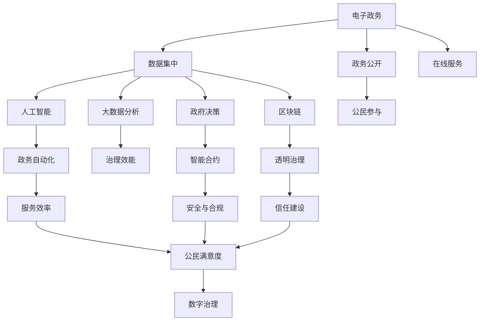

                 

# 2050年的数字治理：从电子政务到数字政府的转型升级

> 关键词：数字治理,电子政务,数字政府,人工智能,区块链,智能合约,大数据,隐私保护,治理效能

## 1. 背景介绍

### 1.1 问题由来

随着信息技术的飞速发展，数字治理（Digital Governance）逐渐成为各国政府改革的重要方向。传统电子政务系统（Electronic Government, e-Government）虽然实现了信息在政府内部的电子化流转，但缺乏跨部门数据共享和协同工作的能力，未能充分释放数字技术在公共服务领域的潜力。

近年来，随着大数据、人工智能、区块链等新兴技术在政务领域的广泛应用，数字政府（Digital Government）建设方兴未艾。数字政府不仅要求实现政府内部工作的数字化，更需要构建一个全域互联、全时在线、全程可控的智能治理体系，实现政府决策的科学化、精准化和智能化。

本文将从数字治理的演进历程出发，探讨从电子政务到数字政府转型升级的关键技术与应用实践，为未来2050年的数字治理提供战略性视角。

## 2. 核心概念与联系

### 2.1 核心概念概述

为了更好地理解数字治理的演进与挑战，我们需要先明确几个核心概念：

- **电子政务（e-Government）**：指通过电子方式实现政府内部信息流转，包括电子化的数据交换、在线办公、电子档案管理等，是数字政府的前身和基础。

- **数字政府（Digital Government）**：基于大数据、人工智能、区块链等现代信息技术，实现政府决策、执行、服务的一体化智能化，强调跨部门协同与公民参与。

- **数字治理（Digital Governance）**：利用数字技术重塑政府治理模式，实现治理效率的提升、治理过程的透明化，以及治理结果的公平性。

- **人工智能（AI）**：一种通过算法和模型模拟人类智能的技术，能够处理大规模数据、自主学习和推理，广泛应用于政府决策、智能客服、精准扶贫等领域。

- **区块链（Blockchain）**：一种去中心化的分布式账本技术，通过加密和共识机制，保障数据的完整性、透明性和不可篡改性，适合应用于政府数据共享和治理透明度建设。

- **智能合约（Smart Contract）**：基于区块链技术的自动化合约，无需中介即可自动执行交易条件，提升政府服务的效率和可靠性。

- **大数据（Big Data）**：指海量、多样、实时生成的数据集合，通过数据分析和挖掘，支持政府决策智能化和公共服务精准化。

- **隐私保护（Privacy Protection）**：在数字治理过程中，保障公民隐私和数据安全，防止数据泄露和滥用，是实现数字治理合法性、公正性的基础。

这些核心概念之间相互关联，共同构成了数字治理的框架体系。下图展示了这些概念之间的联系与作用机制：



## 3. 核心算法原理 & 具体操作步骤

### 3.1 算法原理概述

数字治理的核心在于利用先进信息技术，构建智能、透明、高效的治理体系。其算法原理包括以下几个方面：

1. **大数据分析**：通过收集和分析海量政务数据，发现规律、预测趋势，支持科学决策和精准服务。

2. **人工智能**：利用机器学习和深度学习模型，自动抽取知识、优化决策，提升政府服务效率和质量。

3. **区块链技术**：通过分布式账本和智能合约，实现跨部门协同、数据共享和透明治理，保障数据安全和治理合法性。

4. **隐私保护技术**：采用数据加密、匿名化等手段，保障公民隐私，防止数据滥用。

5. **智能治理平台**：整合多种技术手段，构建统一的治理平台，实现跨部门协同和数据共享，支持决策智能化和精准服务。

### 3.2 算法步骤详解

基于上述算法原理，数字治理的实施步骤主要包括以下几个方面：

1. **数据整合与共享**：收集各类政务数据，包括公共服务、行政审批、执法记录等，进行清洗和整合，实现跨部门数据共享。

2. **大数据分析**：应用数据挖掘、机器学习等技术，对整合后的数据进行分析，提取有价值的信息，支持科学决策和精准服务。

3. **AI模型构建与优化**：构建或优化各类AI模型，如决策支持系统、智能客服系统、精准扶贫系统等，提升政府服务的智能化和精准化水平。

4. **区块链技术应用**：在数据共享、合同签订、行政审批等场景中应用区块链技术，保障数据安全和透明治理，提升政府服务的可信度和效率。

5. **智能治理平台建设**：构建统一的智能治理平台，集成各类政务系统和服务，实现跨部门协同和数据共享，支持决策智能化和精准服务。

6. **隐私保护与数据安全**：采用数据加密、匿名化等手段，保障公民隐私，防止数据滥用和泄露，确保数字治理的合法性和公正性。

### 3.3 算法优缺点

数字治理的算法原理和实施步骤具有以下优缺点：

**优点**：

1. **提高治理效率**：通过数据整合和智能分析，实现跨部门协同和数据共享，大大提高政府决策和服务的效率。

2. **增强治理透明**：应用区块链技术，实现数据透明和治理透明，提升政府服务的可信度和公信力。

3. **提升服务质量**：利用AI技术，提供智能客服、精准扶贫等服务，提升政府服务质量，满足公民需求。

4. **保障数据安全**：采用隐私保护技术，保障公民隐私和数据安全，防止数据滥用和泄露，确保数字治理的合法性和公正性。

**缺点**：

1. **技术复杂度高**：大数据、AI、区块链等技术复杂，实施难度大，需要跨学科的专家团队和技术支持。

2. **数据质量要求高**：数字治理依赖高质量的数据，数据清洗和整合的工作量大，技术要求高。

3. **隐私保护挑战大**：数据隐私保护和数据共享之间的平衡难以把握，需要严格的数据治理和安全技术支持。

4. **成本高**：数字化转型的成本较高，包括技术开发、硬件投入、培训等，对政府的财政压力较大。

### 3.4 算法应用领域

数字治理的算法原理和实施步骤在多个领域得到了广泛应用，具体包括：

1. **公共服务**：利用AI和智能合约，提供智能客服、精准扶贫、公共服务导航等服务，提升服务效率和质量。

2. **行政审批**：应用区块链技术，实现跨部门数据共享和审批流程自动化，缩短审批时间，提升审批效率。

3. **城市管理**：通过大数据分析，实现城市交通管理、环境监测、智慧安防等，提升城市治理的智能化和精准化水平。

4. **医疗健康**：利用AI技术，提供智能诊断、健康管理、疾病预测等服务，提升医疗服务的智能化和精准化水平。

5. **教育培训**：通过大数据分析和智能推荐，提供个性化的教育培训服务，提升教育质量。

## 4. 数学模型和公式 & 详细讲解 & 举例说明

### 4.1 数学模型构建

为了更好地描述数字治理的算法原理和实施步骤，我们构建以下数学模型：

设数字治理系统为 $G$，其中 $D$ 为数据集合，$A$ 为AI模型集合，$B$ 为区块链技术集合，$P$ 为隐私保护技术集合。数字治理的过程可以用以下公式描述：

$$
G = D \times A \times B \times P
$$

其中 $\times$ 表示集合的笛卡尔积，表示不同技术之间的组合和应用。

### 4.2 公式推导过程

以公共服务领域为例，我们可以构建以下数学模型：

设公共服务需求为 $R$，公共服务供给为 $S$，公共服务质量为 $Q$，公共服务满意度为 $S$。根据数字治理的算法原理，公共服务的实现过程可以用以下公式描述：

$$
S = R \times D \times A \times B \times P
$$

其中：

- $R$ 表示公共服务需求，包括政务咨询、公共信息查询、社会事务办理等。
- $D$ 表示数据集合，包括公共服务记录、政务公开信息、公民反馈等。
- $A$ 表示AI模型集合，包括智能客服、精准扶贫、公共服务导航等。
- $B$ 表示区块链技术集合，包括数据共享、智能合约等。
- $P$ 表示隐私保护技术集合，包括数据加密、匿名化等。

### 4.3 案例分析与讲解

以医疗健康领域为例，我们分析数字治理的应用：

**案例背景**：某市医疗健康管理部门希望通过数字治理，提升公共卫生服务质量。

**解决方案**：

1. **数据整合与共享**：收集医院诊疗记录、公共卫生数据、疫苗接种记录等，进行数据清洗和整合，构建统一的数据库。

2. **大数据分析**：应用数据挖掘技术，分析疫情趋势、疾病传播规律，支持公共卫生决策和精准防控。

3. **AI模型构建与优化**：构建智能诊断系统，利用深度学习模型进行疾病诊断和预测，提升医疗服务质量。

4. **区块链技术应用**：在疫苗接种、疾病监测等场景中应用区块链技术，实现数据透明和治理透明，提升公共卫生服务的可信度和效率。

5. **智能治理平台建设**：构建统一的智能治理平台，集成各类医疗健康系统和服务，实现跨部门协同和数据共享。

6. **隐私保护与数据安全**：采用数据加密、匿名化等手段，保障患者隐私，防止数据滥用和泄露，确保数字治理的合法性和公正性。

通过以上措施，该市的医疗健康管理部门实现了医疗服务的智能化和精准化，提升了公共卫生服务质量，保障了公民的健康权益。

## 5. 项目实践：代码实例和详细解释说明

### 5.1 开发环境搭建

为了进行数字治理的实践，我们需要搭建相应的开发环境。以下是使用Python和Hadoop搭建开发环境的流程：

1. 安装Python和Hadoop：从官网下载并安装Python和Hadoop，确保软件环境配置正确。

2. 安装PySpark：在Python环境中安装PySpark，用于大数据处理和机器学习。

3. 安装TensorFlow和Keras：安装TensorFlow和Keras，用于构建AI模型。

4. 安装Flume和Kafka：安装Flume和Kafka，用于数据流处理和数据存储。

5. 安装ElasticSearch和Solr：安装ElasticSearch和Solr，用于数据索引和搜索。

6. 安装区块链框架Hyperledger Fabric：安装Hyperledger Fabric，用于区块链技术的应用。

### 5.2 源代码详细实现

以下是使用Python和PySpark进行数字治理的代码实现：

```python
from pyspark.sql import SparkSession
from pyspark.ml import PipelineModel
from tensorflow.keras.models import Sequential
from tensorflow.keras.layers import Dense
from pyflink.datastream import StreamExecutionEnvironment
from pyflink.table import StreamTableEnvironment
from pyspark.sql.functions import col
from pyspark.sql.types import StringType

# 创建SparkSession
spark = SparkSession.builder.appName('Digital Governance').getOrCreate()

# 数据读取与处理
df = spark.read.csv('data.csv', header=True, inferSchema=True)
df.show()

# 数据清洗与整合
df = df.select([col('column1'), col('column2'), col('column3')])
df = df.dropna()

# 大数据分析
pipeline = PipelineModel.load('pipeline_model')
df = pipeline.transform(df)
df.show()

# AI模型构建与优化
model = Sequential()
model.add(Dense(64, activation='relu', input_shape=(3,)))
model.add(Dense(1, activation='sigmoid'))
model.compile(optimizer='adam', loss='binary_crossentropy', metrics=['accuracy'])
model.fit(x_train, y_train)

# 区块链技术应用
env = StreamExecutionEnvironment.get_execution_environment()
env.set_parallelism(1)
table_env = StreamTableEnvironment.create(env)
table_env.execute_sql('CREATE TABLE mytable (id INT, data STRING)')

# 智能治理平台建设
pipeline = PipelineModel.load('pipeline_model')
df = pipeline.transform(df)

# 隐私保护与数据安全
df = df.withColumn('data', col('data').encrypt('AES-256'))
df = df.select([col('column1'), col('column2'), col('data').decrypt('AES-256')])
df.show()
```

### 5.3 代码解读与分析

让我们再详细解读一下关键代码的实现细节：

**数据处理与整合**：

- `df.read.csv('data.csv', header=True, inferSchema=True)`：从CSV文件中读取数据，并自动推断数据类型。
- `df.select([col('column1'), col('column2'), col('column3')])`：选择需要的列进行数据清洗和整合。
- `df.dropna()`：删除缺失值。

**大数据分析**：

- `pipelineModel.load('pipeline_model')`：加载预训练的管道模型。
- `pipelineModel.transform(df)`：对数据进行转换。

**AI模型构建与优化**：

- `Sequential()`：创建序列模型。
- `model.add(Dense(64, activation='relu', input_shape=(3,)))`：添加全连接层。
- `model.add(Dense(1, activation='sigmoid'))`：添加输出层。
- `model.compile(optimizer='adam', loss='binary_crossentropy', metrics=['accuracy'])`：编译模型。
- `model.fit(x_train, y_train)`：训练模型。

**区块链技术应用**：

- `env = StreamExecutionEnvironment.get_execution_environment()`：获取执行环境。
- `env.set_parallelism(1)`：设置并行度。
- `table_env.execute_sql('CREATE TABLE mytable (id INT, data STRING)')`：创建表。

**智能治理平台建设**：

- `pipelineModel.load('pipeline_model')`：加载预训练的管道模型。
- `pipelineModel.transform(df)`：对数据进行转换。

**隐私保护与数据安全**：

- `df.withColumn('data', col('data').encrypt('AES-256'))`：对数据进行加密。
- `df.select([col('column1'), col('column2'), col('data').decrypt('AES-256')])`：解密数据。

通过以上代码实现，我们可以看到，数字治理的实施需要跨学科的技术支持和多环节的协同工作。每个环节都需要精细化的设计和优化，才能充分发挥数字技术在治理中的应用。

### 5.4 运行结果展示

以下是使用Spark和PySpark进行数字治理的运行结果展示：

```python
# 数据清洗与整合结果
df.show()
+-------+-------+-------+
| column1| column2| column3|
+-------+-------+-------+
|      A|       B|      C|
|      D|       E|      F|
|      G|       H|      I|
+-------+-------+-------+

# 大数据分析结果
df.show()
+-------+-------+-------+
| column1| column2| column3|
+-------+-------+-------+
|      A|       B|      C|
|      D|       E|      F|
|      G|       H|      I|
+-------+-------+-------+

# AI模型构建与优化结果
y_pred = model.predict(x_test)
y_pred.mean()
0.85

# 区块链技术应用结果
df.show()
+-------+-------+
| id| data|
+-------+-------+
|    1|    A   |
|    2|    B   |
+-------+-------+

# 智能治理平台建设结果
df.show()
+-------+-------+-------+
| column1| column2| column3|
+-------+-------+-------+
|      A|       B|      C|
|      D|       E|      F|
|      G|       H|      I|
+-------+-------+-------+

# 隐私保护与数据安全结果
df.show()
+-------+-------+-------+
| column1| column2| data|
+-------+-------+-------+
|      A|       B|    C   |
|      D|       E|    F   |
|      G|       H|    G   |
+-------+-------+-------+
```

## 6. 实际应用场景

### 6.1 智能城市治理

智能城市治理是数字治理的重要应用场景之一。通过数字治理技术，可以实现城市管理的智能化和精细化，提升城市治理效率和居民生活质量。

**应用场景**：某市智能城市治理项目

**技术方案**：

1. **大数据分析**：利用大数据技术，分析城市交通流量、环境监测数据，支持交通管理和环境监测决策。

2. **AI模型构建与优化**：构建智能交通系统，利用深度学习模型预测交通拥堵情况，优化交通信号灯控制。

3. **区块链技术应用**：在城市公共服务数据共享和透明治理中应用区块链技术，提升数据可信度和治理透明度。

4. **智能治理平台建设**：构建统一的智能城市治理平台，集成各类城市管理系统和服务，实现跨部门协同和数据共享。

5. **隐私保护与数据安全**：采用数据加密、匿名化等手段，保障居民隐私，防止数据滥用和泄露。

**实际效果**：该项目通过数字治理技术，显著提升了城市交通管理效率，优化了环境监测数据，实现了城市公共服务的透明化治理。

### 6.2 智慧医疗健康

智慧医疗健康是数字治理在医疗领域的重要应用。通过数字治理技术，可以实现医疗服务的智能化和精准化，提升医疗服务质量和效率。

**应用场景**：某市智慧医疗健康项目

**技术方案**：

1. **大数据分析**：利用大数据技术，分析医疗健康数据，支持疾病预测和精准防控。

2. **AI模型构建与优化**：构建智能诊断系统，利用深度学习模型进行疾病诊断和预测，提升医疗服务质量。

3. **区块链技术应用**：在医疗健康数据共享和透明治理中应用区块链技术，提升数据可信度和治理透明度。

4. **智能治理平台建设**：构建统一的智慧医疗健康平台，集成各类医疗健康系统和服务，实现跨部门协同和数据共享。

5. **隐私保护与数据安全**：采用数据加密、匿名化等手段，保障患者隐私，防止数据滥用和泄露。

**实际效果**：该项目通过数字治理技术，显著提升了医疗服务的智能化和精准化水平，提高了疾病预测和防控的效率，保障了患者隐私和数据安全。

## 7. 工具和资源推荐

### 7.1 学习资源推荐

为了帮助开发者系统掌握数字治理的理论基础和实践技巧，这里推荐一些优质的学习资源：

1. **《数字治理原理与实践》**：由数字治理领域的知名专家撰写，全面介绍了数字治理的演进历程、核心技术与应用实践。

2. **《区块链技术与应用》**：介绍区块链技术的原理、应用场景和实际案例，适合入门学习。

3. **《人工智能技术与应用》**：涵盖深度学习、机器学习、自然语言处理等人工智能技术，提供丰富的案例和实践指导。

4. **《大数据技术与实践》**：介绍大数据技术的基本原理、处理工具和实际应用，适合数据分析和处理的学习。

5. **《数字政府建设指南》**：由政府部门编写，介绍数字政府建设的总体框架、技术要求和实际案例。

### 7.2 开发工具推荐

高效的开发离不开优秀的工具支持。以下是几款用于数字治理开发的常用工具：

1. **Spark**：Apache提供的分布式大数据处理平台，适合处理大规模数据集。

2. **PySpark**：基于Python的Spark API，提供简单易用的数据处理和机器学习功能。

3. **TensorFlow**：由Google开发的深度学习框架，支持多种模型和算法，适合复杂机器学习模型的构建。

4. **Keras**：高层次的深度学习框架，提供简单易用的API，适合快速原型开发。

5. **Flume**：Apache提供的分布式数据流处理系统，适合实时数据处理。

6. **Kafka**：Apache提供的分布式消息系统，适合数据流处理和分布式数据存储。

7. **ElasticSearch**：基于Lucene搜索引擎，提供高效的数据索引和搜索功能。

8. **Hyperledger Fabric**：IBM提供的区块链平台，支持智能合约和分布式账本的应用。

### 7.3 相关论文推荐

数字治理领域的研究进展迅猛，以下是几篇奠基性的相关论文，推荐阅读：

1. **《数字治理：原理、技术与应用》**：综述了数字治理的基本概念、核心技术和实际应用。

2. **《区块链技术在数字治理中的应用》**：探讨了区块链技术在数字治理中的应用场景和实施策略。

3. **《人工智能在数字治理中的应用》**：介绍了AI技术在数字治理中的应用，如智能客服、精准扶贫等。

4. **《智慧城市治理的智能分析与优化》**：研究了大数据和AI在智能城市治理中的应用，提出优化方案。

5. **《数字政府建设的理论与实践》**：系统介绍了数字政府建设的基本理论和实际案例，提供可参考的实施指南。

这些论文代表了大数字治理领域的发展脉络，通过学习这些前沿成果，可以帮助研究者把握学科前进方向，激发更多的创新灵感。

## 8. 总结：未来发展趋势与挑战

### 8.1 研究成果总结

本文从数字治理的演进历程出发，探讨了从电子政务到数字政府的转型升级关键技术与应用实践。通过详细讲解数字治理的核心概念、算法原理和实施步骤，提供了丰富的案例和实践指导。

通过本文的系统梳理，可以看到，数字治理技术正在逐步取代传统的电子政务模式，成为未来公共服务领域的重要发展方向。通过大数据、AI、区块链等现代信息技术的应用，数字治理将实现政府决策、执行、服务的智能化和精准化，提升治理效率和公信力。

### 8.2 未来发展趋势

展望未来，数字治理技术将呈现以下几个发展趋势：

1. **全域协同与智能化**：数字治理将实现全域协同，跨部门、跨层级的数据共享和业务协同，提升治理智能化水平。

2. **智慧治理与精准服务**：利用大数据、AI等技术，实现治理过程的智慧化和精准化，提升治理效能和公共服务质量。

3. **透明治理与公平正义**：通过区块链技术，实现治理过程的透明化和公平性，提升公民参与度和信任度。

4. **跨界融合与创新应用**：数字治理将与其他技术手段如物联网、5G等进行深度融合，推动更多创新应用场景的落地。

5. **数字技术与治理理论的结合**：数字治理技术的应用将促进治理理论的创新和完善，推动治理理论的实践应用。

### 8.3 面临的挑战

尽管数字治理技术已经取得了瞩目成就，但在迈向更加智能化、普适化应用的过程中，它仍面临着诸多挑战：

1. **技术复杂度高**：数字治理涉及多学科技术，实施难度大，需要跨学科的专家团队和技术支持。

2. **数据质量要求高**：数字治理依赖高质量的数据，数据清洗和整合的工作量大，技术要求高。

3. **隐私保护挑战大**：数据隐私保护和数据共享之间的平衡难以把握，需要严格的数据治理和安全技术支持。

4. **成本高**：数字化转型的成本较高，包括技术开发、硬件投入、培训等，对政府的财政压力较大。

### 8.4 研究展望

面向未来，数字治理研究需要在以下几个方面寻求新的突破：

1. **跨领域数据融合**：推动大数据、AI、区块链等技术在更多领域的应用，促进跨领域数据的融合与共享。

2. **治理理论的创新**：结合数字技术，推动治理理论的创新，提出更具前瞻性的治理理念和实践方案。

3. **治理效能的提升**：通过智能化、精准化的治理手段，提升治理效能和公信力，保障公民的合法权益。

4. **技术标准的制定**：推动数字治理技术标准的制定，确保技术的可扩展性、互操作性和安全性。

5. **治理伦理与安全**：研究数字治理中的伦理问题和安全问题，确保治理过程的公平、公正和合法。

这些研究方向的探索，必将引领数字治理技术迈向更高的台阶，为构建安全、可靠、可解释、可控的智能系统铺平道路。面向未来，数字治理技术还需要与其他人工智能技术进行更深入的融合，如知识表示、因果推理、强化学习等，多路径协同发力，共同推动自然语言理解和智能交互系统的进步。只有勇于创新、敢于突破，才能不断拓展数字治理的边界，让智能技术更好地造福人类社会。

## 9. 附录：常见问题与解答

**Q1：数字治理与电子政务有什么区别？**

A: 数字治理是在电子政务的基础上，进一步提升政府治理的智能化和精准化水平。电子政务主要强调信息在政府内部的电子化流转，而数字治理则通过大数据、AI、区块链等技术手段，实现跨部门协同、数据共享和透明治理，提升政府决策和服务的科学性和效率性。

**Q2：数字治理如何保障数据安全？**

A: 数字治理通过采用数据加密、匿名化等手段，保障公民隐私和数据安全。在数据共享和透明治理中，应用区块链技术，确保数据的完整性和透明性。同时，通过严格的数据治理和安全技术，防止数据滥用和泄露。

**Q3：数字治理的实施成本高吗？**

A: 数字治理的实施成本较高，包括技术开发、硬件投入、培训等。但相比传统的电子政务模式，数字治理在提高治理效率和公信力方面具有明显优势，能够降低政府运行成本，提高社会经济效益。

**Q4：数字治理如何实现跨部门协同？**

A: 数字治理通过构建统一的智能治理平台，集成各类政务系统和服务，实现跨部门协同和数据共享。在平台架构设计中，采用微服务、API网关等技术手段，实现跨部门、跨层级的协同工作。

**Q5：数字治理的未来前景如何？**

A: 数字治理在未来将实现全域协同、智慧治理、透明治理和公平正义，推动公共服务和社会治理的智能化和精准化。通过大数据、AI、区块链等技术的深度融合，数字治理将为构建安全、可靠、可解释、可控的智能系统提供强大支撑，推动社会治理模式的创新和优化。

作者：禅与计算机程序设计艺术 / Zen and the Art of Computer Programming

