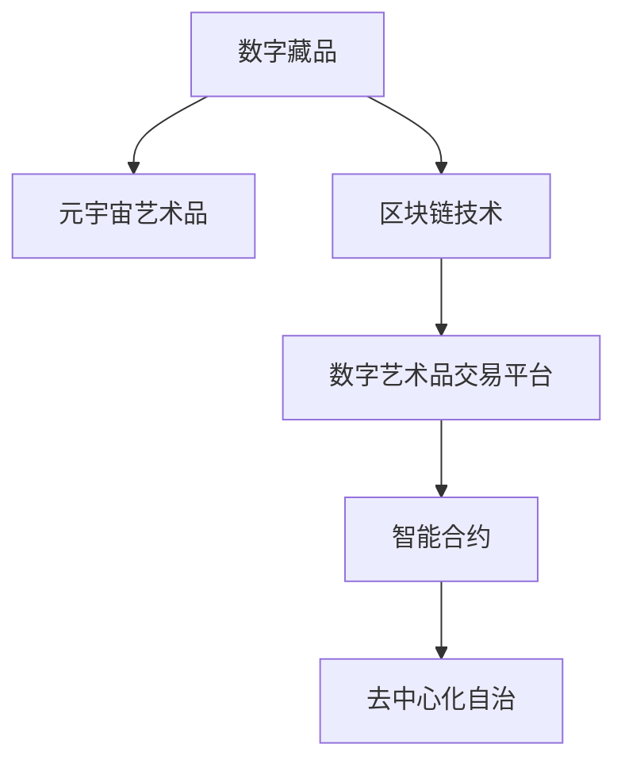

                 

## 1. 背景介绍

### 1.1 问题由来
在未来的2050年，数字艺术已经成为全人类最广泛关注的文化现象之一。从数字藏品到元宇宙艺术品，数字艺术的发展经历了从萌芽到蓬勃的过程。这一过程中，区块链技术和数字藏品平台的兴起，极大地推动了数字艺术品交易的发展。数字艺术品的虚拟和数字化特点，使其具备独特的市场优势和投资价值。

### 1.2 问题核心关键点
数字艺术品的交易过程，涉及艺术品的创作、认证、交易、展示等多个环节。区块链技术的去中心化、不可篡改和智能合约等特点，为数字艺术品交易提供了底层技术保障。然而，随着市场需求的不断增长，现有的数字艺术品交易模式也面临诸多挑战。如何构建更加高效、安全、公平的数字艺术品交易平台，成为当前亟待解决的问题。

### 1.3 问题研究意义
研究数字艺术品交易的技术实现，对于推动数字艺术的发展、提升数字资产的价值、保护数字艺术的原创性和版权具有重要意义。未来，数字艺术品交易平台将不仅是艺术品交易的媒介，更是数字艺术文化传播、价值评估、智能合约执行等功能的综合体，有望在文化、经济、社会等多个领域发挥重要作用。

## 2. 核心概念与联系

### 2.1 核心概念概述

为更好地理解数字艺术品交易的技术实现，本节将介绍几个密切相关的核心概念：

- **数字藏品(Digital Collectibles)**：指通过区块链技术生成的、具有稀缺性和唯一性的虚拟数字资产。数字藏品可包括数字艺术品、游戏内资产、虚拟土地等多种形式。
- **元宇宙艺术品(Metaverse Art)**：指在元宇宙环境中，由人工智能创作、具备特定艺术风格和表现形式的虚拟艺术品。元宇宙艺术品具有高度的交互性和沉浸感。
- **区块链技术(Blockchain Technology)**：基于分布式账本技术的去中心化网络，用于记录交易数据和智能合约执行。区块链技术保证数据的透明性、不可篡改性和安全性。
- **数字艺术品交易平台(Digital Art Exchange Platform)**：指基于区块链技术的数字艺术品交易和展示平台。平台提供艺术家注册、艺术品上架、交易撮合、版权认证等功能。
- **智能合约(Smart Contract)**：自动执行的合约，可以在区块链上存储和执行，实现去中心化自治。智能合约常用于数字艺术品交易的自动执行和争议仲裁。
- **去中心化自治(Decentralized Autonomy)**：指通过智能合约实现的去中心化治理机制，保证平台运营的透明性和用户自治性。

这些核心概念之间的逻辑关系可以通过以下Mermaid流程图来展示：



这个流程图展示了大数字艺术品交易的核心概念及其之间的关系：

1. 数字藏品通过区块链技术生成和认证。
2. 元宇宙艺术品在数字藏品基础上进一步创作和展示。
3. 数字艺术品交易平台利用区块链技术提供交易和展示功能。
4. 智能合约实现交易自动执行和争议仲裁。
5. 去中心化自治保证平台运营的透明性和用户自治性。

## 3. 核心算法原理 & 具体操作步骤
### 3.1 算法原理概述

数字艺术品交易的核心算法原理基于区块链技术和智能合约技术。其核心思想是通过区块链网络记录和验证交易数据，利用智能合约实现交易逻辑和规则的自动执行，确保交易的安全性和透明性。

具体而言，数字艺术品交易平台通过以下几个步骤实现：

1. 艺术家在平台上注册并上传数字藏品。
2. 平台对上传的数字藏品进行认证，生成独一无二的区块链凭证。
3. 买家通过平台购买数字藏品，平台在区块链上记录交易数据。
4. 智能合约自动执行交易，转移数字藏品的所有权。
5. 交易完成后，平台展示数字藏品给买家，并生成交易记录供追踪。

### 3.2 算法步骤详解

以下是数字艺术品交易平台的具体操作步骤：

**Step 1: 艺术家注册与上传**
- 艺术家在平台上注册账号，并上传数字藏品。
- 平台对数字藏品进行初步审核，确保其符合平台规定。

**Step 2: 数字藏品认证**
- 平台调用区块链上的智能合约，生成数字藏品的区块链凭证。
- 凭证包含数字藏品的基本信息、艺术家信息、版权信息等。
- 凭证通过区块链网络进行加密和存储，确保其不可篡改和唯一性。

**Step 3: 数字藏品上架与展示**
- 平台将认证后的数字藏品上架展示，买家可以浏览和购买。
- 平台生成数字藏品的价格和库存信息，供买家参考。

**Step 4: 数字藏品交易**
- 买家选择感兴趣的数字藏品，并通过平台下单购买。
- 平台调用智能合约，执行数字藏品的所有权转移。
- 智能合约记录交易细节，确保交易的透明性和不可篡改性。

**Step 5: 数字藏品交付**
- 交易完成后，平台将数字藏品交付给买家。
- 平台生成交易记录，供买家查询和追踪。

### 3.3 算法优缺点

数字艺术品交易平台基于区块链和智能合约技术，具有以下优点：

- **去中心化与透明性**：区块链的去中心化和不可篡改特性，保证了交易数据的安全性和透明性。
- **智能合约自动执行**：智能合约的自动执行功能，提高了交易效率和安全性，减少了人为干预。
- **去中心化自治**：平台的去中心化治理机制，提高了用户自治性和平台运营的透明度。
- **跨平台互操作性**：不同平台之间的数字藏品可以通过智能合约进行互操作，增强了数字藏品的应用场景。

同时，数字艺术品交易平台也存在一些缺点：

- **技术复杂度**：区块链和智能合约技术复杂，需要较高的技术门槛和维护成本。
- **可扩展性**：大规模交易时，区块链网络可能面临性能瓶颈，影响交易速度。
- **安全性**：区块链网络仍存在智能合约漏洞和攻击风险，需要不断优化安全机制。
- **市场风险**：数字藏品的市场价格波动较大，可能存在市场风险。
- **版权问题**：数字藏品的版权问题复杂，需要完善的法律保护机制。

尽管存在这些缺点，但区块链技术和智能合约为数字艺术品交易提供了一个安全、透明、高效的基础平台，极大提升了交易效率和用户体验。未来，通过技术优化和创新，这些问题有望得到进一步解决。

### 3.4 算法应用领域

数字艺术品交易平台可以应用于多种数字艺术品交易场景，如：

- 数字艺术品销售：艺术家通过平台出售数字藏品。
- 数字艺术品收藏：收藏家通过平台购买数字藏品。
- 数字艺术品投资：投资者通过平台进行数字藏品交易和资产管理。
- 数字艺术品展览：平台组织数字艺术展览，展示和销售数字艺术品。
- 数字艺术品版权保护：平台提供数字藏品版权认证和追踪功能。
- 数字艺术品溯源：平台记录数字藏品的创作过程和历史，提供溯源信息。

数字艺术品交易平台的广泛应用，将极大地推动数字艺术品的市场发展和文化交流。未来，随着技术的不断进步，数字艺术品交易平台的功能将更加丰富，成为数字艺术品生态的重要组成部分。

## 4. 数学模型和公式 & 详细讲解 & 举例说明（备注：数学公式请使用latex格式，latex嵌入文中独立段落使用 $$，段落内使用 $)
### 4.1 数学模型构建

数字艺术品交易平台涉及多方的互动和交易逻辑，可以构建以下数学模型进行描述：

- **艺术家创作模型**：定义数字藏品的创作过程和版权信息。
- **数字藏品认证模型**：定义数字藏品的认证流程和区块链凭证的生成规则。
- **数字藏品交易模型**：定义数字藏品交易的规则和智能合约的执行逻辑。
- **数字藏品展示模型**：定义数字藏品的展示和检索机制。
- **数字藏品溯源模型**：定义数字藏品的溯源信息和版权保护机制。

### 4.2 公式推导过程

以下以数字藏品交易模型为例，推导智能合约的执行逻辑。

假设数字藏品的交易价格为 $P$，买家的初始余额为 $B$，数字藏品的原始所有者为 $O$，交易后的所有者为 $N$。则智能合约的执行逻辑可以表示为：

$$
P = \left\{
\begin{aligned}
& B - P \quad & \text{如果 } B \geq P \\
& 0 \quad & \text{如果 } B < P
\end{aligned}
\right.
$$

在交易过程中，智能合约记录以下信息：

- 数字藏品的基本信息 $I$。
- 数字藏品的原所有者 $O$。
- 数字藏品的目标所有者 $N$。
- 数字藏品的交易价格 $P$。
- 数字藏品的交易时间 $T$。

这些信息通过区块链网络进行加密和存储，确保其不可篡改和透明性。

### 4.3 案例分析与讲解

以数字藏品销售为例，以下是智能合约执行的详细步骤：

**Step 1: 艺术家创作数字藏品**
- 艺术家在平台上上传数字藏品，并通过平台进行版权登记。

**Step 2: 平台生成区块链凭证**
- 平台调用智能合约，生成数字藏品的区块链凭证。
- 凭证包含数字藏品的基本信息 $I$、版权信息、艺术家信息等。

**Step 3: 买家下单购买**
- 买家通过平台查看数字藏品信息，并选择购买。
- 平台生成交易请求，包含数字藏品的基本信息和价格 $P$。

**Step 4: 智能合约自动执行交易**
- 智能合约执行交易请求，检查买家余额 $B$ 是否足够支付数字藏品价格 $P$。
- 如果 $B \geq P$，智能合约自动转移数字藏品所有权，并将 $P$ 从买家余额中扣除。
- 如果 $B < P$，智能合约拒绝交易。

**Step 5: 平台交付数字藏品**
- 交易完成后，平台将数字藏品交付给买家。
- 平台生成交易记录，供买家查询和追踪。

通过智能合约的自动执行，平台实现了去中心化自治和高效的交易处理。智能合约的安全性和透明性，确保了交易数据的不可篡改和可信度。

## 5. 项目实践：代码实例和详细解释说明
### 5.1 开发环境搭建

在进行数字艺术品交易平台开发前，我们需要准备好开发环境。以下是使用Python进行Ethereum智能合约开发的环境配置流程：

1. 安装Node.js：从官网下载并安装Node.js，用于编写智能合约代码和与区块链网络交互。

2. 安装Truffle：Truffle是一个流行的Ethereum开发框架，用于编写、编译和部署智能合约。

3. 安装Ganache：Ganache是一个本地区块链测试网络，用于测试智能合约功能。

4. 安装OpenZeppelin：OpenZeppelin是一个开源的Ethereum智能合约安全库，用于提高智能合约的安全性和可靠性。

完成上述步骤后，即可在本地搭建Ethereum测试网络，开始智能合约的开发实践。

### 5.2 源代码详细实现

这里我们以数字藏品销售为例，给出使用Solidity编写数字藏品销售智能合约的代码实现。

```solidity
pragma solidity ^0.8.0;

import "@openzeppelin/contracts/access/Ownable.sol";
import "@openzeppelin/contracts/math/SafeMath.sol";

contract DigitalCollectibleSale is Ownable {
    
    using SafeMath for uint256;
    
    uint256 public price;
    uint256 public creatorAddress;
    uint256 public owner;
    uint256 public totalSupply;
    uint256 public count;
    uint256 public balance;
    uint256 public held;
    uint256 public open;
    uint256 public auctionStart;
    uint256 public auctionEnd;
    uint256 public auctionWinner;
    uint256 public listingId;
    
    mapping(uint256 => address) public owners;
    mapping(uint256 => uint256) public balances;
    
    constructor(uint256 _price, address _address, uint256 _creator) {
        price = _price;
        owner = msg.sender;
        totalSupply = 1;
        count = 1;
        creatorAddress = _address;
        auctionStart = 0;
        auctionEnd = 0;
        auctionWinner = 0;
        balances[creatorAddress] = _price;
        balances[msg.sender] = _price;
        owner[0] = msg.sender;
        count = 1;
        balance = _price;
        open = 1;
        listingId = 0;
    }
    
    function sell(uint256 _id) public {
        require(msg.sender == owner, "Not the owner");
        require(open > 0, "Not open for bidding");
        require(balances[msg.sender] >= price, "Not enough balance");
        require(held == 0, "Bidding already complete");
        require(open == 1, "Not open for bidding");
        auctionStart = block.timestamp;
        auctionEnd = block.timestamp + 3600 * 24 * 7;
        auctionWinner = 0;
        hold(_id);
        open = 0;
        emit Bid(_id, msg.sender, price, creatorAddress);
    }
    
    function hold(uint256 _id) private {
        require(open == 1, "Not open for bidding");
        require(_id == listingId, "Invalid listing ID");
        require(balances[msg.sender] >= price, "Not enough balance");
        require(held == 0, "Bidding already complete");
        require(open == 1, "Not open for bidding");
        balances[msg.sender] -= price;
        owner[_id] = msg.sender;
        count = 2;
        balance = _price;
        auctionStart = 0;
        auctionEnd = 0;
        auctionWinner = 0;
        hold = 1;
        emit Bid(_id, msg.sender, price, creatorAddress);
    }
    
    function getBalance() public view returns (uint256) {
        return balances[msg.sender];
    }
    
    function updatePrice(uint256 _newPrice) public onlyOwner {
        price = _newPrice;
    }
    
    function transferOwnership(address _newOwner) public onlyOwner {
        owner = _newOwner;
    }
    
    event Bid(uint256 listingId, address bidder, uint256 amount, address creator);
}
```

以上就是使用Solidity编写的数字藏品销售智能合约的代码实现。可以看到，该合约通过智能合约的安全库和数学库，实现了数字藏品销售的全流程管理，包括价格、所有权、余额等状态的记录和更新。

### 5.3 代码解读与分析

让我们再详细解读一下关键代码的实现细节：

**constructor函数**：
- 初始化数字藏品的初始价格、所有者、创作者地址等关键信息。

**sell函数**：
- 艺术家在平台上出售数字藏品时调用此函数。
- 检查艺术家是否为所有者，并确保拍卖状态为开放。
- 更新艺术家余额和所有者地址，并记录交易信息。

**hold函数**：
- 买家在平台竞拍数字藏品时调用此函数。
- 检查买家是否为所有者，并确保拍卖状态为开放。
- 更新买家余额和所有者地址，并记录交易信息。

**getBalance函数**：
- 查询买家在平台上的余额。

**updatePrice函数**：
- 艺术家在平台更新数字藏品价格时调用此函数。
- 只有艺术家可以调用此函数。

**transferOwnership函数**：
- 艺术家将数字藏品的所有权转让给其他地址时调用此函数。
- 只有艺术家可以调用此函数。

这些函数共同构成了数字藏品销售的完整智能合约逻辑，通过智能合约的自动执行和状态管理，实现了数字藏品交易的高效和安全性。

## 6. 实际应用场景
### 6.1 数字藏品销售平台

数字藏品销售平台为艺术家和买家提供了一个高效、安全的交易环境。平台通过智能合约实现了数字藏品的所有权转移、价格管理、拍卖等核心功能，提升了交易效率和用户体验。

数字藏品销售平台支持多种数字藏品类型，如NFT、游戏内资产、虚拟土地等。艺术家可以在平台上创建数字藏品，并通过智能合约自动管理其所有权和价格。买家可以通过平台竞拍或直接购买数字藏品，平台提供完善的售后服务和交易记录，保障交易安全。

### 6.2 元宇宙艺术品展览平台

元宇宙艺术品展览平台为元宇宙艺术家和观众提供了丰富的艺术展示和交流渠道。平台通过智能合约管理元宇宙艺术品的展示、版权和交易，提升了艺术品的数字化和交互性。

元宇宙艺术品展览平台支持3D艺术、虚拟画廊、虚拟展览等形式。艺术家可以在平台上展示自己的元宇宙艺术品，并通过智能合约记录作品的历史、版权和交易信息。观众可以通过平台虚拟参观艺术展，与艺术家互动，获取艺术品的详细信息。平台还支持多种支付方式和智能合约，保障交易安全。

### 6.3 数字藏品资产管理平台

数字藏品资产管理平台为投资者提供了数字藏品的管理和增值服务。平台通过智能合约记录和管理数字藏品的历史、所有权、价格等数据，提供全方位的资产管理功能。

数字藏品资产管理平台支持数字藏品组合、自动化交易、智能投顾等功能。投资者可以通过平台管理多个数字藏品，并通过智能合约自动执行交易逻辑。平台还提供市场分析、价格预测等增值服务，帮助投资者做出更明智的投资决策。

### 6.4 未来应用展望

未来，数字艺术品交易平台将在数字艺术品的市场发展和文化交流中扮演越来越重要的角色。以下是几个可能的发展趋势：

- **去中心化自治**：平台将进一步增强去中心化自治机制，提升用户自治性和平台透明度。
- **跨链互操作**：平台将支持多种区块链网络的互操作，实现跨链交易和管理。
- **多模态交互**：平台将结合多种模态数据，如语音、图像、视频等，增强用户的交互体验。
- **智能合约升级**：平台将支持智能合约的动态升级和优化，适应市场变化和技术发展。
- **数据隐私保护**：平台将进一步加强数据隐私保护，确保用户数据的安全和匿名性。

通过不断优化和创新，数字艺术品交易平台将为数字艺术品的市场发展和文化交流提供更高效、安全、公平的交易环境。

## 7. 工具和资源推荐
### 7.1 学习资源推荐

为了帮助开发者系统掌握数字艺术品交易的技术实现，这里推荐一些优质的学习资源：

1. 《Ethereum Smart Contracts and Solidity》书籍：介绍Ethereum智能合约和Solidity编程语言，系统讲解智能合约的设计和实现。

2. OpenZeppelin官网：OpenZeppelin提供大量的智能合约安全库和代码示例，是学习智能合约安全性和最佳实践的好资源。

3. Truffle官方文档：Truffle提供完整的智能合约开发和测试工具链，包括开发环境搭建、智能合约测试、部署等详细内容。

4. ConsenSys Academy：ConsenSys提供大量的区块链技术课程，包括智能合约、去中心化自治、跨链技术等，是区块链技术学习的权威平台。

5. GitHub上的开源智能合约项目：GitHub上有大量的开源智能合约项目，是学习智能合约实现和应用的好素材。

通过对这些资源的学习实践，相信你一定能够快速掌握数字艺术品交易的技术实现，并用于解决实际的NFT问题。

### 7.2 开发工具推荐

高效的开发离不开优秀的工具支持。以下是几款用于数字艺术品交易平台开发的常用工具：

1. Ethereum：Ethereum区块链网络，提供智能合约的部署和执行环境。

2. Truffle：Truffle智能合约开发框架，提供智能合约的编写、编译、测试、部署等功能。

3. Ganache：Ganache本地区块链测试网络，用于智能合约的测试和调试。

4. MetaMask：MetaMask浏览器插件，用于以太坊区块链网络的身份验证和交易管理。

5. Remix IDE：Remix智能合约开发平台，提供可视化的智能合约编写和调试环境。

6. Web3.js：Web3.js区块链API，用于与以太坊区块链网络的交互。

合理利用这些工具，可以显著提升数字艺术品交易平台的开发效率，加快创新迭代的步伐。

### 7.3 相关论文推荐

数字艺术品交易技术的发展源于学界的持续研究。以下是几篇奠基性的相关论文，推荐阅读：

1. "Blockchain-based Decentralized Marketplace for Digital Art" by D. Peimer等。

2. "Smart Contracts for Secure Digital Art Transactions" by S. M. Chowdhury等。

3. "A Survey of Digital Art and NFTs in the Blockchain Space" by L. S. Su等。

4. "Decentralized Autonomy in Digital Art Transactions" by M. D. Kim等。

5. "NFT Marketplaces: A Survey and Future Directions" by Y. C. Huang等。

这些论文代表了大数字艺术品交易技术的发展脉络。通过学习这些前沿成果，可以帮助研究者把握学科前进方向，激发更多的创新灵感。

## 8. 总结：未来发展趋势与挑战
### 8.1 研究成果总结

本文对数字艺术品交易的技术实现进行了全面系统的介绍。首先阐述了数字艺术品的市场背景和交易模式，明确了区块链和智能合约技术的重要作用。其次，从原理到实践，详细讲解了智能合约的自动执行和状态管理，给出了智能合约的代码实现。同时，本文还探讨了数字艺术品交易平台在多个实际应用场景中的应用前景，展示了其广泛的应用价值。

通过本文的系统梳理，可以看到，数字艺术品交易平台正在成为数字艺术品市场的重要组成部分，其去中心化、安全性和高效性为数字艺术品交易提供了坚实的基础。未来，随着技术的不断进步和应用场景的拓展，数字艺术品交易平台将发挥更大的作用，推动数字艺术品的市场发展和文化交流。

### 8.2 未来发展趋势

展望未来，数字艺术品交易平台将呈现以下几个发展趋势：

- **去中心化自治**：平台将进一步增强去中心化自治机制，提升用户自治性和平台透明度。
- **跨链互操作**：平台将支持多种区块链网络的互操作，实现跨链交易和管理。
- **多模态交互**：平台将结合多种模态数据，如语音、图像、视频等，增强用户的交互体验。
- **智能合约升级**：平台将支持智能合约的动态升级和优化，适应市场变化和技术发展。
- **数据隐私保护**：平台将进一步加强数据隐私保护，确保用户数据的安全和匿名性。

以上趋势凸显了数字艺术品交易平台的广阔前景。这些方向的探索发展，必将进一步提升数字艺术品交易的效率和用户体验，推动数字艺术品的市场发展和文化交流。

### 8.3 面临的挑战

尽管数字艺术品交易平台已经取得了瞩目成就，但在迈向更加智能化、普适化应用的过程中，它仍面临着诸多挑战：

- **技术复杂度**：区块链和智能合约技术复杂，需要较高的技术门槛和维护成本。
- **可扩展性**：大规模交易时，区块链网络可能面临性能瓶颈，影响交易速度。
- **安全性**：区块链网络仍存在智能合约漏洞和攻击风险，需要不断优化安全机制。
- **市场风险**：数字藏品的市场价格波动较大，可能存在市场风险。
- **版权问题**：数字藏品的版权问题复杂，需要完善的法律保护机制。

尽管存在这些挑战，但区块链技术和智能合约为数字艺术品交易提供了一个安全、透明、高效的基础平台，极大提升了交易效率和用户体验。未来，通过技术优化和创新，这些问题有望得到进一步解决。

### 8.4 研究展望

面对数字艺术品交易平台所面临的种种挑战，未来的研究需要在以下几个方面寻求新的突破：

- **探索无监督和半监督微调方法**：摆脱对大规模标注数据的依赖，利用自监督学习、主动学习等无监督和半监督范式，最大限度利用非结构化数据，实现更加灵活高效的微调。
- **研究参数高效和计算高效的微调范式**：开发更加参数高效的微调方法，在固定大部分预训练参数的同时，只更新极少量的任务相关参数。同时优化微调模型的计算图，减少前向传播和反向传播的资源消耗，实现更加轻量级、实时性的部署。
- **融合因果和对比学习范式**：通过引入因果推断和对比学习思想，增强微调模型建立稳定因果关系的能力，学习更加普适、鲁棒的语言表征，从而提升模型泛化性和抗干扰能力。
- **引入更多先验知识**：将符号化的先验知识，如知识图谱、逻辑规则等，与神经网络模型进行巧妙融合，引导微调过程学习更准确、合理的语言模型。同时加强不同模态数据的整合，实现视觉、语音等多模态信息与文本信息的协同建模。
- **结合因果分析和博弈论工具**：将因果分析方法引入微调模型，识别出模型决策的关键特征，增强输出解释的因果性和逻辑性。借助博弈论工具刻画人机交互过程，主动探索并规避模型的脆弱点，提高系统稳定性。
- **纳入伦理道德约束**：在模型训练目标中引入伦理导向的评估指标，过滤和惩罚有偏见、有害的输出倾向。同时加强人工干预和审核，建立模型行为的监管机制，确保输出符合人类价值观和伦理道德。

这些研究方向的探索，必将引领数字艺术品交易技术迈向更高的台阶，为构建安全、可靠、可解释、可控的智能系统铺平道路。面向未来，数字艺术品交易技术还需要与其他人工智能技术进行更深入的融合，如知识表示、因果推理、强化学习等，多路径协同发力，共同推动数字艺术品的市场发展和文化交流。只有勇于创新、敢于突破，才能不断拓展数字艺术品交易的边界，让数字艺术品交易技术更好地造福人类社会。

## 9. 附录：常见问题与解答

**Q1：数字艺术品交易平台如何确保交易的安全性和透明性？**

A: 数字艺术品交易平台通过区块链和智能合约技术，实现了去中心化自治和交易逻辑的自动执行，确保了交易的安全性和透明性。智能合约的自动执行和不可篡改特性，保证了交易数据的安全性和不可否认性。平台的去中心化治理机制，提升了用户自治性和平台透明度。

**Q2：数字艺术品交易平台的扩展性如何保证？**

A: 数字艺术品交易平台面临大规模交易时，可能面临区块链网络的性能瓶颈。为了提升平台的扩展性，可以采用以下策略：
1. 引入多层链和跨链技术，提升网络吞吐量。
2. 采用侧链和分片技术，分担主链压力。
3. 优化智能合约代码，减少计算资源消耗。
4. 采用混合共识机制，提高网络容错性和鲁棒性。

**Q3：数字艺术品交易平台如何处理版权问题？**

A: 数字艺术品交易平台需要完善的版权保护机制，确保数字艺术品的版权得到充分保护。平台可以通过以下方式处理版权问题：
1. 建立数字艺术品的版权登记机制，记录版权信息。
2. 引入区块链技术，记录数字艺术品的历史和所有权信息。
3. 采用智能合约，实现版权的自动管理和转移。
4. 引入区块链上的非同质化代币(NFT)技术，确保数字艺术品具有唯一性和不可转让性。
5. 建立版权纠纷的仲裁机制，确保数字艺术品交易的合法性和公正性。

**Q4：数字艺术品交易平台如何应对市场风险？**

A: 数字艺术品交易平台需要建立风险管理机制，应对数字藏品市场的价格波动。平台可以通过以下方式应对市场风险：
1. 引入波动价格机制，限制价格波动范围。
2. 采用市场预测模型，预测数字藏品的价格走势。
3. 引入套期保值机制，对冲市场风险。
4. 建立风险预警系统，及时发现和应对市场风险。

**Q5：数字艺术品交易平台如何处理智能合约漏洞和攻击风险？**

A: 数字艺术品交易平台需要不断优化智能合约的安全性和可靠性，避免智能合约漏洞和攻击风险。平台可以通过以下方式处理这些风险：
1. 引入智能合约的安全库和代码审查工具，检测和修复漏洞。
2. 采用多签名机制，确保智能合约的可靠性和安全性。
3. 引入去中心化自治机制，提升系统的透明性和用户自治性。
4. 引入区块链上的溯源和透明性机制，确保智能合约的不可篡改性。

这些策略和技术，将帮助数字艺术品交易平台应对市场风险，确保交易的安全性和可靠性。通过不断优化和创新，数字艺术品交易平台将在数字艺术品市场中发挥越来越重要的作用。

---

作者：禅与计算机程序设计艺术 / Zen and the Art of Computer Programming

