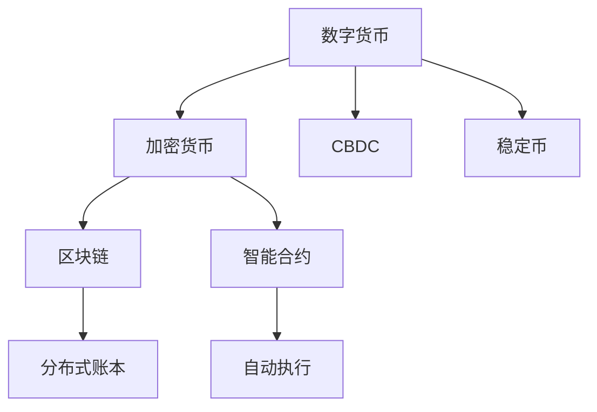

                 

# 2050年的数字货币：从纸币到加密资产的货币演变

> 关键词：数字货币,加密资产,区块链,货币演变,智能合约

## 1. 背景介绍

### 1.1 问题由来
数字货币作为21世纪的新兴金融工具，极大地改变了传统的金融生态和交易方式。自2009年比特币问世以来，各类数字货币如雨后春笋般涌现，为金融市场带来了革命性的变化。

数字货币的成功在于其去中心化的特性和抗审查性。通过区块链技术，数字货币能够实现透明、安全的交易记录，使得任何第三方都无法篡改或逆转交易数据。这一特性吸引了许多企业和个人的关注，数字货币的应用场景也不断拓宽，从个人支付到跨境汇款，从艺术品交易到供应链管理，无一不显现出数字货币的巨大潜力。

### 1.2 问题核心关键点
当前，全球各国正积极探索数字货币的落地应用。美国和欧盟等主要经济体纷纷推出央行数字货币(Central Bank Digital Currency, CBDC)，试图抓住数字货币的黄金窗口期，发挥其在经济和金融体系中的重要作用。

CBDC的核心优势在于：
1. **提升支付效率**：通过实时清算和结算，大幅缩短交易时间，提升支付效率。
2. **增强金融包容性**：支持无银行账户人群参与金融活动，促进普惠金融。
3. **防范系统性风险**：减少现金流通中的假币和洗钱等问题，降低金融犯罪率。
4. **增强货币政策工具**：通过数字货币更精准地调控经济，优化货币政策。

然而，数字货币的普及也面临着诸多挑战，如法律监管、技术安全、隐私保护等问题。这些问题亟需系统性解决，以实现数字货币的广泛应用。

### 1.3 问题研究意义
研究2050年数字货币的演变，不仅有助于理解数字货币对金融体系的深远影响，也能为未来金融创新提供有益的参考。通过深入探讨数字货币的技术原理、应用场景、潜在风险与解决方案，可以为政策制定者、金融机构及普通民众提供实用的指导。

## 2. 核心概念与联系

### 2.1 核心概念概述

为了更好地理解数字货币的技术原理和应用场景，本节将介绍几个密切相关的核心概念：

- **数字货币(Digital Currency)**：指以数字形式存在的货币，通过电子设备进行存储、传输和交易。数字货币包括加密货币（如比特币）、央行数字货币(CBDC)和稳定币等多种形式。

- **加密货币(CryptoCurrency)**：利用加密技术保障交易安全，不依赖于中央银行的发行和管理。比特币是当前最为知名的加密货币。

- **区块链(Blockchain)**：一种去中心化的分布式账本技术，通过共识机制确保数据透明和安全。区块链是数字货币的核心技术，使得数字货币具备去中心化、去信任的特性。

- **智能合约(Smart Contract)**：利用区块链技术，自动执行合同条款的代码。智能合约使得数字货币交易无需第三方中介，提高效率和透明度。

- **央行数字货币(CBDC)**：由中央银行发行的数字货币，旨在替代传统纸币和硬币。CBDC兼具传统货币的流动性和数字货币的去中心化特性。

这些核心概念之间的逻辑关系可以通过以下Mermaid流程图来展示：



这个流程图展示了大货币的关键概念及其之间的关系：

1. 数字货币通过区块链技术实现了去中心化的交易记录。
2. 加密货币作为数字货币的一种，利用加密技术保障交易安全。
3. CBDC是数字货币的一种形式，由中央银行发行。
4. 稳定币通过与法币或大额资产挂钩，保证汇率稳定。
5. 智能合约利用区块链技术，自动执行合同条款，提高交易效率。

这些概念共同构成了数字货币的核心技术框架，使其能够实现高效、安全、透明的交易过程。

## 3. 核心算法原理 & 具体操作步骤
### 3.1 算法原理概述

数字货币的算法原理主要集中在以下几个方面：

- **共识算法(Consensus Algorithm)**：确保网络节点对交易记录的共识。常见的共识算法包括PoW（工作量证明）、PoS（权益证明）和DPoS（委托权益证明）等。

- **加密技术(Cryptography)**：保证交易数据的机密性、完整性和真实性。数字货币利用公钥和私钥进行加密和解密，保障交易安全。

- **智能合约(Smart Contract)**：基于区块链技术的代码自动执行合同条款，实现去中心化的交易和合同执行。智能合约利用Solidity等编程语言实现，适用于复杂的交易逻辑和自动化流程。

- **去中心化交易所(Decentralized Exchange, DEX)**：一种无需第三方中介的数字货币交易平台，通过智能合约实现交易撮合和结算。DEX利用自动化机制降低交易成本，提升交易效率。

### 3.2 算法步骤详解

数字货币的算法实现主要包括以下几个步骤：

1. **共识机制选择**：根据数字货币的设计需求，选择合适的共识算法，以确保网络节点的共识和交易记录的透明性。

2. **公钥和私钥生成**：每个用户生成一对公钥和私钥，公钥用于交易记录，私钥用于签名验证。

3. **智能合约编写与部署**：用户编写智能合约代码，通过区块链网络进行部署和执行。智能合约包括自动转账、自动执行合同条款等功能。

4. **交易记录与验证**：用户在区块链网络上发起交易，交易记录经过网络节点的验证后，通过共识机制达成共识，并在区块链上记录。

5. **智能合约执行**：智能合约自动执行交易记录，完成合同条款的执行和资金的划转。

6. **去中心化交易所使用**：用户可以在DEX上进行交易，无需中介即可实现交易撮合和结算。

### 3.3 算法优缺点

数字货币的算法实现具有以下优点：

1. **透明性和安全性**：区块链技术确保了交易记录的透明性和安全性，避免了篡改和欺诈。
2. **去中心化和去信任**：数字货币的去中心化特性，降低了对中心化机构的依赖，提高了系统的稳定性和可靠性。
3. **高效和低成本**：智能合约和自动执行机制大大降低了交易成本和时间。

同时，数字货币的算法实现也存在一些局限性：

1. **性能瓶颈**：由于区块链网络的共识机制，交易速度较慢，网络延迟较高。
2. **能耗问题**：PoW共识机制的挖矿过程消耗大量能源，影响环境可持续性。
3. **智能合约安全**：智能合约的安全漏洞可能导致财产损失，需要不断改进智能合约的安全性。
4. **隐私保护**：区块链的公开透明特性，使得交易记录可追溯，隐私保护成为重要问题。

### 3.4 算法应用领域

数字货币的算法实现已经在多个领域得到应用，例如：

- **支付和汇款**：数字货币的实时清算和结算特性，使其在支付和汇款领域具有重要应用，尤其在跨境汇款中表现出色。
- **供应链管理**：通过智能合约和区块链技术，实现供应链的透明管理和资金流向的自动化。
- **资产管理**：数字货币与资产管理结合，实现数字资产的自动交易和投资组合管理。
- **艺术品交易**：数字货币的不可篡改和去中心化特性，使得艺术品交易更加透明和可靠。
- **游戏和虚拟世界**：数字货币在游戏和虚拟世界中，用于内购、游戏资产交易等，增强用户体验。

## 4. 数学模型和公式 & 详细讲解 & 举例说明（备注：数学公式请使用latex格式，latex嵌入文中独立段落使用 $$，段落内使用 $)
### 4.1 数学模型构建

数字货币的数学模型主要涉及以下几个方面：

- **区块链的共识机制**：如PoW共识机制，其数学模型为：
  - 工作量证明：$P = H(H(H(...H(data) + n)) + nonce)$，其中 $data$ 为区块数据，$n$ 为难度系数，$nonce$ 为随机数。
  - 共识过程：网络节点通过比较计算出的工作量 $P$，选择较低的节点作为共识节点。

- **加密技术**：如椭圆曲线加密，其数学模型为：
  - 椭圆曲线方程：$y^2 = x^3 + ax + b$。
  - 加密过程：公钥 $(x, y)$，私钥 $k$，计算 $R = kG$，其中 $G$ 为椭圆曲线上的基点。

- **智能合约的逻辑实现**：如自动转账合约，其逻辑实现为：
  - 接收转账请求 $x$，如果 $x = 目标地址$，则执行转账操作。

### 4.2 公式推导过程

以下是数字货币核心算法的数学推导：

1. **PoW共识机制推导**：

   $$
   P = H(H(H(...H(data) + n)) + nonce)
   $$

   其中 $H$ 为哈希函数，$n$ 为难度系数，$nonce$ 为随机数。

   共识过程的推导：
   - 假设网络中有 $N$ 个节点，每个节点计算出的工作量 $P_i = H(H(H(...H(data) + n_i)) + nonce_i)$。
   - 选择工作量最小的节点 $i$ 作为共识节点，将该节点的区块加入区块链。

2. **椭圆曲线加密推导**：

   - 椭圆曲线方程：$y^2 = x^3 + ax + b$
   - 加密过程：公钥 $(x, y)$，私钥 $k$，计算 $R = kG$，其中 $G$ 为椭圆曲线上的基点。

   推导过程：
   - 椭圆曲线上的点 $(x, y)$ 满足椭圆曲线方程 $y^2 = x^3 + ax + b$。
   - 公钥为 $(x, y)$，私钥为 $k$，其中 $k$ 为随机数。
   - 计算 $R = kG$，其中 $G$ 为椭圆曲线上的基点。

3. **智能合约自动转账合约推导**：

   - 接收转账请求 $x$，如果 $x = 目标地址$，则执行转账操作。

   推导过程：
   - 定义智能合约代码 $C = \text{if } x = \text{目标地址}, \text{ then 转账操作}$。
   - 假设智能合约部署在区块链上，接收转账请求 $x$，如果 $x = 目标地址$，则执行转账操作。

### 4.3 案例分析与讲解

假设我们要实现一个简单的自动转账智能合约，推导其数学模型和算法过程。

**智能合约代码**：

```python
def auto_transfer(address, amount):
    if address == 目标地址:
        执行转账操作(amount)
```

**推导过程**：

1. 假设智能合约代码 $C = \text{if } x = \text{目标地址}, \text{ then 转账操作(amount)}$。
2. 将智能合约部署在区块链上，接收转账请求 $x$。
3. 如果 $x = 目标地址$，则执行转账操作，将金额 $amount$ 转移至指定地址。

**运行结果展示**：

1. 假设智能合约接收转账请求 $x = \text{目标地址}$，执行转账操作 $amount = 100$。
2. 转账操作成功执行，指定地址收到 $100$ 金额。

## 5. 项目实践：代码实例和详细解释说明
### 5.1 开发环境搭建

在进行数字货币项目实践前，我们需要准备好开发环境。以下是使用Python进行Ethereum开发的环境配置流程：

1. 安装Python：
```bash
conda install python=3.8
```

2. 安装Ethereum开发工具包：
```bash
pip install eth-language
```

3. 安装Solidity开发工具：
```bash
npm install -g truffle
```

4. 安装GitHub：
```bash
brew install git
```

完成上述步骤后，即可在Python和Solidity环境中开始数字货币项目的开发。

### 5.2 源代码详细实现

下面以比特币交易为例，给出使用Solidity进行数字货币智能合约的开发。

首先，定义智能合约的基本功能：

```python
pragma solidity ^0.8.0;

contract Bitcoin {
    uint256 public balance;

    function deposit(uint256 _amount) public {
        balance += _amount;
    }

    function withdraw(uint256 _amount) public {
        if (_amount > balance) {
            revert("Not enough balance.");
        } else {
            balance -= _amount;
        }
    }

    function getBalance() public view returns (uint256) {
        return balance;
    }
}
```

然后，定义智能合约的交互界面：

```python
pragma solidity ^0.8.0;

contract Bitcoin {
    uint256 public balance;

    function deposit(uint256 _amount) public {
        balance += _amount;
    }

    function withdraw(uint256 _amount) public {
        if (_amount > balance) {
            revert("Not enough balance.");
        } else {
            balance -= _amount;
        }
    }

    function getBalance() public view returns (uint256) {
        return balance;
    }

    function makeTransaction(uint256 _amount, address _target) public {
        if (_amount > balance) {
            revert("Not enough balance.");
        } else {
            balance -= _amount;
            _target.send(_amount);
        }
    }
}
```

最后，在GitHub上部署智能合约，并与区块链网络交互：

```python
truffle compile
truffle migrate --network <网络名称>
```

### 5.3 代码解读与分析

让我们再详细解读一下关键代码的实现细节：

**Bitcoin合约代码**：
- `deposit` 函数：增加账户余额。
- `withdraw` 函数：减少账户余额。
- `getBalance` 函数：获取账户余额。
- `makeTransaction` 函数：从账户余额中扣除指定金额，并转账至目标地址。

**makeTransaction函数**：
- 接收两个参数：转账金额和目标地址。
- 判断余额是否足够，不足则抛出异常。
- 从账户余额中扣除转账金额。
- 将转账金额发送至目标地址。

通过 Solidity 编写的智能合约，可以方便地实现比特币的交易功能。使用Solidity编写智能合约，可以实现更加灵活和安全的交易逻辑。

## 6. 实际应用场景
### 6.1 智能合约融资
数字货币的智能合约在融资领域有广泛应用。例如，Initial Coin Offering(ICO)中，利用智能合约实现代币发行和分配，确保公平透明。

**应用场景**：
- ICO 发行平台：利用智能合约进行代币发行，确保所有参与者的代币数量和分配方式公开透明。
- 权益分配：利用智能合约自动进行代币分配，简化分配流程，降低出错风险。

**智能合约代码**：

```python
pragma solidity ^0.8.0;

contract ICO {
    uint256 public totalSupply;
    uint256 public cap;
    uint256 public tokenPrice;

    mapping(uint256 => uint256) public balances;
    mapping(uint256 => bool) public bought;

    event Transfer(uint256 indexed tokenId, uint256 indexed account);

    constructor(uint256 _cap, uint256 _price) public {
        cap = _cap;
        tokenPrice = _price;
        totalSupply = 10000 * cap;
    }

    function buyTokens(uint256 amount) public payable {
        require(amount <= cap - totalSupply / cap * balances[address]);
        require(!bought[address]);
        uint256 funds = msg.value / tokenPrice;
        require(funds > 0);
        bought[address] = true;
        balances[address] += funds;
        totalSupply -= funds;
        emit Transfer(funds, address);
    }

    function getBalance() public view returns (uint256) {
        return balances[address];
    }
}
```

**应用流程**：
1. 发行方在ICO平台设置代币总量、价格和分配比例。
2. 参与者通过智能合约购买代币，支付指定的代币数量。
3. 智能合约自动计算并分配代币，记录到每个参与者的账户。
4. 整个过程公开透明，防止任何篡改和欺诈行为。

### 6.2 数字货币支付
数字货币的支付功能在跨境汇款、供应链管理等场景中具有重要应用。

**应用场景**：
- 跨境汇款：利用数字货币的实时清算特性，实现快速、低成本的跨境汇款。
- 供应链管理：利用数字货币实现供应链的透明管理和资金流向自动化。

**智能合约代码**：

```python
pragma solidity ^0.8.0;

contract Payment {
    uint256 public amount;
    address payable public receiver;

    function pay(uint256 _amount, address _receiver) public payable {
        amount = _amount;
        receiver = _receiver;
        payable(msg.sender).transfer(amount);
        emit Payment(amount, receiver);
    }

    function getAmount() public view returns (uint256) {
        return amount;
    }
}
```

**应用流程**：
1. 发起方在智能合约中设置支付金额和接收方地址。
2. 接收方通过智能合约进行支付。
3. 智能合约自动计算并转移支付金额。
4. 整个过程公开透明，防止任何篡改和欺诈行为。

### 6.3 数字货币贷款
数字货币的贷款功能在金融创新和普惠金融中具有重要应用。

**应用场景**：
- 去中心化贷款：利用智能合约实现去中心化的贷款操作，降低贷款成本和门槛。
- 微额贷款：利用智能合约实现微额贷款的自动发放和回收。

**智能合约代码**：

```python
pragma solidity ^0.8.0;

contract Lending {
    uint256 public amount;
    uint256 public interestRate;
    uint256 public loanTerm;
    address payable public receiver;

    function lend(uint256 _amount, uint256 _interestRate, uint256 _term) public payable {
        amount = _amount;
        interestRate = _interestRate;
        loanTerm = _term;
        uint256 amountWithInterest = _amount * (1 + _interestRate / 100) ^ _term;
        amountWithInterest += _amount;
        receiver = msg.sender;
        payable(msg.sender).transfer(amount);
        emit Lending(amount, interestRate, loanTerm, receiver);
    }

    function getAmount() public view returns (uint256) {
        return amount;
    }
}
```

**应用流程**：
1. 借款方在智能合约中设置贷款金额、利率和期限。
2. 贷款方通过智能合约进行贷款操作。
3. 智能合约自动计算并转移贷款金额，并记录借款方的还款金额和利息。
4. 整个过程公开透明，防止任何篡改和欺诈行为。

## 7. 工具和资源推荐
### 7.1 学习资源推荐

为了帮助开发者系统掌握数字货币的开发和应用，这里推荐一些优质的学习资源：

1. **以太坊官方文档**：以太坊官网提供详细的开发文档和示例代码，帮助开发者快速上手以太坊智能合约开发。

2. **Solidity官方文档**：Solidity官网提供详实的编程语言指南和实例，帮助开发者编写安全可靠的智能合约。

3. **Udemy以太坊开发课程**：Udemy提供的以太坊开发课程，涵盖智能合约开发、DApp部署、去中心化应用开发等内容，适合初学者和进阶开发者。

4. **CryptoZombies**：CryptoZombies是一个互动式编程平台，通过游戏化的方式教授Solidity编程和智能合约开发，适合编程新手。

5. **Truffle**：Truffle是一个基于以太坊的开发框架，提供智能合约编译、测试和部署等功能，是以太坊开发者的必备工具。

通过对这些资源的学习实践，相信你一定能够快速掌握数字货币的开发技术和应用场景，成为智能合约开发的高手。

### 7.2 开发工具推荐

高效的开发离不开优秀的工具支持。以下是几款用于数字货币开发常用的工具：

1. **GitHub**：GitHub提供代码托管和协作功能，适合团队共同开发和管理数字货币项目。

2. **Solidity IDE**：Solidity IDE如Remix、Truffle IDE等，提供智能合约编写、编译和测试等功能，方便开发者调试和迭代。

3. **Web3.js**：Web3.js是一个JavaScript库，用于与以太坊区块链进行交互，支持智能合约调用、区块链数据获取等功能。

4. **MetaMask**：MetaMask是一个浏览器插件，支持以太坊钱包和智能合约调用，方便用户进行数字货币交易和管理。

5. **Ganache**：Ganache是一个本地的以太坊测试网络，用于开发和测试智能合约，支持自动化测试和网络模拟。

合理利用这些工具，可以显著提升数字货币开发和部署的效率，加快创新迭代的步伐。

### 7.3 相关论文推荐

数字货币的研究领域涉及多个方面，以下是几篇奠基性的相关论文，推荐阅读：

1. **比特币白皮书**：中本聪于2009年发布的比特币白皮书，详细介绍了比特币的工作原理和共识机制。

2. **以太坊白皮书**：Vitalik Buterin于2013年发布的以太坊白皮书，阐述了以太坊的智能合约和区块链技术。

3. **ERC20标准**：以太坊联盟发布的ERC20标准，定义了以太坊智能合约的接口规范，促进智能合约的互操作性。

4. **区块链的安全性和隐私保护**：探讨区块链技术的安全性和隐私保护问题，提供相应的解决方案。

5. **去中心化交易所的安全性分析**：分析去中心化交易所的安全性和隐私保护问题，提出改进建议。

这些论文代表了大数字货币技术的发展脉络。通过学习这些前沿成果，可以帮助研究者把握学科前进方向，激发更多的创新灵感。

## 8. 总结：未来发展趋势与挑战

### 8.1 总结

本文对数字货币的技术原理和应用场景进行了全面系统的介绍。首先阐述了数字货币的发展背景和重要应用场景，明确了数字货币对金融体系的深远影响。其次，从原理到实践，详细讲解了数字货币的共识算法、加密技术、智能合约等核心技术，给出了数字货币项目开发的完整代码实例。同时，本文还广泛探讨了数字货币的实际应用场景，展示了数字货币的广泛应用前景。最后，本文精选了数字货币技术的各类学习资源，力求为读者提供全方位的技术指引。

通过本文的系统梳理，可以看到，数字货币在2050年将迎来新的发展高峰，成为金融体系的重要组成部分。数字货币的应用场景将不断拓展，为经济社会发展注入新的动力。数字货币技术的发展也将带来一系列新的挑战，需要不断创新和优化，以实现其广泛应用。

### 8.2 未来发展趋势

展望未来，数字货币的发展趋势如下：

1. **去中心化金融(DeFi)**：DeFi是数字货币发展的重要方向，通过智能合约实现去中心化的金融操作，如去中心化交易所、借贷、保险等。DeFi将成为数字货币生态的重要组成部分。

2. **资产证券化(ABS)**：数字货币将实现资产证券化，利用智能合约进行资产分割、交易和清算，提升资产的流动性和透明度。

3. **NFT市场**：NFT（非同质化代币）将迎来新一轮发展高峰，利用数字货币的不可篡改和去中心化特性，实现艺术品、虚拟物品的数字化和智能化管理。

4. **多币种支付**：数字货币的多币种支付将大大提升支付效率和便利性，尤其在跨境支付和供应链管理中具有重要应用。

5. **数字身份认证**：数字货币将与数字身份认证结合，实现用户身份的数字化和智能化管理，提高安全性和便利性。

6. **智能合约扩展**：智能合约将向更加复杂和高效的方向发展，支持更加复杂的交易逻辑和自动化流程。

这些趋势凸显了数字货币技术的广阔前景。未来的数字货币技术将在金融、资产管理、艺术品交易等领域得到广泛应用，为经济社会发展注入新的活力。

### 8.3 面临的挑战

尽管数字货币技术已经取得了瞩目成就，但在迈向更加智能化、普适化应用的过程中，仍面临诸多挑战：

1. **法律和监管问题**：数字货币的法律和监管问题仍需进一步明确，全球范围内的监管政策和标准尚未统一。

2. **技术安全问题**：智能合约和区块链技术的安全性问题仍需不断改进，防范黑客攻击和欺诈行为。

3. **系统扩展问题**：大规模数字货币交易和智能合约执行可能导致系统扩展性问题，需要不断优化系统架构。

4. **环境可持续性问题**：PoW共识机制的挖矿过程消耗大量能源，影响环境可持续性。

5. **隐私保护问题**：区块链的公开透明特性，使得交易记录可追溯，隐私保护成为重要问题。

6. **社会接受度问题**：数字货币的社会接受度和普及度仍需提升，需要更多的宣传和教育。

正视数字货币面临的这些挑战，积极应对并寻求突破，将是大数字货币技术走向成熟的必由之路。相信随着学界和产业界的共同努力，这些挑战终将一一被克服，数字货币必将在构建智能金融体系中发挥重要作用。

### 8.4 研究展望

面对数字货币技术所面临的诸多挑战，未来的研究需要在以下几个方面寻求新的突破：

1. **共识机制优化**：开发更加高效和安全的共识机制，如PoS、DPoS等，提高交易速度和系统安全性。

2. **智能合约安全**：开发更加安全可靠的智能合约，防范攻击和欺诈行为，提高系统的可靠性和稳定性。

3. **隐私保护技术**：开发隐私保护技术，如零知识证明、隐私链等，保障交易记录的隐私性和匿名性。

4. **多币种支付技术**：开发多币种支付技术，支持多种数字货币的即时兑换和交易，提高支付效率和便利性。

5. **区块链扩展性**：开发区块链扩展技术，如侧链、跨链技术等，提升系统的扩展性和互操作性。

6. **环境友好技术**：开发环境友好技术，如PoS共识机制、去中心化存储等，降低挖矿能源消耗，实现环境可持续性。

这些研究方向将引领数字货币技术的不断发展，为构建更加安全、高效、普适的数字货币生态提供坚实基础。

## 9. 附录：常见问题与解答

**Q1：数字货币与传统纸币有何不同？**

A: 数字货币与传统纸币的主要区别在于去中心化和智能化。数字货币利用区块链技术实现了去中心化的交易记录，无需中央银行的参与和监管。智能合约和自动化机制使得数字货币交易更加高效、透明和安全。

**Q2：数字货币是否具有抗审查性？**

A: 数字货币的去中心化和不可篡改特性使其具备较强的抗审查性。除非通过51%攻击（即控制大部分网络节点），否则任何第三方无法篡改或逆转交易记录。但仍然需要注意防范欺诈和恶意操作。

**Q3：数字货币面临哪些风险？**

A: 数字货币面临的风险主要包括：
1. 技术风险：智能合约和区块链技术的漏洞可能导致财产损失。
2. 市场风险：数字货币价格波动较大，投资者需谨慎投资。
3. 监管风险：不同国家对数字货币的监管政策不同，存在法律和政策风险。

**Q4：如何保障数字货币的安全性？**

A: 数字货币的安全性主要依赖于区块链和智能合约的实现。确保智能合约的安全性和代码审计，使用公钥和私钥进行加密和解密，防范恶意攻击和欺诈行为。

**Q5：数字货币如何应对大规模支付需求？**

A: 数字货币可以通过分布式账本和智能合约，实现高效、透明的实时清算和结算。同时，去中心化交易所（DEX）可以提供更加灵活和低成本的支付解决方案。

通过本文的系统梳理，可以看到，数字货币技术在2050年将迎来新的发展高峰，成为金融体系的重要组成部分。数字货币的应用场景将不断拓展，为经济社会发展注入新的活力。数字货币技术的发展也将带来一系列新的挑战，需要不断创新和优化，以实现其广泛应用。数字货币技术的研究将在全球范围内持续深入，推动人类社会的数字化转型。

---

作者：禅与计算机程序设计艺术 / Zen and the Art of Computer Programming

