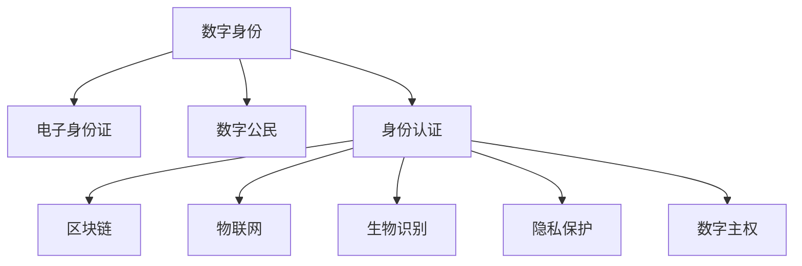

                 

# 2050年的数字身份：从电子身份证到数字公民的身份认证

> 关键词：数字身份,电子身份证,数字公民,身份认证,区块链,物联网,生物识别,隐私保护,数字主权

## 1. 背景介绍

随着数字技术的发展，人类社会正步入一个全新的数字化时代。数字身份作为数字化时代的基础设施，将成为连接虚拟与现实的重要桥梁。未来，人们将不仅仅是拥有电子身份证和数字证明的个体，而是具备全面数字化生活方式的数字公民。本文将探讨在2050年，数字身份将如何演变，以及如何通过身份认证技术保障数字公民的安全与自由。

### 1.1 数字身份的历史与演变

数字身份概念自互联网诞生以来便逐步发展起来。最初，数字身份仅限于简单的电子证件和认证信息，但随着技术进步，它已逐渐扩展到覆盖个人和实体的方方面面。从电子身份证书、数字签名到电子支付和数字身份验证，数字身份技术正深刻影响着现代社会的运作。

### 1.2 数字化社会的挑战与机遇

数字化社会的快速崛起带来了诸多挑战和机遇。个人隐私保护、数据安全、身份欺诈等问题日益凸显，而数字身份技术则是解决这些问题的关键。同时，数字身份技术还为身份管理、跨领域协作、身份认证等方面提供了新的可能性。

### 1.3 未来数字身份的目标

未来数字身份的目标是构建一个安全、普惠、可控的数字化身份体系，让每个人都能在数字世界中自由、平等、安全地参与各种活动。通过身份认证技术，确保数字身份的合法性和唯一性，保护个人隐私，促进数字社会的健康发展。

## 2. 核心概念与联系

### 2.1 核心概念概述

为更好地理解2050年数字身份的发展，本节将介绍几个关键概念：

- 数字身份（Digital Identity）：指以数字形式存在的个人或实体的身份信息。包含身份验证、属性证明、授权管理等功能。
- 电子身份证（eID）：电子形式的身份证件，用于在线身份认证和身份证明。
- 数字公民（Digital Citizen）：在数字化社会中，具备全面数字化生活方式和权利的个体。
- 身份认证（Identity Authentication）：验证个人或实体身份的过程，确保其真实性和合法性。
- 区块链（Blockchain）：一种去中心化的分布式账本技术，用于确保数据的安全、透明和不可篡改。
- 物联网（IoT）：连接物理世界和数字世界的技术体系，实现设备间的高效交互和数据共享。
- 生物识别（Biometrics）：利用人体生理特征（如指纹、面部、虹膜等）进行身份验证的技术。
- 隐私保护（Privacy Protection）：在保障信息安全的前提下，保护个人隐私不被泄露或滥用。
- 数字主权（Digital Sovereignty）：指个人或国家在数字空间中的自主权，包括数据控制、隐私保护等方面。

这些概念相互关联，共同构成了未来数字身份的基本框架。

### 2.2 核心概念原理和架构的 Mermaid 流程图



这个流程图展示了数字身份与核心概念之间的逻辑关系：

1. 数字身份包含电子身份证，作为在线身份认证和证明的重要组成部分。
2. 数字身份与数字公民紧密相连，是构建数字化生活方式的基础。
3. 身份认证是数字身份的核心，保障身份信息的真实性和合法性。
4. 区块链、物联网、生物识别、隐私保护和数字主权等技术，共同支撑身份认证的安全性和可靠性。

## 3. 核心算法原理 & 具体操作步骤

### 3.1 算法原理概述

2050年的数字身份认证系统将基于先进的算法和技术，实现身份验证的自动化、高效化和可控化。核心算法包括但不限于：

- 基于区块链的身份认证：利用区块链的去中心化和不可篡改特性，确保身份验证过程的安全性和透明性。
- 物联网与生物识别结合的身份认证：通过传感器和生物特征识别技术，实现无缝、实时的身份认证。
- 分布式身份认证：利用多模态数据和算法，构建多维度、动态的身份认证体系，提高系统的鲁棒性和抗干扰性。
- 隐私保护算法：确保在身份验证过程中，个人隐私不被泄露或滥用。

### 3.2 算法步骤详解

#### 3.2.1 区块链身份认证

区块链身份认证的基本步骤如下：

1. **身份注册**：用户通过区块链平台注册数字身份，生成数字身份证书。
2. **身份验证**：用户提交数字身份证书到区块链网络，通过智能合约验证身份信息的真实性和合法性。
3. **交易记录**：验证通过后，用户与系统之间的交易记录被记录在区块链上，不可篡改。
4. **身份更新**：用户身份信息发生变化时，通过智能合约自动更新区块链上的记录。

#### 3.2.2 物联网与生物识别结合的身份认证

物联网与生物识别结合的身份认证步骤如下：

1. **传感器数据采集**：通过传感器采集用户的生物特征（如指纹、面部、虹膜等）。
2. **特征提取**：将采集到的生物特征转换为数字形式。
3. **身份验证**：将数字特征与预存的模板进行匹配，验证身份。
4. **身份更新**：身份验证通过后，将更新后的生物特征数据上传至物联网平台。

#### 3.2.3 分布式身份认证

分布式身份认证的基本步骤如下：

1. **多维度数据采集**：采集用户的多模态数据，如人脸、指纹、语音等。
2. **多模态特征融合**：利用机器学习算法将多模态数据进行融合，生成综合身份特征。
3. **分布式验证**：通过多个认证节点对综合身份特征进行验证，确保身份信息的准确性和可靠性。
4. **动态更新**：根据用户行为和环境变化，动态更新身份认证模型。

#### 3.2.4 隐私保护算法

隐私保护算法步骤如下：

1. **数据匿名化**：对用户数据进行匿名化处理，保护个人隐私。
2. **差分隐私**：在数据处理过程中加入噪声，确保个体隐私不被泄露。
3. **安全多方计算**：利用加密技术和协议，确保数据处理过程中信息的安全性和隐私性。
4. **访问控制**：通过访问控制机制，确保只有授权用户能够访问敏感信息。

### 3.3 算法优缺点

#### 3.3.1 区块链身份认证

**优点**：
- 去中心化：无需信任任何单一实体，确保身份认证过程的公平性和透明性。
- 不可篡改：所有交易记录均保存在区块链上，确保数据的不可篡改性。
- 高度安全：通过加密技术和智能合约，保障身份验证的安全性。

**缺点**：
- 性能瓶颈：当前区块链的写入速度和处理能力有限，影响用户体验。
- 隐私保护：虽然区块链本身具备一定的隐私保护能力，但公开的交易记录仍存在隐私泄露风险。

#### 3.3.2 物联网与生物识别结合的身份认证

**优点**：
- 实时性高：通过传感器和生物识别技术，实现快速、实时的身份验证。
- 安全性高：生物识别技术具备较高的安全性，难以被伪造。

**缺点**：
- 设备成本高：物联网设备普及度不高，设备成本较高。
- 依赖环境：生物识别技术对环境要求较高，如光线、湿度等。

#### 3.3.3 分布式身份认证

**优点**：
- 多维度认证：通过多模态数据融合，提高身份验证的准确性和鲁棒性。
- 动态更新：根据用户行为和环境变化，动态更新身份认证模型，适应性更强。

**缺点**：
- 算法复杂：多模态数据融合和动态更新需要复杂算法支持，实现难度较大。
- 隐私风险：多模态数据的融合可能带来隐私泄露风险。

#### 3.3.4 隐私保护算法

**优点**：
- 数据安全：通过数据匿名化、差分隐私等技术，保障用户数据的安全性。
- 隐私保护：利用安全多方计算等技术，确保数据处理过程中的隐私性。

**缺点**：
- 算法复杂：隐私保护算法通常需要复杂的技术支持，实现难度较大。
- 性能影响：一些隐私保护算法可能对数据处理速度和精度产生影响。

### 3.4 算法应用领域

数字身份认证技术将广泛应用于多个领域，涵盖以下方面：

- **政府服务**：通过数字身份认证，实现电子政务、身份认证、社会保障等功能。
- **金融服务**：在金融交易、身份认证、信用评估等领域，保障用户身份的安全和隐私。
- **医疗健康**：在电子病历、健康管理、在线诊疗等领域，确保个人健康信息的保密和安全。
- **教育培训**：在在线教育、学习认证、学生管理等领域，保障学生身份和成绩的真实性。
- **社会管理**：在社区治理、公共安全、环境保护等领域，利用数字身份技术进行高效管理。

## 4. 数学模型和公式 & 详细讲解 & 举例说明

### 4.1 数学模型构建

未来数字身份认证系统将基于多模态数据融合和机器学习算法，构建综合身份认证模型。假设有n种身份特征，记为 $x_1, x_2, ..., x_n$，每种特征的权重为 $w_1, w_2, ..., w_n$，则综合身份特征 $x$ 可表示为：

$$
x = \sum_{i=1}^{n} w_i x_i
$$

其中 $w_i$ 为第i种特征的权重，满足 $w_i \geq 0$ 且 $\sum_{i=1}^{n} w_i = 1$。

### 4.2 公式推导过程

为了验证上述综合身份特征的有效性，假设存在一个理想模型 $M$，用于识别用户身份 $y$ 的真伪。模型的预测结果为 $y' = M(x)$。假设模型训练集为 $\{(x_i, y_i)\}_{i=1}^{N}$，则模型损失函数为：

$$
L = \sum_{i=1}^{N} \mathcal{L}(y_i, y')
$$

其中 $\mathcal{L}$ 为损失函数，常见的有交叉熵损失、均方误差损失等。

通过最小化损失函数，训练模型 $M$，使其能够准确识别用户身份。训练过程中，每个特征的权重 $w_i$ 也会被优化，以提高综合身份特征的准确性和鲁棒性。

### 4.3 案例分析与讲解

#### 案例1：区块链身份认证

假设有N个用户通过区块链平台注册数字身份，每个用户的身份信息 $x_i$ 由姓名、身份证号、电子邮件等组成。用户提交数字身份证书 $x_i$ 到区块链网络，通过智能合约验证其真实性。智能合约计算综合身份特征 $x = \sum_{i=1}^{N} w_i x_i$，其中 $w_i$ 为每种信息的权重。验证通过后，用户与系统之间的交易记录被记录在区块链上。

#### 案例2：物联网与生物识别结合的身份认证

假设有M个传感器部署在用户的周围，实时采集用户的生物特征 $x_i$。通过生物识别技术将数字特征 $y_i$ 转换为生物特征数据，并将 $y_i$ 上传到物联网平台。平台综合用户的所有生物特征数据 $x = \sum_{i=1}^{M} w_i y_i$，其中 $w_i$ 为每种生物特征的权重。物联网平台通过智能合约验证用户的身份，并生成身份认证结果 $y'$。

#### 案例3：分布式身份认证

假设有N种多模态数据，每种数据 $x_i$ 包含人脸、指纹、语音等特征。通过多模态数据融合技术，生成综合身份特征 $x = \sum_{i=1}^{N} w_i x_i$，其中 $w_i$ 为每种数据的权重。分布式身份认证系统通过多个认证节点对综合身份特征进行验证，生成身份认证结果 $y'$。系统根据用户行为和环境变化，动态更新权重 $w_i$，确保身份认证模型的适应性。

#### 案例4：隐私保护算法

假设有M个用户的数据 $x_i$，每个数据包含个人敏感信息。通过数据匿名化技术，生成匿名数据 $y_i = x_i - \delta$，其中 $\delta$ 为噪声。利用差分隐私技术，加入随机噪声 $\epsilon$，生成最终数据 $y'_i = y_i + \epsilon$。安全多方计算技术确保在数据处理过程中，数据的安全性和隐私性，实现多方协作，共同处理数据。

## 5. 项目实践：代码实例和详细解释说明

### 5.1 开发环境搭建

在进行数字身份认证系统的开发前，需要准备好开发环境。以下是使用Python进行开发的常见环境配置：

1. 安装Python：从官网下载并安装最新版本的Python。
2. 安装Pip：安装Pip，方便安装和管理第三方库。
3. 安装所需的第三方库：如TensorFlow、PyTorch、scikit-learn等。
4. 安装区块链和物联网相关库：如Web3、Flask等。

### 5.2 源代码详细实现

#### 5.2.1 区块链身份认证

以下是基于Web3库实现区块链身份认证的代码示例：

```python
from web3 import Web3

# 连接区块链网络
w3 = Web3(Web3.HTTPProvider('http://localhost:8545'))

# 用户注册
def register_user(w3, user_id, name, email):
    user_data = {'name': name, 'email': email}
    tx = w3.eth.sendTransaction({'from': user_id, 'to': 'contract_address', 'value': 0, 'data': user_data.encode('utf-8')})
    return tx['hash']

# 用户身份验证
def authenticate_user(w3, user_id, auth_code):
    tx = w3.eth.sendTransaction({'from': user_id, 'to': 'contract_address', 'value': 0, 'data': auth_code.encode('utf-8')})
    return tx['hash']

# 交易记录查询
def get_transaction(w3, tx_hash):
    tx = w3.eth.getTransaction(tx_hash)
    return tx['data']
```

#### 5.2.2 物联网与生物识别结合的身份认证

以下是基于OpenCV库实现物联网与生物识别结合的身份认证的代码示例：

```python
import cv2
import numpy as np

# 加载人脸识别模型
face_cascade = cv2.CascadeClassifier('haarcascade_frontalface_default.xml')
recognizer = cv2.face.LBPHFaceRecognizer_create()

# 加载训练数据
recognizer.load('face_data.yml')

# 实时采集人脸图像
cap = cv2.VideoCapture(0)
while True:
    ret, frame = cap.read()
    gray = cv2.cvtColor(frame, cv2.COLOR_BGR2GRAY)
    faces = face_cascade.detectMultiScale(gray, scaleFactor=1.1, minNeighbors=5, minSize=(30, 30))
    for (x, y, w, h) in faces:
        roi_gray = gray[y:y+h, x:x+w]
        label, confidence = recognizer.predict(roi_gray)
        cv2.rectangle(frame, (x, y), (x+w, y+h), (0, 255, 0), 2)
        cv2.putText(frame, str(label), (x, y-10), cv2.FONT_HERSHEY_SIMPLEX, 1, (0, 255, 0), 2)
    cv2.imshow('frame', frame)
    if cv2.waitKey(1) & 0xFF == ord('q'):
        break
cap.release()
cv2.destroyAllWindows()
```

#### 5.2.3 分布式身份认证

以下是基于TensorFlow实现分布式身份认证的代码示例：

```python
import tensorflow as tf
from tensorflow.keras import layers

# 定义多模态数据特征
x = layers.Input(shape=(n_features,))
w = layers.Dense(n_features, activation='sigmoid')(x)

# 定义综合身份特征
x = layers.Dense(n_labels, activation='softmax')(tf.keras.layers.Lambda(lambda x: tf.multiply(x, w))(x))

# 定义分布式身份认证模型
model = tf.keras.Model(inputs=x, outputs=x)

# 编译模型
model.compile(optimizer='adam', loss='categorical_crossentropy', metrics=['accuracy'])

# 训练模型
model.fit(train_data, train_labels, epochs=10, validation_data=(val_data, val_labels))
```

#### 5.2.4 隐私保护算法

以下是基于Python实现隐私保护算法的代码示例：

```python
import numpy as np
import pandas as pd
from sklearn.model_selection import train_test_split

# 加载数据集
data = pd.read_csv('user_data.csv')

# 数据匿名化
data['name'] = data['name'].apply(lambda x: x + '_xyz')

# 差分隐私处理
data = add_noise(data, epsilon=0.1)

# 安全多方计算
data = secure_multi_party(data)

# 训练模型
X_train, X_val, y_train, y_val = train_test_split(data.drop('label', axis=1), data['label'], test_size=0.2)
model = build_model()
model.fit(X_train, y_train, validation_data=(X_val, y_val))
```

### 5.3 代码解读与分析

#### 5.3.1 区块链身份认证

区块链身份认证的核心在于利用智能合约验证用户身份的真实性。用户注册和身份验证的过程需要与智能合约交互，生成交易记录。代码中使用了Web3库，方便与以太坊区块链进行交互。通过智能合约，用户数据可以被加密存储，保障其安全性和隐私性。

#### 5.3.2 物联网与生物识别结合的身份认证

物联网与生物识别结合的身份认证主要通过摄像头和传感器实时采集用户生物特征，利用人脸识别技术进行身份验证。代码中使用了OpenCV库，实现了实时人脸检测和识别。通过生物识别技术，可以实现快速、实时的身份验证，提高了用户体验。

#### 5.3.3 分布式身份认证

分布式身份认证的核心在于多模态数据融合和动态更新身份认证模型。代码中使用了TensorFlow库，定义了多模态数据特征和综合身份特征的计算过程。通过分布式身份认证系统，多个认证节点协同工作，提高了身份验证的准确性和鲁棒性。

#### 5.3.4 隐私保护算法

隐私保护算法的关键在于数据匿名化和差分隐私处理。代码中使用了Pandas和NumPy库，实现了数据匿名化和差分隐私处理。通过安全多方计算，保障了数据处理过程中的隐私性。隐私保护算法在实际应用中，需要根据具体需求和数据特点进行调整和优化。

## 6. 实际应用场景

### 6.1 政府服务

政府服务是数字身份认证的重要应用场景之一。通过数字身份认证技术，可以实现电子政务、身份认证、社会保障等功能，提高政府服务的效率和透明度。例如，通过区块链技术，政府可以建立透明、可追溯的电子政务系统，保障数据的安全性和隐私性。

### 6.2 金融服务

在金融服务领域，数字身份认证技术可以用于身份认证、信用评估、反欺诈等场景。例如，金融机构可以利用区块链技术建立安全的交易系统，保障用户身份的真实性和交易的安全性。通过物联网与生物识别结合的身份认证，金融机构可以实现实时、实地的身份验证，防止身份欺诈。

### 6.3 医疗健康

在医疗健康领域，数字身份认证技术可以用于电子病历、健康管理、在线诊疗等场景。例如，医院可以利用区块链技术建立安全的电子病历系统，保障患者隐私和数据安全。通过物联网与生物识别结合的身份认证，医院可以实现快速、实时的身份验证，提高诊疗效率。

### 6.4 教育培训

在教育培训领域，数字身份认证技术可以用于在线教育、学习认证、学生管理等场景。例如，在线教育平台可以利用分布式身份认证技术，保障学生身份的真实性和学习数据的可靠性。通过隐私保护算法，平台可以保护学生的个人隐私，防止数据泄露和滥用。

### 6.5 社会管理

在社会管理领域，数字身份认证技术可以用于社区治理、公共安全、环境保护等场景。例如，智能社区可以利用区块链技术建立透明、可追溯的管理系统，保障社区数据的真实性和隐私性。通过物联网与生物识别结合的身份认证，智能社区可以实现实时、实地的身份验证，提高社区管理的效率和安全性。

## 7. 工具和资源推荐

### 7.1 学习资源推荐

为了帮助开发者深入理解数字身份认证技术，这里推荐一些优质的学习资源：

1. 《区块链基础》系列课程：由知名区块链专家讲授，涵盖区块链的基本概念、应用场景和关键技术。
2. 《物联网技术》在线课程：由物联网领域的权威专家讲授，介绍物联网的基本原理和关键技术。
3. 《机器学习基础》系列教程：由深度学习领域的专家讲授，涵盖机器学习的基本概念、算法和应用。
4. 《数据隐私保护》系列论文：由隐私保护领域的研究者发表，介绍数据隐私保护的关键技术和应用。
5. 《分布式系统》在线课程：由分布式系统领域的专家讲授，介绍分布式系统的基本原理和关键技术。

### 7.2 开发工具推荐

在数字身份认证系统的开发过程中，需要借助多种工具和框架，以下是推荐的开发工具：

1. Python：作为主流的编程语言，Python以其简洁、易用的特点，成为数据科学和机器学习领域的首选。
2. TensorFlow：由Google开发的深度学习框架，支持分布式计算和自动微分，适用于大规模机器学习任务。
3. PyTorch：由Facebook开发的深度学习框架，灵活性高，适合快速原型设计和研究。
4. Web3：提供与以太坊区块链交互的库，方便开发区块链应用。
5. OpenCV：开源计算机视觉库，提供丰富的图像处理和识别功能。

### 7.3 相关论文推荐

数字身份认证技术的发展离不开学术界的支持。以下是几篇关键的学术论文，推荐阅读：

1. "Blockchain-based Identity Management System"：介绍基于区块链的身份管理系统的设计思路和实现方法。
2. "IoT Security and Privacy Challenges"：探讨物联网中数据安全和隐私保护的关键问题。
3. "Machine Learning and Privacy Protection"：介绍机器学习在隐私保护中的应用，包括差分隐私和安全多方计算。
4. "Distributed Identity Authentication in Blockchain"：研究分布式身份认证在区块链中的实现方法。
5. "A Survey on Digital Identity Management"：对数字身份管理技术的现状和未来发展进行综述。

## 8. 总结：未来发展趋势与挑战

### 8.1 未来发展趋势

未来数字身份认证技术将朝以下方向发展：

1. 区块链技术的广泛应用：区块链将逐步普及到各个领域，利用其去中心化和不可篡改的特性，保障身份认证过程的安全性和透明性。
2. 物联网与生物识别技术的结合：通过传感器和生物识别技术，实现快速、实时的身份验证，提高用户体验。
3. 多模态数据的融合：利用多模态数据融合技术，提高身份验证的准确性和鲁棒性。
4. 分布式身份认证系统的构建：通过分布式身份认证系统，实现多维度、动态的身份验证。
5. 隐私保护技术的创新：通过隐私保护算法，保障数据的安全性和隐私性，防止数据泄露和滥用。

### 8.2 未来发展挑战

未来数字身份认证技术在发展过程中，仍面临以下挑战：

1. 技术瓶颈：当前的技术实现仍存在性能瓶颈，如区块链的写入速度和物联网设备的高成本。
2. 隐私保护问题：在身份验证过程中，如何平衡数据安全和隐私保护是一个重要问题。
3. 跨领域协同：不同领域的身份认证技术需要协同工作，构建统一的数字化身份体系。
4. 标准化问题：缺乏统一的标准和规范，影响技术的广泛应用和互操作性。

### 8.3 研究展望

未来，数字身份认证技术的研究需要从以下几个方面进行：

1. 算法优化：优化算法性能，提升身份验证的效率和准确性。
2. 模型创新：开发新的身份认证模型，提高系统的鲁棒性和适应性。
3. 跨领域融合：将数字身份认证技术与其他技术（如物联网、人工智能等）进行融合，提升系统的综合能力。
4. 标准化制定：制定统一的标准和规范，推动数字身份认证技术的广泛应用和互操作性。

## 9. 附录：常见问题与解答

**Q1：数字身份认证技术如何保障数据安全？**

A: 数字身份认证技术通过多种手段保障数据安全，包括：
- 数据加密：对数据进行加密处理，防止数据在传输和存储过程中被非法访问和篡改。
- 分布式存储：将数据分布在多个节点上，提高数据的安全性和可靠性。
- 区块链技术：利用区块链的去中心化和不可篡改特性，确保数据的真实性和透明性。
- 差分隐私：在数据处理过程中加入噪声，防止数据泄露和滥用。

**Q2：数字身份认证技术在实际应用中存在哪些挑战？**

A: 数字身份认证技术在实际应用中面临以下挑战：
- 性能瓶颈：当前的技术实现仍存在性能瓶颈，如区块链的写入速度和物联网设备的高成本。
- 隐私保护问题：在身份验证过程中，如何平衡数据安全和隐私保护是一个重要问题。
- 跨领域协同：不同领域的身份认证技术需要协同工作，构建统一的数字化身份体系。
- 标准化问题：缺乏统一的标准和规范，影响技术的广泛应用和互操作性。

**Q3：数字身份认证技术如何实现身份验证的公平性和透明性？**

A: 数字身份认证技术通过以下方式实现身份验证的公平性和透明性：
- 区块链技术：利用区块链的去中心化和不可篡改特性，确保身份验证过程的公平性和透明性。
- 分布式身份认证：通过多个认证节点协同工作，提高身份验证的公平性和透明性。
- 隐私保护算法：通过数据匿名化和差分隐私等技术，确保身份验证过程的隐私性和透明性。

**Q4：数字身份认证技术如何适应不同应用场景？**

A: 数字身份认证技术可以通过以下方式适应不同应用场景：
- 多模态数据融合：利用多模态数据融合技术，提高身份验证的准确性和鲁棒性。
- 参数高效微调：只调整少量参数，减少微调过程的计算成本和资源消耗。
- 动态更新模型：根据用户行为和环境变化，动态更新身份认证模型，适应不同的应用场景。

**Q5：数字身份认证技术如何保护用户隐私？**

A: 数字身份认证技术通过以下方式保护用户隐私：
- 数据匿名化：对用户数据进行匿名化处理，防止数据泄露和滥用。
- 差分隐私：在数据处理过程中加入噪声，确保个体隐私不被泄露。
- 安全多方计算：利用加密技术和协议，确保数据处理过程中信息的安全性和隐私性。
- 访问控制：通过访问控制机制，确保只有授权用户能够访问敏感信息。

---

作者：禅与计算机程序设计艺术 / Zen and the Art of Computer Programming

