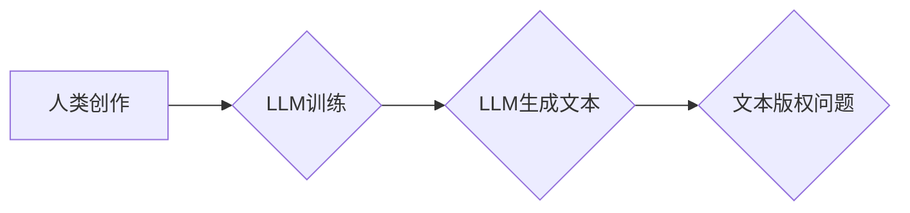

>  知识产权，LLM，大型语言模型，人工智能，版权，专利，商标，创新，创意，伦理

## 1. 背景介绍

大型语言模型（LLM）的兴起标志着人工智能领域迈入了一个新的里程碑。这些模型能够生成逼真的文本、翻译语言、编写代码甚至创作诗歌，展现出强大的语言理解和生成能力。然而，LLM的强大也带来了新的挑战，其中之一就是知识产权问题。

传统知识产权法主要针对人类创造的文本、图像、音乐等作品，而LLM生成的文本是否也应受到保护？谁拥有LLM生成的文本的版权？这些问题尚无定论，需要在技术发展和法律法规的不断完善中寻求解决方案。

## 2. 核心概念与联系

**2.1 知识产权**

知识产权是指个人或组织对知识、创意和发明享有的专属权利。常见的知识产权类型包括：

* **版权：**保护文学、艺术和音乐作品的表达形式。
* **专利：**保护发明或技术方案的独创性。
* **商标：**保护商品或服务的标识。
* **商业秘密：**保护企业内部的 confidential 信息。

**2.2 大型语言模型 (LLM)**

LLM是一种基于深度学习的强大人工智能模型，能够理解和生成人类语言。它们通过训练海量文本数据，学习语言的模式和结构，从而实现各种语言任务，例如：

* 文本生成
* 翻译
* 问答
* 代码生成
* 文本摘要

**2.3 核心概念联系**

LLM的出现挑战了传统知识产权法的边界。LLM生成的文本是否具有原创性？是否可以被视为人类的创作？这些问题需要在技术发展和法律法规的不断完善中寻求解决方案。

**Mermaid 流程图**



## 3. 核心算法原理 & 具体操作步骤

**3.1 算法原理概述**

LLM的核心算法是基于Transformer架构的深度神经网络。Transformer网络通过自注意力机制学习文本中的长距离依赖关系，从而实现更准确的语言理解和生成。

**3.2 算法步骤详解**

1. **数据预处理:** 将文本数据清洗、分词、标记等预处理操作。
2. **模型训练:** 使用训练数据训练Transformer网络，通过反向传播算法优化模型参数。
3. **文本生成:** 将待生成文本输入到训练好的模型中，模型根据训练数据学习到的语言模式生成文本。

**3.3 算法优缺点**

**优点:**

* 强大的语言理解和生成能力
* 可以处理长文本序列
* 能够学习复杂的语言关系

**缺点:**

* 训练成本高
* 需要大量的数据进行训练
* 容易受到训练数据偏差的影响

**3.4 算法应用领域**

* 文本生成
* 翻译
* 问答
* 代码生成
* 文本摘要
* 对话系统

## 4. 数学模型和公式 & 详细讲解 & 举例说明

**4.1 数学模型构建**

LLM的数学模型主要基于Transformer架构，其核心是自注意力机制。自注意力机制可以计算每个词与其他词之间的相关性，从而学习文本中的长距离依赖关系。

**4.2 公式推导过程**

自注意力机制的计算公式如下：

$$
Attention(Q, K, V) = softmax(\frac{QK^T}{\sqrt{d_k}})V
$$

其中：

* $Q$：查询矩阵
* $K$：键矩阵
* $V$：值矩阵
* $d_k$：键向量的维度
* $softmax$：softmax函数

**4.3 案例分析与讲解**

假设我们有一个句子“我爱吃苹果”，我们想要计算“我”与“苹果”之间的注意力权重。

1. 将句子中的每个词转换为词向量。
2. 计算每个词的查询向量、键向量和值向量。
3. 使用公式计算“我”与“苹果”之间的注意力权重。
4. 根据注意力权重，将“苹果”的词向量加权平均，得到“我”对“苹果”的理解。

## 5. 项目实践：代码实例和详细解释说明

**5.1 开发环境搭建**

* Python 3.7+
* PyTorch 或 TensorFlow
* CUDA 和 cuDNN

**5.2 源代码详细实现**

```python
import torch
import torch.nn as nn

class Transformer(nn.Module):
    def __init__(self, vocab_size, embedding_dim, num_heads, num_layers):
        super(Transformer, self).__init__()
        self.embedding = nn.Embedding(vocab_size, embedding_dim)
        self.transformer_layers = nn.ModuleList([
            nn.TransformerEncoderLayer(embedding_dim, num_heads)
            for _ in range(num_layers)
        ])

    def forward(self, x):
        x = self.embedding(x)
        for layer in self.transformer_layers:
            x = layer(x)
        return x
```

**5.3 代码解读与分析**

* `Transformer`类定义了一个Transformer模型。
* `embedding`层将词索引转换为词向量。
* `transformer_layers`是一个模块列表，包含多个`TransformerEncoderLayer`层。
* `forward`方法定义了模型的正向传播过程。

**5.4 运行结果展示**

训练好的模型可以用于文本生成、翻译等任务。

## 6. 实际应用场景

**6.1 文本生成**

LLM可以用于生成各种类型的文本，例如：

* 文章
* 故事
* 代码
* 诗歌

**6.2 翻译**

LLM可以用于将文本从一种语言翻译成另一种语言。

**6.3 问答**

LLM可以用于回答用户的问题，例如：

* 查询事实信息
* 解释概念
* 提供建议

**6.4 未来应用展望**

LLM在未来将有更广泛的应用场景，例如：

* 个性化教育
* 智能客服
* 创意写作辅助

## 7. 工具和资源推荐

**7.1 学习资源推荐**

* **论文:**
    * Attention Is All You Need (Vaswani et al., 2017)
    * BERT: Pre-training of Deep Bidirectional Transformers for Language Understanding (Devlin et al., 2018)
* **书籍:**
    * Deep Learning (Goodfellow et al., 2016)
    * Natural Language Processing with Python (Bird et al., 2009)

**7.2 开发工具推荐**

* **PyTorch:** https://pytorch.org/
* **TensorFlow:** https://www.tensorflow.org/

**7.3 相关论文推荐**

* GPT-3: Language Models are Few-Shot Learners (Brown et al., 2020)
* T5: Text-to-Text Transfer Transformer (Raffel et al., 2019)

## 8. 总结：未来发展趋势与挑战

**8.1 研究成果总结**

LLM在语言理解和生成方面取得了显著的进展，为人工智能的未来发展提供了新的可能性。

**8.2 未来发展趋势**

* 模型规模的进一步扩大
* 跨模态LLM的开发
* 更加安全、可靠和可解释的LLM

**8.3 面临的挑战**

* 数据偏见和公平性问题
* 虚假信息和滥用问题
* 知识产权和伦理问题

**8.4 研究展望**

未来研究将集中在解决LLM面临的挑战，使其更加安全、可靠、公平和可解释，并探索其在更多领域的应用。

## 9. 附录：常见问题与解答

**9.1 LLM生成的文本是否具有版权？**

目前，LLM生成的文本的版权问题尚无定论。

**9.2 如何防止LLM被用于生成虚假信息？**

需要开发更加安全的LLM模型，并加强对LLM应用的监管。

**9.3 如何解决LLM数据偏见问题？**

需要使用更加多样化的训练数据，并开发算法来减少数据偏见的影响。


作者：禅与计算机程序设计艺术 / Zen and the Art of Computer Programming 
<end_of_turn>