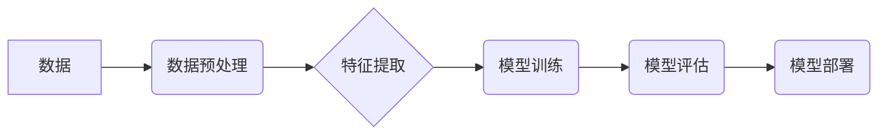

>人工智能，深度学习，神经网络，机器学习，算法，数据科学，编程

## 1. 背景介绍

人工智能（AI）正以惊人的速度发展，深刻地改变着我们的生活和工作方式。从智能手机的语音助手到自动驾驶汽车，AI技术的应用无处不在。作为一名AI领域的专家，我经常被问到关于AI未来的问题，以及AI技术对人类社会的影响。

在今天的脱口秀中，我将分享我对AI发展的一些见解和思考，并探讨AI技术与人类生活之间的关系。

## 2. 核心概念与联系

**2.1 深度学习**

深度学习是机器学习的一个子领域，它利用多层神经网络来模拟人类大脑的学习过程。

**2.2 神经网络**

神经网络是由许多相互连接的神经元组成的网络结构。每个神经元接收来自其他神经元的输入，并根据一定的权重进行计算，最终输出一个信号。

**2.3 机器学习**

机器学习是人工智能的一个分支，它使计算机能够从数据中学习，并根据学习到的知识进行预测或决策。

**2.4 数据科学**

数据科学是一个跨学科领域，它利用统计学、计算机科学和领域知识来从数据中提取有价值的信息。

**Mermaid 流程图**



## 3. 核心算法原理 & 具体操作步骤

**3.1 算法原理概述**

深度学习算法的核心是反向传播算法。反向传播算法通过计算误差，并根据误差调整神经网络的权重，从而使模型的预测结果越来越准确。

**3.2 算法步骤详解**

1. **数据预处理:** 将原始数据进行清洗、转换和特征工程，使其适合深度学习模型的训练。
2. **模型构建:** 根据任务需求选择合适的深度学习模型架构，例如卷积神经网络（CNN）、循环神经网络（RNN）等。
3. **模型训练:** 使用训练数据训练深度学习模型，并通过反向传播算法调整模型参数。
4. **模型评估:** 使用测试数据评估模型的性能，并根据评估结果进行模型调优。
5. **模型部署:** 将训练好的模型部署到实际应用场景中，用于进行预测或决策。

**3.3 算法优缺点**

**优点:**

* 能够学习复杂的数据模式。
* 性能优于传统机器学习算法。
* 可用于各种任务，例如图像识别、自然语言处理等。

**缺点:**

* 需要大量的训练数据。
* 计算资源需求高。
* 模型解释性差。

**3.4 算法应用领域**

* **图像识别:** 人脸识别、物体检测、图像分类等。
* **自然语言处理:** 机器翻译、文本摘要、情感分析等。
* **语音识别:** 语音转文本、语音助手等。
* **推荐系统:** 商品推荐、内容推荐等。
* **医疗诊断:** 病情预测、疾病诊断等。

## 4. 数学模型和公式 & 详细讲解 & 举例说明

**4.1 数学模型构建**

深度学习模型的核心是神经网络，神经网络可以看作是一个多层感知机。每个神经元接收来自其他神经元的输入，并通过一个激活函数进行处理，输出一个信号。

**4.2 公式推导过程**

神经网络的输出可以表示为：

$$
y = f(W^L x^L + b^L)
$$

其中：

* $y$ 是神经网络的输出。
* $f$ 是激活函数。
* $W^L$ 是第 $L$ 层神经网络的权重矩阵。
* $x^L$ 是第 $L$ 层神经网络的输入向量。
* $b^L$ 是第 $L$ 层神经网络的偏置向量。

**4.3 案例分析与讲解**

例如，在图像识别任务中，我们可以使用卷积神经网络（CNN）来提取图像特征。CNN的卷积层可以学习图像的局部特征，而池化层可以降低图像的维度，提高模型的鲁棒性。

## 5. 项目实践：代码实例和详细解释说明

**5.1 开发环境搭建**

可以使用Python语言和深度学习框架TensorFlow或PyTorch来开发深度学习项目。

**5.2 源代码详细实现**

```python
import tensorflow as tf

# 定义模型架构
model = tf.keras.models.Sequential([
    tf.keras.layers.Conv2D(32, (3, 3), activation='relu', input_shape=(28, 28, 1)),
    tf.keras.layers.MaxPooling2D((2, 2)),
    tf.keras.layers.Conv2D(64, (3, 3), activation='relu'),
    tf.keras.layers.MaxPooling2D((2, 2)),
    tf.keras.layers.Flatten(),
    tf.keras.layers.Dense(10, activation='softmax')
])

# 编译模型
model.compile(optimizer='adam',
              loss='sparse_categorical_crossentropy',
              metrics=['accuracy'])

# 训练模型
model.fit(x_train, y_train, epochs=5)

# 评估模型
loss, accuracy = model.evaluate(x_test, y_test)
print('Test loss:', loss)
print('Test accuracy:', accuracy)
```

**5.3 代码解读与分析**

这段代码定义了一个简单的卷积神经网络模型，用于手写数字识别任务。模型包含两层卷积层、两层池化层、一层全连接层和一层输出层。

**5.4 运行结果展示**

训练完成后，我们可以使用测试数据评估模型的性能。

## 6. 实际应用场景

**6.1 医疗诊断**

深度学习可以用于分析医学图像，辅助医生进行疾病诊断。例如，可以利用深度学习模型识别肺癌、乳腺癌等疾病。

**6.2 自动驾驶**

深度学习可以用于训练自动驾驶汽车的感知系统，例如识别道路标线、交通信号灯、行人等。

**6.3 金融风险管理**

深度学习可以用于分析金融数据，识别欺诈交易、预测市场风险等。

**6.4 未来应用展望**

随着人工智能技术的不断发展，深度学习将在更多领域得到应用，例如个性化教育、智能家居、机器人等。

## 7. 工具和资源推荐

**7.1 学习资源推荐**

* **书籍:**
    * 深度学习
    * 构建深度学习模型
* **在线课程:**
    * Coursera深度学习课程
    * Udacity深度学习工程师课程

**7.2 开发工具推荐**

* **TensorFlow:** 开源深度学习框架
* **PyTorch:** 开源深度学习框架
* **Keras:** 高级深度学习API

**7.3 相关论文推荐**

* **ImageNet Classification with Deep Convolutional Neural Networks**
* **Deep Residual Learning for Image Recognition**
* **Attention Is All You Need**

## 8. 总结：未来发展趋势与挑战

**8.1 研究成果总结**

近年来，深度学习取得了显著的成果，在图像识别、自然语言处理等领域取得了突破性的进展。

**8.2 未来发展趋势**

* **模型规模和复杂度提升:** 未来深度学习模型将更加庞大，更加复杂。
* **算法效率提升:** 研究人员将继续探索更有效的深度学习算法，提高模型训练和推理效率。
* **解释性增强:** 研究人员将致力于提高深度学习模型的解释性，使模型的决策过程更加透明。

**8.3 面临的挑战**

* **数据获取和标注:** 深度学习模型需要大量的训练数据，数据获取和标注成本高昂。
* **计算资源需求:** 训练大型深度学习模型需要大量的计算资源，这对于资源有限的机构来说是一个挑战。
* **伦理问题:** 深度学习技术的应用可能带来一些伦理问题，例如算法偏见、隐私泄露等。

**8.4 研究展望**

未来，深度学习将继续朝着更智能、更安全、更可解释的方向发展。

## 9. 附录：常见问题与解答

**9.1 什么是深度学习？**

深度学习是机器学习的一个子领域，它利用多层神经网络来模拟人类大脑的学习过程。

**9.2 深度学习有哪些应用场景？**

深度学习的应用场景非常广泛，例如图像识别、自然语言处理、语音识别、推荐系统等。

**9.3 如何学习深度学习？**

可以阅读深度学习相关的书籍和论文，参加在线课程，实践深度学习项目等。

作者：禅与计算机程序设计艺术 / Zen and the Art of Computer Programming


<end_of_turn>