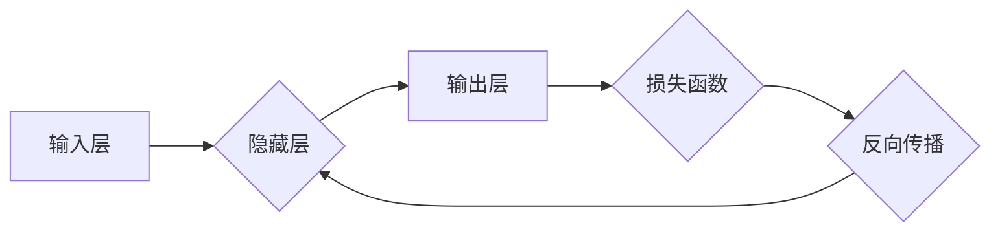

> 神经网络，深度学习，人工智能，机器学习，卷积神经网络，循环神经网络，反向传播

## 1. 背景介绍

人工智能（AI）近年来发展迅速，已渗透到生活的方方面面。其中，神经网络作为人工智能的核心技术之一，在图像识别、自然语言处理、语音识别等领域取得了突破性的进展。

传统的机器学习算法依赖于人工特征工程，而神经网络则能够自动学习数据中的特征，从而实现更强大的学习能力。

神经网络的灵感来源于人脑的神经元结构。它由相互连接的节点（神经元）组成，每个节点接收来自其他节点的输入信号，并根据一定的权重进行处理，最终输出信号。

神经网络的学习过程就是通过调整节点之间的权重，使得网络的输出与实际目标尽可能接近的过程。

## 2. 核心概念与联系

### 2.1 神经元

神经元是神经网络的基本单元，模拟人脑中的神经元。每个神经元接收来自其他神经元的输入信号，并通过激活函数进行处理，输出信号。

### 2.2 层

神经元按照功能和层次结构组织成层。神经网络通常由输入层、隐藏层和输出层组成。

* **输入层:**接收原始数据。
* **隐藏层:**对数据进行特征提取和处理。
* **输出层:**输出最终结果。

### 2.3 权重

权重是连接神经元之间的参数，决定了每个输入信号对神经元的贡献程度。

### 2.4 激活函数

激活函数决定了神经元的输出信号。常见的激活函数包括 sigmoid 函数、ReLU 函数等。

### 2.5 反向传播算法

反向传播算法是训练神经网络的关键算法，用于调整神经元之间的权重，使得网络的输出与实际目标尽可能接近。

**Mermaid 流程图**



## 3. 核心算法原理 & 具体操作步骤

### 3.1 算法原理概述

反向传播算法的核心思想是利用梯度下降法，不断调整神经网络的权重，使得网络的输出误差最小化。

具体步骤如下：

1. **前向传播:** 将输入数据通过神经网络，计算输出结果。
2. **计算损失函数:** 计算输出结果与实际目标之间的误差。
3. **反向传播:** 计算误差对每个权重的梯度。
4. **更新权重:** 根据梯度更新每个权重，使得误差减小。

### 3.2 算法步骤详解

1. **初始化权重:** 将神经网络的权重随机初始化。
2. **前向传播:** 将输入数据通过神经网络，计算输出结果。
3. **计算损失函数:** 使用损失函数计算输出结果与实际目标之间的误差。
4. **反向传播:** 计算误差对每个权重的梯度。
5. **更新权重:** 使用梯度下降法更新每个权重，使得误差减小。
6. **重复步骤2-5:** 迭代多次，直到误差达到预设阈值。

### 3.3 算法优缺点

**优点:**

* 能够自动学习数据中的特征。
* 具有强大的学习能力，能够解决复杂问题。

**缺点:**

* 训练时间长，需要大量的计算资源。
* 容易过拟合，需要进行正则化处理。

### 3.4 算法应用领域

* **图像识别:** 人脸识别、物体检测、图像分类等。
* **自然语言处理:** 机器翻译、文本摘要、情感分析等。
* **语音识别:** 语音转文本、语音助手等。
* **推荐系统:** 商品推荐、内容推荐等。

## 4. 数学模型和公式 & 详细讲解 & 举例说明

### 4.1 数学模型构建

神经网络可以看作是一个多层感知机，其数学模型可以表示为：

$$
y = f(W^L x^L + b^L)
$$

其中：

* $y$ 是输出结果。
* $x^L$ 是第 $L$ 层的输入。
* $W^L$ 是第 $L$ 层的权重矩阵。
* $b^L$ 是第 $L$ 层的偏置向量。
* $f$ 是激活函数。

### 4.2 公式推导过程

反向传播算法的核心是计算误差对每个权重的梯度。

梯度可以表示为：

$$
\frac{\partial Loss}{\partial W} = \frac{\partial Loss}{\partial y} \cdot \frac{\partial y}{\partial W}
$$

其中：

* $Loss$ 是损失函数。
* $y$ 是输出结果。
* $W$ 是权重。

### 4.3 案例分析与讲解

假设我们有一个简单的神经网络，用于预测房价。

输入特征包括房屋面积、房间数量等。

输出结果是房价。

我们可以使用反向传播算法训练这个神经网络，使得其能够准确预测房价。

## 5. 项目实践：代码实例和详细解释说明

### 5.1 开发环境搭建

* Python 3.x
* TensorFlow 或 PyTorch

### 5.2 源代码详细实现

```python
import tensorflow as tf

# 定义模型
model = tf.keras.models.Sequential([
    tf.keras.layers.Dense(64, activation='relu', input_shape=(4,)),
    tf.keras.layers.Dense(1)
])

# 编译模型
model.compile(optimizer='adam', loss='mse')

# 训练模型
model.fit(x_train, y_train, epochs=10)

# 评估模型
loss = model.evaluate(x_test, y_test)
```

### 5.3 代码解读与分析

* `tf.keras.models.Sequential`: 创建一个顺序模型，即层级结构。
* `tf.keras.layers.Dense`: 定义一个全连接层。
* `activation='relu'`: 使用ReLU激活函数。
* `input_shape=(4,)`: 输入数据的形状为4维。
* `optimizer='adam'`: 使用Adam优化器。
* `loss='mse'`: 使用均方误差损失函数。
* `model.fit`: 训练模型。
* `model.evaluate`: 评估模型。

### 5.4 运行结果展示

训练完成后，我们可以使用模型预测房价。

## 6. 实际应用场景

### 6.1 图像识别

* **人脸识别:** 用于解锁手机、身份验证等。
* **物体检测:** 用于自动驾驶、安防监控等。
* **图像分类:** 用于医学影像诊断、产品分类等。

### 6.2 自然语言处理

* **机器翻译:** 将文本从一种语言翻译成另一种语言。
* **文本摘要:** 自动生成文本的摘要。
* **情感分析:** 分析文本的情感倾向。

### 6.3 语音识别

* **语音转文本:** 将语音转换为文本。
* **语音助手:** 例如 Siri、Alexa 等。

### 6.4 未来应用展望

* **个性化推荐:** 基于用户的行为和偏好，提供个性化的产品和服务推荐。
* **医疗诊断:** 利用神经网络分析医学影像，辅助医生进行诊断。
* **科学研究:** 用于加速科学发现，例如药物研发、材料科学等。

## 7. 工具和资源推荐

### 7.1 学习资源推荐

* **书籍:**
    * 《深度学习》
    * 《神经网络与深度学习》
* **在线课程:**
    * Coursera: 深度学习
    * Udacity: 深度学习工程师
* **博客:**
    * TensorFlow Blog
    * PyTorch Blog

### 7.2 开发工具推荐

* **TensorFlow:** 开源深度学习框架。
* **PyTorch:** 开源深度学习框架。
* **Keras:** 高级深度学习API，可以运行在TensorFlow、Theano等框架上。

### 7.3 相关论文推荐

* **AlexNet:** ImageNet Classification with Deep Convolutional Neural Networks
* **VGGNet:** Very Deep Convolutional Networks for Large-Scale Image Recognition
* **ResNet:** Deep Residual Learning for Image Recognition

## 8. 总结：未来发展趋势与挑战

### 8.1 研究成果总结

神经网络在人工智能领域取得了突破性的进展，在图像识别、自然语言处理、语音识别等领域取得了优异的性能。

### 8.2 未来发展趋势

* **更深更广的神经网络:** 研究更深层、更广的网络结构，提高模型的表达能力。
* **自监督学习:** 利用未标记数据进行训练，降低对标注数据的依赖。
* **可解释性:** 研究神经网络的决策过程，提高模型的可解释性。

### 8.3 面临的挑战

* **数据获取和标注:** 训练神经网络需要大量的标注数据，获取和标注数据成本高。
* **计算资源:** 训练大型神经网络需要大量的计算资源，成本高昂。
* **模型可解释性:** 神经网络的决策过程难以解释，缺乏透明度。

### 8.4 研究展望

未来，神经网络技术将继续发展，在更多领域发挥作用。

## 9. 附录：常见问题与解答

### 9.1 什么是激活函数？

激活函数是神经网络中一个重要的组成部分，它决定了神经元的输出信号。常见的激活函数包括 sigmoid 函数、ReLU 函数等。

### 9.2 什么是反向传播算法？

反向传播算法是训练神经网络的关键算法，用于调整神经网络的权重，使得网络的输出误差最小化。

### 9.3 如何选择合适的激活函数？

选择合适的激活函数取决于具体的应用场景。

例如，对于分类问题，可以使用 sigmoid 函数；对于回归问题，可以使用 ReLU 函数。

### 9.4 如何评估神经网络的性能？

常用的评估指标包括准确率、召回率、F1-score 等。

### 9.5 如何防止神经网络过拟合？

常用的防止过拟合的方法包括正则化、数据增强、Dropout 等。


作者：禅与计算机程序设计艺术 / Zen and the Art of Computer Programming 
<end_of_turn>