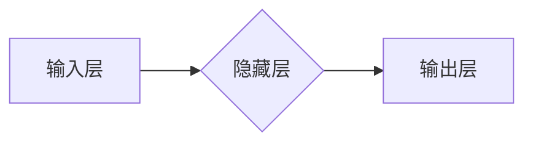

> 神经网络,深度学习,机器学习,人工智能,卷积神经网络,循环神经网络,自然语言处理,计算机视觉

## 1. 背景介绍

人工智能（AI）正以惊人的速度发展，深刻地改变着我们生活的方方面面。其中，神经网络作为人工智能的核心技术之一，在过去几年取得了突破性的进展，并在图像识别、自然语言处理、语音识别等领域展现出强大的应用潜力。

传统的计算机程序依赖于明确的规则和指令，而神经网络则模仿了人脑的神经元结构和连接方式，通过学习和训练，能够从海量数据中提取特征，并进行复杂的决策和预测。

## 2. 核心概念与联系

神经网络的核心概念包括：

* **神经元:** 神经网络的基本单元，模拟人脑中的神经元，接收输入信号，进行处理，并输出信号。
* **连接权重:** 连接神经元的线之间的权重，决定了信号传递的强度。
* **激活函数:** 用于将神经元的输入转换为输出的非线性函数，赋予神经网络学习非线性关系的能力。
* **层:** 神经元按功能和层次结构组织成层，包括输入层、隐藏层和输出层。

**Mermaid 流程图:**



## 3. 核心算法原理 & 具体操作步骤

### 3.1  算法原理概述

神经网络的训练过程本质上是一个参数优化过程，目标是找到最优的连接权重，使得神经网络的输出与实际目标值之间的误差最小化。常用的训练算法包括：

* **反向传播算法:** 通过计算误差梯度，反向传播到各层神经元，更新连接权重。

### 3.2  算法步骤详解

1. **初始化连接权重:** 随机赋予连接权重初始值。
2. **前向传播:** 将输入数据传递到神经网络，计算各层神经元的输出。
3. **计算误差:** 将神经网络的输出与实际目标值进行比较，计算误差。
4. **反向传播:** 计算误差梯度，反向传播到各层神经元。
5. **更新连接权重:** 根据误差梯度，更新连接权重。
6. **重复步骤2-5:** 迭代训练，直到误差达到预设阈值或训练次数达到上限。

### 3.3  算法优缺点

**优点:**

* 能够学习复杂非线性关系。
* 具有强大的泛化能力，能够应用于不同的任务和领域。

**缺点:**

* 训练过程需要大量数据和计算资源。
* 训练过程容易陷入局部最优解。
* 模型解释性较差，难以理解模型的决策过程。

### 3.4  算法应用领域

神经网络在各个领域都有广泛的应用，例如：

* **计算机视觉:** 图像识别、物体检测、图像分割、人脸识别等。
* **自然语言处理:** 文本分类、情感分析、机器翻译、文本生成等。
* **语音识别:** 语音转文本、语音合成等。
* **推荐系统:** 商品推荐、内容推荐等。
* **医疗诊断:** 疾病诊断、影像分析等。

## 4. 数学模型和公式 & 详细讲解 & 举例说明

### 4.1  数学模型构建

神经网络可以看作是一个多层感知机（MLP），其数学模型可以表示为：

* **输入层:**  $x = [x_1, x_2, ..., x_n]$
* **隐藏层:** $h = f(W_1x + b_1)$
* **输出层:** $y = f(W_2h + b_2)$

其中：

* $x$ 是输入向量。
* $h$ 是隐藏层输出向量。
* $y$ 是输出向量。
* $W_1$ 和 $W_2$ 是连接权重矩阵。
* $b_1$ 和 $b_2$ 是偏置向量。
* $f$ 是激活函数。

### 4.2  公式推导过程

反向传播算法的核心是计算误差梯度，并根据梯度更新连接权重。

* **损失函数:** $L(y, \hat{y})$，衡量预测值 $\hat{y}$ 与真实值 $y$ 之间的差异。
* **误差梯度:** $\frac{\partial L}{\partial W}$，表示损失函数对连接权重 $W$ 的偏导数。

通过链式法则，可以将误差梯度反向传播到各层神经元，并更新连接权重。

### 4.3  案例分析与讲解

假设我们训练一个简单的神经网络，用于分类手写数字。

* 输入层：784 个神经元，对应图像的像素值。
* 隐藏层：128 个神经元。
* 输出层：10 个神经元，对应数字 0 到 9。

训练过程中，我们使用 MNIST 手写数字数据集，并使用反向传播算法进行训练。

## 5. 项目实践：代码实例和详细解释说明

### 5.1  开发环境搭建

* Python 3.x
* TensorFlow 或 PyTorch 等深度学习框架

### 5.2  源代码详细实现

```python
import tensorflow as tf

# 定义模型
model = tf.keras.models.Sequential([
    tf.keras.layers.Flatten(input_shape=(28, 28)),
    tf.keras.layers.Dense(128, activation='relu'),
    tf.keras.layers.Dense(10, activation='softmax')
])

# 编译模型
model.compile(optimizer='adam',
              loss='sparse_categorical_crossentropy',
              metrics=['accuracy'])

# 训练模型
model.fit(x_train, y_train, epochs=10)

# 评估模型
loss, accuracy = model.evaluate(x_test, y_test)
print('Test loss:', loss)
print('Test accuracy:', accuracy)
```

### 5.3  代码解读与分析

* `tf.keras.models.Sequential`: 创建一个顺序模型，层级结构清晰。
* `tf.keras.layers.Flatten`: 将二维图像数据转换为一维向量。
* `tf.keras.layers.Dense`: 全连接层，连接所有上一层神经元。
* `activation='relu'`: 使用 ReLU 激活函数。
* `optimizer='adam'`: 使用 Adam 优化器。
* `loss='sparse_categorical_crossentropy'`: 使用类别交叉熵损失函数。
* `metrics=['accuracy']`: 使用准确率作为评估指标。

### 5.4  运行结果展示

训练完成后，模型会输出测试集上的损失值和准确率。

## 6. 实际应用场景

### 6.1  图像识别

* **人脸识别:** 用于解锁手机、验证身份、监控安全等。
* **物体检测:** 用于自动驾驶、安防监控、工业自动化等。
* **图像分类:** 用于医学影像诊断、产品分类、内容推荐等。

### 6.2  自然语言处理

* **机器翻译:** 将文本从一种语言翻译成另一种语言。
* **文本摘要:** 自动生成文本的简短摘要。
* **情感分析:** 分析文本的情感倾向，用于市场调研、客户服务等。

### 6.3  语音识别

* **语音转文本:** 将语音转换为文本，用于语音助手、听写软件等。
* **语音合成:** 将文本转换为语音，用于语音导航、语音播报等。

### 6.4  未来应用展望

神经网络的应用前景广阔，未来将应用于更多领域，例如：

* **个性化教育:** 根据学生的学习情况，提供个性化的学习方案。
* **精准医疗:** 根据患者的基因信息和病史，提供个性化的治疗方案。
* **自动驾驶:** 提高自动驾驶汽车的安全性、可靠性和智能化水平。

## 7. 工具和资源推荐

### 7.1  学习资源推荐

* **书籍:**
    * 《深度学习》
    * 《神经网络与深度学习》
* **在线课程:**
    * Coursera: 深度学习
    * Udacity: 深度学习工程师
* **博客和网站:**
    * TensorFlow 官方博客
    * PyTorch 官方博客
    * Towards Data Science

### 7.2  开发工具推荐

* **TensorFlow:** 开源深度学习框架，支持多种硬件平台。
* **PyTorch:** 开源深度学习框架，以其灵活性和易用性而闻名。
* **Keras:** 高级深度学习 API，可以运行在 TensorFlow、Theano 或 CNTK 后端。

### 7.3  相关论文推荐

* **AlexNet:** ImageNet Classification with Deep Convolutional Neural Networks
* **VGGNet:** Very Deep Convolutional Networks for Large-Scale Image Recognition
* **ResNet:** Deep Residual Learning for Image Recognition

## 8. 总结：未来发展趋势与挑战

### 8.1  研究成果总结

近年来，神经网络在各个领域取得了突破性的进展，例如：

* **图像识别:** 准确率已接近人类水平。
* **自然语言处理:** 机器翻译、文本生成等任务取得了显著进步。
* **语音识别:** 语音转文本的准确率大幅提升。

### 8.2  未来发展趋势

* **更深更广的神经网络:** 研究更深层、更广义的神经网络结构，提高模型的表达能力和泛化能力。
* **自监督学习:** 利用无标签数据进行训练，降低对标注数据的依赖。
* **联邦学习:** 在不共享原始数据的情况下，训练模型，保护用户隐私。
* **神经硬件:** 开发专门用于运行神经网络的硬件，提高训练和推理速度。

### 8.3  面临的挑战

* **数据依赖:** 神经网络需要大量数据进行训练，数据获取和标注成本高昂。
* **可解释性:** 神经网络的决策过程难以解释，缺乏透明度。
* **安全性和鲁棒性:** 神经网络容易受到攻击和对抗样本的影响。

### 8.4  研究展望

未来，神经网络研究将继续朝着更智能、更安全、更可解释的方向发展，为人类社会带来更多福祉。

## 9. 附录：常见问题与解答

* **什么是激活函数？** 激活函数用于将神经元的输入转换为输出，赋予神经网络学习非线性关系的能力。常见的激活函数包括 ReLU、Sigmoid 和 Tanh。
* **什么是反向传播算法？** 反向传播算法是训练神经网络的核心算法，通过计算误差梯度，反向传播到各层神经元，并更新连接权重。
* **如何选择合适的激活函数？** 不同的激活函数适用于不同的任务和网络结构。ReLU 通常是首选，但其他激活函数也可能更适合特定场景。

作者：禅与计算机程序设计艺术 / Zen and the Art of Computer Programming


<end_of_turn>