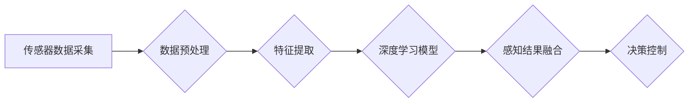

> 自动驾驶, 分布式传感器融合, 深度学习, 计算机视觉, 雷达, lidar, 
> 惯性导航, Kalman滤波, 决策控制

## 1. 背景介绍

自动驾驶技术作为未来交通运输的重要发展方向，近年来取得了显著进展。然而，实现真正安全的自动驾驶仍然面临着诸多挑战，其中之一就是如何有效地融合来自不同传感器的数据，构建一个可靠的感知、决策和控制系统。

传统的自动驾驶系统通常依赖于单一传感器，例如摄像头或雷达，这会导致感知信息的缺失和鲁棒性不足。随着传感器技术的进步，多传感器融合技术逐渐成为自动驾驶系统的重要组成部分。分布式传感器融合架构，通过将传感器数据在多个节点进行处理和融合，可以有效提高感知精度、鲁棒性和可靠性。

## 2. 核心概念与联系

### 2.1 分布式传感器融合

分布式传感器融合是指将传感器数据在多个节点进行处理和融合，每个节点负责处理特定传感器的数据，并通过通信网络将处理结果传递给其他节点，最终实现全局感知。

### 2.2 自动驾驶感知系统

自动驾驶感知系统负责收集和理解周围环境的信息，包括车辆、行人、道路标志、交通信号等。感知系统通常由多种传感器组成，例如摄像头、雷达、激光雷达（LiDAR）、惯性导航单元（IMU）等。

### 2.3 深度学习

深度学习是一种机器学习方法，它利用多层神经网络来学习数据特征，并进行预测或分类。深度学习在自动驾驶领域得到了广泛应用，例如图像识别、目标检测、路径规划等。

**Mermaid 流程图**



## 3. 核心算法原理 & 具体操作步骤

### 3.1 算法原理概述

分布式传感器融合架构通常采用以下核心算法：

* **Kalman滤波:** 用于估计系统状态和噪声，并根据传感器测量值进行状态更新。
* **粒子滤波:** 用于处理非线性系统，通过生成多个粒子来近似系统状态分布。
* **深度学习:** 用于学习传感器数据特征，并进行感知决策。

### 3.2 算法步骤详解

1. **数据采集:** 从各个传感器收集原始数据。
2. **数据预处理:** 对原始数据进行滤波、去噪、畸变校正等处理，以提高数据质量。
3. **特征提取:** 从预处理后的数据中提取关键特征，例如车辆位置、速度、方向等。
4. **深度学习模型训练:** 利用深度学习模型对传感器数据进行训练，学习感知特征和决策规则。
5. **感知结果融合:** 将各个节点处理后的感知结果进行融合，例如使用Kalman滤波器进行状态估计。
6. **决策控制:** 根据融合后的感知结果，进行决策控制，例如规划路径、控制转向和加速等。

### 3.3 算法优缺点

**优点:**

* **提高感知精度:** 通过融合来自多个传感器的数据，可以获得更全面的环境感知信息，提高感知精度。
* **增强鲁棒性:** 不同传感器具有不同的特点和局限性，通过融合可以弥补各自的不足，增强系统的鲁棒性。
* **提高可靠性:** 多节点分布式架构可以提高系统的可靠性，即使部分节点出现故障，也能保证系统正常运行。

**缺点:**

* **复杂度增加:** 分布式传感器融合架构的实现较为复杂，需要考虑数据同步、通信网络、节点协作等问题。
* **计算资源消耗:** 数据融合和深度学习模型训练需要消耗大量的计算资源。
* **算法优化:** 需要不断优化算法和模型，以提高融合效率和精度。

### 3.4 算法应用领域

分布式传感器融合技术广泛应用于自动驾驶、机器人、无人机、智能监控等领域。

## 4. 数学模型和公式 & 详细讲解 & 举例说明

### 4.1 数学模型构建

假设我们有一个包含多个传感器的数据融合系统，每个传感器都测量同一个物理量，例如车辆的位置。我们可以用以下数学模型来描述传感器测量值和真实值之间的关系：

$$
z_i = h(x_t) + v_i
$$

其中：

* $z_i$ 是第 $i$ 个传感器测量的值。
* $x_t$ 是真实值。
* $h(x_t)$ 是传感器测量模型。
* $v_i$ 是第 $i$ 个传感器测量噪声。

### 4.2 公式推导过程

Kalman滤波算法是一种常用的传感器融合算法，它利用状态空间模型和最小二乘估计原理来估计系统状态。Kalman滤波器的核心公式包括：

* **状态预测:**

$$
\hat{x}_{t+1|t} = A \hat{x}_{t|t} + B u_t
$$

* **状态更新:**

$$
\hat{x}_{t+1|t+1} = \hat{x}_{t+1|t} + K_t (z_{t+1} - H \hat{x}_{t+1|t})
$$

其中：

* $\hat{x}_{t|t}$ 是时间 $t$ 时刻对状态 $x_t$ 的估计值。
* $A$ 和 $B$ 是系统状态转移矩阵和控制输入矩阵。
* $u_t$ 是控制输入。
* $H$ 是观测矩阵。
* $K_t$ 是卡尔曼增益。

### 4.3 案例分析与讲解

假设我们有一个无人驾驶汽车，它配备了摄像头、雷达和激光雷达等传感器。我们可以使用Kalman滤波算法来融合来自不同传感器的测量值，估计车辆的位置和速度。

例如，摄像头可以提供车辆的图像信息，雷达可以提供车辆的距离信息，激光雷达可以提供车辆的3D点云信息。我们可以将这些信息融合到Kalman滤波器中，得到更准确的车辆状态估计。

## 5. 项目实践：代码实例和详细解释说明

### 5.1 开发环境搭建

* 操作系统：Ubuntu 20.04
* 编程语言：Python 3.8
* 深度学习框架：TensorFlow 2.0
* 数据处理库：NumPy, Pandas
* 图像处理库：OpenCV

### 5.2 源代码详细实现

```python
# Kalman滤波器实现
class KalmanFilter:
    def __init__(self, state_dim, measurement_dim):
        self.state_dim = state_dim
        self.measurement_dim = measurement_dim
        self.A = np.eye(state_dim)  # 状态转移矩阵
        self.B = np.zeros((state_dim, 1))  # 控制输入矩阵
        self.H = np.eye(measurement_dim)  # 观测矩阵
        self.Q = np.eye(state_dim)  # 状态噪声协方差矩阵
        self.R = np.eye(measurement_dim)  # 测量噪声协方差矩阵
        self.x_hat = np.zeros((state_dim, 1))  # 状态估计
        self.P = np.eye(state_dim)  # 状态估计协方差矩阵

    def predict(self):
        self.x_hat = self.A @ self.x_hat
        self.P = self.A @ self.P @ self.A.T + self.Q

    def update(self, z):
        y = z - self.H @ self.x_hat
        S = self.H @ self.P @ self.H.T + self.R
        K = self.P @ self.H.T @ np.linalg.inv(S)
        self.x_hat = self.x_hat + K @ y
        self.P = (np.eye(self.state_dim) - K @ self.H) @ self.P

# 数据融合示例
kf = KalmanFilter(state_dim=2, measurement_dim=1)  # 状态维度为2，测量维度为1
# ...
# 使用传感器数据更新Kalman滤波器
kf.update(z)
# 获取状态估计
x_hat = kf.x_hat
```

### 5.3 代码解读与分析

* **KalmanFilter类:** 实现Kalman滤波算法的核心逻辑。
* **__init__方法:** 初始化Kalman滤波器参数，例如状态转移矩阵、观测矩阵、噪声协方差矩阵等。
* **predict方法:** 进行状态预测，更新状态估计和协方差矩阵。
* **update方法:** 使用传感器测量值更新状态估计和协方差矩阵。
* **数据融合示例:** 使用Kalman滤波器融合来自不同传感器的测量值，估计车辆的位置。

### 5.4 运行结果展示

运行代码后，可以得到车辆的位置估计结果，并可视化展示。

## 6. 实际应用场景

### 6.1 自动驾驶汽车

分布式传感器融合技术是自动驾驶汽车的关键技术之一，它可以帮助自动驾驶汽车感知周围环境、规划路径、控制转向和加速等。

### 6.2 无人机

无人机也需要利用分布式传感器融合技术来感知周围环境、避障、定位等。

### 6.3 机器人

机器人需要利用分布式传感器融合技术来感知周围环境、导航、抓取物体等。

### 6.4 智能监控

分布式传感器融合技术可以用于智能监控系统，例如监控人员的移动轨迹、识别异常行为等。

### 6.5 未来应用展望

分布式传感器融合技术在未来将有更广泛的应用，例如：

* **智能家居:** 利用分布式传感器融合技术，可以实现智能家居的场景感知、行为识别、安全保障等功能。
* **智慧城市:** 利用分布式传感器融合技术，可以实现智慧城市的交通管理、环境监测、公共安全等功能。
* **工业自动化:** 利用分布式传感器融合技术，可以实现工业自动化的过程监控、故障诊断、优化控制等功能。

## 7. 工具和资源推荐

### 7.1 学习资源推荐

* **书籍:**
    * 《机器人操作系统》
    * 《自动驾驶技术》
    * 《深度学习》
* **在线课程:**
    * Coursera: 自动驾驶
    * Udacity: 自动驾驶工程师
    * edX: 深度学习

### 7.2 开发工具推荐

* **ROS (Robot Operating System):** 用于机器人开发的开源软件框架。
* **Gazebo:** 用于机器人仿真和测试的开源软件。
* **TensorFlow:** 用于深度学习开发的开源软件框架。
* **PyTorch:** 用于深度学习开发的开源软件框架。

### 7.3 相关论文推荐

* **论文:**
    * “A Survey on Sensor Fusion for Autonomous Driving”
    * “Kalman Filtering for Autonomous Vehicles”
    * “Deep Learning for Autonomous Driving”

## 8. 总结：未来发展趋势与挑战

### 8.1 研究成果总结

分布式传感器融合技术在自动驾驶、机器人、无人机等领域取得了显著进展，为实现智能化系统提供了重要的技术支撑。

### 8.2 未来发展趋势

* **更先进的算法:** 研究更先进的传感器融合算法，例如基于深度学习的融合算法，提高融合精度和鲁棒性。
* **更强大的计算能力:** 随着计算能力的提升，可以实现更复杂的传感器融合模型，处理更丰富的数据。
* **更广泛的应用场景:** 分布式传感器融合技术将应用于更多领域，例如智能家居、智慧城市、工业自动化等。

### 8.3 面临的挑战

* **数据获取和标注:** 训练高精度传感器融合模型需要大量高质量的数据，数据获取和标注成本较高。
* **算法复杂度:** 分布式传感器融合算法的复杂度较高，需要不断优化算法和模型，提高效率和鲁棒性。
* **系统可靠性:** 分布式系统需要