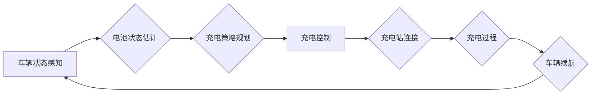

> 自动驾驶, 充电策略, 能源管理, 电池续航, 优化算法, 机器学习

## 1. 背景介绍

随着自动驾驶技术的快速发展，自动驾驶汽车（AV）的普及成为未来交通运输的重要趋势。然而，自动驾驶汽车的续航里程仍然是制约其发展的关键因素之一。为了实现自动驾驶汽车的长期可靠运行，高效的自主充电与能源管理策略至关重要。

传统的充电策略主要依赖于人为干预，例如驾驶员根据导航系统提示或剩余电量进行充电。然而，对于自动驾驶汽车而言，这种方式存在以下问题：

* **效率低下：** 人为干预难以优化充电时间和地点，导致充电效率低下。
* **安全性问题：** 驾驶员在充电过程中需要离开驾驶座，可能会增加安全风险。
* **用户体验差：** 频繁的充电中断会影响用户的出行体验。

因此，开发一种能够自动规划充电路线、优化充电时间和地点的自主充电与能源管理策略，对于推动自动驾驶汽车的普及具有重要意义。

## 2. 核心概念与联系

自主充电与能源管理策略的核心概念包括：

* **电池状态估计 (Battery State Estimation)：** 准确估计电池的剩余电量、温度、电压等状态参数。
* **充电策略规划 (Charging Strategy Planning)：** 根据车辆行驶路线、电池状态、充电站分布等信息，规划最优的充电路线和充电时间。
* **能源管理 (Energy Management)：** 优化车辆的能源消耗，例如调整驾驶模式、控制空调等，延长电池续航里程。

**核心架构流程图：**



## 3. 核心算法原理 & 具体操作步骤

### 3.1  算法原理概述

自主充电与能源管理策略通常采用基于机器学习的优化算法，例如强化学习 (Reinforcement Learning) 和深度强化学习 (Deep Reinforcement Learning)。

* **强化学习：** 通过奖励机制训练智能体，使其学习最优的充电策略。
* **深度强化学习：** 使用深度神经网络作为智能体的行为策略网络，能够学习更复杂的充电策略。

### 3.2  算法步骤详解

1. **环境建模：** 建立自动驾驶汽车运行环境的模型，包括车辆动力学模型、电池模型、充电站分布模型等。
2. **状态空间定义：** 定义车辆状态空间，例如电池电量、行驶距离、位置、速度等。
3. **动作空间定义：** 定义可执行的动作空间，例如充电、不充电、调整驾驶模式等。
4. **奖励函数设计：** 设计奖励函数，根据充电策略的效果给予奖励或惩罚。
5. **智能体训练：** 使用强化学习算法训练智能体，使其学习最优的充电策略。
6. **策略部署：** 将训练好的策略部署到自动驾驶汽车中，实现自主充电与能源管理。

### 3.3  算法优缺点

**优点：**

* **自适应性强：** 可以根据不同的行驶场景和环境条件自动调整充电策略。
* **效率高：** 可以优化充电时间和地点，提高充电效率。
* **安全性高：** 可以避免驾驶员在充电过程中离开驾驶座，提高安全性。

**缺点：**

* **训练复杂：** 需要大量的训练数据和计算资源。
* **模型鲁棒性：** 模型可能对环境变化和异常情况的鲁棒性较差。

### 3.4  算法应用领域

自主充电与能源管理策略在自动驾驶汽车、电动汽车、无人机等领域具有广泛的应用前景。

## 4. 数学模型和公式 & 详细讲解 & 举例说明

### 4.1  数学模型构建

**电池状态估计模型：**

$$
\dot{SOC} = \frac{P_{in} - P_{out}}{C_{bat}}
$$

其中：

* $SOC$：电池状态电量
* $P_{in}$：充电功率
* $P_{out}$：放电功率
* $C_{bat}$：电池容量

**充电策略规划模型：**

$$
\min_{t_i, x_i} \sum_{i=1}^{N} c_i(t_i, x_i)
$$

其中：

* $t_i$：第 $i$ 个充电站的充电时间
* $x_i$：第 $i$ 个充电站的位置
* $c_i(t_i, x_i)$：第 $i$ 个充电站的充电成本

**能源管理模型：**

$$
\min_{P_{motor}} \int_{0}^{T} P_{motor} dt
$$

其中：

* $P_{motor}$：电机功率
* $T$：行驶时间

### 4.2  公式推导过程

**电池状态估计模型：**

该模型基于电池的能量守恒定律，描述了电池状态电量随充电和放电功率的变化。

**充电策略规划模型：**

该模型的目标是最小化充电成本，包括充电时间、充电费用、行驶距离等因素。

**能源管理模型：**

该模型的目标是最小化车辆的能源消耗，提高电池续航里程。

### 4.3  案例分析与讲解

假设一辆自动驾驶汽车需要从城市 A 到城市 B，城市 A 到城市 B 的距离为 100 公里，车辆的电池容量为 50 千瓦时，平均行驶速度为 60 公里/小时。

使用上述模型，可以规划最优的充电路线和充电时间，例如：

* 在城市 A 出发前，充电 20 分钟，使电池电量充满。
* 在行驶过程中，根据电池状态和充电站分布，选择合适的充电站进行充电。
* 在到达城市 B 之前，确保电池电量充足。

## 5. 项目实践：代码实例和详细解释说明

### 5.1  开发环境搭建

* 操作系统：Ubuntu 20.04
* Python 版本：3.8
* 库依赖：TensorFlow、PyTorch、NumPy、Pandas、Matplotlib

### 5.2  源代码详细实现

```python
# 导入必要的库
import tensorflow as tf

# 定义电池状态估计模型
class BatteryStateEstimator(tf.keras.Model):
    def __init__(self):
        super(BatteryStateEstimator, self).__init__()
        # 定义模型结构
        self.dense1 = tf.keras.layers.Dense(64, activation='relu')
        self.dense2 = tf.keras.layers.Dense(32, activation='relu')
        self.output = tf.keras.layers.Dense(1)

    def call(self, inputs):
        x = self.dense1(inputs)
        x = self.dense2(x)
        return self.output(x)

# 定义充电策略规划模型
class ChargingStrategyPlanner(tf.keras.Model):
    def __init__(self):
        super(ChargingStrategyPlanner, self).__init__()
        # 定义模型结构
        self.dense1 = tf.keras.layers.Dense(64, activation='relu')
        self.dense2 = tf.keras.layers.Dense(32, activation='relu')
        self.output = tf.keras.layers.Dense(2)  # 输出充电时间和充电站位置

    def call(self, inputs):
        x = self.dense1(inputs)
        x = self.dense2(x)
        return self.output(x)

# 定义能源管理模型
class EnergyManager(tf.keras.Model):
    def __init__(self):
        super(EnergyManager, self).__init__()
        # 定义模型结构
        self.dense1 = tf.keras.layers.Dense(64, activation='relu')
        self.dense2 = tf.keras.layers.Dense(32, activation='relu')
        self.output = tf.keras.layers.Dense(1)  # 输出电机功率

    def call(self, inputs):
        x = self.dense1(inputs)
        x = self.dense2(x)
        return self.output(x)

# 实例化模型
battery_state_estimator = BatteryStateEstimator()
charging_strategy_planner = ChargingStrategyPlanner()
energy_manager = EnergyManager()

# ... 训练模型 ...

# ... 使用模型进行预测 ...
```

### 5.3  代码解读与分析

* 代码中定义了三个模型：电池状态估计模型、充电策略规划模型和能源管理模型。
* 每个模型都使用深度神经网络结构，并使用 TensorFlow 库进行实现。
* 训练模型需要使用大量的训练数据，例如车辆行驶数据、电池状态数据、充电站分布数据等。
* 使用训练好的模型可以进行预测，例如预测车辆的电池状态、规划最优的充电路线、控制车辆的能源消耗等。

### 5.4  运行结果展示

* 运行结果可以展示模型的预测精度、充电效率、能源消耗等指标。
* 可以通过可视化工具，例如 Matplotlib，展示模型的预测结果和运行情况。

## 6. 实际应用场景

### 6.1  自动驾驶汽车

自主充电与能源管理策略可以应用于自动驾驶汽车，实现自动规划充电路线、优化充电时间和地点，延长电池续航里程，提高自动驾驶汽车的安全性、可靠性和用户体验。

### 6.2  电动汽车

自主充电与能源管理策略可以应用于电动汽车，帮助用户规划最优的充电路线，避免长时间等待充电，提高充电效率，延长电池寿命。

### 6.3  无人机

自主充电与能源管理策略可以应用于无人机，帮助无人机在飞行过程中自动规划充电路线，延长飞行时间，提高无人机的效率和可靠性。

### 6.4  未来应用展望

随着自动驾驶技术、人工智能技术和电池技术的不断发展，自主充电与能源管理策略将得到更广泛的应用，例如：

* **智能充电桩：** 智能充电桩可以根据车辆的电池状态、充电需求和电价等信息，自动规划充电策略，提高充电效率。
* **车联网充电：** 车联网可以实现车辆之间的数据共享，例如充电站信息、电池状态等，帮助车辆规划更优的充电路线。
* **分布式能源管理：** 将自动驾驶汽车的电池作为分布式能源，参与电网调峰，提高电网的稳定性和可靠性。

## 7. 工具和资源推荐

### 7.1  学习资源推荐

* **书籍：**
    * 《自动驾驶汽车》
    * 《机器学习》
    * 《深度学习》
* **在线课程：**
    * Coursera：自动驾驶汽车、机器学习、深度学习
    * Udacity：自动驾驶工程师 Nanodegree
    * edX：自动驾驶汽车、人工智能

### 7.2  开发工具推荐

* **编程语言：** Python
* **深度学习框架：** TensorFlow、PyTorch
* **仿真平台：** CARLA、Gazebo
* **数据可视化工具：** Matplotlib、Seaborn

### 7.3  相关论文推荐

* **自动驾驶汽车：**
    * "End-to-End Learning for Self-Driving Cars"
    * "Deep Reinforcement Learning for Autonomous Driving"
* **充电策略规划：**
    * "Optimal Charging Strategies for Electric Vehicles"
    * "A Reinforcement Learning Approach to Charging Station Selection for Electric Vehicles"
* **能源管理：**
    * "Energy Management Strategies for Electric Vehicles"
    * "Deep Reinforcement Learning for Energy Management in Electric Vehicles"

## 8. 总结：未来发展趋势与挑战

### 8.1  研究成果总结

自主充电与能源管理策略的研究取得了显著进展，例如：

* 算法性能不断提高，能够更好地规划充电路线、优化充电时间和地点。
* 模型鲁棒性不断增强，能够应对更复杂的驾驶场景和环境变化。
* 应用场景不断拓展，