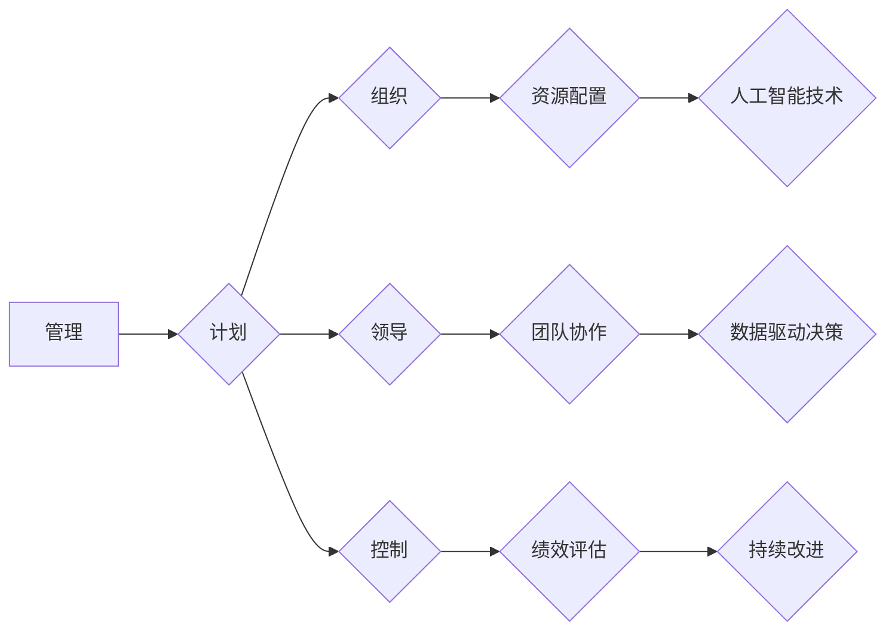

>  管理、领导、组织、效率、创新、技术、人工智能、软件开发

## 1. 背景介绍

彼得·德鲁克的《管理的艺术》是管理学领域的经典著作，自1954年出版以来，对管理思想和实践产生了深远的影响。这本书以其清晰的逻辑、深刻的洞察力和广泛的应用性，被誉为管理学界的“圣经”。

然而，随着科技的飞速发展，特别是人工智能技术的兴起，传统的管理模式面临着新的挑战。如何将德鲁克的管理理念应用于新兴技术领域，如何领导和管理人工智能时代的人才，成为当今企业和组织面临的重要课题。

## 2. 核心概念与联系

德鲁克的管理理论的核心概念包括：管理是区别于其他活动的独特功能；管理者需要具备计划、组织、领导和控制四大基本管理功能；管理的目标是通过有效地利用资源，实现组织的战略目标。

在人工智能时代，这些核心概念依然具有重要意义，但需要根据新的技术环境进行调整和扩展。

**Mermaid 流程图：**



**核心概念与联系：**

* **计划:** 在人工智能时代，计划需要更加注重对技术趋势和市场变化的预测和分析，并制定相应的技术路线和发展战略。
* **组织:** 需要构建更加灵活、高效的组织结构，以适应人工智能技术的快速发展和应用。
* **领导:** 领导者需要具备对人工智能技术的理解和应用能力，并能够激励和引导团队成员在人工智能时代取得成功。
* **控制:** 需要建立更加完善的监控和评估机制，以确保人工智能技术的安全、可靠和有效使用。

## 3. 核心算法原理 & 具体操作步骤

人工智能的核心算法包括机器学习、深度学习、自然语言处理等。

### 3.1  算法原理概述

* **机器学习:**  通过算法学习数据中的模式，并根据这些模式进行预测或分类。
* **深度学习:**  一种更高级的机器学习方法，使用多层神经网络来模拟人类大脑的学习过程。
* **自然语言处理:**  使计算机能够理解和处理人类语言。

### 3.2  算法步骤详解

**机器学习算法步骤:**

1. **数据收集和预处理:** 收集相关数据并进行清洗、转换和特征提取。
2. **模型选择:** 根据任务需求选择合适的机器学习算法。
3. **模型训练:** 使用训练数据训练模型，调整模型参数以达到最佳性能。
4. **模型评估:** 使用测试数据评估模型的性能，并进行调整和优化。
5. **模型部署:** 将训练好的模型部署到实际应用场景中。

**深度学习算法步骤:**

1. **数据收集和预处理:** 与机器学习类似，需要收集和预处理数据。
2. **网络结构设计:** 设计多层神经网络的结构，包括神经元数量、连接方式等。
3. **模型训练:** 使用训练数据训练神经网络，调整网络参数以达到最佳性能。
4. **模型评估:** 使用测试数据评估模型的性能，并进行调整和优化。
5. **模型部署:** 将训练好的神经网络部署到实际应用场景中。

### 3.3  算法优缺点

**机器学习算法:**

* **优点:** 能够从数据中学习模式，并进行预测或分类。
* **缺点:** 需要大量的训练数据，对数据质量要求较高。

**深度学习算法:**

* **优点:** 能够学习更复杂的模式，性能优于传统机器学习算法。
* **缺点:** 需要更多的计算资源和训练时间，对数据质量要求更高。

### 3.4  算法应用领域

* **图像识别:**  识别物体、场景和人脸。
* **语音识别:**  将语音转换为文本。
* **自然语言处理:**  理解和生成人类语言。
* **推荐系统:**  根据用户喜好推荐商品或内容。
* **医疗诊断:**  辅助医生诊断疾病。

## 4. 数学模型和公式 & 详细讲解 & 举例说明

人工智能算法的背后是复杂的数学模型和公式。

### 4.1  数学模型构建

机器学习算法通常使用概率模型来描述数据之间的关系。例如，线性回归模型假设数据之间存在线性关系，可以使用以下公式来描述：

$$y = mx + c$$

其中，$y$ 是预测值，$x$ 是输入特征，$m$ 是斜率，$c$ 是截距。

### 4.2  公式推导过程

深度学习算法使用神经网络模型，其中每个神经元都接收来自其他神经元的输入，并通过激活函数进行处理。神经网络的输出可以表示为：

$$y = f(W^T x + b)$$

其中，$y$ 是输出值，$x$ 是输入特征，$W$ 是权重矩阵，$b$ 是偏置项，$f$ 是激活函数。

### 4.3  案例分析与讲解

**线性回归案例:**

假设我们想要预测房屋价格，输入特征包括房屋面积和房间数量。我们可以使用线性回归模型来建立房屋价格与面积和房间数量之间的关系。

通过训练数据，我们可以得到模型参数 $m$ 和 $c$，然后可以使用公式 $y = mx + c$ 来预测新房子的价格。

## 5. 项目实践：代码实例和详细解释说明

**代码实例:**

```python
# 导入必要的库
import numpy as np
from sklearn.linear_model import LinearRegression

# 创建训练数据
X = np.array([[100, 2], [150, 3], [200, 4]])
y = np.array([200000, 300000, 400000])

# 创建线性回归模型
model = LinearRegression()

# 训练模型
model.fit(X, y)

# 预测新房子的价格
new_house = np.array([[180, 3]])
predicted_price = model.predict(new_house)

# 打印预测结果
print(f"预测价格: {predicted_price[0]}")
```

**代码解读与分析:**

* 首先，我们导入必要的库，包括 NumPy 用于数值计算和 scikit-learn 用于机器学习。
* 然后，我们创建训练数据，包括房屋面积和房间数量作为输入特征，以及房屋价格作为目标变量。
* 接下来，我们创建线性回归模型，并使用训练数据训练模型。
* 训练完成后，我们可以使用模型来预测新房子的价格。

## 6. 实际应用场景

人工智能技术在各个领域都有广泛的应用，例如：

* **医疗保健:**  辅助医生诊断疾病、预测患者风险、开发个性化治疗方案。
* **金融服务:**  检测欺诈交易、评估信用风险、提供个性化理财建议。
* **制造业:**  优化生产流程、预测设备故障、实现智能制造。
* **零售业:**  个性化推荐商品、优化库存管理、提供智能客服。

### 6.4  未来应用展望

人工智能技术的未来发展趋势包括：

* **更强大的计算能力:**  随着硬件技术的进步，人工智能模型将能够处理更多的数据，学习更复杂的模式。
* **更广泛的应用场景:**  人工智能技术将应用于更多领域，例如教育、交通、能源等。
* **更智能的交互方式:**  人工智能将能够与人类进行更自然、更智能的交互。

## 7. 工具和资源推荐

### 7.1  学习资源推荐

* **在线课程:**  Coursera、edX、Udacity 等平台提供丰富的机器学习和深度学习课程。
* **书籍:**  《深度学习》、《机器学习实战》等书籍是学习人工智能的经典教材。
* **开源项目:**  TensorFlow、PyTorch 等开源项目提供了丰富的代码和工具，可以帮助开发者学习和实践人工智能技术。

### 7.2  开发工具推荐

* **Python:**  Python 是人工智能开发最常用的编程语言。
* **TensorFlow:**  TensorFlow 是 Google 开发的开源深度学习框架。
* **PyTorch:**  PyTorch 是 Facebook 开发的开源深度学习框架。

### 7.3  相关论文推荐

* **《ImageNet Classification with Deep Convolutional Neural Networks》**
* **《Attention Is All You Need》**
* **《BERT: Pre-training of Deep Bidirectional Transformers for Language Understanding》**

## 8. 总结：未来发展趋势与挑战

人工智能技术正在迅速发展，为人类社会带来了巨大的机遇和挑战。

### 8.1  研究成果总结

人工智能技术取得了显著的进展，在图像识别、语音识别、自然语言处理等领域取得了突破性成果。

### 8.2  未来发展趋势

人工智能技术将朝着更智能、更安全、更可解释的方向发展。

### 8.3  面临的挑战

人工智能技术还面临着一些挑战，例如数据安全、算法偏见、伦理问题等。

### 8.4  研究展望

未来，人工智能研究需要更加注重伦理、安全和可解释性，以确保人工智能技术能够真正造福人类社会。

## 9. 附录：常见问题与解答

**常见问题:**

* **什么是人工智能？**
* **人工智能有哪些应用场景？**
* **如何学习人工智能技术？**
* **人工智能技术有哪些伦理问题？**

**解答:**

* **什么是人工智能？** 人工智能是指使机器能够像人类一样思考、学习和解决问题的能力。
* **人工智能有哪些应用场景？** 人工智能技术应用于医疗保健、金融服务、制造业、零售业等各个领域。
* **如何学习人工智能技术？** 可以通过在线课程、书籍、开源项目等方式学习人工智能技术。
* **人工智能技术有哪些伦理问题？** 人工智能技术可能引发数据安全、算法偏见、工作岗位替代等伦理问题。


作者：禅与计算机程序设计艺术 / Zen and the Art of Computer Programming 
<end_of_turn>