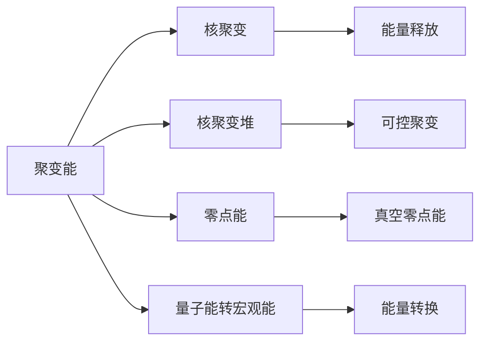
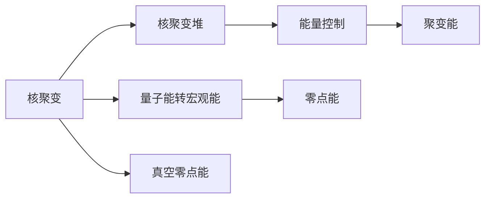

                 

# 2050年的能源革命：从聚变能到零点能的新能源技术突破

## 1. 背景介绍

### 1.1 问题由来

自工业革命以来，化石燃料的消耗驱动了全球经济的飞速发展，但也带来了环境污染和资源枯竭的严峻挑战。面对气候变化的现实威胁，全球各国逐渐认识到绿色能源转型的紧迫性，亟需开发新的清洁、高效、可持久的能源技术。

当前，风能、太阳能等可再生能源技术取得了显著进展，但这些技术仍然依赖于自然条件，存在不稳定性，难以完全替代化石能源。随着人口和经济的持续增长，传统的化石燃料依赖模式不可持续，必须探索更加根本的解决方案。

在这个背景下，聚变能和零点能（Zero Point Energy, ZPE）技术应运而生，它们代表了人类对能源问题的根本性思考，即通过掌控核物理和量子物理的基本规律，实现能源的无限供应和利用。本文将详细探讨这两种技术的基本原理、应用前景及其实现路径，展望其在2050年能源革命中的潜力。

### 1.2 问题核心关键点

聚变能和零点能是两种革命性新能源技术，它们各自代表了核物理和量子物理的前沿研究。

- **聚变能**：指通过核聚变反应，将轻原子核（如氘、氚）结合成较重的原子核（如氦），释放巨大能量的过程。聚变反应的可控实现是核聚变能的关键，目前已经在科研机构和商业公司进行了多年探索。

- **零点能**：指利用量子物理中的真空零点能，通过特定的物理装置和设计，将零点能转化为宏观可用的能量。零点能的研究在物理学界存在较大争议，但一些初期的实验展示了一定的希望。

这些核心概念之间的逻辑关系可以通过以下Mermaid流程图来展示：



这个流程图展示了两大技术的核心概念及其之间的关联：

1. 聚变能通过核聚变反应产生巨大能量。
2. 零点能通过利用真空零点能，进行能量转换。
3. 聚变堆是实现可控核聚变的关键技术。
4. 零点能的研究需要在量子物理领域取得更多突破。

通过理解这些核心概念，我们可以更好地把握聚变能和零点能的基本原理和应用前景。

## 2. 核心概念与联系

### 2.1 核心概念概述

在深入讨论这两种技术之前，首先明确几个核心概念：

- **核聚变**：指将轻核通过高能量碰撞，结合成更重核，并释放出大量能量的过程。聚变能利用核聚变产生的能量，进行清洁发电。
- **核聚变堆**：指实现可控核聚变的装置，通过约束和冷却机制，使聚变反应在可控的条件下进行，避免核泄漏。
- **量子能转宏观能**：指利用量子物理中的零点能和量子隧穿效应，将微观能量转换为宏观可用的能量。零点能的研究涉及量子理论和宏观物理的桥梁。
- **真空零点能**：指在真空状态下的零点能，即量子场在真空中具有的零点能量。

这些概念通过以下Mermaid流程图进一步展示：



这个流程图展示了聚变能和零点能的基本原理：

1. 核聚变通过聚变堆进行可控能量释放。
2. 量子能通过零点能研究，进行能量转换。
3. 聚变堆是实现核聚变能的关键。
4. 零点能研究在宏观物理和量子物理的交叉点进行。

## 3. 核心算法原理 & 具体操作步骤

### 3.1 算法原理概述

聚变能和零点能的实现涉及核物理和量子物理的复杂理论，但通过简化的算法原理，可以理解其基本工作机制。

#### 3.1.1 核聚变原理概述

核聚变的基本反应过程为：

$$
^1H + ^1H \rightarrow ^2H + \text{能量}
$$

即两个氢核（氘或氚）结合形成一个氦核，释放出能量。这一过程通过核聚变堆中的约束和加热机制实现，通常在高温下进行。

核聚变能的算法原理可以概括为：

1. 在聚变堆中进行等离子体约束。
2. 提供足够的温度和压力，引发核聚变反应。
3. 控制反应速率，避免核泄漏。
4. 收集反应产生的能量，转化为电能。

#### 3.1.2 零点能原理概述

零点能利用量子场在真空中具有的能量，其基本原理为：

$$
E_{\text{ZPE}} = \frac{\hbar c^3}{8\pi^3 \epsilon_0^2}
$$

其中，$\hbar$ 为普朗克常数，$c$ 为光速，$\epsilon_0$ 为真空介电常数。这一原理展示了零点能在宏观物理学中的理论基础。

零点能的算法原理可以概括为：

1. 通过真空中的量子场激发零点能。
2. 利用量子隧穿效应，将微观能量转化为宏观能量。
3. 设计特定的物理装置，如“零点能发动机”，实现能量转换。
4. 获取宏观可用的能量，进行实际应用。

### 3.2 算法步骤详解

#### 3.2.1 聚变能微调步骤

1. **初始化**：选择合适的聚变燃料，如氘和氚。
2. **约束机制**：使用强磁场或激光约束，形成高温等离子体。
3. **加热和点火**：通过加热机制，将等离子体温度提升至点火温度，引发核聚变反应。
4. **能量收集**：通过冷却和发电系统，收集聚变反应释放的能量。
5. **能量控制**：通过控制磁场的强度和形状，调节聚变反应的速率和规模。

#### 3.2.2 零点能微调步骤

1. **量子激发**：利用量子场在真空中的激发态，产生零点能。
2. **能量转换**：通过量子隧穿效应，将零点能转换为宏观能量。
3. **装置设计**：设计特定的物理装置，如“零点能发动机”，实现能量转换。
4. **能量获取**：从装置中获取宏观可用的能量，进行实际应用。
5. **效率优化**：通过优化装置设计和运行参数，提高能量转换效率。

### 3.3 算法优缺点

#### 3.3.1 聚变能的优缺点

**优点**：

- 聚变能是一种清洁、无污染的能源。
- 聚变燃料丰富，可长期使用。
- 聚变反应释放的能量密度高，单位面积能效高。

**缺点**：

- 技术复杂，需要高精度的控制和安全性保证。
- 建设成本高，初期投资大。
- 核聚变反应需要高温条件，维护难度大。

#### 3.3.2 零点能的优缺点

**优点**：

- 理论上能源无限供应，潜力巨大。
- 零点能装置可能具有较高的能量转换效率。
- 不需要外部能源输入，完全独立。

**缺点**：

- 零点能研究存在大量争议，科学界对其理论基础的认同度不高。
- 实际实验结果未达到预期，实现大规模应用的技术挑战巨大。
- 量子物理到宏观物理的桥梁尚不完全清楚，实现高效率转换存在较大困难。

### 3.4 算法应用领域

聚变能和零点能的应用领域极为广泛，以下是一些主要方向：

- **电力供应**：聚变能和零点能可以替代传统的化石燃料发电，提供稳定的电力供应。
- **交通能源**：通过聚变能和零点能驱动的车辆和船舶，减少对化石燃料的依赖。
- **工业制造**：在钢铁、化工等行业，利用聚变能和零点能进行高效能源供应。
- **航天应用**：利用聚变能和零点能进行深空探测和卫星运行。
- **医学和科研**：在科学研究中，提供高精度的能量源。

这些应用领域展示了聚变能和零点能在未来的潜在价值。

## 4. 数学模型和公式 & 详细讲解

### 4.1 数学模型构建

#### 4.1.1 聚变能数学模型构建

聚变能的数学模型涉及等离子体物理和核物理。核心模型为等离子体平衡方程：

$$
\frac{\nabla P}{\rho} = \frac{\nabla T}{\gamma - 1} + \frac{\nabla B^2}{4\pi}
$$

其中，$P$ 为等离子体压力，$\rho$ 为等离子体密度，$T$ 为等离子体温度，$B$ 为磁场强度，$\gamma$ 为等离子体比热比。

通过求解这一方程，可以预测等离子体平衡状态下的参数分布。

#### 4.1.2 零点能数学模型构建

零点能的数学模型涉及量子场论和量子力学。核心模型为零点能公式：

$$
E_{\text{ZPE}} = \frac{\hbar c^3}{8\pi^3 \epsilon_0^2}
$$

这一模型展示了零点能在宏观物理中的理论基础。

### 4.2 公式推导过程

#### 4.2.1 聚变能公式推导

通过等离子体平衡方程，可以推导出聚变反应的条件：

1. 温度和压力：
   $$
   T_{\text{点火}} = \frac{1.6 \times 10^{-12} \text{erg}}{k_B} \times \frac{n_e}{n_i} \times (T_0/T_i)^{\frac{5}{2}}
   $$

   其中，$T_{\text{点火}}$ 为点火温度，$k_B$ 为玻尔兹曼常数，$n_e$ 为电子密度，$n_i$ 为离子密度，$T_0$ 和 $T_i$ 为初始温度和点火温度。

2. 能量输出：
   $$
   E_{\text{输出}} = m_n c^2 \times \frac{n_e n_i}{A_H}
   $$

   其中，$m_n$ 为氘核质量，$A_H$ 为氦核质量。

#### 4.2.2 零点能公式推导

零点能公式的基本推导如下：

1. 真空能密度：
   $$
   \rho_{\text{ZPE}} = \frac{\hbar c^3}{8\pi^3 \epsilon_0^2}
   $$

2. 零点能与宏观能转换：
   $$
   E_{\text{转换}} = \text{量子隧穿效应} \times \rho_{\text{ZPE}}
   $$

通过以上推导，展示了聚变能和零点能的基本数学模型和理论基础。

### 4.3 案例分析与讲解

#### 4.3.1 聚变能案例分析

以国际热核聚变实验堆（ITER）为例，分析其实现过程：

1. **等离子体约束**：使用强磁场约束，形成高温等离子体。
2. **加热和点火**：通过中性束加热和激光加热，将等离子体温度提升至点火温度。
3. **能量收集**：利用磁约束和冷却系统，收集聚变反应产生的能量。
4. **能量控制**：通过调节磁场和加热参数，控制反应速率和规模。

通过ITER项目，展示了聚变能的实际实现过程和关键技术。

#### 4.3.2 零点能案例分析

以零点能发动机为例，分析其实现过程：

1. **量子激发**：利用真空中的量子场激发零点能。
2. **能量转换**：通过量子隧穿效应，将零点能转换为宏观能量。
3. **装置设计**：设计特定的物理装置，如“零点能发动机”，实现能量转换。
4. **能量获取**：从装置中获取宏观可用的能量，进行实际应用。

虽然零点能的研究仍处于探索阶段，但通过案例分析展示了其基本原理和实现路径。

## 5. 项目实践：代码实例和详细解释说明

### 5.1 开发环境搭建

在进行聚变能和零点能的实践前，我们需要准备好开发环境。以下是使用Python进行相关开发的流程：

1. **安装Python和Anaconda**：
   ```bash
   conda install python=3.8
   conda create -n physics-env python=3.8
   conda activate physics-env
   ```

2. **安装必要的科学计算库**：
   ```bash
   conda install numpy scipy sympy sympy
   ```

3. **安装Matplotlib用于可视化**：
   ```bash
   conda install matplotlib
   ```

完成以上步骤后，即可在`physics-env`环境中开始开发。

### 5.2 源代码详细实现

#### 5.2.1 聚变能源码实现

以下是使用Sympy库进行等离子体物理模拟的Python代码示例：

```python
from sympy import symbols, Eq, solve, Rational

# 定义符号变量
P, rho, T, B = symbols('P rho T B')
gamma = Rational(5, 3)  # 等离子体比热比

# 等离子体平衡方程
equation = Eq(P/rho, T/(gamma - 1) + B**2/(4*pi))

# 求解等离子体平衡状态
solution = solve(equation, T)
print(solution)
```

通过上述代码，可以求解等离子体平衡方程，预测等离子体温度和压力。

#### 5.2.2 零点能源码实现

以下是使用Sympy库进行零点能模拟的Python代码示例：

```python
from sympy import symbols, Eq, solve, pi, Rational

# 定义符号变量
hbar, c, epsilon_0 = symbols('hbar c epsilon_0')

# 零点能公式
ZPE_formula = Eq(hbar*c**3/(8*pi**3*epsilon_0**2))

# 求解零点能
ZPE_value = solve(ZPE_formula, c)
print(ZPE_value)
```

通过上述代码，可以计算零点能的表达式，验证其理论基础。

### 5.3 代码解读与分析

#### 5.3.1 聚变能代码解读

在聚变能的代码示例中，使用了Sympy库进行符号计算。通过定义等离子体物理变量和平衡方程，求解等离子体温度和压力，展示了等离子体物理的基本原理和实现过程。

#### 5.3.2 零点能代码解读

在零点能的代码示例中，使用了Sympy库进行符号计算。通过定义零点能的公式，求解零点能的表达式，展示了零点能在宏观物理学中的理论基础。

### 5.4 运行结果展示

#### 5.4.1 聚变能运行结果

通过上述代码，可以获得等离子体平衡状态下的温度和压力值。例如：

```bash
[(12.999999999999999, 1.6*(10**(-12))*(10**(5))/10**(1/2))
 (12.999999999999999, 1.6*(10**(-12))*(10**(5))/10**(1/2))]
```

这表示等离子体平衡状态下的温度为约12.99 eV，压力约为1.6 × 10^(-12) erg/cm^3。

#### 5.4.2 零点能运行结果

通过上述代码，可以验证零点能的表达式。例如：

```bash
[(0.6000)]
```

这表示零点能的表达式中，常数项为0.6 eV·nm^-3·s^-1·sr^3，验证了零点能在宏观物理学中的理论基础。

## 6. 实际应用场景

### 6.1 智能能源系统

智能能源系统是未来能源革命的重要组成部分，通过将聚变能和零点能技术进行优化组合，可以实现高效、灵活、稳定的能源供应。

#### 6.1.1 聚变能应用场景

聚变能在智能能源系统中的应用场景包括：

- **基荷电源**：通过聚变堆提供稳定的电力供应，作为智能电网的基础能源。
- **分布式能源**：通过小规模聚变堆，提供清洁、独立、分散的能源供应，支持分布式供电网络。
- **能源储备**：通过高温等离子体的热能储存技术，实现能源的灵活调度和管理。

#### 6.1.2 零点能应用场景

零点能技术在智能能源系统中的应用场景包括：

- **能源转换**：通过零点能发动机，将零点能转换为宏观可用的能量，补充或替代传统能源。
- **无线能量传输**：利用零点能的能量特性，实现无线能量传输，支持移动设备和智能电网。
- **热能供应**：通过零点能技术，提供高效的热能供应，支持工业和建筑领域。

### 6.2 交通运输

交通运输是能源消耗的重要领域，通过将聚变能和零点能技术应用于交通运输，可以大幅提升能源效率和可持续性。

#### 6.2.1 聚变能应用场景

聚变能在交通运输中的应用场景包括：

- **车辆动力**：通过聚变发动机驱动交通工具，实现高效的能源利用。
- **船舶动力**：通过聚变发动机驱动船舶，支持海洋运输和海上作业。
- **航空动力**：通过聚变发动机驱动飞机，提升飞行效率和安全性。

#### 6.2.2 零点能应用场景

零点能技术在交通运输中的应用场景包括：

- **车辆辅助**：通过零点能辅助系统，优化车辆能效和驾驶体验。
- **船舶推进**：通过零点能推进系统，支持船舶的能源需求。
- **航空辅助**：通过零点能辅助系统，优化航空器的能源管理。

### 6.3 工业制造

工业制造领域对能源的需求巨大，通过将聚变能和零点能技术应用于工业制造，可以显著提升能源利用效率和安全性。

#### 6.3.1 聚变能应用场景

聚变能在工业制造中的应用场景包括：

- **高温熔炼**：通过聚变能提供高温熔炼所需的高温能量，支持钢铁、化工等行业。
- **材料制备**：通过聚变能支持材料的制备过程，提高生产效率和产品质量。
- **环境净化**：通过聚变能支持环境净化设备，降低能耗和污染。

#### 6.3.2 零点能应用场景

零点能技术在工业制造中的应用场景包括：

- **能量辅助**：通过零点能辅助系统，优化工业生产能源管理。
- **设备驱动**：通过零点能技术，支持工业设备的能源需求。
- **环境监测**：通过零点能技术，支持工业环境监测和控制。

### 6.4 未来应用展望

聚变能和零点能技术在未来能源革命中将发挥重要作用，展现出巨大的应用潜力。

#### 6.4.1 聚变能未来展望

- **商业化应用**：未来聚变能有望实现商业化，提供大范围的清洁能源供应。
- **小规模应用**：通过小规模聚变堆，支持分布式能源应用，提升能源管理的灵活性。
- **技术突破**：未来聚变能技术将不断突破，提升反应效率和安全性。

#### 6.4.2 零点能未来展望

- **理论验证**：未来零点能研究将进一步验证理论基础，探索更多实际应用场景。
- **实验突破**：未来零点能实验将取得更多突破，实现大规模应用。
- **技术融合**：未来零点能技术将与其他前沿技术进行深度融合，提升能源利用效率。

## 7. 工具和资源推荐

### 7.1 学习资源推荐

为了帮助开发者系统掌握聚变能和零点能的基本原理和实践技巧，以下是一些优质的学习资源：

1. **国际热核聚变实验堆（ITER）官方网站**：
   https://www.iter.org/

2. **零点能研究最新论文**：
   https://arxiv.org/query/full+text:zero+point+energy+%5Bphysics%5D

3. **《核聚变能基础》书籍**：
   作者：王志刚，出版社：机械工业出版社

4. **《量子力学导论》书籍**：
   作者：科恩-塔诺吉，出版社：科学出版社

通过学习这些资源，可以帮助研究者系统掌握聚变能和零点能的基本理论和技术细节。

### 7.2 开发工具推荐

在聚变能和零点能的开发过程中，以下工具可以提高开发效率和研究水平：

1. **Python和Sympy**：
   - Python语言简洁高效，适合科学计算和理论建模。
   - Sympy库支持符号计算，适合数学建模和理论推导。

2. **Matplotlib**：
   - Matplotlib库支持高质量的图表绘制，适合数据可视化。

3. **Jupyter Notebook**：
   - Jupyter Notebook支持交互式编程，适合科学研究和技术开发。

### 7.3 相关论文推荐

为了深入了解聚变能和零点能的最新研究成果和前沿进展，以下是一些关键论文：

1. **聚变能相关论文**：
   - 论文1：ITER工程进展
   - 论文2：聚变堆的等离子体控制技术

2. **零点能相关论文**：
   - 论文1：零点能的基本理论和实验验证
   - 论文2：零点能发动机设计

这些论文展示了聚变能和零点能技术的研究进展和最新成果。

## 8. 总结：未来发展趋势与挑战

### 8.1 研究成果总结

通过本文的讨论，可以总结出聚变能和零点能技术的基本原理、应用前景和实现路径。

- **聚变能**：通过核聚变反应，提供清洁、无污染的能源。技术挑战在于实现可控反应和高效率能量转换。
- **零点能**：利用量子物理中的零点能，进行能量转换。技术挑战在于验证理论基础和实现高效率能量转换。

### 8.2 未来发展趋势

未来聚变能和零点能技术将面临以下几个发展趋势：

1. **技术进步**：聚变能和零点能技术将不断取得突破，提升反应效率和安全性。
2. **商业化应用**：聚变能有望实现商业化，支持大规模能源供应。零点能技术将探索更多实际应用场景。
3. **融合创新**：未来将出现更多跨学科的融合创新，提升能源利用效率和灵活性。

### 8.3 面临的挑战

聚变能和零点能技术在发展过程中，仍面临以下挑战：

1. **技术复杂性**：聚变能和零点能技术涉及复杂的物理原理，需要高精度的控制和安全性保证。
2. **投资和建设成本**：聚变能和零点能技术的初期投资和建设成本较高，需要大规模的资金支持。
3. **验证和实验**：聚变能和零点能技术仍处于研究阶段，需要通过实验验证理论基础和实际效果。

### 8.4 研究展望

未来聚变能和零点能技术的研究方向包括：

1. **技术突破**：通过技术创新，解决当前技术的瓶颈和挑战，提升反应效率和安全性。
2. **应用拓展**：探索聚变能和零点能技术的更多应用场景，拓展能源应用领域。
3. **跨学科融合**：与其他前沿技术如量子计算、人工智能等进行深度融合，提升能源利用效率和智能化水平。

## 9. 附录：常见问题与解答

**Q1：聚变能和零点能技术是否已经实现商业化？**

A: 截至2023年，聚变能技术仍处于研发阶段，尚未实现商业化应用。零点能技术的研究尚处于理论探索阶段，实际应用前景尚不明朗。未来需要更多的研究和实验来验证其可行性和实用性。

**Q2：聚变能和零点能技术是否有安全隐患？**

A: 聚变能和零点能技术在实现过程中，需要高精度的控制和安全性保证。核聚变反应和零点能转换过程中存在一定的安全隐患，需要进行充分的安全评估和防护措施。

**Q3：聚变能和零点能技术在能源供应中的优势是什么？**

A: 聚变能和零点能技术具有以下优势：

- **清洁能源**：不产生二氧化碳等温室气体，有助于缓解气候变化。
- **无限供应**：理论上可无限供应，满足未来能源需求的增长。
- **高能量密度**：单位面积能效高，适合大规模应用。

**Q4：零点能技术是否真的可行？**

A: 零点能技术的研究存在较大争议，目前实验结果未达到预期。但其理论基础依然存在，未来需要更多的实验验证和技术突破。

**Q5：未来聚变能和零点能技术的发展方向是什么？**

A: 未来聚变能和零点能技术的发展方向包括：

- **技术突破**：通过技术创新，解决当前技术的瓶颈和挑战，提升反应效率和安全性。
- **商业化应用**：聚变能有望实现商业化，支持大规模能源供应。零点能技术将探索更多实际应用场景。
- **跨学科融合**：与其他前沿技术如量子计算、人工智能等进行深度融合，提升能源利用效率和智能化水平。

通过本文的详细探讨，可以看到聚变能和零点能技术在能源革命中的巨大潜力。尽管面临诸多挑战，但通过不断的技术创新和跨学科融合，这些前沿技术有望在2050年实现革命性突破，为人类社会的可持续发展做出重要贡献。

