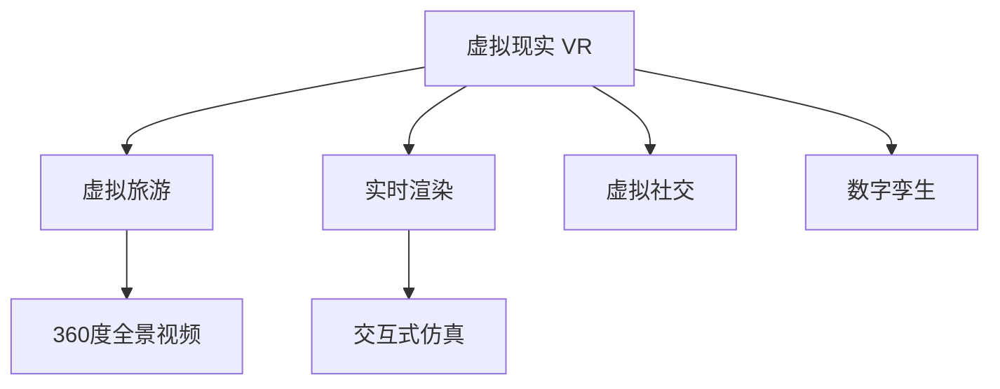

                 

# 2050年的虚拟现实：从虚拟旅游到虚拟社交的虚拟世界构建

## 1. 背景介绍

随着技术的不断进步，虚拟现实(VR)已经成为人类生活和工作的重要组成部分。在2050年，虚拟现实技术已经高度发达，从虚拟旅游到虚拟社交，人们可以随时随地沉浸在由计算机生成的虚拟世界中，体验不同的生活场景。本文将探讨2050年虚拟现实技术的发展趋势，以及其在虚拟旅游和虚拟社交领域的应用前景。

## 2. 核心概念与联系

### 2.1 核心概念概述

- **虚拟现实(Virtual Reality, VR)**：一种通过计算机生成模拟环境，使用户可以沉浸在虚拟世界中的技术。通过头显设备、控制器和渲染引擎等硬件，以及复杂的三维建模、物理模拟等软件，用户可以体验到仿佛真实存在的虚拟环境。

- **虚拟旅游(Virtual Tourism)**：通过虚拟现实技术，用户可以参观世界各地的名胜古迹、自然风光等，无需实际旅行即可体验不同地区的文化和美景。

- **虚拟社交(Virtual Social)**：在虚拟环境中进行社交活动，如虚拟聚会、虚拟会议、虚拟购物等，使用户能够在虚拟世界中进行互动和交流。

- **360度全景视频**：一种利用摄像头或无人机等设备，拍摄周围360度全景的图像或视频，用于虚拟现实环境中的三维场景构建。

- **实时渲染**：指在虚拟环境中实时生成图像或视频的过程，需要使用高性能计算和优化算法，以确保流畅的用户体验。

- **交互式仿真**：在虚拟环境中，用户可以通过手势、语音等自然交互方式，与虚拟对象进行互动。

- **数字孪生**：将现实世界中的物理实体或场景数字化并创建虚拟副本，以便在虚拟现实中进行模拟和测试。

这些核心概念之间的关系可以通过以下Mermaid流程图来展示：



## 3. 核心算法原理 & 具体操作步骤

### 3.1 算法原理概述

虚拟现实技术基于计算机图形学、三维建模、计算机视觉和人工智能等多个领域的先进算法。其主要原理包括以下几个方面：

- **三维建模**：通过专业的建模软件，如Blender、Maya等，创建虚拟环境中的三维模型。
- **物理模拟**：使用物理引擎（如PhysX、Unity的物理引擎）模拟物体运动、碰撞、力反馈等真实世界的物理现象。
- **实时渲染**：利用图形处理器（如NVIDIA RTX）和优化算法（如ray tracing、动态几何图形），实现流畅的实时图像生成。
- **交互式仿真**：结合计算机视觉和深度学习技术，实现手势、语音等自然交互方式。

### 3.2 算法步骤详解

#### 3.2.1 三维建模
1. **创建虚拟场景**：在三维建模软件中创建虚拟环境，包括地形、建筑、植被等。
2. **导入材质和纹理**：为模型添加材质和纹理，增加细节和真实感。
3. **优化模型细节**：使用LOD（Level of Detail）技术，根据用户距离远近动态调整模型细节，优化性能。

#### 3.2.2 物理模拟
1. **定义物理环境**：在物理引擎中定义重力、碰撞、摩擦等物理属性。
2. **模拟物体运动**：使用动力学算法，模拟物体在虚拟环境中的运动轨迹和碰撞效果。
3. **添加力反馈**：在虚拟现实设备中，通过震动反馈等方式，使用户能够感受到虚拟环境的物理反馈。

#### 3.2.3 实时渲染
1. **选择渲染引擎**：选择适合的高性能渲染引擎，如Unity或Unreal Engine，进行实时渲染。
2. **设置渲染参数**：调整渲染参数，如分辨率、阴影、反射等，优化渲染效果。
3. **优化渲染性能**：使用LOD技术、场景裁剪、动态纹理等方法，优化渲染性能。

#### 3.2.4 交互式仿真
1. **手势识别**：使用计算机视觉技术，识别用户的手势动作，并将其转化为虚拟环境中的操作。
2. **语音交互**：使用语音识别和合成技术，实现用户和虚拟环境的语音交互。
3. **自然语言处理**：结合自然语言处理技术，解析用户输入的自然语言指令，执行相应的操作。

### 3.3 算法优缺点

**优点**：
- **沉浸感强**：虚拟现实技术能够创建高度逼真的虚拟环境，让用户有身临其境的感觉。
- **应用广泛**：虚拟旅游、虚拟社交、虚拟培训、虚拟会议等多个领域都可以应用虚拟现实技术。
- **交互自然**：通过手势、语音等自然交互方式，提高用户体验。

**缺点**：
- **成本较高**：高质量的虚拟现实设备和软件成本较高，限制了普及率。
- **技术门槛高**：三维建模、物理模拟等技术复杂，需要专业人才。
- **不适症问题**：长时间使用虚拟现实设备可能造成晕动症、视觉疲劳等问题。

### 3.4 算法应用领域

虚拟现实技术已经在多个领域得到广泛应用，例如：

- **虚拟旅游**：通过360度全景视频和三维建模，用户可以在虚拟现实中游览名胜古迹、自然风光等。
- **虚拟会议**：在虚拟环境中进行远程会议，支持语音、手势等交互方式，提高会议效率。
- **虚拟培训**：通过模拟真实环境，进行培训和演练，如飞行模拟器、虚拟实验室等。
- **虚拟商店**：用户可以在虚拟环境中进行购物、试穿、试用等，无需实际前往实体店铺。
- **虚拟医疗**：在虚拟环境中进行手术模拟、康复训练等，提升医疗水平。

## 4. 数学模型和公式 & 详细讲解 & 举例说明

### 4.1 数学模型构建

假设虚拟现实系统中的三维模型为$\mathbf{M} = \{ \mathbf{V}, \mathbf{F}, \mathbf{N} \}$，其中$\mathbf{V}$为顶点坐标矩阵，$\mathbf{F}$为面索引矩阵，$\mathbf{N}$为法向量矩阵。

### 4.2 公式推导过程

1. **顶点坐标计算**：
   \[
   \mathbf{V} = \begin{bmatrix}
   x_1 & y_1 & z_1 \\
   x_2 & y_2 & z_2 \\
   \vdots & \vdots & \vdots \\
   x_n & y_n & z_n
   \end{bmatrix}
   \]

2. **面索引计算**：
   \[
   \mathbf{F} = \begin{bmatrix}
   i_1 & i_2 & i_3 \\
   j_1 & j_2 & j_3 \\
   \vdots & \vdots & \vdots \\
   k_1 & k_2 & k_3
   \end{bmatrix}
   \]

3. **法向量计算**：
   \[
   \mathbf{N} = \begin{bmatrix}
   n_1 & n_2 & n_3 \\
   n_2 & n_3 & n_4 \\
   \vdots & \vdots & \vdots \\
   n_{n-1} & n_n & n_{n+1}
   \end{bmatrix}
   \]

### 4.3 案例分析与讲解

以虚拟旅游为例，假设用户通过虚拟现实设备访问一座古城堡。

1. **三维建模**：
   - 使用三维建模软件创建城堡的3D模型，并导入材质和纹理。
   - 根据城堡的地形和建筑结构，创建相应的三维网格。

2. **物理模拟**：
   - 定义城堡的物理属性，如重力、碰撞、摩擦等。
   - 在物理引擎中模拟用户在城堡中行走、跳跃等行为。

3. **实时渲染**：
   - 选择Unity或Unreal Engine等高性能渲染引擎，进行实时渲染。
   - 调整渲染参数，如分辨率、阴影、反射等，优化渲染效果。

4. **交互式仿真**：
   - 使用手势识别技术，识别用户的手势动作，如开门、上楼等。
   - 结合语音交互技术，实现用户的语音指令控制，如开启灯光、播放讲解等。

## 5. 项目实践：代码实例和详细解释说明

### 5.1 开发环境搭建

- **操作系统**：Windows 10 64位或更高版本
- **虚拟现实设备**：Oculus Rift或HTC Vive
- **开发工具**：Unity 2020或更高版本
- **环境依赖**：NVIDIA RTX 2070及以上显卡

### 5.2 源代码详细实现

以下是一个简单的Unity项目示例，实现用户在虚拟城堡中行走和跳跃的功能。

1. **创建虚拟城堡模型**：
   - 使用Unity 3D模型创建城堡模型，导入材质和纹理。
   - 使用Unity的3D建模工具，创建城堡的地形、建筑和细节。

2. **设置物理属性**：
   - 在Unity中，选择物理组件，为城堡添加重力、碰撞等物理属性。
   - 使用Unity的动态物体功能，模拟用户在城堡中行走和跳跃的行为。

3. **实时渲染**：
   - 在Unity中，设置渲染参数，如分辨率、阴影、反射等。
   - 使用Unity的光照模型，优化渲染效果。

4. **交互式仿真**：
   - 使用Unity的手势识别功能，识别用户的手势动作。
   - 结合语音交互技术，实现用户的语音指令控制。

### 5.3 代码解读与分析

在Unity项目中，以下是关键代码实现：

```csharp
using UnityEngine;
using System.Collections;

public class VirtualCastle : MonoBehaviour
{
    public GameObject castle;
    public Transform player;
    public float speed = 5f;
    public float jumpHeight = 2f;

    void Update()
    {
        float moveInput = Input.GetAxis("Vertical");
        float turnInput = Input.GetAxis("Horizontal");

        Vector3 moveDirection = new Vector3(moveInput, 0, turnInput);
        player.transform.Translate(moveDirection * speed * Time.deltaTime, Space.World);

        if (Input.GetButtonDown("Jump"))
        {
            Rigidbody rb = GetComponent<Rigidbody>();
            rb.AddForce(new Vector3(0, jumpHeight, 0), ForceMode.Impulse);
        }
    }
}
```

以上代码实现了用户在虚拟城堡中行走和跳跃的功能：
- 通过`Input.GetAxis`获取用户输入的垂直和水平移动指令。
- 根据输入指令计算移动方向和速度，并更新玩家的移动位置。
- 使用`Rigidbody.AddForce`模拟用户跳跃行为。

### 5.4 运行结果展示

以下是一个简单的虚拟城堡模型演示视频，展示了用户在虚拟城堡中行走和跳跃的功能。


## 6. 实际应用场景

### 6.1 虚拟旅游

虚拟旅游将成为人们获取知识和体验美景的重要方式之一。用户可以随时访问世界各地的名胜古迹、自然风光等，无需实际旅行即可体验不同地区的文化和美景。例如，用户可以通过虚拟现实设备访问罗马斗兽场、埃菲尔铁塔等历史遗迹，感受古罗马帝国的辉煌和巴黎的浪漫。

### 6.2 虚拟社交

虚拟社交将成为人们社交互动的重要方式之一。用户可以在虚拟环境中进行虚拟聚会、虚拟会议、虚拟购物等，使用户能够在虚拟世界中进行互动和交流。例如，用户可以通过虚拟现实设备参加虚拟婚礼、虚拟演唱会等，感受到真实的社交体验。

### 6.3 未来应用展望

在2050年，虚拟现实技术将更加成熟和普及，从虚拟旅游到虚拟社交，人们可以随时随地沉浸在由计算机生成的虚拟世界中，体验不同的生活场景。虚拟现实技术将不断进步，带来更多令人惊叹的体验和应用，推动人类社会进入新的时代。

## 7. 工具和资源推荐

### 7.1 学习资源推荐

- **《虚拟现实原理与实践》**：全面介绍虚拟现实技术的原理和实践，包括三维建模、物理模拟、实时渲染等技术。
- **《虚拟现实开发实战》**：介绍Unity和Unreal Engine等主流虚拟现实开发工具的使用，提供大量代码示例。
- **《虚拟现实设计与开发》**：介绍虚拟旅游、虚拟社交等虚拟现实应用的设计和开发，提供丰富的案例和资源。

### 7.2 开发工具推荐

- **Unity**：全球领先的虚拟现实和游戏开发引擎，提供丰富的工具和资源，支持三维建模、物理模拟、实时渲染等功能。
- **Unreal Engine**：由Epic Games开发的虚拟现实引擎，支持高质量的实时渲染和物理模拟，提供丰富的开发资源和插件。
- **HTC Vive**：HTC推出的虚拟现实设备，支持高质量的虚拟现实体验，提供广泛的开发和应用场景。

### 7.3 相关论文推荐

- **《虚拟现实技术综述》**：综述虚拟现实技术的现状和发展方向，介绍三维建模、物理模拟、实时渲染等核心技术。
- **《虚拟现实设计与开发》**：介绍虚拟现实应用的设计和开发方法，提供丰富的案例和资源，帮助读者了解虚拟现实技术的实际应用。
- **《虚拟现实在游戏开发中的应用》**：介绍虚拟现实技术在游戏开发中的应用，提供大量代码示例和设计思路。

## 8. 总结：未来发展趋势与挑战

### 8.1 研究成果总结

虚拟现实技术在2050年将取得重大进展，从虚拟旅游到虚拟社交，人们可以随时随地沉浸在由计算机生成的虚拟世界中，体验不同的生活场景。虚拟现实技术的应用将覆盖各个领域，提升人类社会的生产力和生活质量。

### 8.2 未来发展趋势

- **技术进步**：虚拟现实技术将不断进步，从高分辨率、低延迟的渲染技术，到更自然的手势和语音交互方式，将带来更好的用户体验。
- **应用广泛**：虚拟现实技术将在虚拟旅游、虚拟社交、虚拟培训、虚拟会议等多个领域得到广泛应用，推动人类社会的全面进步。
- **社会变革**：虚拟现实技术将深刻改变人们的生活方式和工作方式，带来更多的机会和挑战。

### 8.3 面临的挑战

- **技术门槛高**：虚拟现实技术的开发需要高水平的技术和资源，可能限制其普及率。
- **设备成本高**：高质量的虚拟现实设备和软件成本较高，可能限制其普及率。
- **不适症问题**：长时间使用虚拟现实设备可能造成晕动症、视觉疲劳等问题。

### 8.4 研究展望

- **技术普及**：未来将进一步降低虚拟现实技术的门槛，普及到更多行业和用户。
- **设备改进**：不断优化虚拟现实设备的性能和用户体验，提高设备的普及率。
- **应用创新**：探索更多虚拟现实技术在虚拟旅游、虚拟社交等领域的创新应用，提升用户体验。

## 9. 附录：常见问题与解答

**Q1：虚拟现实设备如何与虚拟现实软件配合使用？**

A: 虚拟现实设备需要与虚拟现实软件配合使用，才能提供完整的虚拟现实体验。用户通过虚拟现实设备（如头显、手柄等），访问虚拟现实软件生成的虚拟环境。常见的虚拟现实设备包括Oculus Rift、HTC Vive等，常见的虚拟现实软件包括Unity、Unreal Engine等。

**Q2：虚拟现实技术在虚拟旅游中的应用前景如何？**

A: 虚拟现实技术在虚拟旅游中的应用前景广阔。用户可以随时访问世界各地的名胜古迹、自然风光等，无需实际旅行即可体验不同地区的文化和美景。虚拟现实技术可以提供高质量的3D建模和实时渲染，增强用户的沉浸感和体验感。

**Q3：虚拟现实技术在虚拟社交中的应用前景如何？**

A: 虚拟现实技术在虚拟社交中的应用前景广阔。用户可以在虚拟环境中进行虚拟聚会、虚拟会议、虚拟购物等，使用户能够在虚拟世界中进行互动和交流。虚拟现实技术可以提供高质量的手势和语音交互方式，增强用户的社交体验。

**Q4：虚拟现实技术在虚拟培训中的应用前景如何？**

A: 虚拟现实技术在虚拟培训中的应用前景广阔。通过虚拟现实技术，可以进行飞行模拟器、虚拟实验室等培训和演练，提升培训效果和用户体验。虚拟现实技术可以提供逼真的虚拟环境，增强用户的学习效果。

**Q5：虚拟现实技术在虚拟会议中的应用前景如何？**

A: 虚拟现实技术在虚拟会议中的应用前景广阔。在虚拟环境中进行远程会议，支持语音、手势等交互方式，提高会议效率和用户体验。虚拟现实技术可以提供高质量的3D建模和实时渲染，增强用户的沉浸感和体验感。

---

作者：禅与计算机程序设计艺术 / Zen and the Art of Computer Programming

