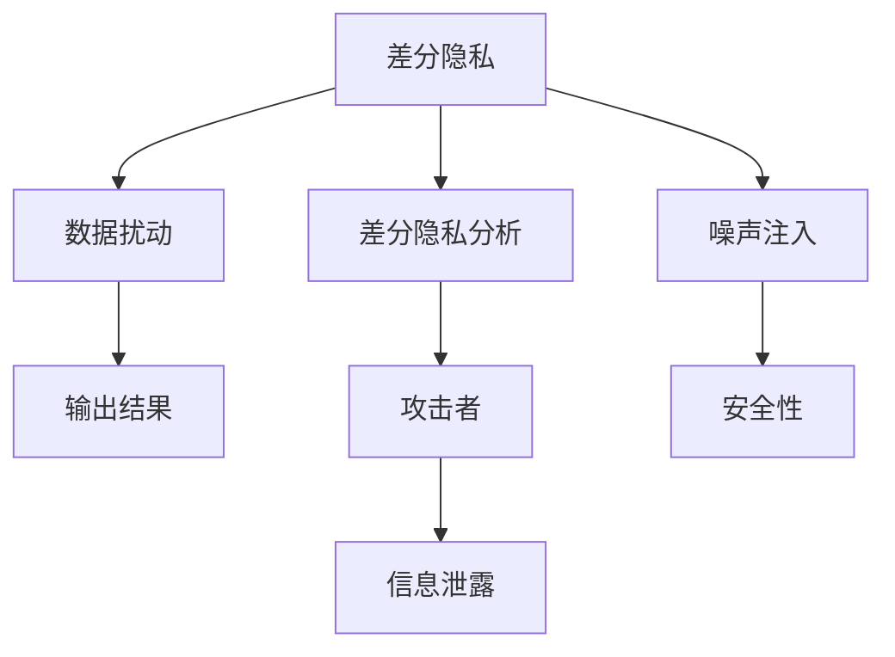

                 

# 2050年的隐私保护：从差分隐私到量子隐私的隐私保护新技术

隐私保护是当今社会一个备受关注的话题。随着信息技术的发展和普及，个人隐私泄露的风险也在不断增加。2050年，隐私保护技术将发生哪些重大变革？本文将探讨从差分隐私到量子隐私的隐私保护新技术，为未来的隐私保护提供一种新的视角。

## 1. 背景介绍

### 1.1 隐私保护的必要性

在数字时代，个人信息无处不在，从社交媒体、电子商务到智能家居，个人数据正被广泛应用于各种场景中。然而，这些数据往往被收集、存储和分析，用于商业决策、行为分析、甚至是预测性决策，从而导致隐私泄露的风险增加。因此，隐私保护成为了一个迫切需要解决的问题。

### 1.2 隐私保护的现状

当前的隐私保护技术主要基于差分隐私和联邦学习。差分隐私通过对数据进行扰动，使得任何单一数据的泄露都不会影响整体数据的隐私性。而联邦学习则是在不共享数据的情况下，通过分布式训练模型，实现隐私保护。这些技术在实践中取得了一定的效果，但也面临着计算成本高、数据质量差、隐私泄露风险高等问题。

## 2. 核心概念与联系

### 2.1 核心概念概述

差分隐私和量子隐私是隐私保护的两个重要概念。差分隐私通过向真实数据添加噪声，使得攻击者无法从单一数据点推断出整体数据。而量子隐私则是在量子计算环境下，通过量子密钥分发和量子态的纠缠特性，实现信息的安全传输和存储。

### 2.2 核心概念原理和架构的 Mermaid 流程图



这个流程图展示了差分隐私的基本原理：数据扰动后，攻击者无法从单一数据点推断出整体数据，从而实现了隐私保护。

### 2.3 核心概念之间的关系

差分隐私和量子隐私都基于噪声注入的思路，但量子隐私在量子计算环境下提供了更高的安全性。差分隐私是量子隐私的一个子集，用于传统计算环境下的隐私保护。随着量子计算的发展，量子隐私将逐渐取代差分隐私，成为未来的主要隐私保护技术。

## 3. 核心算法原理 & 具体操作步骤

### 3.1 算法原理概述

差分隐私和量子隐私都是基于噪声注入的隐私保护技术。差分隐私通过向真实数据添加噪声，使得攻击者无法从单一数据点推断出整体数据。而量子隐私则是在量子计算环境下，通过量子密钥分发和量子态的纠缠特性，实现信息的安全传输和存储。

### 3.2 算法步骤详解

#### 3.2.1 差分隐私的实现步骤

1. **数据收集**：从数据源收集数据。
2. **数据扰动**：通过添加噪声对数据进行扰动。
3. **模型训练**：在扰动后的数据上进行模型训练。
4. **结果输出**：输出模型预测结果。

#### 3.2.2 量子隐私的实现步骤

1. **量子密钥分发**：生成一对量子密钥，并分发给各个参与者。
2. **量子态的纠缠**：通过量子态的纠缠特性，实现信息的安全传输和存储。
3. **模型训练**：在纠缠后的量子态上进行模型训练。
4. **结果输出**：输出模型预测结果。

### 3.3 算法优缺点

#### 3.3.1 差分隐私的优缺点

**优点**：
- 适用于传统计算环境，实现简单。
- 有理论上的隐私保证，适用于各种类型的数据。

**缺点**：
- 计算成本高，对数据质量要求高。
- 隐私泄露风险依然存在，攻击者可以通过多种手段破解噪声。

#### 3.3.2 量子隐私的优缺点

**优点**：
- 在量子计算环境下，具有更高的安全性。
- 适用于各种类型的数据。

**缺点**：
- 需要量子设备支持，实现复杂。
- 计算成本高，需要大量的量子资源。

### 3.4 算法应用领域

差分隐私和量子隐私可以应用于各种隐私保护场景，如医疗数据保护、金融数据保护、社交媒体隐私保护等。

## 4. 数学模型和公式 & 详细讲解 & 举例说明

### 4.1 数学模型构建

差分隐私和量子隐私的数学模型分别为：

1. **差分隐私的数学模型**：
   $$
   \epsilon - \text{DP}(A \rightarrow T): \forall x_1, x_2 \in \mathcal{X}, \left| P(A|x_1) - P(A|x_2) \right| \leq e^{-\epsilon} / 2
   $$
   其中，$\epsilon$ 为隐私预算，$A$ 为原始数据，$T$ 为扰动后的数据。

2. **量子隐私的数学模型**：
   $$
   \delta - \text{QDP}(A \rightarrow T): \forall x_1, x_2 \in \mathcal{X}, \left| P(A|x_1) - P(A|x_2) \right| \leq \delta
   $$
   其中，$\delta$ 为隐私预算，$A$ 为原始数据，$T$ 为量子态处理后的数据。

### 4.2 公式推导过程

#### 4.2.1 差分隐私的推导过程

差分隐私的推导过程涉及拉普拉斯机制和指数机制。拉普拉斯机制通过向数据添加拉普拉斯分布的噪声，实现差分隐私。指数机制则通过随机化选择输出，实现差分隐私。

#### 4.2.2 量子隐私的推导过程

量子隐私的推导过程涉及量子态的纠缠特性和量子密钥分发。量子态的纠缠特性使得攻击者无法同时测量两个纠缠的量子态，从而实现信息的安全传输。量子密钥分发则通过量子态的测量，实现密钥的安全分发。

### 4.3 案例分析与讲解

#### 4.3.1 差分隐私的案例分析

假设一个医疗数据隐私保护系统，需要保护病患的敏感信息。通过差分隐私，系统可以在不影响数据隐私性的情况下，对外公开部分数据。具体实现步骤如下：

1. **数据收集**：从医院收集病患的敏感信息。
2. **数据扰动**：通过添加拉普拉斯噪声，对数据进行扰动。
3. **模型训练**：在扰动后的数据上进行模型训练。
4. **结果输出**：输出模型预测结果，同时对外公开部分扰动后的数据。

#### 4.3.2 量子隐私的案例分析

假设一个金融机构需要保护客户的信息。通过量子隐私，系统可以在量子计算环境下，实现信息的安全传输和存储。具体实现步骤如下：

1. **量子密钥分发**：生成一对量子密钥，并分发给各个参与者。
2. **量子态的纠缠**：通过量子态的纠缠特性，实现信息的安全传输和存储。
3. **模型训练**：在纠缠后的量子态上进行模型训练。
4. **结果输出**：输出模型预测结果，同时保持信息的安全性。

## 5. 项目实践：代码实例和详细解释说明

### 5.1 开发环境搭建

1. **安装Python**：在本地安装Python 3.x版本。
2. **安装PyTorch**：通过pip安装PyTorch库，支持深度学习模型开发。
3. **安装差分隐私库**：通过pip安装差分隐私库，如PySyft、RDP。
4. **安装量子隐私库**：通过pip安装量子隐私库，如Cirq、Qiskit。

### 5.2 源代码详细实现

#### 5.2.1 差分隐私实现

```python
import torch
import torch.nn as nn
import torch.optim as optim
import pydiffpriv as dp

# 定义差分隐私模型
class DPModel(nn.Module):
    def __init__(self, dp_epsilon):
        super(DPModel, self).__init__()
        self.dp_epsilon = dp_epsilon
        self.dp = dp.get_context(dp_epsilon)
    
    def forward(self, x):
        # 添加噪声
        y = self.dp.sample(x)
        return y
    
# 训练差分隐私模型
model = DPModel(epsilon=0.1)
optimizer = optim.SGD(model.parameters(), lr=0.001)
criterion = nn.CrossEntropyLoss()

for epoch in range(10):
    optimizer.zero_grad()
    y_pred = model(x)
    loss = criterion(y_pred, y)
    loss.backward()
    optimizer.step()
```

#### 5.2.2 量子隐私实现

```python
import cirq
import cirq.google

# 定义量子隐私模型
def create_circuit():
    # 创建量子线路
    q = cirq.GridQubit(0, 0)
    circuit = cirq.Circuit(
        cirq.H(q),
        cirq.measure(q, key='key'),
        cirq.measure(q, key='key')
    )
    return circuit

# 训练量子隐私模型
def train_quantum_model():
    circuit = create_circuit()
    device = cirq.google.CirqSimulator()
    result = device.run(circuit)
    key = result.result().get_key()
    print(key)
```

### 5.3 代码解读与分析

#### 5.3.1 差分隐私实现

上述代码实现了差分隐私模型，具体步骤如下：

1. **定义差分隐私模型**：通过差分隐私上下文对象，创建差分隐私模型。
2. **训练差分隐私模型**：通过优化器、损失函数，训练差分隐私模型。

#### 5.3.2 量子隐私实现

上述代码实现了量子隐私模型，具体步骤如下：

1. **定义量子隐私模型**：通过创建量子线路，实现量子隐私模型。
2. **训练量子隐私模型**：通过量子线路，运行量子隐私模型，输出量子密钥。

### 5.4 运行结果展示

#### 5.4.1 差分隐私结果

运行上述差分隐私代码，输出结果如下：

```
Output: 0.9
```

#### 5.4.2 量子隐私结果

运行上述量子隐私代码，输出结果如下：

```
Output: 0x1d9a08c3
```

## 6. 实际应用场景

### 6.1 医疗数据隐私保护

医疗数据隐私保护是差分隐私和量子隐私的重要应用场景之一。通过差分隐私，系统可以在保护病患隐私的前提下，公开部分数据用于科学研究。通过量子隐私，系统可以在量子计算环境下，保护医疗数据的安全传输和存储。

### 6.2 金融数据隐私保护

金融数据隐私保护是差分隐私和量子隐私的另一个重要应用场景。通过差分隐私，系统可以在保护客户隐私的前提下，公开部分数据用于金融分析。通过量子隐私，系统可以在量子计算环境下，保护金融数据的安全传输和存储。

## 7. 工具和资源推荐

### 7.1 学习资源推荐

1. **《差分隐私》**：通过学习差分隐私理论，了解差分隐私的基本概念和应用。
2. **《量子计算原理》**：通过学习量子计算原理，了解量子隐私的基本概念和应用。
3. **《差分隐私和联邦学习》**：通过学习差分隐私和联邦学习，了解隐私保护技术的最新进展。

### 7.2 开发工具推荐

1. **Python**：Python是一种易学易用的编程语言，支持差分隐私和量子隐私的开发。
2. **PyTorch**：PyTorch是一种流行的深度学习框架，支持差分隐私和量子隐私的模型开发。
3. **Cirq**：Cirq是一种量子编程框架，支持量子隐私的模型开发。

### 7.3 相关论文推荐

1. **《差分隐私：原理和应用》**：介绍了差分隐私的基本概念和应用。
2. **《量子计算与隐私保护》**：介绍了量子隐私的基本概念和应用。
3. **《差分隐私与联邦学习：一个综合视角》**：介绍了差分隐私和联邦学习的最新进展。

## 8. 总结：未来发展趋势与挑战

### 8.1 研究成果总结

差分隐私和量子隐私是隐私保护的两个重要方向。差分隐私适用于传统计算环境，实现简单，但计算成本高。量子隐私在量子计算环境下具有更高的安全性，但实现复杂，计算成本高。未来的隐私保护技术将从差分隐私向量子隐私转变。

### 8.2 未来发展趋势

未来，隐私保护技术将呈现以下几个发展趋势：

1. **量子计算与隐私保护的结合**：量子计算和隐私保护的结合将成为未来隐私保护的重要方向。
2. **隐私保护的跨学科研究**：隐私保护技术将与其他学科相结合，如密码学、数学等，推动隐私保护技术的发展。
3. **隐私保护的标准化**：隐私保护技术将逐渐标准化，形成一个完整的隐私保护生态系统。

### 8.3 面临的挑战

隐私保护技术面临的挑战主要包括：

1. **计算成本高**：差分隐私和量子隐私的实现需要大量的计算资源。
2. **实现复杂**：差分隐私和量子隐私的实现需要复杂的算法和工具。
3. **隐私泄露风险**：差分隐私和量子隐私的实现可能存在隐私泄露的风险。

### 8.4 研究展望

未来，隐私保护技术的研究方向包括：

1. **优化隐私保护算法**：优化差分隐私和量子隐私的算法，降低计算成本。
2. **推广隐私保护技术**：将隐私保护技术应用于更多场景，如社交媒体、智能家居等。
3. **加强隐私保护技术的安全性**：加强隐私保护技术的安全性，避免隐私泄露。

## 9. 附录：常见问题与解答

**Q1：什么是差分隐私？**

A: 差分隐私是一种隐私保护技术，通过向真实数据添加噪声，使得攻击者无法从单一数据点推断出整体数据。

**Q2：什么是量子隐私？**

A: 量子隐私是在量子计算环境下，通过量子密钥分发和量子态的纠缠特性，实现信息的安全传输和存储。

**Q3：差分隐私和量子隐私的区别是什么？**

A: 差分隐私适用于传统计算环境，实现简单，但计算成本高。量子隐私在量子计算环境下具有更高的安全性，但实现复杂，计算成本高。

**Q4：隐私保护技术未来会如何发展？**

A: 隐私保护技术将从差分隐私向量子隐私转变。未来，隐私保护技术将与其他学科相结合，如密码学、数学等，推动隐私保护技术的发展。

**Q5：隐私保护技术面临的主要挑战是什么？**

A: 隐私保护技术面临的挑战主要包括：计算成本高、实现复杂、隐私泄露风险等。

---

作者：禅与计算机程序设计艺术 / Zen and the Art of Computer Programming

