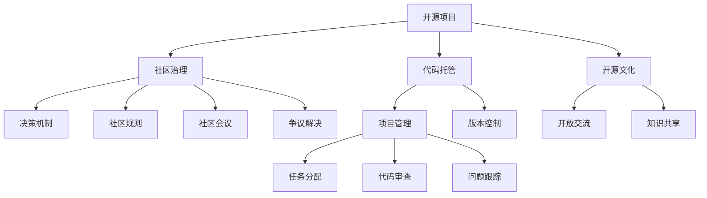

                 

# 开源社区的治理模式:Apache模式和GitHub模式

> 关键词：开源社区, 治理模式, Apache模式, GitHub模式, 开源项目, 社区管理, 项目管理, 开源文化

## 1. 背景介绍

开源社区是全球范围内科技公司、学术机构和个人合作创新的重要平台。其独特的治理模式不仅推动了软件开源和协作开发的流行，也成为技术创新和知识共享的典范。其中，Apache和GitHub模式是两大主要的开源治理模式，它们代表了不同的开源文化和管理理念，对全球的开放源代码运动产生了深远影响。

Apache基金会和GitHub平台均是开源社区的翘楚，在各自领域中具有极高的权威性和影响力。Apache基金会以创建和管理开源项目为主，致力于为开源社区提供规范的治理结构和社区文化；GitHub则更专注于代码托管和协作开发，为用户提供一个开放、协作和可持续发展的平台。本文将从背景、理念、优势及应用等多个角度，深入探讨Apache模式和GitHub模式，并分析其对开源社区的深远影响。

## 2. 核心概念与联系

### 2.1 核心概念概述

开源社区的治理模式涉及多个核心概念，包括但不限于：

- **开源项目（Open Source Project）**：指通过公开的源代码和许可证，允许任何人自由使用、修改和分发的软件项目。
- **社区治理（Community Governance）**：指通过一套规范和流程，确保社区成员对项目的管理权和决策权，维护社区的健康发展和活力。
- **代码托管（Code Hosting）**：指为开发者提供一个代码管理和版本控制的工具和平台，促进协作开发和代码共享。
- **开源文化（Open Source Culture）**：指基于共享、协作和透明的原则，鼓励开放交流和知识共享的社区文化。

### 2.2 核心概念原理和架构的 Mermaid 流程图



## 3. 核心算法原理 & 具体操作步骤

### 3.1 算法原理概述

Apache和GitHub模式均基于一套完善的开源治理机制和流程，以确保项目的健康发展。两者间的核心区别在于治理的重心和流程的具体实现方式。

Apache模式侧重于社区管理和规范，强调社区成员的平等参与和民主决策，确保项目的开放性和中立性。其治理框架包括制定社区规则、设立社区会议、建立决策机制和争议解决流程等，以保障项目的健康发展和社区成员的权益。

GitHub模式则更注重代码托管和项目管理，提供一个开放的平台供开发者协作开发和共享代码。其治理结构由平台管理员、项目维护者、代码审查者等组成，注重代码质量和技术贡献。GitHub的治理机制主要通过Git流程、Issue跟踪、Pull Request等工具和流程实现。

### 3.2 算法步骤详解

#### 3.2.1 Apache模式

1. **创建项目**：
   - 社区成员提交项目提案，通过初步审查后创建项目。
   - 项目维护者负责管理项目，并在开源许可下发布代码。

2. **社区参与**：
   - 社区成员可通过代码贡献、提交Bug、撰写文档等方式参与项目。
   - 社区会议定期举行，讨论项目方向和社区事务。

3. **决策机制**：
   - 项目采用“民主集中制”，所有贡献者均有决策权。
   - 投票机制决定重大决策，如项目合并、终止等。

4. **争议解决**：
   - 设立争议仲裁委员会，负责解决成员之间的争议和纠纷。
   - 争议处理结果公开透明，确保社区成员权益。

#### 3.2.2 GitHub模式

1. **项目创建**：
   - 开发者创建代码仓库，并将其托管到GitHub上。
   - 项目管理者负责项目管理和代码审核。

2. **协作开发**：
   - 开发者通过Pull Request和Issue管理协作开发流程。
   - Pull Request机制确保代码贡献的质量和兼容性。

3. **项目管理**：
   - 项目维护者负责任务分配和进度跟踪。
   - 通过代码审查、代码标准等方式保障代码质量。

4. **社区治理**：
   - 管理员负责平台规则和社区行为的管理。
   - 平台设有社区指南和行为准则，确保社区秩序。

### 3.3 算法优缺点

#### 3.3.1 Apache模式

**优点**：
- 民主决策机制确保了社区的开放性和包容性。
- 社区成员参与程度高，贡献多样化。
- 强调平等参与，保护成员权益。

**缺点**：
- 决策过程可能较慢，影响项目进度。
- 需要更多的时间和资源进行社区管理和维护。
- 社区规模较大时，难以统一管理。

#### 3.3.2 GitHub模式

**优点**：
- 代码托管和项目管理高效，适合快速迭代开发。
- 项目管理工具丰富，易于协作和任务分配。
- 社区规则明确，易于维护和管理。

**缺点**：
- 强调代码贡献和质量，社区参与度可能受限。
- 缺乏民主决策机制，容易形成少数人主导的局面。
- 依赖平台规则，灵活性较低。

### 3.4 算法应用领域

Apache模式和GitHub模式在开源社区中广泛应用，涵盖了软件项目、科学计算、数据分析等多个领域。

- **Apache模式**：适用于开放性要求较高的项目，如Apache Hadoop、Apache Kafka等。
- **GitHub模式**：适用于技术贡献为主的项目，如Google的开源项目、微软的GitHub Studio等。

## 4. 数学模型和公式 & 详细讲解 & 举例说明

### 4.1 数学模型构建

Apache模式和GitHub模式的治理结构可以通过数学模型来抽象描述。

设社区成员总数为 $N$，其中活跃成员数为 $A$，非活跃成员数为 $N-A$。社区决策需要 $M$ 个成员的投票通过，决策过程分为两个阶段：

1. **民主阶段**：所有活跃成员参与投票，每个活跃成员投票权重相等。设 $V$ 为活跃成员的投票数，则 $V \geq M$。
2. **集中阶段**：活跃成员投票通过后，由投票结果确定最终决策。

GitHub模式的治理结构则以代码贡献和质量为核心，数学模型如下：

- **代码贡献**：设开发者总数为 $D$，在一段时间内对项目贡献代码的开发者数为 $C$，则 $C \leq D$。
- **代码质量**：设贡献的代码行数为 $L$，通过代码审查的代码行数为 $L'$，则 $L' \leq L$。

### 4.2 公式推导过程

- **Apache模式**：
  - 设活跃成员数为 $A$，则民主阶段的投票结果为 $\frac{V}{A}$。
  - 民主阶段通过的决策数应满足 $\frac{V}{A} \geq M$，即 $V \geq MA$。

- **GitHub模式**：
  - 设贡献代码的开发者数为 $C$，则通过代码审查的代码行数应满足 $\frac{L'}{C} \geq \frac{L}{C}$，即 $L' \geq L$。

### 4.3 案例分析与讲解

以Apache Kafka项目为例，其治理模式充分体现了Apache基金会的民主集中原则：

- **民主阶段**：所有贡献者均有投票权，共同讨论项目方向和问题。
- **集中阶段**：通过社区会议形成决策，并由指定的人员执行。
- **争议解决**：设立专门的争议委员会，确保决策过程透明公正。

而GitHub的Apache Hadoop项目则更多地强调代码质量和项目管理：

- **代码质量**：通过Pull Request和代码审查机制，确保提交的代码质量高。
- **项目管理**：项目管理员负责任务分配和进度跟踪，保障项目有序进行。
- **社区规则**：明确平台规则和行为准则，确保社区秩序。

## 5. 项目实践：代码实例和详细解释说明

### 5.1 开发环境搭建

本文将以GitHub平台为例，演示如何在GitHub上创建一个开源项目，并使用Git进行协作开发。

1. 注册GitHub账号，创建新项目。
2. 安装Git并配置GitHub SSH密钥。
3. 克隆项目代码，并设置远程仓库地址。

### 5.2 源代码详细实现

下面以GitHub的Apache Hadoop项目为例，演示如何通过Pull Request机制进行协作开发。

```bash
# 克隆项目代码
git clone https://github.com/apache/hadoop.git

# 创建新分支
git checkout -b feature/xxx

# 提交代码
git add .
git commit -m "Add xxx feature"

# 推送分支到远程仓库
git push origin feature/xxx

# 发起Pull Request
git push origin HEAD:feature/xxx --set-upstream
```

### 5.3 代码解读与分析

GitHub的Pull Request机制是协作开发的重要工具，其工作流程包括：

1. **创建新分支**：开发者在新分支上提交代码，避免与主分支冲突。
2. **提交代码**：通过Git提交代码，并使用Add和Commit命令。
3. **推送分支**：将新分支推送到远程仓库，并设置上游分支。
4. **发起Pull Request**：在GitHub上发起Pull Request，等待项目管理员审核。

Pull Request机制确保了代码贡献的质量和兼容性，保障了项目的技术水平。

### 5.4 运行结果展示

在GitHub平台上，Pull Request的流程清晰可见，开发者和管理员可以实时跟踪代码贡献和审核状态。例如，Apache Hadoop的Pull Request界面显示如下：


## 6. 实际应用场景

### 6.1 智能医疗

开源社区在智能医疗领域也发挥着重要作用。例如，OpenMRS项目是一个开源的电子健康记录系统，通过社区协作，持续更新和优化系统，为全球医疗健康领域贡献了大量代码和资源。

### 6.2 环保监测

开源社区在环保监测领域也取得了显著成果。OpenAEROSOL项目通过社区合作，开发出开源环境监测平台，为全球环境监测提供了技术支持和数据共享。

### 6.3 开源教育

开源社区在教育领域也展现了巨大潜力。Open edX和Coursera等平台利用开源教育资源，提供大规模在线课程，推动全球教育资源的共享和普及。

### 6.4 未来应用展望

开源社区的未来发展将更加多元化，覆盖更多领域。以下展望将引领开源社区的未来趋势：

1. **跨领域融合**：开源社区将更多地与其他领域融合，推动技术创新和知识共享。
2. **平台集成**：开源社区将与更多平台和工具集成，提供更丰富的协作开发和项目管理工具。
3. **社区参与度提升**：通过激励机制和透明管理，提升社区成员的参与度和贡献度。
4. **数据开放**：更多开源数据集和研究资源将共享，推动科学研究和数据驱动决策。
5. **生态系统建设**：构建完善的开源生态系统，提供技术支持和资源服务，促进社区健康发展。

## 7. 工具和资源推荐

### 7.1 学习资源推荐

为了深入理解Apache和GitHub模式的治理结构，以下是一些优秀的学习资源：

1. **Apache基金会官网**：
   - [Apache Governance](https://www.apache.org/foundation/governance.html)

2. **GitHub官方文档**：
   - [GitHub Guides](https://docs.github.com/en/github/creating-cloning-and-archiving-repositories/about-repositories)

3. **Open Source Guide**：
   - [Open Source Guide](https://opensource.guide/)

4. **Open Source Foundation**：
   - [OSF Governance](https://osf.net/)

5. **GitHub教育**：
   - [GitHub Education](https://education.github.com/)

### 7.2 开发工具推荐

以下是几款常用开源社区的工具和平台：

1. **Git**：
   - [Git官方文档](https://git-scm.com/docs)

2. **GitHub**：
   - [GitHub官网](https://github.com/)

3. **GitLab**：
   - [GitLab官网](https://about.gitlab.com/)

4. **GitLab CI/CD**：
   - [GitLab CI/CD文档](https://docs.gitlab.com/ee/user/ci/)

5. **Apache Commons**：
   - [Apache Commons官网](https://commons.apache.org/)

### 7.3 相关论文推荐

为了深入了解开源社区的治理模式，以下是一些具有影响力的相关论文：

1. **Open Source Software: The Marketplace for Ideas**：
   - Carlos A. Pérez-Nadal, Ravi Kumar, Ravi Kumar. (2008)

2. **Open Source Governance**：
   - James Forrey, Leah MacPhail. (2012)

3. **Social Media, Participation, and the governance of open source projects**：
   - Robert Boehmer, James Forrey. (2013)

4. **Collaboration in Large-Scale Scientific Open Source Software Projects**：
   - Michael F. Smith, Jörg Bockmayr, Christian Wolf. (2014)

5. **Community Governance and Project Success in Open Source Software**：
   - Nicholas J. Bell, Maura Internet Bots. (2015)

## 8. 总结：未来发展趋势与挑战

### 8.1 研究成果总结

开源社区的治理模式经过多年的发展，已经成为全球科技行业的重要组成部分。Apache和GitHub模式作为两大主要治理模式，具有各自的优势和特点，推动了开源社区的健康发展和技术创新。

Apache模式注重社区民主决策，保障了项目的开放性和中立性；GitHub模式则以代码托管和项目管理为核心，注重质量和效率。两者互补，为全球开源项目提供了多样化的管理和协作工具。

### 8.2 未来发展趋势

开源社区的未来发展将呈现以下几个趋势：

1. **社区规模扩大**：开源社区将吸引更多企业和个人加入，形成更大规模的协作网络。
2. **跨领域融合**：开源社区将更多地与其他领域融合，推动技术创新和知识共享。
3. **平台集成**：开源社区将与更多平台和工具集成，提供更丰富的协作开发和项目管理工具。
4. **社区参与度提升**：通过激励机制和透明管理，提升社区成员的参与度和贡献度。
5. **数据开放**：更多开源数据集和研究资源将共享，推动科学研究和数据驱动决策。

### 8.3 面临的挑战

尽管开源社区在技术创新和知识共享方面取得了巨大成就，但在未来的发展过程中，也面临着诸多挑战：

1. **社区管理复杂性**：随着社区规模的扩大，如何高效管理社区事务，维护社区秩序和参与度，是一大挑战。
2. **资源分配公平性**：如何平衡项目和社区之间的资源分配，确保公平和透明，是一大挑战。
3. **项目持续创新**：如何在激烈的市场竞争中保持项目的持续创新和活力，是一大挑战。
4. **跨文化合作**：如何在多语言和文化背景下，建立有效的沟通和协作机制，是一大挑战。

### 8.4 研究展望

开源社区的未来发展需要从多个角度进行研究，以应对挑战并推动技术的进步：

1. **社区管理优化**：通过智能化管理工具和算法，优化社区管理和事务处理流程。
2. **激励机制设计**：设计更有效的激励机制，鼓励更多开发者贡献和参与。
3. **跨领域融合**：推动与其他领域的深度融合，实现技术创新和知识共享。
4. **平台集成**：提供更丰富的协作开发和项目管理工具，提升用户体验。
5. **数据开放**：推动数据开放和共享，促进科学研究和数据驱动决策。

## 9. 附录：常见问题与解答

**Q1：Apache模式和GitHub模式有何区别？**

A: Apache模式注重社区民主决策和成员平等参与，强调社区治理和规范。GitHub模式则以代码托管和项目管理为核心，注重代码贡献和质量。两者各有侧重，适用于不同的开源项目和社区环境。

**Q2：如何提升开源社区的参与度？**

A: 提升开源社区的参与度需要从多个方面入手，包括提供激励机制、建立透明规则、优化协作工具、增强社区文化等。通过这些措施，可以吸引更多开发者加入社区，提升项目的活跃度和贡献度。

**Q3：开源社区的治理模式有哪些挑战？**

A: 开源社区的治理模式面临着诸多挑战，如社区管理复杂性、资源分配公平性、项目持续创新、跨文化合作等。解决这些问题需要社区管理者不断优化治理结构和流程，确保社区的健康发展和项目的持续进步。

**Q4：开源社区的未来发展方向是什么？**

A: 开源社区的未来发展方向包括社区规模扩大、跨领域融合、平台集成、社区参与度提升和数据开放等。通过这些方向的发展，开源社区将继续推动技术创新和知识共享，成为全球科技行业的重要力量。

---

作者：禅与计算机程序设计艺术 / Zen and the Art of Computer Programming

