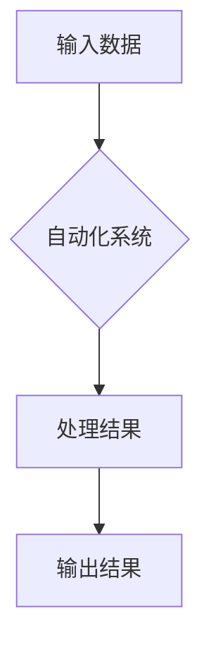

> 自动化、机器学习、深度学习、自然语言处理、计算机视觉、流程自动化、Robotic Process Automation (RPA)

## 1. 背景介绍

自动化技术作为科技发展的重要驱动力，近年来取得了长足进步，深刻地改变着各行各业的生产方式和生活方式。从工业革命的自动化生产线到如今人工智能驱动的智能化系统，自动化技术始终扮演着引领未来发展的关键角色。

随着计算机硬件性能的不断提升、算法模型的不断完善以及数据量的爆炸式增长，自动化技术正迈入一个新的发展阶段。机器学习、深度学习、自然语言处理、计算机视觉等人工智能技术的发展，为自动化技术提供了强大的技术支撑，使得自动化技术能够更加智能化、精准化和个性化。

## 2. 核心概念与联系

自动化技术的核心概念是通过程序、算法和系统自动执行重复性、规则性或复杂性任务，从而提高效率、降低成本和减少人为错误。

**自动化技术与人工智能技术的联系:**

人工智能技术是自动化技术的重要组成部分，它赋予了自动化系统更强的智能化能力。

* **机器学习:** 通过算法从数据中学习，不断改进自身性能，实现对复杂任务的自动化处理。
* **深度学习:** 基于多层神经网络，能够学习更复杂的模式和特征，在图像识别、语音识别、自然语言处理等领域取得突破性进展。
* **自然语言处理:** 使得计算机能够理解和处理人类语言，实现人机自然交互，推动自动化技术在客服、翻译、写作等领域的应用。
* **计算机视觉:** 使得计算机能够“看”世界，识别图像和视频中的物体、场景和行为，为自动化技术在安防、医疗、工业检测等领域提供支持。

**自动化技术架构:**



## 3. 核心算法原理 & 具体操作步骤

### 3.1  算法原理概述

自动化技术中常用的算法包括：

* **规则引擎:** 基于预先定义的规则，对输入数据进行判断和处理。
* **决策树:** 通过树状结构，根据输入数据特征进行分类和预测。
* **支持向量机:** 通过寻找最佳分割超平面，将数据点分类。
* **神经网络:** 通过多层神经元网络，学习数据中的复杂模式和关系。

### 3.2  算法步骤详解

以规则引擎为例，其具体操作步骤如下：

1. **定义规则:** 根据业务需求，定义一系列规则，描述不同输入数据对应的处理逻辑。
2. **加载规则:** 将定义好的规则加载到规则引擎中。
3. **输入数据:** 将需要处理的数据输入到规则引擎中。
4. **规则匹配:** 规则引擎根据输入数据，匹配相应的规则。
5. **执行规则:** 匹配到的规则被执行，产生相应的处理结果。
6. **输出结果:** 处理结果输出到外部系统或用户界面。

### 3.3  算法优缺点

**规则引擎:**

* **优点:** 易于理解和维护，规则可视化，可扩展性强。
* **缺点:** 规则难以表达复杂逻辑，难以适应变化的业务需求。

**决策树:**

* **优点:** 易于理解和解释，可处理分类和回归问题。
* **缺点:** 容易过拟合，对数据特征依赖性强。

**支持向量机:**

* **优点:** 泛化能力强，对高维数据处理能力强。
* **缺点:** 训练时间长，参数选择复杂。

**神经网络:**

* **优点:** 能够学习复杂模式，性能优异。
* **缺点:** 训练数据量大，训练时间长，难以解释模型决策过程。

### 3.4  算法应用领域

自动化技术广泛应用于各个领域，例如：

* **制造业:** 自动化生产线、机器人控制、质量检测。
* **金融业:** 风险管理、欺诈检测、客户服务自动化。
* **医疗保健:** 疾病诊断、药物研发、患者管理。
* **零售业:** 库存管理、订单处理、个性化推荐。
* **交通运输:** 自动驾驶、交通管理、物流优化。

## 4. 数学模型和公式 & 详细讲解 & 举例说明

### 4.1  数学模型构建

自动化技术中常用的数学模型包括：

* **线性回归模型:** 用于预测连续变量，其目标是找到一条直线，使得预测值与实际值之间的误差最小。

* **逻辑回归模型:** 用于预测分类变量，其目标是找到一个阈值，使得预测结果与实际结果的匹配度最大。

* **决策树模型:** 通过树状结构，将数据点分类，其决策规则可以表示为一系列的条件语句。

### 4.2  公式推导过程

以线性回归模型为例，其目标函数为：

$$
J(\theta) = \frac{1}{2m} \sum_{i=1}^{m} (h_\theta(x^{(i)}) - y^{(i)})^2
$$

其中：

* $J(\theta)$ 是损失函数，表示模型预测值与实际值之间的误差。
* $\theta$ 是模型参数。
* $m$ 是训练样本的数量。
* $h_\theta(x^{(i)})$ 是模型预测值。
* $y^{(i)}$ 是实际值。

通过梯度下降算法，可以迭代更新模型参数，使得损失函数最小化。

### 4.3  案例分析与讲解

假设我们想要预测房价，可以使用线性回归模型。

* **输入特征:** 房屋面积、房间数量、地理位置等。
* **输出变量:** 房价。

通过训练数据，我们可以得到模型参数，并使用这些参数预测新房子的价格。

## 5. 项目实践：代码实例和详细解释说明

### 5.1  开发环境搭建

* **操作系统:** Ubuntu 20.04 LTS
* **编程语言:** Python 3.8
* **库依赖:** scikit-learn, pandas, numpy

### 5.2  源代码详细实现

```python
import pandas as pd
from sklearn.linear_model import LinearRegression
from sklearn.model_selection import train_test_split

# 加载数据
data = pd.read_csv('house_price.csv')

# 划分训练集和测试集
X = data[['area', 'rooms']]
y = data['price']
X_train, X_test, y_train, y_test = train_test_split(X, y, test_size=0.2, random_state=42)

# 创建线性回归模型
model = LinearRegression()

# 训练模型
model.fit(X_train, y_train)

# 预测测试集数据
y_pred = model.predict(X_test)

# 评估模型性能
from sklearn.metrics import mean_squared_error
mse = mean_squared_error(y_test, y_pred)
print(f'Mean Squared Error: {mse}')
```

### 5.3  代码解读与分析

* **数据加载:** 使用 pandas 库加载房价数据。
* **数据划分:** 将数据划分为训练集和测试集，用于训练和评估模型。
* **模型创建:** 使用 scikit-learn 库创建线性回归模型。
* **模型训练:** 使用训练集数据训练模型，学习房价与面积、房间数量之间的关系。
* **模型预测:** 使用训练好的模型预测测试集数据的房价。
* **模型评估:** 使用均方误差 (MSE) 评估模型性能。

### 5.4  运行结果展示

运行代码后，会输出模型的均方误差值，该值越小，模型的预测精度越高。

## 6. 实际应用场景

### 6.1  工业自动化

* **机器人控制:** 自动化机器人可以执行重复性、危险性或高精度任务，例如在制造业中进行焊接、组装和搬运。
* **生产线优化:** 通过自动化系统监控和控制生产线，提高生产效率、降低生产成本和减少浪费。
* **质量检测:** 自动化系统可以对产品进行快速、准确的质量检测，确保产品质量。

### 6.2  商业自动化

* **客户关系管理 (CRM):** 自动化系统可以帮助企业管理客户信息、跟踪客户互动和提供个性化服务。
* **电子商务:** 自动化系统可以处理订单、物流和客户服务，提高电商平台的效率和用户体验。
* **营销自动化:** 自动化系统可以帮助企业进行精准营销，例如发送个性化邮件、推送广告和管理社交媒体。

### 6.3  办公自动化

* **流程自动化:** 自动化系统可以帮助企业简化和优化业务流程，例如审批流程、报销流程和合同管理流程。
* **文档处理:** 自动化系统可以帮助企业自动提取、分类和整理文档，提高文档管理效率。
* **数据分析:** 自动化系统可以帮助企业自动收集、清洗和分析数据，为决策提供支持。

### 6.4  未来应用展望

自动化技术的发展将进一步改变我们的生活和工作方式。

* **智能家居:** 自动化系统将使家居更加智能化，例如自动控制灯光、温度和安全系统。
* **自动驾驶:** 自动驾驶汽车将改变交通出行方式，提高交通安全和效率。
* **个性化医疗:** 自动化系统将帮助医生提供更个性化的医疗服务，例如精准诊断和个性化治疗方案。

## 7. 工具和资源推荐

### 7.1  学习资源推荐

* **书籍:**
    * 《人工智能：一种现代方法》
    * 《深度学习》
    * 《机器学习实战》
* **在线课程:**
    * Coursera: 机器学习、深度学习
    * edX: 人工智能、数据科学
    * Udacity: 自动驾驶、机器学习工程师

### 7.2  开发工具推荐

* **Python:** 广泛应用于自动化开发，拥有丰富的库和框架。
* **R:** 用于数据分析和可视化，适合统计建模和数据挖掘。
* **Java:** 企业级应用开发，支持大规模分布式系统。

### 7.3  相关论文推荐

* **《ImageNet Classification with Deep Convolutional Neural Networks》**
* **《Attention Is All You Need》**
* **《BERT: Pre-training of Deep Bidirectional Transformers for Language Understanding》**

## 8. 总结：未来发展趋势与挑战

### 8.1  研究成果总结

自动化技术取得了长足进步，人工智能技术为自动化技术提供了强大的技术支撑，使得自动化技术更加智能化、精准化和个性化。

### 8.2  未来发展趋势

* **更智能的自动化:** 随着人工智能技术的不断发展，自动化系统将更加智能化，能够更好地理解和响应人类需求。
* **更广泛的应用:** 自动化技术将应用于更多领域，例如医疗保健、教育、娱乐等。
* **更安全的自动化:** 随着自动化技术的应用范围扩大，安全问题将更加重要，需要开发更加安全的自动化系统。

### 8.3  面临的挑战

* **数据安全:** 自动化系统依赖于大量数据，数据安全问题需要得到重视。
* **算法偏见:** 算法模型可能存在偏见，需要开发更加公平公正的算法模型。
* **伦理问题:** 自动化技术可能带来一些伦理问题，例如工作岗位替代和算法决策的透明度问题。

### 8.4  研究展望

未来，自动化技术将继续发展，为人类社会带来更多便利和福祉。我们需要加强对自动化技术的研究，解决其面临的挑战，并确保其安全、公平和可持续发展。

## 9. 附录：常见问题与解答

* **什么是自动化技术？**

自动化技术是指通过程序、算法和系统自动执行重复性、规则性或复杂性任务，从而提高效率、降低成本和减少人为错误。

* **自动化技术有哪些应用场景？**

自动化技术广泛应用于各个领域，例如制造业、金融业、医疗保健、零售业和交通运输业。

* **自动化技术有哪些发展趋势？**

自动化技术将更加智能化、精准化和个性化，应用范围将更加广泛。

* **自动化技术有哪些挑战？**

自动化技术面临