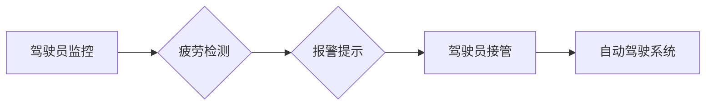

> 自动驾驶, 驾驶员监控, 疲劳检测, 人脸识别, 计算机视觉, 深度学习

## 1. 背景介绍

自动驾驶技术作为未来交通运输的重要发展方向，其安全性至关重要。驾驶员监控与疲劳检测是自动驾驶系统中不可或缺的一部分，旨在确保驾驶员始终保持清醒、专注，并能够及时接管车辆控制权。随着自动驾驶技术的不断发展，驾驶员监控与疲劳检测技术也日益成熟，并逐渐成为自动驾驶系统的标配功能。

传统的驾驶员监控系统主要依赖于摄像头和传感器，通过分析驾驶员的面部表情、眼部状态、头部姿态等信息来判断驾驶员的疲劳程度。然而，传统的监控方法存在一定的局限性，例如容易受到光线、角度等因素的影响，识别精度较低。

近年来，随着深度学习技术的兴起，基于深度学习的驾驶员监控与疲劳检测技术取得了显著的进展。深度学习模型能够自动学习驾驶员特征，并对驾驶员状态进行更准确的识别。

## 2. 核心概念与联系

### 2.1 驾驶员监控

驾驶员监控是指通过各种传感器和算法，实时监测驾驶员的状态和行为，确保驾驶员保持清醒、专注，并能够及时接管车辆控制权。

### 2.2 疲劳检测

疲劳检测是指通过分析驾驶员的生理特征和行为特征，判断驾驶员是否处于疲劳状态。

### 2.3 自动驾驶系统

自动驾驶系统是指能够自主感知环境、规划路径、控制车辆行驶的系统。

**Mermaid 流程图**



## 3. 核心算法原理 & 具体操作步骤

### 3.1  算法原理概述

基于深度学习的驾驶员监控与疲劳检测算法通常采用卷积神经网络（CNN）作为核心模型。CNN能够自动学习驾驶员特征，并对驾驶员状态进行分类识别。

### 3.2  算法步骤详解

1. **数据采集:** 收集驾驶员的面部图像、眼部图像、头部姿态等数据。
2. **数据预处理:** 对采集到的数据进行预处理，例如图像裁剪、增强、归一化等。
3. **模型训练:** 使用深度学习框架（例如TensorFlow、PyTorch）训练CNN模型，将预处理后的数据作为训练样本。
4. **模型评估:** 使用测试数据评估模型的性能，例如准确率、召回率、F1-score等。
5. **模型部署:** 将训练好的模型部署到自动驾驶系统中，实时监测驾驶员状态。

### 3.3  算法优缺点

**优点:**

* 识别精度高：深度学习模型能够自动学习驾驶员特征，识别精度显著提高。
* 适应性强：能够适应不同的驾驶员、光线、角度等条件。
* 可扩展性强：可以扩展到其他驾驶员行为监测，例如分心、疲劳驾驶等。

**缺点:**

* 数据需求量大：训练深度学习模型需要大量的训练数据。
* 计算资源消耗大：训练和部署深度学习模型需要较大的计算资源。
* 隐私安全问题：驾驶员数据需要妥善保护，避免泄露隐私。

### 3.4  算法应用领域

* 自动驾驶系统
*ADAS（高级驾驶员辅助系统）
* 交通安全监控
* 疲劳驾驶预防

## 4. 数学模型和公式 & 详细讲解 & 举例说明

### 4.1  数学模型构建

深度学习模型的构建通常基于神经网络结构，例如卷积神经网络（CNN）。CNN模型由多个卷积层、池化层、全连接层组成。

**卷积层:** 用于提取图像特征。卷积层使用卷积核对图像进行卷积运算，提取图像局部特征。

**池化层:** 用于降低图像维度，提高模型鲁棒性。池化层使用最大池化或平均池化等操作，对图像特征进行降维。

**全连接层:** 用于将提取的特征进行分类识别。全连接层将池化后的特征进行连接，并使用激活函数进行非线性变换，最终输出分类结果。

### 4.2  公式推导过程

CNN模型的训练过程基于反向传播算法。反向传播算法通过计算损失函数的梯度，更新模型参数，使得模型的预测结果与真实标签之间的误差最小化。

**损失函数:**

$$
L = \sum_{i=1}^{N} \mathcal{L}(y_i, \hat{y}_i)
$$

其中：

* $L$ 为损失函数
* $N$ 为样本数量
* $\mathcal{L}$ 为单个样本的损失函数
* $y_i$ 为真实标签
* $\hat{y}_i$ 为模型预测结果

**梯度下降算法:**

$$
\theta = \theta - \alpha \nabla L(\theta)
$$

其中：

* $\theta$ 为模型参数
* $\alpha$ 为学习率
* $\nabla L(\theta)$ 为损失函数的梯度

### 4.3  案例分析与讲解

假设我们训练一个CNN模型用于识别驾驶员疲劳状态。训练数据包含大量驾驶员的面部图像，其中一部分图像标记为“疲劳”，另一部分图像标记为“非疲劳”。

通过训练，CNN模型能够学习到驾驶员疲劳状态的特征，例如眼部闭合、头部倾斜等。当模型接收到新的驾驶员面部图像时，它会根据学习到的特征进行分类识别，判断驾驶员是否处于疲劳状态。

## 5. 项目实践：代码实例和详细解释说明

### 5.1  开发环境搭建

* 操作系统：Ubuntu 20.04
* Python 版本：3.8
* 深度学习框架：TensorFlow 2.0
* 图像处理库：OpenCV

### 5.2  源代码详细实现

```python
import tensorflow as tf
from tensorflow.keras.models import Sequential
from tensorflow.keras.layers import Conv2D, MaxPooling2D, Flatten, Dense

# 定义CNN模型
model = Sequential()
model.add(Conv2D(32, (3, 3), activation='relu', input_shape=(64, 64, 3)))
model.add(MaxPooling2D((2, 2)))
model.add(Conv2D(64, (3, 3), activation='relu'))
model.add(MaxPooling2D((2, 2)))
model.add(Flatten())
model.add(Dense(10, activation='softmax'))

# 编译模型
model.compile(optimizer='adam',
              loss='sparse_categorical_crossentropy',
              metrics=['accuracy'])

# 训练模型
model.fit(x_train, y_train, epochs=10)

# 评估模型
loss, accuracy = model.evaluate(x_test, y_test)
print('Loss:', loss)
print('Accuracy:', accuracy)
```

### 5.3  代码解读与分析

* **模型定义:** 使用`Sequential`类定义一个顺序模型，并添加卷积层、池化层、全连接层。
* **模型编译:** 使用`compile`方法编译模型，指定优化器、损失函数和评价指标。
* **模型训练:** 使用`fit`方法训练模型，传入训练数据和训练轮数。
* **模型评估:** 使用`evaluate`方法评估模型，传入测试数据和真实标签。

### 5.4  运行结果展示

训练完成后，模型的损失值和准确率会输出到控制台。

## 6. 实际应用场景

### 6.1  自动驾驶汽车

自动驾驶汽车需要实时监测驾驶员的状态，确保驾驶员能够及时接管车辆控制权。

### 6.2  货车驾驶员监控

货车驾驶员长时间驾驶容易疲劳，疲劳驾驶会导致交通事故发生。

### 6.3  公共交通车辆监控

公共交通车辆的驾驶员也需要进行监控，确保驾驶员保持清醒、专注，为乘客提供安全可靠的出行体验。

### 6.4  未来应用展望

* **更精准的疲劳检测:** 利用生物信号（例如心率、脑电波）进行疲劳检测，提高检测精度。
* **个性化疲劳检测:** 根据驾驶员的年龄、健康状况等因素，进行个性化的疲劳检测。
* **主动干预:** 当驾驶员出现疲劳迹象时，系统可以主动发出警报，提醒驾驶员休息。

## 7. 工具和资源推荐

### 7.1  学习资源推荐

* **书籍:**
    * 深度学习
    * 计算机视觉
* **在线课程:**
    * Coursera
    * edX
* **开源项目:**
    * TensorFlow
    * PyTorch

### 7.2  开发工具推荐

* **IDE:**
    * PyCharm
    * VS Code
* **图像处理库:**
    * OpenCV
    * Pillow

### 7.3  相关论文推荐

* **论文:**
    * Driver Drowsiness Detection Using Facial Feature Analysis
    * Real-Time Driver Drowsiness Detection Using Deep Learning

## 8. 总结：未来发展趋势与挑战

### 8.1  研究成果总结

基于深度学习的驾驶员监控与疲劳检测技术取得了显著的进展，识别精度大幅提高，应用场景不断扩展。

### 8.2  未来发展趋势

* **更精准的疲劳检测:** 利用生物信号进行疲劳检测，提高检测精度。
* **个性化疲劳检测:** 根据驾驶员的个体差异进行疲劳检测。
* **主动干预:** 当驾驶员出现疲劳迹象时，系统可以主动发出警报，提醒驾驶员休息。

### 8.3  面临的挑战

* **数据标注:** 训练深度学习模型需要大量的标注数据，数据标注成本较高。
* **模型鲁棒性:** 模型需要能够适应不同的驾驶员、光线、角度等条件，提高模型鲁棒性。
* **隐私安全:** 驾驶员数据需要妥善保护，避免泄露隐私。

### 8.4  研究展望

未来，驾驶员监控与疲劳检测技术将继续朝着更精准、更智能、更安全的方向发展。


## 9. 附录：常见问题与解答

### 9.1  Q1: 驾驶员监控与疲劳检测技术有哪些不同的方法？

### 9.2  A1: 

### 9.3  Q2: 深度学习模型在驾驶员监控与疲劳检测中的优势是什么？

### 9.4  A2: 

### 9.5  Q3: 驾驶员监控与疲劳检测技术有哪些伦理问题？

### 9.6  A3: 


作者：禅与计算机程序设计艺术 / Zen and the Art of Computer Programming 
<end_of_turn>