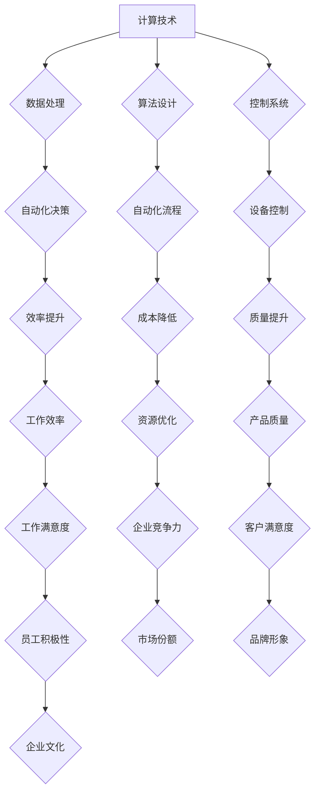

> 计算技术、自动化、人工智能、机器学习、深度学习、流程自动化、软件开发、效率提升

## 1. 背景介绍

计算技术作为人类文明进步的基石，自诞生以来便经历了从简单的机械计算到如今的智能化计算的飞跃。伴随着互联网、移动互联网和云计算的蓬勃发展，计算技术正以前所未有的速度演进，深刻地改变着我们的生活方式、工作模式和社会结构。

自动化，作为计算技术发展的重要方向之一，旨在通过程序和算法自动完成原本需要人工完成的任务。从工业革命中的流水线生产到如今的智能家居和自动驾驶汽车，自动化技术已经渗透到生活的方方面面，极大地提高了生产效率、降低了成本，并为人类创造了更多的时间和空间去追求更高层次的价值。

然而，自动化技术的发展也面临着新的挑战和机遇。随着人工智能、机器学习和深度学习等技术的快速发展，自动化技术正在迈向更智能、更灵活、更自主的阶段。这不仅为我们带来了前所未有的便利，也引发了人们对未来社会发展趋势和人类命运的深刻思考。

## 2. 核心概念与联系

**2.1 自动化概念**

自动化是指利用技术手段，使生产、工作或其他过程无需人工干预即可自动完成的过程。它可以分为：

* **硬自动化:** 通过机械、电气、控制系统等硬件设备实现自动化，例如流水线生产、机器人操作等。
* **软自动化:** 通过软件程序、算法等实现自动化，例如数据处理、流程审批、任务调度等。

**2.2 计算技术与自动化的关系**

计算技术是自动化技术的基础和驱动力。

* **数据处理:** 计算技术能够高效地处理海量数据，为自动化决策提供数据支持。
* **算法设计:** 计算技术提供了算法设计和优化工具，使自动化系统能够更加智能化和高效化。
* **控制系统:** 计算技术构成了自动化系统的控制核心，能够根据预设规则或人工智能算法控制设备和流程。

**2.3 流程自动化**

流程自动化是指利用软件工具和技术，对企业内部或外部的业务流程进行自动化，提高效率、降低成本、减少人为错误。

**2.4 人工智能与自动化**

人工智能技术作为自动化技术的重要组成部分，能够赋予自动化系统更强的智能化和自主性。

* **机器学习:** 通过训练数据，使机器能够自动学习和改进决策能力。
* **深度学习:** 通过多层神经网络，模拟人类大脑的学习机制，实现更复杂的智能化应用。

**Mermaid 流程图**



## 3. 核心算法原理 & 具体操作步骤

### 3.1 算法原理概述

自动化技术的核心是算法，算法是解决特定问题的一系列步骤或规则。常见的自动化算法包括：

* **规则引擎:** 基于预设规则进行决策和执行操作。
* **机器学习算法:** 通过训练数据学习模式，并根据学习到的模式进行预测和决策。
* **深度学习算法:** 通过多层神经网络模拟人类大脑，实现更复杂的智能化应用。

### 3.2 算法步骤详解

以规则引擎为例，其自动化流程如下：

1. **定义规则:** 根据业务需求，定义一系列规则，描述特定事件发生的条件和相应的操作。
2. **输入事件:** 系统接收来自外部或内部的事件数据。
3. **规则匹配:** 系统根据定义的规则，匹配输入事件是否满足规则条件。
4. **执行操作:** 如果事件满足规则条件，系统执行相应的操作。
5. **记录日志:** 系统记录事件和操作的日志信息，方便后续分析和调试。

### 3.3 算法优缺点

**规则引擎:**

* **优点:** 易于理解和维护，规则可视化，可根据需求灵活调整。
* **缺点:** 规则难以表达复杂逻辑，难以适应变化多端的业务场景。

**机器学习算法:**

* **优点:** 可以学习复杂模式，适应变化的业务场景，自动优化决策。
* **缺点:** 需要大量训练数据，训练过程复杂，模型解释性较差。

**深度学习算法:**

* **优点:** 能够处理更复杂的数据，实现更精细的智能化应用。
* **缺点:** 需要更强大的计算资源，训练过程更复杂，模型解释性更差。

### 3.4 算法应用领域

自动化算法广泛应用于各个领域，例如：

* **制造业:** 自动化生产线、机器人操作、质量检测等。
* **金融业:** 风险评估、欺诈检测、客户服务等。
* **医疗保健:** 疾病诊断、药物研发、患者管理等。
* **零售业:** 库存管理、订单处理、个性化推荐等。

## 4. 数学模型和公式 & 详细讲解 & 举例说明

### 4.1 数学模型构建

自动化算法的数学模型通常基于概率论、统计学和优化理论。例如，机器学习算法的训练过程可以看作是一个参数优化问题，目标是找到最优的参数，使得模型在训练数据上的预测精度最高。

### 4.2 公式推导过程

假设我们有一个线性回归模型，其目标是预测一个连续变量y，根据输入变量x进行预测。模型的数学表达式如下：

$$y = w_0 + w_1x$$

其中，$w_0$和$w_1$是模型的参数，需要通过训练数据进行学习。

模型的损失函数可以定义为预测值与真实值的差值的平方和：

$$Loss = \sum_{i=1}^{n}(y_i - \hat{y}_i)^2$$

其中，$y_i$是真实值，$\hat{y}_i$是预测值，n是样本数量。

通过梯度下降算法，可以迭代更新模型参数，使得损失函数最小化。

### 4.3 案例分析与讲解

例如，我们可以使用线性回归模型预测房价。输入变量可以是房屋面积、房间数量、地理位置等，输出变量是房价。通过训练数据，模型可以学习到房屋特征与房价之间的关系，并根据新的房屋特征预测其价格。

## 5. 项目实践：代码实例和详细解释说明

### 5.1 开发环境搭建

* 操作系统: Ubuntu 20.04
* Python 版本: 3.8
* 必要的库: pandas, numpy, scikit-learn

### 5.2 源代码详细实现

```python
import pandas as pd
from sklearn.linear_model import LinearRegression
from sklearn.model_selection import train_test_split

# 加载数据
data = pd.read_csv('house_data.csv')

# 选择特征和目标变量
features = ['area', 'rooms', 'location']
target = 'price'

# 将数据分为训练集和测试集
X_train, X_test, y_train, y_test = train_test_split(data[features], data[target], test_size=0.2)

# 创建线性回归模型
model = LinearRegression()

# 训练模型
model.fit(X_train, y_train)

# 预测测试集数据
y_pred = model.predict(X_test)

# 评估模型性能
from sklearn.metrics import mean_squared_error
mse = mean_squared_error(y_test, y_pred)
print(f'Mean Squared Error: {mse}')
```

### 5.3 代码解读与分析

* 首先，我们加载数据并选择特征和目标变量。
* 然后，我们将数据分为训练集和测试集，用于训练和评估模型。
* 接下来，我们创建线性回归模型并训练模型。
* 训练完成后，我们使用模型预测测试集数据，并评估模型性能。

### 5.4 运行结果展示

运行代码后，会输出模型的均方误差值，该值越小，模型的预测精度越高。

## 6. 实际应用场景

### 6.1 工业自动化

* **机器人操作:** 机器人可以自动完成重复性、危险性或高精度操作，提高生产效率和安全性。
* **生产线控制:** 自动化系统可以控制生产线的各个环节，实现生产过程的自动化和智能化。
* **质量检测:** 自动化设备可以对产品进行快速、准确的质量检测，提高产品质量和降低缺陷率。

### 6.2 商业自动化

* **客户关系管理 (CRM):** 自动化系统可以帮助企业管理客户信息、跟踪客户互动、提供个性化服务，提高客户满意度和销售额。
* **电子商务:** 自动化系统可以帮助企业处理订单、物流、支付等环节，提高效率和降低成本。
* **营销自动化:** 自动化系统可以帮助企业进行精准营销，例如发送个性化邮件、推送精准广告等，提高营销效果。

### 6.3 日常生活自动化

* **智能家居:** 智能家居设备可以根据用户的需求自动控制灯光、温度、安全等，提高生活舒适度和安全性。
* **自动驾驶:** 自动驾驶汽车可以自动驾驶，解放驾驶员，提高交通安全和效率。
* **智能助理:** 智能助理可以帮助用户完成各种任务，例如设置提醒、查询信息、控制设备等，提高生活效率。

### 6.4 未来应用展望

随着人工智能、机器学习和深度学习技术的不断发展，自动化技术将更加智能化、更加广泛地应用于各个领域。未来，自动化技术将深刻地改变我们的生活方式、工作模式和社会结构，为人类创造更多价值。

## 7. 工具和资源推荐

### 7.1 学习资源推荐

* **书籍:**
    * 《自动化测试》
    * 《Python自动化编程》
    * 《机器学习实战》
* **在线课程:**
    * Coursera: 自动化与机器学习
    * Udemy: Python自动化编程
    * edX: 人工智能与机器学习

### 7.2 开发工具推荐

* **Python:** 广泛应用于自动化开发，拥有丰富的库和框架。
* **Robot Framework:** 用于自动化测试的开源框架。
* **UiPath:** 商业自动化平台，提供图形化界面和丰富的功能。

### 7.3 相关论文推荐

* **《深度学习》**
* **《机器学习》**
* **《自动化技术在工业4.0中的应用》**

## 8. 总结：未来发展趋势与挑战

### 8.1 研究成果总结

自动化技术的发展取得了显著成果，为各个领域带来了巨大的价值。从工业生产到商业服务，从日常生活中到科学研究，自动化技术正在改变着我们的世界。

### 8.2 未来发展趋势

* **更智能的自动化:** 人工智能、机器学习和深度学习技术的不断发展，将使自动化系统更加智能化、更加自主化。
* **更广泛的应用:** 自动化技术将应用于更多领域，例如医疗保健、教育、娱乐等。
* **更协同的自动化:** 自动化系统将更加协同工作，例如机器人与人类协同完成任务。

### 8.3 面临的挑战

* **技术挑战:** 如何开发更智能、更可靠、更安全的自动化系统。
* **伦理挑战:** 自动化技术可能会导致失业、隐私泄露等问题，需要认真思考和解决。
* **社会挑战:** 自动化技术可能会改变社会结构和价值观，需要进行社会适应和调整。

### 8.4 研究展望

未来，自动化技术将继续发展，并对人类社会产生深远的影响。我们需要加强对自动化技术的研究和开发，并积极应对其带来的挑战，以确保自动化技术能够造