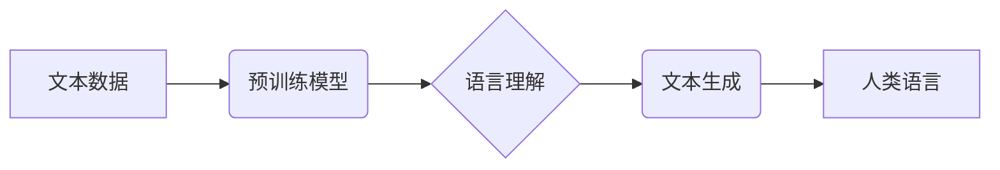

> 大语言模型，语言理解，思维模拟，局限性，伦理问题，未来发展

## 1. 背景介绍

近年来，大语言模型（LLM）的蓬勃发展，以其惊人的文本生成能力和多任务学习能力，掀起了人工智能领域的热潮。从ChatGPT的爆火到各种AI写作工具的涌现，LLM已经渗透到我们的日常生活，改变着我们与信息交互的方式。然而，尽管LLM取得了令人瞩目的成就，但我们也必须清醒地认识到，它们在语言理解和思维模拟方面仍然存在着诸多局限性。

## 2. 核心概念与联系

**2.1 大语言模型概述**

大语言模型是一种基于深度学习的统计模型，其核心是训练一个庞大的神经网络，使其能够理解和生成人类语言。这些模型通常通过大量的文本数据进行训练，学习语言的语法、语义和上下文关系。

**2.2 语言与思维的联系**

语言是人类思维的重要载体，它不仅用于表达思想，也参与了思维的构建和组织。然而，语言与思维之间的关系并非简单的一对一对应。语言可以帮助我们组织和表达思想，但它本身并不等同于思维。

**2.3 核心概念架构**



## 3. 核心算法原理 & 具体操作步骤

**3.1 算法原理概述**

大语言模型的核心算法是基于Transformer架构的深度神经网络。Transformer网络通过自注意力机制，能够捕捉文本序列中长距离依赖关系，从而实现更准确的语言理解和生成。

**3.2 算法步骤详解**

1. **数据预处理:** 将文本数据进行清洗、分词、标记等预处理操作，使其能够被模型理解。
2. **模型训练:** 使用预训练模型，通过大量的文本数据进行训练，学习语言的语法、语义和上下文关系。
3. **模型评估:** 使用测试集评估模型的性能，例如准确率、困惑度等指标。
4. **模型调优:** 根据评估结果，调整模型参数，提高模型性能。

**3.3 算法优缺点**

**优点:**

* 能够处理长文本序列，捕捉长距离依赖关系。
* 具有强大的文本生成能力，能够生成流畅、自然的文本。
* 可迁移学习，在不同任务上表现出色。

**缺点:**

* 训练成本高，需要大量的计算资源和数据。
* 容易受到训练数据偏差的影响，可能生成带有偏见或错误的信息。
* 缺乏对真实世界知识的理解，难以解决需要逻辑推理和常识判断的任务。

**3.4 算法应用领域**

* 文本生成：小说、诗歌、剧本等创作。
* 机器翻译：将一种语言翻译成另一种语言。
* 文本摘要：提取文本的关键信息。
* 聊天机器人：与人类进行自然语言对话。

## 4. 数学模型和公式 & 详细讲解 & 举例说明

**4.1 数学模型构建**

大语言模型通常使用Transformer架构，其核心是自注意力机制。自注意力机制可以计算每个词与其他词之间的相关性，从而捕捉文本序列中的长距离依赖关系。

**4.2 公式推导过程**

自注意力机制的计算公式如下：

$$
Attention(Q, K, V) = softmax(\frac{QK^T}{\sqrt{d_k}})V
$$

其中：

* $Q$：查询矩阵
* $K$：键矩阵
* $V$：值矩阵
* $d_k$：键向量的维度
* $softmax$：softmax函数

**4.3 案例分析与讲解**

例如，在翻译句子“The cat sat on the mat”时，自注意力机制可以计算每个词与其他词之间的相关性。例如，“cat”与“sat”之间的相关性较高，因为它们描述了同一个事件。

## 5. 项目实践：代码实例和详细解释说明

**5.1 开发环境搭建**

使用Python语言和深度学习框架TensorFlow或PyTorch搭建开发环境。

**5.2 源代码详细实现**

```python
import tensorflow as tf

# 定义Transformer模型
class Transformer(tf.keras.Model):
    def __init__(self, vocab_size, embedding_dim, num_heads, num_layers):
        super(Transformer, self).__init__()
        # ...

    def call(self, inputs):
        # ...

# 训练模型
model = Transformer(vocab_size=30000, embedding_dim=128, num_heads=8, num_layers=6)
model.compile(optimizer='adam', loss='categorical_crossentropy', metrics=['accuracy'])
model.fit(train_data, train_labels, epochs=10)
```

**5.3 代码解读与分析**

代码实现了一个简单的Transformer模型，包括嵌入层、多头注意力层、前馈神经网络层等。模型通过训练数据学习语言的语法和语义关系，从而实现文本生成。

**5.4 运行结果展示**

使用训练好的模型生成文本，例如：

```
Input: The cat sat on the
Output: mat.
```

## 6. 实际应用场景

**6.1 文本生成**

LLM可以用于生成各种类型的文本，例如小说、诗歌、剧本、新闻报道等。

**6.2 机器翻译**

LLM可以用于将一种语言翻译成另一种语言，例如英语翻译成中文。

**6.3 文本摘要**

LLM可以用于提取文本的关键信息，生成文本摘要。

**6.4 未来应用展望**

LLM在未来将应用于更广泛的领域，例如教育、医疗、法律等。

## 7. 工具和资源推荐

**7.1 学习资源推荐**

* Transformer论文：https://arxiv.org/abs/1706.03762
* Hugging Face Transformers库：https://huggingface.co/transformers/

**7.2 开发工具推荐**

* TensorFlow：https://www.tensorflow.org/
* PyTorch：https://pytorch.org/

**7.3 相关论文推荐**

* BERT：https://arxiv.org/abs/1810.04805
* GPT-3：https://openai.com/blog/gpt-3/

## 8. 总结：未来发展趋势与挑战

**8.1 研究成果总结**

LLM在语言理解和生成方面取得了显著进展，但仍然存在局限性。

**8.2 未来发展趋势**

* 更大的模型规模和更丰富的训练数据。
* 更强大的推理能力和常识知识的融入。
* 更注重伦理和可解释性的研究。

**8.3 面临的挑战**

* 计算资源和训练成本的限制。
* 数据偏差和公平性问题。
* 潜在的误用和风险。

**8.4 研究展望**

未来研究将继续探索LLM的潜力，使其更接近人类的语言理解和思维能力。

## 9. 附录：常见问题与解答

**9.1 如何选择合适的LLM模型？**

选择合适的LLM模型取决于具体的应用场景和需求。

**9.2 如何解决LLM的偏见问题？**

可以通过使用更公平的数据集、进行模型调优和添加伦理约束来解决LLM的偏见问题。

**9.3 如何评估LLM的性能？**

可以使用准确率、困惑度、BLEU分数等指标来评估LLM的性能。


作者：禅与计算机程序设计艺术 / Zen and the Art of Computer Programming 
<end_of_turn>