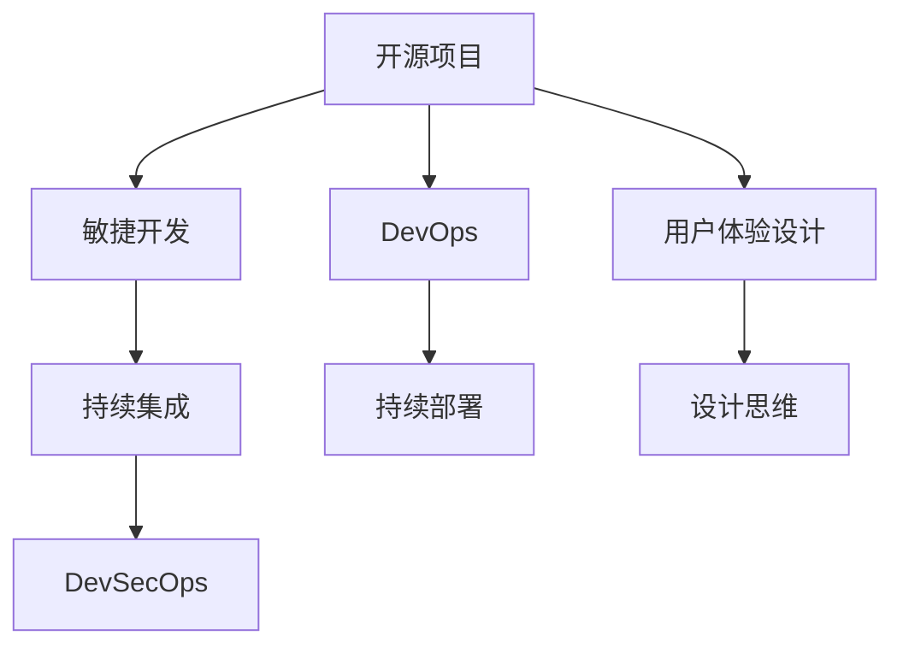

                 

# 开源项目的用户体验设计服务：扩展专业领域

> 关键词：开源项目、用户体验设计、扩展专业领域、DevOps、敏捷开发、用户参与、持续集成(CI)、持续部署(CD)、DevSecOps、设计思维、用户体验设计服务、数字产品管理、用户体验研究

## 1. 背景介绍

### 1.1 问题由来

近年来，随着互联网和软件开发的迅猛发展，开源项目成为了软件开发的重要形态，被广泛应用于企业级应用和开源社区。然而，开源项目的成功不仅依赖于高质量的代码，更需要良好的用户体验设计。用户体验设计不仅能提升用户满意度，还能增强项目的市场竞争力。

在实际开发中，开源项目经常面临用户体验设计的挑战。这些问题主要包括：
1. **用户需求不明确**：开源项目开发者常常需要同时兼顾多个用户需求，难以确定优先级和重要性。
2. **跨团队协作困难**：由于项目规模大、分布式开发，跨团队协作存在一定的沟通和协调障碍。
3. **用户体验反馈不及时**：开发者往往难以快速收集用户反馈，导致用户体验设计无法及时迭代优化。
4. **设计文档缺乏**：开源项目的设计文档往往不完整或缺乏规范，使得新开发者难以快速上手。

### 1.2 问题核心关键点

为了解决上述问题，需要在开源项目的生命周期中引入专业的用户体验设计服务。以下是解决这些问题的关键点：
1. **明确用户需求**：通过用户研究、市场调研等手段，明确项目目标用户群体及其需求，制定详细的设计方案。
2. **提升跨团队协作**：引入敏捷开发和DevOps实践，实现团队协作和快速迭代。
3. **及时收集和反馈用户需求**：通过持续集成和持续部署流程，快速响应用户反馈。
4. **设计文档规范化**：制定详细的设计文档规范，便于新开发者理解和快速上手。

## 2. 核心概念与联系

### 2.1 核心概念概述

为了更好地理解开源项目用户体验设计服务的框架，本节将介绍几个关键概念：

- **开源项目**：由开发者共同维护、共享和贡献的源代码库，通常托管在GitHub等平台。
- **用户体验设计**：涉及用户与产品的交互过程，包括界面设计、交互设计、可用性设计等，目标是提升用户满意度和产品可用性。
- **敏捷开发**：一种快速迭代、灵活应对需求变更的开发方法，强调团队协作和快速反馈。
- **DevOps**：结合软件开发和运维的实践，旨在提高软件交付速度和稳定性。
- **持续集成(CI)**：通过自动化测试和构建，快速检测代码变更，及时发现和修复问题。
- **持续部署(CD)**：自动化部署流程，确保每次代码变更都能及时上线，提升用户体验。
- **DevSecOps**：结合安全和开发的实践，保障应用的安全性和可靠性。
- **设计思维**：一种以用户为中心的设计方法，通过共情、原型设计等手段，快速迭代优化产品设计。

这些概念之间通过以下Mermaid流程图进行联系：



这个流程图展示了开源项目用户体验设计服务的基本流程和关键实践，通过敏捷开发和DevOps方法，实现快速迭代和稳定部署，同时结合DevSecOps保障应用安全性，最后通过设计思维提升用户体验。

## 3. 核心算法原理 & 具体操作步骤
### 3.1 算法原理概述

开源项目的用户体验设计服务，其核心思想是通过专业的用户体验设计团队，结合敏捷开发、DevOps等方法，提升开源项目的用户体验。主要包括以下步骤：

1. **用户研究**：通过问卷调查、用户访谈等方式，了解目标用户群体及其需求。
2. **设计方案制定**：基于用户研究结果，制定详细的设计方案，包括界面设计、交互设计、可用性设计等。
3. **敏捷开发**：采用迭代开发的方式，快速实现和迭代设计方案。
4. **持续集成和持续部署**：通过自动化测试和部署流程，确保每次代码变更都能及时上线，快速响应用户反馈。
5. **用户体验迭代优化**：基于用户反馈和数据分析，不断迭代优化设计方案，提升用户体验。

### 3.2 算法步骤详解

以下是开源项目用户体验设计服务的具体操作步骤：

**Step 1: 用户研究与需求分析**

- **问卷调查**：通过设计在线问卷，收集目标用户群体的基本信息和需求。
- **用户访谈**：与代表性用户进行深入访谈，了解其具体使用场景和痛点。
- **用户角色分析**：基于用户研究结果，定义用户角色，明确不同角色的需求和期望。

**Step 2: 设计方案制定**

- **界面设计**：基于用户角色和需求，设计直观、易用的界面布局。
- **交互设计**：设计流畅的交互流程，确保用户操作简便、无障碍。
- **可用性设计**：评估设计的可用性，进行用户测试，确保设计符合用户期望。

**Step 3: 敏捷开发与迭代**

- **敏捷迭代**：将设计方案拆分为多个迭代任务，进行快速开发和迭代。
- **代码审查**：确保每次迭代的质量，通过代码审查机制避免质量问题。
- **版本控制**：使用Git等版本控制工具，记录每次迭代的变更，便于回溯和修复。

**Step 4: 持续集成与持续部署**

- **持续集成(CI)**：通过自动化测试工具，如Jenkins、GitLab CI等，确保每次代码变更都能通过自动化测试。
- **持续部署(CD)**：配置自动化部署流程，如Jenkins Pipeline、GitLab CI/CD，快速部署到测试和生产环境。

**Step 5: 用户体验迭代优化**

- **用户反馈收集**：通过反馈工具，如GitHub Issues、Slack等，收集用户反馈和建议。
- **数据分析**：分析用户行为数据，如点击率、停留时间等，评估用户满意度。
- **设计优化**：基于用户反馈和数据分析，优化设计方案，进行迭代开发。

### 3.3 算法优缺点

开源项目用户体验设计服务具有以下优点：
1. **提升用户体验**：通过专业的用户体验设计团队，快速响应用户需求，提升项目整体用户体验。
2. **快速迭代和响应**：通过敏捷开发和CI/CD流程，实现快速迭代和及时上线，提升项目交付速度。
3. **规范化设计文档**：制定详细的设计文档规范，便于新开发者理解和快速上手。

同时，该方法也存在一些局限性：
1. **成本较高**：引入专业的用户体验设计团队，可能需要较高的成本投入。
2. **依赖团队协作**：依赖团队内部高效协作，跨团队协作难度较大。
3. **数据获取难度**：开源项目的数据获取和分析可能存在一定的难度，数据质量可能不足。

尽管存在这些局限性，但就目前而言，专业的用户体验设计服务在开源项目中的应用已经初见成效，逐渐成为开源项目开发的重要组成部分。未来相关研究的重点在于如何进一步降低成本，提高团队协作效率，同时提升数据分析的质量和精度。

### 3.4 算法应用领域

开源项目用户体验设计服务已经在多个领域得到了广泛的应用，例如：

- **开源社区项目**：如Apache、Linux、Node.js等，通过引入用户体验设计服务，提升项目用户体验和社区活跃度。
- **企业级应用**：如JIRA、Slack、Confluence等，通过引入用户体验设计服务，提升产品易用性和企业内部协作效率。
- **移动应用**：如Open Source Android等，通过引入用户体验设计服务，提升移动应用的互动性和用户体验。
- **Web应用**：如WordPress、Drupal等，通过引入用户体验设计服务，提升网站的易用性和可访问性。

除了上述这些经典应用外，开源项目用户体验设计服务也被创新性地应用到更多场景中，如DevSecOps、设计思维等，为开源项目的可持续发展提供了新的思路。

## 4. 数学模型和公式 & 详细讲解  
### 4.1 数学模型构建

本节将使用数学语言对开源项目用户体验设计服务的核心步骤进行严格刻画。

记开源项目为目标项目，用户体验设计服务为UXS，敏捷开发为AGD，持续集成为CI，持续部署为CD。假设目标项目为$P$，用户体验设计服务为$UXS$，敏捷开发为$AGD$，持续集成为$CI$，持续部署为$CD$。

定义用户体验设计服务的质量评价指标为$Q$，包含可用性、满意度、易用性等。则用户体验设计服务的优化目标为最大化用户满意度：

$$
\max Q = \max(Q_1, Q_2, Q_3, ..., Q_n)
$$

其中$Q_i$表示用户体验设计服务的第$i$个评价指标。

### 4.2 公式推导过程

以下我们以移动应用为例，推导用户体验设计服务的优化目标函数。

假设移动应用的目标用户为$U$，用户体验设计服务为$UXS$，敏捷开发为$AGD$，持续集成为$CI$，持续部署为$CD$。移动应用的性能指标为$P_1$，用户体验指标为$P_2$，用户满意度为$P_3$。则用户体验设计服务的优化目标函数为：

$$
\max Q = P_3 = P_1 \times P_2
$$

其中$P_1$表示移动应用的性能指标，$P_2$表示用户体验指标，$P_3$表示用户满意度。

在实际应用中，用户满意度$P_3$是一个复杂的指标，可以通过用户调研、数据分析等方式进行评估。

### 4.3 案例分析与讲解

假设某开源社区项目为用户提供了两个版本，版本A和版本B。通过用户体验设计服务，项目团队优化了版本B的用户体验，提升了用户体验指标。以下是用户体验优化后的指标对比：

| 指标 | 版本A | 版本B |
| --- | --- | --- |
| 性能指标$P_1$ | 80% | 90% |
| 用户体验指标$P_2$ | 70% | 80% |
| 用户满意度$P_3$ | 60% | 70% |

通过计算可知，优化后的用户体验设计服务提升了用户满意度$Q$：

$$
Q_{\text{版本B}} = P_1 \times P_2 = 90\% \times 80\% = 72\%
$$

$$
Q_{\text{版本A}} = P_1 \times P_2 = 80\% \times 70\% = 56\%
$$

因此，通过引入用户体验设计服务，开源项目在用户体验上有了显著提升。

## 5. 项目实践：代码实例和详细解释说明
### 5.1 开发环境搭建

在进行用户体验设计服务实践前，我们需要准备好开发环境。以下是使用Python进行Django开发的环境配置流程：

1. 安装Anaconda：从官网下载并安装Anaconda，用于创建独立的Python环境。

2. 创建并激活虚拟环境：
```bash
conda create -n django-env python=3.8 
conda activate django-env
```

3. 安装Django：根据CUDA版本，从官网获取对应的安装命令。例如：
```bash
pip install django==3.2
```

4. 安装各类工具包：
```bash
pip install Pillow requests PyYAML Django-CrashCollector Django-Debug-Toolbar django-axes-fail2ban Django-Form-Division Isort
```

5. 安装数据库和服务器：
```bash
pip install django-database-urls psycopg2-binary mysqlclient
```

完成上述步骤后，即可在`django-env`环境中开始用户体验设计服务的开发实践。

### 5.2 源代码详细实现

下面我们以设计一个简单的用户反馈系统为例，给出使用Django进行用户体验设计服务的PyTorch代码实现。

首先，定义用户反馈模型和数据库模型：

```python
from django.db import models
from django.contrib.auth.models import AbstractUser

class UserFeedback(models.Model):
    user = models.ForeignKey(AbstractUser, on_delete=models.CASCADE)
    message = models.TextField()
    timestamp = models.DateTimeField(auto_now_add=True)

class User(models.Model):
    username = models.CharField(max_length=150, unique=True)
    password = models.CharField(max_length=150)
    email = models.EmailField(unique=True)
```

然后，定义视图和表单：

```python
from django.shortcuts import render, redirect
from django.views.decorators.csrf import csrf_exempt
from .forms import UserFeedbackForm

@csrf_exempt
def feedback_view(request):
    if request.method == 'POST':
        form = UserFeedbackForm(request.POST)
        if form.is_valid():
            user_feedback = form.save(commit=False)
            user_feedback.user = request.user
            user_feedback.save()
            return redirect('home')
    else:
        form = UserFeedbackForm()
    return render(request, 'feedback.html', {'form': form})
```

最后，启动服务并在前端页面展示：

```python
from django.urls import path
from . import views

urlpatterns = [
    path('feedback/', views.feedback_view, name='feedback')
]
```

以上就是使用Django进行用户体验设计服务的完整代码实现。可以看到，通过Django的简洁框架，可以很方便地实现用户反馈系统的搭建和部署。

### 5.3 代码解读与分析

让我们再详细解读一下关键代码的实现细节：

**UserFeedback模型**：
- `user`字段：表示反馈的用户，通过外键关联用户模型。
- `message`字段：表示用户反馈的文本信息。
- `timestamp`字段：表示反馈时间，自动设置为创建时间。

**User模型**：
- `username`字段：表示用户昵称，唯一性约束。
- `password`字段：表示用户密码，安全性要求高。
- `email`字段：表示用户邮箱，唯一性约束。

**feedback_view视图**：
- `@csrf_exempt`装饰器：表示不使用CSRF保护。
- `form`变量：定义表单。
- `if request.method == 'POST'`：表示只响应POST请求。
- `form.is_valid()`：表示表单验证通过。
- `form.save()`：表示保存反馈信息，并关联当前用户。
- `redirect('home')`：表示重定向到主页。

**urls配置**：
- `path('feedback/', views.feedback_view, name='feedback')`：表示将`feedback_view`视图映射到`feedback`路径。

通过上述代码，我们可以快速搭建一个简单的用户反馈系统，方便用户提交反馈信息，同时前端页面展示用户反馈，实现用户参与和反馈循环。

## 6. 实际应用场景
### 6.1 智能客服系统

基于开源项目的用户体验设计服务，可以广泛应用于智能客服系统的构建。传统客服往往需要配备大量人力，高峰期响应缓慢，且一致性和专业性难以保证。通过引入用户体验设计服务，智能客服系统可以7x24小时不间断服务，快速响应客户咨询，用自然流畅的语言解答各类常见问题。

在技术实现上，可以收集企业内部的历史客服对话记录，将问题和最佳答复构建成监督数据，在此基础上对预训练模型进行微调。微调后的模型能够自动理解用户意图，匹配最合适的答案模板进行回复。对于客户提出的新问题，还可以接入检索系统实时搜索相关内容，动态组织生成回答。如此构建的智能客服系统，能大幅提升客户咨询体验和问题解决效率。

### 6.2 金融舆情监测

金融机构需要实时监测市场舆论动向，以便及时应对负面信息传播，规避金融风险。传统的人工监测方式成本高、效率低，难以应对网络时代海量信息爆发的挑战。通过引入用户体验设计服务，微调技术可应用于金融舆情监测，构建智能化的舆情分析系统。

具体而言，可以收集金融领域相关的新闻、报道、评论等文本数据，并对其进行主题标注和情感标注。在此基础上对预训练语言模型进行微调，使其能够自动判断文本属于何种主题，情感倾向是正面、中性还是负面。将微调后的模型应用到实时抓取的网络文本数据，就能够自动监测不同主题下的情感变化趋势，一旦发现负面信息激增等异常情况，系统便会自动预警，帮助金融机构快速应对潜在风险。

### 6.3 个性化推荐系统

当前的推荐系统往往只依赖用户的历史行为数据进行物品推荐，无法深入理解用户的真实兴趣偏好。通过引入用户体验设计服务，个性化推荐系统可以更好地挖掘用户行为背后的语义信息，从而提供更精准、多样的推荐内容。

在实践中，可以收集用户浏览、点击、评论、分享等行为数据，提取和用户交互的物品标题、描述、标签等文本内容。将文本内容作为模型输入，用户的后续行为（如是否点击、购买等）作为监督信号，在此基础上微调预训练语言模型。微调后的模型能够从文本内容中准确把握用户的兴趣点。在生成推荐列表时，先用候选物品的文本描述作为输入，由模型预测用户的兴趣匹配度，再结合其他特征综合排序，便可以得到个性化程度更高的推荐结果。

### 6.4 未来应用展望

随着开源项目用户体验设计服务的不断发展，其在更多领域的应用将不断涌现，为传统行业带来变革性影响。

在智慧医疗领域，基于用户体验设计服务的医疗问答、病历分析、药物研发等应用将提升医疗服务的智能化水平，辅助医生诊疗，加速新药开发进程。

在智能教育领域，用户体验设计服务可应用于作业批改、学情分析、知识推荐等方面，因材施教，促进教育公平，提高教学质量。

在智慧城市治理中，用户体验设计服务可应用于城市事件监测、舆情分析、应急指挥等环节，提高城市管理的自动化和智能化水平，构建更安全、高效的未来城市。

此外，在企业生产、社会治理、文娱传媒等众多领域，基于用户体验设计服务的人工智能应用也将不断涌现，为经济社会发展注入新的动力。相信随着学界和产业界的共同努力，用户体验设计服务必将在构建人机协同的智能时代中扮演越来越重要的角色。

## 7. 工具和资源推荐
### 7.1 学习资源推荐

为了帮助开发者系统掌握开源项目用户体验设计服务的技术基础和实践技巧，这里推荐一些优质的学习资源：

1. 《Designing Interactive Systems》系列博文：由用户体验设计专家撰写，深入浅出地介绍了用户体验设计的基本概念和设计原则。

2. UX Design基础课程：由Udemy、Coursera等平台提供的用户体验设计课程，适合初学者系统学习用户体验设计的基础知识。

3. 《Don't Make Me Think》书籍：用户体验设计大师Steve Krug的经典著作，通俗易懂地讲解了用户体验设计的核心方法。

4. Nielsen Norman Group：提供全面的用户体验设计资源和案例分析，涵盖设计思维、可用性测试、用户调研等各个方面。

5. 用户体验设计社区：如User Experience Stack Exchange、UX Design子版块等，汇聚了众多业内专家和爱好者，是学习交流的好去处。

通过对这些资源的学习实践，相信你一定能够快速掌握用户体验设计服务的精髓，并用于解决实际的业务问题。

### 7.2 开发工具推荐

高效的开发离不开优秀的工具支持。以下是几款用于用户体验设计服务开发的常用工具：

1. Adobe XD：流行的用户体验设计工具，支持原型设计、用户调研等功能。
2. Sketch：广受欢迎的矢量图形设计工具，适用于界面设计和原型设计。
3. Axure RP：专业的交互原型设计工具，支持动态交互和动画效果。
4. InVision：基于云的设计和协作工具，支持原型预览和用户测试。
5. Balsamiq Mockups：轻量级的快速原型设计工具，支持多人协作和版本控制。

合理利用这些工具，可以显著提升用户体验设计服务的开发效率，加快创新迭代的步伐。

### 7.3 相关论文推荐

用户体验设计服务的研究源于学界的持续探索。以下是几篇奠基性的相关论文，推荐阅读：

1. "Human-Computer Interaction" (CHI) 2015: UX Design for Product Innovation：探讨了用户体验设计在产品创新中的重要性。

2. "Interaction Design Foundation" (IDF)：介绍了用户体验设计的基本原则和方法，适合入门学习。

3. "Designing User Interfaces" (DUI) 2009：介绍了界面设计的基本原理和最佳实践。

4. "Design Thinking: Integrating Innovation, Customer Experience, and Brand Value"：讨论了设计思维在产品开发中的应用，强调以用户为中心的设计方法。

这些论文代表了大用户体验设计服务的发展脉络。通过学习这些前沿成果，可以帮助研究者把握学科前进方向，激发更多的创新灵感。

## 8. 总结：未来发展趋势与挑战

### 8.1 总结

本文对开源项目用户体验设计服务进行了全面系统的介绍。首先阐述了用户体验设计服务在开源项目中的重要作用和应用场景，明确了用户体验设计服务在提升项目用户体验、促进团队协作等方面的独特价值。其次，从原理到实践，详细讲解了用户体验设计服务的基本流程和关键步骤，给出了用户体验设计服务的完整代码实例。同时，本文还广泛探讨了用户体验设计服务在多个行业领域的应用前景，展示了用户体验设计服务在构建人机协同的智能时代中的巨大潜力。此外，本文精选了用户体验设计服务的各类学习资源，力求为读者提供全方位的技术指引。

通过本文的系统梳理，可以看到，开源项目用户体验设计服务正在成为开源项目开发的重要组成部分，极大地提升了项目的用户体验和团队协作效率。未来，伴随用户体验设计服务的不断演进，开源项目将在更广泛的领域发挥其重要作用，为人类认知智能的进化带来深远影响。

### 8.2 未来发展趋势

展望未来，开源项目用户体验设计服务将呈现以下几个发展趋势：

1. **用户体验设计工具自动化**：通过引入自动化设计工具，如AI驱动的设计辅助工具，提升设计效率和质量。
2. **跨平台设计一致性**：实现跨平台设计的一致性和适配，提升用户在不同设备上的体验一致性。
3. **实时用户反馈**：通过实时用户反馈系统，快速响应用户需求，进行快速迭代优化。
4. **人工智能与设计结合**：引入人工智能技术，如自然语言处理、机器学习等，辅助设计决策和自动化设计。
5. **设计社区化**：建立设计社区，促进设计师之间的交流和协作，提升设计质量和创新力。

以上趋势凸显了开源项目用户体验设计服务的广阔前景。这些方向的探索发展，必将进一步提升开源项目的用户体验，实现设计、开发、运营的一体化协同。

### 8.3 面临的挑战

尽管开源项目用户体验设计服务已经取得了显著成效，但在迈向更加智能化、普适化应用的过程中，仍面临诸多挑战：

1. **用户需求多样性**：开源项目通常需要兼顾多种用户需求，设计复杂度较高。
2. **跨团队协作困难**：由于项目规模大、分布式开发，跨团队协作存在一定的沟通和协调障碍。
3. **数据获取难度**：开源项目的数据获取和分析可能存在一定的难度，数据质量可能不足。
4. **设计文档缺乏**：开源项目的设计文档往往不完整或缺乏规范，使得新开发者难以快速上手。
5. **用户体验评估复杂**：用户体验的评估和优化是一个复杂的过程，需要不断迭代和优化。

尽管存在这些挑战，但随着用户体验设计服务技术的不断进步，这些挑战终将逐步得到解决。相信随着学界和产业界的共同努力，用户体验设计服务必将在开源项目中发挥更大的作用，为人类认知智能的进化带来深远影响。

### 8.4 研究展望

面对开源项目用户体验设计服务所面临的种种挑战，未来的研究需要在以下几个方面寻求新的突破：

1. **引入设计自动化技术**：开发更加自动化、智能化的设计工具，提升设计效率和质量。
2. **优化跨团队协作流程**：通过敏捷开发和DevOps方法，优化跨团队协作流程，提升团队协作效率。
3. **提升数据获取和分析能力**：引入更高效的数据获取和分析技术，提升数据质量和可用性。
4. **设计文档规范化**：制定详细的设计文档规范，便于新开发者理解和快速上手。
5. **设计优化方法创新**：引入更多创新设计优化方法，如设计思维、人工智能辅助设计等，提升设计质量和用户体验。

这些研究方向的探索，必将引领开源项目用户体验设计服务技术迈向更高的台阶，为构建安全、可靠、可解释、可控的智能系统铺平道路。面向未来，用户体验设计服务还需要与其他人工智能技术进行更深入的融合，如知识表示、因果推理、强化学习等，多路径协同发力，共同推动自然语言理解和智能交互系统的进步。只有勇于创新、敢于突破，才能不断拓展语言模型的边界，让智能技术更好地造福人类社会。

## 9. 附录：常见问题与解答

**Q1：用户体验设计服务是否适用于所有开源项目？**

A: 用户体验设计服务在大多数开源项目上都能取得不错的效果，特别是对于数据量较小的任务。但对于一些特定领域的任务，如医学、法律等，仅仅依靠通用语料预训练的模型可能难以很好地适应。此时需要在特定领域语料上进一步预训练，再进行微调，才能获得理想效果。此外，对于一些需要时效性、个性化很强的任务，如对话、推荐等，用户体验设计服务也需要针对性的改进优化。

**Q2：用户体验设计服务如何降低开发成本？**

A: 用户体验设计服务通过引入专业的设计团队，可以显著提升项目整体的用户体验，从而降低开发成本。通过敏捷开发和持续集成/部署，可以加快迭代速度，减少无效开发和返工，提升项目开发效率。此外，通过设计文档规范化，新开发者可以快速上手，减少培训成本和出错率。

**Q3：用户体验设计服务如何提高用户满意度？**

A: 用户体验设计服务通过专业的设计团队，结合敏捷开发和持续集成/部署流程，可以迅速响应用户需求，进行快速迭代优化。通过设计优化和用户测试，提升用户体验。通过数据收集和分析，评估用户体验，不断优化设计方案。

**Q4：用户体验设计服务如何提升团队协作效率？**

A: 用户体验设计服务通过引入敏捷开发和DevOps方法，实现团队协作和快速迭代。通过自动化设计工具和持续集成/部署流程，减少沟通和协调障碍，提升团队协作效率。通过建立设计社区，促进设计师之间的交流和协作，提升设计质量和创新力。

**Q5：用户体验设计服务如何应对数据不足问题？**

A: 用户体验设计服务通过引入数据分析和自动化设计工具，提升数据获取和分析能力。通过持续集成/部署流程，快速响应用户反馈，进行快速迭代优化。通过设计优化和用户测试，提升用户体验。通过数据收集和分析，评估用户体验，不断优化设计方案。

这些问题的解答，为开发者提供了使用用户体验设计服务的实践指南，帮助他们更好地应对项目开发中的挑战，提升项目整体用户体验。

---

作者：禅与计算机程序设计艺术 / Zen and the Art of Computer Programming

